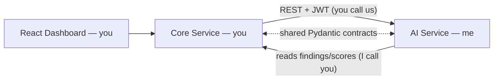

# Core Service — Integration Handoff

> **For:** the teammate who owns the **Core Service** (Platform & Data).
> **From:** the AI Service (Intelligence & Experience).
> **Purpose:** everything you need to build your part so the two services plug
> together cleanly — the **shared data contracts**, the **files** where they're
> defined (the source of truth), the **REST endpoints** and **auth** the AI
> Service expects, and **what the AI Service returns** for the dashboard.

The two services are separated by a **contract, not shared code**. If your JSON
matches the schemas below (exact field names, types, and enum strings), and your
JWT carries the right claims, integration "just works."

---

## 1. Who owns what

| Domain | Owner | Scope |
|--------|-------|-------|
| **Platform & Data (Core Service)** | **You** | Terraform/IaC, cloud connectors (boto3 / Azure SDK / GCP SDK), **resource normalization**, YAML rule base, **Rule Engine**, **compliance scoring**, core backend (**auth/JWT issuance**, **tenancy**, audit trail, **findings/scores API**), React dashboard shell, deployment of the Core Service. |
| **Intelligence (AI Service)** | Me | Explain / map / correlate / price / remediate / report. Consumes your findings & scores over REST; returns AI artefacts. Never scans clouds, never issues auth, never writes your tables. |



**Two integration directions:**
1. **You → AI:** you call the AI endpoints (Phase 6) to enrich/map/price findings; the results feed your dashboard.
2. **AI → You:** the AI Service reads your findings & scores from your REST API to do its work.

Both directions use the **same data contracts** (Section 3) and **your JWT** (Section 5).

---

## 2. The schema files — your source of truth

These files in the AI repo **define the contract**. Treat them as the canonical
spec: mirror them in your service (copy the Pydantic models, or generate types
from our OpenAPI once Phase 6 ships). **Do not invent field names** — use these.

| Contract | File (in this repo) | Type(s) |
|----------|---------------------|---------|
| Normalized cloud resource | `src/complianceiq/domain/entities/resource.py` | `NormalizedResource` |
| **Finding** (your main output) | `src/complianceiq/domain/entities/finding.py` | `Finding`, `EnrichedFinding` |
| Compliance score | `src/complianceiq/domain/entities/score.py` | `ComplianceScore` |
| Correlated risk | `src/complianceiq/domain/entities/risk.py` | `CorrelatedRisk` |
| Financial assessment | `src/complianceiq/domain/entities/financial.py` | `FinancialRiskAssessment` |
| Remediation proposal | `src/complianceiq/domain/entities/remediation.py` | `RemediationProposal` |
| Auth context | `src/complianceiq/domain/entities/auth.py` | `AuthContext` |
| Pagination | `src/complianceiq/domain/entities/pagination.py` | `Page[T]` |
| Citation | `src/complianceiq/domain/value_objects/citation.py` | `Citation` |
| **Enums / allowed values** | `src/complianceiq/domain/value_objects/enums.py` | `CloudProvider`, `Framework`, `RiskDomain`, `Severity`, `ComplianceStatus` |
| Identifier rules | `src/complianceiq/domain/value_objects/identifiers.py` | non-empty `tenant_id`, etc. |
| Error / pagination envelope | `src/complianceiq/presentation/schemas.py` | `ErrorEnvelope`, `ErrorBody` |
| Auth/JWT config we expect | `src/complianceiq/infrastructure/config/settings.py` + `.env.example` | `jwt_audience`, `jwt_issuer`, `jwt_public_key` |

> All models are **Pydantic v2**, immutable, and reject unknown fields
> (`extra="forbid"`). So **extra/misspelled fields will be rejected** — match
> exactly. A quick browse of `docs/` (`ARCHITECTURE.md`, root `README.md` schema
> section) shows the same shapes as tables and diagrams.

---

## 3. The data contracts (with JSON examples)

Field types: `datetime` values are **timezone-aware ISO 8601** (use `Z` or an
offset). `tenant_id` must be **non-empty** (it scopes everything). Money is a
decimal string. Enum fields must use the **exact strings** in Section 4.

### 3.1 `NormalizedResource` — you produce (normalization step)
| Field | Type | Notes |
|-------|------|-------|
| `id` | string | Stable resource id within the tenant (e.g. ARN) |
| `tenant_id` | string | Owning tenant (non-empty) |
| `cloud` | enum `CloudProvider` | `aws` / `azure` / `gcp` |
| `service` | string | e.g. `s3`, `iam`, `storage` |
| `region` | string | e.g. `eu-west-1` |
| `type` | string | e.g. `bucket`, `role` |
| `config` | object | Normalized config (free-form JSON) |
| `collected_at` | datetime | When scanned (UTC) |

```json
{
  "id": "arn:aws:s3:::acme-data",
  "tenant_id": "tenant-acme",
  "cloud": "aws",
  "service": "s3",
  "region": "eu-west-1",
  "type": "bucket",
  "config": { "acl": "public-read", "encryption": null },
  "collected_at": "2026-08-03T10:14:30Z"
}
```

### 3.2 `Finding` — your **main output**; the AI's main input
| Field | Type | Notes |
|-------|------|-------|
| `id` | string | Stable finding id within the tenant |
| `tenant_id` | string | Owning tenant (non-empty) |
| `resource_id` | string | The `NormalizedResource.id` this is about |
| `rule_id` | string | Your rule that produced the verdict |
| `framework` | enum `Framework` | `iso_27001` / `loi_05_20` / `dnssi` / `nist_csf` / `soc_2` |
| `control_id` | string | Control the rule maps to (e.g. `PR.DS-01`, `A.8.24`, `art-5`) |
| `domain` | enum `RiskDomain` | `iam` / `network` / `encryption` / `logging` / `storage` |
| `status` | enum `ComplianceStatus` | `pass` / `fail` |
| `severity` | enum `Severity` | `low` / `medium` / `high` / `critical` |
| `evidence` | object | Rule-engine evidence (matched fields, expected vs actual) |
| `detected_at` | datetime | When the verdict was produced (UTC) |

```json
{
  "id": "finding-abc123",
  "tenant_id": "tenant-acme",
  "resource_id": "arn:aws:s3:::acme-data",
  "rule_id": "s3-bucket-public-read",
  "framework": "nist_csf",
  "control_id": "PR.DS-01",
  "domain": "storage",
  "status": "fail",
  "severity": "high",
  "evidence": { "acl": "public-read", "encryption": "none" },
  "detected_at": "2026-08-03T10:15:00Z"
}
```

### 3.3 `ComplianceScore` — you produce (scoring step)
| Field | Type | Notes |
|-------|------|-------|
| `tenant_id` | string | Owning tenant |
| `scope` | string | What is scored, e.g. `framework`, `domain`, `tenant` |
| `key` | string | The instance, e.g. `nist_csf`, `iam` |
| `score` | number | 0–100 |
| `passed` | int | ≥ 0 |
| `failed` | int | ≥ 0 |
| `computed_at` | datetime | UTC |

```json
{
  "tenant_id": "tenant-acme",
  "scope": "framework",
  "key": "nist_csf",
  "score": 82.5,
  "passed": 33,
  "failed": 7,
  "computed_at": "2026-08-03T10:20:00Z"
}
```

### 3.4 What the AI Service returns (you consume in the dashboard)

**`EnrichedFinding`** = all `Finding` fields **plus**:
| Field | Type | Notes |
|-------|------|-------|
| `explanation` | string | Plain-language, grounded explanation |
| `citations` | array of `Citation` | The controls it's grounded in |
| `citation_verified` | bool | **True only if every citation was verified.** If `false`, show it as unverified. |

**`Citation`**: `{ "framework": "nist_csf", "control_id": "PR.DS-01", "reference": "NIST CSF 2.0 · Data-at-rest protection" }`

**`CorrelatedRisk`**: `{ id, tenant_id, finding_ids: [string], narrative, severity }`

**`FinancialRiskAssessment`**: `{ finding_id | risk_id (exactly one), min_mad, max_mad, rationale, assumptions: [string] }` — amounts are **MAD**, decimal strings; always a **range**, never a single number.

**`RemediationProposal`**: `{ finding_id, terraform, justification, citations, approved: false }` — **`approved` is always `false`.** The AI *proposes*; a human in your platform approves/applies. Never treat a proposal as auto-approved.

```json
{
  "id": "finding-abc123",
  "tenant_id": "tenant-acme",
  "resource_id": "arn:aws:s3:::acme-data",
  "rule_id": "s3-bucket-public-read",
  "framework": "nist_csf", "control_id": "PR.DS-01", "domain": "storage",
  "status": "fail", "severity": "high",
  "evidence": { "acl": "public-read" },
  "detected_at": "2026-08-03T10:15:00Z",
  "explanation": "The bucket is publicly readable and unencrypted, exposing stored data ...",
  "citations": [
    { "framework": "nist_csf", "control_id": "PR.DS-01", "reference": "NIST CSF 2.0 · Data-at-rest protection" },
    { "framework": "iso_27001", "control_id": "A.8.24", "reference": "ISO/IEC 27001:2022 · Use of cryptography" }
  ],
  "citation_verified": true
}
```

---

## 4. Allowed enum values (emit exactly these strings)

Defined in `src/complianceiq/domain/value_objects/enums.py`.

| Enum | Allowed values |
|------|----------------|
| `CloudProvider` | `aws`, `azure`, `gcp` |
| `Framework` | `iso_27001`, `loi_05_20`, `dnssi`, `nist_csf`, `soc_2` |
| `RiskDomain` | `iam`, `network`, `encryption`, `logging`, `storage` |
| `Severity` | `low`, `medium`, `high`, `critical` |
| `ComplianceStatus` | `pass`, `fail` |

`control_id` is a free string, but it should match your framework's real control
identifiers so it lines up with our knowledge base (e.g. NIST `PR.AA-01`, ISO
`A.8.24`, Loi 05-20 `art-5`, DNSSI `DNSSI-NET`, SOC 2 `CC6.1`). The current
knowledge base control ids live in `corpus/frameworks/*.json` — worth aligning to.

---

## 5. Authentication (you issue the JWT; we verify it)

**You** issue the tenant **JWT** (JSON Web Token). **We** only verify it and read
the tenant from its claims — we never issue tokens.

Required token claims (map to `AuthContext` in `domain/entities/auth.py`):
| Claim | Meaning |
|-------|---------|
| `sub` | The authenticated principal (user or service account) |
| `tenant_id` | The tenant the request acts within — **we scope everything by this** |
| `roles` | The principal's roles (for RBAC on our side) |

What we expect (see `.env.example` / `settings.py`):
| Setting | Value we default to | Meaning |
|---------|---------------------|---------|
| `CIQ_JWT_ISSUER` | `complianceiq-core` | Your token's `iss` |
| `CIQ_JWT_AUDIENCE` | `complianceiq` | Your token's `aud` (our API) |
| `CIQ_JWT_PUBLIC_KEY` | *(you provide)* | The **public key** we verify signatures with |

Use asymmetric signing (RS256/ES256) and give us the **public** key (never the
private one). `tenant_id` in the token is authoritative — the request body's
tenant must match it, or we reject it (tenant isolation).

---

## 6. The REST endpoints

### 6.1 Endpoints **you provide** (the AI Service reads from them)
Per the build spec, expose these (versioned, JWT-protected):

| Method | Path | Returns |
|-------|------|---------|
| GET | `/api/v1/findings` | `Page[Finding]` (support filtering by tenant/framework/severity/status + pagination) |
| GET | `/api/v1/findings/{id}` | `Finding` |
| GET | `/api/v1/scores` | `Page[ComplianceScore]` |
| POST | `/api/v1/scans` | trigger a scan (implementation yours) |

`Page[T]` shape: `{ "items": [...], "total": int, "limit": int, "offset": int }`.
We point at your base URL via `CIQ_CORE_API_BASE_URL` (default `http://core-stub:9000`
locally — we ship a stub so we can develop without you; your real service must
match the same contract).

### 6.2 Endpoints **we provide** (you call them — firming up in Phase 6)
All under `/api/v1`, JWT-scoped. The **request/response types are already fixed**
(Section 3); the HTTP surface lands in our Phase 6.

| Method | Path | Body → Response |
|-------|------|-----------------|
| POST | `/ai/enrich` | `{ findings: [Finding] }` → `[EnrichedFinding]` |
| POST | `/ai/map` | `{ finding: Finding }` → multi-framework control mapping |
| POST | `/ai/correlate` | `{ findings: [Finding] }` → `CorrelatedRisk` |
| POST | `/ai/financial` | `{ finding \| risk }` → `FinancialRiskAssessment` (MAD) |
| POST | `/ai/remediate` | `{ finding: Finding }` → `RemediationProposal` (`approved:false`) |
| POST | `/ai/ask` | `{ question, tenant context }` → grounded answer + citations |
| POST | `/ai/report` | async job → `{ job_id }` |
| GET | `/ai/report/{job_id}` | job status / artefact |

**Live today** (you can integration-test against these now): `GET /health`,
`GET /health/ready`, `GET /version`, `GET /docs`, `GET /openapi.json`.

### 6.3 Error shape (both directions)
Every error returns the same envelope (`presentation/schemas.py`):
```json
{ "error": { "code": "not_found", "message": "…", "correlation_id": "…", "details": {} } }
```
Echo the `X-Correlation-ID` request header if present (we use it to trace a request
across both services); we generate one if you don't send it.

---

## 7. How to keep the contracts in sync

Pick one (in order of preference):
1. **Share a tiny `contracts` Python package** — copy the model files from Section
   2 into a package both services import. Zero drift.
2. **Copy the Pydantic models** from Section 2 into your codebase (they only depend
   on Pydantic + stdlib, so they lift cleanly).
3. **Generate types from our OpenAPI** (`/openapi.json`) once Phase 6 ships the
   `/ai/*` endpoints.

When in doubt, the files in Section 2 win. If you need a field added/changed,
tell me — we version the contract together, never unilaterally.

---

## 8. Your deliverables checklist

- [ ] **Cloud connectors** (AWS/Azure/GCP) that collect raw resources.
- [ ] **Normalization** → emit `NormalizedResource` JSON (Section 3.1, exact enums).
- [ ] **Rule engine** (YAML rules) → emit `Finding` JSON (Section 3.2), with
      `framework`/`control_id`/`domain`/`severity`/`status` set to valid values.
- [ ] **Scoring** → emit `ComplianceScore` JSON (Section 3.3).
- [ ] **REST API** (Section 6.1): `GET /api/v1/findings`, `/findings/{id}`,
      `/scores`, `POST /scans` — paginated with `Page[T]`, JWT-protected.
- [ ] **JWT issuance** (Section 5): RS256/ES256, claims `sub`/`tenant_id`/`roles`,
      `iss=complianceiq-core`, `aud=complianceiq`; hand me the **public key**.
- [ ] **Tenancy & audit trail** in the core backend.
- [ ] **React dashboard**: consume `EnrichedFinding`, `CorrelatedRisk`,
      `FinancialRiskAssessment`, `RemediationProposal` from the AI endpoints;
      show `citation_verified` and **never** treat a remediation as auto-applied.
- [ ] **Deployment** of the Core Service.

## 9. Golden rules to keep integration painless
1. **Match field names & enum strings exactly** — unknown/extra fields are rejected.
2. **Always send `tenant_id`** (in the token *and* the data); it scopes everything.
3. **Timestamps are timezone-aware UTC ISO 8601.**
4. **Financial figures are MAD ranges** (`min_mad`/`max_mad`), decimal strings.
5. **A `RemediationProposal` is never auto-applied** — `approved` is always `false`.
6. **If `citation_verified` is `false`,** surface the answer as unverified.
7. **Give me the JWT public key + your API base URL** and I can point our stub at
   your real service.

---

*Questions or a field you need changed? Ping me — we evolve the contract together.
The authoritative definitions are the files in Section 2.*
