<!--
  PHASE 1 STUDY GUIDE — ComplianceIQ AI Service
  A complete, beginner-first learning guide to everything built in Phase 1.
  Written to be read top-to-bottom like a course, and kept as a reference.
-->

# Phase 1 Study Guide — The Foundation

> **Who this is for:** you, if you are new to AI engineering, FastAPI, Clean
> Architecture, and backend development. It assumes **zero** prior knowledge.
> Every technical term is explained the first time it appears.
>
> **Goal:** by the end you can open *any* file in Phase 1 and explain *why it
> exists*, *what it does*, and *how it connects to everything else* — well enough
> to defend it in front of a senior engineer or a PFA jury.
>
> **How to read it:** the first time, go in order. Later, use it as a reference —
> jump to the file or concept you need. Sections 1–7 build the mental model;
> 8–16 go deep on each subsystem; 17–22 make you fluent and ready for Phase 2.

---

## Table of Contents

1. [Introduction](#1-introduction)
2. [Overall Architecture](#2-overall-architecture)
3. [Complete Folder Walkthrough](#3-complete-folder-walkthrough)
4. [File-by-File Walkthrough](#4-file-by-file-walkthrough)
5. [Class-by-Class Walkthrough](#5-class-by-class-walkthrough)
6. [Function-by-Function Walkthrough](#6-function-by-function-walkthrough)
7. [Request Lifecycle](#7-request-lifecycle)
8. [Configuration](#8-configuration)
9. [Logging](#9-logging)
10. [Error Handling](#10-error-handling)
11. [Health Checks](#11-health-checks)
12. [Docker](#12-docker)
13. [Testing](#13-testing)
14. [Security Decisions](#14-security-decisions)
15. [Design Patterns](#15-design-patterns)
16. [Architectural Decisions (ADR)](#16-architectural-decisions-adr)
17. [Things That May Confuse Beginners](#17-things-that-may-confuse-beginners)
18. [Extension Guide](#18-extension-guide)
19. [Learning Exercises](#19-learning-exercises)
20. [Self-Assessment](#20-self-assessment)
21. [Common Mistakes](#21-common-mistakes)
22. [Preparation for Phase 2](#22-preparation-for-phase-2)

---

## 1. Introduction

### 1.1 What is the bigger project?

**ComplianceIQ** is an AI-powered platform that watches a company's cloud
accounts (AWS, Azure, Google Cloud) and continuously checks whether they follow
security and compliance rules. When something is wrong — say, a storage bucket
that anyone on the internet can read — it creates a **finding** (a recorded
problem).

The platform has **two halves**, built by two people:

| Half | Owner | Job |
|------|-------|-----|
| **Core Service** | teammate | Scans the clouds, normalizes the data, runs the rule engine, computes scores, issues login tokens. |
| **AI Service** | **you** (this repo) | Takes each finding and *explains* it, *cites* the exact regulation, *maps* it to frameworks, *estimates* the financial risk, and *proposes* a fix. |

> **Analogy.** The Core Service is a **smoke detector** — it beeps when
> something is wrong. The AI Service is the **fire inspector** who arrives,
> explains *why* it's dangerous, points to the exact building-code article you
> violated, estimates the cost, and hands you a repair plan.

### 1.2 What does "Phase 1" accomplish?

The whole AI Service is huge (an LLM gateway, a retrieval system, AI agents,
risk engines…). You cannot build all of that at once and keep it correct. So the
work is split into **phases**. **Phase 1 is the Foundation.**

Phase 1 does **not** talk to an AI model yet. Instead it builds the **skeleton**
that every future feature will hang on:

- The **shape** of the whole codebase (the four layers of Clean Architecture).
- The **data contracts** — the exact shape of a `Finding`, a `RemediationProposal`,
  etc. — that the AI features will read and produce.
- The **safety rules** baked into the types themselves (a remediation can never
  mark itself "approved"; one customer can never see another's data).
- The **plumbing** every web service needs: configuration, logging, error
  handling, health checks, a container, and a test suite.

### 1.3 Why is it called "Foundation"?

Because of the same reason a building has a foundation: **everything else rests
on it, and you cannot easily change it later.** If the foundation is crooked,
every floor above is crooked. So Phase 1 spends its effort on getting the
*structure* and *rules* exactly right, even though it has no visible "AI" yet.

> **Key idea.** Phase 1 optimizes for **correctness and structure**, not
> features. A boring, rock-solid foundation is a *feature* in enterprise
> software.

### 1.4 What will later phases build on top of it?

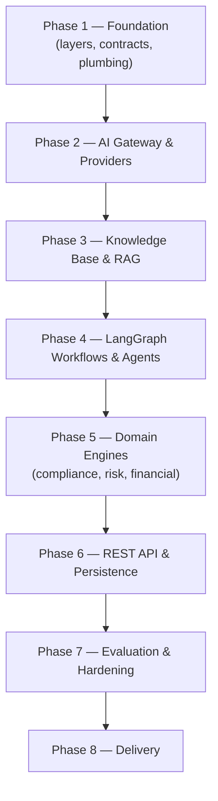

Every later phase adds **adapters** and **use cases** into the *slots* Phase 1
created. None of them rewrites Phase 1 — that is the whole point of a foundation.

### 1.5 Which problems does Phase 1 solve?

| Problem | How Phase 1 solves it |
|---------|-----------------------|
| "Where does new code go?" | Four clearly-named layers + a rule about who may depend on whom. |
| "How do we stop the AI code from being tangled with the web framework and the database?" | Clean Architecture, enforced automatically by a tool (`import-linter`). |
| "How do we guarantee one customer can't see another's data?" | A single tenant-isolation function + tests that prove it. |
| "How do we make sure a proposed fix is never auto-applied?" | The `approved` flag is *forced* to `False` in the type itself. |
| "How do we trace one request through the whole system?" | A correlation ID stamped on every log line. |
| "How do we know the service is alive and ready?" | `/health`, `/health/ready`, `/version` endpoints. |
| "How do we keep quality from decaying?" | Linting, formatting, strict typing, architecture checks, and tests in CI. |

---

## 2. Overall Architecture

### 2.1 What is "Clean Architecture"? (the one big idea)

Imagine an **onion** with four rings. The **center** ring is the most important
and most protected. The rule of the onion is simple and strict:

> **Outer rings may depend on inner rings. Inner rings must never depend on outer
> rings.**

"Depend on" means "import / call / know about". Here are our four rings, from
center outward:

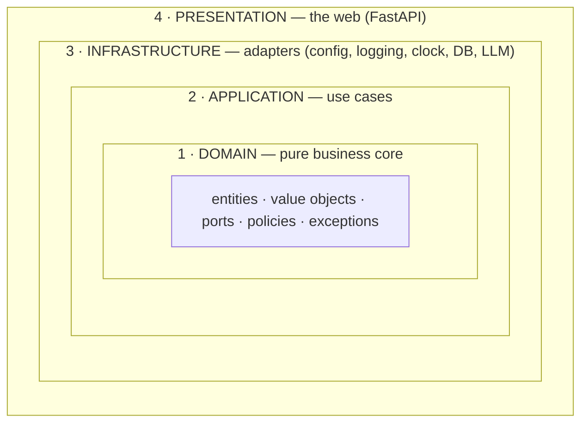

> **Why an onion and not just "folders"?** Because the direction of dependencies
> is a *design decision*, not an accident. The center (business rules) should not
> care whether we use FastAPI or Django, Postgres or MongoDB, Claude or GPT.
> Keeping the center ignorant of those choices is what lets us swap them later
> without a rewrite.

### 2.2 The dependency flow (the golden rule)

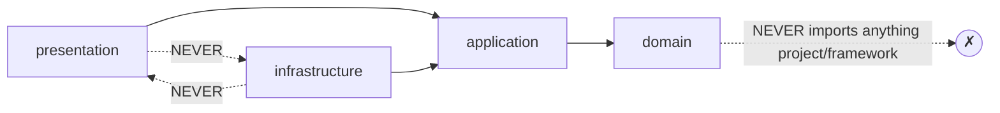

Read it as arrows of **"is allowed to import"**:

- **presentation → application → domain** ✅
- **infrastructure → application → domain** ✅
- **domain → (nothing in the project, no frameworks)** ✅ (it only uses the
  Python standard library and Pydantic)
- **presentation ↔ infrastructure** ❌ (they are *siblings*; they never import
  each other)

This is not a guideline we hope people follow. It is **checked by a robot**
(`import-linter`) on every commit. If you import FastAPI into the domain, the
build fails. (More in §16.)

### 2.3 What each layer is responsible for

| Layer | Package | Responsibility | May import | Example files |
|-------|---------|----------------|-----------|---------------|
| **Domain** | `complianceiq.domain` | The pure business core: what a `Finding` *is*, the safety rules, and the *interfaces* (ports) for outside help. No frameworks. | stdlib, Pydantic | `entities/finding.py`, `policies/tenant_isolation.py` |
| **Application** | `complianceiq.application` | *Use cases* — small objects that orchestrate the domain to get something done. | domain | `services/health.py` |
| **Infrastructure** | `complianceiq.infrastructure` | *Adapters* to the real world: configuration, logging, the clock, (later) the database and the LLM. Each implements a domain **port**. | application, domain | `config/settings.py`, `logging/setup.py`, `clock.py` |
| **Presentation** | `complianceiq.presentation` | The delivery mechanism — HTTP via FastAPI: routes, request/response shapes, error mapping. | application, domain | `routers/health.py`, `errors.py` |

And one special file **outside** all four layers:

- **Composition root** (`composition.py`) — the *only* place allowed to import
  both infrastructure and presentation, because its job is to *wire them
  together*.

### 2.4 Why was this architecture chosen?

| Reason | Plain-English payoff |
|--------|----------------------|
| **Testability** | The business core has no database or network, so you can test it in milliseconds with no setup. |
| **Swappability** | Claude today, another model tomorrow — the domain never knew the difference because it only knows a *port* (an interface). |
| **Clarity** | New engineers learn "what may depend on what" from one config file. |
| **Defensibility** | In your PFA you can say "the core cannot even import a framework — the compiler-level tool forbids it," which is a strong, checkable claim. |

### 2.5 Advantages and trade-offs (be honest)

**Advantages**

- Business rules are isolated, tested, and durable.
- Technology choices (web framework, DB, LLM) are replaceable.
- The structure scales to a big team without turning into spaghetti.

**Trade-offs (the honest cost)**

- **More files and a little indirection.** A tiny app would be shorter as one
  file. We accept this because the project is *not* tiny — it grows to 18
  subsystems.
- **A learning curve.** Ports, adapters, and a composition root are unfamiliar
  at first (that is exactly what §17 fixes).
- **Discipline required.** Without the automated `import-linter` check, the rule
  would erode. That is *why* we automate it.

> **Defense soundbite.** "We paid a small, up-front structural cost to buy
> testability and swappability. And we made the payment *enforceable* so the
> investment can't quietly decay."

---

## 3. Complete Folder Walkthrough

Here is the full Phase 1 tree. Then we explain **every** folder: why it exists,
what belongs in it, what must **never** go in it, and who may talk to it.

```text
LAB-15-SECURITY/
├── src/
│   └── complianceiq/                 ← the Python package (all app code)
│       ├── __init__.py
│       ├── __main__.py               ← "python -m complianceiq" entry
│       ├── asgi.py                   ← the ASGI app object for servers
│       ├── composition.py            ← the composition root (wiring)
│       ├── py.typed                  ← marks the package as typed
│       ├── domain/                   ← LAYER 1: pure business core
│       │   ├── _base.py
│       │   ├── exceptions.py
│       │   ├── entities/             ← the data contracts
│       │   ├── value_objects/        ← small immutable concepts
│       │   ├── ports/                ← interfaces the core needs
│       │   └── policies/             ← shared business rules
│       ├── application/              ← LAYER 2: use cases
│       │   ├── app_info.py
│       │   └── services/
│       ├── infrastructure/           ← LAYER 3: adapters
│       │   ├── clock.py
│       │   ├── config/
│       │   ├── logging/
│       │   └── http/
│       └── presentation/             ← LAYER 4: the web API
│           ├── app.py
│           ├── container.py
│           ├── errors.py
│           ├── schemas.py
│           └── routers/
├── tests/                            ← the test suite (mirrors src layers)
│   ├── conftest.py
│   ├── factories.py
│   └── unit/
│       ├── domain/
│       ├── infrastructure/
│       └── presentation/
├── docs/                             ← documentation & decision records
│   └── ADR/
├── .github/workflows/                ← CI pipeline
├── Dockerfile, docker-compose.yml    ← containerization
├── pyproject.toml                    ← project + tool configuration
├── requirements*.txt                 ← dependency pins
├── .importlinter                     ← architecture rules (enforced)
├── .env.example                      ← configuration template
└── README.md, CHANGELOG.md, LICENSE, CODEOWNERS
```

### 3.1 Why `src/` and not code at the root?

This is the **"src layout"**. Putting the package under `src/` means Python
**cannot accidentally import it from the working directory** — you must install
it (`pip install -e .`). That sounds annoying but it is a *feature*: your tests
run against the **installed** package, exactly like a user would get it, so
"works on my machine because of a stray file in the folder" bugs disappear.

> **Rule of thumb.** `src/` contains *shippable* code only. Tests, docs, and
> config live *outside* `src/`.

### 3.2 `src/complianceiq/` — the package root

**Why it exists:** it is the single importable Python package. Everything the
app does lives here.

**What belongs here (top level):** only cross-cutting "entry" files —
`__init__.py` (package marker + version), `__main__.py` (CLI entry), `asgi.py`
(server entry), `composition.py` (wiring), and `py.typed`.

**What must never go here:** business logic, routes, or adapters. Those belong in
a *layer* sub-package. The top level is just the front door.

### 3.3 `domain/` — Layer 1, the pure core

**Why it exists:** to hold the business truth of the system independent of any
technology. This is the center of the onion.

**What belongs here:** entities (contracts), value objects (small immutable
concepts), ports (interfaces), policies (shared rules), and domain exceptions.

**What must NEVER go here:**
- ❌ `import fastapi`, `import sqlalchemy`, `import anthropic`, `import httpx` …
- ❌ Anything that reads a file, opens a socket, or touches a database.
- ❌ Knowledge of *how* things are delivered or stored.

**Who may talk to it:** everyone (application, infrastructure, presentation).
The domain talks to **no one** in the project.

#### `domain/entities/`
The **data contracts** shared with the Core Service (a `Finding`, an
`EnrichedFinding`, etc.). These are the nouns of the system. Never put logic that
needs a database or network here.

#### `domain/value_objects/`
Small, **immutable**, self-validating concepts that have **no identity** — a
`Citation`, a `Severity`, a `TenantId`. (A `Finding` *has* an id; a `Severity`
is just "high" — two "high"s are interchangeable.)

#### `domain/ports/`
**Interfaces** (Python calls them abstract base classes / protocols) describing
help the core needs from the outside — "give me the current time" (`Clock`),
"check if a dependency is healthy" (`HealthProbe`). The *implementations* live in
infrastructure. This is the heart of "Ports & Adapters".

#### `domain/policies/`
Business **rules** shared by many use cases, written as pure functions — e.g.
`assert_same_tenant`. Putting the rule in one place means it is written once,
tested once, and cannot drift.

### 3.4 `application/` — Layer 2, use cases

**Why it exists:** to *coordinate* the domain to accomplish a task. A use case is
a thin conductor; the domain is the orchestra.

**What belongs here:** use-case classes/services (`ReadinessService`) and
application-level DTOs (`AppInfo`). (A **DTO** = "Data Transfer Object" = a plain
data holder used to pass information between layers. Explained in §17.)

**What must NEVER go here:** ❌ FastAPI, ❌ SQLAlchemy, ❌ any provider SDK.
Application may import the **domain** and nothing outer. Enforced by
`import-linter`.

**Who may talk to it:** presentation and infrastructure. It talks only to domain.

### 3.5 `infrastructure/` — Layer 3, adapters

**Why it exists:** to connect the pure core to the messy real world. Every
"adapter" here implements a domain **port** or provides a cross-cutting service.

**What belongs here:** configuration (`config/`), logging (`logging/`), the
system clock (`clock.py`), HTTP middleware (`http/`), and later the database and
LLM adapters.

**What must NEVER go here:** ❌ business rules (those are domain), ❌ HTTP routes
(those are presentation). Also, infrastructure must **never import
presentation** (they are siblings).

**Who may talk to it:** only the composition root wires it in. Presentation must
not import it directly.

### 3.6 `presentation/` — Layer 4, the web API

**Why it exists:** to translate HTTP into calls on use cases, and results back
into HTTP. It is the "delivery mechanism".

**What belongs here:** the FastAPI app factory (`app.py`), routers
(`routers/`), request/response schemas (`schemas.py`), the error→HTTP mapping
(`errors.py`), and the DI surface (`container.py`).

**What must NEVER go here:** ❌ business logic, ❌ direct database/LLM calls, ❌
`import complianceiq.infrastructure`. Routers should be *thin*.

**Who may talk to it:** the outside world (HTTP clients). It imports application
and domain only.

### 3.7 `tests/` — the safety net

**Why it exists:** to prove the code does what we claim and to stop regressions.
Its sub-folders **mirror** the source layers so you always know where a test
lives.

- `tests/unit/domain/` — tests for the pure core (fast, no I/O).
- `tests/unit/infrastructure/` — tests for adapters and services.
- `tests/unit/presentation/` — tests for the HTTP behavior.
- `tests/integration/` — reserved for tests needing a real DB (used from Phase 6).
- `conftest.py` — shared **fixtures** (reusable test setup).
- `factories.py` — **builders** that create valid domain objects for tests.

**What must never go here:** production code. Tests import the app; the app never
imports the tests.

### 3.8 `docs/` and `docs/ADR/`

**Why they exist:** documentation that travels *with* the code. `ADR/` holds
**Architecture Decision Records** — short notes capturing *why* a big choice was
made, so the reasoning survives even if the author leaves.

### 3.9 `.github/workflows/`

**Why it exists:** to hold the **CI** (Continuous Integration) pipeline — the
robot that re-runs all quality checks on every push, so "green on my machine"
means "green for everyone".

### 3.10 Root config files (quick map)

| File | Purpose |
|------|---------|
| `pyproject.toml` | Project metadata + configuration for every tool (ruff, black, mypy, pytest, coverage). |
| `requirements.txt` / `requirements-dev.txt` | Exact dependency versions (runtime vs. dev). |
| `.importlinter` | The **enforced** Clean Architecture rules. |
| `.env.example` | Template for configuration; copy to `.env` (which is gitignored). |
| `Dockerfile` / `docker-compose.yml` | Build a container; run the local stack. |
| `.pre-commit-config.yaml` | Hooks that run checks before each commit. |
| `README.md` | The friendly entry point. |
| `CHANGELOG.md` | Human history of what changed per phase. |
| `LICENSE`, `CODEOWNERS` | Legal placeholder; who reviews what. |

---

## 4. File-by-File Walkthrough

We go through **every** file. For each: *why it exists*, *what problem it
solves*, *how it interacts*, *who imports it*, and *what breaks if it were
removed*. We start with configuration, then walk the four layers from the center
out.

### 4.1 Project & tooling configuration

#### `pyproject.toml`
- **Why:** the single, standard place that describes the project (name, version,
  dependencies) **and** configures every tool: `ruff` (linter), `black`
  (formatter), `mypy` (type checker), `pytest` (tests), `coverage`.
- **Problem solved:** no scattered `.flake8`, `.isort.cfg`, `mypy.ini` files —
  one file, one source of truth.
- **Interactions:** read by `pip`, `ruff`, `black`, `mypy`, `pytest`. Notably it
  sets `mypy --strict` on `domain` and `application`, and a coverage floor of 85%.
- **If removed:** you cannot install the package, and every tool loses its
  settings. Total breakage.

#### `requirements.txt` and `requirements-dev.txt`
- **Why:** pin the **exact** versions of libraries so every machine and the
  container build the same way. Runtime deps vs. developer/CI tooling are split.
- **Problem solved:** "works on my machine" caused by version drift.
- **Interactions:** used by the `Dockerfile` and CI. `requirements-dev.txt` does
  `-r requirements.txt` then adds test/lint tools.
- **If removed:** non-reproducible builds; the container step fails.

#### `.importlinter`
- **Why:** encodes the Clean Architecture rules as **machine-checkable
  contracts**. This is the *teeth* behind the onion diagram.
- **Problem solved:** architecture rules that decay because humans forget them.
- **Interactions:** run by the `lint-imports` command locally, in pre-commit,
  and in CI. Contains 4 contracts (see §16).
- **If removed:** the architecture is no longer enforced; a future commit could
  import FastAPI into the domain and nobody would notice.

#### `.pre-commit-config.yaml`
- **Why:** run fast checks (whitespace, secret detection, ruff, black,
  import-linter) **before** a commit is created.
- **Problem solved:** catching trivial issues locally instead of in CI.
- **If removed:** you lose the local safety net; CI still catches issues but
  later and slower.

#### `.env.example`
- **Why:** documents every configuration variable with safe placeholder values.
  You copy it to `.env` and fill in real values. `.env` is **gitignored**.
- **Problem solved:** onboarding ("what do I need to configure?") and secret
  safety (real secrets never get committed).
- **Interactions:** mirrored by `infrastructure/config/settings.py`. Docker
  Compose reads `.env`.
- **If removed:** new developers wouldn't know what to configure.

#### `.gitignore` / `.dockerignore`
- **Why:** keep junk and secrets out of git (`.gitignore`) and out of the Docker
  build context (`.dockerignore`). Both explicitly exclude `.env` but keep
  `.env.example`.
- **If removed:** you risk committing secrets/caches, and Docker builds get
  slower and larger.

#### `Dockerfile` / `docker-compose.yml`
- **Why:** package the app into a portable container and run the full local
  stack (app + database). Covered in depth in §12.
- **If removed:** no containerized deployment; `docker compose up` stops working.

#### `.github/workflows/ci.yml`
- **Why:** the CI pipeline. Runs ruff, black, mypy, import-linter, pytest+coverage,
  a dependency audit, and a container build on every push/PR.
- **If removed:** quality gates only run when someone remembers to run them
  locally — i.e., they rot.

#### `README.md`, `CHANGELOG.md`, `LICENSE`, `CODEOWNERS`
- `README.md` — the teaching entry point (setup, architecture overview).
- `CHANGELOG.md` — human-readable history, one section per phase.
- `LICENSE` — a proprietary placeholder for the academic project.
- `CODEOWNERS` — who must review changes; it flags the safety-critical files
  (tenant policy, remediation entity) for extra scrutiny.

### 4.2 Package entry files

#### `src/complianceiq/__init__.py`
- **Why:** marks the directory as a Python package and exposes `__version__`.
- **Interactions:** `__version__` is read by `presentation/app.py`,
  `composition.py`, and the `/version` endpoint.
- **If removed:** the package won't import; version info disappears.

#### `src/complianceiq/py.typed`
- **Why:** an (empty) marker file that tells other tools "this package ships type
  hints — trust them." Part of [PEP 561].
- **If removed:** downstream type-checking of the package weakens. Harmless at
  runtime.

#### `src/complianceiq/__main__.py`
- **Why:** lets you start the server with `python -m complianceiq`. It reads
  settings and launches Uvicorn (the web server) pointed at `asgi:app`.
- **Interactions:** imports `get_settings`; used by the Docker `CMD`.
- **If removed:** `python -m complianceiq` stops working; the container entry
  breaks.

#### `src/complianceiq/asgi.py`
- **Why:** exposes the module-level `app` object that web servers
  (Uvicorn/Gunicorn) import by string (`complianceiq.asgi:app`). It calls
  `build_app()` once.
- **Interactions:** imports `composition.build_app`. Referenced by `__main__.py`.
- **If removed:** servers have no well-known app object to load.

#### `src/complianceiq/composition.py`
- **Why:** the **composition root** — the single place that wires infrastructure
  + presentation together. (Deep dive in §5.)
- **Interactions:** imports from *both* infrastructure and presentation (allowed
  only here). Builds `ApplicationContainer`, calls `create_app`, adds middleware.
- **If removed:** nothing is wired; the app cannot be built. This is the
  keystone file.

### 4.3 Domain — `_base.py` and `exceptions.py`

#### `domain/_base.py`
- **Why:** defines two shared Pydantic base classes: `FrozenModel` (immutable
  value objects & contracts) and `DomainModel` (mutable entities). Both forbid
  unknown fields.
- **Problem solved:** consistent validation behavior across all domain types,
  written once.
- **Who imports it:** nearly every entity and value object.
- **If removed:** every domain model would repeat its config; immutability and
  "forbid extra fields" guarantees would fragment.

#### `domain/exceptions.py`
- **Why:** a typed hierarchy of **domain** errors (`ValidationError`,
  `NotFoundError`, `TenantIsolationError`, `RateLimitError`, `GroundingError`,
  `UnsafeContentError`, …). Each carries a stable `code`, a safe `message`, and
  optional `details`.
- **Problem solved:** the domain expresses failures in *business* terms, never
  HTTP. The presentation layer later maps these to status codes.
- **Who imports it:** `policies/tenant_isolation.py` raises `TenantIsolationError`;
  `presentation/errors.py` maps the whole hierarchy to HTTP.
- **If removed:** errors would leak framework details or become untyped strings;
  the clean error mapping collapses.

### 4.4 Domain — `value_objects/`

#### `value_objects/enums.py`
- **Why:** the system's closed vocabularies as `StrEnum`s: `CloudProvider`,
  `Framework`, `RiskDomain`, `Severity`, `ComplianceStatus`. `Severity` also
  exposes a `.weight` (low=1 … critical=4) for later aggregation.
- **Problem solved:** "stringly-typed" bugs — you cannot pass `"hihg"` where a
  `Severity` is required.
- **Who imports it:** entities (`finding.py`, `risk.py`, `score.py`),
  `citation.py`, and tests/factories.
- **If removed:** entities lose their typed fields; illegal values become
  possible.

#### `value_objects/identifiers.py`
- **Why:** constrained string types — `NonEmptyStr`, `TenantId`, `ResourceId`,
  `ControlId` — that reject empty/whitespace values (and cap length).
- **Problem solved:** an empty `tenant_id` would be catastrophic (it could widen
  a query to all tenants), so it is impossible to construct.
- **Who imports it:** most entities and value objects.
- **If removed:** identifiers become plain `str`; the "no empty tenant" guarantee
  disappears.

#### `value_objects/citation.py`
- **Why:** the `Citation` value object — a reference to a specific control in a
  framework (`framework`, `control_id`, `reference`). It is the atom of the
  system's "every claim is cited" promise.
- **Who imports it:** `finding.py` (`EnrichedFinding`), `remediation.py`, tests.
- **If removed:** the AI's explanations couldn't carry verifiable sources.

#### `value_objects/__init__.py`
- **Why:** re-exports the public value objects so other code can write
  `from complianceiq.domain.value_objects import Severity`.
- **If removed:** imports still work via full paths, but the tidy public surface
  is lost.

### 4.5 Domain — `entities/`

These are the **contracts** from Section 6 of the build spec — the shared shapes
between the AI Service and the Core Service. All are `FrozenModel` (immutable).

| File | Entity | Why it exists / key rule |
|------|--------|--------------------------|
| `resource.py` | `NormalizedResource` | A cloud object flattened into a provider-agnostic shape so downstream logic doesn't branch per cloud. |
| `finding.py` | `Finding`, `EnrichedFinding` | A rule verdict on a resource; `EnrichedFinding` adds the AI `explanation`, `citations`, and the authoritative `citation_verified` flag. |
| `score.py` | `ComplianceScore` | A pass/fail rollup (0–100) for a scope. |
| `risk.py` | `CorrelatedRisk` | Several related findings unified into one attack-path narrative; rejects empty/duplicate `finding_ids`. |
| `financial.py` | `FinancialRiskAssessment` | A monetary **range** (MAD) with rationale + assumptions; enforces *exactly one* subject and `max ≥ min ≥ 0`. |
| `remediation.py` | `RemediationProposal` | A proposed Terraform fix; **`approved` is force-set to `False`** (non-negotiable rule 2). |
| `auth.py` | `AuthContext` | The verified identity + tenant behind a request; carries `has_role`. |
| `pagination.py` | `Page[T]` | A generic list envelope (`items`, `total`, `limit`, `offset`, `has_more`). |
| `__init__.py` | — | Re-exports all entities as the public contract surface. |

- **Who imports them:** application use cases, presentation schemas (later
  phases), tests/factories, and the Core-facing API (later).
- **What breaks if one is removed:** the corresponding capability loses its data
  shape. E.g. removing `remediation.py` removes the structural guarantee that a
  fix can never be auto-approved — a safety regression, not just a compile error.

### 4.6 Domain — `ports/`

#### `ports/clock.py`
- **Why:** the `Clock` interface — "give me the current UTC time". Injecting a
  clock (instead of calling `datetime.now()` directly) makes time deterministic
  in tests.
- **Who implements it:** `infrastructure/clock.py` (`SystemClock`); tests use a
  `FrozenClock`.
- **If removed:** time becomes hidden I/O sprinkled through the code; time-based
  tests become flaky.

#### `ports/health.py`
- **Why:** the `HealthProbe` interface + `HealthResult` value object. Each
  dependency (DB, vector store, LLM, Core API) will be a probe; readiness
  aggregates them.
- **Who uses it:** `application/services/health.py` consumes probes;
  infrastructure will supply concrete ones in later phases.
- **If removed:** readiness cannot describe *which* dependency is down.

#### `ports/__init__.py`
- **Why:** re-exports `Clock`, `HealthProbe`, `HealthResult`.

### 4.7 Domain — `policies/`

#### `policies/tenant_isolation.py`
- **Why:** the single function `assert_same_tenant(...)` that every data-access
  path calls before returning tenant-owned data. It raises `TenantIsolationError`
  on mismatch.
- **Problem solved:** cross-tenant data leaks — the #1 multi-tenant risk. Writing
  the rule **once** means it is tested once and cannot drift between call sites.
- **Who imports it:** any future repository/use case that reads tenant data;
  tested directly in `tests/unit/domain/test_tenant_isolation.py`.
- **If removed:** tenant isolation becomes ad-hoc per call site — exactly the
  fragile situation we refuse to allow.

#### `policies/__init__.py`
- **Why:** re-exports `assert_same_tenant`.

### 4.8 Application layer

#### `application/app_info.py`
- **Why:** a tiny DTO (`AppInfo`) holding `name`, `version`, `environment`. It
  exists so **presentation can report build info without importing
  infrastructure's `Settings`** (which would break the sibling rule). The
  composition root projects `Settings` → `AppInfo`.
- **Who imports it:** `presentation/container.py`, `presentation/routers/health.py`,
  `composition.py`.
- **If removed:** presentation would have to reach into infrastructure config —
  an architecture violation.

#### `application/services/health.py`
- **Why:** the `ReadinessService` use case + its `ReadinessReport` DTO. It runs
  all `HealthProbe`s concurrently and combines them into one ready/not-ready
  verdict.
- **Problem solved:** "is the service *ready* to serve traffic?" (all deps
  reachable) vs. merely "alive".
- **Who imports it:** `presentation/routers/health.py` (via a dependency),
  `composition.py`, tests.
- **If removed:** `/health/ready` has nothing to call.

#### `application/__init__.py`, `application/services/__init__.py`
- **Why:** package markers + public re-exports (`ReadinessService`,
  `ReadinessReport`).

### 4.9 Infrastructure layer

#### `infrastructure/config/settings.py`
- **Why:** the `Settings` class (built on `pydantic-settings`) that loads all
  configuration from environment variables (prefix `CIQ_`) / `.env`, validates
  it once, and freezes it. Secrets use `SecretStr`. Also defines `Environment`
  and `LLMProviderName` enums and the cached `get_settings()`.
- **Problem solved:** twelve-factor configuration + secret hygiene, validated at
  startup so misconfig fails fast.
- **Who imports it:** `composition.py`, `__main__.py`, tests.
- **If removed:** the app has no configuration source; nothing can start.

#### `infrastructure/logging/setup.py`
- **Why:** configures `structlog` to emit **structured** logs — JSON in
  production (for log aggregation and the audit trail), colored console locally.
  Exposes `configure_logging()` and `get_logger()`.
- **Who imports it:** `composition.py` (calls it once at startup),
  `http/middleware.py` (gets a logger).
- **If removed:** logs become unstructured `print`s; the audit trail degrades.

#### `infrastructure/logging/context.py`
- **Why:** correlation-ID plumbing using `contextvars` — `new_correlation_id`,
  `bind_correlation_id`, `bind_tenant`, `clear_context`. This is what stamps one
  ID onto every log line of a single request.
- **Who imports it:** `http/middleware.py`.
- **If removed:** you can't trace a request across log lines — debugging in
  production becomes guesswork.

#### `infrastructure/logging/__init__.py`
- **Why:** re-exports the logging helpers as a tidy surface.

#### `infrastructure/http/middleware.py`
- **Why:** two ASGI middlewares:
  - `CorrelationIdMiddleware` — assigns/propagates a correlation ID, binds
    logging context, writes a structured access log with latency, echoes the ID
    back in the `X-Correlation-ID` header.
  - `RequestSizeLimitMiddleware` — rejects over-large request bodies early with a
    413 error envelope.
- **Why in infrastructure (not presentation)?** Because it adapts the ASGI
  transport + the logging subsystem — both are "outside" concerns. It is attached
  to the app by the composition root, so presentation never imports it.
- **Who imports it:** `composition.py`; tests import it directly.
- **If removed:** no correlation IDs on logs, no request-size protection.

#### `infrastructure/http/__init__.py`
- **Why:** re-exports the middlewares and the `CORRELATION_HEADER` constant.

#### `infrastructure/clock.py`
- **Why:** `SystemClock`, the real implementation of the `Clock` port (returns
  timezone-aware UTC `datetime`).
- **Who imports it:** `composition.py`; tests compare against a `FrozenClock`.
- **If removed:** nothing fulfills the `Clock` port at runtime.

#### `infrastructure/__init__.py`, `infrastructure/config/__init__.py`
- **Why:** package markers + re-exports (`Settings`, `get_settings`, `Environment`,
  `LLMProviderName`).

### 4.10 Presentation layer

#### `presentation/app.py`
- **Why:** the `create_app(container)` **factory** that builds the FastAPI
  instance, registers exception handlers, and includes the health router. It
  knows only the `Container` **protocol**, not concrete infrastructure.
- **Who imports it:** `composition.py`.
- **If removed:** there is no FastAPI app to serve.

#### `presentation/container.py`
- **Why:** defines the structural `Container` **protocol** (what presentation
  needs: `app_info`, `readiness_service`) and the FastAPI dependency providers
  (`get_app_info`, `get_readiness_service`) that read the container off
  `request.app.state`.
- **Problem solved:** lets presentation receive wired services **without importing
  infrastructure** — the composition root's concrete container satisfies the
  protocol structurally.
- **Who imports it:** `app.py`, `routers/health.py`.
- **If removed:** routers have no typed way to reach their services.

#### `presentation/routers/health.py`
- **Why:** the HTTP endpoints `/health`, `/health/ready`, `/version`. Thin: each
  handler calls a dependency and maps the result to a response schema. Readiness
  sets 503 when not ready.
- **Who imports it:** `app.py` (includes the router).
- **If removed:** no operational endpoints; orchestrators can't check the service.

#### `presentation/schemas.py`
- **Why:** the **wire shapes** — `ErrorEnvelope`/`ErrorBody` (the one error
  format), `HealthResponse`, `ReadinessResponse`, `ComponentHealth`,
  `VersionResponse`. Kept separate from domain entities so the public API can
  evolve independently.
- **Who imports it:** `routers/health.py`, `errors.py`.
- **If removed:** responses lose their validated, documented shapes.

#### `presentation/errors.py`
- **Why:** the **single** mapping from domain exceptions → HTTP status +
  `ErrorEnvelope`. `register_exception_handlers(app)` attaches handlers for
  `ComplianceIQError`, FastAPI validation errors, and any unexpected exception
  (sanitized 500).
- **Who imports it:** `app.py`.
- **If removed:** errors would leak stack traces or become inconsistent — a
  security and UX problem.

#### `presentation/app.py`… and the `__init__.py` files
- `presentation/__init__.py`, `presentation/routers/__init__.py` — package
  markers + small re-exports.

### 4.11 Tests

#### `tests/conftest.py`
- **Why:** shared **fixtures** — `settings` (deterministic test config), `app`
  (built from those settings), `client` (a `TestClient`), and the `FrozenClock`
  test double. `conftest.py` is auto-discovered by pytest.
- **If removed:** every test would re-build the app by hand.

#### `tests/factories.py`
- **Why:** builders (`make_finding`, `make_resource`) that produce valid domain
  objects with overridable fields. Add a required field once here, not in 20
  tests.
- **If removed:** tests get verbose and brittle.

#### The unit tests (what each proves)

| File | Proves |
|------|--------|
| `unit/domain/test_remediation.py` | `approved` is always `False` (security gate). |
| `unit/domain/test_tenant_isolation.py` | Cross-tenant access raises; same-tenant passes (security gate). |
| `unit/domain/test_financial.py` | Exactly-one-subject and `max ≥ min ≥ 0` rules. |
| `unit/domain/test_entities.py` | Empty tenant rejected, frozen models, `extra=forbid`, `EnrichedFinding` extends `Finding`, severity ordering, risk duplicates. |
| `unit/domain/test_auth_and_pagination.py` | `has_role`, `Page.has_more`. |
| `unit/infrastructure/test_settings.py` | Safe defaults, `SecretStr` masking, port bounds. |
| `unit/infrastructure/test_health_service.py` | Readiness aggregation incl. a raising probe not being fatal. |
| `unit/infrastructure/test_clock.py` | `SystemClock` returns aware UTC. |
| `unit/infrastructure/test_middleware.py` | Oversized request → 413; normal request passes. |
| `unit/presentation/test_health_api.py` | The three endpoints + correlation-ID header round-trip. |
| `unit/presentation/test_errors.py` | Domain errors → correct status + envelope; 500 is sanitized. |
| `unit/presentation/test_readiness_unhealthy.py` | Readiness returns 503 when a probe is unhealthy. |

- **If a test file is removed:** the corresponding guarantee is no longer
  protected against regressions. The two **security** files are treated as
  non-skippable gates.

---

## 5. Class-by-Class Walkthrough

For each class: its **responsibility**, **design purpose**, **public methods**,
**dependencies**, **lifetime** (how long an instance lives), and a short
**usage** example.

> **What is "lifetime"?** Some objects are created once and reused for the whole
> program (a *singleton*, e.g. `Settings`). Others are created per request
> (short-lived). Knowing an object's lifetime tells you whether it may hold
> mutable state safely.

### 5.1 Base models

#### `FrozenModel` (`domain/_base.py`)
- **Responsibility:** be the immutable, strict base for value objects and
  contracts.
- **Design purpose:** `frozen=True` (can't be changed after creation),
  `extra="forbid"` (unknown fields rejected), `validate_assignment=True`,
  `str_strip_whitespace=True`.
- **Public methods:** inherits Pydantic's (`model_dump`, `model_validate`, …).
- **Dependencies:** Pydantic only.
- **Lifetime:** instances are short-lived data holders; safe to share because
  they can't mutate.
- **Usage:** `class Citation(FrozenModel): ...`

#### `DomainModel` (`domain/_base.py`)
- **Responsibility:** the mutable-but-strict base for entities that legitimately
  change state during a use case.
- **Design purpose:** same strictness as `FrozenModel` minus `frozen`.
- **Note:** in Phase 1 all entities are frozen; `DomainModel` exists for future
  stateful entities.

### 5.2 Value objects

#### The enums: `CloudProvider`, `Framework`, `RiskDomain`, `Severity`, `ComplianceStatus`
- **Responsibility:** define closed vocabularies.
- **Public method of note:** `Severity.weight` → `int` (used later to aggregate
  severities without magic numbers).
- **Lifetime:** enum members are process-wide constants.
- **Usage:** `if finding.severity is Severity.CRITICAL: ...`

#### `Citation`
- **Responsibility:** a verifiable reference to a control (`framework`,
  `control_id`, `reference`).
- **Lifetime:** short-lived, immutable.
- **Usage:** `Citation(framework=Framework.LOI_05_20, control_id="art-23", reference="Article 23")`

### 5.3 Entities (contracts)

Each is a `FrozenModel`. Responsibilities are their data + their validation
rules; they have no behavior methods except a couple of helpers.

| Class | Responsibility | Notable rule / method |
|-------|----------------|------------------------|
| `NormalizedResource` | Describe a normalized cloud resource. | `config: dict` free-form; timestamps must be timezone-aware. |
| `Finding` | A rule verdict on a resource. | All fields typed via value objects. |
| `EnrichedFinding` (extends `Finding`) | Finding + AI explanation + citations. | `citation_verified: bool` is authoritative. |
| `ComplianceScore` | Pass/fail rollup 0–100. | `score` bounded [0,100]; counts ≥ 0. |
| `CorrelatedRisk` | Unify findings into a risk narrative. | Rejects empty & duplicate `finding_ids`. |
| `FinancialRiskAssessment` | MAD exposure range. | `model_validator` enforces one subject + `max ≥ min`. |
| `RemediationProposal` | Proposed Terraform fix. | `field_validator(mode="before")` forces `approved=False`. |
| `AuthContext` | Verified identity + tenant. | `has_role(role) -> bool`. |
| `Page[T]` | Generic list envelope. | `has_more -> bool` property. |

- **Dependencies:** value objects + `FrozenModel`.
- **Lifetime:** short-lived, immutable data crossing boundaries.

### 5.4 Exceptions

#### `ComplianceIQError` (base) and its subclasses
- **Responsibility:** represent business failures with a stable `code`, safe
  `message`, and `details`.
- **Design purpose:** decouple "what went wrong" (domain) from "what HTTP status"
  (presentation). Subclasses: `ValidationError`, `NotFoundError`,
  `AuthenticationError`, `AuthorizationError`, `TenantIsolationError` (subclass of
  `AuthorizationError`), `RateLimitError`, `GroundingError`, `UnsafeContentError`,
  `UnsafeTargetError`, `ProviderError`, `DependencyUnavailableError`.
- **Public members:** `.code`, `.message`, `.details`.
- **Lifetime:** created at the moment of failure, caught by the error handlers.
- **Usage:** `raise NotFoundError("finding not found")`

### 5.5 Ports (interfaces)

#### `Clock` (abstract)
- **Responsibility:** provide "now" as aware UTC.
- **Public method:** `now() -> datetime` (abstract).
- **Implemented by:** `SystemClock`; test `FrozenClock`.

#### `HealthProbe` (abstract) and `HealthResult`
- **Responsibility (`HealthProbe`):** check one dependency; expose `name` and
  `async check() -> HealthResult`.
- **`HealthResult`:** immutable `{name, healthy, detail}`.
- **Implemented by:** concrete probes in later phases; stubs in tests.

### 5.6 Application classes

#### `ReadinessService`
- **Responsibility:** aggregate many `HealthProbe`s into a `ReadinessReport`.
- **Public method:** `async check() -> ReadinessReport`.
- **Dependencies:** a list of `HealthProbe` (injected via constructor).
- **Lifetime:** built once at startup, reused per request.
- **Usage:** `report = await ReadinessService(probes).check()`

#### `ReadinessReport` / `AppInfo`
- **Responsibility:** immutable DTOs carrying results/metadata across the
  boundary. `ReadinessReport{ready, components}`; `AppInfo{name, version,
  environment}`.

### 5.7 Infrastructure classes

#### `Settings` (+ `Environment`, `LLMProviderName`)
- **Responsibility:** typed, validated, frozen configuration loaded from env/.env.
- **Public members:** all the config fields + `is_production` property.
- **Dependencies:** `pydantic-settings`.
- **Lifetime:** **singleton** via `get_settings()` (cached).
- **Usage:** `settings = get_settings(); settings.port`

#### `SystemClock`
- **Responsibility:** the real `Clock` (returns `datetime.now(UTC)`).
- **Lifetime:** built once, stored in the container.

#### `CorrelationIdMiddleware`
- **Responsibility:** per-request correlation ID + access log + response header.
- **Public method:** `async __call__(scope, receive, send)` (the ASGI contract).
- **Dependencies:** logging context helpers + a logger.
- **Lifetime:** one instance wraps the app; runs per request.

#### `RequestSizeLimitMiddleware`
- **Responsibility:** reject bodies larger than `max_bytes` with a 413 envelope.
- **Lifetime:** one instance wraps the app; runs per request.

### 5.8 Presentation classes

#### `Container` (Protocol)
- **Responsibility:** describe *structurally* what presentation needs
  (`app_info`, `readiness_service`) so it doesn't import infrastructure.
- **Design purpose:** Dependency Inversion at the wiring level. Any object with
  those attributes qualifies — no inheritance required.

#### `ApplicationContainer` (in `composition.py`)
- **Responsibility:** the concrete, frozen wired object graph (`settings`,
  `clock`, `app_info`, `readiness_service`). Satisfies `Container` structurally.
- **Lifetime:** one per app build (effectively singleton).

#### The Pydantic response schemas
- `ErrorEnvelope`, `ErrorBody`, `HealthResponse`, `ReadinessResponse`,
  `ComponentHealth`, `VersionResponse` — immutable wire shapes validated by
  FastAPI on the way out.

---

## 6. Function-by-Function Walkthrough

The important functions, with **inputs/outputs**, **internal logic**, **why**,
and **security/performance** notes.

### 6.1 `assert_same_tenant(...)` — `domain/policies/tenant_isolation.py`
- **Inputs:** `expected_tenant_id`, `actual_tenant_id`, `resource_kind` (all
  keyword-only).
- **Output:** `None` on match; raises `TenantIsolationError` on mismatch.
- **Logic:** compare the two ids; if different, raise, putting both ids in
  `details` (for the audit log) but **not** in the message returned to the client.
- **Why this way:** one guard, called everywhere, is impossible to forget in a
  consistent place. Keyword-only args prevent accidentally swapping the two ids.
- **Security:** the beating heart of multi-tenant safety; the foreign tenant id
  is never echoed to the caller.
- **Performance:** a single string comparison — effectively free.

### 6.2 `ReadinessService.check()` — `application/services/health.py`
- **Inputs:** none (probes were injected in the constructor).
- **Output:** `ReadinessReport{ready, components}`.
- **Logic:** if no probes → ready. Otherwise run all probes **concurrently** with
  `asyncio.gather(..., return_exceptions=True)`; convert each result (or a caught
  exception) into a `HealthResult`; `ready = all(healthy)`.
- **Why this way:** concurrency means readiness is as slow as the *slowest*
  probe, not the *sum*. `return_exceptions=True` means one broken probe cannot
  abort the whole check.
- **Security:** probes must return safe details, never secrets.
- **Performance:** parallel I/O; `strict=True` on `zip` guards against silent
  mismatches.

### 6.3 `get_settings()` — `infrastructure/config/settings.py`
- **Inputs:** none.
- **Output:** the singleton `Settings`.
- **Logic:** `@lru_cache(maxsize=1)` ensures the env/.env are read **once**.
- **Why:** configuration should be immutable and read once at startup; caching
  also avoids re-parsing on every request.
- **Performance:** O(1) after first call. Tests clear the cache to inject
  overrides.

### 6.4 `configure_logging(level, json_output)` — `infrastructure/logging/setup.py`
- **Inputs:** log level string; whether to render JSON.
- **Output:** none (configures the global logging system).
- **Logic:** bridges stdlib logging to structlog, installs processors
  (merge context vars → add level → ISO UTC timestamp → stack/exception info →
  renderer). Renderer is JSON or colored console.
- **Why:** one consistent, structured format everywhere; correlation IDs merged
  automatically.
- **Note:** idempotent — safe to call again in tests.

### 6.5 Correlation-ID helpers — `infrastructure/logging/context.py`
- `new_correlation_id() -> str` — a random hex id.
- `bind_correlation_id(id)` / `bind_tenant(id)` — attach values to the async
  context so all later logs include them.
- `clear_context()` — wipe bindings at request end.
- **Why `contextvars`:** they are **async-safe** — each request/task has its own
  isolated copy, so concurrent requests never mix up ids.

### 6.6 `CorrelationIdMiddleware.__call__` — `infrastructure/http/middleware.py`
- **Inputs:** ASGI `scope, receive, send`.
- **Logic:** for HTTP requests: read incoming `X-Correlation-ID` (or generate
  one), bind it, stash it on `scope["state"]`, wrap `send` to add the response
  header and capture the status, time the request, and on completion emit a
  structured access log and clear the context.
- **Why:** every request is traceable end-to-end; the id survives into every log
  line and back to the client.
- **Performance:** negligible (a dict write + a timestamp).

### 6.7 `RequestSizeLimitMiddleware.__call__` — same file
- **Logic:** read `Content-Length`; if it exceeds `max_bytes`, short-circuit with
  a 413 `ErrorEnvelope`; otherwise pass through.
- **Why:** cheap defense against resource-exhaustion (huge-body) attacks, before
  the body is even read.
- **Security:** first line of defense on request size.

### 6.8 `register_exception_handlers(app)` — `presentation/errors.py`
- **Logic:** attaches three handlers:
  1. `ComplianceIQError` → `_status_for()` picks the status (most-specific first),
     returns an `ErrorEnvelope`.
  2. FastAPI `RequestValidationError` → 422 with field details.
  3. `Exception` (catch-all) → sanitized 500 (no leaked detail), correlation id
     included.
- **Why:** one consistent error shape; no stack trace ever reaches a client.
- **Security:** the catch-all is the guard that stops internal details leaking.

### 6.9 `_status_for(error)` — `presentation/errors.py`
- **Input:** a `ComplianceIQError`. **Output:** an HTTP status int.
- **Logic:** iterate an ordered tuple of `(ExceptionType, status)` and return the
  first `isinstance` match; default 500.
- **Why ordered:** `TenantIsolationError` (a subclass of `AuthorizationError`)
  must be matched before its parent — order encodes specificity.

### 6.10 Factory functions — `composition.py`
- `build_container(settings) -> ApplicationContainer` — construct the clock,
  probes (empty in Phase 1), `AppInfo`, and `ReadinessService`.
- `build_app(settings) -> FastAPI` — configure logging, build the container,
  create the app, add middleware in the right order.
- **Why factories:** creation logic lives in one place; tests can build a fully
  wired app with custom settings in one call.

### 6.11 Route handlers — `presentation/routers/health.py`
- `health()` → `HealthResponse{status:"ok", version}`. Cheap, dependency-free.
- `readiness(response, service)` → calls `service.check()`; sets 503 if not
  ready; returns `ReadinessResponse`.
- `version(app_info)` → `VersionResponse{name, version, environment}`.
- **Why thin:** handlers translate HTTP ↔ use case and nothing more.

---

## 7. Request Lifecycle

Let's follow one real request: **`GET /health/ready`**. This shows how the layers
cooperate without the domain ever touching HTTP.

### 7.1 The journey in plain English

1. A client (browser, load balancer, `curl`) sends `GET /health/ready`.
2. **Uvicorn** (the ASGI web server) receives the raw request and hands it to our
   ASGI app.
3. **`CorrelationIdMiddleware`** (outermost) assigns a correlation ID, binds it to
   the logging context, and starts a timer.
4. **`RequestSizeLimitMiddleware`** checks the body size (tiny here) and passes it
   on.
5. **FastAPI routing** matches the path to the `readiness` handler in the health
   router (presentation).
6. FastAPI resolves the handler's **dependencies**: `get_readiness_service` reads
   the `ReadinessService` off `app.state.container`.
7. The handler calls **`service.check()`** (application layer).
8. `ReadinessService` runs its **`HealthProbe`s** (domain ports) concurrently. In
   Phase 1 there are none, so it returns `ready=True` immediately.
9. The handler maps the `ReadinessReport` → `ReadinessResponse`; if not ready it
   sets HTTP 503.
10. The response travels back out. `CorrelationIdMiddleware` adds the
    `X-Correlation-ID` header, logs a structured access line with the latency, and
    clears the context.
11. The client receives `200 {"ready": true, "components": []}`.

> **Notice what did *not* happen:** the domain and application never imported
> FastAPI. If we swapped FastAPI for another framework, steps 7–9 wouldn't change.

### 7.2 Sequence diagram

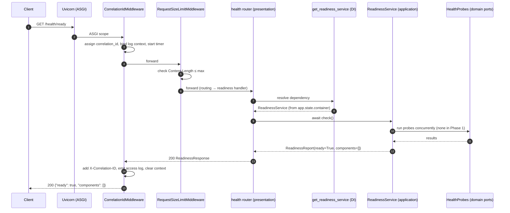

### 7.3 What happens when something fails?

If any layer raises a `ComplianceIQError` (say a future readiness check raised
`DependencyUnavailableError`), the exception bubbles up to the handlers in
`errors.py`, which convert it to the right status + `ErrorEnvelope`, still
carrying the correlation id. An *unexpected* error becomes a sanitized 500. The
middleware still logs the outcome. (Full detail in §10.)

---

## 8. Configuration

### 8.1 The problem configuration solves

Software runs in different places — your laptop, a test server, production. The
*code* is the same; only the *settings* differ (which database, which log
format, which API key). **Configuration** is how we change behavior **without
changing code**. This is one of the "twelve-factor app" principles.

### 8.2 `.env` and `.env.example`

- **`.env.example`** is a committed template listing every setting with safe
  placeholders. You copy it: `cp .env.example .env`.
- **`.env`** holds your real values and is **gitignored** — it never enters git.
- Docker Compose reads `.env` automatically.

> **Analogy.** `.env.example` is the empty form ("Name: ____"). `.env` is your
> filled-in copy that you keep private.

### 8.3 `Settings` — typed configuration

`infrastructure/config/settings.py` defines `Settings`, built on
`pydantic-settings`. Each field maps to an environment variable named
`CIQ_<FIELD>` (e.g. `port` ← `CIQ_PORT`). Pydantic **validates and converts**
values: `CIQ_PORT=abc` fails at startup with a clear message; `CIQ_DEBUG=true`
becomes a real boolean.

```python
class Settings(BaseSettings):
    model_config = SettingsConfigDict(env_prefix="CIQ_", env_file=".env", frozen=True)
    port: int = Field(default=8000, ge=1, le=65535)
    ...
```

- `frozen=True` → settings can't be mutated after load (predictability).
- `port` has bounds → an impossible port is rejected immediately.

### 8.4 `SecretStr` — secret hygiene

Secrets (API keys, DB URLs, JWT keys) are typed `SecretStr`. Two effects:

1. Printing or logging the settings shows `**********`, never the secret.
2. The real value is only reachable via an explicit `.get_secret_value()`.

```python
settings.anthropic_api_key            # SecretStr('**********')
settings.anthropic_api_key.get_secret_value()   # 'the real key'
```

This directly serves non-negotiable rule 5 ("secrets never in source/logs").
There is a test proving the secret does not appear in `repr`/`str`.

### 8.5 Loading and validation flow

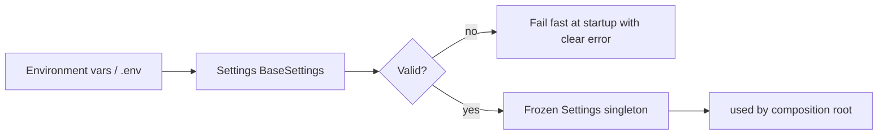

### 8.6 Why configuration is *separated* from code

- **Security:** secrets stay out of source control.
- **Portability:** the same image runs in every environment.
- **Safety:** one validated, immutable object; no scattered `os.getenv` calls
  returning surprise `None`s.
- **Testability:** tests build `Settings(...)` with explicit values, independent
  of your machine's environment.

---

## 9. Logging

### 9.1 What is "structured logging"?

A normal log line is a sentence: `User 5 failed login`. A **structured** log line
is machine-readable data: `{"event": "login_failed", "user_id": 5, "level":
"warning", "timestamp": "..."}`. Computers can filter, search, and alert on
structured logs; sentences they cannot.

We use **structlog** to emit JSON logs in production and pretty console logs
locally (controlled by `CIQ_LOG_JSON`).

### 9.2 What is a "correlation ID"?

When one request touches middleware, a router, a service, and (later) a database
and an LLM, each step may log something. Without a shared key you can't tell
which log lines belong to the *same* request — especially when 100 requests run
at once.

A **correlation ID** is a unique code generated per request and stamped on
**every** log line for that request. To debug, you filter logs by that one id and
see the request's entire story in order.

```json
{"event": "http_request", "method": "GET", "path": "/health/ready",
 "status": 200, "duration_ms": 1.12, "correlation_id": "b6ab…55", "level": "info"}
```

### 9.3 How it's wired

- `CorrelationIdMiddleware` creates/propagates the id and binds it into a
  `contextvar`.
- `configure_logging` installs the `merge_contextvars` processor, so **any** log
  call automatically includes the bound id (and tenant, once bound) — no function
  needs to pass it around.
- The id is also returned to the client in the `X-Correlation-ID` header, so a
  user reporting a problem can quote it and you can find the exact logs.

### 9.4 Why enterprises insist on this

- **Debuggability:** reconstruct any request across services in seconds.
- **Auditability:** non-negotiable rule 7 requires an audit trail (who, what,
  when, model, tokens, latency) — structured logs with correlation IDs are its
  backbone.
- **Alerting:** you can alert on `citation_verification_failed` counts, not on
  grepping sentences.
- **Privacy:** structured fields make it easy to *avoid* logging secrets/PII
  deliberately.

---

## 10. Error Handling

### 10.1 The philosophy: domain speaks business, edge speaks HTTP

The inner layers **never** mention HTTP. They raise **typed domain exceptions**
(`NotFoundError`, `TenantIsolationError`, …). Only the presentation layer
translates those into HTTP status codes and a JSON body. This keeps the core
framework-free and the API consistent.

### 10.2 The `ErrorEnvelope`

Every failure returns the **same** JSON shape:

```json
{
  "error": {
    "code": "not_found",
    "message": "finding not found",
    "correlation_id": "b6ab…55",
    "details": {}
  }
}
```

- `code` — a stable slug clients can branch on (never a stack trace).
- `message` — safe, human-readable.
- `correlation_id` — ties the error to the logs.
- `details` — structured, non-sensitive extra context.

A consistent envelope means client code parses errors one way, everywhere.

### 10.3 How an exception becomes a response

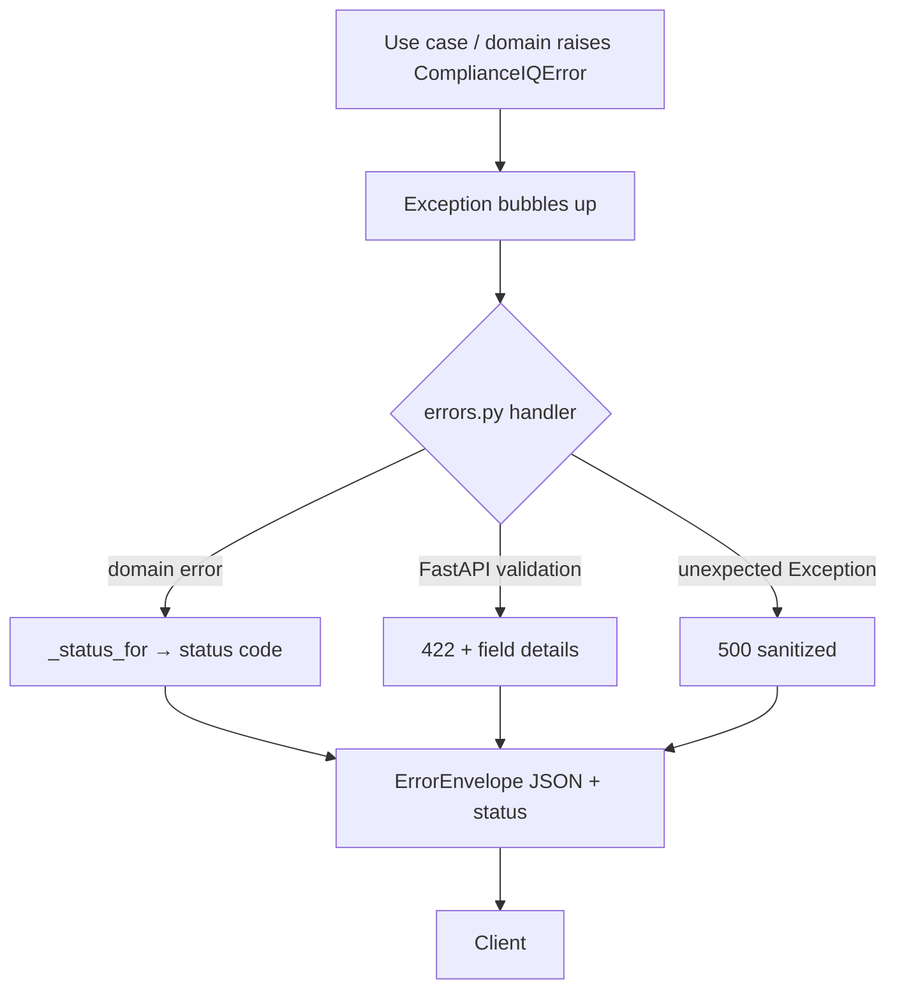

### 10.4 The status mapping (excerpt)

| Domain exception | HTTP status |
|------------------|-------------|
| `ValidationError`, `GroundingError` | 422 |
| `NotFoundError` | 404 |
| `AuthenticationError` | 401 |
| `TenantIsolationError`, `AuthorizationError`, `UnsafeTargetError` | 403 |
| `RateLimitError` | 429 |
| `UnsafeContentError` | 400 |
| `ProviderError` | 502 |
| `DependencyUnavailableError` | 503 |
| anything unexpected | 500 (sanitized) |

### 10.5 Why the sanitized 500 matters (security)

If an unexpected `RuntimeError("DB password = …")` reached the client, that would
leak internals. The catch-all handler returns a generic message + a correlation
id; the *real* cause is logged server-side only. There's a test asserting the raw
message never appears in the response body.

---

## 11. Health Checks

### 11.1 Three endpoints, three questions

| Endpoint | Question it answers | Cost |
|----------|---------------------|------|
| `GET /health` | "Is the process alive?" (**liveness**) | trivial |
| `GET /health/ready` | "Can it serve traffic *right now*?" (**readiness**) | checks dependencies |
| `GET /version` | "Which build is this?" | trivial |

### 11.2 Liveness vs. readiness (the key distinction)

- **Liveness** failing means the process is broken and should be **restarted**.
- **Readiness** failing means the process is fine but a **dependency** (DB, LLM,
  Core API) is down, so it should be **removed from rotation** until it recovers —
  *not* killed.

Mixing these up is a classic bug: if you fail liveness because the DB blinked,
the orchestrator kills a healthy app and makes the outage worse.

### 11.3 Why Kubernetes (and load balancers) need them

Orchestrators like **Kubernetes** call these endpoints automatically:

- **Liveness probe** → restart a hung container.
- **Readiness probe** → decide whether to send this pod traffic. A 503 from
  `/health/ready` pulls the pod out of the load balancer gracefully.

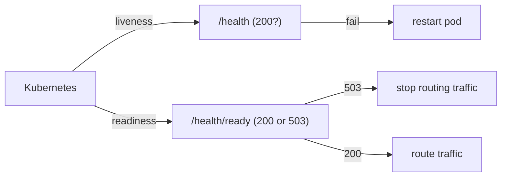

### 11.4 How readiness is built to grow

In Phase 1 there are no external dependencies, so `/health/ready` returns
`ready=true, components=[]`. But the mechanism (`ReadinessService` + `HealthProbe`
port) already exists, so Phase 3/6 just **register probes** for the vector store,
database, LLM provider, and Core API — the endpoint code never changes.

---

## 12. Docker

### 12.1 What is Docker, and why?

A **container** packages your app *and* everything it needs (Python, libraries)
into one portable box that runs identically on any machine. This kills "works on
my machine" for good. A **`Dockerfile`** is the recipe to build the box; an
**image** is the built box; a **container** is a running instance of it.

### 12.2 Multi-stage build (our `Dockerfile`)

Our Dockerfile has **two stages**:

1. **`builder`** — installs dependencies into a virtual environment. This stage
   has compilers and caches.
2. **`runtime`** — a fresh, minimal image that **copies only the finished
   virtualenv** from the builder. Build tools and caches are left behind.

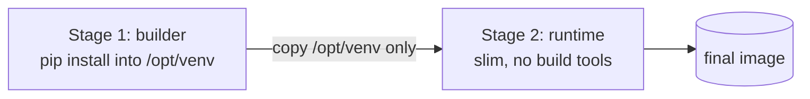

> **Why:** the final image is **smaller** (faster to ship, less attack surface)
> because it doesn't carry the machinery used to build it.

### 12.3 Non-root user (security)

The runtime stage creates an unprivileged user `ciq` and runs as it (`USER ciq`).
If an attacker ever broke into the process, they'd be a nobody user, not `root` —
they couldn't trivially take over the host. This is **least privilege** applied to
containers.

### 12.4 Other security/robustness choices

| Choice | Why |
|--------|-----|
| Pinned base image tag (`python:3.11-slim-bookworm`) | Reproducible builds; slim = fewer packages = less attack surface. |
| `HEALTHCHECK` using stdlib only | The orchestrator can detect an unhealthy container without extra tools installed. |
| `CMD ["python","-m","complianceiq"]` (exec form) | The process is PID 1 and receives `SIGTERM` directly → graceful shutdown. |
| `.dockerignore` excludes tests/docs/`.env` | Smaller, safer build context; secrets never enter the image. |

### 12.5 `docker-compose.yml`

Compose runs a **multi-container stack** with one command. Ours defines:

- **`ai-service`** — built from our Dockerfile, exposes port 8000, has a
  healthcheck, and waits for the database to be healthy (`depends_on … healthy`).
- **`postgres`** — the `pgvector/pgvector:pg16` image (Postgres + the vector
  extension), with a healthcheck and a named volume for data.

```bash
cp .env.example .env
docker compose up --build      # brings up app + database together
```

> Phase 1 doesn't use the database yet, but it's in the stack so Phase 6 plugs in
> without changing the compose topology.

---

## 13. Testing

### 13.1 The testing strategy (the "pyramid")

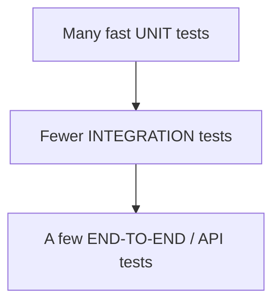

We favor **many small, fast unit tests** (no network, no DB) and fewer slow ones.
The default suite is **deterministic and offline** — no real LLM, no real
database — so it runs in well under a second and never flakes.

### 13.2 Test types and markers

| Marker | Meaning |
|--------|---------|
| `unit` | Fast, isolated, no external deps. |
| `integration` | Needs a real DB/service (from Phase 6). |
| `security` | Tenant isolation, injection, authz — **non-skippable gates**. |
| `live_provider` | Calls a real LLM; excluded by default. |

### 13.3 Fixtures (what and why)

A **fixture** is reusable setup pytest injects into a test by parameter name.
`conftest.py` provides:

- `settings` — deterministic test configuration.
- `app` — a FastAPI app built from those settings.
- `client` — a `TestClient` that calls the app in-process (no real network).
- `FrozenClock` — a `Clock` returning a fixed time for reproducibility.

```python
def test_health_liveness(client):     # 'client' fixture injected automatically
    assert client.get("/health").status_code == 200
```

### 13.4 Factories (what and why)

A **factory** builds a valid domain object with sensible defaults you can
override. `factories.py` has `make_finding(**overrides)` and
`make_resource(**overrides)`. Benefit: when a contract gains a required field,
you update **one** factory, not fifty tests.

### 13.5 Coverage

**Coverage** measures which lines the tests execute. Phase 1 sits at **~97%**,
with the domain and application layers near 100%. The config enforces a floor
(`fail_under = 85`) so coverage can't silently regress. Coverage is a *floor*,
not a goal — 100% coverage of trivial code is less valuable than good tests of the
risky code (which is why the security tests exist).

### 13.6 Why each test group exists (see the table in §4.11 for specifics)

- **Domain tests** protect the *rules* (approved-false, tenant isolation, money
  bounds, immutability).
- **Infrastructure tests** protect the *adapters* (settings hygiene, readiness
  aggregation, clock, size limit).
- **Presentation tests** protect the *contract with clients* (status codes, error
  envelope, correlation header, 503 readiness).

---

## 14. Security Decisions

Phase 1 bakes security into *types and structure*, not just checks you can forget.

| # | Decision | Where | Why it's structural |
|---|----------|-------|---------------------|
| 1 | **Tenant isolation** | `policies/tenant_isolation.py` + security tests | One guard, raises a dedicated error; can't be bypassed by a new call site if used at the data layer. |
| 2 | **`approved=False` enforced** | `entities/remediation.py` | A `before` validator ignores any caller value → a fix can never mark itself approved. |
| 3 | **Secret management** | `Settings` `SecretStr`, `.gitignore` | Secrets masked in logs; `.env` never committed; test proves masking. |
| 4 | **Immutable models** | `FrozenModel` | Validated data can't be mutated later → no "spooky action" after a boundary check. |
| 5 | **Strict validation** | `extra="forbid"`, constrained types | Unknown/empty fields (esp. empty `tenant_id`) are rejected at the boundary. |
| 6 | **No leaked internals** | `errors.py` catch-all | 500s are sanitized; stack traces never reach clients. |
| 7 | **Audit-ready logging** | correlation-ID middleware | Every request traceable; foundation of the audit trail. |
| 8 | **Request-size limit** | `RequestSizeLimitMiddleware` | Early rejection of oversized bodies (resource-exhaustion defense). |
| 9 | **Least privilege** | Dockerfile non-root user | A compromised process is an unprivileged user, not root. |
| 10 | **No mutation capability** | (absence by design) + `UnsafeTargetError` | This service can't change a cloud; the type for gating unsafe targets exists. |

> **Defense soundbite.** "Our safety rules aren't code review conventions —
> they're *types*. To violate 'a remediation is never auto-approved' you'd have to
> delete a validator and a test, which the diff and CODEOWNERS would flag."

---

## 15. Design Patterns

| Pattern | What it is | Where in Phase 1 | Why chosen / alternative |
|---------|------------|------------------|--------------------------|
| **Clean/Hexagonal Architecture** | Concentric layers; dependencies point inward. | The whole `src/` layout. | Testability + swappability. Alt: framework-centric layout (rejected: couples core to FastAPI/DB). |
| **Ports & Adapters** | Core defines interfaces; outside implements. | `Clock`/`HealthProbe` ports; `SystemClock` adapter. | Swap implementations freely. Alt: call libraries directly (rejected: untestable, locked-in). |
| **Dependency Injection** | Give an object its collaborators instead of it creating them. | `ReadinessService(probes)`; FastAPI `Depends`. | Testable, explicit wiring. Alt: global singletons (rejected: hidden coupling). |
| **Composition Root** | One place that builds the whole graph. | `composition.py`. | Visible, single wiring point. Alt: service locator (rejected: hidden, hard to test). |
| **Factory** | A function that builds complex objects. | `build_app`, `build_container`, `create_app`, `make_finding`. | Centralized construction. |
| **DTO / Value Object** | Immutable data holders. | All entities, `AppInfo`, response schemas. | Safe to pass around; validation at edges. |
| **Repository (planned)** | Abstract data access. | Introduced Phase 6; port style already used. | Tenant scoping at the data layer. |
| **Strategy (via routing, planned)** | Pick behavior by configuration. | `LLMProviderName`/model routing in Phase 2. | Data-driven choice, not `if/else`. |
| **Middleware / Decorator** | Wrap behavior around a request. | The two ASGI middlewares. | Cross-cutting concerns in one place. |
| **Protocol (structural typing)** | "If it has these attributes, it fits." | `Container` protocol. | Decouples presentation from infrastructure. |

---

## 16. Architectural Decisions (ADR)

An **ADR** (Architecture Decision Record) is a short note that captures *why* a
significant choice was made, the alternatives considered, and the trade-offs — so
the reasoning survives even if the author leaves. Ours live in `docs/ADR/`.

### ADR-0000 — Record architecture decisions
- **Why created:** to make the "why" of the codebase auditable and presentable.
- **Decision:** every significant choice gets an ADR (Context → Decision →
  Consequences); ADRs are immutable, superseded rather than edited.
- **Payoff:** you can defend any choice at the PFA with a written rationale.

### ADR-0001 — Clean Architecture with automated enforcement
- **Why created:** the AI Service touches many volatile technologies (LLMs,
  vector DB, web framework). Without discipline, business rules get entangled.
- **Decision:** four layers + inward dependency rule, and **enforce it with
  import-linter** in CI/pre-commit.
- **Alternatives rejected:**
  - *Unenforced layering* → decays under deadline pressure.
  - *Framework-first structure* → couples core to FastAPI/SQLAlchemy; testing
    needs a server and DB.
  - *Full heavyweight DDD* → more ceremony than this scope needs.
- **Note:** Pydantic is allowed in the domain (validation without lock-in); this
  is why the flake8-type-checking lint rules are off (Pydantic needs runtime
  annotations).

### ADR-0002 — PostgreSQL + pgvector as a single store
- **Why created:** we need both relational data and vector search for RAG.
- **Decision:** one Postgres with the `pgvector` extension serves both;
  similarity search and SQL metadata filters live in one query and one
  transaction.
- **Alternatives rejected:**
  - *Separate vector DB + Postgres* → two datastores to secure/operate;
    cross-store filtering becomes app plumbing.
  - *In-memory FAISS as the system of record* → no durability, no tenant SQL
    filtering. (FAISS stays useful behind the `VectorStore` port for offline
    evaluation.)
- **Consequence:** we must choose an index (HNSW/IVFFlat) and distance metric
  deliberately in Phase 3.

---

## 17. Things That May Confuse Beginners

Each concept: a one-line definition, an analogy, and where it appears here.

### Dependency Injection (DI)
- **Definition:** give an object the things it needs from outside, instead of it
  creating them itself.
- **Analogy:** a coffee machine that takes *any* water you pour in, rather than
  being welded to one pipe.
- **Here:** `ReadinessService(probes)` receives its probes; FastAPI injects
  services into handlers via `Depends`.
- **Why:** you can inject fakes in tests and swap real implementations freely.

### Port
- **Definition:** an interface the core defines describing help it needs.
- **Analogy:** a wall socket — a fixed shape, indifferent to the power plant.
- **Here:** `Clock`, `HealthProbe`.

### Adapter
- **Definition:** a concrete implementation of a port.
- **Analogy:** the specific charger that plugs into the socket.
- **Here:** `SystemClock` implements `Clock`.

### Domain
- **Definition:** the pure business core — the truths of the problem.
- **Analogy:** the rules of chess, independent of whether you play on wood or an
  app.
- **Here:** `domain/` — entities, value objects, ports, policies.

### Application
- **Definition:** use cases that orchestrate the domain to do something.
- **Analogy:** a recipe that combines ingredients (domain) into a dish.
- **Here:** `ReadinessService`.

### Infrastructure
- **Definition:** adapters to the outside world (DB, logging, config, LLM).
- **Analogy:** the kitchen's plumbing and wiring.
- **Here:** `infrastructure/` — config, logging, clock, http.

### Presentation
- **Definition:** the delivery mechanism (here, HTTP via FastAPI).
- **Analogy:** the waiter who takes orders and brings food; doesn't cook.
- **Here:** `presentation/` — routers, schemas, errors.

### Composition Root
- **Definition:** the single place that builds and wires the whole object graph.
- **Analogy:** the electrician who connects every wire on move-in day.
- **Here:** `composition.py`.

### Factory
- **Definition:** a function/method that builds complex objects for you.
- **Analogy:** a car assembly line — you say "build me a car," it handles the
  parts.
- **Here:** `build_app`, `build_container`, `make_finding`.

### DTO (Data Transfer Object)
- **Definition:** a plain, validated data holder passed between layers.
- **Analogy:** a labeled parcel — just contents, no behavior.
- **Here:** `AppInfo`, `ReadinessReport`, response schemas.

### Value Object
- **Definition:** a small immutable concept defined only by its values (no id).
- **Analogy:** the number "5" — every "5" is the same "5".
- **Here:** `Citation`, `Severity`, `TenantId`.

### Entity
- **Definition:** a domain object with an **identity** that persists over time.
- **Analogy:** *you* — you change, but you're still the same person by id.
- **Here:** `Finding`, `NormalizedResource`.

### Interface (abstract base class / Protocol)
- **Definition:** a contract of methods with no implementation.
- **Analogy:** a job description — lists duties, doesn't name the hire.
- **Here:** `Clock`, `HealthProbe`, the `Container` protocol.

### Repository (coming in Phase 6)
- **Definition:** an object that abstracts data storage/retrieval.
- **Analogy:** a librarian — you ask for a book; you don't know the shelving
  system.
- **Here:** not yet; the port style is already in use so it slots in cleanly.

### ASGI / Middleware
- **Definition:** ASGI is the async standard between a web server (Uvicorn) and
  your app; middleware wraps every request to add cross-cutting behavior.
- **Analogy:** airport security — everyone passes through before boarding.
- **Here:** the correlation-ID and size-limit middlewares.

### `contextvars`
- **Definition:** per-async-task variables that don't leak across tasks.
- **Analogy:** each diner's own tab at a restaurant — orders don't mix.
- **Here:** correlation ID / tenant binding for logging.

---

## 18. Extension Guide

How to add things **without breaking the architecture**. Golden rule: **respect
the dependency direction** — if you're unsure, run `lint-imports`.

### 18.1 Add a new endpoint
1. Define request/response **schemas** in `presentation/schemas.py`.
2. If it needs new behavior, write a **use case** in `application/` (see 18.2).
3. Add a handler to a router in `presentation/routers/` (or a new router file).
4. Include the router in `presentation/app.py`.
5. Add tests in `tests/unit/presentation/`.
- **Don't:** put business logic in the handler; call a use case.

### 18.2 Add a new service (use case)
1. Create `application/services/<name>.py` with a class that receives its
   dependencies via `__init__` (ports, not concretes).
2. Build it in `composition.build_container` and expose it on the container (and
   the `Container` protocol if presentation needs it).
3. Test it with fake ports in `tests/unit/`.
- **Don't:** import FastAPI/SQLAlchemy here — `lint-imports` will fail.

### 18.3 Add a new AI provider (preview of Phase 2)
1. The `LLMProvider` **port** will live in the domain.
2. Create an **adapter** in `infrastructure/providers/<vendor>.py` implementing it.
3. Register it in the composition root / routing config.
4. Add a deterministic fake for tests.
- **Why easy:** the domain only knows the port; the rest of the app never changes.

### 18.4 Add a new domain object
1. Choose value object (immutable, no id → `FrozenModel`) vs. entity (has id).
2. Create the file in `domain/value_objects/` or `domain/entities/`.
3. Re-export it in the package `__init__.py`.
4. Add a factory in `tests/factories.py` and validation tests.
- **Don't:** add framework imports; keep it pure.

### 18.5 Add a new middleware
1. Implement it in `infrastructure/http/middleware.py` (ASGI style).
2. Attach it in `composition.build_app` in the correct order (outermost added
   last).
3. Test it with a tiny FastAPI app in `tests/unit/infrastructure/`.
- **Don't:** put it in presentation — middleware is infrastructure.

### 18.6 Add a new test
1. Put it under the matching `tests/unit/<layer>/` folder.
2. Reuse fixtures (`client`, `settings`) and factories.
3. Mark it (`@pytest.mark.security` etc.) if appropriate.

### 18.7 Add a new configuration value
1. Add a field to `Settings` (with a type, default, and validation).
2. Add the matching line to `.env.example` (empty/placeholder).
3. Use it via `get_settings()` — never `os.getenv` directly.
4. If secret, type it `SecretStr`.

---

## 19. Learning Exercises

Do these in order. **Solutions are intentionally not given** — the struggle is
the learning. Verify with the test suite (`python -m pytest`), the linters, and
`lint-imports`.

### 19.1 Beginner (20)

1. Run the test suite and report how many tests pass.
2. Start the server locally and open `/docs`. List the three endpoints.
3. Call `/health`, `/health/ready`, `/version` with `curl`; record the JSON.
4. Find where `__version__` is defined and change it to `0.1.1`; see it appear in
   `/version`.
5. Add a new `Severity` member `INFO` with weight 0. Update the enum and a test.
6. Explain, in one sentence each, what `frozen=True` and `extra="forbid"` do.
7. Construct a `Citation` in a Python shell; then try to mutate it and observe the
   error.
8. Try to create a `Finding` with `tenant_id=""`; explain the error.
9. List every file in `domain/value_objects/` and say what each defines.
10. Draw (on paper) the four layers and the allowed arrows.
11. Find the line that forces `RemediationProposal.approved` to `False`.
12. Add a new field `region` default to `.env.example` and to `Settings` (as a
    plain `str`), then read it in a Python shell.
13. Change `CIQ_LOG_JSON=false` and observe how the logs look different.
14. Find the correlation-ID header name constant and where it's set on responses.
15. Explain why `/health/ready` returns `components: []` in Phase 1.
16. Add a docstring to any function missing one; run `ruff` to confirm clean.
17. Run `black --check` then `black` and describe what changed (if anything).
18. Identify which layer `SystemClock` lives in and which port it implements.
19. Write a one-paragraph explanation of "liveness vs. readiness".
20. Find the CI file and list the quality gates it runs.

### 19.2 Intermediate (20)

1. Add a `GET /health/live` alias returning the same as `/health`; test it.
2. Write a new domain value object `Money` (amount `Decimal` ≥ 0, currency enum).
3. Add a `HealthProbe` stub that always returns healthy and register it in the
   container; watch `components` grow in `/health/ready`.
4. Make that probe return unhealthy and confirm `/health/ready` returns 503.
5. Add a new domain exception `ConflictError` (HTTP 409) and wire it into
   `errors.py`; test it.
6. Add a `require_role` helper on `AuthContext` that raises `AuthorizationError`
   if a role is missing; test both paths.
7. Write a property-based test (hypothesis) that any `Severity` weight is between
   0 and 4.
8. Add a `X-Request-Start` timing header via a new middleware; test it.
9. Extend `Page[T]` with a `page_number` computed property; test edge cases.
10. Add a `ReadinessService` timeout so a slow probe can't hang readiness.
11. Make `assert_same_tenant` also accept a list of allowed tenants; keep tests
    green.
12. Add a config value `CIQ_MAX_PAGE_SIZE` and validate `Page.limit` against it.
13. Write a test proving two concurrent requests get different correlation IDs.
14. Add a `/version` field `git_sha` fed from an env var; default to `"unknown"`.
15. Introduce a `DomainModel`-based mutable entity and a test showing it can be
    updated (unlike frozen ones).
16. Add an `import-linter` forbidden rule preventing `application` from importing
    `httpx`; confirm it passes.
17. Add a `financial` factory to `tests/factories.py` and use it in a new test.
18. Add a middleware that rejects requests missing a required header on a specific
    path; test allow/deny.
19. Make `configure_logging` add the service name to every log line; verify.
20. Write an integration-style test that boots the app with a failing probe and
    asserts the 503 body shape.

### 19.3 Advanced (10)

1. Design (and stub) the `LLMProvider` port you'd add in Phase 2: methods,
   inputs, outputs, and where the adapter would live. Justify each method.
2. Add a per-tenant in-memory rate limiter as infrastructure and a
   `RateLimitError` path; prove isolation between tenants in a test.
3. Introduce a `Repository` port + an in-memory adapter for `Finding`, enforcing
   `assert_same_tenant` at the data layer; write a cross-tenant denial test.
4. Add OpenTelemetry-style span timing around `ReadinessService.check` behind a
   port, with a no-op default adapter.
5. Replace the ad-hoc status mapping in `errors.py` with a registry that a new
   exception can opt into via a class attribute; keep behavior identical.
6. Add a graceful-shutdown hook that drains in-flight requests; describe how you'd
   test it.
7. Make `Settings` support a JWKS URL (async fetch) for JWT keys behind a port,
   without importing `httpx` into the domain.
8. Add a contract test that fails if any entity gains a field not present in the
   Section 6 contract table.
9. Implement request idempotency keys for a hypothetical expensive POST; describe
   storage and tenant scoping.
10. Write an architecture test (using import-linter or a custom AST check) that
    fails if any router imports a concrete infrastructure module.

---

## 20. Self-Assessment (100 questions)

Answer from memory, then verify against the code. Ordered roughly easy → hard.

**Basics (1–20)**
1. What are the four layers, inner to outer?
2. Which layer may import nothing project/framework?
3. Which two layers must never import each other?
4. What tool enforces the dependency rule?
5. What does `frozen=True` guarantee?
6. What does `extra="forbid"` prevent?
7. What is a value object vs. an entity?
8. Why is `tenant_id` a constrained string, not a plain `str`?
9. Which class forces `approved=False`?
10. What are the three operational endpoints?
11. Liveness vs. readiness — one difference.
12. What header carries the correlation ID?
13. What does `SecretStr` do to a value in logs?
14. Where do configuration values come from?
15. What prefix do our env vars use?
16. What does `get_settings()`'s cache achieve?
17. What is the composition root's unique privilege?
18. What is a port? An adapter?
19. What does `ReadinessService.check()` return?
20. What is the coverage floor?

**Mechanics (21–45)**
21. Why run probes with `asyncio.gather`?
22. Why `return_exceptions=True` there?
23. What happens if a probe raises?
24. How does presentation get services without importing infrastructure?
25. What is the `Container` protocol?
26. Why is middleware in infrastructure, not presentation?
27. In what order are the two middlewares added, and why?
28. How does the correlation ID reach every log line?
29. Why `contextvars` and not a global variable?
30. What does `RequestSizeLimitMiddleware` check, and when?
31. What status does an oversized body get?
32. Which function maps domain errors to HTTP status?
33. Why is `TenantIsolationError` matched before `AuthorizationError`?
34. What does the catch-all exception handler protect against?
35. What fields are in the `ErrorEnvelope`?
36. What does `Page.has_more` compute?
37. What rule does `FinancialRiskAssessment` enforce about its subject?
38. What must be true of `min_mad`/`max_mad`?
39. Why does `CorrelatedRisk` reject duplicate finding ids?
40. What does `Severity.weight` enable?
41. Where is the ISO copyright rule documented?
42. What does `EnrichedFinding` add to `Finding`?
43. What is `citation_verified` and who sets it?
44. What is `AuthContext.has_role` for?
45. Why are entities immutable?

**Design & reasoning (46–75)**
46. Why Clean Architecture for this project specifically?
47. Name two trade-offs of Clean Architecture.
48. Why is Pydantic allowed in the domain?
49. Why are the flake8-type-checking lint rules disabled?
50. Why a single vector+relational store (ADR-0002)?
51. Which alternative to pgvector was rejected, and why?
52. Why enforce architecture in CI instead of code review?
53. What is Dependency Injection and one benefit?
54. What is a factory and why use one?
55. Why separate wire schemas from domain entities?
56. Why does the domain define exceptions but not HTTP status?
57. What is least privilege and where is it applied?
58. Why a multi-stage Docker build?
59. Why run the container as non-root?
60. Why the exec-form `CMD`?
61. Why is `.env` gitignored but `.env.example` committed?
62. Why is readiness separate from liveness for Kubernetes?
63. What makes the test suite deterministic?
64. What is a fixture? A factory? How do they differ?
65. What does the `security` marker signify?
66. Why keep `RemediationProposal.approved` false in *this* service?
67. Why does `assert_same_tenant` use keyword-only args?
68. Why doesn't the tenant error echo the foreign tenant id to the client?
69. What is the "src layout" and one benefit?
70. Why pin dependency versions?
71. What is an ADR and why keep them immutable?
72. What does the `Clock` port buy us in tests?
73. Why is `Settings` frozen?
74. What is structural typing (Protocol) and where is it used?
75. Why is the composition root better than a service locator?

**Advanced / defense (76–100)**
76. Walk through the full lifecycle of `GET /health/ready`.
77. How would you add a new LLM provider without touching the domain?
78. How is tenant isolation made "impossible" rather than "discouraged"?
79. How would an examiner try to break `approved=False`, and why would they fail?
80. If `/health/ready` is slow, where would you look and why?
81. How would you add a database readiness probe?
82. Where would JWT verification live, and why not in the domain?
83. How does the architecture make the AI core testable without an LLM?
84. What would break if presentation imported infrastructure directly?
85. How do you prove no secret is logged?
86. Why is a consistent `ErrorEnvelope` a security feature?
87. How would you add rate limiting per tenant, cleanly?
88. What is the difference between `ProviderError` (502) and
    `DependencyUnavailableError` (503)?
89. How does correlation-ID propagation help across microservices?
90. Why is the domain allowed to depend on Pydantic but not FastAPI?
91. How would you enforce that new entities match the Section 6 contract?
92. What is the risk of an empty `tenant_id`, concretely?
93. How would you introduce async DB access without polluting the domain?
94. Why are health endpoints unauthenticated and tenant-agnostic?
95. How would you roll back an architectural decision properly?
96. What's the plan to keep coverage meaningful, not just high?
97. How does `import-linter` know what's "external"?
98. Why does `build_app` configure logging before building the container?
99. How would you add graceful shutdown, and how would you test it?
100. Give the 30-second elevator pitch for the Phase 1 architecture.

---

## 21. Common Mistakes (and how to avoid them)

| Mistake | Why it's wrong | How to avoid |
|---------|----------------|--------------|
| Importing FastAPI/SQLAlchemy into `domain` or `application` | Breaks the dependency rule; makes the core untestable/locked-in. | Run `lint-imports`; keep frameworks in infrastructure/presentation. |
| Putting business logic in a router | Presentation should be thin; logic becomes untestable without HTTP. | Move it to a use case in `application/`. |
| Importing `infrastructure` from `presentation` (or vice versa) | They're siblings; couples the two adapters. | Use the `Container` protocol; wire at the composition root. |
| Reading config via `os.getenv` scattered around | Unvalidated, surprise `None`s, no single source. | Add a field to `Settings`; use `get_settings()`. |
| Logging a secret or full payload | Leaks sensitive data; violates rule 5/7. | Use `SecretStr`; log fields deliberately. |
| Mutating a "frozen" model | Won't work (raises), or signals a design smell. | Build a new instance; frozen means immutable. |
| Forgetting `tenant_id` on a query | Cross-tenant leak — the worst bug here. | Enforce `assert_same_tenant` at the data layer (Phase 6 repos). |
| Setting `approved=True` on a proposal | Silently ignored (good), but signals misunderstanding. | Remember: humans approve elsewhere; this service only proposes. |
| Catching `Exception` and returning details | Leaks internals to clients. | Let the sanitized catch-all handler do it. |
| Adding a dependency without pinning it | Non-reproducible builds. | Pin in `requirements*.txt`. |
| Skipping tests "to move faster" | Regressions slip in; security gates weaken. | Keep the suite green; treat `security` tests as non-negotiable. |
| Editing an ADR after acceptance | Loses the historical reasoning. | Write a new ADR that supersedes it. |
| Making liveness fail on a dependency outage | Orchestrator kills healthy pods. | Dependencies belong in *readiness*, not liveness. |
| Bloating the Docker image with build tools | Bigger, slower, larger attack surface. | Keep the multi-stage split; copy only the venv. |

---

## 22. Preparation for Phase 2

### 22.1 What you should already understand (checklist)

Before starting Phase 2, be comfortable explaining:

- [ ] The four layers and the inward dependency rule (and how it's enforced).
- [ ] What a **port** and **adapter** are, with our `Clock` example.
- [ ] How **Dependency Injection** and the **composition root** work here.
- [ ] Why the domain is pure and why that helps testing.
- [ ] How configuration, logging (correlation IDs), and error handling flow.
- [ ] The two structural safety rules (`approved=False`, tenant isolation).
- [ ] How to run tests, linters, and `lint-imports`.

If any box is unchecked, re-read the matching section and do its exercises.

### 22.2 New concepts arriving in Phase 2

| Concept | One-line meaning |
|---------|------------------|
| **LLM** (Large Language Model) | The AI (Claude) that generates text. |
| **`LLMProvider` port** | The interface for "generate / stream / embed / count tokens". |
| **Provider adapter** | Claude adapter, a secondary adapter, and a deterministic **fake** for tests. |
| **Model routing** | Choose a model by task (cheap for classification, strong for reasoning). |
| **Fallback chain** | If one provider fails, try the next. |
| **Retries with backoff + jitter** | Retry transient failures, spacing attempts out. |
| **Circuit breaker** | Stop hammering a failing provider for a while. |
| **Rate limiting / quotas** | Cap usage per tenant. |
| **Token accounting & cost** | Count tokens and money per tenant/feature/model. |
| **Caching** | Reuse answers with tenant-scoped, content-addressed keys. |
| **Prompt-injection scanning** | Treat retrieved/external text as untrusted at the gateway. |

### 22.3 How Phase 2 builds on Phase 1

Phase 2 doesn't rewrite anything — it **fills the slots** Phase 1 created:

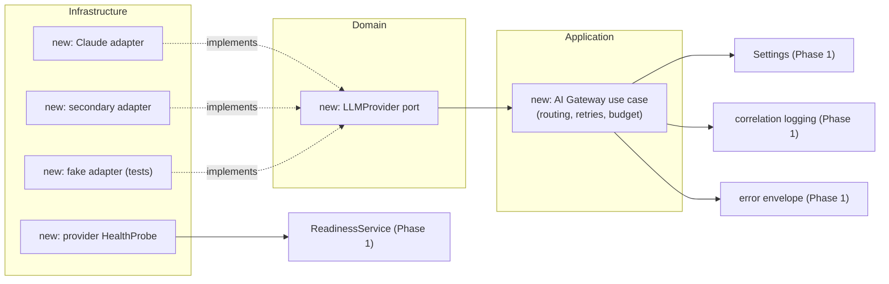

- The **port** goes in the domain (pure).
- The **adapters** go in infrastructure and implement the port.
- The **gateway** use case lives in application and is wired at the **composition
  root** — exactly like `ReadinessService` was.
- It reuses Phase 1's **settings**, **logging/correlation**, **error envelope**,
  and even registers a provider **health probe** into the existing readiness
  service.

That is the entire payoff of a foundation: **new power, zero rewrites.**

---

## Appendix A — One-page mental model

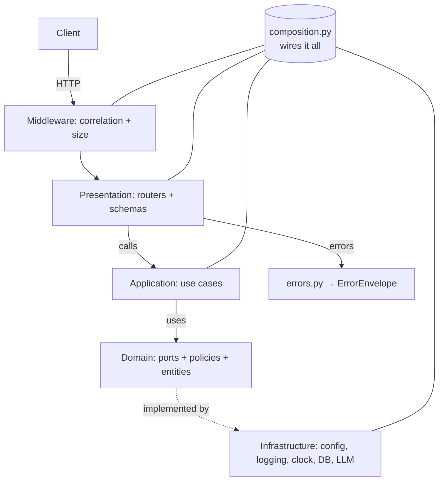

- **Depend inward.** Presentation & infrastructure → application → domain.
- **Wire once.** The composition root is the only place that knows the concretes.
- **Prove it.** `import-linter` + tests keep the rules true.

## Appendix B — Command cheat-sheet

```bash
# setup
cp .env.example .env
python -m pip install -e ".[dev]"

# run
python -m complianceiq                 # serve on :8000
docker compose up --build              # full stack

# quality gates (what CI runs)
python -m pytest --cov=complianceiq    # tests + coverage
python -m ruff check src tests         # lint
python -m black --check src tests      # format
python -m mypy src/complianceiq/domain src/complianceiq/application  # strict types
lint-imports                           # architecture contracts
```

---

*End of the Phase 1 Study Guide. If you can answer §20 and complete §19, you can
defend this architecture with confidence. On to Phase 2.*

