<!--
  PHASE 3 STUDY GUIDE — ComplianceIQ AI Service
  A complete, beginner-first textbook for the Knowledge Base & RAG phase.
-->

# Phase 3 Study Guide — The Knowledge Base & RAG

> **Who this is for:** a motivated beginner. You do **not** need to have mastered
> Phases 1–2. You do **not** need to know what a vector, an embedding, cosine
> similarity, BM25, chunking, reranking, or "grounding" is. We build every idea
> from the ground up.
>
> **How to read it:** straight through the first time. Each chapter follows the
> same rhythm — *Introduction → Prerequisites → Detailed Explanation → How It
> Works → Analogy → Example → Common Mistakes → Key Takeaways → Self-Assessment →
> Connection to Previous Topics* — so you always know where you are.
>
> **The promise:** by the end you will understand, from first principles, what
> RAG is and why it exists, how we turn regulations into searchable knowledge, how
> "hybrid" search finds the right rule, and how we assemble cited evidence an LLM
> can safely answer from — well enough to defend it to a senior engineer or a jury.

---

## What Phase 3 adds (a map to keep open)

```text
src/complianceiq/
├── domain/knowledge/               ← the knowledge vocabulary (pure)
│   ├── documents.py                ← CorpusDocument, ControlSummary
│   ├── chunks.py                   ← Chunk, EmbeddedChunk, ScoredChunk
│   ├── metadata.py                 ← ChunkMetadata, MetadataFilter, Language, Jurisdiction
│   ├── queries.py                  ← RetrievalQuery, RetrievalResult, AssembledContext
│   ├── chunking.py                 ← structure-aware chunker (pure)
│   └── similarity.py               ← cosine / jaccard / tokenize (pure)
├── domain/ports/knowledge.py       ← Embedder, VectorStore, KeywordIndex, Reranker
├── application/knowledge/          ← the RAG use cases
│   ├── ingestion.py                ← write path: chunk → embed → store
│   ├── retrieval.py                ← read path: HybridRetriever
│   ├── fusion.py                   ← Reciprocal Rank Fusion + MMR
│   ├── context_assembly.py         ← pack retrieved chunks into cited context
│   ├── embedder.py                 ← GatewayEmbedder (embeds via the Phase-2 gateway)
│   ├── evaluation.py               ← retrieval metrics (recall@k, precision@k, MRR)
│   └── config.py                   ← RetrievalConfig
├── infrastructure/knowledge/       ← the adapters
│   ├── vector_store_memory.py      ← InMemoryVectorStore (cosine + model guard)
│   ├── keyword_index_memory.py     ← InMemoryKeywordIndex (BM25)
│   ├── reranker_lexical.py         ← LexicalReranker (default, offline)
│   ├── loaders.py                  ← read corpus JSON → CorpusDocument
│   ├── factory.py                  ← build the knowledge stack from settings
│   └── health.py                   ← VectorStoreHealthProbe
├── corpus/frameworks/*.json        ← the copyright-compliant sample corpus
└── scripts/ingest_corpus.py        ← the ingestion CLI
```

## Table of Contents

**Part I — Foundations**
1. [What Phase 3 Is, and Why RAG Exists](#chapter-1--what-phase-3-is-and-why-rag-exists)
2. [The Hallucination Problem and "Grounding"](#chapter-2--the-hallucination-problem-and-grounding)
3. [Vectors, Embeddings, and Cosine Similarity](#chapter-3--vectors-embeddings-and-cosine-similarity)

**Part II — The Knowledge Base (the write path)**
4. [The Knowledge Domain Model](#chapter-4--the-knowledge-domain-model)
5. [Structure-Aware Chunking](#chapter-5--structure-aware-chunking)
6. [The Embedding-Model-Identity Guard](#chapter-6--the-embedding-model-identity-guard)
7. [Ingestion: Turning Regulations into Searchable Knowledge](#chapter-7--ingestion)
8. [The Copyright Policy, Enforced by Shape](#chapter-8--the-copyright-policy-enforced-by-shape)

**Part III — Retrieval (the read path)**
9. [Semantic Search and the Vector Store](#chapter-9--semantic-search-and-the-vector-store)
10. [Lexical Search and BM25](#chapter-10--lexical-search-and-bm25)
11. [Why Hybrid? Reciprocal Rank Fusion](#chapter-11--why-hybrid-reciprocal-rank-fusion)
12. [Reranking](#chapter-12--reranking)
13. [MMR: Diversity in the Results](#chapter-13--mmr-diversity-in-the-results)
14. [Metadata Filtering and Abstention](#chapter-14--metadata-filtering-and-abstention)
15. [The Full Hybrid Retriever](#chapter-15--the-full-hybrid-retriever)

**Part IV — Using and Measuring It**
16. [Context Assembly and Citations](#chapter-16--context-assembly-and-citations)
17. [Retrieval Evaluation](#chapter-17--retrieval-evaluation)
18. [Wiring, Autoload, and Preparing for Phase 4](#chapter-18--wiring-autoload-and-preparing-for-phase-4)

---

# Part I — Foundations

---

## Chapter 1 — What Phase 3 Is, and Why RAG Exists

### 1.1 Introduction
Phase 1 gave the service a skeleton. Phase 2 gave it a *brain* (the AI gateway and
providers) and a *mouth* (it can generate text). But a brain that only knows what
it happened to read during training is dangerous in compliance: it will confidently
invent regulations. **Phase 3 gives the service a *library* and teaches it to look
things up before it speaks.** That discipline is called **RAG**.

### 1.2 Prerequisites
- A vague memory that Phase 2 can call an LLM to generate text. (We recap the risk
  in Chapter 2.)
- No knowledge of search, vectors, or databases is assumed.

### 1.3 Detailed Explanation
**RAG** stands for **Retrieval-Augmented Generation**. Read it right-to-left:

- **Generation** — an LLM writing an answer (Phase 2).
- **Augmented** — we *help* it, rather than trusting its memory.
- **Retrieval** — before it writes, we *retrieve* (look up) the relevant, real
  documents from a knowledge base and hand them to the model, instructing it to
  answer **only** from those documents, **with citations**.

So RAG = "look it up, then answer from what you found, and show your sources."

Phase 3 builds the two halves of that:
1. **The knowledge base (write path)** — take regulations (ISO 27001, Loi 05-20,
   NIST, …), break them into small searchable pieces, and store them so we can
   find them fast.
2. **Retrieval (read path)** — given a question or a finding, find the handful of
   pieces that actually matter.

Phase 3 does **not** yet do the final "generate a cited answer" step end-to-end —
that's Phase 4, which snaps retrieval and generation together. Phase 3 builds and
proves the retrieval engine.

### 1.4 How It Works (bird's-eye)
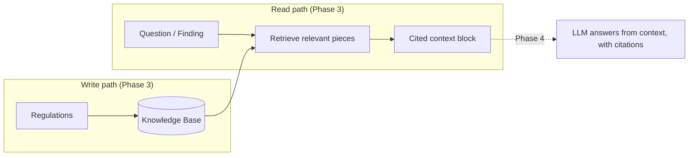

### 1.5 Real-World Analogy
Imagine a **brilliant but overconfident lawyer** who has read thousands of cases
but misremembers details. You would never let them argue in court from memory
alone. Instead you give them a **law library** and a strict rule: *"Before you make
any claim, pull the exact statute, cite it, and argue only from what's on the
page."* RAG is that rule, applied to an LLM. Phase 3 builds the library and the
"go find the right statute" skill.

### 1.6 Example
A finding says: *"S3 bucket `acme-data` is public-read and unencrypted."* Instead
of asking the LLM "is this bad?" (and risking a made-up answer), Phase 3 retrieves
the actual relevant controls — e.g. NIST **PR.DS-01** (data-at-rest protection),
ISO **A.8.24** (use of cryptography), Loi 05-20 **art-5** (data confidentiality) —
and hands them over so Phase 4 can produce a grounded, cited explanation.

### 1.7 Common Mistakes
- **Thinking RAG "teaches" the model new facts.** It doesn't change the model at
  all; it *feeds* the model facts at question time. (The alternative,
  *fine-tuning*, actually retrains the model — see Chapter 2's comparison.)
- **Expecting a full chatbot in Phase 3.** Phase 3 is the retrieval engine; the
  cited-answer flow is Phase 4.

### 1.8 Key Takeaways
- RAG = retrieve real sources first, then generate an answer *from* them, cited.
- Phase 3 builds the knowledge base (write) and retrieval (read); Phase 4 joins
  retrieval to generation.
- The whole point is to replace the model's fallible memory with verifiable
  sources.

### 1.9 Self-Assessment
1. Expand "RAG" and explain each word.
2. Why is trusting an LLM's memory dangerous in a compliance product?
3. What are the two halves Phase 3 builds, and which phase joins them to
   generation?

### 1.10 Connection to Previous Topics
Phase 1 created `EnrichedFinding.citation_verified`; Phase 2 built the gateway that
can `embed` and `generate`. Phase 3 is where those come together: it uses the
gateway's embeddings to build the searchable library that will make citations
*real* rather than hoped-for.

---

## Chapter 2 — The Hallucination Problem and "Grounding"

### 2.1 Introduction
To understand *why* we go to all this trouble, you must feel the problem RAG
solves in your bones. That problem is **hallucination**, and the cure is
**grounding**.

### 2.2 Prerequisites
- Chapter 1 (what RAG is).
- The Phase-2 idea that an LLM predicts *plausible* text, not *true* text.

### 2.3 Detailed Explanation
A **hallucination** is when an LLM produces text that is fluent, confident, and
**wrong** — for example, citing "ISO 27001 control A.99.9" that does not exist, or
misstating what a real control requires. It happens because the model is a
next-word predictor: it generates what *sounds* right, and "sounds right" and "is
right" are not the same thing.

In most apps a hallucination is annoying. In a **compliance** product it is
disqualifying: an auditor who catches one invented regulation stops trusting the
whole system. So we cannot ship a product that "usually" gets regulations right.

**Grounding** is the fix. To *ground* an answer means to tie every claim in it to a
specific piece of retrieved, real source text. Instead of "answer from your
memory," we say: "here are the exact relevant sources; answer using **only** these,
and cite them." If the sources don't cover the question, the correct behaviour is to
**abstain** — say "not covered by the provided sources" — rather than guess. (In
our code, an empty retrieval result is the abstain signal; Chapter 14.)

**Why not just fine-tune the model on the regulations instead?** *Fine-tuning*
means continuing to train the model on your data so the knowledge is baked into its
weights. It's the wrong tool here for several reasons:
- It still **hallucinates** — baked-in knowledge is still fuzzy memory, not a
  verifiable citation.
- Regulations **change**; re-training for every update is slow and expensive,
  whereas RAG just re-ingests a file.
- It can't easily say **"I don't know"** or point to a source.
- It's **opaque** — you can't audit *why* it said something.

RAG keeps the knowledge *outside* the model, where it's current, citable, and
auditable. (This is a classic exam question — see Chapter 18.)

### 2.4 How It Works (grounding in our pipeline)
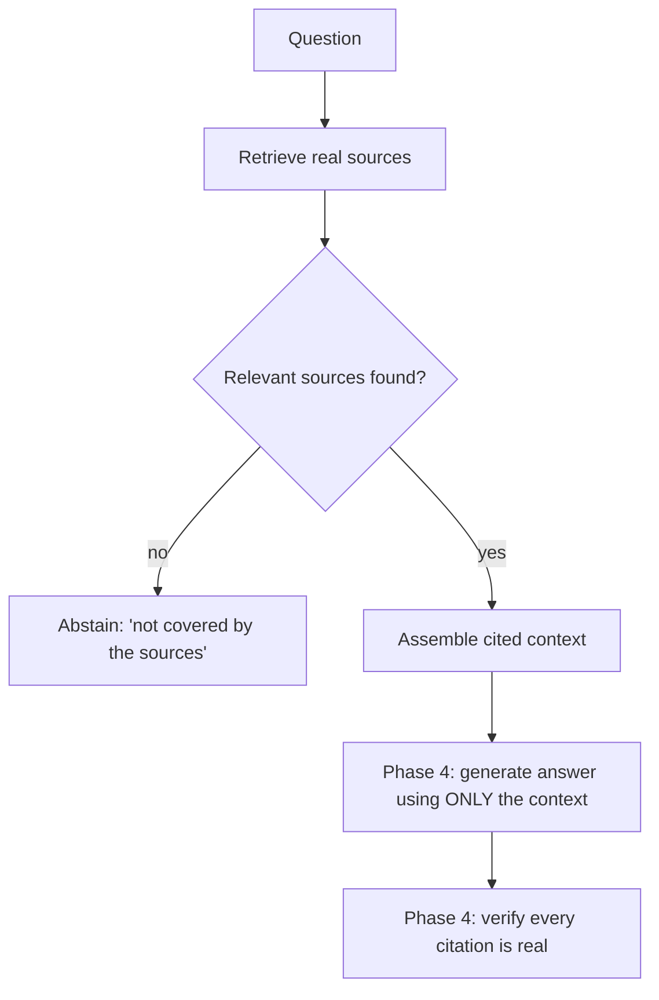

### 2.5 Real-World Analogy
A **rumor vs. a footnoted encyclopedia**. A rumor is fluent and confident but
untraceable — that's an ungrounded LLM. A good encyclopedia article makes a claim
and attaches a footnote to a real source you can check. Grounding turns the rumor
machine into the footnoted encyclopedia: no claim without a checkable source, and
"we don't have a source for that" is an acceptable, honest answer.

### 2.6 Example
- *Ungrounded (dangerous):* "Public buckets violate ISO 27001 A.12.7." (Sounds
  authoritative; A.12.7 may not even be the right control — a hallucination.)
- *Grounded (Phase 3 → 4):* retrieval returns the real ISO A.8.24 summary + NIST
  PR.DS-01; the answer cites those, and if neither existed, it abstains.

### 2.7 Common Mistakes
- **Believing a confident tone means correctness.** Confidence is free for an LLM;
  correctness must be *engineered* via grounding.
- **Treating abstention as failure.** Saying "not covered by the sources" is a
  *correct, tested outcome* — better than a confident wrong answer.
- **Reaching for fine-tuning to "teach" regulations.** RAG is the right tool for
  current, citable, auditable knowledge.

### 2.8 Key Takeaways
- Hallucination = confident, fluent, wrong — unacceptable in compliance.
- Grounding = every claim tied to a retrieved real source; no source → abstain.
- RAG beats fine-tuning here: current, citable, auditable, and can say "I don't
  know."

### 2.9 Self-Assessment
1. Why is a hallucinated citation especially damaging in this product?
2. What does "grounding" mean, concretely, in our pipeline?
3. Give two reasons RAG is preferred over fine-tuning for regulatory knowledge.

### 2.10 Connection to Previous Topics
This is the deep "why" behind Phase 1's `citation_verified` flag and Phase 2's
`wrap_untrusted` delimiting. Everything in Phase 3 exists to make grounding
*possible*; Phase 4 will make it *enforced* (verify citations, or abstain).

---

## Chapter 3 — Vectors, Embeddings, and Cosine Similarity

### 3.1 Introduction
Semantic search — finding text by *meaning* — is the heart of retrieval. It runs on
three ideas: **vectors**, **embeddings**, and **cosine similarity**. Phase 2
introduced embeddings briefly; here we make them concrete, because Phase 3
*actually uses* them.

### 3.2 Prerequisites
- Chapter 1–2.
- Comfort with the idea of a list of numbers.

### 3.3 Detailed Explanation
A **vector** is just an ordered list of numbers: `[0.2, -0.7, 0.1]`. You can picture
a 2-number vector as a point on a map, a 3-number vector as a point in a room, and a
1536-number vector as a point in a space too big to picture but perfectly fine for
math.

An **embedding** is a vector that represents the **meaning** of a piece of text,
produced by an embedding model, with a magical property: **texts with similar
meaning get vectors that point in similar directions.** "public bucket" and
"world-readable storage" land close together; "public bucket" and "banana bread"
land far apart.

To *measure* how close two vectors point, we use **cosine similarity**. It's the
cosine of the angle between the two vectors:
- **1.0** = same direction (very similar meaning).
- **0.0** = perpendicular (unrelated).
- **-1.0** = opposite.

Cosine cares about **direction, not length**, which is exactly right for meaning: a
long document and a short phrase about the same topic point the same way. Our
`cosine_similarity` (in `domain/knowledge/similarity.py`) computes it in pure
Python, and — importantly — **raises if the two vectors have different lengths**,
because comparing different-sized vectors is a bug, never a silent zero.

### 3.4 How It Works (the math, gently)
For vectors `a` and `b`:
```
cosine(a, b) = (a · b) / (‖a‖ × ‖b‖)
```
- `a · b` (the "dot product") = multiply matching numbers and add them up.
- `‖a‖` (the "norm") = the vector's length = √(sum of its squares).
- Divide the dot product by the two lengths → a value in [-1, 1].

Semantic search = embed the query, then compute cosine against every stored chunk's
vector, and return the highest-scoring ones.

### 3.5 Real-World Analogy
Think of every phrase as an **arrow pinned to a giant "map of meaning."** Two arrows
about the same topic point almost the same way (small angle → cosine near 1). Two
arrows about unrelated topics point in wildly different directions (big angle →
cosine near 0). Semantic search asks: *"which stored arrows point most like my
question's arrow?"* — regardless of how long the arrows are (how much text there is).

### 3.6 Example
```python
cosine_similarity([1.0, 0.0], [1.0, 0.0])   # 1.0  — identical direction
cosine_similarity([1.0, 0.0], [0.0, 1.0])   # 0.0  — perpendicular
cosine_similarity([1.0],      [1.0, 2.0])   # raises ValueError — dimension mismatch
```

### 3.7 Common Mistakes
- **Confusing an embedding with the text.** It's a numeric *fingerprint of
  meaning*; you can't turn it back into words.
- **Comparing vectors of different lengths.** Meaningless — our code raises rather
  than returning a misleading number.
- **Thinking longer text = higher similarity.** Cosine ignores length by design.

### 3.8 Key Takeaways
- Vector = list of numbers; embedding = a vector capturing meaning.
- Cosine similarity measures *direction* closeness in [-1, 1]; ~1 = similar meaning.
- Different-length vectors are a bug; we raise, never fudge.

### 3.9 Self-Assessment
1. In one sentence, what property makes embeddings useful for search?
2. What does a cosine similarity of 0 mean? Of 1?
3. Why does cosine ignore vector length, and why is that desirable?

### 3.10 Connection to Previous Topics
Phase 2 built `gateway.embed` and the `EmbeddingResult` that records the producing
model. Phase 3 *consumes* those vectors: cosine similarity over them is the "S" in
hybrid search, and the recorded model is what powers the identity guard (Chapter 6).

---

# Part II — The Knowledge Base (the write path)

---

## Chapter 4 — The Knowledge Domain Model

### 4.1 Introduction
Before we can store or search regulations, we must decide the *shapes* of the data:
what a "source document," a "control," and a "chunk" are. These pure types live in
`domain/knowledge/` and are the shared vocabulary of the whole RAG subsystem.

### 4.2 Prerequisites
- Phase 1's **value object** idea (immutable, validated data holders via Pydantic).
- Chapter 1–3.

### 4.3 Detailed Explanation
The model follows a natural hierarchy: **Framework → Control → Chunk.**

- **`CorpusDocument`** — a registered source, e.g. "NIST CSF 2.0". It has a
  `framework`, `title`, `version`, `language`, `jurisdiction`, and a list of
  `controls`. This is what a loader produces from a file.
- **`ControlSummary`** — one control/article: a `control_id` (e.g. `PR.DS-01`), a
  `title`, our own `summary` (plain-language, authored by us), `keywords`, and
  `references`. Notice there is **no field for verbatim standard text** — that's
  the copyright policy enforced by shape (Chapter 8).
- **`Chunk`** — the atom of retrieval: a small piece of text (in our scheme, ≈ one
  control) with `metadata`, a `content_hash`, and a deterministic `id`.
- **`EmbeddedChunk`** — a `Chunk` + its embedding `vector` + the *identity of the
  model* that produced the vector (Chapter 6).
- **`ScoredChunk`** — a chunk plus a relevance `score` and which retrieval path
  produced it (`SEMANTIC`, `LEXICAL`, `HYBRID`, `RERANK`).
- **`ChunkMetadata`** — the structured provenance every chunk carries: `framework`,
  `control_id`, `title`, `version`, `language`, `jurisdiction`, `source`, and
  `corpus_version`. This is what filters and citations use.
- **`MetadataFilter`** — optional constraints (framework, control, language, …) with
  a `.matches(metadata)` method, applied *before* ranking.

**A crucial design point: the corpus is SHARED, not tenant-scoped.** Regulations are
public/global knowledge — the same ISO control means the same thing for every
customer. So chunks carry **no `tenant_id`**. (Tenant isolation, from Phase 1,
applies to *findings* and *generated artefacts* — a customer's data — not to the
regulatory library everyone reads.) This is a deliberate, defensible distinction.

### 4.4 How It Works (the data hierarchy)
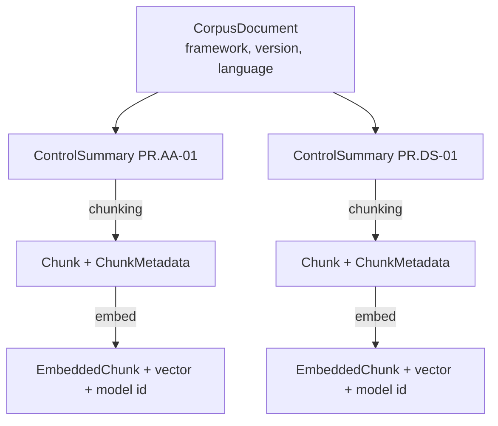

### 4.5 Real-World Analogy
A **library catalog card**. `CorpusDocument` is the book; `ControlSummary` is a
chapter; `Chunk` is a paragraph you can photocopy; `ChunkMetadata` is the catalog
card stapled to it (which book, which chapter, which edition, which language). The
card is what lets a librarian *find* and *cite* the paragraph — you never file a
paragraph without its card.

### 4.6 Example
```python
CorpusDocument(
    framework=Framework.NIST_CSF, title="NIST CSF 2.0", version="2.0",
    language=Language.EN, jurisdiction=Jurisdiction.INTERNATIONAL,
    controls=[ControlSummary(control_id="PR.DS-01", title="Data-at-rest protection",
                             summary="Encrypt stored data ...", keywords=["encryption","storage"])])
```

### 4.7 Common Mistakes
- **Adding a `tenant_id` to chunks.** The corpus is shared; tenant-scoping it would
  duplicate the same regulations per customer for no reason.
- **Storing raw standard text in `ControlSummary`.** There's deliberately no field
  for it — see Chapter 8.
- **Forgetting metadata.** A chunk without provenance can't be filtered or cited.

### 4.8 Key Takeaways
- Framework → Control → Chunk, each an immutable value object.
- Metadata (framework, control, version, language, source, corpus_version) powers
  filtering and citations.
- The corpus is **shared**, not tenant-scoped — a deliberate distinction from
  finding data.

### 4.9 Self-Assessment
1. Why do chunks carry no `tenant_id`?
2. What does `ChunkMetadata` enable that raw text alone can't?
3. Which type records the embedding vector *and* its model identity?

### 4.10 Connection to Previous Topics
These are Phase 1 value objects (immutable, Pydantic-validated, `extra="forbid"`)
applied to knowledge. The "shared corpus vs. tenant data" call is the same
tenant-isolation reasoning from Phase 1, applied thoughtfully rather than blindly.

---

## Chapter 5 — Structure-Aware Chunking

### 5.1 Introduction
Before text can be searched, it must be split into **chunks**. *How* you split is
one of the two biggest levers on retrieval quality (the other is how you search).
We split by **structure**, not by fixed size — and this chapter explains why.

### 5.2 Prerequisites
- Chapter 4 (the model), Chapter 3 (embeddings).

### 5.3 Detailed Explanation
**Why chunk at all?** Two reasons: (1) embedding models have a size limit, and (2)
you want to retrieve a *focused* piece, not a whole document — if a query matches
one paragraph, you want that paragraph, not 50 pages around it.

**The naive way (fixed-size):** cut the text every N characters/tokens. This is easy
but bad: it slices a rule in half mid-sentence, so a chunk contains the end of one
control and the start of another. Retrieval then returns fragments that don't map to
any single rule, and citations become mush.

**Our way (structure-aware):** chunk **by the document's structure — one control =
one chunk.** Because a retrieved chunk is exactly one control, it maps cleanly to a
single **citable rule** ("one chunk ≈ one rule"). Only when a single control's text
is *too big* for the embedding budget do we split it into **overlapping** sub-chunks
(repeating a sentence or two at the boundary so context isn't lost across the cut).

`chunk_document` (in `domain/knowledge/chunking.py`) is a **pure function**: same
document + version → same chunks with the same ids, every time. Each chunk's `id` is
derived from a hash of its content, which makes re-ingestion **idempotent** (Chapter
7): re-running never creates duplicates.

### 5.4 How It Works (step by step)
For each control in a document:
1. Render the embeddable text: control id + title + our summary (+ keywords).
2. If it fits the token budget → one chunk. If not → split into overlapping
   sentence groups.
3. Compute `content_hash = sha256(content)`.
4. Compute a deterministic `id` from framework + control + index + content hash.
5. Attach `ChunkMetadata` (including the `corpus_version`).

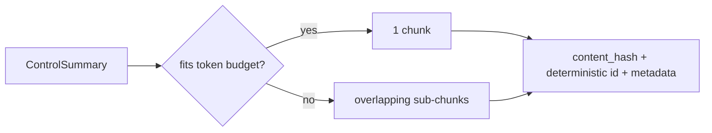

### 5.5 Real-World Analogy
Cutting a **cookbook** for a recipe box. The naive way is to slice every page in half
regardless of content — you'd get cards with the end of "Lasagna" and the start of
"Lemonade" on the same card (useless). The structure-aware way is to cut **one recipe
per card**. If a recipe is enormous, you split it across a few cards but repeat the
last step at the top of the next card so nothing is lost. Now every card is one
findable, citable recipe.

### 5.6 Example
```python
chunks = chunk_document(nist_doc, corpus_version="v1", max_tokens=400)
# → one chunk per control; chunks[0].metadata.control_id == "PR.AA-01"
# same inputs → identical chunk ids (idempotent)
```

### 5.7 Common Mistakes
- **Fixed-size chunking "because it's simpler."** It wrecks citation quality; the
  small extra effort of structure-aware chunking pays off hugely.
- **No overlap when splitting.** A rule cut across two chunks can lose the linking
  context; overlap preserves it.
- **Random/time-based ids.** They break idempotency — re-ingesting would duplicate.

### 5.8 Key Takeaways
- One control = one chunk → a retrieved chunk maps to one citable rule.
- Over-long controls split with overlap; nothing is silently truncated.
- Chunking is pure and deterministic → idempotent ingestion.

### 5.9 Self-Assessment
1. Give two problems with fixed-size chunking.
2. Why does "one chunk ≈ one rule" help citations?
3. What makes re-ingestion idempotent?

### 5.10 Connection to Previous Topics
This is the same "make the right thing structural" instinct as Phase 1/2: the
content-hash id enforces idempotency by construction, just as `approved=False` and
the tenant guard enforced their rules by construction.

---

## Chapter 6 — The Embedding-Model-Identity Guard

### 6.1 Introduction
This short chapter covers one of the most important safety details in all of RAG —
a bug that is **invisible** if you get it wrong, and which our types make
**impossible**.

### 6.2 Prerequisites
- Chapter 3 (embeddings, cosine).

### 6.3 Detailed Explanation
Every embedding model has its **own "map of meaning."** A vector from model A and a
vector from model B are coordinates on **different maps**. Comparing them with cosine
similarity produces a number — but a **meaningless** one, because the maps don't
align. And here's the trap: nothing crashes. You just get subtly wrong search
results, forever, with no error to alert you. This is the classic "silent,
catastrophic RAG bug."

Our defence: **record the model on every vector, and refuse to mix or mismatch
models.**
- `EmbeddedChunk` stores `embedding_model` and `embedding_provider` alongside the
  vector.
- `InMemoryVectorStore` remembers the one model its chunks were embedded with. If
  you try to `upsert` a chunk from a *different* model, or `search` with a query
  embedded by a *different* model, it raises `EmbeddingModelMismatchError`.

We turned an invisible correctness bug into a **loud, tested failure**.

### 6.4 How It Works
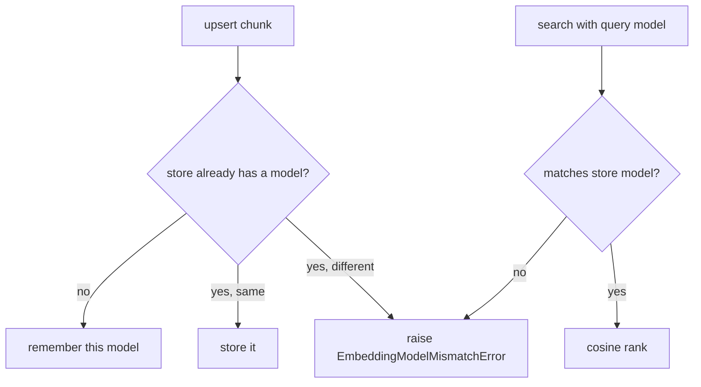

### 6.5 Real-World Analogy
GPS coordinates from **Google Maps vs. a map of Mars**. Both are "latitude/longitude"
numbers, and you *can* subtract them — but the answer is nonsense, because they
describe different worlds. Mixing embedding models is exactly that. Our guard is the
customs officer who checks that every coordinate came from the same map before
letting you compute distances.

### 6.6 Example
```python
await store.upsert(chunks_from_model_A)          # store now "belongs" to model A
await store.search(embedding=query_from_model_B, embedding_model="B", ...)
# → raises EmbeddingModelMismatchError (there's a test for exactly this)
```

### 6.7 Common Mistakes
- **Assuming all embeddings are comparable.** They are only comparable within one
  model. This is *the* rookie RAG mistake.
- **Silently returning 0 or garbage on mismatch.** We raise instead — a bug you can
  see beats one you can't.

### 6.8 Key Takeaways
- Vectors are only comparable within the same embedding model.
- We record the model on every vector and reject mixes/mismatches loudly.
- Invisible correctness bug → loud, tested failure.

### 6.9 Self-Assessment
1. Why is comparing vectors from two models meaningless?
2. Why is this bug especially dangerous compared to a normal crash?
3. Where, exactly, is the guard enforced?

### 6.10 Connection to Previous Topics
Phase 2's `EmbeddingResult` already recorded the producing model *for this reason*.
Phase 3 now *uses* that record to enforce the guarantee — the same "encode the safety
rule in the data" philosophy running through every phase.

---

## Chapter 7 — Ingestion

*(Turning Regulations into Searchable Knowledge)*

### 7.1 Introduction
**Ingestion** is the "write path": the process that takes raw regulation documents
and loads them into the knowledge base so they can be searched. It ties together
chunking (Ch 5), embedding (Ch 3/6), and the two stores.

### 7.2 Prerequisites
- Chapters 4–6, and Phase 2's gateway `embed`.

### 7.3 Detailed Explanation
`IngestionService.ingest(documents)` does four things:
1. **Chunk** every document (structure-aware).
2. **Embed** each chunk's text — via `GatewayEmbedder`, which calls the Phase-2
   gateway's embedding model. (So ingestion gets the same routing, rate limiting,
   and cost accounting as any model call; it's charged to a system tenant since
   ingestion is a platform action, not a customer's.)
3. **Upsert** the embedded chunks into the **vector store** (for semantic search).
4. **Index** the chunks into the **keyword index** (for lexical search).

Two production properties make this trustworthy:
- **Idempotent.** Chunk ids come from content, and the store upserts *by id*, so
  re-ingesting an unchanged corpus changes nothing — no duplicates. You can run it
  as often as you like.
- **Versioned.** Every chunk carries a `corpus_version`. Passing `replace=True`
  deletes that version first, giving a clean re-index without duplicating — the
  basis for updating regulations without downtime.

Ingestion runs three ways: automatically at **startup** (autoload, so `docker compose
up` yields a queryable system), via the **CLI** (`python -m scripts.ingest_corpus`),
and in **tests**.

### 7.4 How It Works
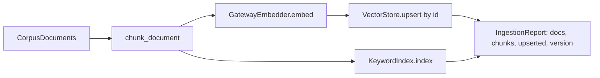

### 7.5 Real-World Analogy
Stocking a **library**. Chunking = deciding what a "findable unit" is (a book, a
chapter). Embedding = assigning each unit a spot on the "map of meaning" shelf.
Upserting *by id* = if the book's already on the shelf, you replace it in place
rather than adding a second copy (idempotent). Versioning = a whole-collection
edition tag, so you can pull the 2022 edition and shelve the 2024 one cleanly.

### 7.6 Example
```bash
python -m scripts.ingest_corpus            # idempotent: safe to re-run
python -m scripts.ingest_corpus --replace  # clean re-index of the version
```
```python
report = await ingestion.ingest(documents)
# IngestionReport(documents=5, chunks=23, upserted=23, corpus_version='v1')
# re-run → still 23 chunks total (no duplicates)
```

### 7.7 Common Mistakes
- **Re-ingesting creating duplicates.** Only happens if ids aren't content-derived;
  ours are, so it's safe.
- **Embedding chunks with different models over time.** The identity guard (Ch 6)
  catches this; a model change means a full, versioned re-index.
- **Calling a provider SDK directly instead of the gateway.** Ingestion goes through
  the gateway so it inherits routing/limits/cost.

### 7.8 Key Takeaways
- Ingestion = chunk → embed (via gateway) → upsert + index.
- Idempotent (content ids, upsert by id) and versioned (`corpus_version`, `replace`).
- Runs at startup, via CLI, and in tests.

### 7.9 Self-Assessment
1. What are the four steps of ingestion?
2. Why is ingestion idempotent, and why does that matter operationally?
3. Why does ingestion embed via the gateway rather than a provider directly?

### 7.10 Connection to Previous Topics
Ingestion is a use case in the **application** layer that orchestrates domain
services (chunking) and ports (Embedder, VectorStore, KeywordIndex) — the exact shape
of `ReadinessService` (Phase 1) and `AIGateway` (Phase 2), now for the write path.

---

## Chapter 8 — The Copyright Policy, Enforced by Shape

### 8.1 Introduction
A legal constraint drives a design decision here (non-negotiable rule 6). It's a
small chapter but an important one to be able to explain — examiners love it.

### 8.2 Prerequisites
- Chapter 4 (`ControlSummary`).

### 8.3 Detailed Explanation
The full text of some standards (ISO/IEC 27001, SOC 2 criteria) is **copyrighted**;
storing or serving it verbatim would be a legal violation. Public sources (Loi 05-20,
DGSSI/DNSSI directives, NIST CSF) can be summarised freely.

The clever part: instead of writing a policy document and *hoping* engineers follow
it, we **enforce it in the data model's shape.** `ControlSummary` has fields for a
`control_id`, an original `summary` (authored by us), `keywords`, and `references` —
and **no field for verbatim standard text.** The forbidden data therefore has
**nowhere to live**; the ingestion pipeline literally cannot store it. A well-meaning
contributor who pasted ISO's exact wording into a corpus file would just be writing
our-summary content, and there is no path for the normative text to be persisted or
served.

For copyrighted standards, our corpus files carry only identifiers + our summaries +
references pointing a licensed reader to the source. For public sources, we summarise
the public text.

### 8.4 How It Works
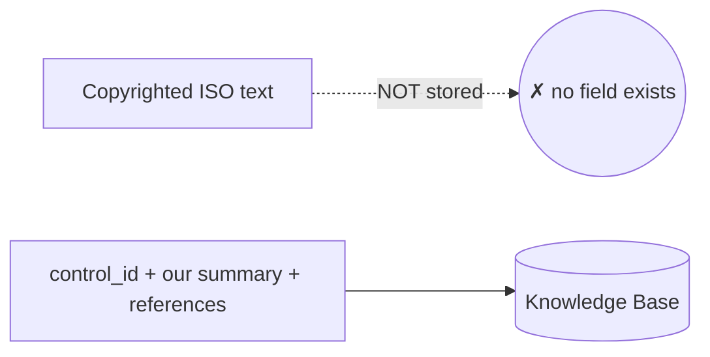

### 8.5 Real-World Analogy
A **museum that displays its own descriptions of famous paintings, not bootleg
copies of the paintings.** You can read the museum's plaque ("this ISO control
requires access to be least-privilege…") and it points you to where the licensed
original hangs — but the museum never hangs a forged copy. The building has no wall
for forgeries.

### 8.6 Example
```json
{ "control_id": "A.8.24", "title": "Use of cryptography",
  "summary": "Rules for effective use of cryptography ... (Summary authored by ComplianceIQ.)",
  "references": ["ISO/IEC 27001:2022, Annex A control A.8.24 — consult the licensed standard"] }
```
No `verbatim_text` key exists — by design.

### 8.7 Common Mistakes
- **Relying on a written guideline to prevent copyright leaks.** Guidelines get
  forgotten; a missing field cannot be filled.
- **Summarising *too* closely (paraphrasing verbatim).** Summaries must be genuinely
  our own words.

### 8.8 Key Takeaways
- ISO/SOC 2 verbatim text is copyrighted; we store identifiers + our summaries +
  references only.
- The rule is enforced by the model's **shape** (no field for verbatim text), not by
  convention.

### 8.9 Self-Assessment
1. Which sources may be quoted more freely, and which may not?
2. How does the data model make storing verbatim ISO text impossible?
3. Why is "enforced by shape" stronger than a written policy?

### 8.10 Connection to Previous Topics
This mirrors every structural guarantee so far — `approved=False`, non-empty
`tenant_id`, the embedding guard: encode the rule in the type so violating it isn't a
matter of discipline but of impossibility.

---

# Part III — Retrieval (the read path)

---

## Chapter 9 — Semantic Search and the Vector Store

### 9.1 Introduction
Now the read path. The first of our two search methods is **semantic search** —
finding chunks by *meaning* — powered by the **vector store**.

### 9.2 Prerequisites
- Chapter 3 (embeddings, cosine), Chapter 6 (the model guard).

### 9.3 Detailed Explanation
A **vector store** is a database specialised for one question: *"given this query
vector, which stored vectors are most similar?"* Our `InMemoryVectorStore`
implements the `VectorStore` port with a plain dictionary and pure-Python cosine.

**Semantic search**, step by step: embed the query into a vector, then compute cosine
similarity between it and every stored chunk's vector, and return the top-k. Because
it compares *meaning*, it finds relevant chunks **even when they share no words** with
the query — "world-readable storage" can match a query about "public buckets."

Our store also:
- **Pre-filters by metadata** — if the query restricts to one framework, only those
  chunks are scored (Chapter 14).
- **Enforces the model-identity guard** (Chapter 6).
- Tags results with `retriever=SEMANTIC` so we can see where each came from.

**Why "in-memory," and what's the production version?** In-memory is the default so
the whole pipeline runs and is tested offline (ADR-0005). The production store is
**PostgreSQL + pgvector** — a database extension that stores vectors and searches
them with an **index** (like HNSW) so it's fast over millions of chunks. It
implements the *same* `VectorStore` port, so swapping it is a composition change, not
a pipeline change. (That lands in Phase 6.)

### 9.4 How It Works
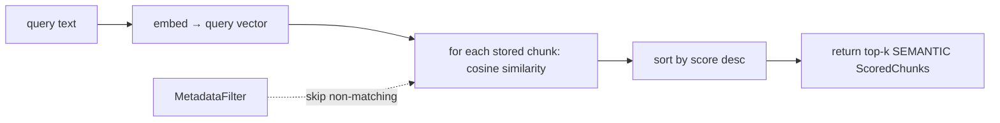

### 9.5 Real-World Analogy
A **"find similar songs" button.** You don't type keywords; you point at a song and it
finds others that *feel* similar — same vibe, even with totally different lyrics.
Semantic search is that button for regulations: point at a finding, get controls that
*mean* something similar, regardless of shared words.

### 9.6 Example
```python
query = (await embedder.embed(["encryption of storage buckets"]))[0]
hits = await store.search(embedding=query.vector, embedding_model=query.model_id,
                          top_k=1, metadata_filter=MetadataFilter())
hits[0].chunk.metadata.control_id   # "PR.DS-01" (the encryption control)
```

### 9.7 Common Mistakes
- **Expecting semantic search to nail exact codes.** "PR.AC-4" is an identifier, not a
  meaning; semantic search can blur it. That's why we *also* have lexical search
  (Chapter 10).
- **Skipping the metadata filter.** Scoring the whole corpus when you already know the
  framework wastes effort and adds noise.

### 9.8 Key Takeaways
- Semantic search = embed query → cosine vs. stored vectors → top-k.
- Finds meaning matches even with no shared words.
- In-memory default; pgvector in production, same port.

### 9.9 Self-Assessment
1. What single question is a vector store optimised to answer?
2. Why can semantic search find matches with no shared words?
3. What's one weakness of semantic search that motivates hybrid search?

### 9.10 Connection to Previous Topics
The store consumes Phase 2 embeddings and enforces Phase 3's model guard. It's an
adapter behind the `VectorStore` port — Ports & Adapters again, enabling the pgvector
swap later.

---

## Chapter 10 — Lexical Search and BM25

### 10.1 Introduction
The second search method is **lexical (keyword) search**, using the classic **BM25**
algorithm. It's the complement to semantic search: it nails the exact terms semantic
search blurs.

### 10.2 Prerequisites
- Chapter 9 (semantic search, for contrast).

### 10.3 Detailed Explanation
**Lexical search** matches on the *actual words*. If you search "PR.AC-4" or "article
23", you want the chunk containing exactly that token — meaning-similarity won't help,
but word-matching will.

**BM25** ("Best Matching 25") is the industry-standard scoring function for keyword
search. It's smarter than counting word matches. For each query term in a chunk it
rewards:
- **Term frequency** — appears more often → higher score, **but with saturation** (10
  occurrences aren't 10× as relevant as one; the boost flattens out).
- **Rarity (IDF, inverse document frequency)** — a term that's rare across the corpus
  (like "PR.AC-4") is more distinctive than a common one (like "the"), so matching it
  counts for more.
- **Length normalisation** — a long chunk naturally contains more words, so BM25
  discounts it slightly, preventing long chunks from winning just by being long.

Our `InMemoryKeywordIndex` implements this over tokenised chunk text, with the same
metadata pre-filtering, tagging results `retriever=LEXICAL`.

### 10.4 How It Works (BM25, gently)
For a query term `t` in chunk `d`:
```
score(t, d) = IDF(t) × ( f(t,d) × (k1+1) ) / ( f(t,d) + k1 × (1 - b + b × |d|/avgdl) )
```
- `f(t,d)` = how many times `t` appears in `d`.
- `IDF(t)` = rarity of `t` across chunks (rarer → higher).
- `|d|/avgdl` = this chunk's length vs. the average (length normalisation).
- `k1`, `b` = tuning knobs (saturation and length-normalisation strength).

The chunk's total score sums this over all query terms.

### 10.5 Real-World Analogy
The **index at the back of a textbook.** You look up an exact term ("mitochondria")
and it points you to the exact pages. A rare, specific term is a great index entry; a
word like "the" is useless (it's on every page — low IDF). BM25 is a smart back-of-book
index that also knows not to over-reward a page that just repeats a word a hundred
times.

### 10.6 Example
```python
await index.index(chunks)
hits = await index.search(text="firewall network segmentation", top_k=1,
                          metadata_filter=MetadataFilter())
hits[0].chunk.metadata.control_id   # "PR.IR-01" (the network control)
```

### 10.7 Common Mistakes
- **Using only keyword search.** It misses paraphrases ("world-readable" ≠ "public")
  that semantic search catches.
- **Thinking more matches = better.** BM25 deliberately saturates term frequency and
  boosts rare terms; raw counting would be worse.

### 10.8 Key Takeaways
- Lexical/BM25 search matches exact words; great for identifiers and rare terms.
- BM25 balances term frequency (saturating), rarity (IDF), and length.
- It's the complement to semantic search — hence "hybrid."

### 10.9 Self-Assessment
1. When does lexical search beat semantic search?
2. What are the three factors BM25 balances?
3. Why does BM25 discount long chunks?

### 10.10 Connection to Previous Topics
Like the vector store, the keyword index is an adapter behind a port
(`KeywordIndex`), with the same metadata filtering. Two adapters, two strengths, about
to be combined.

---

## Chapter 11 — Why Hybrid? Reciprocal Rank Fusion

### 11.1 Introduction
Semantic search and lexical search each have blind spots. **Hybrid retrieval** runs
both and merges their results, so one covers for the other. The merge uses a neat
technique called **Reciprocal Rank Fusion (RRF)**.

### 11.2 Prerequisites
- Chapters 9–10.

### 11.3 Detailed Explanation
- **Semantic search** is great at meaning, weak at exact terms.
- **Lexical search** is great at exact terms, weak at paraphrases.

Running both and combining them gives you the best of each. But there's a problem
merging them: their scores are on **totally different scales** — cosine is in [-1, 1],
BM25 can be any positive number. You can't just add them.

**RRF solves this by ignoring raw scores and using only *ranks*.** Each chunk earns
points based on its *position* in each list: `1 / (k + rank)` (rank 1 = first place).
A chunk's points are summed across both lists. A chunk that ranks highly in **both**
lists accumulates the most points and rises to the top. Because it uses ranks, not
scores, it's immune to the scale mismatch. (`k`, default 60, softens the difference
between top ranks.)

Our `reciprocal_rank_fusion` returns the merged list tagged `retriever=HYBRID`.

### 11.4 How It Works
```mermaid
flowchart TD
    S[Semantic list: a, b, c] --> F[RRF: sum 1/(k+rank)]
    L[Lexical list: b, d, a] --> F
    F --> M["b scored in both → top; then a; then c, d"]
```
Example: chunk `b` is rank 1 lexical *and* rank 2 semantic → high combined score →
ranks first overall. Agreement wins.

### 11.5 Real-World Analogy
**Two expert judges** scoring figure skaters — but one scores out of 6.0 and the other
out of 100. You can't average their raw numbers. So instead you take each judge's
**ranking** (who they put 1st, 2nd, 3rd) and combine the rankings. A skater both
judges rank near the top wins. That's RRF: combine *placements*, not incomparable
scores.

### 11.6 Example
```python
fused = reciprocal_rank_fusion([semantic_hits, lexical_hits])
fused[0].chunk.id            # the chunk both lists ranked highly
fused[0].retriever           # RetrievalSource.HYBRID
```

### 11.7 Common Mistakes
- **Adding cosine and BM25 scores directly.** Different scales → garbage. RRF's whole
  point is to avoid this.
- **Using only one retriever to "keep it simple."** You inherit that retriever's blind
  spot on every query.

### 11.8 Key Takeaways
- Hybrid = semantic + lexical, covering each other's blind spots.
- RRF merges by **rank**, not score, so incompatible scales don't matter.
- Chunks that rank high in both lists rise to the top.

### 11.9 Self-Assessment
1. Why can't you just add cosine and BM25 scores?
2. How does RRF decide a chunk's combined position?
3. What kind of chunk wins under RRF?

### 11.10 Connection to Previous Topics
This is the same "fuse complementary signals robustly" idea you'll see again in the
risk engine (Phase 5). It also keeps each retriever a clean, independent port — fusion
is a separate pure function.

---

## Chapter 12 — Reranking

### 12.1 Introduction
Fusion gives a good merged list, but the *ordering* can still be imperfect.
**Reranking** takes the top candidates and re-scores them with a sharper (but more
expensive) relevance judgement.

### 12.2 Prerequisites
- Chapter 11 (fusion produces the candidates).

### 12.3 Detailed Explanation
First-pass retrievers (semantic, lexical) are **fast but shallow**: they score each
chunk *independently* of the query's full nuance. A **reranker** is **slower but
deeper**: it looks at the query and a candidate *together* and asks "how well does
this specific chunk answer this specific query?" You only run it on the top-N fused
candidates (not the whole corpus), because it's costlier.

The gold-standard reranker is a **cross-encoder** — a model that reads the query and
the chunk jointly and outputs a relevance score. But that needs a heavy ML model, so
it's not in our offline default.

Our default is `LexicalReranker`: a **deterministic** reranker that scores each
candidate by **query-term coverage** — what fraction of the query's distinct words
appear in the chunk. It's simple, free, and offline, and it plugs into the same
`Reranker` port, so a real cross-encoder can replace it later with **zero** changes to
the retriever. Results are tagged `retriever=RERANK`.

### 12.4 How It Works
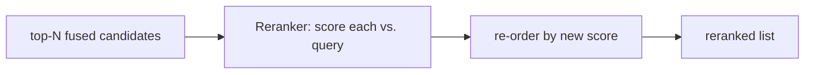

### 12.5 Real-World Analogy
A **hiring funnel.** A keyword filter and a recruiter's gut (fast, shallow) narrow
1,000 résumés to 20. Then a senior engineer *actually reads* those 20 against the job
(slow, deep) and re-ranks them. You'd never deep-read all 1,000 (too costly) or hire
straight from the keyword filter (too shallow). Reranking is the senior read on the
shortlist.

### 12.6 Example
```python
ranked = await reranker.rerank(query="iam credential rotation",
                               candidates=fused, top_k=20)
ranked[0].chunk.id      # the candidate covering the most query terms
ranked[0].retriever     # RetrievalSource.RERANK
```

### 12.7 Common Mistakes
- **Reranking the whole corpus.** Too slow/costly; rerank only the fused shortlist.
- **Assuming the default reranker is the ceiling.** It's a deterministic stand-in; a
  cross-encoder improves quality behind the same port.

### 12.8 Key Takeaways
- Reranking deep-scores the *shortlist* of fused candidates.
- Cross-encoder is the gold standard; our offline default is a deterministic lexical
  reranker.
- Swappable behind the `Reranker` port.

### 12.9 Self-Assessment
1. Why run the reranker only on the top-N, not the whole corpus?
2. What does a cross-encoder do that first-pass retrievers don't?
3. How does the lexical reranker score a candidate?

### 12.10 Connection to Previous Topics
Another port + swappable adapter, exactly like the LLM providers in Phase 2: a cheap
deterministic default now, a heavier real implementation later, no caller changes.

---

## Chapter 13 — MMR: Diversity in the Results

### 13.1 Introduction
Even after reranking, the top results can be **near-duplicates** of each other.
**MMR (Maximal Marginal Relevance)** trims the final set so it's relevant *and*
varied.

### 13.2 Prerequisites
- Chapter 12 (reranked candidates).

### 13.3 Detailed Explanation
Imagine your top 5 chunks are five slightly-different phrasings of the *same*
encryption rule. They're all relevant, but together they're redundant — you've wasted
4 of your 5 slots and told the model nothing new. Worse, you might have crowded out a
*different* relevant rule (say, about logging) that belonged in the answer.

**MMR** fixes this by picking chunks greedily, each time balancing two things:
- **Relevance** — how good is this chunk for the query?
- **Novelty** — how *different* is it from what we've already picked?

A tuning knob, **lambda** (`mmr_lambda`, default 0.5), sets the balance: `1.0` = pure
relevance (ignore redundancy), `0.0` = pure diversity. At 0.5 it won't pick a second
near-duplicate when a fresh, still-relevant chunk is available. Our `mmr_select`
measures "difference" by token-set overlap (Jaccard) between chunk contents.

### 13.4 How It Works (greedy selection)
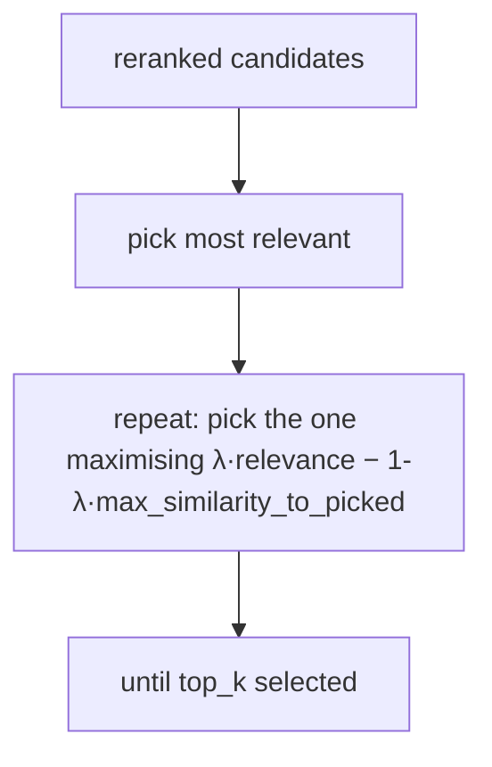

### 13.5 Real-World Analogy
Building a **balanced playlist.** If you only optimised for "most-liked song," you'd
get the same hit five times by different artists. MMR is the DJ who picks great songs
*that also add variety* — so the set covers different moods, not one song on repeat.

### 13.6 Example
```python
# candidates a & b are near-duplicates; c is different but still relevant
selected = mmr_select(candidates, lambda_param=0.5, top_k=2)
# → picks one of {a, b} plus c, not both duplicates
```

### 13.7 Common Mistakes
- **Skipping diversity.** You return five paraphrases of one rule and miss others.
- **lambda = 0 (pure diversity).** You might pick weird, barely-relevant chunks just
  because they're different. 0.5 is a sensible balance.

### 13.8 Key Takeaways
- MMR balances relevance and novelty to avoid redundant top-k.
- lambda tunes the balance (1 = relevance only, 0 = diversity only).
- Diversity here = low content overlap with already-picked chunks.

### 13.9 Self-Assessment
1. What problem does MMR solve that reranking alone doesn't?
2. What does `mmr_lambda` control?
3. Why is a set of five near-duplicate chunks bad for the final answer?

### 13.10 Connection to Previous Topics
MMR is a pure function alongside RRF in `fusion.py` — the retrieval *policy* logic
lives in the application layer, cleanly separated from the storage adapters, just as
gateway policy was separated from providers in Phase 2.

---

## Chapter 14 — Metadata Filtering and Abstention

### 14.1 Introduction
Two guardrails wrap the ranking: **metadata filtering** (search only where it makes
sense) and **abstention** (return nothing rather than something irrelevant). Both are
about *precision* and *honesty*.

### 14.2 Prerequisites
- Chapter 4 (`ChunkMetadata`, `MetadataFilter`), Chapter 2 (grounding/abstention).

### 14.3 Detailed Explanation
**Metadata filtering.** When we enrich a finding that already declares an ISO control,
we shouldn't semantically search the *entire* corpus — we should restrict to the
relevant framework (or even control) first, *then* rank. `MetadataFilter` expresses
constraints (framework, control_id, language, jurisdiction, corpus_version); both
stores apply it **before** scoring, so irrelevant chunks are never ranked. This
improves precision and speed. (In pgvector, this becomes a SQL `WHERE` clause — the
filter runs *in the database*.)

**Abstention (the score threshold).** Each `RetrievalQuery` has a `min_score`. After
ranking, chunks below it are dropped. If **nothing** clears the threshold, the result
is **empty** — and an empty result is the **abstain signal**: the caller (Phase 4)
must say "not covered by the provided sources" rather than generate an answer from
nothing. Abstention is a **first-class, tested outcome**, not an error. This is how the
grounding guarantee (rule 3) is upheld at retrieval time.

### 14.4 How It Works
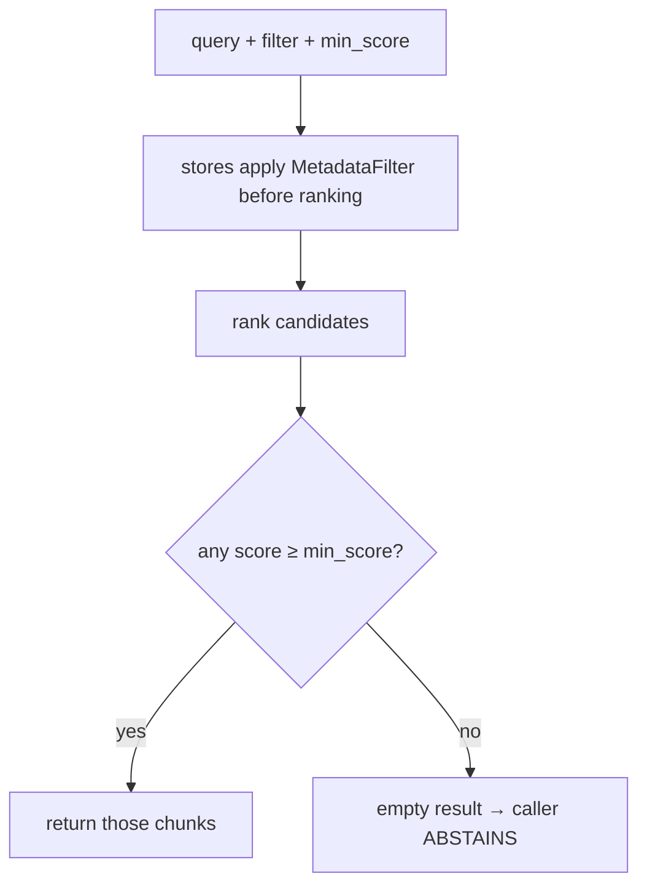

### 14.5 Real-World Analogy
A **good research librarian.** First they narrow the section ("you want *maritime* law,
not *tax* law" — that's the metadata filter). Then, if they genuinely can't find a
relevant source, they *say so* ("we don't have anything on that") rather than handing
you an irrelevant book to seem helpful. Abstention is that honesty.

### 14.6 Example
```python
# Filter to one framework, and abstain if nothing is strongly relevant:
result = await retriever.retrieve(RetrievalQuery(
    text="over-permissive IAM role", top_k=3,
    filter=MetadataFilter(framework=Framework.NIST_CSF), min_score=0.2))
if result.is_empty:
    ...  # Phase 4 will answer "not covered by the provided sources"
```

### 14.7 Common Mistakes
- **Filtering *after* ranking.** Wasteful and less precise; filter *before* scoring.
- **Treating an empty result as an error.** It's a correct outcome that triggers
  honest abstention.
- **Setting `min_score` blindly.** Thresholds interact with the reranker's scale;
  tune with the evaluation harness (Chapter 17).

### 14.8 Key Takeaways
- Metadata filters run *before* ranking → precise, fast, and (in pgvector) in-SQL.
- `min_score` enforces abstention: nothing relevant → empty result → decline to
  answer.
- Abstention is a first-class, tested outcome, not a failure.

### 14.9 Self-Assessment
1. Why filter before ranking instead of after?
2. What does an empty `RetrievalResult` signal, and who acts on it?
3. Why is abstention a *feature* in a compliance product?

### 14.10 Connection to Previous Topics
This operationalises Chapter 2's grounding: "no source → abstain." And it echoes Phase
1's habit of making the safe path (declining) explicit and tested, not an accident.

---

## Chapter 15 — The Full Hybrid Retriever

### 15.1 Introduction
Now assemble Chapters 9–14 into one object: `HybridRetriever`. If you can narrate its
`retrieve` method, you understand Phase 3's read path.

### 15.2 Prerequisites
- Chapters 9–14.

### 15.3 Detailed Explanation & 15.4 How It Works (step by step)
`retrieve(query)` runs seven stages:
1. **Embed** the query text (records the embedding model for the store guard).
2. **Semantic search** — top `candidate_k` from the vector store, metadata-filtered.
3. **Lexical search** — top `candidate_k` from the keyword index, metadata-filtered.
   (`candidate_k = top_k × candidate_multiplier`, so good chunks aren't lost early.)
4. **Fuse** the two lists with RRF. If empty → return empty (abstain).
5. **Rerank** the top fused candidates.
6. **MMR** to a diverse `top_k`.
7. **Threshold** by `min_score`; return the survivors as a `RetrievalResult` (possibly
   empty → abstain).

### 15.5 Real-World Analogy
A **newsroom fact-check desk.** Two researchers search independently — one by topic
(semantic), one by exact quote (lexical). An editor merges their leads (fusion), a
senior editor deep-reads the shortlist (rerank), then picks a *varied*, non-repetitive
set of the strongest sources (MMR) — and if none are solid enough, prints nothing
(threshold/abstain).

### 15.6 Example (sequence diagram)
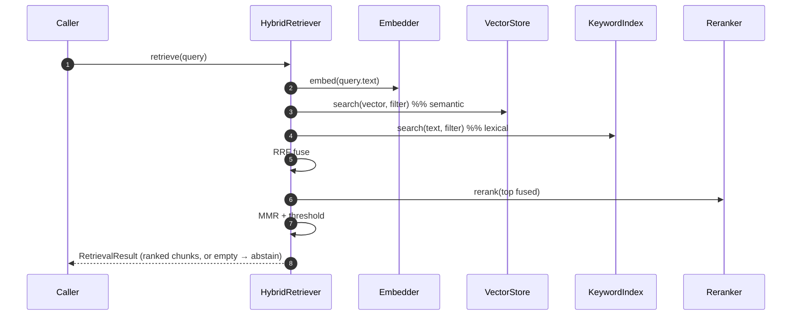

### 15.7 Common Mistakes
- **Fetching only top_k from each retriever before fusion.** Good chunks get dropped
  before they can be fused/reranked; fetch `candidate_k` (a multiple).
- **Reordering the stages.** Threshold must come *after* reranking (the reranker sets
  the final scale); filtering must come *before* ranking.

### 15.8 Key Takeaways
- `retrieve` = embed → semantic + lexical → fuse → rerank → MMR → threshold.
- Fetch extra candidates early so nothing good is lost before fusion/rerank.
- The output is a ranked `RetrievalResult`, or empty (abstain).

### 15.9 Self-Assessment
1. Recite the seven stages of `retrieve` in order.
2. Why fetch `candidate_k` rather than `top_k` from each retriever?
3. At which stage does abstention become possible, and why there?

### 15.10 Connection to Previous Topics
`HybridRetriever` is an application use case that orchestrates four ports (Embedder,
VectorStore, KeywordIndex, Reranker) and two pure policies (RRF, MMR) — the same
"thin conductor over ports" shape as the gateway. And it uses Phase 2's gateway to do
the embedding, tying the phases together.

---

# Part IV — Using and Measuring It

---

## Chapter 16 — Context Assembly and Citations

### 16.1 Introduction
Retrieval gives us *ranked chunks*. Generation (Phase 4) needs a single *text block*
plus *citations*. **Context assembly** is the bridge, and it's where citations are
born.

### 16.2 Prerequisites
- Chapter 15 (`RetrievalResult`), Phase 1's `Citation` value object.

### 16.3 Detailed Explanation
`ContextAssembler.assemble(result, token_budget)` packs the ranked chunks into one
block, doing three careful things:
1. **Token-budget-aware packing.** It adds chunks in ranked order until adding the
   next would exceed `token_budget` (so the prompt never blows past the model's
   limit). At least the top chunk is always included, so a tight budget still yields
   the best result.
2. **Deduplication.** It skips any chunk whose `content_hash` was already added — no
   repeated evidence.
3. **Numbered blocks + citations.** Each included chunk is labelled `[1]`, `[2]`, …
   and paired with a `Citation` (framework, control_id, a human reference). The
   numbering lets the model write "…as required by [1]" and lets us map that back to a
   real source.

The output, `AssembledContext`, carries the packed `text`, the ordered `citations`,
the included `chunk_ids`, and a `token_estimate`. This is the exact raw material Phase
4 feeds the model with the instruction "answer using only this context and cite the
`[n]` markers."

### 16.4 How It Works
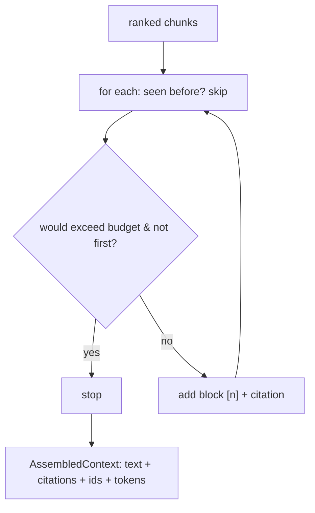

### 16.5 Real-World Analogy
Preparing a **court brief with numbered exhibits.** The paralegal picks the strongest
exhibits (ranked chunks), stops when the binder is full (token budget), removes
duplicate copies (dedup), and labels each "Exhibit 1, Exhibit 2" with a source line
(citations). The lawyer then argues "per Exhibit 1…", and anyone can flip to Exhibit 1
and verify. Context assembly builds that numbered, cited binder.

### 16.6 Example
```python
result = await retriever.retrieve(RetrievalQuery(text="iam credential rotation", top_k=3))
ctx = ContextAssembler().assemble(result, token_budget=1000)
ctx.text          # "[1] PR.AA-01 — ...\n(Source: NIST CSF · PR.AA-01)\n\n[2] ..."
ctx.citations     # [Citation(NIST_CSF, PR.AA-01, ...), ...]  (one per block)
```

### 16.7 Common Mistakes
- **Ignoring the token budget.** Overstuffed context blows the model's limit or wastes
  money; pack to budget.
- **Dropping the numbering/citations.** Then the model's claims can't be traced —
  grounding collapses.
- **Not deduplicating.** Repeated chunks waste budget and bias the model.

### 16.8 Key Takeaways
- Assembly packs ranked chunks to a token budget, dedupes, and numbers them with
  citations.
- Output = text + citations + chunk_ids + token estimate.
- This is the raw material for grounded, cited generation in Phase 4.

### 16.9 Self-Assessment
1. What three things does assembly do to the ranked chunks?
2. Why number the blocks `[1]`, `[2]`?
3. Why always include at least the top chunk, even on a tiny budget?

### 16.10 Connection to Previous Topics
`Citation` is the Phase-1 value object; here it's finally *produced from real
retrieved sources*. This closes the loop opened by `citation_verified`: Phase 3 makes
citations real, Phase 4 will verify them.

---

## Chapter 17 — Retrieval Evaluation

### 17.1 Introduction
"When an answer is wrong, check retrieval first." To do that, you must be able to
**measure** retrieval on its own. This chapter covers the evaluation harness and its
metrics.

### 17.2 Prerequisites
- Chapter 15 (the retriever).

### 17.3 Detailed Explanation
We evaluate retrieval **in isolation** from generation, so we can tell *which* half is
at fault when an answer is bad. We use a **golden set**: a list of queries, each with
the `control_id`s we *know* are relevant. Then `evaluate_retrieval` runs the retriever
on each and computes standard **information-retrieval** metrics:

- **recall@k** — *of the relevant chunks, how many did we retrieve?* (Did we find them
  at all?) 1.0 = found everything relevant.
- **precision@k** — *of what we retrieved, how much was relevant?* (How much noise?)
  1.0 = no irrelevant results.
- **MRR (Mean Reciprocal Rank)** — *how high was the first relevant hit?* 1.0 = the
  first result was relevant every time; 0.5 = typically second.
- **hit-rate** — *fraction of queries with at least one relevant hit.*

These let you tune knobs (chunk size, `candidate_multiplier`, `mmr_lambda`,
thresholds) and *see* whether a change helped or hurt, instead of guessing. The
harness is pure orchestration over the retriever, so it runs offline in CI against the
deterministic stub embedder.

### 17.4 How It Works
```mermaid
flowchart LR
    G[golden set: query → expected control_ids] --> Run[retrieve each]
    Run --> Cmp[compare retrieved vs. expected]
    Cmp --> M[recall@k · precision@k · MRR · hit-rate]
```

### 17.5 Real-World Analogy
A **spelling test with an answer key.** You don't grade a student on vibes; you check
their answers against the key and compute a score. The golden set is the answer key;
the metrics are the score. Without it, "retrieval feels better now" is just an
opinion.

### 17.6 Example
```python
cases = [RetrievalEvalCase(query="encrypt data storage bucket",
                           expected_control_ids=["PR.DS-01"]), ...]
metrics = await evaluate_retrieval(retriever, cases, k=3)
metrics.recall_at_k   # 1.0   (found the target every time)
metrics.mrr           # e.g. 0.83 (usually ranked first or second)
```

### 17.7 Common Mistakes
- **Only evaluating the final answer.** Then you can't tell if a wrong answer is a
  *retrieval* miss or a *generation* miss. Evaluate retrieval separately.
- **A tiny or biased golden set.** Metrics are only as trustworthy as the golden set;
  it should cover the query types you care about.
- **Tuning by feel.** Change a knob, re-run the metrics, keep the change only if they
  improve.

### 17.8 Key Takeaways
- Evaluate retrieval **separately** so failures are attributable.
- recall@k (found it?), precision@k (how noisy?), MRR (how high?), hit-rate (any hit?).
- The harness runs offline in CI; use it to tune knobs with evidence.

### 17.9 Self-Assessment
1. Why evaluate retrieval separately from generation?
2. Define recall@k and precision@k in one sentence each.
3. What does an MRR of 1.0 tell you?

### 17.10 Connection to Previous Topics
This is the retrieval-specific slice of the broader evaluation framework (Phase 7). It
embodies the Phase-1 principle that quality must be *measured and gated*, not asserted.

---

## Chapter 18 — Wiring, Autoload, and Preparing for Phase 4

### 18.1 Introduction
Finally: how the knowledge stack is assembled and started, and how everything you've
learned feeds the next phase.

### 18.2 Prerequisites
- The whole guide; Phase 1's composition root.

### 18.3 Detailed Explanation

**Wiring.** The composition root builds the knowledge stack via
`build_knowledge_stack(settings, gateway)`: it constructs the in-memory vector store
and keyword index, the lexical reranker, the `GatewayEmbedder` (which embeds through
the Phase-2 gateway), the `HybridRetriever`, the `IngestionService`, and the
`ContextAssembler`. It registers a `VectorStoreHealthProbe` so `/health/ready` now
reports the knowledge base (e.g. "23 chunks indexed").

**Autoload.** On startup (via the ASGI *lifespan*), if enabled and the store is empty,
the app ingests the bundled corpus automatically. So `docker compose up` yields a
**working, queryable** knowledge base with no manual step — the corpus even ships
inside the Docker image.

**CLI.** `python -m scripts.ingest_corpus [--replace]` ingests on demand (a smoke test
today; durable once pgvector lands).

**Design decisions (ADRs) recap:**
- **ADR-0005** — in-memory stores now, **pgvector in Phase 6**, behind the same ports.
  Honest: we don't ship DB code we can't run/test here.
- **ADR-0006** — structure-aware chunking + hybrid retrieval, with the rejected
  alternatives (fixed-size chunking, semantic-only, no rerank/MMR).

### 18.4 How Phase 3 sets up Phase 4
Phase 4 builds **LangGraph workflows and agents** — the enrichment and copilot flows
that finally produce grounded, cited answers. It plugs directly into what Phase 3
built:

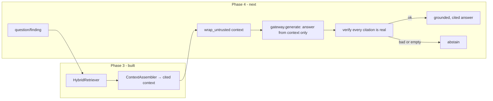
Phase 4 will: retrieve (Phase 3) → assemble context (Phase 3) → fence it with
`wrap_untrusted` (Phase 2 safety) → generate via the gateway (Phase 2) → **verify the
citations against the retrieved chunks**, and abstain if retrieval was empty or a
citation can't be verified. Every prior phase is a component of that graph.

### 18.5 Real-World Analogy
Phase 3 **stocked the library and hired a research librarian**. Phase 4 **hires the
analysts** who ask the librarian for sources, write the report citing them, and have a
fact-checker verify every footnote before it's published. You needed the library first.

### 18.6 Example (what a Phase 4 node will do)
```python
result = await retriever.retrieve(RetrievalQuery(text=finding_description, top_k=5))
if result.is_empty:
    return abstain()                                   # grounding: no source → decline
ctx = assembler.assemble(result, token_budget=2000)
answer = await gateway.generate(build_prompt(finding, ctx), auth)
verify_citations(answer, ctx.citations)                # Phase 4
```

### 18.7 Common Mistakes (looking ahead)
- **Feeding retrieved text to the model as trusted.** Retrieved chunks are *untrusted*
  too — Phase 4 fences them with `wrap_untrusted` and scans for injection (Phase 2,
  Chapter 17).
- **Skipping citation verification.** Retrieval + assembly make citations *available*;
  Phase 4 must *verify* them, or the grounding guarantee isn't closed.
- **Forgetting abstention.** An empty result must lead to "not covered by the sources,"
  never a guess.

### 18.8 Key Takeaways
- The composition root wires the whole stack; readiness reports the vector store.
- Corpus autoloads at startup (and ships in the image) → `docker compose up` just
  works.
- Phase 3's retriever + assembler are the inputs to Phase 4's grounded, verified,
  cited generation.

### 18.9 Self-Assessment
1. What does corpus autoload achieve, and when does it run?
2. Why is retrieved text still "untrusted" in Phase 4?
3. List the steps Phase 4 will take from a finding to a verified cited answer.

### 18.10 Connection to Previous Topics
Phase 3 is the middle of the arc: Phase 1 gave structure, Phase 2 gave the safe brain
and embeddings, Phase 3 gave the library and retrieval, and Phase 4 will fuse them
into the product's headline feature — explanations you can trust because every claim
has a checkable source.

---

## Final Word

If you've read this far and can answer the self-assessments, you can explain — from
first principles — why RAG exists, how regulations become searchable knowledge, how
hybrid search (semantic + lexical + fusion + rerank + MMR) finds the right rule, how
the embedding-model guard prevents a silent disaster, and how cited context sets up
grounded, verifiable answers. That's a genuinely strong RAG mental model. Onward to
Phase 4, where retrieval and generation finally meet.

