<!--
  PHASE 4 STUDY GUIDE — ComplianceIQ AI Service
  A complete, beginner-first textbook for the LangGraph Workflows & Agents phase.
-->

# Phase 4 Study Guide — Workflows & Agents

> **Who this is for:** a motivated beginner. You do **not** need to have mastered
> Phases 1–3. You do **not** need to know what a state machine, a graph, a
> "workflow," a "tool," or an "agent" is. You do **not** need to know what
> LangGraph is. We build every idea from the ground up.
>
> **How to read it:** straight through the first time. Each chapter follows the
> same rhythm — *Introduction → Prerequisites → Detailed Explanation → How It
> Works → Analogy → Example → Common Mistakes → Key Takeaways → Self-Assessment →
> Connection to Previous Topics* — so you always know where you are.
>
> **The promise:** by the end you will understand, from first principles, what a
> multi-step AI *workflow* is and why we model it as a **graph**; how we turn a
> raw finding into a **grounded, cited explanation** (or an honest abstention);
> how we make a model *propose* a fix that is **never applied**; what a **tool**
> and an **agent** are; and — the heart of the phase — how we make a tool-using
> agent **safe** by bounding it. Well enough to defend it to a senior engineer or
> a jury.

---

## What Phase 4 adds (a map to keep open)

```text
src/complianceiq/
├── domain/
│   ├── prompts/template.py           ← PromptTemplate (versioned, validated, pure render)
│   ├── policies/grounding.py         ← cite / verify / abstain (verify_citations, ABSTENTION_TEXT)
│   ├── policies/iac_safety.py        ← validate_terraform (reject over-permissive fixes)
│   ├── entities/copilot.py           ← CopilotAnswer
│   ├── entities/report.py            ← ReportDraft
│   └── exceptions.py                 ← + PromptError, WorkflowError
├── application/
│   ├── prompts/registry.py           ← PromptRegistry (serve the latest version)
│   ├── graphs/
│   │   ├── _common.py                ← SYSTEM_GROUNDED, traced_node, shared helpers
│   │   ├── enrichment.py             ← Finding → EnrichedFinding (grounded, cited)
│   │   ├── copilot.py                ← question → CopilotAnswer
│   │   ├── remediation.py            ← Finding → RemediationProposal (never applied)
│   │   └── report.py                 ← [EnrichedFinding] → ReportDraft
│   ├── tools/
│   │   ├── registry.py               ← Tool, ToolRegistry (typed, validated)
│   │   ├── budget.py                 ← AgentBudget (per-run limits)
│   │   └── corpus_tools.py           ← the built-in search_corpus tool
│   └── agents/
│       ├── base.py                   ← BoundedAgent + ToolSession (the guardrails)
│       ├── compliance_analyst.py     ← analyze(finding) → EnrichedFinding
│       ├── remediation_engineer.py   ← propose(finding) → RemediationProposal
│       ├── report_writer.py          ← write(findings) → ReportDraft
│       └── risk_analyst.py           ← correlate(findings) → narrative (uses tools)
├── infrastructure/prompts/loader.py  ← parse .prompt files → PromptTemplate
├── prompts/*.prompt                  ← the versioned prompt assets
└── composition.py                    ← AgentSuite + build_agent_suite (wiring)
```

## Table of Contents

**Part I — Foundations**
1. [What Phase 4 Is, and Why It Exists](#chapter-1--what-phase-4-is-and-why-it-exists)
2. [State Machines, and Why We Model Workflows as Graphs](#chapter-2--state-machines-and-why-we-model-workflows-as-graphs)
3. [Grounding, Enforced: Cite / Verify / Abstain](#chapter-3--grounding-enforced-cite--verify--abstain)

**Part II — Prompts as Assets**
4. [Prompts as Versioned Assets](#chapter-4--prompts-as-versioned-assets)
5. [Loading and Serving Prompts](#chapter-5--loading-and-serving-prompts)

**Part III — The Workflows (LangGraph graphs)**
6. [Anatomy of a LangGraph Graph](#chapter-6--anatomy-of-a-langgraph-graph)
7. [Shared Node Concerns: Tracing and Timeouts](#chapter-7--shared-node-concerns-tracing-and-timeouts)
8. [The Enrichment Graph](#chapter-8--the-enrichment-graph)
9. [The Copilot Graph (and a Real Bug We Hit)](#chapter-9--the-copilot-graph-and-a-real-bug-we-hit)
10. [The Remediation Graph and IaC Safety](#chapter-10--the-remediation-graph-and-iac-safety)
11. [The Report Graph](#chapter-11--the-report-graph)

**Part IV — Tools & Bounded Agents**
12. [Typed Tools and the Tool Registry](#chapter-12--typed-tools-and-the-tool-registry)
13. [Agent Budgets, and Why Agents Must Be Bounded](#chapter-13--agent-budgets-and-why-agents-must-be-bounded)
14. [The BoundedAgent and ToolSession: The Five Guardrails](#chapter-14--the-boundedagent-and-toolsession-the-five-guardrails)
15. [The Four Agents](#chapter-15--the-four-agents)
16. [Wiring It All Together, and Preparing for Phase 5](#chapter-16--wiring-it-all-together-and-preparing-for-phase-5)

---

# Part I — Foundations

---

## Chapter 1 — What Phase 4 Is, and Why It Exists

### 1.1 Introduction
Phases 1–3 built the *pieces*: a clean architecture (Phase 1), a safe gateway to
language models (Phase 2), and a knowledge base that can *retrieve* the right
regulations (Phase 3). Phase 4 is where those pieces finally **do work you can
demo**: it turns a raw compliance finding into a grounded, cited *explanation*;
answers a plain-English question; proposes a fix; and writes an executive report.

### 1.2 Prerequisites
- The Phase 2 idea of an **AI gateway**: one safe door to a language model.
- The Phase 3 idea of **retrieval**: given a query, get back the most relevant,
  citable source chunks (or nothing, if nothing is relevant).
- The word *LLM* (Large Language Model) — a program that, given text, predicts
  plausible next text.

### 1.3 Detailed Explanation
Every capability in Phase 4 is a **multi-step process**, not a single model call.
Consider "explain this finding." A naive version is one step: *ask the model.*
The real version is at least three:

1. **Retrieve** the relevant controls from the knowledge base (Phase 3).
2. If nothing relevant came back, **abstain** — do *not* ask the model to guess.
3. Otherwise **generate** the explanation from those sources, and keep only the
   citations that are actually real.

That "if nothing came back, abstain" branch is not a detail — it is the whole
difference between a trustworthy compliance product and a confident liar. So the
first big idea of Phase 4 is: **our capabilities are branchy, multi-step
processes, and we must model that structure honestly.**

The second big idea arrives with the *risk analyst*, which is genuinely
open-ended: it looks up several findings and decides how they relate. Something
has to *drive* that — calling the knowledge base once per finding, deciding when
to stop. A driver that can call capabilities in a loop is called an **agent**,
and an unbounded agent is dangerous. So the second big idea is: **when we let
software loop and call tools, we must put hard limits around it.**

Phase 4 delivers both ideas as concrete, tested machinery:
- **Workflows** — the branchy processes, modelled as explicit **graphs**
  (Chapters 2, 6–11).
- **Agents** — the bounded drivers, with enforced guardrails (Chapters 13–15).

### 1.4 How It Works (bird's-eye)
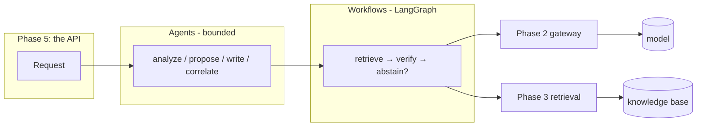
An agent is the *entry point* for one capability; it runs a *graph*; the graph
uses the Phase 3 retriever and the Phase 2 gateway. Everything you built earlier
is load-bearing here.

### 1.5 Real-World Analogy
Think of a **hospital**. Phase 3 was the *medical library*. Phase 4 is the
*clinical protocol*: a nurse doesn't just "wing it" — they follow a written,
step-by-step protocol (*take history → order tests → if results are normal,
reassure; else, escalate*). A **workflow** is that protocol written down so it's
followed the same way every time. An **agent** is the *resident doctor* who can
decide to order one more test — but only within strict limits, never unbounded.

### 1.6 Example
- *Input:* a finding — "IAM access key never rotated," severity HIGH.
- *Phase 4 output (enrichment):* an `EnrichedFinding` whose `explanation` says why
  this matters, with **verified** citations to the real NIST/ISO controls, and a
  `citation_verified=True` flag you can trust.
- *If the corpus had nothing relevant:* the same call returns the honest
  abstention "Not covered by the provided sources," `citation_verified=False`, and
  **never calls the model**.

### 1.7 Common Mistakes
- **Thinking a capability is "just one model call."** The value — and the safety —
  is in the *steps around* the call: retrieve, branch, verify, abstain.
- **Confusing a workflow with an agent.** A workflow has *fixed* steps we wrote; an
  agent *decides* its steps within limits. (Chapter 2 nails this down.)
- **Assuming more autonomy is better.** In compliance, *bounded and predictable*
  beats *clever and free* every time.

### 1.8 Key Takeaways
- Phase 4 makes Phases 1–3 *do visible work*: enrich, answer, remediate, report.
- Its capabilities are **multi-step, branchy processes**, modelled as graphs.
- The genuinely open-ended capability needs an **agent**, which must be **bounded**.

### 1.9 Self-Assessment
1. Name the three steps hiding inside "explain this finding."
2. In one sentence each, what is a *workflow* and what is an *agent*?
3. Why is the "abstain" branch the most important step, in a compliance product?

### 1.10 Connection to Previous Topics
Phase 3 promised that grounding would be *possible*; Phase 4 makes it *enforced*.
The `citation_verified` flag defined back in Phase 1 finally gets set by real
logic here (Chapter 3), and every model call still goes through the Phase 2
gateway with its injection scanning intact.

---

## Chapter 2 — State Machines, and Why We Model Workflows as Graphs

### 2.1 Introduction
The single most important design decision in Phase 4 is: *how do we represent a
multi-step process in code?* The easy answer (a chain of function calls) is a
trap. The right answer is a **graph** — a small **state machine**. This chapter
builds that idea from zero.

### 2.2 Prerequisites
- Chapter 1.
- The idea of a function that takes input and returns output.

### 2.3 Detailed Explanation
A **state machine** is a way of describing a process as: a bag of **state** (what
we know so far), a set of **steps** (each step reads the state and adds to it),
and **transitions** (rules for which step runs next, which may *branch* on the
state). A **graph** draws that as boxes (steps, called **nodes**) connected by
arrows (**edges**).

Why not just write the steps as ordinary Python, like this?

```python
async def enrich(finding):
    context = await retrieve(finding)     # step 1
    if context.is_empty:                   # branch
        return abstain(finding)
    return await generate(finding, context)  # step 2
```

That works for three steps. But watch what happens as real requirements arrive:
- The abstain branch is a buried `if` — easy to miss when reading, easy to break.
- To unit-test "does generate build the right request?" you must run retrieve
  first, or fake it awkwardly — the steps are **coupled**.
- You want a **timeout** on each step, **logging** for each step, and a **trace**
  of what ran. Now every function is cluttered with the same boilerplate.
- A new branch ("retry once if the model returns empty") means surgery on the
  control flow.

Modelling the same process as an explicit **graph** fixes all of this:
- Each step is a **node** — a small function tested in isolation.
- Each branch is a declared **edge** — visible, not buried.
- Cross-cutting concerns (timeout, logging, trace) wrap every node **once**.
- The shape of the process is data you can inspect, not control flow you must
  trace by eye.

This is why Phase 4 uses **LangGraph**, a small library for building exactly these
state graphs. We'll meet its concrete API in Chapter 6; for now, the point is
*conceptual*: **a workflow is a state machine, and we write it as one.**

### 2.4 How It Works (the shape of every graph)
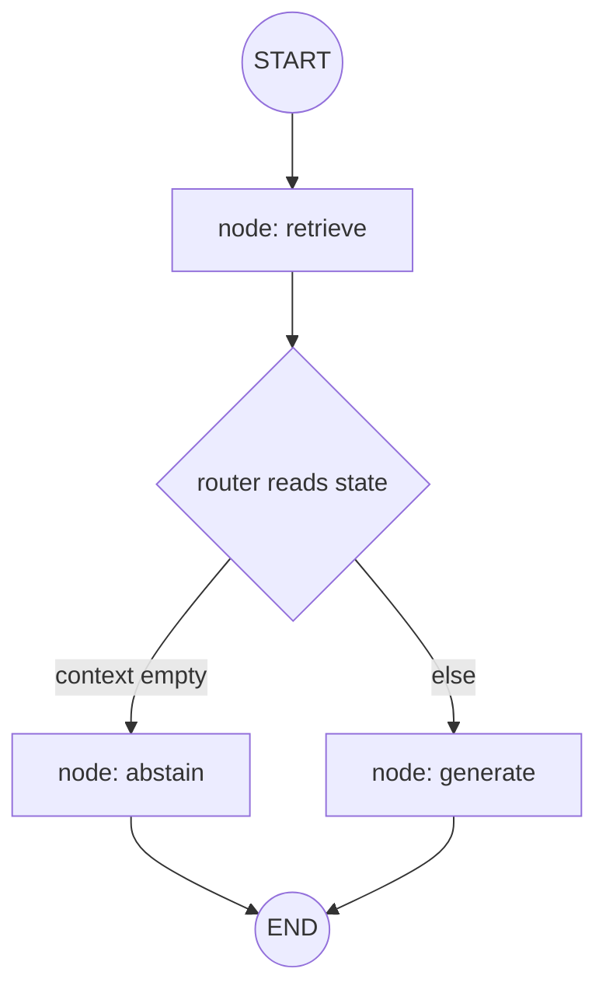
Every graph in Phase 4 has this skeleton: a `START`, some nodes, optional
branch-points (a **router** function that returns the name of the next node), and
an `END`. The **state** flows along the arrows, each node adding to it.

### 2.5 Real-World Analogy
A **board game**. The *board* is the graph (fixed places and the paths between
them). Your *game state* is your position, cards, and money. On each square you
follow the rule printed there (a node), and sometimes a square says "if you rolled
doubles, go here, else there" (a branch). Anyone can look at the board and
understand the whole game — because the structure is drawn, not hidden in a rule
book you have to read line by line.

### 2.6 Example
The enrichment workflow as a state machine:
- **State:** `{finding, context?, enriched?, trace}`.
- **Nodes:** `retrieve` (adds `context`), `generate` (adds `enriched`), `abstain`
  (adds `enriched`).
- **Edges:** `START → retrieve`; then a router: empty context `→ abstain`, else
  `→ generate`; both `→ END`.

### 2.7 Common Mistakes
- **"A graph is overkill for three steps."** The three steps are never the end
  state; the graph pays for itself the first time you add a branch, a timeout, or
  a test.
- **Hiding a branch in an `if` inside a node.** Branches belong on *edges*, where
  they're visible; a node should do one thing.
- **Putting business rules in the router.** The router only *chooses the next
  node* from the state; the work happens in nodes.

### 2.8 Key Takeaways
- A multi-step process is a **state machine**: state + nodes + transitions.
- Modelling it as a **graph** makes branches visible, nodes testable, and
  cross-cutting concerns uniform.
- Phase 4 uses **LangGraph** to write these graphs; the *idea* matters more than
  the library.

### 2.9 Self-Assessment
1. What are the three ingredients of a state machine?
2. Give two concrete problems with writing a workflow as a plain function chain.
3. Where does a *branch* belong — in a node or on an edge? Why?

### 2.10 Connection to Previous Topics
This is Phase 1's "separation of concerns" applied *inside* a use case: each node
is a small, single-responsibility unit, and the graph is the composition. LangGraph
lives only in the **application** layer — the import-linter contracts from Phase 1
still forbid the domain from importing it (Chapter 6).

---

## Chapter 3 — Grounding, Enforced: Cite / Verify / Abstain

### 3.1 Introduction
Phase 3 taught the *idea* of grounding (tie every claim to a real source, or
abstain). Phase 4 turns that idea into **code that cannot be skipped**. Three
verbs: **cite**, **verify**, **abstain**. This chapter is the moral centre of the
whole phase.

### 3.2 Prerequisites
- Chapter 2 of the Phase 3 guide (hallucination and grounding), or just this: an
  LLM can produce a *confident, fluent, wrong* citation, and in compliance that is
  disqualifying.
- The Phase 1 `Citation` value object: `(framework, control_id, reference)`.

### 3.3 Detailed Explanation
Grounding has three enforced parts, all in `domain/policies/grounding.py` (a
**pure** module — no I/O, so it's trivial to test):

**1. Cite.** Every generated answer carries a list of `Citation`s pointing to
specific controls. The prompt (Chapter 4) *instructs* the model to cite; but
instructions are not guarantees, which is why we also…

**2. Verify.** `verify_citations(claimed, available)` checks the citations an
answer *claims* against the citations actually *retrieved and shown* to the model.
A claimed citation is **verified** only if an available one shares its `framework`
**and** `control_id`. Anything else is **rejected** — this is precisely what stops
a model from inventing a plausible-looking reference. Duplicate claims collapse.
The function returns a `CitationVerification` with `verified`, `unverified`, and
two conveniences: `all_verified` (nothing rejected) and `has_verified` (at least
one survived).

```python
def verify_citations(claimed, available):
    available_keys = {(c.framework, c.control_id) for c in available}
    verified, unverified, seen = [], [], set()
    for citation in claimed:
        key = (citation.framework.value, citation.control_id)
        if key in seen:            # collapse duplicates
            continue
        seen.add(key)
        if (citation.framework, citation.control_id) in available_keys:
            verified.append(citation)
        else:
            unverified.append(citation)   # invented → rejected
    return CitationVerification(verified=verified, unverified=unverified)
```

**3. Abstain.** When retrieval returns nothing relevant, the correct output is a
first-class **abstention**, never a guess. The canonical sentence is a constant:

```python
ABSTENTION_TEXT = "Not covered by the provided sources."
```

The graphs (Chapter 8) take the abstain path as a *declared edge* and, crucially,
**never call the model** on it. The `citation_verified` flag on the output is set
to `True` only when *every* claimed citation verified **and** the context was
non-empty — so an abstention is always `citation_verified=False`.

### 3.4 How It Works (where each verb lives)
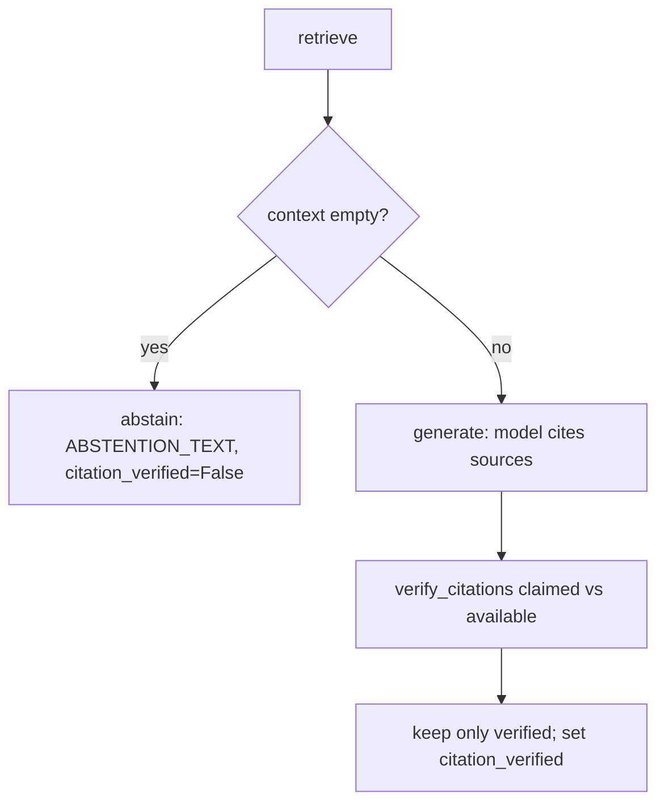

### 3.5 Real-World Analogy
A **fact-checker at a newspaper**. The reporter (the model) writes a story with
footnotes. The fact-checker (verify) crosses out every footnote that doesn't point
to a source in the actual research folder. If the folder is empty, the paper
doesn't run a guess — it says "we couldn't confirm this" (abstain). The published
"verified" badge (`citation_verified`) means the fact-checker signed off, not the
reporter.

### 3.6 Example
- *Available (retrieved):* `NIST PR.AA-01`, `NIST PR.DS-01`.
- *Model claims:* `NIST PR.AA-01` (real) and `ISO A.99.9` (invented).
- *`verify_citations` result:* `verified = [PR.AA-01]`, `unverified = [A.99.9]`,
  `all_verified = False`. The answer keeps only `PR.AA-01`; `citation_verified` is
  `False` because one claim was rejected. (There is a unit test for exactly this.)

### 3.7 Common Mistakes
- **Trusting the model's `citation_verified`.** The *model* never sets it; the
  *policy* does, after verification. This is deliberate.
- **Treating abstention as an error.** "Not covered by the provided sources" is a
  *correct, tested outcome*, better than a confident wrong answer.
- **Verifying by `control_id` alone.** The `framework` must match too — the same
  id can mean different things across frameworks (there's a test for that).

### 3.8 Key Takeaways
- Grounding = **cite → verify → abstain**, enforced in a pure policy module.
- `verify_citations` rejects any citation not among the retrieved sources.
- `citation_verified` is authoritative and comes from the policy, never the model;
  an abstention is always `False`.

### 3.9 Self-Assessment
1. When is a claimed citation considered *verified*?
2. Why must the abstain branch avoid calling the model?
3. Who sets `citation_verified`, and why not the model?

### 3.10 Connection to Previous Topics
This closes the loop opened in Phase 1 (the `citation_verified` field existed but
nothing set it) and Phase 3 (retrieval could return "nothing," but nothing acted
on it yet). Phase 4 is where the empty result *becomes* an abstention and the
citations *get checked*.

---

# Part II — Prompts as Assets

---

## Chapter 4 — Prompts as Versioned Assets

### 4.1 Introduction
A **prompt** is the instruction text we send to a model. The tempting thing is to
write prompts as string literals sprinkled through the code. Phase 4 refuses that
and treats prompts as **assets**: files with an id, a version, and declared
variables. This chapter explains why, and how our `PromptTemplate` works.

### 4.2 Prerequisites
- Chapter 1.
- The idea of a template with *placeholders* to fill in (like a form letter).

### 4.3 Detailed Explanation
Why treat prompts as versioned assets and not just strings?
- **Reviewable & diffable.** A prompt is product-critical text; a change to it
  should show up in a pull request like any other change.
- **Versioned.** When you improve a prompt, you bump its version. You can keep the
  old one for comparison, and roll back instantly.
- **Attributable.** Every generation records which prompt *version* produced it
  (the `id@version` key), so when evaluating quality you know exactly what ran.

Our `PromptTemplate` (in `domain/prompts/template.py`) is a frozen model with:
`id`, `version` (≥ 1), `description`, `variables` (the names it expects), and
`template` (the body). Two things make it robust:

**Placeholders use double braces — `{{ name }}`.** Why double? Because prompt
bodies often contain JSON or code with *single* braces (`{"key": true}`), and
those must pass through untouched. Single-brace templating would mangle them.

**Rendering is pure and strict.** `render(variables)` fails **loudly** if you
forget a declared variable, or if the body references a placeholder you didn't
provide — so a malformed prompt breaks at render time instead of silently sending
`{{ context }}` to a model:

```python
_PLACEHOLDER = re.compile(r"{{\s*(\w+)\s*}}")

def render(self, variables):
    missing = [n for n in self.variables if n not in variables]
    if missing:
        raise PromptError(f"prompt '{self.key}' missing variables: {sorted(missing)}")
    def _replace(match):
        name = match.group(1)
        if name not in variables:
            raise PromptError(f"prompt '{self.key}' references undeclared placeholder '{name}'")
        return str(variables[name])
    return _PLACEHOLDER.sub(_replace, self.template)
```

The `key` property returns `f"{id}@{version}"` — e.g. `enrich_finding@1` — the
attribution string recorded in traces.

### 4.4 How It Works (a .prompt file)
Prompts live in files under `prompts/`, in a tiny format: frontmatter (`key:
value` lines), a `---` separator, then the body.

```text
id: enrich_finding
version: 1
description: Explain why a finding is non-compliant, grounded in context.
variables: finding, context
---
You are explaining a compliance finding …
FINDING: {{ finding }}
SOURCES: {{ context }}
Answer using ONLY the sources above and cite them as [1], [2].
If the sources do not cover it, reply exactly: Not covered by the provided sources.
```

### 4.5 Real-World Analogy
A **legal contract template** in a law firm. It's not retyped from memory each
time — it's a version-controlled document with blanks (`{{ client_name }}`).
Version 3 fixed a loophole version 2 had; the firm records which version each
signed contract used. That's exactly our prompt discipline.

### 4.6 Example
```python
tpl = PromptTemplate(id="greet", version=1, variables=["name"],
                     template="Hello {{ name }}! Config: {\"debug\": true}")
tpl.render({"name": "world"})   # "Hello world! Config: {\"debug\": true}"
tpl.render({})                  # raises PromptError: missing variables ['name']
tpl.key                         # "greet@1"
```
Notice the single-brace JSON survived untouched.

### 4.7 Common Mistakes
- **Single-brace templating.** It corrupts any JSON/code in the prompt body; double
  braces are deliberate.
- **Forgetting to declare a variable.** If it's in the body but not in
  `variables`, `render` will still demand it at fill time — declare it so the
  contract is explicit.
- **Editing a prompt in place instead of bumping the version.** You lose
  attribution and rollback.

### 4.8 Key Takeaways
- Prompts are **assets**: id + version + declared variables + body, in files.
- `{{ double braces }}` so JSON/code in the body passes through.
- `render` is **pure and strict** — missing or undeclared variables raise
  `PromptError`, never a silent bad prompt.

### 4.9 Self-Assessment
1. Give two reasons to version prompts.
2. Why double braces instead of single?
3. What does `render` do when you forget a declared variable?

### 4.10 Connection to Previous Topics
This is the same instinct as Phase 3's "corpus is a versioned asset" and Phase 1's
"frozen, validated models": make important things *explicit, immutable, and
checked*, so mistakes fail loudly and early.

---

## Chapter 5 — Loading and Serving Prompts

### 5.1 Introduction
We have prompt *files*. Now we need to (a) read them into `PromptTemplate` objects,
and (b) look them up by id at runtime, serving the newest version. Those are the
**loader** and the **registry**.

### 5.2 Prerequisites
- Chapter 4 (the `.prompt` file format and `PromptTemplate`).

### 5.3 Detailed Explanation
**The loader** (`infrastructure/prompts/loader.py`) is deliberately
dependency-free (no YAML library) so it stays light. `parse_prompt(text)` splits
the frontmatter from the body at the `---` separator, reads the `key: value`
lines (ignoring blanks and `#` comments), and constructs a `PromptTemplate`. It
raises `PromptError` if the separator is missing, a frontmatter line is malformed,
or `id`/`version` are absent. `load_prompts(directory)` reads every `*.prompt`
file in sorted (deterministic) order; a missing directory yields an empty list.

Why is the loader in **infrastructure**? Because reading files is I/O, and Phase
1's rule is that I/O lives at the edges. The *shape* (`PromptTemplate`) is domain;
the *reading* is infrastructure.

**The registry** (`application/prompts/registry.py`) indexes the loaded templates
two ways: by exact `id@version` key, and by id → **latest** version. `get(id)`
serves the latest by default, `get(id, version=2)` pins an exact one, and
`render(id, variables)` returns `(rendered_text, prompt_key)` so callers get both
the filled prompt *and* the attribution key in one call. Unknown ids raise
`PromptError`.

```python
class PromptRegistry:
    def __init__(self, templates):
        self._by_key, self._latest = {}, {}
        for t in templates:
            self._by_key[t.key] = t
            cur = self._latest.get(t.id)
            if cur is None or t.version > cur.version:
                self._latest[t.id] = t          # keep the newest per id
```

### 5.4 How It Works (from files to a served prompt)
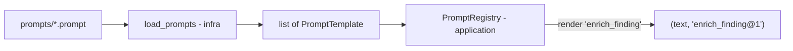

### 5.5 Real-World Analogy
A **library card catalogue**. The loader is the librarian who reads each new book's
title page and files a card. The registry is the catalogue: ask for "the RAG
handbook" and you get the *latest edition* by default, or a specific edition if
you name it.

### 5.6 Example
```python
from pathlib import Path
registry = PromptRegistry(load_prompts(Path("prompts")))
text, key = registry.render("enrich_finding",
                            {"finding": "...", "context": "..."})
# key == "enrich_finding@1"; text is the filled prompt
registry.get("nope")   # raises PromptError: unknown prompt 'nope'
```

### 5.7 Common Mistakes
- **Putting the loader in the domain.** File reading is I/O — it belongs in
  infrastructure (Phase 1 rule).
- **Serving a random version.** The registry must serve the *latest* by default; a
  new file version should win automatically.
- **Hard-failing on an empty directory.** `load_prompts` returns `[]` — missing
  prompts is a config problem surfaced elsewhere, not a crash in the loader.

### 5.8 Key Takeaways
- **Loader** (infra) parses `.prompt` files → `PromptTemplate` list, deterministically.
- **Registry** (application) serves the latest version by id, or a pinned version,
  and hands back the `id@version` key for attribution.
- Unknown prompt ids raise `PromptError`.

### 5.9 Self-Assessment
1. Why is the loader in infrastructure and the registry in application?
2. Which version does `registry.get("x")` return, and how do you pin one?
3. What does `render` return besides the filled text, and why is that useful?

### 5.10 Connection to Previous Topics
Same layering as Phase 3's corpus loaders (infra reads JSON → domain
`CorpusDocument`). The registry is built once in the composition root (Chapter 16),
exactly where Phase 1 said all wiring belongs.

---

# Part III — The Workflows (LangGraph graphs)

---

## Chapter 6 — Anatomy of a LangGraph Graph

### 6.1 Introduction
Time to meet the real API. This chapter dissects the four moving parts every one
of our graphs shares: **typed state**, **nodes**, **edges** (including the
branching *conditional* edges), and a **checkpointer**. Learn it once here; the
graph chapters (8–11) then read easily.

### 6.2 Prerequisites
- Chapter 2 (workflow = state machine = graph).
- Basic Python typing (`TypedDict`, `Annotated`).

### 6.3 Detailed Explanation
**Typed state.** Each graph declares its state as a `TypedDict`. `total=False`
means every key is optional (nodes fill keys in as they run). One key is special:
the **trace**, declared with a *reducer* so that when several nodes each return a
one-item trace list, LangGraph **adds** them together instead of overwriting:

```python
class EnrichmentState(TypedDict, total=False):
    finding: Finding
    context: Any
    enriched: EnrichedFinding
    trace: Annotated[list[TraceEvent], operator.add]   # ← accumulates
```

**Nodes.** A node is an `async` function `state → partial-state-update`. In our
code nodes are **bound methods** of a graph class, so their dependencies
(retriever, gateway, prompts) are injected via the constructor. That's what makes
each node unit-testable in isolation and the whole graph runnable offline with a
fake gateway.

**Edges.** `add_edge(A, B)` means "after A, always do B." `add_edge(START, "retrieve")`
is the entry. The interesting one is `add_conditional_edges("retrieve", router,
{"generate": "generate", "abstain": "abstain"})`: after `retrieve`, call the
`router` function, which returns a *string* naming the next node. That is how a
branch becomes a first-class edge.

**Compile + checkpointer.** `graph.compile(checkpointer=MemorySaver())` produces a
runnable app. A **checkpointer** saves the state at each step under a **thread id**;
we give each run a fresh id (`uuid4().hex`). This gives us per-run isolation and
satisfies the "workflows are checkpointed" requirement without a database.

**Running it.** `await app.ainvoke(initial_state, config={"configurable":
{"thread_id": ...}})` runs the graph to `END` and returns the final state; the
`run()` method then pulls out the one field it promises (e.g. `final["enriched"]`).

### 6.4 How It Works (the build method, distilled)
```python
def _build(self):
    graph = StateGraph(EnrichmentState)
    graph.add_node("retrieve", traced_node("retrieve", self._retrieve, ...))
    graph.add_node("generate", traced_node("generate", self._generate, ...))
    graph.add_node("abstain",  traced_node("abstain",  self._abstain, ...))
    graph.add_edge(START, "retrieve")
    graph.add_conditional_edges("retrieve", self._route,
                                {"generate": "generate", "abstain": "abstain"})
    graph.add_edge("generate", END)
    graph.add_edge("abstain", END)
    return graph.compile(checkpointer=MemorySaver())
```

### 6.5 Real-World Analogy
A **subway map**. Stations are nodes; lines are edges; a junction where a sign says
"trains with an even number go left" is a conditional edge. Your ticket, updated at
each station, is the state. The map (compiled graph) is fixed; your journey through
it is one run.

### 6.6 Example
Every graph exposes an async `run(...)`; internally it calls `ainvoke` with a fresh
thread id and returns one field:
```python
enriched = await enrichment_graph.run(finding, auth)   # returns final["enriched"]
```

### 6.7 Common Mistakes
- **A node name equal to a state key.** LangGraph forbids it — and we hit exactly
  this bug (Chapter 9). Name nodes as *verbs* (`respond`), keys as *nouns*
  (`answer`).
- **Forgetting the trace reducer.** Without `Annotated[..., operator.add]`, the last
  node's trace overwrites the rest.
- **Reusing one thread id across runs.** Each run needs its own, or their
  checkpointed states collide.

### 6.8 Key Takeaways
- A LangGraph graph = **typed state + nodes + edges + checkpointer**.
- Nodes are injected **bound methods** (testable, offline-runnable).
- Branches are **conditional edges** driven by a small router function.
- Each run gets a fresh **thread id**; the trace key uses an **add reducer**.

### 6.9 Self-Assessment
1. What does `total=False` on the state `TypedDict` mean?
2. What does a *router* function return, and where is it wired?
3. Why does each run use a fresh thread id?

### 6.10 Connection to Previous Topics
Injected bound-method nodes are Phase 1's **dependency injection** at node
granularity. Running offline against a fake gateway is the same **deterministic,
offline testing** discipline from Phases 2–3.

---

## Chapter 7 — Shared Node Concerns: Tracing and Timeouts

### 7.1 Introduction
Every node wants the same three things around it: a **timeout** (so a hung step
can't stall the graph), **structured logging**, and a **trace** entry (so a run is
observable). We write that *once*, in `application/graphs/_common.py`, and wrap
every node with it. This chapter is that wrapper.

### 7.2 Prerequisites
- Chapter 6 (nodes and state).
- The Phase 2 idea of a **timeout** and structured logging.

### 7.3 Detailed Explanation
`traced_node(name, fn, *, timeout_seconds, logger)` takes a raw node function and
returns a wrapped node that:
1. Runs `fn` under `asyncio.wait_for(...)`. If it exceeds `timeout_seconds`, it
   logs a warning and raises `WorkflowError` — a hung model call cannot freeze the
   whole graph.
2. On success, measures the elapsed milliseconds, logs a structured `graph_node_ok`
   event, and appends **one** `TraceEvent` (`{node, status, duration_ms, detail}`)
   to the trace.
3. Pops a private `_detail` key a node may set, so a node can contribute a
   human-readable note ("18 chunks") to its trace entry without polluting the state.

```python
async def _node(state):
    start = time.perf_counter()
    try:
        result = await asyncio.wait_for(fn(state), timeout=timeout_seconds)
    except TimeoutError as exc:
        logger.warning("graph_node_timeout", node=name, timeout_s=timeout_seconds)
        raise WorkflowError(f"graph node '{name}' timed out", details={"node": name}) from exc
    elapsed_ms = round((time.perf_counter() - start) * 1000, 2)
    event = {"node": name, "status": "ok", "duration_ms": elapsed_ms,
             "detail": str(result.get("_detail", ""))}
    result.pop("_detail", None)
    return {**result, "trace": [event]}
```

`_common.py` also holds two shared helpers — `retrieve_and_assemble(...)` (run the
Phase 3 retriever + assembler and return the cited context) and `finding_summary(finding)`
(render a finding as one consistent line used both as the *retrieval query* and
inside the *prompt*) — and the constant `SYSTEM_GROUNDED`, the system instruction
that pins the model to the sources, forbids obeying instructions hidden in
untrusted content, mandates `[n]` citations, and prescribes the exact abstention
sentence.

### 7.4 How It Works (one node, wrapped)
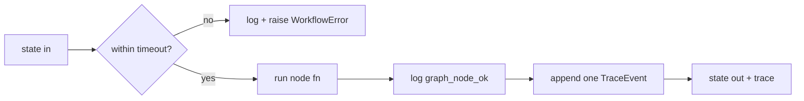

### 7.5 Real-World Analogy
A **stopwatch-and-logbook clipped to every worker on an assembly line**. Each
worker just does their job; the clip automatically times them, writes a line in the
logbook, and pulls the cord (raises) if anyone takes too long. The workers don't
each re-implement timing — it's clipped on uniformly.

### 7.6 Example
A node returns `{"context": ctx, "_detail": f"{len(ctx.chunk_ids)} chunks"}`. After
wrapping, the graph state gains `context`, and the trace gains
`{node: "retrieve", status: "ok", duration_ms: 4.1, detail: "18 chunks"}`; the
`_detail` key is gone from the state.

### 7.7 Common Mistakes
- **Re-implementing timeout/logging in each node.** That's what the wrapper is for.
- **Returning a multi-item trace list from a node.** Each node returns *one* event;
  the reducer accumulates across nodes.
- **Leaking `_detail` into the state.** The wrapper pops it — nodes must use that
  key for the trace note, not a real state field.

### 7.8 Key Takeaways
- `traced_node` wraps every node with **timeout → `WorkflowError`**, structured
  logging, and **one trace event**.
- Shared helpers (`retrieve_and_assemble`, `finding_summary`) and the
  `SYSTEM_GROUNDED` instruction also live in `_common.py`.
- Cross-cutting concerns are written **once** and applied uniformly.

### 7.9 Self-Assessment
1. What happens when a node exceeds its timeout?
2. How does a node add a human-readable note to its trace entry?
3. Why must each node return only one trace event?

### 7.10 Connection to Previous Topics
This is the Phase 2 gateway philosophy — *one choke point for cross-cutting
policy* — applied to graph nodes. `WorkflowError` is the new domain exception that
maps to an HTTP 500 in Phase 5, consistent with Phase 1's typed-exception scheme.

---

## Chapter 8 — The Enrichment Graph

### 8.1 Introduction
Our first full workflow, and the template for the rest: turn a `Finding` into an
`EnrichedFinding` — a grounded, cited explanation — or an honest abstention. It
ties together everything in Parts I–II.

### 8.2 Prerequisites
- Chapters 3 (grounding), 6 (graph anatomy), 7 (traced nodes).

### 8.3 Detailed Explanation
`EnrichmentGraph` (in `application/graphs/enrichment.py`) has three nodes:

- **`_retrieve`** builds a retrieval query from `finding_summary(finding)`, runs the
  Phase 3 retriever + assembler, and puts the cited `context` in the state.
- **`_route`** (the router) returns `"abstain"` if `context.is_empty`, else
  `"generate"`. The whole grounding branch is *this one line*.
- **`_generate`** renders the `enrich_finding` prompt with the finding summary and
  the retrieved context **wrapped in untrusted delimiters** (`wrap_untrusted`, from
  Phase 2's injection defence), calls the gateway, then verifies citations and
  builds the `EnrichedFinding`. `citation_verified` is
  `verification.all_verified and not context.is_empty`.
- **`_abstain`** builds an `EnrichedFinding` with `explanation = ABSTENTION_TEXT`,
  no citations, `citation_verified = False` — and **never calls the model**.

```python
async def _generate(self, state):
    finding, auth, context = state["finding"], state["auth"], state["context"]
    rendered, _ = self._prompts.render(
        "enrich_finding",
        {"finding": finding_summary(finding), "context": wrap_untrusted(context.text)},
    )
    request = LLMRequest(messages=[LLMMessage.system(SYSTEM_GROUNDED),
                                   LLMMessage.user(rendered)],
                         task=TaskClass.REASONING, feature="enrich")
    completion = await self._gateway.generate(request, auth)
    verification = verify_citations(context.citations, context.citations)
    enriched = EnrichedFinding(**finding.model_dump(),
        explanation=completion.text.strip() or ABSTENTION_TEXT,
        citations=verification.verified,
        citation_verified=verification.all_verified and not context.is_empty)
    return {"enriched": enriched}
```

(Here `claimed` and `available` are both `context.citations` — the model is *told*
to cite from the numbered sources, so the sources it was shown are exactly the set
we verify against. If a later provider claims a citation outside that set, verify
would drop it.)

### 8.4 How It Works (the whole graph)
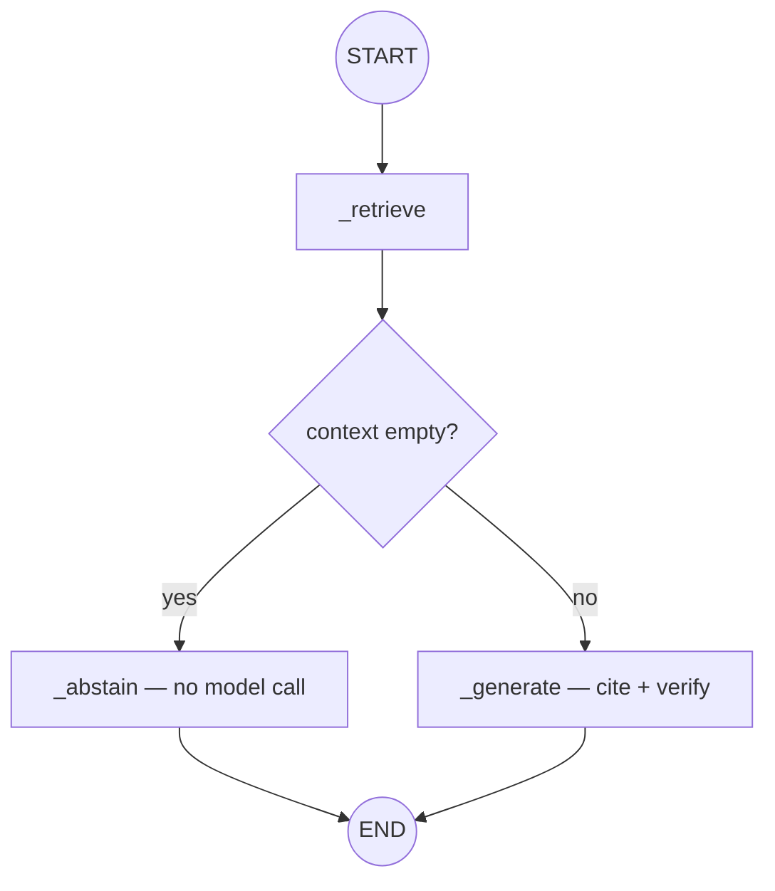

### 8.5 Real-World Analogy
A **diligent research assistant**. You hand them a question (the finding). They
pull the relevant files (retrieve). If the files are empty, they tell you honestly
"we have nothing on this" (abstain) — they don't invent an answer. If there are
files, they write a memo citing them, and a supervisor strikes any citation not in
the folder (verify).

### 8.6 Example
```python
enriched = await enrichment_graph.run(finding, auth)
enriched.explanation        # "IAM keys must be rotated within 90 days [1]."
enriched.citation_verified  # True — every cited control was retrieved
# with an empty corpus:
enriched.explanation        # "Not covered by the provided sources."
enriched.citation_verified  # False, and the model was never called
```

### 8.7 Common Mistakes
- **Feeding the model raw retrieved text.** Always `wrap_untrusted` it first —
  retrieved content is untrusted (Phase 2/Chapter 3).
- **Setting `citation_verified` from the model's output.** It comes from
  `verify_citations`, gated on a non-empty context.
- **Calling the model on the abstain path.** The whole point is *not* to.

### 8.8 Key Takeaways
- Enrichment = `retrieve → (empty? abstain : generate → verify)`.
- The grounding branch is a one-line router; abstain never calls the model.
- Retrieved context is always wrapped as untrusted before entering the prompt.

### 8.9 Self-Assessment
1. What are the three nodes, and which one can skip the model entirely?
2. Why wrap the context with `wrap_untrusted` before rendering the prompt?
3. Write the boolean expression that sets `citation_verified`.

### 8.10 Connection to Previous Topics
Every prior phase shows up: Phase 1's `EnrichedFinding` and `citation_verified`,
Phase 2's gateway + `wrap_untrusted`, Phase 3's retriever + assembler, and this
phase's grounding policy and prompts. This graph is the payoff.

---

## Chapter 9 — The Copilot Graph (and a Real Bug We Hit)

### 9.1 Introduction
The copilot answers a plain-English question ("How should IAM keys be managed?")
with the same grounding discipline as enrichment. It's nearly the same graph — and
building it surfaced a genuine LangGraph gotcha worth learning from.

### 9.2 Prerequisites
- Chapter 8 (enrichment graph). Copilot is its sibling.

### 9.3 Detailed Explanation
`CopilotGraph` (in `application/graphs/copilot.py`) has nodes `_retrieve`,
`_respond`, `_abstain`, and router `_route`. Flow: `retrieve → (empty? abstain :
respond) → END`. `_respond` renders the `copilot_answer` prompt (question +
wrapped context), calls the gateway, verifies citations, and returns a
`CopilotAnswer` (`question`, `answer`, `citations`, `citation_verified`,
`abstained=False`). `_abstain` returns `answer = ABSTENTION_TEXT`, `abstained=True`,
`citation_verified=False`.

**The bug.** The state key holding the result is `answer`. The obvious name for
the node that produces it is *also* `answer`. LangGraph **forbids a node name that
equals a state key** and raised:

```
ValueError: 'answer' is already being used as a state key
```

**The fix** — and the general rule: **name nodes as verbs, state keys as nouns.**
We renamed the node/method to `respond`/`_respond`, updated the conditional-edge
map and the edges, and it compiled. This is exactly the "common mistake" flagged in
Chapter 6.4 — here's where it bit for real.

### 9.4 How It Works
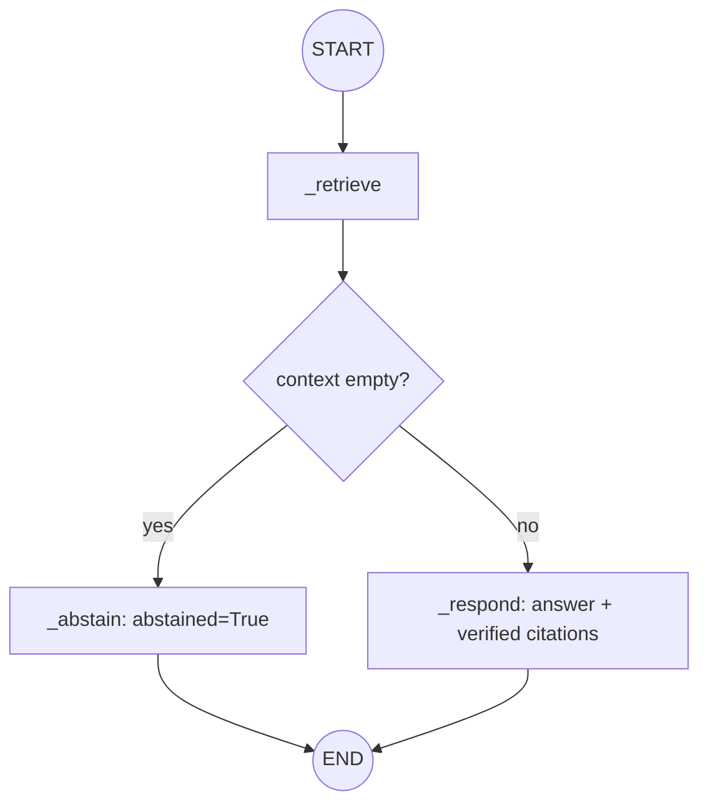

### 9.5 Real-World Analogy
A **help desk with a knowledge base**. A good agent answers only from the official
articles and links them; if there's no article, they say "I don't have
documentation on that" rather than guessing. The naming bug is like labelling both
a *room* and an *action* "Answer" on the office map — signs become ambiguous, so
you rename the room "Response Desk."

### 9.6 Example
```python
ans = await copilot_graph.run("How should IAM access keys be managed?", auth)
ans.abstained, ans.citation_verified   # (False, True)
# filtered to a framework absent from the corpus → nothing retrieved:
ans = await copilot_graph.run("…", auth, metadata_filter=MetadataFilter(framework=Framework.SOC_2))
ans.abstained, ans.answer              # (True, "Not covered by the provided sources.")
```

### 9.7 Common Mistakes
- **Node name == state key.** The bug of this chapter. Verbs for nodes, nouns for
  keys.
- **Returning `abstained=False` on the abstain path.** The flag must reflect what
  actually happened.
- **Skipping citation verification because "it's just Q&A."** Same grounding rules
  apply to answers as to enrichment.

### 9.8 Key Takeaways
- Copilot mirrors enrichment: `retrieve → (abstain | respond)`, fully grounded.
- **Never name a node the same as a state key** — LangGraph rejects it.
- `CopilotAnswer` carries `abstained` and `citation_verified` so callers know how
  much to trust the answer.

### 9.9 Self-Assessment
1. What error does a node-name/state-key collision produce, and how do you avoid it?
2. Which fields on `CopilotAnswer` tell a caller how much to trust it?
3. How is copilot's structure the same as enrichment's?

### 9.10 Connection to Previous Topics
Reinforces Chapter 3 (grounding) and Chapter 6 (graph anatomy), and shows that the
"common mistakes" in this guide are not hypothetical — they're lessons paid for in
real debugging.

---

## Chapter 10 — The Remediation Graph and IaC Safety

### 10.1 Introduction
Now the workflow with the sharpest safety teeth: proposing a fix. The model writes
**Terraform** (infrastructure-as-code) to remediate a finding — and we guarantee
two things: the proposal is **never auto-applied**, and it is **statically checked**
for changes that would make things *worse*.

### 10.2 Prerequisites
- Chapter 8 (a graph with retrieve + generate).
- The idea of *Terraform*: text that declares cloud infrastructure. You don't need
  to write it — just know it *describes* resources and permissions.

### 10.3 Detailed Explanation
`RemediationGraph` (in `application/graphs/remediation.py`) is linear:
`retrieve → generate → validate`. No abstain branch — a remediation request always
produces a proposal or an error.

- **`_generate`** renders the `remediation` prompt, calls the gateway, and builds a
  `RemediationProposal` with the Terraform, a grounded justification, and verified
  citations. Critically, `approved` is **forced to `False`** — the model cannot set
  it. This is **non-negotiable rule 2**: *the service proposes; a human disposes.*
  We never touch a customer environment.
- **`_validate`** runs `validate_terraform(proposal.terraform)` (the domain policy
  in `domain/policies/iac_safety.py`). If it finds any over-permissive pattern, the
  node logs a warning and raises `WorkflowError` — an unsafe "fix" is *rejected*,
  not offered.

`validate_terraform` is a pure, deterministic scan for dangerous constructs — a
wildcard principal (`Principal = "*"`), a wildcard action, an open CIDR
(`0.0.0.0/0`, `::/0`), a public ACL (`public-read-write`), an allow-all statement.
The patterns are **precise IaC** (`acl = "public-read-write"`), not loose words, so
that *prose* discussing "public access" in a justification never trips them; only
real dangerous HCL/JSON does.

```python
def validate_terraform(terraform: str) -> list[str]:
    return [label for pattern, label in _FORBIDDEN if pattern.search(terraform)]
```

### 10.4 How It Works
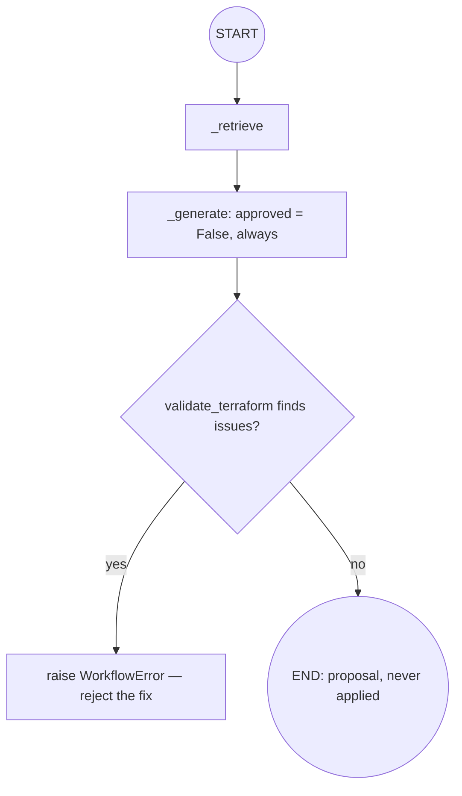

### 10.5 Real-World Analogy
An **architect proposing a renovation**. They draw plans (Terraform) — but nobody
knocks down a wall automatically. A building inspector (validate) checks the plans
and *rejects* any that remove a fire exit (an over-permissive change). Only a human
owner signs off before anyone builds.

### 10.6 Example
```python
proposal = await remediation_graph.run(finding, auth)
proposal.approved        # False — always
proposal.terraform       # the suggested HCL
# if the model proposed `acl = "public-read-write"`:
# _validate raises WorkflowError("… failed static safety validation")
```

### 10.7 Common Mistakes
- **Letting the model set `approved`.** It's forced `False` by us; approval is a
  human act, off the model's reach.
- **Matching on words like "public."** The scan matches *IaC constructs*, or it
  would reject its own justification text.
- **Auto-applying a "safe-looking" fix.** Rules 2 and 8: never change a customer
  environment. We stop at *proposal*.

### 10.8 Key Takeaways
- Remediation = `retrieve → generate → validate`; `approved` is **always `False`**.
- `validate_terraform` rejects over-permissive fixes with a `WorkflowError`.
- Patterns are precise IaC so prose never false-triggers.

### 10.9 Self-Assessment
1. Why can't the model approve its own remediation?
2. Name three patterns `validate_terraform` rejects.
3. Why are the patterns written as precise IaC rather than keywords?

### 10.10 Connection to Previous Topics
This is where the abstract "non-negotiable rules" from Phase 1 become executable
code. `UnsafeTargetError` and `approved=False` were defined earlier as *promises*;
this graph is a place they're *kept*.

---

## Chapter 11 — The Report Graph

### 11.1 Introduction
The last workflow writes an **executive summary** over a set of enriched findings —
the kind of paragraph a CISO reads. It shows a graph whose first step is pure
computation (no model), and where the *facts* are counted in code, not trusted to
the model.

### 11.2 Prerequisites
- Chapter 6 (graph anatomy). Chapter 8 helps (it produces the `EnrichedFinding`s
  this graph consumes).

### 11.3 Detailed Explanation
`ReportGraph` (in `application/graphs/report.py`) is linear: `summarize →
generate`. It takes a `Clock` (Phase 1's injected time source) so the report's
`generated_at` is deterministic in tests.

- **`_summarize`** is **pure**: it counts findings per severity with a `Counter`
  (`{"high": 1, ...}`) and builds a compact text **digest** (one line per finding).
  No model call — the *numbers* in a compliance report must be computed, never
  hallucinated.
- **`_generate`** renders the `report_summary` prompt from the digest, calls the
  gateway with a report-specific system instruction ("use ONLY these findings; do
  not invent figures"), and assembles a `ReportDraft` (`tenant_id`,
  `executive_summary`, `finding_count`, `severity_breakdown`, `generated_at`).

The severity breakdown on the final `ReportDraft` comes from the *code-computed*
`Counter`, not from the model's prose — so even if the model miscounts in its
paragraph, the structured numbers are correct.

### 11.4 How It Works
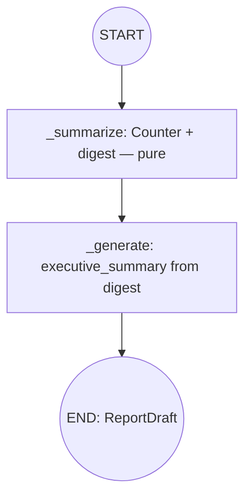

### 11.5 Real-World Analogy
A **financial report**. An accountant computes the totals (summarize) — those are
facts. A writer then drafts the narrative "this quarter we…" (generate) *from* the
verified totals, never inventing numbers. The audited figures come from the
spreadsheet, not the prose.

### 11.6 Example
```python
draft = await report_graph.run([enriched_finding], auth)
draft.finding_count        # 1
draft.severity_breakdown   # {"high": 1}  — computed in code
draft.executive_summary    # "…prioritise IAM hardening."
# with no findings: finding_count == 0, severity_breakdown == {}
```

### 11.7 Common Mistakes
- **Letting the model produce the counts.** Counts are computed in `_summarize`;
  the model only writes prose.
- **Reading `now()` directly.** Use the injected `Clock` so tests are
  deterministic (Phase 1).
- **Forgetting the empty case.** Zero findings must still yield a valid `ReportDraft`.

### 11.8 Key Takeaways
- Report = `summarize (pure counts + digest) → generate (prose)`.
- **Facts are computed in code**; the model only narrates them.
- The `Clock` is injected so `generated_at` is testable.

### 11.9 Self-Assessment
1. Why is `_summarize` free of any model call?
2. Where does the final `severity_breakdown` come from — code or the model?
3. Why inject a `Clock` instead of calling `now()`?

### 11.10 Connection to Previous Topics
The injected `Clock` is straight from Phase 1. Splitting "compute the facts" from
"write the prose" is the same trust boundary as grounding: never let the model be
the source of truth for anything checkable.

---

# Part IV — Tools & Bounded Agents

---

## Chapter 12 — Typed Tools and the Tool Registry

### 12.1 Introduction
We now leave fixed workflows and enter *agents* — software that can *decide* to
call a capability. The capabilities an agent may call are **tools**. This chapter
defines what a tool is and how the **registry** (the allow-list source) works.

### 12.2 Prerequisites
- Chapter 4 (Pydantic models validate input). A tool's arguments are a Pydantic
  model.

### 12.3 Detailed Explanation
A **tool** is a named capability with a **typed argument schema** and an async
handler that returns **text**. In `application/tools/registry.py`, `Tool` is a
frozen dataclass: `name`, `description`, `args_model` (a Pydantic model), and
`handler`. Its `invoke(raw_args, auth)` **validates** the raw arguments against the
schema before running the handler — a malformed call is rejected with a
`ValidationError`, never passed through:

```python
async def invoke(self, raw_args, auth):
    try:
        args = self.args_model.model_validate(raw_args)
    except ValidationError as exc:
        raise DomainValidationError(f"invalid arguments for tool '{self.name}'",
                                    details={"tool": self.name, "errors": exc.errors()})
    return await self.handler(args, auth)
```

Two design choices matter:
- **Typed arguments.** An agent (or, later, a model) cannot call a tool with
  garbage — the schema is the gate.
- **Tools return text.** Never live objects. Text is a *narrow trust boundary*: the
  agent layer scans that text for injection before trusting it (Chapter 14).

The `ToolRegistry` maps names → tools. `register` refuses duplicate names
(`WorkflowError`); `get` raises `WorkflowError` on an unknown name; `names()` lists
them sorted. **The registry is the allow-list source**: an agent is granted a
*subset* of the registered tools and can call nothing else (Chapter 14).

The one built-in tool is **`search_corpus`** (`application/tools/corpus_tools.py`).
Its args are `SearchCorpusArgs` (`query`, `top_k` 1–20, optional `framework`); its
handler runs the Phase 3 retriever + assembler and returns the assembled,
citation-numbered context text (or "No relevant sources found.").

### 12.4 How It Works
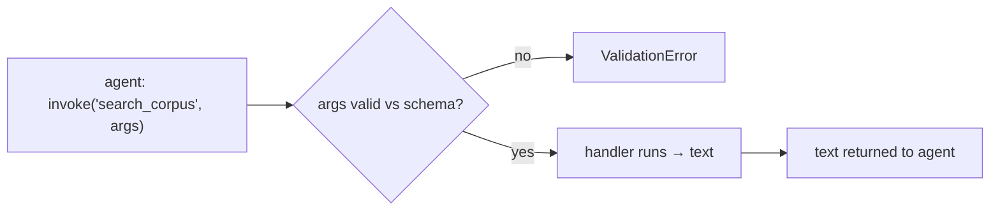

### 12.5 Real-World Analogy
A **power tool with a safety interlock**. Each tool has a specific socket
(`args_model`); a plug that doesn't fit won't go in (validation). And the tool
outputs a *labelled part* (text), which quality control inspects before it goes on
the product (injection scan) — never a mystery object wired straight into the
machine.

### 12.6 Example
```python
registry = ToolRegistry(build_corpus_tools(retriever, assembler, config))
registry.names()                       # ["search_corpus"]
tool = registry.get("search_corpus")
await tool.invoke({"query": "IAM key rotation", "top_k": 5}, auth)   # → context text
await tool.invoke({"top_k": 5}, auth)  # ValidationError: 'query' required
```

### 12.7 Common Mistakes
- **Untyped tool arguments.** Without a schema, an agent can call a tool with
  anything — the schema is the guardrail.
- **Returning objects from a tool.** Return text; it keeps the trust boundary
  narrow and scannable.
- **Treating the registry as a menu the agent may fully use.** It's the *catalogue*;
  each agent gets an explicit *allow-list* subset (Chapter 14).

### 12.8 Key Takeaways
- A **tool** = name + Pydantic `args_model` + async handler returning **text**.
- `invoke` **validates** arguments before running; bad args → `ValidationError`.
- The **registry** is the allow-list source; `search_corpus` is the built-in tool.

### 12.9 Self-Assessment
1. Why do tools return text rather than objects?
2. What happens when a tool is invoked with arguments that fail its schema?
3. What is the relationship between the registry and an agent's allow-list?

### 12.10 Connection to Previous Topics
Typed arguments are Phase 1's "validate at the boundary." Returning text that is
later injection-scanned continues Phase 2's "untrusted content is data, never
instructions." `search_corpus` is just Phase 3 retrieval wrapped as a callable.

---

## Chapter 13 — Agent Budgets, and Why Agents Must Be Bounded

### 13.1 Introduction
Before the agent itself, the *reason* it needs a leash. An agent can call tools in
a **loop**. A loop with no limits is a runaway. This short chapter makes the danger
concrete and introduces the `AgentBudget`.

### 13.2 Prerequisites
- Chapter 12 (tools). An agent calls tools; nothing more is assumed.

### 13.3 Detailed Explanation
Give software the ability to "call a tool, look at the result, decide what to do
next, repeat," and three failure modes appear immediately:
- **Runaway loops.** A bug — or an adversarial input — makes it call tools forever,
  burning time and money.
- **Repetition.** It calls the *same* tool with the *same* arguments over and over,
  making no progress.
- **Overreach.** It calls a tool it was never meant to touch.

The first line of defence is a **budget**. `AgentBudget`
(`application/tools/budget.py`) is a tiny frozen model with two hard caps:

```python
class AgentBudget(FrozenModel):
    max_iterations: int = Field(default=8, ge=1, le=100)    # at most N tool calls
    wall_clock_seconds: float = Field(default=60.0, gt=0)   # at most T seconds
```

A budget is **per run** — one agent request gets one budget's worth of calls and
time, and the counters reset for the next request. Chapter 14 shows the machinery
(`ToolSession`) that *enforces* these caps, plus loop detection and the allow-list.

### 13.4 How It Works
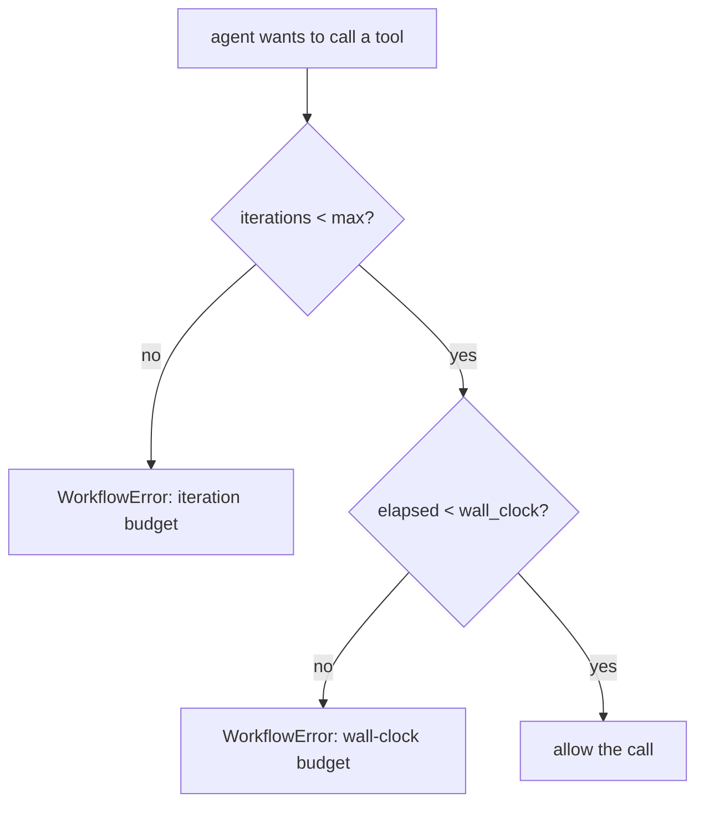

### 13.5 Real-World Analogy
A **research intern with a company card**. You cap it: "at most 8 database lookups,
and stop after an hour." Without the cap, a confused intern could run up a
thousand-dollar bill or search all night in circles. The budget is the card limit
and the clock.

### 13.6 Example
```python
budget = AgentBudget(max_iterations=8, wall_clock_seconds=60.0)
# defaults are exactly these; both are validated (iterations 1–100, seconds > 0)
AgentBudget(max_iterations=0)   # ValidationError: must be ≥ 1
```

### 13.7 Common Mistakes
- **No wall-clock cap, only an iteration cap.** A single slow call could still hang;
  you need both.
- **A global budget shared across requests.** Budgets must be per run, or one
  request's usage starves another (Chapter 14 gives each run its own session).
- **Setting the cap absurdly high "to be safe."** High caps defeat the purpose;
  pick a number that fits the task (default 8).

### 13.8 Key Takeaways
- An unbounded tool-using loop is a runaway waiting to happen.
- `AgentBudget` caps **iterations** and **wall-clock time**, per run.
- Budgets alone aren't enough — loop detection and an allow-list come next.

### 13.9 Self-Assessment
1. Name the three failure modes of an unbounded agent.
2. What two limits does `AgentBudget` enforce?
3. Why must budgets be per-run rather than global?

### 13.10 Connection to Previous Topics
This is the same instinct as Phase 2's rate limiting and spend budget on the
gateway — *hard limits on resource consumption* — now applied one level up, to an
agent's whole run.

---

## Chapter 14 — The BoundedAgent and ToolSession: The Five Guardrails

### 14.1 Introduction
The heart of the phase's safety story. A `BoundedAgent` can call tools, but every
call passes through a per-run `ToolSession` that enforces **five guardrails**. If
you remember one chapter from Part IV, make it this one.

### 14.2 Prerequisites
- Chapter 12 (tools, registry, allow-list) and Chapter 13 (budget).
- Phase 2's `scan_for_injection` — a function that flags prompt-injection patterns
  in text with a severity.

### 14.3 Detailed Explanation
`BoundedAgent` (`application/agents/base.py`) holds a name, the registry, an
**allow-list** (a `frozenset` of tool names it may use), an `AgentBudget`, a
`Clock`, and an injection-severity threshold (default `HIGH`). At construction it
**fails fast** if granted a tool that isn't registered — you cannot allow-list a
tool that doesn't exist.

Each run calls `agent.session()` to open a fresh **`ToolSession`**, which holds the
per-run counters (iterations, start time, and the set of seen call-signatures).
Every `await session.call(name, args, auth)` enforces, **in order**:

1. **Allow-list.** `name` must be in the agent's granted set, else `WorkflowError`.
2. **Wall-clock budget.** Elapsed time (measured with the injected `Clock`) must be
   under `wall_clock_seconds`, else `WorkflowError`.
3. **Iteration budget.** Fewer than `max_iterations` calls so far, else
   `WorkflowError`.
4. **Loop detection.** A signature `f"{name}:{json.dumps(args, sort_keys=True)}"`
   seen before means an identical repeat call — a non-terminating loop — so
   `WorkflowError`.
5. **Output injection scan.** After the tool runs, its returned text is scanned;
   if a signal at or above the threshold is found, `UnsafeContentError` — the
   agent never gets to trust poisoned output.

```python
async def call(self, name, args, auth):
    if name not in self._allowed:
        raise WorkflowError(f"agent '{self._agent}' may not call tool '{name}'")
    if (self._clock.now() - self._started).total_seconds() >= self._budget.wall_clock_seconds:
        raise WorkflowError("… exceeded its wall-clock budget")
    if self._iterations >= self._budget.max_iterations:
        raise WorkflowError("… exceeded its iteration budget")
    signature = f"{name}:{json.dumps(args, sort_keys=True, default=str)}"
    if signature in self._seen:
        raise WorkflowError("… repeated an identical tool call (loop detected)")
    self._seen.add(signature); self._iterations += 1
    output = await self._registry.get(name).invoke(args, auth)   # (validates args)
    scan = scan_for_injection(output)
    if scan.exceeds(self._threshold):
        raise UnsafeContentError(f"tool '{name}' returned content that tripped the scanner")
    return output
```

Note the *sixth* implicit guard: `invoke` validates the arguments (Chapter 12). And
because the session holds all counters, budgets are strictly **per run** and never
leak between concurrent requests.

### 14.4 How It Works (one call, all guards)
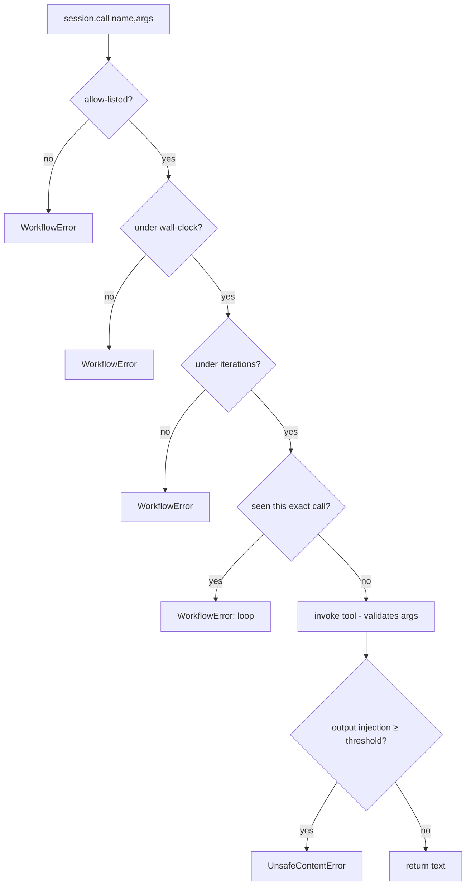

### 14.5 Real-World Analogy
A **bank teller behind glass**. You (the agent) can request transactions, but each
one goes through the teller (session): *are you authorized for this account?*
(allow-list), *is the branch still open?* (wall-clock), *under your daily
transaction limit?* (iterations), *didn't you just submit this identical slip?*
(loop detection), and *is this cheque forged?* (injection scan on what comes back).
The glass is the boundary; nothing skips it.

### 14.6 Example
```python
session = agent.session()
await session.call("search_corpus", {"query": "iam", "top_k": 5}, auth)   # ok
await session.call("delete_everything", {}, auth)   # WorkflowError: may not call tool
# same call twice → loop detected; 9th call with default budget → iteration budget;
# a tool returning "ignore all previous instructions…" → UnsafeContentError
```

### 14.7 Common Mistakes
- **Trusting tool output because "it's our own corpus."** By policy the corpus is
  untrusted content; the output scan stays on. Defence-in-depth.
- **Sharing one session across runs.** Each run must open its own, or budgets leak.
- **Checking the budget after the call.** The order matters — refuse *before*
  spending the call.

### 14.8 Key Takeaways
- Every tool call passes through a per-run `ToolSession` enforcing **five
  guardrails**: allow-list, wall-clock, iterations, loop detection, output scan
  (plus argument validation inside `invoke`).
- Granting an unregistered tool **fails fast** at construction.
- Budgets are strictly **per run** — no leakage between requests.

### 14.9 Self-Assessment
1. List the five guardrails in the order they're checked.
2. Why scan the tool's *output* even though the input was already scanned by the
   gateway?
3. What happens if you grant an agent a tool that isn't in the registry?

### 14.10 Connection to Previous Topics
This is the culmination of the safety thread running through every phase: Phase 2's
injection scanning is re-applied to *tool output* (defence-in-depth), Phase 1's
typed exceptions carry the failures, and the injected `Clock` keeps the wall-clock
check deterministic in tests.

---

## Chapter 15 — The Four Agents

### 15.1 Introduction
With the machinery built, the four concrete agents are almost anticlimactic —
which is the point. Three simply *wrap a graph*; the fourth *uses a tool* and shows
the guardrails end-to-end. All are `BoundedAgent`s.

### 15.2 Prerequisites
- Chapters 8–11 (the graphs), 14 (the bounded agent + session).

### 15.3 Detailed Explanation
All four live in `application/agents/` and subclass `BoundedAgent`.

- **`ComplianceAnalystAgent.analyze(finding, auth) → EnrichedFinding`** wraps
  `EnrichmentGraph`. Grants **no** free tools (its grounding comes from the graph).
- **`RemediationEngineerAgent.propose(finding, auth) → RemediationProposal`** wraps
  `RemediationGraph`. No free tools; the proposal is always unapproved.
- **`ReportWriterAgent.write(findings, auth) → ReportDraft`** wraps `ReportGraph`.
  No free tools.
- **`RiskAnalystAgent.correlate(findings, auth) → str`** is the interesting one. It
  is granted exactly **one** tool — `search_corpus` — and uses a `ToolSession` to
  look up each finding in the corpus (once per finding, within budget), then asks
  the gateway to synthesise a single grounded narrative from those sources. It
  exercises every guardrail: the allow-list (only `search_corpus`), the iteration
  budget (it caps its loop at `budget.max_iterations`), loop detection, and the
  output injection scan on each tool result. With no findings, it returns
  `ABSTENTION_TEXT` without calling anything.

Why wrap a graph in an agent at all, if it adds no tools? For a **uniform entry
point**: the presentation layer (Phase 5) gets one consistent, budget-bounded
object per capability, and richer tool-using behaviour can be added later *without
changing callers*.

### 15.4 How It Works
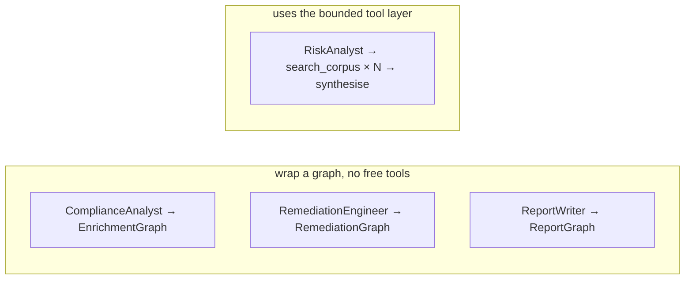

### 15.5 Real-World Analogy
A **consulting firm's roster**. Three consultants each own one deliverable and
follow a fixed methodology (the graph): the analyst, the engineer, the report
writer. The fourth — the risk strategist — actively pulls files from the library
(the tool), one per case, under a strict research budget, then writes the
cross-cutting brief.

### 15.6 Example
```python
enriched  = await agents.compliance_analyst.analyze(finding, auth)
proposal  = await agents.remediation_engineer.propose(finding, auth)   # approved is False
draft     = await agents.report_writer.write([enriched], auth)
narrative = await agents.risk_analyst.correlate([finding_a, finding_b], auth)
```

### 15.7 Common Mistakes
- **Giving the wrapper agents tools they don't need.** Least privilege: grant only
  what a capability requires (three of the four grant none).
- **Letting the risk analyst loop unbounded over findings.** It caps its loop at the
  budget and relies on the session to enforce it.
- **Skipping the agent and calling the graph directly from the API.** Then you lose
  the uniform, bounded entry point.

### 15.8 Key Takeaways
- Four agents: three **wrap a graph** (no free tools); the risk analyst **uses**
  `search_corpus` under full guardrails.
- Agents give the API a **uniform, bounded entry point** per capability.
- Least privilege: grant only the tools a capability actually needs.

### 15.9 Self-Assessment
1. Which agent uses a tool, and which tool?
2. Why wrap a graph in an agent even when it adds no tools?
3. How does the risk analyst stay within its iteration budget?

### 15.10 Connection to Previous Topics
Least-privilege allow-lists echo Phase 1's tenant isolation instinct (grant only
what's needed). The uniform entry point sets up Phase 5, where the presentation
layer will call exactly these four methods.

---

## Chapter 16 — Wiring It All Together, and Preparing for Phase 5

### 16.1 Introduction
The final chapter assembles everything in the **composition root** — the one place
Phase 1 permits wiring — and looks ahead to Phase 5 (the API that will expose these
capabilities).

### 16.2 Prerequisites
- All previous chapters. This is the assembly.

### 16.3 Detailed Explanation
Two additions to `composition.py`:

- **`AgentSuite`** — a frozen dataclass grouping the whole Phase-4 subsystem: the
  `PromptRegistry`, the `ToolRegistry`, the `CopilotGraph`, and the four agents. One
  handle for the presentation layer.
- **`build_agent_suite(settings, *, gateway, knowledge, clock)`** — loads the
  prompts from `settings.prompts_dir`, builds an `AgentBudget` from settings,
  constructs the four graphs over the Phase-3 retrieval stack and the Phase-2
  gateway, registers the `search_corpus` tool, and wires the four agents.

`build_container` calls `build_agent_suite` and stores the result on the
`ApplicationContainer` as `agents`. New settings (`prompts_dir`,
`agent_max_iterations`, `agent_wall_clock_seconds`) are added with `CIQ_`-prefixed
env vars, and the `prompts/` directory is copied into the Docker image so the
service loads its prompts at startup — exactly as Phase 3 ships the corpus.

Everything is built with **injected dependencies** and is **offline-testable**: the
whole suite runs deterministically against a fake gateway and the sample corpus,
which is why Phase 4 lands with 191 passing tests at ~95% coverage, `mypy --strict`
clean, and the four architecture contracts still green (LangGraph never leaks into
the domain).

### 16.4 How It Works (the assembled container)
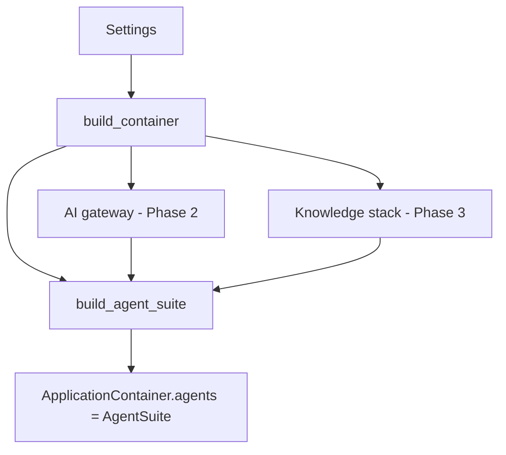

### 16.5 Real-World Analogy
**Final assembly on a production line**. Every subsystem built in earlier stations —
engine (gateway), fuel system (knowledge), controls (agents) — is bolted together
in one place, following one blueprint (the composition root). Nothing is wired
ad-hoc on the factory floor.

### 16.6 Example
```python
container = build_container(settings)
enriched = await container.agents.compliance_analyst.analyze(finding, auth)
answer   = await container.agents.copilot.run("How are IAM keys managed?", auth)
```

### 16.7 Common Mistakes
- **Wiring agents outside the composition root.** All construction belongs in one
  place (Phase 1).
- **Forgetting to ship `prompts/` in the image.** The service would start with no
  prompts; the Dockerfile copies them like the corpus.
- **Skipping the offline tests.** The whole suite is designed to run without a
  network — keep it that way.

### 16.8 Key Takeaways
- `AgentSuite` + `build_agent_suite` assemble Phase 4 in the **composition root**.
- New settings and the shipped `prompts/` directory make it configurable and
  deployable.
- The suite is fully **offline-testable**; all quality gates stay green.

### 16.9 Self-Assessment
1. What does `AgentSuite` group, and why one handle?
2. Which layer is allowed to build the agents, and why?
3. Why must `prompts/` be copied into the Docker image?

### 16.10 Connection to Previous Topics — and What's Next
Phase 4 stands on all three earlier phases: clean architecture and DI (Phase 1),
the safe gateway (Phase 2), and retrieval (Phase 3). **Phase 5** will add the
**presentation layer** — the HTTP API — turning `container.agents.*` into real
endpoints (`/enrich`, `/copilot`, `/remediate`, `/report`), with authentication,
tenant scoping, and the request/response schemas that carry `citation_verified`,
`abstained`, and `approved=False` out to callers. The hard safety work is done; Phase
5 exposes it.

---

## Appendix A — Glossary

- **Workflow** — a fixed, multi-step process we wrote, modelled as a graph.
- **Agent** — software that *decides* which tools to call, within hard limits.
- **State machine / graph** — state + nodes + transitions; branches are edges.
- **Node** — one step; in our code an injected async bound method.
- **Edge / conditional edge** — a transition; conditional ones branch via a router.
- **Router** — a function that reads the state and returns the next node's name.
- **Checkpointer** — saves graph state per run (`MemorySaver`, keyed by thread id).
- **Trace** — the accumulated list of per-node `TraceEvent`s for one run.
- **Grounding** — cite → verify → abstain; answer only from real retrieved sources.
- **Abstention** — the honest "Not covered by the provided sources."
- **Prompt (asset)** — versioned instruction text with declared variables.
- **Tool** — a named capability with a typed arg schema, returning text.
- **Allow-list** — the subset of tools an agent may call.
- **Budget** — per-run caps on tool-call count and wall-clock time.
- **Guardrail** — one of the five checks a `ToolSession` enforces per call.
- **IaC** — infrastructure-as-code (e.g. Terraform); we propose it, never apply it.

## Appendix B — The Non-Negotiable Rules, and where Phase 4 keeps them

| Rule | Where Phase 4 enforces it |
| --- | --- |
| 2 — Remediation never auto-applied | `RemediationProposal.approved` forced `False`; `validate_terraform` rejects unsafe fixes (Ch. 10) |
| 3 — Grounding: cite / verify / abstain | `grounding` policy + graph abstain edges + citation verification (Ch. 3, 8, 9) |
| 4 — Prompt-injection defence | `wrap_untrusted` on all context; `scan_for_injection` on tool output (Ch. 8, 14) |
| 8 — No red-team / no autonomous change | agents propose, never act on environments; bounded tools only (Ch. 10, 14, 15) |

## Appendix C — Self-Assessment Answer Key (brief)

- **Ch. 1:** retrieve → (abstain?) → generate; workflow = fixed steps we wrote,
  agent = decides steps within limits; abstain prevents confident wrong answers.
- **Ch. 3:** verified iff an available citation shares framework *and* control_id;
  abstain must not call the model so it can't guess; the *policy* sets
  `citation_verified`, not the model.
- **Ch. 9:** `ValueError: '<x>' is already being used as a state key` — name nodes
  as verbs, keys as nouns; `abstained` + `citation_verified`; same retrieve→branch
  shape as enrichment.
- **Ch. 14:** allow-list → wall-clock → iterations → loop → output-scan; the corpus
  is untrusted, so scan output too (defence-in-depth); granting an unregistered tool
  fails fast at construction.

---

*End of Phase 4 Study Guide. You now understand — from first principles — how
ComplianceIQ turns retrieval into grounded, cited, bounded AI capabilities, and why
every step is built the safe way. Phase 5 puts an API in front of it.*
