<!--
  PHASE 5 STUDY GUIDE — ComplianceIQ AI Service
  A complete, beginner-first textbook for the Presentation / HTTP API phase.
-->

# Phase 5 Study Guide — The HTTP API & Authentication

> **Who this is for:** a motivated beginner. You do **not** need to have mastered
> Phases 1–4. You do **not** need to know what HTTP, REST, a JWT, a bearer token,
> HMAC, or a "dependency" in a web framework is. We build every idea from the
> ground up.
>
> **How to read it:** straight through the first time. Each chapter follows the
> same rhythm — *Introduction → Prerequisites → Detailed Explanation → How It
> Works → Analogy → Example → Common Mistakes → Key Takeaways → Self-Assessment →
> Connection to Previous Topics* — so you always know where you are.
>
> **The promise:** by the end you will understand, from first principles, how a
> program becomes reachable over the network; what a **JWT** is and how we verify
> one *securely* by hand (including the famous attacks we defend against); how a
> request is **authenticated** and **tenant-scoped** before it touches any AI; and
> how the five capability endpoints wrap the Phase-4 agents. Well enough to defend
> it to a senior engineer or a jury.

---

## What Phase 5 adds (a map to keep open)

```text
src/complianceiq/
├── domain/
│   └── ports/auth.py                 ← TokenVerifier port (verify(token) → AuthContext)
├── infrastructure/
│   └── auth/jwt_verifier.py          ← HS256TokenVerifier (stdlib-only, secure)
├── application/
│   └── agents/suite.py               ← AgentSuite (moved here so presentation can see it)
├── presentation/
│   ├── app.py                        ← includes the AI router
│   ├── container.py                  ← Container protocol + get_auth_context / get_agents
│   ├── schemas.py                    ← request envelopes (EnrichRequest, AskRequest, …)
│   └── routers/ai.py                 ← the /api/v1/ai/* endpoints
├── infrastructure/config/settings.py ← + jwt_hs256_secret
└── composition.py                    ← builds the TokenVerifier, wires it into the container
```

## Table of Contents

**Part I — Foundations**
1. [What Phase 5 Is, and Why an API](#chapter-1--what-phase-5-is-and-why-an-api)
2. [HTTP, REST, and JSON in Ten Minutes](#chapter-2--http-rest-and-json-in-ten-minutes)
3. [How Our App Is Assembled: The Composition Root and the Container](#chapter-3--how-our-app-is-assembled-the-composition-root-and-the-container)

**Part II — Authentication & Identity**
4. [Authentication vs. Authorization, and What a JWT Is](#chapter-4--authentication-vs-authorization-and-what-a-jwt-is)
5. [The TokenVerifier Port: A Swappable Seam](#chapter-5--the-tokenverifier-port-a-swappable-seam)
6. [Verifying a JWT by Hand: HMAC, Signatures, and Claims](#chapter-6--verifying-a-jwt-by-hand-hmac-signatures-and-claims)
7. [The Attacks We Defend Against](#chapter-7--the-attacks-we-defend-against)

**Part III — The Endpoints**
8. [Wiring Auth into a Request: FastAPI Dependencies](#chapter-8--wiring-auth-into-a-request-fastapi-dependencies)
9. [Tenant Isolation at the Boundary](#chapter-9--tenant-isolation-at-the-boundary)
10. [Request Envelopes and the Response Contract](#chapter-10--request-envelopes-and-the-response-contract)
11. [The Five Capability Endpoints](#chapter-11--the-five-capability-endpoints)
12. [Errors on the Wire](#chapter-12--errors-on-the-wire)

**Part IV — Assembly & Beyond**
13. [Putting It Together, and Preparing for Phase 6](#chapter-13--putting-it-together-and-preparing-for-phase-6)

---

# Part I — Foundations

---

## Chapter 1 — What Phase 5 Is, and Why an API

### 1.1 Introduction
Phases 1–4 built a powerful engine: a clean architecture, a safe LLM gateway, a
retrieval system, and bounded AI agents. But so far the only way to *run* any of
it is from Python code or a test. Phase 5 gives the engine a steering wheel and
pedals: an **HTTP API** so another program — the Core Service, a dashboard — can
call our capabilities over the network.

### 1.2 Prerequisites
- The Phase-4 idea of an **agent**: a bounded entry point for one capability
  (enrich, ask, remediate, correlate, report).
- The word *client*: any program that sends us a request. The word *server*: us,
  answering it.

### 1.3 Detailed Explanation
An **API** (Application Programming Interface) is a contract for how one program
talks to another. A **web API** does it over the network using **HTTP**. Phase 5
delivers exactly five capability endpoints plus the operational ones that already
existed (`/health`, `/version`).

Two problems must be solved before an endpoint can safely run an agent:

1. **Who is calling, and for which tenant?** We can't run a tenant's data through
   the AI without knowing — *provably* — which tenant the caller represents. This
   is **authentication**, and it's the bulk of Phase 5's new, security-critical
   code (Part II).
2. **What does the request and response look like?** The exact JSON shapes, so a
   client and our server agree down to the field name (Part III).

That's the whole phase: **authenticate the caller, scope them to their tenant,
validate the request, run the right agent, return a typed response** — with a
consistent error shape when anything goes wrong.

### 1.4 How It Works (a request's life)
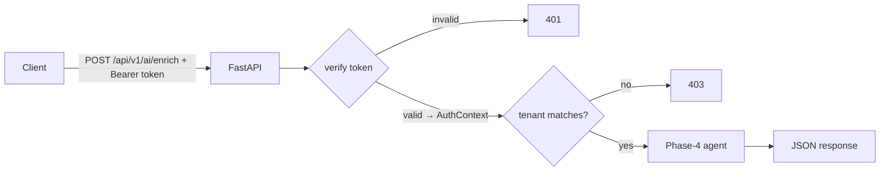

### 1.5 Real-World Analogy
A **bank branch**. Phases 1–4 built the vault, the tellers, and the rules. Phase 5
is the *front door and the reception desk*: it checks your ID (authentication),
confirms you're accessing your own account (tenant isolation), takes your filled-in
form (the request), and routes you to the right teller (the agent). Without the
front desk, the vault is useless — and unguarded.

### 1.6 Example
- *Request:* `POST /api/v1/ai/ask` with header `Authorization: Bearer <token>` and
  body `{"question": "How should IAM keys be managed?"}`.
- *Response (200):* a `CopilotAnswer` — `{question, answer, citations,
  citation_verified, abstained}`.
- *No token?* `401`. *Token for the wrong tenant on a finding?* `403`.

### 1.7 Common Mistakes
- **Thinking the API is "just plumbing."** The authentication and tenant checks
  here are the security perimeter of the whole product.
- **Exposing capabilities that don't exist yet.** We expose only the five Phase-4
  capabilities; `map` and `financial` wait for Phase 7.
- **Letting the web framework leak inward.** FastAPI lives only in presentation;
  the agents know nothing about HTTP (Phase 1's rule, still enforced).

### 1.8 Key Takeaways
- Phase 5 makes the engine callable over HTTP.
- The two hard problems are **authentication + tenant scoping** and the **wire
  contract**.
- Five capability endpoints wrap the Phase-4 agents; the AI code stays HTTP-agnostic.

### 1.9 Self-Assessment
1. What two problems must be solved before an endpoint runs an agent?
2. Why don't we expose `/ai/map` yet?
3. Which layer is allowed to import FastAPI, and why does that matter?

### 1.10 Connection to Previous Topics
This is the outermost ring of Phase 1's clean architecture finally getting filled
in. The agents from Phase 4 are the "teller"; Phase 5 is the "front desk" that was
always meant to sit in front of them.

---

## Chapter 2 — HTTP, REST, and JSON in Ten Minutes

### 2.1 Introduction
To understand the endpoints you need three vocabulary words: **HTTP**, **REST**,
and **JSON**. This chapter is a quick, from-zero tour.

### 2.2 Prerequisites
- The idea of a client and a server (Chapter 1).

### 2.3 Detailed Explanation
**HTTP** (HyperText Transfer Protocol) is the language browsers and servers speak.
A client sends a **request** with:
- a **method** — a verb: `GET` (read), `POST` (submit/do), plus `PUT`/`DELETE`;
- a **path** — like `/api/v1/ai/enrich`;
- **headers** — metadata key/values (e.g. `Authorization: Bearer …`);
- an optional **body** — the payload (for us, JSON).

The server replies with a **response**: a **status code** (a number), headers, and
a body. Status codes come in families:
- **2xx** success (`200 OK`),
- **4xx** the client's fault (`401` unauthenticated, `403` forbidden, `404` not
  found, `422` invalid body),
- **5xx** the server's fault (`500` internal error, `502` upstream failed).

**REST** is a *style* of web API: you model **resources** and act on them with HTTP
methods. We lean on the useful parts (clear paths, right methods, right status
codes) pragmatically — our AI actions are `POST`s because they *do* something.

**JSON** (JavaScript Object Notation) is the text format for the bodies: objects
`{"key": value}`, arrays `[…]`, strings, numbers, booleans, `null`. It's how a
`Finding` travels over the wire.

### 2.4 How It Works (a raw exchange)
```text
POST /api/v1/ai/ask HTTP/1.1
Authorization: Bearer eyJhbGciOi...
Content-Type: application/json

{"question": "How should IAM keys be managed?"}

────────────── response ──────────────
HTTP/1.1 200 OK
Content-Type: application/json

{"question": "...", "answer": "...", "citation_verified": true, "abstained": false, "citations": [...]}
```

### 2.5 Real-World Analogy
**Ordering by mail.** The *method* is the intent ("please send" vs "please tell me
the price"), the *path* is the department address, the *headers* are the envelope
markings (including your membership card = the token), and the *body* is the order
form. The reply's *status code* is the stamp: "shipped," "unknown member,"
"form incomplete."

### 2.6 Example
- `GET /health` → `200 {"status":"ok","version":"…"}` — no body needed, it's a read.
- `POST /api/v1/ai/remediate` with a finding → `200 RemediationProposal`, or `422`
  if the body is malformed.

### 2.7 Common Mistakes
- **Using `GET` for actions.** Reads are `GET`; things that *do* work are `POST`.
- **Ignoring status codes.** The number is half the message; `200` vs `403` matters
  as much as the body.
- **Confusing 401 and 403.** `401` = "I don't know who you are"; `403` = "I know
  who you are, but you may not do this."

### 2.8 Key Takeaways
- HTTP = method + path + headers + body → status + headers + body.
- Status families: 2xx ok, 4xx your fault, 5xx our fault.
- JSON carries our domain objects over the wire.

### 2.9 Self-Assessment
1. What are the four parts of an HTTP request?
2. Which status family means "the client did something wrong"?
3. Why is `/ai/enrich` a `POST` and `/health` a `GET`?

### 2.10 Connection to Previous Topics
The JSON shapes are exactly the Pydantic contracts from Phase 1 (`Finding`,
`EnrichedFinding`, …). HTTP is just the transport; the *meaning* was defined phases
ago.

---

## Chapter 3 — How Our App Is Assembled: The Composition Root and the Container

### 3.1 Introduction
Before endpoints, understand how the app is *wired*. Two ideas from Phase 1 come
to the fore now: the **composition root** and the **Container protocol**. They are
what let the API use the agents without the presentation layer importing
infrastructure.

### 3.2 Prerequisites
- Chapter 1. The Phase-1 idea of *layers* (domain, application, infrastructure,
  presentation) with dependencies pointing *inward*.

### 3.3 Detailed Explanation
The **composition root** (`composition.py`) is the single place where concrete
things are built and bolted together: the gateway, the knowledge stack, the agent
suite, and now the token verifier. It produces one `ApplicationContainer` — a
frozen object holding every wired service.

But here's the tension: the **presentation** layer (routers) needs those services,
yet Phase 1 forbids presentation from importing **infrastructure** (they are
sibling adapters). The solution is a **Protocol** — Python's structural typing. In
`presentation/container.py` we declare a `Container` protocol: "whoever drives me
must expose `app_info`, `readiness_service`, `agents`, and `token_verifier`." The
composition root's container *happens to* expose exactly those, so it satisfies the
protocol **without presentation importing it**. Presentation depends on the
*shape*, not the concrete class.

FastAPI then resolves services per request through **dependency providers** —
small functions like `get_agents(request)` that read the container off
`request.app.state` and return the piece a route needs. Routes ask for what they
need via `Depends(...)`; they never touch globals.

### 3.4 How It Works
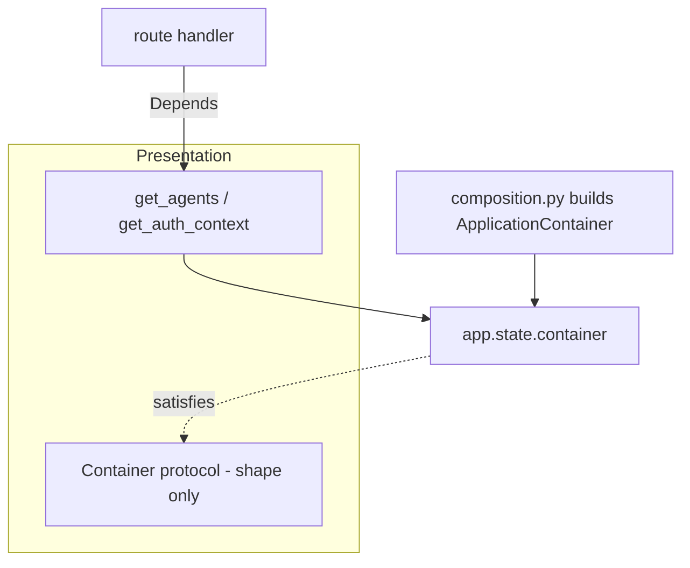

### 3.5 Real-World Analogy
A **job description vs. the actual hire**. The presentation layer writes a job
description ("must be able to verify tokens and run agents"). The composition root
sends a specific employee who fits it. Presentation interacts with the *role*, not
the person's home address — so you can swap the employee without rewriting the
description.

### 3.6 Example
```python
class Container(Protocol):
    @property
    def agents(self) -> AgentSuite: ...
    @property
    def token_verifier(self) -> TokenVerifier: ...

def get_agents(request: Request) -> AgentSuite:
    return request.app.state.container.agents
```
A route: `async def enrich(..., agents: AgentSuite = Depends(get_agents)): ...`

### 3.7 Common Mistakes
- **Importing the concrete container into presentation.** Use the protocol; keep
  the layers independent.
- **Reaching for a global singleton.** Resolve per request via `Depends`, so tests
  can build a fresh app with different wiring.
- **Putting construction logic in a route.** Building belongs in the composition
  root; routes only *use* what's built.

### 3.8 Key Takeaways
- The **composition root** builds everything once into an `ApplicationContainer`.
- Presentation depends on a **`Container` protocol** (a shape), never on
  infrastructure — Dependency Inversion in action.
- **Dependency providers** hand routes exactly the services they ask for.

### 3.9 Self-Assessment
1. Why can't the routers import the concrete container class?
2. What does the `Container` protocol buy us?
3. Where is the token verifier constructed?

### 3.10 Connection to Previous Topics
This is Phase 1's Dependency Inversion Principle paying off precisely when we need
it. We had to *move* `AgentSuite` into the application layer this phase so the
presentation protocol could name it without reaching into `composition.py`.

---

# Part II — Authentication & Identity

---

## Chapter 4 — Authentication vs. Authorization, and What a JWT Is

### 4.1 Introduction
The security heart of Phase 5. Two words people constantly confuse —
**authentication** and **authorization** — and one technology, the **JWT**, that
carries identity across services.

### 4.2 Prerequisites
- Chapter 2 (headers, the `Authorization` header).
- The Phase-1 `AuthContext`: `{sub, tenant_id, roles}` — the verified identity
  behind a request.

### 4.3 Detailed Explanation
**Authentication** answers *"who are you, and can you prove it?"* **Authorization**
answers *"are you allowed to do this?"* Phase 5 is mostly authentication (verify a
token → an `AuthContext`) plus one crucial authorization rule (tenant isolation,
Chapter 9).

A **JWT** (JSON Web Token, pronounced "jot") is a compact, self-contained token
that carries **claims** (facts about the caller) and is **signed** so the receiver
can trust it wasn't forged or altered. It has three parts, joined by dots:

```
header . payload . signature
eyJhbGci… . eyJzdWIi… . 4pqu>signature<
```

- **header** — JSON like `{"alg":"HS256","typ":"JWT"}`; names the signing algorithm.
- **payload** — JSON claims: `sub`, `tenant_id`, `roles`, plus standard ones like
  `iss` (issuer), `aud` (audience), `exp` (expiry).
- **signature** — a cryptographic stamp over `header.payload`, made with a key.

Each part is **base64url**-encoded (a URL-safe way to write bytes as text). Crucial
point: base64 is **not** encryption — anyone can read the claims. The *signature*
is what makes the token **trustworthy**, not secret.

**Who issues it?** The **Core Service** issues tokens (it owns identity and
tenancy). *We only verify them* and read the tenant — we never mint tokens. That
division is fixed in the integration handoff.

### 4.4 How It Works (trust via signature)
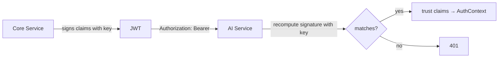

### 4.5 Real-World Analogy
A **passport**. Anyone can read your name and nationality (the claims are not
secret). What makes it *trustworthy* is the security features that are hard to
forge (the signature). A border officer (us) doesn't issue passports — they
*verify* the one you present and read your details from it.

### 4.6 Example
Decoded payload of a token we'd accept:
```json
{ "sub": "svc-scanner", "tenant_id": "tenant-acme", "roles": ["analyst"],
  "iss": "complianceiq-core", "aud": "complianceiq", "exp": 1786800000 }
```
We map this to `AuthContext(sub="svc-scanner", tenant_id="tenant-acme",
roles=["analyst"])`.

### 4.7 Common Mistakes
- **Thinking a JWT is encrypted.** It's *signed*, not secret; never put a password
  in one.
- **Confusing authn and authz.** Verifying the token (authn) is separate from the
  tenant/role checks (authz).
- **Trusting claims before checking the signature.** The claims mean nothing until
  the signature verifies.

### 4.8 Key Takeaways
- **Authentication** = prove who you are; **authorization** = are you allowed.
- A **JWT** carries signed **claims** (`sub`, `tenant_id`, `roles`, `iss`, `aud`,
  `exp`) in three base64url parts.
- The signature — not secrecy — is what makes claims trustworthy. The Core issues;
  we only verify.

### 4.9 Self-Assessment
1. In one line each, authentication vs. authorization.
2. Why is it safe that anyone can read a JWT's payload?
3. Who issues our tokens, and who verifies them?

### 4.10 Connection to Previous Topics
The verified claims become the Phase-1 `AuthContext` that every use case already
expects — the object that carries `tenant_id` through the whole system for tenant
isolation (rule 1).

---

## Chapter 5 — The TokenVerifier Port: A Swappable Seam

### 5.1 Introduction
Before the verifier's *guts* (Chapter 6), meet its *shape*. We put token
verification behind a **port** so the signing scheme can change without touching a
single caller. This is a small chapter with a big architectural payoff.

### 5.2 Prerequisites
- Chapter 4 (what a JWT and verification are).
- The Phase-1/3 idea of a **port**: an abstract interface the app depends on, with
  concrete adapters supplied at the edges (like the `Clock`).

### 5.3 Detailed Explanation
`domain/ports/auth.py` defines one tiny abstraction:

```python
class TokenVerifier(ABC):
    @abstractmethod
    def verify(self, token: str) -> AuthContext: ...
```

That's the seam. Presentation depends only on this; the composition root supplies a
concrete verifier. Why does this matter so much here?

Because the **production** signing scheme is different from the **development** one:
- **Production (Phase 6):** the Core signs tokens **asymmetrically** (RS256/ES256)
  with its *private* key and gives us only its *public* key. Verification needs a
  crypto library and the Core's key material.
- **Phase 5 (now):** a **symmetric** HS256 scheme with a shared secret — secure for
  local dev and testing, and implementable with the standard library alone.

Both are just implementations of `TokenVerifier.verify`. Swapping HS256 for RS256
in Phase 6 changes **one line in the composition root** and nothing else — not the
routers, not the tests' shape, not the `AuthContext`. That is the entire reason the
port exists.

### 5.4 How It Works
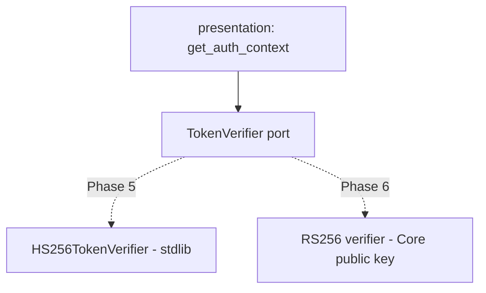

### 5.5 Real-World Analogy
A **wall socket**. Appliances (the routers) plug into the socket (the port). Behind
the wall the power might come from the grid or a generator (HS256 vs RS256) — the
appliance neither knows nor cares. Change the source; the socket, and everything
plugged into it, stays the same.

### 5.6 Example
```python
# composition.py (Phase 5)
token_verifier = build_token_verifier(secret=..., issuer=..., audience=..., clock=clock)
# Phase 6 will instead build an RS256 verifier from the Core's public key —
# same port, same container field, no route changes.
```

### 5.7 Common Mistakes
- **Hard-coding a specific JWT library in the routers.** Then you can't swap schemes
  — depend on the port.
- **Putting the verifier in the domain.** Parsing/crypto is I/O-ish adapter work; it
  lives in infrastructure. The *port* is domain.
- **Skipping the seam "for now."** The seam is the cheap part; retrofitting one
  later is the expensive part.

### 5.8 Key Takeaways
- `TokenVerifier.verify(token) -> AuthContext` is the whole abstraction.
- Phase 5 = HS256 (stdlib, dev/testing); Phase 6 = RS256 (Core's public key).
- Swapping schemes touches **one line** in the composition root.

### 5.9 Self-Assessment
1. What single method does the `TokenVerifier` port define?
2. Why HS256 now and RS256 later?
3. How many callers change when we swap the scheme in Phase 6?

### 5.10 Connection to Previous Topics
Identical philosophy to Phase 2's provider port and Phase 3's vector-store port:
*depend on an abstraction; choose the concretion at the edge.* Ports are how this
codebase keeps "what changes later" from rippling through "what's stable."

---

## Chapter 6 — Verifying a JWT by Hand: HMAC, Signatures, and Claims

### 6.1 Introduction
Now the guts. We verify HS256 tokens using **nothing but the Python standard
library** — no JWT package. This chapter explains HMAC and walks the verifier
step by step. It's the most security-critical code in the phase.

### 6.2 Prerequisites
- Chapter 4 (JWT structure). Comfort with "a function that mixes a secret and a
  message into a fixed-size fingerprint."

### 6.3 Detailed Explanation
**HMAC-SHA256** is a *keyed hash*. A plain hash (SHA-256) turns any input into a
fixed 32-byte fingerprint. HMAC adds a **secret key**: `HMAC(secret, message)`
produces a fingerprint that *only someone with the secret can compute or check*.
That's exactly what a signature needs: the Core computes `HMAC(secret,
header.payload)` and appends it; we recompute it and compare.

`HS256TokenVerifier.verify` runs these steps, **in this order**, and any failure
raises `AuthenticationError` (→ HTTP 401) with a safe message:

1. **Split** into three parts; reject if not exactly three non-empty segments.
2. **Check the algorithm** — decode the header, require `alg == "HS256"`. (Why this
   is critical is Chapter 7.)
3. **Check the signature** — recompute `HMAC(secret, header.payload)`, base64url it,
   and compare to the provided signature using `hmac.compare_digest` (a
   **constant-time** comparison).
4. **Decode the claims** — base64url-decode the payload as JSON; it must be an object.
5. **Check time** — `exp` is required and must not be in the past (with small
   leeway); `nbf` ("not before"), if present, must not be in the future.
6. **Check issuer & audience** — `iss` must equal our expected issuer; `aud` must
   equal (or contain) our audience.
7. **Project to `AuthContext`** — `sub` and `tenant_id` must be non-empty strings,
   `roles` a list of strings; build the `AuthContext`.

Notice the verifier takes an injected **`Clock`** (Phase 1) for step 5, so expiry
checks are deterministic in tests.

### 6.4 How It Works (the pipeline)
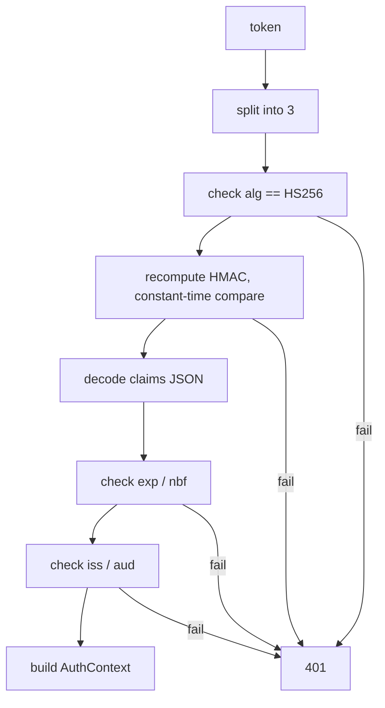

### 6.5 Real-World Analogy
A **wax seal with a signet ring**. The message is open (the claims). The seal is
made by pressing a ring (the secret) into wax over the fold. Only someone with the
matching ring can *make* or *confirm* the seal. You check the wax before you act on
the letter — and you compare the whole seal at once, not letter by letter (that's
the constant-time idea).

### 6.6 Example
The signing step, in stdlib:
```python
import base64, hashlib, hmac
def sign(signing_input: str, secret: str) -> str:
    digest = hmac.new(secret.encode(), signing_input.encode(), hashlib.sha256).digest()
    return base64.urlsafe_b64encode(digest).rstrip(b"=").decode()
# verify: hmac.compare_digest(provided_sig, sign(f"{header_b64}.{payload_b64}", secret))
```

### 6.7 Common Mistakes
- **Comparing signatures with `==`.** Use `hmac.compare_digest` — a normal compare
  can leak, byte by byte, how much of a forged signature is correct (a timing
  attack).
- **Trusting `exp` from `time.time()` directly.** Inject a `Clock` so expiry is
  testable and consistent with the rest of the system.
- **Forgetting base64url padding.** Base64url in JWTs strips `=` padding; you must
  add it back before decoding.

### 6.8 Key Takeaways
- **HMAC-SHA256** is a keyed fingerprint: only the secret-holder can make or check it.
- Verification is a strict, ordered pipeline: split → alg → signature → claims →
  time → iss/aud → `AuthContext`.
- Compare signatures in **constant time**; check `exp` against an injected `Clock`.

### 6.9 Self-Assessment
1. What does the key add to a plain hash, and why does a signature need it?
2. List the verification steps in order.
3. Why `hmac.compare_digest` instead of `==`?

### 6.10 Connection to Previous Topics
The injected `Clock` is straight from Phase 1 (deterministic time). `AuthenticationError`
is the Phase-1 typed exception that the Phase-5 error handler maps to `401`. Doing
crypto with the standard library keeps the offline, dependency-light discipline of
earlier phases.

---

## Chapter 7 — The Attacks We Defend Against

### 7.1 Introduction
A verifier is only as good as the attacks it anticipates. This chapter names the
classic JWT attacks and shows exactly how our code stops each one. In a security
product, *this* is the chapter that earns trust.

### 7.2 Prerequisites
- Chapter 6 (the verification steps).

### 7.3 Detailed Explanation
**1. The `alg: none` downgrade.** The JWT spec allows an algorithm literally called
`none` (no signature). A naive verifier that "does what the header says" would skip
the signature check entirely if an attacker sets `alg: none`. **Our defense:** we
*pin* the algorithm — step 2 rejects anything but `HS256`, so `none` is refused
before any claim is trusted.

**2. Algorithm confusion (RS→HS).** Against an RS256 verifier, an attacker can
sometimes submit an HS256 token signed with the *public* key (which is not secret),
tricking the verifier into using the public key as an HMAC secret. **Our defense:**
same pin — one fixed algorithm, no negotiation. (Phase 6's RS256 verifier will
likewise pin to RS256/ES256.)

**3. Signature forgery / tampering.** Change a claim (e.g. bump `tenant_id`) and the
signature no longer matches. **Our defense:** step 3 recomputes and compares; any
change → 401. Chapter 6's constant-time compare also blocks *timing* forgery.

**4. Expired or not-yet-valid tokens (replay window).** An old token shouldn't work
forever. **Our defense:** step 5 requires `exp` and honors `nbf`, against the
injected clock.

**5. Token minted for a different system.** A valid token from another audience or
issuer shouldn't unlock us. **Our defense:** step 6 checks `iss` and `aud`.

**6. Information leakage in errors.** An error that echoes the token, the secret, or
the expected signature helps an attacker. **Our defense:** every `AuthenticationError`
carries only a short, generic reason — never the token or key.

**7. Missing/garbage claims.** A token with no `tenant_id`, or `roles` that aren't
strings, must not silently produce a half-formed identity. **Our defense:** step 7
validates types and non-emptiness before building the `AuthContext`.

### 7.4 How It Works (attack → defense)
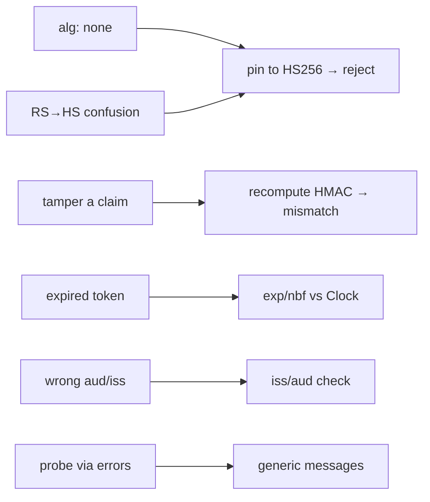

### 7.5 Real-World Analogy
A **forger's playbook, countered.** Erasing the seal and claiming "no seal needed"
(`none`) — refused; we require *our* seal. Re-inking a number on the document —
caught, the seal no longer matches. A last-year's pass — expired. A rival club's
pass — wrong audience. And the guard never tells the forger *which* feature failed.

### 7.6 Example
Every one of these is a real, passing test in
`tests/unit/infrastructure/test_jwt_verifier.py`: tampered signature → 401,
`alg:none` → 401, expired → 401, wrong `iss`/`aud` → 401, missing `tenant_id`/`sub`
→ 401, malformed base64 → 401.

### 7.7 Common Mistakes
- **Honoring the header's algorithm.** The single most common JWT vulnerability;
  always pin.
- **Verifying signature but skipping `exp`/`aud`/`iss`.** A valid signature on the
  *wrong* token is still the wrong token.
- **Helpful error messages.** "Signature abc… expected def…" is a gift to an
  attacker. Keep them generic.

### 7.8 Key Takeaways
- Pinning the algorithm defeats both `alg:none` and RS→HS confusion.
- Signature + `exp`/`nbf` + `iss`/`aud` together make a token *valid for us, now*.
- Generic errors and strict claim validation close the smaller holes. Every defense
  has a test.

### 7.9 Self-Assessment
1. What is the `alg:none` attack, and how does one line of our code stop it?
2. Why isn't "the signature is valid" sufficient to accept a token?
3. Why must auth errors avoid detail?

### 7.10 Connection to Previous Topics
This is Phase 2's "untrusted input" mindset applied to tokens: a token is hostile
until proven safe. The same instinct scanned prompts for injection; here it scans a
credential for forgery.

---

# Part III — The Endpoints

---

## Chapter 8 — Wiring Auth into a Request: FastAPI Dependencies

### 8.1 Introduction
We have a verifier. How does it actually run on every request, turning a header into
an `AuthContext` the route can use? Through a FastAPI **dependency**:
`get_auth_context`.

### 8.2 Prerequisites
- Chapter 3 (dependency providers) and Chapter 6 (the verifier).

### 8.3 Detailed Explanation
FastAPI's **dependency injection** lets a route *declare* what it needs as
parameters; FastAPI runs the provider functions and passes the results in.
`get_auth_context` is the provider that authenticates:

```python
def get_auth_context(request: Request) -> AuthContext:
    header = request.headers.get("Authorization")
    if not header or not header.startswith("Bearer "):
        raise AuthenticationError("missing or malformed Authorization header")
    token = header[len("Bearer ") :].strip()
    if not token:
        raise AuthenticationError("empty bearer token")
    return get_container(request).token_verifier.verify(token)
```

It reads the `Authorization: Bearer <token>` header, extracts the token, and calls
the wired verifier. Any route that adds `auth: AuthContext = Depends(get_auth_context)`
is now **protected**: unauthenticated requests never reach the handler body —
they're rejected with `401` first. And because it returns an `AuthContext`, the
handler receives the *verified tenant* to scope everything by.

### 8.4 How It Works
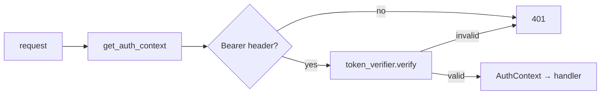

### 8.5 Real-World Analogy
A **turnstile in front of every ride**. You don't ask each ride operator to check
tickets; you put one turnstile (`get_auth_context`) that everyone passes through.
No valid ticket, no entry — the operator only ever sees people who got through.

### 8.6 Example
```python
@router.post("/remediate", response_model=RemediationProposal)
async def remediate(body: RemediateRequest,
                    auth: AuthContext = Depends(get_auth_context),
                    agents: AgentSuite = Depends(get_agents)) -> RemediationProposal:
    ...
```
`auth` is guaranteed to be a verified identity by the time the body runs.

### 8.7 Common Mistakes
- **Re-checking auth inside each handler.** Declare the dependency once; let the
  framework enforce it.
- **Reading the token but not verifying it.** Extraction is not verification — call
  the verifier.
- **Forgetting the `Bearer ` prefix.** The scheme prefix is part of the standard
  header; strip it before verifying.

### 8.8 Key Takeaways
- `get_auth_context` turns the `Authorization` header into a verified `AuthContext`.
- Adding it via `Depends` makes a route authenticated; the body only runs for valid
  callers.
- The handler receives the verified tenant to scope its work.

### 8.9 Self-Assessment
1. What does `get_auth_context` return, and what does it raise on failure?
2. How does a route become "protected"?
3. Why is extracting the token not the same as verifying it?

### 8.10 Connection to Previous Topics
This is Chapter 3's dependency-provider pattern applied to security, and it hands
the route the Phase-1 `AuthContext` that the Phase-4 agents already accept as their
second argument.

---

## Chapter 9 — Tenant Isolation at the Boundary

### 9.1 Introduction
Authentication proved *who* the caller is. Now the single most important
**authorization** rule in a multi-tenant product: a caller may only act on **their
own tenant's** data. This is non-negotiable rule 1, enforced at the API edge.

### 9.2 Prerequisites
- Chapter 8 (`AuthContext` on the request).
- The Phase-1 `assert_same_tenant` policy and `TenantIsolationError`.

### 9.3 Detailed Explanation
The token carries the authoritative `tenant_id`. Request bodies carry findings, and
each `Finding` *also* has a `tenant_id`. If those disagree, someone is trying to run
tenant B's finding under tenant A's token — a cross-tenant access. We block it
**before any AI runs**:

```python
def _assert_tenant(findings, auth):
    for finding in findings:
        assert_same_tenant(
            expected_tenant_id=auth.tenant_id,
            actual_tenant_id=finding.tenant_id,
            resource_kind="finding",
        )
```

Every endpoint that accepts findings calls this first. A mismatch raises
`TenantIsolationError`, mapped to **`403 tenant_isolation_violation`**. Critically,
the error does **not** echo the foreign tenant id back to the caller (that would
leak information); both ids are recorded only in server-side audit details.

Why check at the boundary rather than deep inside? Because it's the earliest,
cheapest, most auditable place — no AI budget is spent, and the rule lives in one
obvious spot per endpoint. (Defense-in-depth: the data layer in Phase 6 will *also*
scope queries by tenant, so isolation holds even if a boundary check were ever
missed.)

### 9.4 How It Works
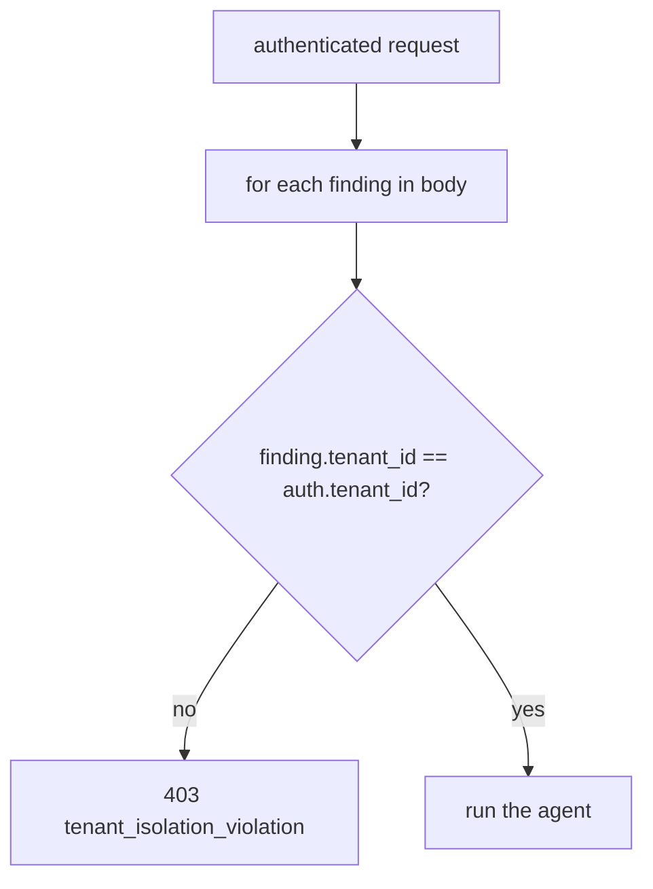

### 9.5 Real-World Analogy
A **safe-deposit vault**. Your ID (token) says you're account #A. You hand the clerk
a box labeled #B. The clerk stops immediately — you don't get to open someone else's
box, and they don't tell you whose box it was. The check happens at the counter, not
after they've already pulled the box.

### 9.6 Example
- Token `tenant_id = "tenant-a"`, body finding `tenant_id = "tenant-b"` →
  `403 {"error":{"code":"tenant_isolation_violation", ...}}`.
- Same tenant on both → the enrich/remediate/correlate/report agent runs normally.

### 9.7 Common Mistakes
- **Trusting the body's tenant instead of the token's.** The **token** is
  authoritative; the body must match it.
- **Echoing the foreign tenant in the error.** That leaks which tenants exist; keep
  it in server-side audit only.
- **Checking after running the AI.** Check first — deny before spending work or
  touching data.

### 9.8 Key Takeaways
- The token's `tenant_id` is authoritative; every body finding must match it.
- Mismatch → `403 tenant_isolation_violation`, checked **before** any AI runs.
- The error never leaks the other tenant's id (audit-only).

### 9.9 Self-Assessment
1. Which `tenant_id` is authoritative — the token's or the body's?
2. What status and code does a cross-tenant request return?
3. Why check tenant isolation at the boundary rather than deep inside?

### 9.10 Connection to Previous Topics
`assert_same_tenant` and `TenantIsolationError` were built in Phase 1 as promises;
Phase 5 is the first place real external requests exercise them. This is rule 1
becoming an HTTP status code.

---

## Chapter 10 — Request Envelopes and the Response Contract

### 10.1 Introduction
What exactly does a client send and receive? This chapter covers the **request
envelopes** we add and the deliberate decision to **reuse the domain models as the
response contract**.

### 10.2 Prerequisites
- Chapter 2 (JSON). Phase-1 contracts (`Finding`, `EnrichedFinding`, `CopilotAnswer`,
  `RemediationProposal`, `ReportDraft`).

### 10.3 Detailed Explanation
**Requests.** Each endpoint takes a small **envelope** — a thin Pydantic model in
`presentation/schemas.py` that wraps the real input:
- `EnrichRequest{ findings: list[Finding] }` (1–100),
- `AskRequest{ question: str, framework: Framework | None }`,
- `RemediateRequest{ finding: Finding }`,
- `CorrelateRequest{ findings: list[Finding] }`,
- `ReportRequest{ findings: list[EnrichedFinding] }`.

These add API-level validation (e.g. "at least one finding," "question ≤ 2000
chars") and reject unknown fields (`extra="forbid"`). If the body is malformed,
FastAPI/Pydantic reject it with **`422`** before the handler runs.

**Responses.** Here's a deliberate choice: the response models **are the domain
contracts themselves** — `/enrich` returns `list[EnrichedFinding]`, `/remediate`
returns `RemediationProposal`, and so on. We did **not** create a parallel set of
"response DTOs." Why? Because the Core Service integration handoff treats those exact
Pydantic models as the canonical wire contract. Duplicating them would invite
**drift** — two definitions that slowly disagree. The one exception is `/correlate`,
whose agent returns a bare string, so we wrap it in a `CorrelateResponse{ narrative }`
for a clean JSON object.

This is a *pragmatic* bend of the usual "separate wire schemas from domain models"
rule, made because the domain models were *designed* as the shared contract (they're
frozen, `extra="forbid"`, vendor-free). The handoff document is explicit about it.

### 10.4 How It Works
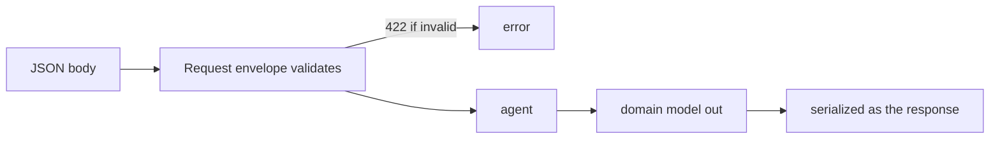

### 10.5 Real-World Analogy
**Standardized forms between two offices.** Rather than each office inventing its own
version of "the findings form" (which drift apart over years), both use the *same*
master form. The envelope is just the cover sheet ("here are 1–100 findings");
the form inside is the shared contract.

### 10.6 Example
```jsonc
// POST /api/v1/ai/enrich  request
{ "findings": [ { "id": "f1", "tenant_id": "tenant-a", "framework": "nist_csf",
                  "control_id": "PR.AA-01", "domain": "iam", "status": "fail",
                  "severity": "high", "evidence": {...}, "detected_at": "2026-01-01T00:00:00Z",
                  "resource_id": "arn:...", "rule_id": "r1" } ] }
// response: [ EnrichedFinding, ... ]  ← the domain contract itself
```

### 10.7 Common Mistakes
- **Duplicating domain models as response DTOs "for separation."** Here it only
  breeds drift; the domain models are the agreed contract.
- **Forgetting `extra="forbid"`.** A misspelled field should be *rejected*, not
  silently ignored — that catches integration bugs early.
- **Returning a bare string as a response.** Wrap scalars in an object
  (`{ "narrative": ... }`) so the JSON is extensible.

### 10.8 Key Takeaways
- Requests use thin **envelopes** with API-level validation (`422` on bad input).
- Responses **are** the domain contracts (no parallel DTOs) — the handoff makes them
  canonical, and reuse avoids drift.
- `/correlate` wraps its string result in `CorrelateResponse`.

### 10.9 Self-Assessment
1. What does an `EnrichRequest` add on top of a list of findings?
2. Why do we return domain models directly instead of separate response DTOs?
3. What status code does a malformed body produce?

### 10.10 Connection to Previous Topics
The models come straight from Phase 1 (contracts) and Phases 3–4 (outputs like
`EnrichedFinding`, `CopilotAnswer`). Phase 5 just chooses them as the wire shape,
honoring the Core Service handoff document.

---

## Chapter 11 — The Five Capability Endpoints

### 11.1 Introduction
The payoff chapter: the five routes that expose the Phase-4 agents. Each is short —
authenticate, check tenant, call the agent — which is exactly the point.

### 11.2 Prerequisites
- Chapters 8 (auth dependency), 9 (tenant check), 10 (schemas). Phase-4 agents.

### 11.3 Detailed Explanation
All live in `presentation/routers/ai.py` under the prefix **`/api/v1/ai`**, each
depending on `get_auth_context` and `get_agents`:

| Method & path | Body | Calls | Returns |
| --- | --- | --- | --- |
| `POST /enrich` | `EnrichRequest` | `compliance_analyst.analyze` per finding | `list[EnrichedFinding]` |
| `POST /ask` | `AskRequest` | `copilot.run` | `CopilotAnswer` |
| `POST /remediate` | `RemediateRequest` | `remediation_engineer.propose` | `RemediationProposal` (`approved:false`) |
| `POST /correlate` | `CorrelateRequest` | `risk_analyst.correlate` | `CorrelateResponse` |
| `POST /report` | `ReportRequest` | `report_writer.write` | `ReportDraft` |

The shape of every handler is the same three beats: **(1)** the auth dependency has
already verified the caller; **(2)** `_assert_tenant(...)` blocks cross-tenant
findings; **(3)** the agent runs and its result is returned. `/ask` has no findings
so it skips the tenant loop (its grounding is inherently corpus-scoped), but it's
still authenticated. Grounding guarantees ride along for free: `/enrich` and `/ask`
carry `citation_verified`/`abstained`; `/remediate` is always `approved:false`.

**What's *not* here:** `/ai/map` and `/ai/financial` — those capabilities don't
exist yet (Phase 7). We expose only what we can actually, safely deliver.

### 11.4 How It Works (one endpoint, distilled)
```python
@router.post("/enrich", response_model=list[EnrichedFinding])
async def enrich(body: EnrichRequest,
                 auth: AuthContext = Depends(get_auth_context),
                 agents: AgentSuite = Depends(get_agents)) -> list[EnrichedFinding]:
    _assert_tenant(body.findings, auth)                       # rule 1
    return [await agents.compliance_analyst.analyze(f, auth) for f in body.findings]
```

### 11.5 Real-World Analogy
A **reception desk with five clearly-labeled windows**. Each window does one thing,
and every window shares the same two front-desk steps first: check your ID, confirm
it's your account. The specialist behind the window (the agent) only ever handles
pre-screened, in-tenant work.

### 11.6 Example
```bash
curl -sS localhost:8000/api/v1/ai/ask \
  -H "Authorization: Bearer $TOKEN" -H "Content-Type: application/json" \
  -d '{"question":"How should IAM access keys be managed?"}'
# → 200 {"question":"...","answer":"...","citation_verified":true,"abstained":false,"citations":[...]}
```

### 11.7 Common Mistakes
- **Putting business logic in the route.** The route orchestrates; the *agent* holds
  the logic. Keep handlers thin.
- **Exposing capabilities you can't back.** Don't publish `/map` until Phase 7 makes
  it real.
- **Skipping the tenant check on an endpoint that takes findings.** Every such
  endpoint calls `_assert_tenant` — no exceptions.

### 11.8 Key Takeaways
- Five endpoints under `/api/v1/ai`, each: authenticate → tenant-check → run agent.
- Handlers are intentionally thin; the Phase-4 agents do the work.
- Grounding/safety flags (`citation_verified`, `abstained`, `approved:false`) flow
  straight through. `map`/`financial` wait for Phase 7.

### 11.9 Self-Assessment
1. What are the three beats shared by every handler?
2. Why does `/ask` skip the tenant loop but not authentication?
3. Which two documented endpoints are deliberately not implemented, and why?

### 11.10 Connection to Previous Topics
Each route is a one-line call into a Phase-4 agent — the uniform, bounded entry
points we built precisely so the API could stay thin. Phase 4's foresight is Phase
5's simplicity.

---

## Chapter 12 — Errors on the Wire

### 12.1 Introduction
Real systems fail. How an API *reports* failure is part of its contract. Phase 5
routes every failure through one consistent **error envelope**, and never leaks
internals.

### 12.2 Prerequisites
- Chapter 2 (status codes). Phase-1 typed exceptions (`ComplianceIQError` subclasses).

### 12.3 Detailed Explanation
Domain and application code raise **typed exceptions** that know nothing about HTTP
(`AuthenticationError`, `TenantIsolationError`, `ValidationError`, `UnsafeContentError`,
`WorkflowError`, …). A single set of **exception handlers** (`presentation/errors.py`)
maps each to a status code and renders the same JSON envelope:

```json
{ "error": { "code": "…", "message": "…", "correlation_id": "…", "details": {} } }
```

The mapping (most-specific first):

| Exception | Status | `code` |
| --- | --- | --- |
| `AuthenticationError` | 401 | `authentication_error` |
| `TenantIsolationError` | 403 | `tenant_isolation_violation` |
| `ValidationError` / bad body | 422 | `validation_error` |
| `UnsafeContentError` | 400 | `unsafe_content` |
| `WorkflowError` | 500 | `workflow_error` |
| `ProviderError` | 502 | `provider_error` |
| *anything unexpected* | 500 | `internal_error` (generic) |

Two rules make this safe: **(1)** no stack trace or internal detail ever reaches the
client — an unexpected error becomes a generic `500` whose real cause is only in the
logs; **(2)** every response carries a **correlation id** (also the
`X-Correlation-ID` header), so a client can quote it to support and an engineer can
find the exact request in the logs. This is the backbone of the audit trail (rule 7).

### 12.4 How It Works
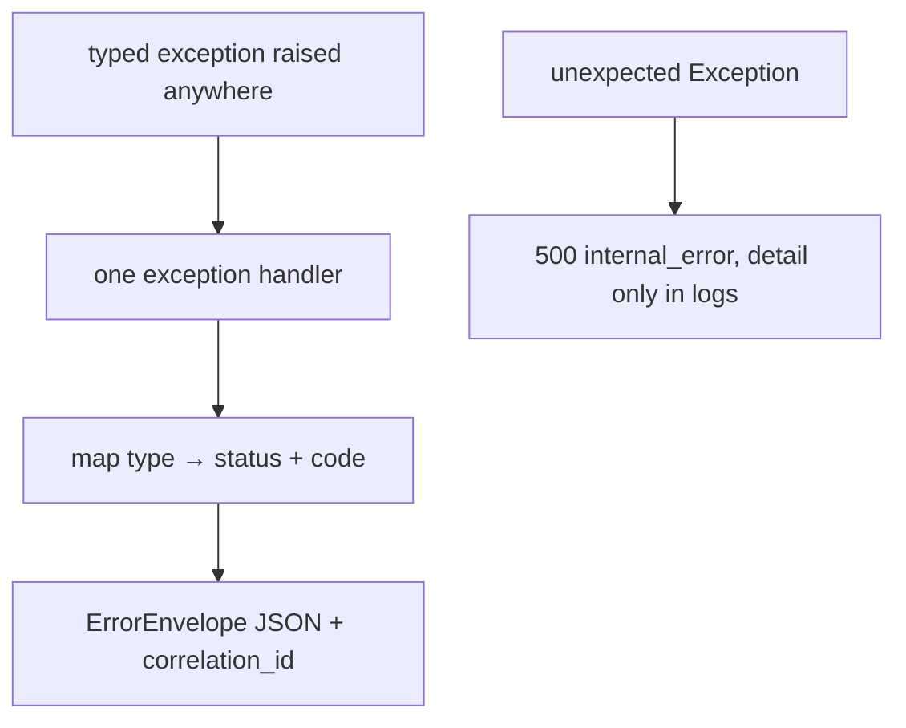

### 12.5 Real-World Analogy
A **customer-service script**. However the failure happened inside, the front desk
gives you a consistent, polite card: a reason code, a plain message, and a *ticket
number* (correlation id) to quote. They never hand you the internal incident report.

### 12.6 Example
- Missing token → `401 {"error":{"code":"authentication_error", ...}}`.
- Cross-tenant finding → `403 {"error":{"code":"tenant_isolation_violation", ...}}`.
- Empty `findings` array → `422 {"error":{"code":"validation_error", ...}}`.

### 12.7 Common Mistakes
- **Leaking exception text to clients.** Map to a safe message; log the detail.
- **Inconsistent error shapes per endpoint.** One envelope, everywhere — clients
  parse errors one way.
- **Dropping the correlation id.** It's what ties a user-visible failure to the logs.

### 12.8 Key Takeaways
- Typed domain exceptions map, in one place, to statuses and a single `ErrorEnvelope`.
- Clients never see stack traces; unexpected errors are a generic `500`.
- Every error carries a **correlation id** for audit and support (rule 7).

### 12.9 Self-Assessment
1. What status/code does a cross-tenant request produce? A missing token?
2. What does the client get for an *unexpected* server error, and where's the real
   cause?
3. What is the correlation id for?

### 12.10 Connection to Previous Topics
The typed exceptions are Phase 1's; the correlation-id middleware is Phase 1/2's
audit backbone. Phase 5 is where they meet real external callers and become concrete
HTTP responses.

---

# Part IV — Assembly & Beyond

---

## Chapter 13 — Putting It Together, and Preparing for Phase 6

### 13.1 Introduction
The closing chapter assembles the phase in the composition root and looks ahead to
Phase 6 (the Core Service client, real RS256 verification, and PostgreSQL + pgvector).

### 13.2 Prerequisites
- All previous chapters.

### 13.3 Detailed Explanation
The composition root now also builds the **token verifier** from settings and adds
it, plus the `AgentSuite`, to the `ApplicationContainer`:

```python
token_verifier = build_token_verifier(
    secret=settings.jwt_hs256_secret.get_secret_value(),
    issuer=settings.jwt_issuer,
    audience=settings.jwt_audience,
    clock=clock,
)
```

`create_app` includes the AI router alongside the health router. The `Container`
protocol gained `agents` and `token_verifier`; a new setting `jwt_hs256_secret`
(with a clearly-insecure default and a `.env.example` warning) configures the dev
verifier. Everything remains **offline-testable**: the endpoint tests mint HS256
tokens with the standard library (no JWT package), boot the app (which autoloads the
sample corpus), and exercise real retrieval and generation via the fake provider.
Phase 5 lands with **218 passing tests at ~95% coverage**, `mypy --strict` clean, and
the four architecture contracts still green (FastAPI never leaks past presentation).

### 13.4 How It Works (the finished container)
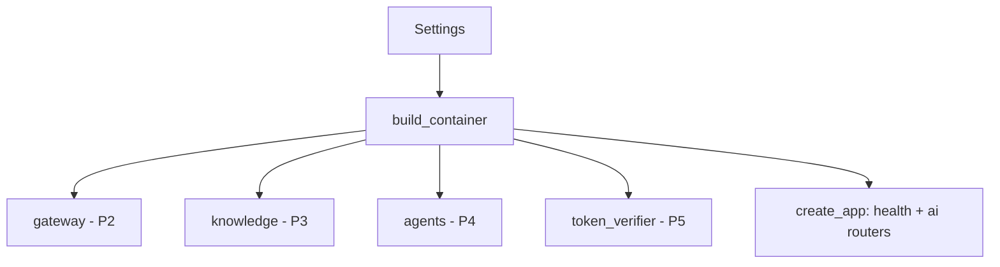

### 13.5 Real-World Analogy
**Opening day.** The vault (P1–3), the tellers (P4), and now the front desk and ID
scanner (P5) are all installed and wired to the same blueprint. The branch can take
its first real customers — securely.

### 13.6 Example
```python
app = build_app(settings)     # health + /api/v1/ai/* routes, auth wired
# a client now POSTs to /api/v1/ai/enrich with a bearer token and gets EnrichedFindings
```

### 13.7 Common Mistakes
- **Shipping the dev secret to production.** `jwt_hs256_secret`'s default is
  insecure by design; production must set a real one (and Phase 6 moves to RS256).
- **Wiring auth outside the composition root.** Build it once, centrally.
- **Assuming Phase 5's HS256 is the final scheme.** It's the dev seam; Phase 6 swaps
  in the Core's asymmetric key behind the same port.

### 13.8 Key Takeaways
- The composition root builds the verifier and exposes `agents` + `token_verifier`
  on the container.
- New setting `jwt_hs256_secret` (insecure default, documented); AI router included.
- Fully offline-testable; all quality gates stay green.

### 13.9 Self-Assessment
1. What two new things does the container expose after Phase 5?
2. Why is the default HS256 secret safe to ship in the repo but not to production?
3. How do the endpoint tests run without a network or a JWT library?

### 13.10 Connection to Previous Topics — and What's Next
Phase 5 completes the request path end-to-end: HTTP → auth → tenant → Phase-4 agent →
Phase-3 retrieval → Phase-2 gateway → domain contracts back out. **Phase 6** hardens
the edges: a **Core Service client** to *fetch* findings (instead of receiving them
in the body), the **RS256/ES256** verifier using the Core's public key (swapped in
behind today's `TokenVerifier` port), and **PostgreSQL + pgvector** replacing the
in-memory stores behind the Phase-3 ports. The seams we built — ports everywhere —
are exactly what make that phase a set of *swaps*, not a rewrite.

---

## Appendix A — Glossary

- **HTTP** — the request/response protocol of the web (method, path, headers, body).
- **REST** — an API style organized around resources and HTTP methods.
- **JSON** — the text format for request/response bodies.
- **Status code** — the numeric result: 2xx ok, 4xx client error, 5xx server error.
- **API / endpoint** — a callable operation over HTTP (e.g. `POST /api/v1/ai/enrich`).
- **Authentication (authn)** — proving *who* the caller is.
- **Authorization (authz)** — deciding what they're *allowed* to do (e.g. tenant scope).
- **JWT** — a signed, self-contained token carrying claims (`header.payload.signature`).
- **Claim** — a fact in the token (`sub`, `tenant_id`, `roles`, `iss`, `aud`, `exp`).
- **Bearer token** — a token sent in `Authorization: Bearer <token>`; holding it = using it.
- **HMAC / HS256** — a keyed hash; the symmetric JWT signature scheme used in Phase 5.
- **RS256/ES256** — asymmetric signature schemes (private key signs, public key verifies); Phase 6.
- **base64url** — URL-safe text encoding of bytes; how JWT parts are written.
- **Port** — an abstract interface (e.g. `TokenVerifier`) with swappable adapters.
- **Dependency (FastAPI)** — a function whose result is injected into a route via `Depends`.
- **Composition root** — the one place (`composition.py`) that wires concrete services.
- **Container protocol** — the shape presentation needs; the real container satisfies it structurally.
- **Correlation id** — a per-request id tying a response (and errors) to the logs.
- **Tenant isolation** — rule 1: a caller may only touch their own tenant's data.

## Appendix B — Endpoint quick reference

| Method | Path | Body | Response | Auth | Tenant-checked |
| --- | --- | --- | --- | --- | --- |
| POST | `/api/v1/ai/enrich` | `{findings:[Finding]}` | `[EnrichedFinding]` | ✓ | ✓ |
| POST | `/api/v1/ai/ask` | `{question, framework?}` | `CopilotAnswer` | ✓ | n/a |
| POST | `/api/v1/ai/remediate` | `{finding}` | `RemediationProposal` (`approved:false`) | ✓ | ✓ |
| POST | `/api/v1/ai/correlate` | `{findings:[Finding]}` | `{narrative}` | ✓ | ✓ |
| POST | `/api/v1/ai/report` | `{findings:[EnrichedFinding]}` | `ReportDraft` | ✓ | ✓ |
| GET | `/health`, `/health/ready`, `/version` | — | status/info | — | — |

## Appendix C — Self-Assessment Answer Key (brief)

- **Ch. 4:** authn = prove who you are, authz = what you may do; a JWT payload is
  readable because *signature*, not secrecy, provides trust; the Core issues, we
  verify.
- **Ch. 6:** the key makes the fingerprint unforgeable without it; order is
  split→alg→signature→claims→time→iss/aud→AuthContext; `compare_digest` is
  constant-time to stop timing forgery.
- **Ch. 7:** `alg:none` = a header claiming "no signature," stopped by pinning to
  HS256; a valid signature on a wrong-audience/expired token is still invalid;
  detailed errors help attackers probe.
- **Ch. 9:** the token's `tenant_id` is authoritative; cross-tenant →
  `403 tenant_isolation_violation`; check at the boundary to deny before spending
  work and to keep the rule in one auditable place.

---

*End of Phase 5 Study Guide. You now understand — from first principles — how
ComplianceIQ becomes a secure, multi-tenant HTTP API: how requests are
authenticated with a hand-verified JWT, scoped to a tenant, validated, and routed to
the Phase-4 agents. Phase 6 hardens the edges with a real Core client, asymmetric
tokens, and a Postgres-backed store — all behind the ports we already built.*
