<!--
  PHASE 6 STUDY GUIDE — ComplianceIQ AI Service
  A complete, beginner-first textbook for the Integration & Persistence phase.
-->

# Phase 6 Study Guide — Talking to the Core, Trusting Its Tokens, and Storing at Scale

> **Who this is for:** a motivated beginner. You do **not** need to have mastered
> Phases 1–5. You do **not** need to know what a service client, RSA, a JWK, a
> database driver, or pgvector is. We build every idea from the ground up.
>
> **How to read it:** straight through the first time. Each chapter follows the
> same rhythm — *Introduction → Prerequisites → Detailed Explanation → How It
> Works → Analogy → Example → Common Mistakes → Key Takeaways → Self-Assessment →
> Connection to Previous Topics* — so you always know where you are.
>
> **The promise:** by the end you will understand, from first principles, how one
> service **calls another** over the network safely; how **asymmetric** signatures
> (RS256) let us verify tokens we could never forge, and how we implemented that
> with nothing but Python integers; and how the same knowledge base moves from an
> in-memory dictionary to **PostgreSQL + pgvector** without changing a line of the
> logic above it. Well enough to defend it to a senior engineer or a jury.

---

## What Phase 6 adds (a map to keep open)

```text
src/complianceiq/
├── domain/ports/core.py                       ← CoreClient port (fetch findings)
├── infrastructure/core/
│   ├── stub_client.py                         ← StubCoreClient (seeded, offline default)
│   ├── http_client.py                         ← HttpCoreClient (httpx, token pass-through)
│   └── factory.py                             ← build_core_client (stub | http)
├── infrastructure/auth/
│   ├── jwt_base.py                            ← BaseJwtVerifier (shared claim pipeline)
│   ├── jwt_verifier.py                        ← HS256TokenVerifier (Phase 5, refactored)
│   └── rs256_verifier.py                      ← RS256TokenVerifier (stdlib RSA)
├── infrastructure/knowledge/
│   ├── pgvector_store.py                      ← PgVectorStore (VectorStore port, SQL)
│   └── psycopg_executor.py                    ← lazy psycopg-backed SqlExecutor
├── migrations/0001_knowledge_pgvector.sql     ← extension + table + ivfflat index
├── presentation/routers/ai.py                 ← + POST /ai/enrich/by-ids
└── composition.py                             ← selects verifier / core client / store
```

## Table of Contents

**Part I — Talking to Another Service**
1. [What Phase 6 Is: Hardening the Edges](#chapter-1--what-phase-6-is-hardening-the-edges)
2. [Service-to-Service Calls, and the CoreClient Port](#chapter-2--service-to-service-calls-and-the-coreclient-port)
3. [The Stub and the HTTP Adapter](#chapter-3--the-stub-and-the-http-adapter)
4. [Token Pass-Through and Defense-in-Depth Tenancy](#chapter-4--token-pass-through-and-defense-in-depth-tenancy)

**Part II — Asymmetric Trust (RS256)**
5. [Symmetric vs. Asymmetric: Why RS256 Beats HS256 in Production](#chapter-5--symmetric-vs-asymmetric-why-rs256-beats-hs256-in-production)
6. [How RSA Verification Actually Works](#chapter-6--how-rsa-verification-actually-works)
7. [Implementing RS256 with Nothing but Integers](#chapter-7--implementing-rs256-with-nothing-but-integers)
8. [One Pipeline, Two Signatures: The Shared Base](#chapter-8--one-pipeline-two-signatures-the-shared-base)

**Part III — Storing at Scale (pgvector)**
9. [From a Dictionary to a Database: Why pgvector](#chapter-9--from-a-dictionary-to-a-database-why-pgvector)
10. [The Executor Seam, and Testing a Database Adapter Without a Database](#chapter-10--the-executor-seam-and-testing-a-database-adapter-without-a-database)
11. [The pgvector Store: SQL, Ranking, and the Model Guard](#chapter-11--the-pgvector-store-sql-ranking-and-the-model-guard)

**Part IV — Assembly & Beyond**
12. [Configuration-Driven Wiring, Honest Limits, and Preparing for Phase 7](#chapter-12--configuration-driven-wiring-honest-limits-and-preparing-for-phase-7)

---

# Part I — Talking to Another Service

---

## Chapter 1 — What Phase 6 Is: Hardening the Edges

### 1.1 Introduction
Phases 1–5 built a complete, self-contained service: architecture, an LLM gateway,
retrieval, agents, and an HTTP API. But three of its edges were deliberately left
as **development stand-ins**: findings arrived in request bodies (not fetched from
the real system of record), tokens were verified with a shared secret (fine for
dev, wrong for production), and the knowledge base lived in memory (lost on
restart). Phase 6 hardens all three — **without rewriting anything above them**.

### 1.2 Prerequisites
- The Phase-5 idea of a **port**: an abstract interface the app depends on, with
  swappable concrete adapters chosen at the composition root.
- The Phase-5 `TokenVerifier` port and `AuthContext`.

### 1.3 Detailed Explanation
The theme of Phase 6 is **"swap the edge, keep the core."** Each of the three
upgrades slots in behind an interface that already existed:

1. **Fetch findings from the Core Service.** The Core owns cloud scanning, the rule
   engine, and the findings database. Until now a client had to *send us* findings.
   Now we can *pull* the authoritative findings from the Core ourselves — behind a
   new `CoreClient` port (Part I).
2. **Verify production tokens (RS256).** Phase 5's HS256 used a *shared secret*.
   Production tokens are signed with a private key only the Core holds; we verify
   them with the Core's *public* key. New `RS256TokenVerifier`, same
   `TokenVerifier` port (Part II).
3. **Persist the knowledge base (pgvector).** The in-memory store is replaced (when
   configured) by PostgreSQL + the `pgvector` extension — behind the Phase-3
   `VectorStore` port (Part III).

Because each upgrade hides behind a port, the *choice* is made in one place
(settings + composition root), and the application and API code never learn which
implementation they got. That is the entire architectural payoff of the earlier
phases, cashed in here.

### 1.4 How It Works (the three swaps)
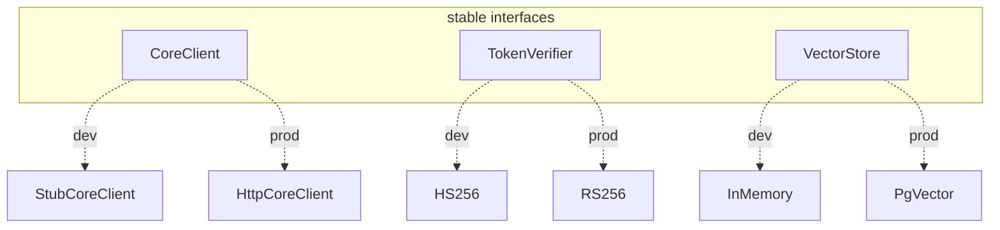

### 1.5 Real-World Analogy
A **theatre moving from rehearsal to opening night**. During rehearsal you use a
stand-in actor (stub findings), a practice key to the prop safe (HS256 shared
secret), and a cardboard set (in-memory store). On opening night you swap in the
lead actor, the real safe with its unique key, and the built set — but the script,
the blocking, and the direction (your application logic) don't change at all.

### 1.6 Example
- *Dev/testing:* `core_client=stub`, no public key (HS256), `vector_store=memory`
  — everything runs offline, no network, no database.
- *Production:* `core_client=http`, `jwt_public_key=<the Core's JWK>` (RS256),
  `vector_store=pgvector` — the same code, three settings changed.

### 1.7 Common Mistakes
- **Rewriting the core to add an integration.** If a new edge forces changes above
  the port, the port was wrong. Phase 6 changes only adapters + wiring.
- **Treating dev stand-ins as throwaway.** The stub, HS256, and in-memory store are
  first-class, tested implementations — they keep the whole system offline-testable
  forever, not just today.
- **Coupling to a concrete integration.** Depend on `CoreClient`, not on `httpx`.

### 1.8 Key Takeaways
- Phase 6 hardens three edges: **findings source, token verification, storage**.
- Each swaps in behind an **existing port**; the app above is untouched.
- The choice is **configuration**, made once at the composition root.

### 1.9 Self-Assessment
1. Name the three edges Phase 6 hardens and the port each hides behind.
2. What stays the same when you switch from HS256 to RS256?
3. Why keep the stub/in-memory/HS256 implementations rather than delete them?

### 1.10 Connection to Previous Topics
This is the dividend of Phase 1's Dependency Inversion and every port built since:
Phase 2's provider port, Phase 3's `VectorStore`, Phase 5's `TokenVerifier`. Phase
6 proves the promise — production concerns slot in as *adapters*, not rewrites.

---

## Chapter 2 — Service-to-Service Calls, and the CoreClient Port

### 2.1 Introduction
The first edge: instead of receiving findings in a request body, the AI service
**calls the Core Service** to fetch them. This chapter introduces the idea of one
backend calling another, and the `CoreClient` port that models it.

### 2.2 Prerequisites
- Chapter 1. The Phase-2/5 idea that HTTP calls are I/O that belongs in
  infrastructure, behind a port.
- The Phase-1 `Finding` and `Page[T]` contracts.

### 2.3 Detailed Explanation
So far, *clients* called *us*. But our service also needs to be a *client* of
another service — the Core, which is the **system of record** for findings (it
scanned the cloud and ran the rules; we did not). Rather than trust whatever
findings a caller pastes into a request body, we can fetch the *authoritative*
finding straight from the Core by id.

That outbound call is I/O, and I/O hides behind a port. `domain/ports/core.py`
defines `CoreClient`:

```python
class CoreClient(ABC):
    @abstractmethod
    async def get_finding(self, auth, finding_id, *, bearer_token) -> Finding: ...
    @abstractmethod
    async def list_findings(self, auth, *, bearer_token, framework=None,
                            severity=None, status=None, limit=50, offset=0) -> Page[Finding]: ...
```

Three design points:
- It returns **domain** objects (`Finding`, `Page[Finding]`) — the application never
  sees HTTP or JSON.
- Every method takes the caller's **`auth`** (for tenant scoping) and their
  **`bearer_token`** (to forward — Chapter 4).
- It is an **abstract port**, so a live HTTP client and an offline stub are
  interchangeable (Chapter 3).

### 2.4 How It Works (who calls whom)
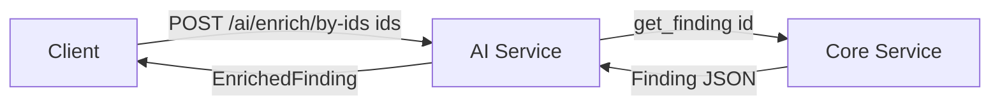
The AI service is a *server* to the user and a *client* to the Core in the same
request.

### 2.5 Real-World Analogy
A **pharmacy filling a prescription**. You (the client) hand the pharmacist a
prescription *number*, not a bottle of pills you brought from home. The pharmacist
(AI service) looks up the authoritative prescription in the doctor's system (the
Core) before dispensing. Trusting the number-plus-lookup beats trusting whatever
you carried in.

### 2.6 Example
The new endpoint takes **ids**, not finding bodies:
```jsonc
// POST /api/v1/ai/enrich/by-ids
{ "finding_ids": ["finding-iam-1", "finding-net-1"] }
// → the service fetches each from the Core, then returns [EnrichedFinding, …]
```

### 2.7 Common Mistakes
- **Returning httpx/JSON types from the port.** The port speaks domain objects;
  translation happens inside the adapter.
- **Trusting body-supplied findings as authoritative.** For real integration, fetch
  from the system of record by id.
- **Putting the outbound call in the application layer.** It's I/O — it lives in an
  infrastructure adapter behind the port.

### 2.8 Key Takeaways
- Our service is both a server (to users) and a **client** (to the Core).
- `CoreClient` is the port for fetching authoritative findings; it returns domain
  objects and takes `auth` + `bearer_token`.
- The new `/ai/enrich/by-ids` endpoint pulls findings by id from the Core.

### 2.9 Self-Assessment
1. Why fetch findings from the Core instead of accepting them in the body?
2. What types does the `CoreClient` port return, and why not JSON?
3. In one request, how is the AI service both a server and a client?

### 2.10 Connection to Previous Topics
Same port discipline as Phase 2's `LLMProvider` (we're a client of an LLM API) —
now applied to the Core's REST API. The returned `Finding`/`Page[T]` are the
Phase-1 contracts the whole system already speaks.

---

## Chapter 3 — The Stub and the HTTP Adapter

### 3.1 Introduction
Two implementations of `CoreClient`: a **stub** for offline development and tests,
and an **HTTP adapter** for the real thing. This chapter shows both and how they
stay interchangeable.

### 3.2 Prerequisites
- Chapter 2 (the port). The Phase-2 pattern of testing an httpx adapter with
  `MockTransport`.

### 3.3 Detailed Explanation
**`StubCoreClient`** holds a few seeded findings per tenant in a dict. It is the
**offline default**, so the whole pipeline — fetch → enrich — runs with no live
Core and the test suite needs no network. Critically, it enforces the same tenant
scoping the real Core does: a foreign-tenant id reads as `NotFoundError`, never the
data.

**`HttpCoreClient`** calls the Core's REST API (`GET /api/v1/findings/{id}` and
`/api/v1/findings`) over an **injectable** `httpx.AsyncClient`. That injectability
is what makes it testable offline: tests pass an `httpx.MockTransport` that returns
canned responses — no network, no real Core. The adapter's job is translation:
- turn method arguments into a URL, query params, and an `Authorization` header;
- parse the JSON body into domain `Finding`/`Page[Finding]`;
- translate HTTP failures into **domain exceptions** the API already renders
  (`404 → NotFoundError`, `401 → AuthenticationError`, `403 → AuthorizationError`,
  `5xx`/network error `→ DependencyUnavailableError`).

Both satisfy `CoreClient`, so `build_core_client(settings)` picks one
(`core_client=stub|http`) and nothing upstream notices.

### 3.4 How It Works (error translation)
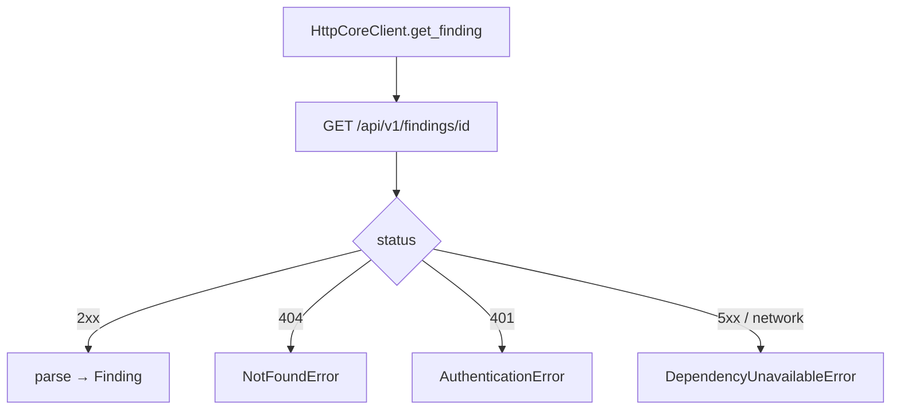

### 3.5 Real-World Analogy
A **universal power adapter**. The appliance (the application) has one plug shape
(the port). At home you use the wall socket (HTTP adapter); on a plane you use the
battery pack (stub). The appliance runs identically; only what's behind the socket
changes.

### 3.6 Example
```python
# tests drive the HTTP adapter with no network:
transport = httpx.MockTransport(lambda req: httpx.Response(200, json=finding_json))
client = HttpCoreClient(base_url="http://core", client=httpx.AsyncClient(transport=transport))
finding = await client.get_finding(auth, "finding-iam-1", bearer_token="tok")
```

### 3.7 Common Mistakes
- **Hard-coding a real `httpx.AsyncClient`.** Inject it, so tests can supply a
  `MockTransport` (offline).
- **Leaking raw HTTP status/exceptions upward.** Map them to domain exceptions at
  the adapter boundary.
- **Skipping the stub.** Without it, local dev and CI would need a live Core.

### 3.8 Key Takeaways
- `StubCoreClient` (seeded, offline default) and `HttpCoreClient` (real REST) both
  satisfy `CoreClient`.
- The HTTP adapter injects its client (testable with `MockTransport`) and maps HTTP
  failures to **domain exceptions**.
- `build_core_client(settings)` chooses; upstream is oblivious.

### 3.9 Self-Assessment
1. Why is the stub the default, and what does it guarantee about tenants?
2. How is the HTTP adapter tested without a network?
3. What does the adapter do with a `500` from the Core?

### 3.10 Connection to Previous Topics
The injectable-client, MockTransport-tested pattern is lifted straight from Phase
2's LLM provider adapters. Mapping to domain exceptions reuses Phase 1's typed
errors and Phase 5's one error-envelope handler.

---

## Chapter 4 — Token Pass-Through and Defense-in-Depth Tenancy

### 4.1 Introduction
When the AI service calls the Core, *whose identity* does it use? The answer —
**the caller's own token, forwarded** — plus a belt-and-braces tenant re-check, is
the security heart of the integration.

### 4.2 Prerequisites
- Chapter 3 (the HTTP adapter). Phase-5 tenant isolation (`assert_same_tenant`).

### 4.3 Detailed Explanation
Two ways a service can authenticate to another service:
- **Ambient service credential:** the AI service holds one powerful "god" token and
  uses it for every Core call. Simple, but it detaches the request from the *user's*
  identity and concentrates a high-value secret.
- **Token pass-through:** the AI service forwards the *caller's own JWT* to the
  Core. The Core then authorizes the request against the same identity that reached
  us. No god credential, and authorization stays coherent across both services.

We choose **pass-through**. A `get_bearer_token` dependency surfaces the raw token
from the request (the same token `get_auth_context` already verified), and the
endpoint hands it to the `CoreClient`.

Then **defense-in-depth**: even though the Core is trusted, the HTTP adapter
re-checks every finding it returns against the caller's tenant with
`assert_same_tenant`. If a Core bug — or a compromise — ever returned another
tenant's finding, we block it (`TenantIsolationError`) rather than pass it through.
Tenant isolation (rule 1) must not depend on a single service getting it right.

```python
finding = Finding.model_validate(response.json())
assert_same_tenant(expected_tenant_id=auth.tenant_id,
                   actual_tenant_id=finding.tenant_id, resource_kind="finding")
```

### 4.4 How It Works
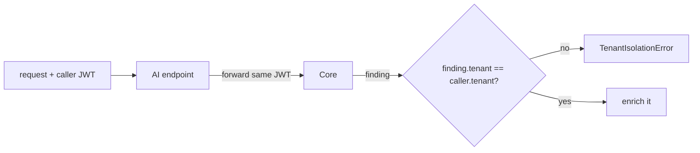

### 4.5 Real-World Analogy
A **concierge running an errand for you**. Instead of carrying a master key to every
shop (a god credential), the concierge takes *your* membership card and uses it at
the shop (pass-through). And back at the desk, they double-check the parcel has
*your* name on it before handing it over (the tenant re-check) — even though the
shop is reputable.

### 4.6 Example
- Caller's token is for `tenant-a`. The AI service forwards it; the Core returns a
  finding. If that finding says `tenant-b` (a bug), `assert_same_tenant` raises and
  the caller gets a `403`, never `tenant-b`'s data.
- In the stub, asking for another tenant's id simply returns `NotFoundError`.

### 4.7 Common Mistakes
- **Using one service credential for all Core calls.** It breaks identity coherence
  and concentrates risk; forward the caller's token instead.
- **Trusting the Core's tenant scoping alone.** Cross-service isolation is too
  important to depend on one side — re-check on receipt.
- **Logging the forwarded token.** It's a live credential; never log it.

### 4.8 Key Takeaways
- **Token pass-through**: forward the caller's JWT to the Core; no ambient god
  credential.
- **Defense-in-depth**: re-verify every returned finding's tenant; a Core bug can't
  leak cross-tenant data through us.
- The stub enforces the same scoping (foreign id → not found).

### 4.9 Self-Assessment
1. What are the two ways to authenticate a service-to-service call, and which did we
   pick?
2. Why re-check the tenant on findings the trusted Core returned?
3. What happens if the Core returns a finding for the wrong tenant?

### 4.10 Connection to Previous Topics
This extends Phase 5's boundary tenant check (rule 1) across a service boundary,
and reuses the exact `assert_same_tenant` policy from Phase 1. Identity propagation
builds on the JWT the Phase-5 verifier already validated.

---

# Part II — Asymmetric Trust (RS256)

---

## Chapter 5 — Symmetric vs. Asymmetric: Why RS256 Beats HS256 in Production

### 5.1 Introduction
Phase 5 verified tokens with HS256 — a *shared secret*. That's fine for dev, wrong
for production. This chapter explains the difference between **symmetric** and
**asymmetric** signatures and why production needs the latter.

### 5.2 Prerequisites
- Phase-5 Chapters 4–6 (JWTs, HS256, HMAC). If you're rusty: a JWT is signed claims;
  the signature is what makes them trustworthy.

### 5.3 Detailed Explanation
**HS256 is symmetric:** the *same* secret both **makes** and **checks** the
signature. That means anyone who can *verify* a token can also *forge* one. In
Phase 5 that was acceptable because the same process (in dev) minted and verified.
But in production the Core mints tokens and *we* verify them — if we shared a
symmetric secret, a leak on *our* side (or in *our* logs) would let an attacker mint
Core tokens. Unacceptable.

**RS256 is asymmetric.** It uses a **key pair**:
- a **private key**, known only to the Core, which **signs**;
- a **public key**, which can only **verify**, and can be shared freely.

The Core keeps its private key secret and hands us the **public** key. We can verify
every token, but — crucially — **we cannot forge one**, because verifying and signing
use *different* keys. A leak of the public key is harmless; it's public by design.

This is the standard for cross-service auth: the *issuer* signs privately; every
*verifier* checks with the public key (often fetched from a **JWKS** — a JSON Web
Key Set endpoint). The public key is commonly expressed as a **JWK**:
`{"n": …, "e": …}` (the two numbers that define an RSA public key — Chapter 6).

### 5.4 How It Works
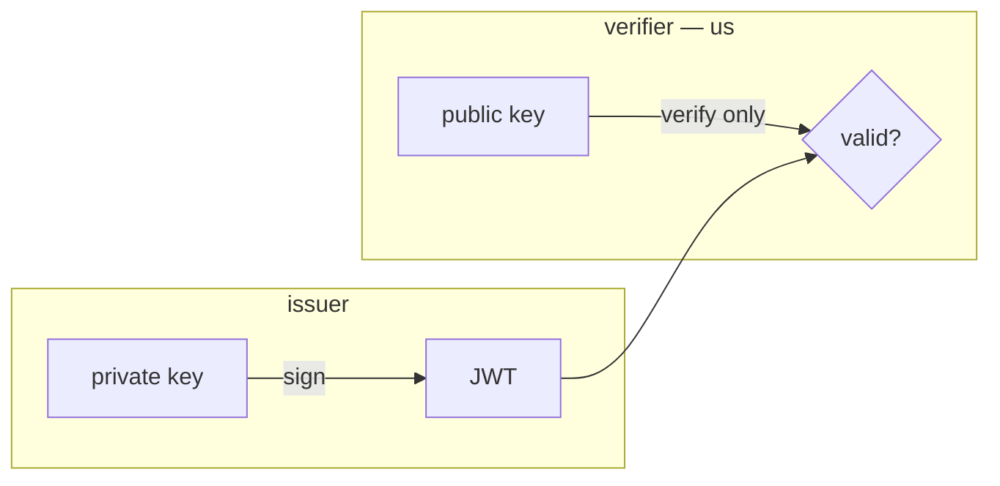

### 5.5 Real-World Analogy
A **wax seal from a signet ring vs. a shared rubber stamp**. HS256 is a rubber stamp
everyone in the office shares — anyone holding it can stamp *or* check, so a stolen
stamp forges documents. RS256 is a signet ring: only the sender owns the ring (signs),
but everyone has a picture of the seal (the public key) to *check* authenticity. You
can verify the seal without being able to make it.

### 5.6 Example
- HS256 (dev): `CIQ_JWT_HS256_SECRET=shared-secret` — mint and verify with the same
  string.
- RS256 (prod): `CIQ_JWT_PUBLIC_KEY={"n":"…","e":"AQAB"}` — the Core's *public* key;
  we verify, we cannot mint.

### 5.7 Common Mistakes
- **Shipping a symmetric secret to production.** A verifier that can also mint is a
  liability across services; use asymmetric keys.
- **Accidentally handing out the private key.** Only the *public* key is shared;
  the private key never leaves the Core.
- **Assuming "signed" means "encrypted."** RS256 signs (authenticity/integrity), it
  does not hide the claims.

### 5.8 Key Takeaways
- **Symmetric (HS256):** one secret signs *and* verifies — verifier can forge.
- **Asymmetric (RS256):** private key signs, public key only verifies — verifier
  **cannot** forge.
- Production uses RS256; the Core keeps the private key and gives us the public JWK.

### 5.9 Self-Assessment
1. Why can an HS256 verifier forge tokens but an RS256 verifier cannot?
2. Which key does the Core give us, and why is sharing it safe?
3. What is a JWK?

### 5.10 Connection to Previous Topics
This directly upgrades Phase 5's HS256 verifier. The `TokenVerifier` port means the
upgrade is a new adapter, not a rewrite — the exact seam Phase 5 built for this
moment (ADR-0009 → ADR-0011).

---

## Chapter 6 — How RSA Verification Actually Works

### 6.1 Introduction
To implement RS256 ourselves we need to understand — gently — what RSA *does*. No
heavy math: just the three numbers and the one operation that make a signature
checkable.

### 6.2 Prerequisites
- Chapter 5. Comfort with "raise a number to a power, modulo another number"
  (we'll explain it).

### 6.3 Detailed Explanation
An RSA public key is two numbers: the **modulus `n`** (a huge number, the product of
two secret primes) and the **public exponent `e`** (usually 65537). The private key
adds a third number `d` that only the Core knows.

The one operation is **modular exponentiation**: `pow(x, k, n)` means "compute `x`
to the power `k`, then take the remainder when divided by `n`." Python's built-in
`pow` does this efficiently even for enormous numbers.

Signing and verifying are inverses:
- The Core **signs** by computing `signature = pow(message_number, d, n)` (private).
- We **verify** by computing `recovered = pow(signature, e, n)` (public).

If the signature is genuine, `recovered` equals the exact number the Core started
from. If anything was tampered with — or the signature was forged without `d` —
`recovered` comes out as garbage. We just check whether `recovered` matches what it
*should* be.

What "it should be" is a specific, standardized encoding of the message's SHA-256
hash, called **EMSA-PKCS1-v1_5**: take the SHA-256 digest, prepend a fixed marker
(the "DigestInfo" prefix identifying SHA-256), and pad it to the key's size with a
run of `0xFF` bytes between markers. We build that expected block ourselves and
compare. (RSA operates on the *hash*, not the whole message — that's why the hash
function is part of "RS256".)

### 6.4 How It Works (verify)
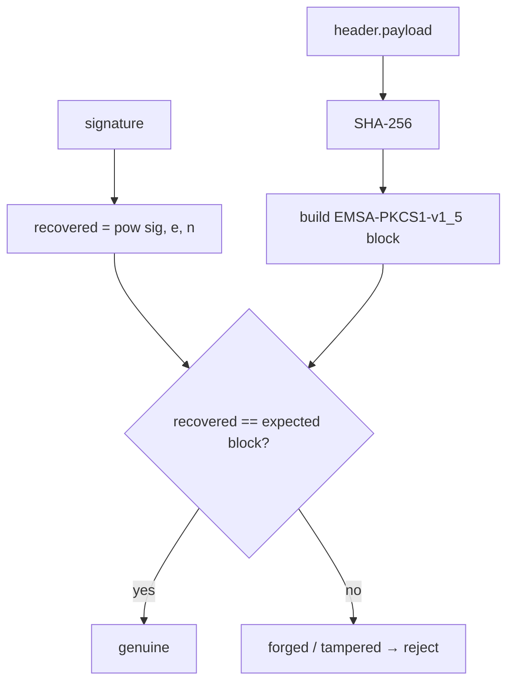

### 6.5 Real-World Analogy
A **tamper-evident hologram**. The manufacturer (Core) presses a hologram only its
machine (private key) can make. You hold it to the light with a known filter (public
key) and see whether the expected pattern appears. You can *check* the pattern
without being able to *press* one — and any tampering scrambles it.

### 6.6 Example
- Genuine token: `pow(signature, 65537, n)` reproduces exactly the padded SHA-256
  block of `header.payload` → accept.
- Attacker flips one character in the payload but keeps the old signature: the
  recomputed SHA-256 differs, the expected block differs, the comparison fails →
  reject.

### 6.7 Common Mistakes
- **Thinking RSA signs the whole message.** It signs a *hash* wrapped in a padded
  block; the hash function (SHA-256) is integral.
- **Skipping the padding check.** "Recovered equals the raw hash" is not enough; the
  full EMSA block (markers + `0xFF` padding) must match — that's what the standard
  requires.
- **Forgetting the modulus range.** A signature integer must be `< n`; a larger one
  is invalid.

### 6.8 Key Takeaways
- An RSA public key is `(n, e)`; verification is one modular exponentiation
  `pow(sig, e, n)`.
- Genuine signatures recover the **EMSA-PKCS1-v1_5** encoding of the message's
  SHA-256 hash; forgeries don't.
- You can verify with the public key but never sign — signing needs the private `d`.

### 6.9 Self-Assessment
1. What two numbers make an RSA public key, and what is `pow(sig, e, n)` for?
2. Why does RSA operate on a hash rather than the whole message?
3. What must "recovered" equal for a signature to be accepted?

### 6.10 Connection to Previous Topics
This is the asymmetric analogue of Phase 5's HMAC step. The surrounding claim checks
(exp/iss/aud) are unchanged — only *how the signature is verified* differs, which is
exactly what the shared base class isolates (Chapter 8).

---

## Chapter 7 — Implementing RS256 with Nothing but Integers

### 7.1 Introduction
The environment's compiled crypto library is unavailable — so we implemented RS256
verification with the **standard library only**. This chapter walks the actual code
and why doing it by hand here is safe and testable.

### 7.2 Prerequisites
- Chapter 6 (the RSA verify operation and EMSA-PKCS1-v1_5).

### 7.3 Detailed Explanation
`RS256TokenVerifier` takes the public key as a **JWK** (`{"n":…, "e":…}`), decodes
the base64url `n` and `e` into Python integers, and implements one method —
`_verify_signature` — because everything else (claims) is shared (Chapter 8):

```python
def _verify_signature(self, signing_input, signature_b64):
    signature = b64url_decode(signature_b64)
    s = int.from_bytes(signature, "big")
    if s >= self._n:                       # signature must be in range
        raise AuthenticationError("token signature out of range")
    m = pow(s, self._e, self._n)           # RSA verify: s^e mod n
    recovered = m.to_bytes(self._key_bytes, "big")
    expected = self._emsa_pkcs1_v15(signing_input.encode("ascii"))
    if not hmac.compare_digest(recovered, expected):   # constant-time
        raise AuthenticationError("token signature verification failed")
```

`_emsa_pkcs1_v15` builds the expected block: `0x00 0x01 || 0xFF…FF || 0x00 || T`,
where `T` is the fixed SHA-256 DigestInfo prefix followed by the digest, padded to
the key length.

**Is hand-rolling crypto safe?** Two things make it defensible here:
1. We only implement **verification with a public key** — not signing, not key
   generation, not secret handling. It's a short, well-specified computation.
2. It's **thoroughly tested and swappable.** The tests mint RS256 tokens with a
   small keypair (a pure-Python signer) and assert the happy path *and* forgery,
   expiry, wrong-issuer, and algorithm-pinning rejections. And because it sits
   behind the `TokenVerifier` port, a production build can drop in a library-backed
   verifier with zero caller changes.

The comparison uses `hmac.compare_digest` (constant time), and — as always — errors
never leak the token or key.

### 7.4 How It Works (JWK → verifier)
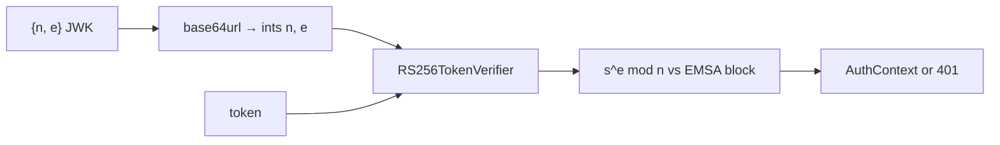

### 7.5 Real-World Analogy
**Verifying a banknote's watermark with a UV light you built from a kit.** You're
not *printing* money (signing) — just *checking* a note against a known pattern. A
simple, auditable checker is perfectly legitimate for verification, especially when
you can test it against known-good and known-forged notes.

### 7.6 Example
```python
verifier = RS256TokenVerifier(public_key_jwk='{"n":"…","e":"AQAB"}',
                              issuer="complianceiq-core", audience="complianceiq", clock=clock)
auth = verifier.verify(token)   # AuthContext on success; AuthenticationError on any failure
```

### 7.7 Common Mistakes
- **Rolling your own *signing* or key generation.** That's the dangerous part; we
  deliberately don't. Verification-only with a public key is the safe subset.
- **Using `==` to compare the block.** Use a constant-time compare to avoid timing
  leaks.
- **Not pinning the algorithm.** Without the `RS256` pin, an attacker could try the
  `none` or HS-confusion tricks (handled by the shared base — Chapter 8).

### 7.8 Key Takeaways
- RS256 verification is `pow(s, e, n)` compared to the EMSA-PKCS1-v1_5 block —
  implementable with stdlib integers.
- Safe here because it's **verification-only**, **tested** (incl. forgeries), and
  **swappable** behind the port.
- Constant-time compare; no secret/token in errors.

### 7.9 Self-Assessment
1. Which single method does `RS256TokenVerifier` implement, and why only one?
2. Why is hand-rolled *verification* defensible when hand-rolled *signing* would not
   be?
3. How could a production build replace this without touching callers?

### 7.10 Connection to Previous Topics
The JWK-decoding and constant-time-compare mirror Phase 5's HS256 care. The
"swappable behind the port" argument is the same one that let Phase 5 defer RS256 in
the first place — now paid off.

---

## Chapter 8 — One Pipeline, Two Signatures: The Shared Base

### 8.1 Introduction
HS256 and RS256 differ in *one* step (the signature) and agree on everything else.
Phase 6 refactors them to **share a single claim-validation pipeline**, so the
security-critical parts can never drift. A short but important chapter.

### 8.2 Prerequisites
- Chapters 5–7. Phase-5's HS256 verifier.

### 8.3 Detailed Explanation
`BaseJwtVerifier` (in `jwt_base.py`) owns the whole `verify` flow **except** the
signature check:

```
verify(token):
  split → check_algorithm (pinned) → _verify_signature (abstract)
        → decode_claims → check exp/nbf → check iss/aud → to AuthContext
```

`HS256TokenVerifier` and `RS256TokenVerifier` subclass it and implement only
`_verify_signature` (HMAC vs. RSA) and set `expected_algorithm` (`"HS256"` vs
`"RS256"`). Everything security-relevant about *claims* — the algorithm pin, expiry,
issuer/audience, tenant projection — lives once, in the base, and is exercised by
the HS256 tests. This is the DRY principle applied where it matters most: two
verifiers cannot disagree about what a valid token's claims must look like, because
there is only one copy of that logic.

The **algorithm pin** deserves a callout: `check_algorithm` rejects any token whose
header `alg` isn't the verifier's `expected_algorithm`. That single check, shared by
both, defeats the `none`-downgrade and the RS↔HS confusion attack for *both*
schemes.

### 8.4 How It Works
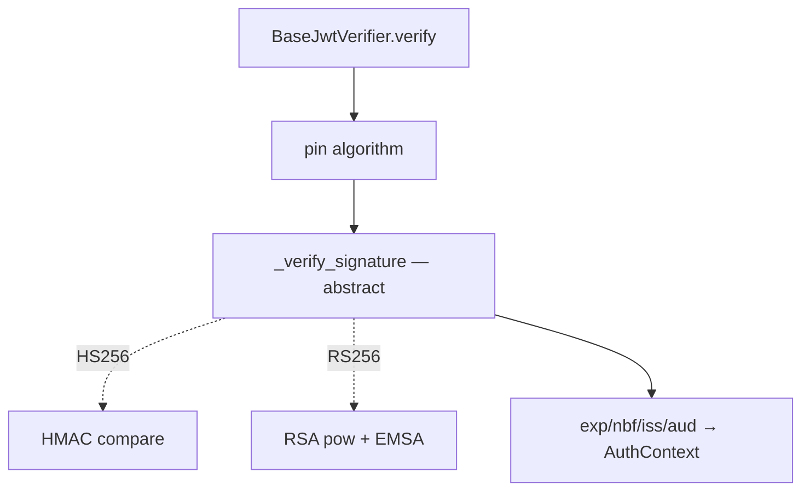

### 8.5 Real-World Analogy
An **assembly line with one swappable station**. Every product goes down the same
line — inspection, labeling, packing (the claim checks). Only one station changes
per product variant: the sealing machine (HMAC vs. RSA). You don't rebuild the whole
line per variant, and quality control is identical for all.

### 8.6 Example
```python
class RS256TokenVerifier(BaseJwtVerifier):
    expected_algorithm = "RS256"
    def _verify_signature(self, signing_input, signature_b64): ...  # only this differs
```

### 8.7 Common Mistakes
- **Copy-pasting the claim checks into each verifier.** They'd drift; share them in
  the base.
- **Letting the algorithm pin live in only one subclass.** It belongs in the shared
  path so *both* schemes are protected.
- **Over-abstracting.** Only the signature step varies — keep the hook that small.

### 8.8 Key Takeaways
- `BaseJwtVerifier` holds the full pipeline; subclasses override **only**
  `_verify_signature` and `expected_algorithm`.
- Claim validation and the **algorithm pin** live once — no drift between schemes.
- Adding a future scheme (ES256) is one more small subclass.

### 8.9 Self-Assessment
1. What is the *only* thing that differs between the HS256 and RS256 verifiers?
2. Why put the algorithm pin in the base class, not the subclasses?
3. How much code would an ES256 verifier add?

### 8.10 Connection to Previous Topics
This is a refactor of Phase 5's HS256 verifier to make room for RS256 cleanly —
the Open/Closed Principle from Phase 1: open to new schemes (subclasses), closed to
changes in the shared, tested pipeline.

---

# Part III — Storing at Scale (pgvector)

---

## Chapter 9 — From a Dictionary to a Database: Why pgvector

### 9.1 Introduction
The third edge: storage. The knowledge base has lived in a Python dictionary since
Phase 3 — great for tests, useless across restarts or at scale. Production uses
**PostgreSQL + pgvector**. This chapter explains why and what pgvector is.

### 9.2 Prerequisites
- Phase-3's `VectorStore` port (`upsert`, `search`, `delete_by_corpus_version`,
  `count`) and the idea of vector similarity search.

### 9.3 Detailed Explanation
The in-memory store keeps embedded chunks in a dict and computes cosine similarity
in Python. Its limits are obvious: everything is **lost on restart**, it doesn't
**share** across multiple service instances, and scanning every vector in Python
doesn't **scale** to large corpora.

A **database** fixes durability and sharing. But a normal database can't efficiently
answer "find the vectors *closest* to this one." **pgvector** is a PostgreSQL
**extension** that adds a `vector` column type and distance operators (`<=>` for
cosine distance), plus **approximate-nearest-neighbour indexes** (ivfflat/HNSW) so
similarity search stays fast on millions of rows. It turns Postgres into a vector
database while keeping ordinary SQL, transactions, and backups.

Because retrieval already depends on the `VectorStore` *port*, swapping the dict for
pgvector is — once again — an adapter plus a setting. Everything above (the hybrid
retriever, the agents, the API) is untouched. This is the exact promise ADR-0005
made back in Phase 3.

### 9.4 How It Works
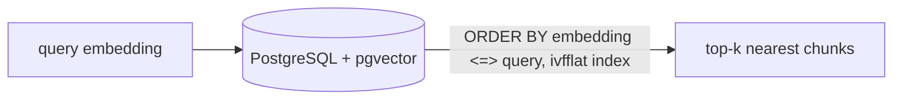

### 9.5 Real-World Analogy
A **library card catalogue vs. a shoebox of index cards**. The shoebox (in-memory
dict) works until you have thousands of cards or the room floods (restart). A proper
catalogue with an indexing system (pgvector) survives, is shared by every librarian
(instance), and finds the nearest match fast.

### 9.6 Example
- Dev: `vector_store=memory` — the dict, no database.
- Prod: `vector_store=pgvector` — the `knowledge_chunks` table with a `vector(1536)`
  column and an ivfflat cosine index (from the migration).

### 9.7 Common Mistakes
- **Treating the in-memory store as production-ready.** It doesn't persist, share,
  or scale — it's the offline default, nothing more.
- **Expecting exact nearest-neighbour at scale.** ANN indexes (ivfflat) trade a
  little accuracy for big speed; tune `lists` to the row count.
- **Assuming the swap needs code changes.** It's an adapter behind the existing
  port.

### 9.8 Key Takeaways
- In-memory storage doesn't persist, share, or scale — fine for tests only.
- **pgvector** adds vector columns, distance operators (`<=>`), and ANN indexes to
  PostgreSQL.
- Swapping in pgvector is an adapter + a setting; retrieval logic is unchanged
  (ADR-0005 delivered).

### 9.9 Self-Assessment
1. Three limits of the in-memory store?
2. What does the pgvector extension add to PostgreSQL?
3. Why is switching to pgvector not a code change for the retriever?

### 9.10 Connection to Previous Topics
The `VectorStore` port and the embedding-model guard are Phase 3's; the ivfflat
index serves the same hybrid retrieval pipeline. Phase 3 built the seam explicitly
"so pgvector swaps in" — Phase 6 is that swap.

---

## Chapter 10 — The Executor Seam, and Testing a Database Adapter Without a Database

### 10.1 Introduction
Here's a puzzle: how do you build and *test* a PostgreSQL adapter when there's no
PostgreSQL — and no database driver even installed? The answer is a small **executor
seam**. This chapter is about testing at a boundary you can't cross.

### 10.2 Prerequisites
- Chapter 9. The idea of a Protocol/interface (Phase 5's `Container`).

### 10.3 Detailed Explanation
If `PgVectorStore` called a database driver directly, you couldn't import it (no
driver) or test it (no database). So we insert one more tiny seam: a `SqlExecutor`
protocol with three methods —

```python
class SqlExecutor(Protocol):
    async def execute(self, sql, params=()) -> int: ...          # writes, returns rowcount
    async def fetch_all(self, sql, params=()) -> list[tuple]: ... # queries → rows
    async def fetch_val(self, sql, params=()) -> Any: ...         # single scalar
```

`PgVectorStore` depends only on this protocol; it builds SQL strings and parameters
and calls the executor. Two implementations:
- **`PsycopgExecutor`** — the real one, wrapping a psycopg async connection pool. The
  driver is imported **lazily**, inside the build function, so the module (and the
  whole app) import fine with no driver present. It only runs when
  `vector_store=pgvector`.
- **A fake executor in tests** — records the SQL/params it's asked to run and returns
  programmed rows. This lets us assert the adapter builds the *right* SQL and maps
  rows correctly, with no database.

What *can* we test this way? SQL construction (does `search` order by `<=>` and
apply the metadata filter?), parameter binding, row → domain-object mapping, and the
embedding-model guard. What *can't* we? The actual similarity ranking — that's
pgvector's job, exercised in a real deployment. We're honest about that line
(ADR-0011): the seam tests the adapter's logic; the database tests the database.

### 10.4 How It Works
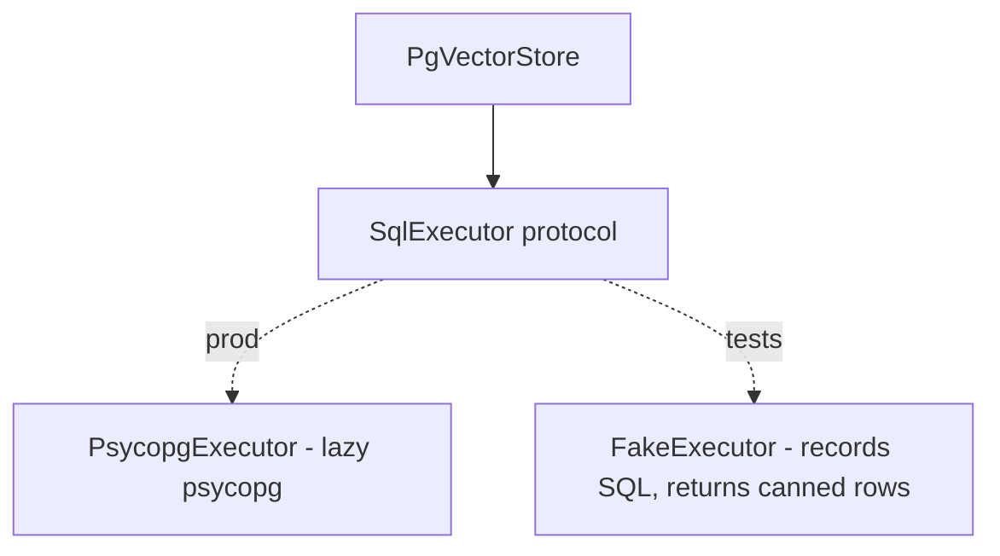

### 10.5 Real-World Analogy
**Testing a car's dashboard wiring with a bench harness.** You don't need a running
engine to confirm the wires carry the right signals to the right gauges — you plug
into a test harness that simulates the sensors. The engine (the database) is tested
separately; the wiring (the adapter) is tested on the bench.

### 10.6 Example
```python
class FakeExecutor:
    def __init__(self, *, rows=None, stored_model=None): self.calls=[]; ...
    async def fetch_all(self, sql, params=()): self.calls.append((sql, list(params))); return self._rows
# test: assert "ORDER BY embedding <=>" in the recorded search SQL; assert rows map to ScoredChunks
```

### 10.7 Common Mistakes
- **Importing the driver at module top.** It must be lazy, or the app can't start
  without psycopg — even when using the in-memory store.
- **Claiming the seam tests similarity.** It doesn't; ranking is the DB's job. Say so.
- **Over-faking.** Don't reimplement SQL in the fake; just record calls and return
  canned results.

### 10.8 Key Takeaways
- A `SqlExecutor` protocol lets `PgVectorStore` be imported and tested with **no
  driver and no database**.
- The real psycopg executor is **lazily imported**, only when pgvector is selected.
- The seam tests SQL/mapping/guard; the **database** tests ranking (documented
  honestly).

### 10.9 Self-Assessment
1. Why does `PgVectorStore` talk to a `SqlExecutor` instead of psycopg directly?
2. Why must the psycopg import be lazy?
3. What does the seam let you test, and what does it not?

### 10.10 Connection to Previous Topics
Same "depend on a small protocol" trick as Phase 5's `Container` and Phase 2's
injectable httpx client — applied so a database adapter is testable without a
database. Ports all the way down.

---

## Chapter 11 — The pgvector Store: SQL, Ranking, and the Model Guard

### 11.1 Introduction
Now the adapter itself: how each `VectorStore` method becomes SQL, how similarity
ranking is expressed, and how the embedding-model guard survives the move to a
database.

### 11.2 Prerequisites
- Chapters 9–10. Phase-3's `EmbeddedChunk`/`ScoredChunk` and the model guard.

### 11.3 Detailed Explanation
`PgVectorStore` maps the port to SQL over the `knowledge_chunks` table:

- **`upsert`** — `INSERT … ON CONFLICT (id) DO UPDATE …`, so re-ingesting the same
  chunk id replaces it (idempotent, matching the in-memory store). The vector is
  rendered as a pgvector literal `[0.1,0.2,…]` by `to_pgvector_literal`.
- **`search`** — the interesting one:
  ```sql
  SELECT <columns>, 1 - (embedding <=> $1::vector) AS score
  FROM knowledge_chunks <WHERE metadata filters>
  ORDER BY embedding <=> $1::vector ASC LIMIT $k
  ```
  `<=>` is pgvector's cosine **distance** (0 = identical), so `1 - distance` is the
  cosine **similarity** score, and `ORDER BY … ASC` puts the nearest first. Metadata
  filters (framework, control_id, language, jurisdiction, corpus_version) are pushed
  into the `WHERE` as bound parameters, so irrelevant chunks are never ranked.
- **`delete_by_corpus_version`** and **`count`** — a `DELETE … WHERE` and a
  `SELECT COUNT(*)`.

Rows come back as tuples in a fixed column order and are mapped back into domain
`ScoredChunk`s by `_row_to_scored_chunk`.

**The embedding-model guard** (ADR-0005) survives the move: on `upsert` we reject a
batch that mixes models, or that differs from what's already stored; on `search` we
reject a query whose model differs from the stored corpus. It's implemented by
reading one stored `embedding_model` and comparing — the same invariant the
in-memory store enforced, now over SQL.

### 11.4 How It Works (search)
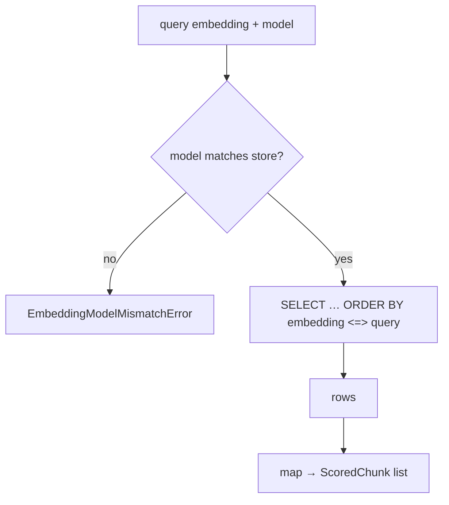

### 11.5 Real-World Analogy
A **translator between two languages that mean the same thing**. The port speaks
"upsert / search / delete" (domain); pgvector speaks SQL with a `<=>` operator. The
adapter translates faithfully in both directions — and refuses to compare notes
written in two different alphabets (the model guard).

### 11.6 Example
```python
# score = 1 - cosine_distance; nearest first
"SELECT id, …, 1 - (embedding <=> $1::vector) AS score FROM knowledge_chunks "
"WHERE framework = $2 ORDER BY embedding <=> $1::vector ASC LIMIT $3"
```

### 11.7 Common Mistakes
- **Confusing distance and similarity.** `<=>` is distance (smaller = closer); the
  score is `1 - distance`, ordered ascending by distance.
- **Interpolating the vector into the SQL string unsafely.** Bind values as
  parameters; the vector goes as a typed `$1::vector` literal parameter.
- **Dropping the model guard.** The database doesn't enforce it — the adapter must,
  exactly as the in-memory store did.

### 11.8 Key Takeaways
- Each `VectorStore` method maps to SQL; `search` uses `ORDER BY embedding <=>
  query` with `1 - distance` as the score.
- Metadata filters are pushed into `WHERE` as bound params; rows map back to
  `ScoredChunk`.
- The **embedding-model guard** is re-enforced in the adapter, preserving ADR-0005's
  invariant.

### 11.9 Self-Assessment
1. What does `<=>` compute, and how do we turn it into a similarity score?
2. How does `upsert` stay idempotent?
3. Where does the embedding-model guard live now, and why not in the database?

### 11.10 Connection to Previous Topics
This fulfills ADR-0005 (Phase 3): the pgvector store the port was designed for.
The idempotent upsert echoes Phase 3's content-addressed chunk ids; the guard is the
same anti-mismatch invariant, unchanged in meaning.

---

# Part IV — Assembly & Beyond

---

## Chapter 12 — Configuration-Driven Wiring, Honest Limits, and Preparing for Phase 7

### 12.1 Introduction
The closing chapter shows how the composition root selects among all these
implementations from settings, states the phase's honest limitations, and looks
ahead to Phase 7.

### 12.2 Prerequisites
- All previous chapters.

### 12.3 Detailed Explanation
The composition root now makes three configuration-driven choices, each behind a
port:

- **Token verifier:** if `jwt_public_key` holds a public **JWK**, build the RS256
  verifier; otherwise HS256 (`looks_like_jwk` decides). Automatic — no separate flag.
- **Core client:** `core_client=stub|http` → `build_core_client`.
- **Vector store:** `vector_store=memory|pgvector` → `_build_vector_store` (the
  latter lazily wiring psycopg).

Default settings keep everything **offline**: HS256, stub, in-memory. Flip three
settings for production: RS256 (via the JWK), http, pgvector.

**Honest limits (documented in ADR-0011).** Two things can't be fully exercised in
this offline environment, and the guide says so plainly:
1. The RS256 verifier is a **from-scratch** implementation (auditable, tested with a
   real keypair against forgeries — but a production build may prefer a library-backed
   verifier behind the same port).
2. The pgvector **similarity ranking** runs in a real Postgres, not the offline test
   suite; the suite tests the adapter's SQL, mapping, and guard.

Stating limits precisely is part of engineering integrity — you ship what you can
verify and you say what you couldn't.

### 12.4 How It Works (the selectors)
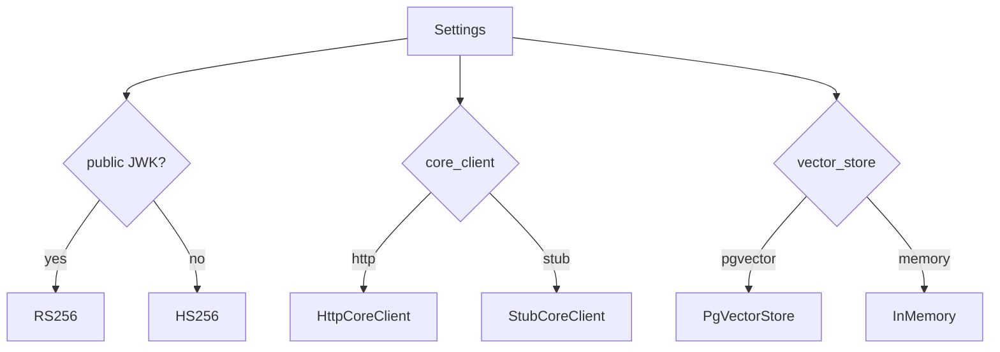

### 12.5 Real-World Analogy
A **single breaker panel** for the building. Three switches — power source, phone
line, water main — each flip between "utility" (production) and "generator/tank"
(offline). One panel, clearly labeled; the building's wiring behind them never
changes.

### 12.6 Example
```bash
# production
CIQ_JWT_PUBLIC_KEY='{"n":"…","e":"AQAB"}'   # → RS256
CIQ_CORE_CLIENT=http
CIQ_VECTOR_STORE=pgvector                    # apply migrations/0001 first
```

### 12.7 Common Mistakes
- **A separate flag for RS256 vs HS256.** Presence of a public JWK is the signal —
  fewer knobs, fewer mistakes.
- **Shipping the offline defaults to production.** HS256 + stub + in-memory are dev
  defaults; production must set all three.
- **Hiding the limitations.** Document what the offline suite can't test; don't imply
  otherwise.

### 12.8 Key Takeaways
- The composition root selects verifier / core client / vector store from settings,
  each behind a port.
- Defaults are offline; three settings flip to production.
- The phase's two honest limits (from-scratch RS256, DB-side ranking) are documented,
  not glossed.

### 12.9 Self-Assessment
1. What decides RS256 vs HS256 at startup?
2. Which three settings switch the whole service from offline to production?
3. Name the two limitations Phase 6 documents and why stating them matters.

### 12.10 Connection to Previous Topics — and What's Next
Phase 6 completes the "productionization" arc: the service can now fetch
authoritative findings, verify real asymmetric tokens, and persist knowledge at
scale — all behind the ports built in Phases 1–5. **Phase 7** returns to *AI
capability*: the remaining intelligence the master prompt calls for — multi-framework
**control mapping** (`/ai/map`) and **financial risk** quantification in MAD
(`/ai/financial`) — implemented as new domain contracts, graphs/agents, and
endpoints, riding on everything built so far.

---

## Appendix A — Glossary

- **Service-to-service call** — one backend acting as a client of another over HTTP.
- **CoreClient** — the port for fetching authoritative findings from the Core.
- **Stub / adapter** — the offline seeded client vs. the real HTTP client.
- **Token pass-through** — forwarding the caller's own JWT to a downstream service.
- **Defense-in-depth** — re-checking an invariant (tenant) even when a trusted source
  should already guarantee it.
- **Symmetric (HS256)** — one shared secret both signs and verifies.
- **Asymmetric (RS256)** — private key signs, public key only verifies.
- **RSA** — the public-key algorithm; a public key is `(n, e)`; verify is
  `pow(sig, e, n)`.
- **JWK / JWKS** — a JSON representation of a key `{"n":…, "e":…}` / a set of them at
  an endpoint.
- **EMSA-PKCS1-v1_5** — the standard padding of a hash that RSA signatures encode.
- **Algorithm pinning** — accepting exactly one `alg`, defeating `none`/confusion
  attacks.
- **PostgreSQL** — a relational database; **pgvector** — its vector-search extension.
- **`<=>`** — pgvector's cosine distance operator (smaller = closer).
- **ivfflat / ANN** — an approximate-nearest-neighbour index for fast vector search.
- **SqlExecutor** — the tiny async DB seam that makes the pgvector adapter testable.
- **psycopg** — the PostgreSQL driver (optional; only for `vector_store=pgvector`).
- **Embedding-model guard** — refusing to compare vectors from different models.

## Appendix B — The three swaps at a glance

| Edge | Port | Dev default | Production | Selector |
| --- | --- | --- | --- | --- |
| Findings source | `CoreClient` | `StubCoreClient` | `HttpCoreClient` | `CIQ_CORE_CLIENT` |
| Token verification | `TokenVerifier` | HS256 (secret) | RS256 (public JWK) | presence of `CIQ_JWT_PUBLIC_KEY` |
| Knowledge storage | `VectorStore` | in-memory | pgvector | `CIQ_VECTOR_STORE` |

## Appendix C — Self-Assessment Answer Key (brief)

- **Ch. 4:** ambient god credential vs. token pass-through (we forward the caller's
  JWT); re-check the tenant because cross-service isolation must not depend on one
  side; a wrong-tenant finding raises `TenantIsolationError` (403), never leaks.
- **Ch. 5:** HS256's one secret can both sign and verify, so a verifier can forge;
  RS256 splits them, so the public key verifies but can't sign; the Core gives us the
  public key, safe to share; a JWK is a JSON-encoded key.
- **Ch. 7:** it implements only `_verify_signature`; verification-only with a public
  key is a small, safe subset (no signing/keygen/secrets); a production build swaps a
  library-backed verifier behind the `TokenVerifier` port.
- **Ch. 11:** `<=>` is cosine distance, similarity = `1 - distance`, ordered ascending;
  `upsert` uses `INSERT … ON CONFLICT DO UPDATE`; the model guard lives in the adapter
  because the database won't enforce it.

---

*End of Phase 6 Study Guide. You now understand — from first principles — how
ComplianceIQ talks to the Core Service safely, verifies production RSA-signed tokens
it could never forge, and persists its knowledge base in PostgreSQL + pgvector, every
one of them a configuration-driven swap behind a port built in an earlier phase.
Phase 7 returns to new AI capability: control mapping and financial risk.*
