<!--
  PHASE 7 STUDY GUIDE — ComplianceIQ AI Service
  A complete, beginner-first textbook for the Control-Mapping & Financial-Risk phase.
-->

# Phase 7 Study Guide — Mapping Controls, and Pricing Risk Without Guessing

> **Who this is for:** a motivated beginner. You do **not** need to have mastered
> Phases 1–6. You do **not** need to know what a control framework, a cross-framework
> mapping, or a financial-risk estimate is. We build every idea from the ground up.
>
> **How to read it:** straight through the first time. Each chapter follows the
> same rhythm — *Introduction → Prerequisites → Detailed Explanation → How It
> Works → Analogy → Example → Common Mistakes → Key Takeaways → Self-Assessment →
> Connection to Previous Topics* — so you always know where you are.
>
> **The promise:** by the end you will understand, from first principles, how we map
> a finding's control to its **equivalents in other frameworks** without inventing a
> single cross-reference, and how we put a **money figure** on a risk in a way an
> auditor can trust — because the number is *computed*, never *guessed*. Well enough
> to defend it to a senior engineer or a jury.

---

## What Phase 7 adds (a map to keep open)

```text
src/complianceiq/
├── domain/
│   ├── entities/mapping.py               ← ControlMapping, MappedControl
│   ├── entities/financial.py             ← FinancialRiskAssessment (from Phase 1)
│   └── policies/financial_model.py       ← estimate_exposure (deterministic MAD band)
├── application/
│   ├── graphs/mapping.py                 ← MappingGraph (retrieve → map | abstain)
│   ├── graphs/financial.py               ← FinancialGraph (estimate → narrate)
│   └── agents/
│       ├── control_mapper.py             ← ControlMapperAgent.map(finding)
│       └── financial_analyst.py          ← FinancialAnalystAgent.assess(finding)
├── prompts/control_mapping.prompt        ← grounded cross-framework mapping
├── prompts/financial_rationale.prompt    ← narrate a pre-computed range only
├── presentation/routers/ai.py            ← + POST /ai/map, POST /ai/financial
└── composition.py                        ← wires the two graphs + agents
```

## Table of Contents

**Part I — Control Mapping**
1. [What Phase 7 Is, and the Two Hardest Trust Problems](#chapter-1--what-phase-7-is-and-the-two-hardest-trust-problems)
2. [Frameworks, Controls, and Why Mapping Matters](#chapter-2--frameworks-controls-and-why-mapping-matters)
3. [The ControlMapping Contract](#chapter-3--the-controlmapping-contract)
4. [The Mapping Graph: Grounded Equivalence](#chapter-4--the-mapping-graph-grounded-equivalence)
5. [The Cross-Framework Filter: Only Verified, Only Other](#chapter-5--the-cross-framework-filter-only-verified-only-other)

**Part II — Pricing Risk**
6. [Why a Model Must Never Invent a Number](#chapter-6--why-a-model-must-never-invent-a-number)
7. [The Deterministic Financial Model](#chapter-7--the-deterministic-financial-model)
8. [Ranges, Not Points; Assumptions, Not Black Boxes](#chapter-8--ranges-not-points-assumptions-not-black-boxes)
9. [The Financial Graph: Compute, Then Narrate](#chapter-9--the-financial-graph-compute-then-narrate)

**Part III — Exposure & Assembly**
10. [Two More Agents, Two More Endpoints](#chapter-10--two-more-agents-two-more-endpoints)
11. [Wiring, the Complete Capability Set, and Preparing for Phase 8](#chapter-11--wiring-the-complete-capability-set-and-preparing-for-phase-8)

---

# Part I — Control Mapping

---

## Chapter 1 — What Phase 7 Is, and the Two Hardest Trust Problems

### 1.1 Introduction
By Phase 6 the platform could explain, answer, remediate, correlate, and report on
findings — and do it over a real API with real auth and storage. Phase 7 adds the
**last two capabilities** the build spec calls for: **control mapping** and
**financial risk**. Each is a small feature that hides a *big* trust problem, and
this chapter frames both.

### 1.2 Prerequisites
- The Phase-4 idea of a **grounded** capability (cite, verify, abstain).
- The Phase-4 idea that some facts (like report counts) are **computed in code**,
  not produced by the model.

### 1.3 Detailed Explanation
The two new capabilities are:
- **Control mapping** (`/ai/map`): given a finding raised against one control (say
  NIST CSF ``PR.AA-01``), produce the **equivalent controls in other frameworks**
  (ISO 27001, SOC 2, Loi 05-20 …). An auditor running a multi-framework programme
  needs this map.
- **Financial risk** (`/ai/financial`): given a finding, produce an estimate of its
  **monetary exposure** in Moroccan Dirham (MAD).

Both are easy to build *badly* — just ask a language model — and each way of doing
it badly is a different, disqualifying failure:
1. **Mapping** invites **hallucination**: a model will cheerfully claim "PR.AA-01 ≈
   ISO A.9.99.9" for a control that doesn't exist. In compliance, one invented
   cross-reference discredits the whole system.
2. **Financial** invites the **unverifiable number**: a model can emit "≈ 3.2M MAD"
   with total confidence and zero basis. An auditor cannot check it, so it's worthless
   — worse, dangerous.

Phase 7's whole story is **how we avoid both**. Mapping reuses the grounding
discipline (only retrieved, verified controls become mappings — Part I). Financial
computes the number in **pure code** and lets the model only *narrate* it (Part II).
Same lesson, two shapes: **never let the model be the source of truth for a
checkable claim.**

### 1.4 How It Works (two capabilities, two guards)
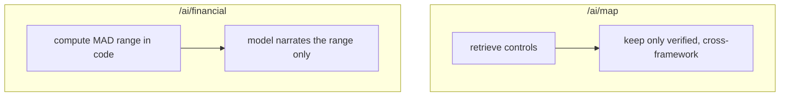

### 1.5 Real-World Analogy
A **translator** and an **appraiser**. The translator (mapping) must only use words
that exist in the target dictionary — inventing a foreign word is malpractice. The
appraiser (financial) must base a valuation on a documented method, not a hunch you
can't audit. Both professions are defined by *what they refuse to make up*.

### 1.6 Example
- *Map:* NIST ``PR.AA-01`` → (from the corpus, verified) ISO ``A.8.24``, SOC 2
  ``CC6.1`` — never an invented id.
- *Financial:* a HIGH-severity storage finding → a computed range like
  ``195,000–975,000 MAD``, with the multiplier and assumptions attached.

### 1.7 Common Mistakes
- **"Just ask the model to map/price it."** Both produce confident, unverifiable
  output — exactly what a compliance product must not ship.
- **Treating mapping and pricing as unrelated.** They're the same trust problem in
  two costumes: don't let the model invent a checkable fact.
- **Skipping abstention/zero cases.** "No equivalent found" and "no exposure" are
  correct, first-class outputs.

### 1.8 Key Takeaways
- Phase 7 adds **control mapping** and **financial risk** — the last two capabilities.
- Each has a disqualifying naive failure: **hallucinated mappings** and
  **unverifiable numbers**.
- The fix is the same principle twice: **the model never authors a checkable fact**
  — it's grounded (mapping) or computed (financial).

### 1.9 Self-Assessment
1. What are the two capabilities Phase 7 adds?
2. What is the specific naive failure of each, and why is it disqualifying?
3. State the single principle both solutions share.

### 1.10 Connection to Previous Topics
Mapping reuses Phase 4's grounding (cite/verify/abstain); financial reuses Phase 4's
"facts in code, prose from the model" split (the report graph). Phase 7 is those two
disciplines applied to two new, high-stakes outputs.

---

## Chapter 2 — Frameworks, Controls, and Why Mapping Matters

### 2.1 Introduction
Before mapping, understand what's being mapped. This chapter explains **compliance
frameworks** and **controls** from zero, and why organisations desperately need to
translate between them.

### 2.2 Prerequisites
- The Phase-1 `Finding` (it carries a `framework` and a `control_id`).

### 2.3 Detailed Explanation
A **compliance framework** is a published checklist of security expectations —
NIST CSF, ISO 27001, SOC 2, and Morocco's Loi 05-20 and DNSSI are the ones in our
corpus. Each framework is broken into **controls**: individual, identified
requirements. NIST CSF has ``PR.AA-01`` ("identity and credential management"); ISO
27001 has ``A.8.24``; SOC 2 has ``CC6.1``. Different frameworks, overlapping intent:
several of them independently say "manage your credentials properly."

Here's the organisational pain. A company is often held to **multiple** frameworks at
once (a SOC 2 audit *and* an ISO certification *and* a Moroccan legal obligation). A
single misconfiguration — an un-rotated IAM key — violates the *equivalent* control
in each. Without a **mapping**, the compliance team manually cross-references
thousands of controls across frameworks by hand: slow, error-prone, and exactly the
kind of tedious expert work AI should accelerate.

So **control mapping** answers: "this finding breaks NIST ``PR.AA-01`` — which
controls does it also break in the *other* frameworks I care about?" Done right, it
turns one finding into a multi-framework compliance picture.

### 2.4 How It Works
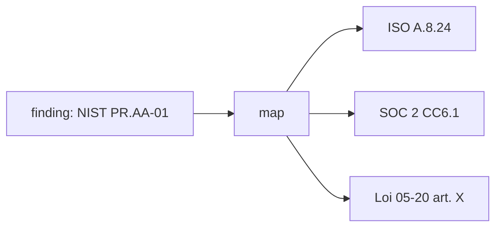

### 2.5 Real-World Analogy
**Electrical plug adapters between countries.** The *need* (power a laptop) is the
same everywhere, but each country has its own socket standard (framework) with its
own shape (control). A traveller needs an adapter that says "the UK Type-G socket is
equivalent to the EU Type-C for your purpose." Control mapping is that adapter chart
for compliance.

### 2.6 Example
One finding, mapped:
```text
Source:  NIST CSF PR.AA-01 (IAM / credential management)
Equivalents (from the corpus): ISO 27001 A.8.24, SOC 2 CC6.1
```

### 2.7 Common Mistakes
- **Assuming control ids are universal.** ``PR.AA-01`` means nothing in ISO; each
  framework has its own namespace — mapping is a *translation*, not a lookup.
- **Assuming a 1:1 mapping always exists.** Sometimes there is no equivalent; the
  honest answer is "none found," not a forced match.
- **Mapping by control number similarity.** Equivalence is by *meaning*, established
  from the corpus — never by id resemblance.

### 2.8 Key Takeaways
- A **framework** is a checklist; a **control** is one requirement within it, with a
  framework-specific id.
- Organisations face many frameworks at once, so one finding implicates *equivalent*
  controls across them.
- **Control mapping** translates a finding's control into its cross-framework
  equivalents — expert work worth automating.

### 2.9 Self-Assessment
1. What is the difference between a framework and a control?
2. Why does one misconfiguration implicate multiple frameworks?
3. Why can't you map controls by comparing their identifiers?

### 2.10 Connection to Previous Topics
The frameworks and controls are exactly those in the Phase-3 corpus (NIST, ISO, SOC
2, Loi 05-20, DNSSI). Mapping is a new *use* of that same retrievable knowledge base.

---

## Chapter 3 — The ControlMapping Contract

### 3.1 Introduction
Every capability starts with the shape of its output. This chapter defines the two
new domain contracts — `MappedControl` and `ControlMapping` — and why each field
exists.

### 3.2 Prerequisites
- Chapter 2. The Phase-1 idea of a frozen, validated Pydantic contract and the
  `Citation` value object.

### 3.3 Detailed Explanation
A **`MappedControl`** is one equivalent control in another framework:

```python
class MappedControl(FrozenModel):
    framework: Framework      # which framework the equivalent belongs to
    control_id: ControlId     # its id within that framework
    reference: NonEmptyStr    # a human-readable locator from the retrieved source
```

The `reference` matters: it's the breadcrumb (a section title / source label from
the corpus) so a reviewer can *find and check* the equivalence, not just take our
word for it.

A **`ControlMapping`** is the whole answer for one finding:

```python
class ControlMapping(FrozenModel):
    finding_id: NonEmptyStr
    source_framework: Framework
    source_control_id: ControlId
    summary: NonEmptyStr           # grounded prose explaining the equivalences
    mappings: list[MappedControl]  # the cross-framework equivalents
    citations: list[Citation]      # the controls this mapping is grounded in
    citation_verified: bool        # authoritative: were all citations verified?
```

Two fields carry the trust guarantee. `citations` are the corpus controls the mapping
is grounded in, and `citation_verified` is the **authoritative** flag — `True` only
when every citation was verified against retrieved content and the retrieval was
non-empty. An **abstention** (nothing relevant found) is a valid `ControlMapping`
with an empty `mappings` list and `citation_verified=False`. The contract makes the
honest outcome representable.

### 3.4 How It Works (the shape)
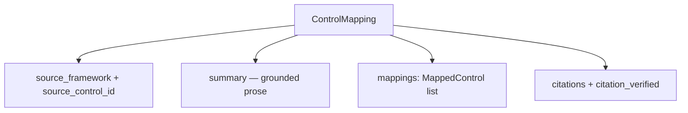

### 3.5 Real-World Analogy
A **translation with footnotes**. `mappings` are the translated terms; each
`reference` is the dictionary page you can turn to; `summary` is the translator's
note; and `citation_verified` is the editor's stamp that every footnote checks out.
An unstamped translation is a draft, not an authority.

### 3.6 Example
```jsonc
{ "finding_id": "f1", "source_framework": "nist_csf", "source_control_id": "PR.AA-01",
  "summary": "Equivalent identity controls exist in ISO and SOC 2 [1][2].",
  "mappings": [ {"framework": "iso_27001", "control_id": "A.8.24", "reference": "ISO 27001 A.8.24"},
                {"framework": "soc_2", "control_id": "CC6.1", "reference": "SOC 2 CC6.1"} ],
  "citations": [ ... ], "citation_verified": true }
```

### 3.7 Common Mistakes
- **Omitting the `reference`.** Without a locator, a reviewer can't verify the
  equivalence — defeating the point.
- **Letting the model set `citation_verified`.** It's set by the grounding policy,
  never the model (as with every grounded output).
- **Making abstention un-representable.** The contract must allow "no equivalents,
  not verified" as a valid answer.

### 3.8 Key Takeaways
- `MappedControl` = one cross-framework equivalent, with a checkable `reference`.
- `ControlMapping` = source control + grounded `summary` + `mappings` + `citations` +
  authoritative `citation_verified`.
- An abstention is a valid mapping (empty `mappings`, `citation_verified=False`).

### 3.9 Self-Assessment
1. Why does `MappedControl` carry a `reference`?
2. Who sets `citation_verified`, and what does `True` guarantee?
3. What does an abstaining `ControlMapping` look like?

### 3.10 Connection to Previous Topics
This mirrors Phase 4's `EnrichedFinding` (explanation + citations + verified flag),
applied to mapping. The `Citation` and `Framework`/`ControlId` types are Phase-1/3
contracts.

---

## Chapter 4 — The Mapping Graph: Grounded Equivalence

### 4.1 Introduction
Now the workflow that produces a `ControlMapping`. It is deliberately almost
identical to the Phase-4 enrichment graph — because grounding is grounding. This
chapter walks it.

### 4.2 Prerequisites
- Phase-4 Chapters on the enrichment graph and grounding (retrieve → abstain |
  generate → verify).

### 4.3 Detailed Explanation
`MappingGraph` (in `application/graphs/mapping.py`) has three nodes and the familiar
shape: ``retrieve → (empty? abstain : map) → END``.

- **`_retrieve`** builds a query from the finding and pulls relevant corpus controls
  — across *all* frameworks (no framework filter, because we *want* other frameworks).
- **`_route`** returns ``abstain`` if nothing relevant came back, else ``map``.
- **`_map`** renders the `control_mapping` prompt with the finding, its **source
  control**, and the retrieved context wrapped as untrusted, calls the model for a
  grounded `summary`, then **verifies citations** and builds the `mappings` list
  (Chapter 5). `citation_verified = all_verified and not context.is_empty`.
- **`_abstain`** returns a `ControlMapping` with `summary = ABSTENTION_TEXT`, no
  mappings, `citation_verified=False` — and **never calls the model**.

The system instruction is the shared `SYSTEM_GROUNDED` (answer only from sources,
cite, abstain), and the retrieved context is always `wrap_untrusted`-ed — the same
injection defence every grounded graph uses.

### 4.4 How It Works
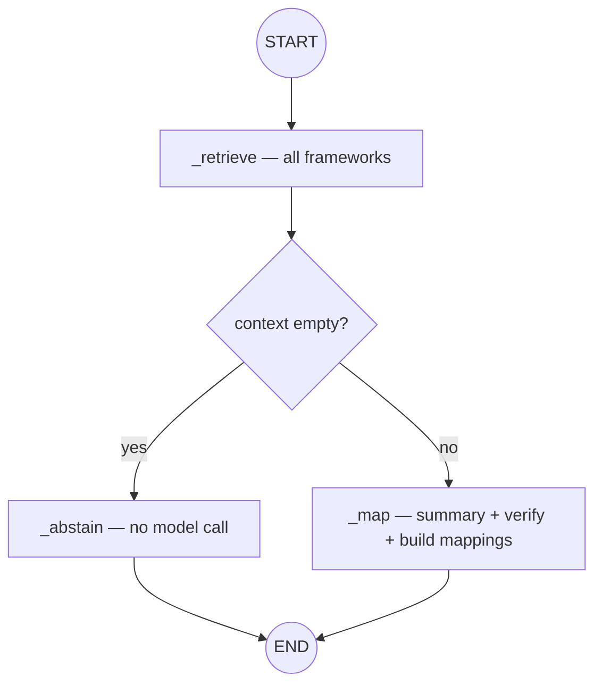

### 4.5 Real-World Analogy
A **bilingual clerk with an official dictionary**. Given a term, they look it up
(retrieve), and if the dictionary has no entry they say so honestly (abstain). If it
does, they write the equivalents *and cite the dictionary page* (map + verify) — they
never translate from memory.

### 4.6 Example
```python
mapping = await mapping_graph.run(finding, auth)
mapping.summary            # "Equivalent identity controls exist in ISO and SOC 2 [1][2]."
mapping.citation_verified  # True
# empty corpus → summary == "Not covered by the provided sources.", mappings == []
```

### 4.7 Common Mistakes
- **Filtering retrieval to the finding's own framework.** Mapping needs the *other*
  frameworks; don't filter them out.
- **Calling the model on the abstain path.** As always, abstention means *no* model
  call.
- **Trusting the model's cited controls without verification.** Verify against
  retrieved sources; drop the rest.

### 4.8 Key Takeaways
- `MappingGraph` = ``retrieve → (abstain | map)``, grounded exactly like enrichment.
- Retrieval spans **all** frameworks (that's the point); the abstain branch never
  calls the model.
- The prose `summary` is generated; the `mappings` come from **verified** citations.

### 4.9 Self-Assessment
1. Why must `_retrieve` *not* filter to the finding's framework?
2. What are the three nodes, and which one skips the model?
3. What sets `citation_verified` on the result?

### 4.10 Connection to Previous Topics
This is the enrichment graph with a different output type — proof that the Phase-4
graph pattern (typed state, injected nodes, abstain edge, verified citations)
generalises to new capabilities cheaply.

---

## Chapter 5 — The Cross-Framework Filter: Only Verified, Only Other

### 5.1 Introduction
The single most important line in the mapping graph is the one that decides which
controls become `mappings`. It encodes the entire anti-hallucination guarantee in a
list comprehension. This short chapter is that line.

### 5.2 Prerequisites
- Chapter 4. Phase-4's `verify_citations` (splits claimed citations into verified /
  unverified against retrieved sources).

### 5.3 Detailed Explanation
After the model writes its grounded summary, `_map` builds the equivalents like this:

```python
verification = verify_citations(context.citations, context.citations)
mappings = [
    MappedControl(framework=c.framework, control_id=c.control_id, reference=c.reference)
    for c in verification.verified                # ONLY verified controls
    if c.framework is not finding.framework       # ONLY *other* frameworks
]
```

Two filters, two guarantees:
1. **Only verified.** A mapped control must be one that was actually *retrieved from
   the corpus and verified* — so the model cannot invent a cross-reference. Every
   entry in `mappings` is real, by construction.
2. **Only other frameworks.** An "equivalent" in the finding's *own* framework isn't
   a mapping — it's the source itself. We exclude same-framework controls so
   `mappings` contains genuine cross-framework translations.

This is why a NIST finding over a NIST-only corpus yields an **empty** `mappings`
list *even though* citations verify: every retrieved control shares the source
framework, so none survives the second filter. That's not a bug — it's the honest
answer ("no *other*-framework equivalents were found in the corpus"), and there's a
test for exactly it.

### 5.4 How It Works
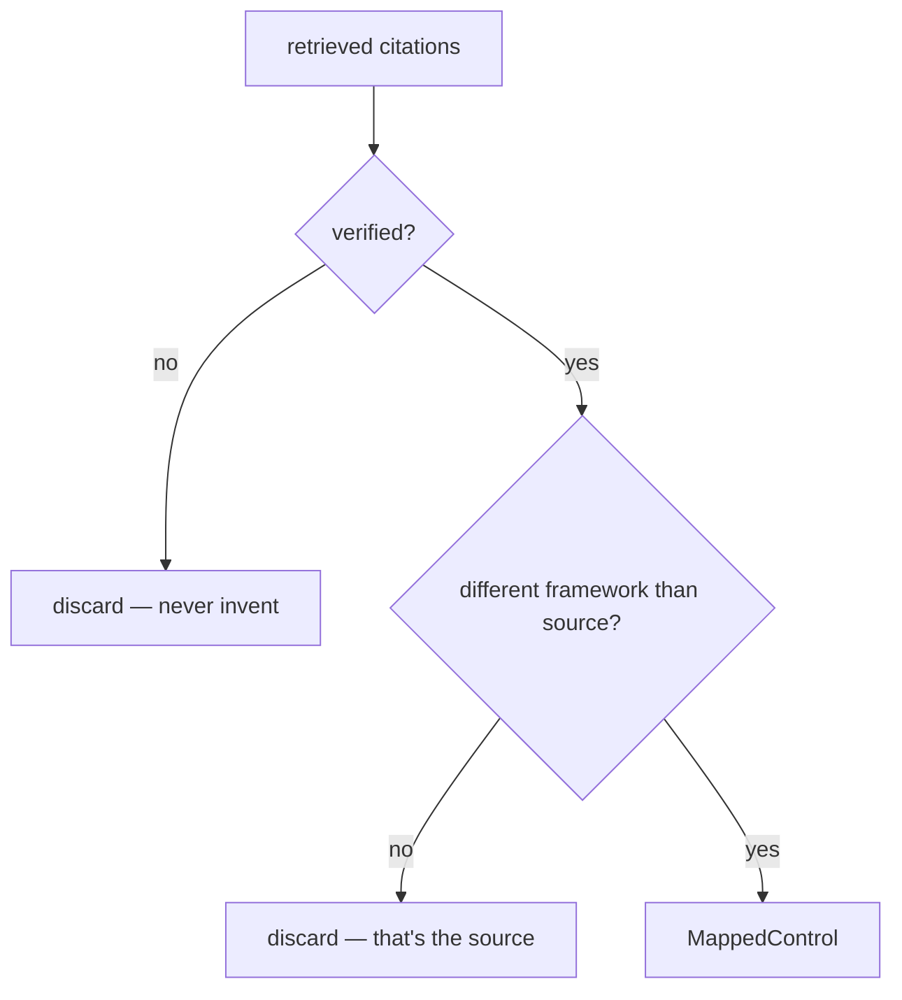

### 5.5 Real-World Analogy
A **customs whitelist with a nationality rule**. To let an item through (become a
mapping) it must (1) be on the verified manifest — no smuggling in invented goods —
*and* (2) be *foreign* (a different country than the origin), because re-importing
your own goods isn't a translation. Two checks, and only the genuinely-foreign,
genuinely-listed items pass.

### 5.6 Example
- Corpus has NIST + ISO + SOC 2. Finding is NIST. Verified citations: NIST PR.AA-01,
  ISO A.8.24, SOC 2 CC6.1. → `mappings` = [ISO A.8.24, SOC 2 CC6.1] (NIST dropped as
  same-framework).
- Corpus has only NIST. Finding is NIST. → `mappings` = [] (all same-framework), even
  though `citation_verified=True`.

### 5.7 Common Mistakes
- **Building mappings from the model's text.** Build them from **verified citations**,
  not from what the model *said* — that's the guarantee.
- **Forgetting the same-framework exclusion.** Without it the source control appears
  as its own "equivalent."
- **Reading empty mappings as failure.** Empty can be the correct, honest result.

### 5.8 Key Takeaways
- `mappings` are built from **verified citations only** (no invention) that are in a
  **different framework** than the source (genuine translation).
- Empty `mappings` with `citation_verified=True` is a valid, honest outcome.
- The anti-hallucination guarantee lives in this one filtered comprehension.

### 5.9 Self-Assessment
1. What two conditions must a citation meet to become a `MappedControl`?
2. Why can `mappings` be empty while `citation_verified` is `True`?
3. Why build mappings from verified citations rather than the model's prose?

### 5.10 Connection to Previous Topics
`verify_citations` is Phase 4's grounding policy, reused verbatim. The "build the
structured output from verified facts, not model text" move is the same one
enrichment used for its citations.

---

# Part II — Pricing Risk

---

## Chapter 6 — Why a Model Must Never Invent a Number

### 6.1 Introduction
Part II is about money, and it opens with a principle strong enough to design the
whole feature around: in a compliance product, **a language model must never author
a financial figure.** This chapter argues why, from first principles.

### 6.2 Prerequisites
- Chapter 1. The Phase-2 idea that an LLM predicts *plausible* text, not *true* text.

### 6.3 Detailed Explanation
A language model is a fluent-text predictor. Ask it "what's the financial exposure of
this finding?" and it will produce a confident number — but that number is a
*linguistic* guess, not a *calculation*. It has three fatal properties for our use:
- **Unverifiable.** There's no method behind it to audit. An auditor asks "how did
  you get 3.2M MAD?" and the honest answer is "the model felt like it."
- **Non-reproducible.** Ask twice, get two numbers. Financial figures in an audit
  must be stable and repeatable.
- **Unaccountable.** Nobody can challenge the *inputs*, because there are none — just
  a black box.

Money is the sharpest case of a rule you've seen since Phase 4: **the model must not
be the source of truth for anything checkable.** For an *explanation*, a model is
appropriate (prose is its job). For a *number that will appear in a risk register and
drive budget decisions*, it is exactly the wrong tool.

So the design inverts the naive approach. We compute the figure with a **transparent,
deterministic method** (Chapter 7) and use the model *only* to write the human-readable
rationale around the number it was handed — explicitly forbidden to change it. The
model becomes the *narrator*, never the *accountant*.

### 6.4 How It Works (who owns the number)
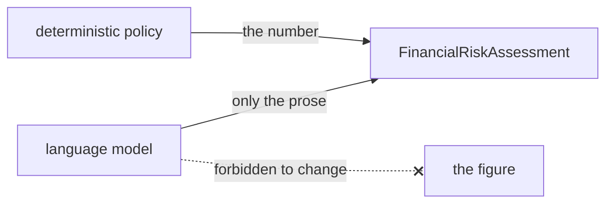

### 6.5 Real-World Analogy
A **courtroom expert witness vs. a novelist**. For a damages figure you call an
actuary who shows their method and inputs (deterministic code). You do *not* ask a
novelist to "estimate" the damages beautifully (the model) — however fluent, it's
inadmissible. The novelist can write the *summary* of the actuary's report; they may
not change the number.

### 6.6 Example
- *Naive (rejected):* prompt → "Exposure ≈ 3,200,000 MAD" (no basis).
- *Ours:* code computes ``195,000–975,000 MAD`` from severity+domain; the model writes
  "This HIGH-severity storage finding carries a planning-range exposure of
  195,000–975,000 MAD…" — using the given figures, adding none.

### 6.7 Common Mistakes
- **Letting the model "sanity-check" or adjust the number.** Any model influence on
  the figure reintroduces the unverifiable guess.
- **Believing a confident number is a correct one.** Confidence is free; a defensible
  method is not.
- **Using the model because the code method feels "too simple."** Transparent and
  simple is a feature in an audit, not a weakness.

### 6.8 Key Takeaways
- A model's number is **unverifiable, non-reproducible, unaccountable** — disqualifying
  for financial output.
- The rule: **the model narrates the figure; it never authors it.**
- The figure comes from a transparent, deterministic method (next chapter).

### 6.9 Self-Assessment
1. Give the three reasons a model-authored financial figure is unacceptable.
2. What role *may* the model play in the financial capability?
3. Why is a simple, transparent method a strength here?

### 6.10 Connection to Previous Topics
This is the exact discipline of Phase 4's report graph (counts computed in code, prose
from the model), stated as a principle and applied to its highest-stakes case. It's
the financial face of "the model is never the source of truth for a checkable fact."

---

## Chapter 7 — The Deterministic Financial Model

### 7.1 Introduction
If code computes the number, *how*? This chapter presents `estimate_exposure` — a
pure domain policy that turns a finding into a monetary range using explicit,
tunable rules. No AI, no randomness, no I/O.

### 7.2 Prerequisites
- Chapter 6. The Phase-1 `Finding` (it carries `severity`, `domain`, `status`) and the
  idea of a pure, unit-tested policy.

### 7.3 Detailed Explanation
`estimate_exposure(finding)` (in `domain/policies/financial_model.py`) computes an
`ExposureBand` — a `min_mad`, a `max_mad`, and the `assumptions` behind them — from
two inputs:

1. **Severity → a base band.** Higher severity, higher exposure. Explicit constants:
   ```python
   LOW:      5,000 –    25,000 MAD
   MEDIUM:  25,000 –   150,000 MAD
   HIGH:   150,000 –   750,000 MAD
   CRITICAL:750,000 – 4,000,000 MAD
   ```
2. **Domain → a multiplier.** Data-bearing domains carry more exposure:
   ```python
   STORAGE 1.3×,  IAM 1.2×,  ENCRYPTION 1.2×,  NETWORK 1.1×,  LOGGING 1.0×
   ```

The band is `base × multiplier`, rounded to whole dirham. A **passing** finding
(``status == pass``) short-circuits to ``0–0`` (a compliant resource has no residual
exposure). Every run returns the same numbers for the same inputs — that's what
"deterministic" buys: reproducibility an auditor can rely on.

These constants are **planning figures**, not actuarial truth — and the policy says so
in its returned assumptions (Chapter 8). Crucially, they live in *one* place, are
*explicit*, and are *unit-tested*: to change the model's economics you edit a constant
and a test, not a prompt.

### 7.4 How It Works
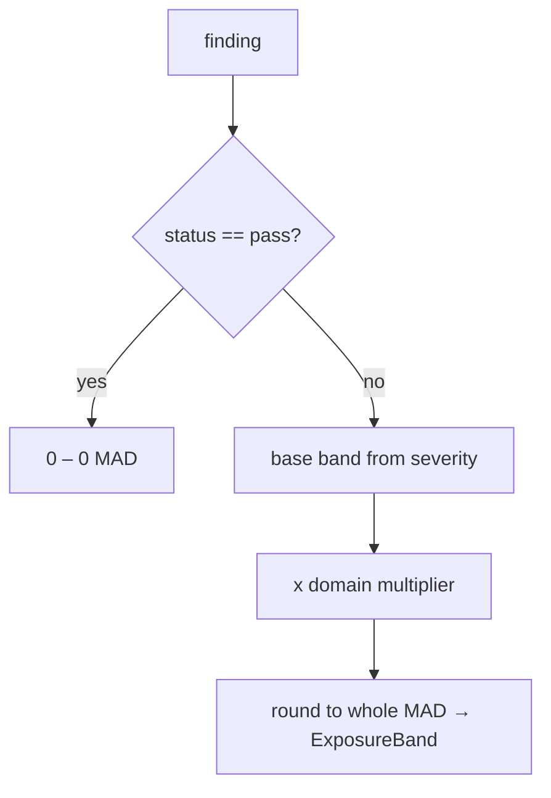

### 7.5 Real-World Analogy
An **insurance premium table**. The insurer doesn't guess your premium — they look up
a base rate for your risk class (severity) and apply a factor for your circumstances
(domain), from a published table anyone can inspect. Same inputs, same premium, every
time. Our financial model is that rate table for compliance risk.

### 7.6 Example
```python
# HIGH severity + STORAGE domain
band = estimate_exposure(finding)
band.min_mad  # 150000 * 1.3 = 195000
band.max_mad  # 750000 * 1.3 = 975000
# a passing finding → 0, 0
```

### 7.7 Common Mistakes
- **Hiding the constants or scattering them.** Keep the bands/multipliers in one
  explicit, tested policy — that's what makes it auditable.
- **Forgetting the pass → zero case.** A compliant finding must not carry a spurious
  band.
- **Adding randomness "for realism."** Determinism is the requirement; a range already
  expresses uncertainty (Chapter 8).

### 7.8 Key Takeaways
- `estimate_exposure` = **severity base band × domain multiplier**, rounded; pure and
  deterministic.
- A **passing** finding yields ``0–0``.
- Constants are explicit, centralised, and unit-tested — tune them in one place.

### 7.9 Self-Assessment
1. What two finding attributes drive the exposure, and how?
2. What does a passing finding produce, and why?
3. Why are explicit, centralised constants important here?

### 7.10 Connection to Previous Topics
This is a pure domain **policy**, exactly like Phase 4's `iac_safety` and grounding
policies — dependency-free, deterministic, individually tested. The `Severity` weights
and `RiskDomain` are Phase-1 value objects.

---

## Chapter 8 — Ranges, Not Points; Assumptions, Not Black Boxes

### 8.1 Introduction
Two deliberate honesty choices shape the financial output: it's always a **range**,
and it always ships its **assumptions**. This chapter explains why both are matters of
integrity, not decoration.

### 8.2 Prerequisites
- Chapter 7. The Phase-1 `FinancialRiskAssessment` contract (`min_mad`, `max_mad`,
  `rationale`, `assumptions`).

### 8.3 Detailed Explanation
**Why a range, never a point?** A single number — "exposure: 512,000 MAD" — implies a
precision nobody actually has. Real exposure depends on unknowables (was data
exfiltrated? how much? will a regulator fine?). A **range** ("195,000–975,000 MAD")
is the honest shape of an estimate: it communicates "somewhere in here," which is the
truth, instead of false certainty. The `FinancialRiskAssessment` contract enforces
this — it has `min_mad` and `max_mad`, with a validator requiring `max ≥ min`; there
is no single-figure field to misuse.

**Why ship assumptions?** A number without its assumptions is a black box, and black
boxes can't be challenged. So the policy returns the exact assumptions the range rests
on, e.g.:
- "Severity 'high' maps to a base band of 150,000–750,000 MAD."
- "Domain 'storage' applies a 1.3× impact multiplier."
- "A planning range, not an actuarial estimate; excludes regulatory fines and
  reputational loss."
- "A single affected resource is assumed; scale for fleet-wide exposure."

Now a reviewer can argue with the *inputs* ("our storage multiplier should be higher")
rather than a mysterious total. That is what makes the figure **auditable** — the whole
point of Chapter 6. Transparency converts a guess into a defensible position.

### 8.4 How It Works
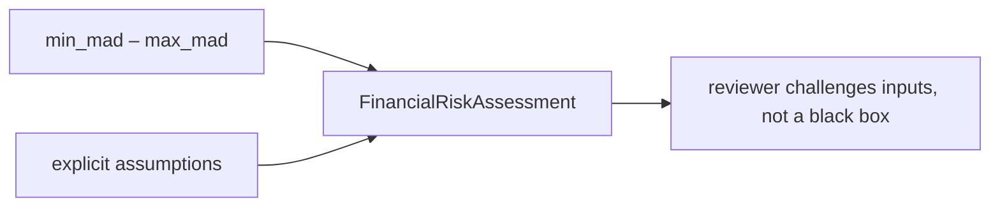

### 8.5 Real-World Analogy
A **contractor's quote** vs. a number scrawled on a napkin. A real quote gives a range
("₂₀–₂₅k, depending on materials") and itemises assumptions ("assumes existing wiring
is sound"). You can negotiate the assumptions. The napkin number you can only accept or
reject on faith. Auditors want the quote.

### 8.6 Example
```jsonc
{ "finding_id": "f1", "min_mad": "195000", "max_mad": "975000",
  "rationale": "This high-severity storage finding carries a planning-range exposure…",
  "assumptions": [ "Severity 'high' maps to a base band of 150000–750000 MAD.",
                   "Domain 'storage' applies a 1.3x impact multiplier.", "…" ] }
```

### 8.7 Common Mistakes
- **Emitting a single point estimate.** It fakes precision; use a range.
- **Dropping the assumptions to look cleaner.** The assumptions are what make the
  number defensible — they're the feature.
- **Burying caveats in prose only.** Return them as structured data so they can't be
  overlooked.

### 8.8 Key Takeaways
- The output is always a **range** (`min_mad`/`max_mad`, `max ≥ min`) — honest about
  uncertainty.
- The **assumptions** ship with every assessment, so reviewers challenge inputs, not a
  black box.
- Together they make the figure **auditable** — the entire goal of the financial
  capability.

### 8.9 Self-Assessment
1. Why a range instead of a single number?
2. What do the returned assumptions let a reviewer do?
3. How does the contract prevent emitting a false-precision point estimate?

### 8.10 Connection to Previous Topics
This is the `FinancialRiskAssessment` contract from Phase 1 finally being *produced*.
The "explicit, challengeable inputs" ethic is the financial cousin of grounding's
"cite your sources."

---

## Chapter 9 — The Financial Graph: Compute, Then Narrate

### 9.1 Introduction
The workflow that ties Chapters 6–8 together: a two-step graph that **computes** the
range, then lets the model **narrate** it. It looks like the report graph, for the same
reason.

### 9.2 Prerequisites
- Chapters 6–8. Phase-4's report graph (summarize → generate).

### 9.3 Detailed Explanation
`FinancialGraph` (in `application/graphs/financial.py`) is linear: ``estimate →
narrate``.

- **`_estimate`** is **pure**: it calls `estimate_exposure(finding)` and puts the
  `ExposureBand` in the state. No model call — the numbers are settled here, in code.
- **`_narrate`** renders the `financial_rationale` prompt with the finding, the
  **pre-computed range**, and the assumptions, under a system instruction that
  *forbids inventing, widening, narrowing, or adding any figure*. It calls the model
  only for the prose `rationale`, then assembles the `FinancialRiskAssessment` using
  the **band's** `min_mad`/`max_mad`/`assumptions` — not anything the model said about
  numbers. If the model returns nothing usable, a computed fallback rationale is used,
  so the output is always complete.

The key property, enforced by construction: **the model's text can never change the
figure.** The numbers on the returned assessment come from `_estimate`; `_narrate`
only supplies words. A test proves it — feed the fake model "9,999,999,999 MAD" and the
assessment still carries the deterministic band.

### 9.4 How It Works
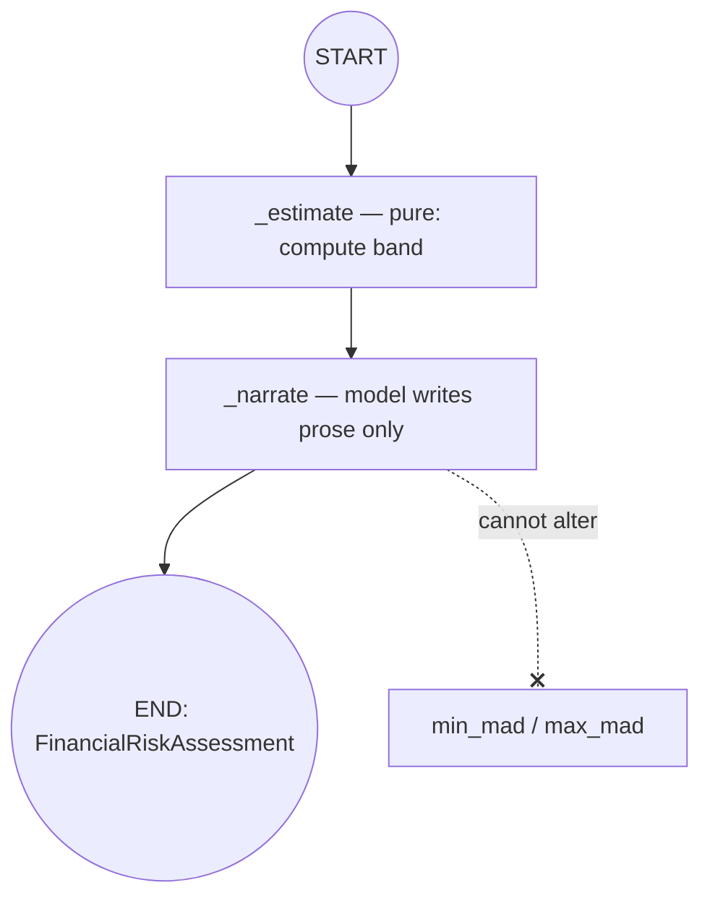

### 9.5 Real-World Analogy
An **actuary and a report-writer at the same desk**. The actuary computes the number
and hands it over (estimate). The writer drafts the readable summary around it
(narrate) — and if the writer tried to change the figure, the final report still uses
the actuary's number, because that's what's filed.

### 9.6 Example
```python
assessment = await financial_graph.run(finding, auth)  # HIGH + storage
assessment.min_mad, assessment.max_mad   # (195000, 975000) — from code
assessment.rationale                     # model prose, using those figures
# even if the model shouts a huge number, the band is unchanged
```

### 9.7 Common Mistakes
- **Parsing a number out of the model's text into the assessment.** Never — the band
  comes from `_estimate`.
- **Failing when the model returns empty.** Provide a computed fallback rationale;
  the number is always available.
- **Adding retrieval/grounding here.** Financial exposure isn't a regulatory claim to
  cite; its integrity comes from determinism, not citations.

### 9.8 Key Takeaways
- `FinancialGraph` = ``estimate (pure) → narrate (prose only)``.
- The returned figure is the **computed band**; the model supplies only the rationale
  and can't change the number.
- A fallback rationale guarantees a complete output even if the model is silent.

### 9.9 Self-Assessment
1. Which node computes the number, and does it call the model?
2. How does the graph guarantee the model can't alter the figure?
3. Why doesn't the financial graph use retrieval/citations?

### 9.10 Connection to Previous Topics
Structurally identical to the report graph (Phase 4): compute facts, then narrate.
It reuses the shared `traced_node` wrapper, the prompt registry, and the gateway —
the whole Phase-4 workflow toolkit.

---

# Part III — Exposure & Assembly

---

## Chapter 10 — Two More Agents, Two More Endpoints

### 10.1 Introduction
The graphs are wrapped as bounded agents and exposed as endpoints — exactly like the
Phase-4/5 capabilities. This chapter shows how little new machinery that takes,
which is the point of the architecture.

### 10.2 Prerequisites
- Phase-4 bounded agents; Phase-5 endpoints (auth + tenant check + call the agent).

### 10.3 Detailed Explanation
Two new agents, each a thin `BoundedAgent` wrapping its graph, granting **no** free
tools:
- **`ControlMapperAgent.map(finding, auth) → ControlMapping`** wraps `MappingGraph`.
- **`FinancialAnalystAgent.assess(finding, auth) → FinancialRiskAssessment`** wraps
  `FinancialGraph`.

They join the `AgentSuite`, and two endpoints expose them under `/api/v1/ai`, each
following the identical three-beat shape every AI endpoint uses: the auth dependency
verifies the caller, `_assert_tenant` blocks cross-tenant findings, and the agent runs:

```python
@router.post("/map", response_model=ControlMapping)
async def map_control(body: MapRequest, auth=Depends(get_auth_context),
                      agents=Depends(get_agents)) -> ControlMapping:
    _assert_tenant([body.finding], auth)
    return await agents.control_mapper.map(body.finding, auth)
```

`/financial` is the same, calling `financial_analyst.assess`. The responses are the
domain contracts themselves (`ControlMapping`, `FinancialRiskAssessment`) — no parallel
DTOs, consistent with the handoff. That's the whole integration: two thin agents, two
thin routes.

### 10.4 How It Works
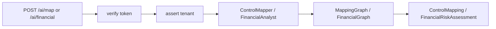

### 10.5 Real-World Analogy
**Adding two more windows to a reception desk that already has five.** Same ID check,
same account-scope check, same layout — you just label two new windows and staff them
with the new specialists. Customers already know how to queue.

### 10.6 Example
```bash
curl -sS localhost:8000/api/v1/ai/financial -H "Authorization: Bearer $TOKEN" \
  -H "Content-Type: application/json" -d '{"finding": { … }}'
# → { "finding_id": "...", "min_mad": "195000", "max_mad": "975000", "rationale": "...", "assumptions": [...] }
```

### 10.7 Common Mistakes
- **Skipping the tenant check on the new endpoints.** Every finding-taking endpoint
  calls `_assert_tenant` — no exceptions.
- **Inventing new response DTOs.** Return the domain contracts; that's the shared wire
  format.
- **Putting logic in the route.** The route orchestrates; the agent/graph holds the
  logic.

### 10.8 Key Takeaways
- Two thin agents (`ControlMapperAgent`, `FinancialAnalystAgent`) wrap the new graphs;
  no free tools.
- Two endpoints (`/map`, `/financial`) follow the same authenticate → tenant-check →
  run-agent shape.
- Responses are the domain contracts; almost no new machinery — the architecture pays
  off again.

### 10.9 Self-Assessment
1. What are the three beats every AI endpoint shares?
2. Why do the new agents grant no tools?
3. What are the response types of `/map` and `/financial`?

### 10.10 Connection to Previous Topics
Identical to the Phase-4 wrapper agents and Phase-5 endpoint pattern. The `AgentSuite`,
`get_auth_context`, `_assert_tenant`, and domain-model responses are all reused
unchanged.

---

## Chapter 11 — Wiring, the Complete Capability Set, and Preparing for Phase 8

### 11.1 Introduction
The closing chapter wires the two capabilities into the composition root, takes stock
of the **now-complete** AI capability set, and looks ahead to Phase 8.

### 11.2 Prerequisites
- All previous chapters.

### 11.3 Detailed Explanation
`build_agent_suite` gains two lines: build the `MappingGraph` and `FinancialGraph` over
the existing retrieval stack + gateway + prompts, and wrap each in its agent on the
`AgentSuite`. Two prompt assets (`control_mapping`, `financial_rationale`) drop into
`prompts/` and are auto-loaded by the registry — no code change to pick them up. That's
the entire wiring; the container, tenancy, auth, and guardrails are untouched.

With Phase 7 done, the AI subsystem now delivers **all seven capabilities** the build
spec named:

| Capability | Endpoint | Integrity mechanism |
| --- | --- | --- |
| Explain | `/ai/enrich` | grounded + verified citations |
| Ask | `/ai/ask` | grounded + abstain |
| Remediate | `/ai/remediate` | never applied; IaC statically validated |
| Correlate | `/ai/correlate` | grounded narrative over the corpus |
| Report | `/ai/report` | counts computed in code |
| **Map** | `/ai/map` | **verified, cross-framework only** |
| **Price** | `/ai/financial` | **deterministic figure; model narrates only** |

Every one of them is bounded, tenant-scoped, and refuses to let the model author a
checkable fact. That consistency is not an accident — it's the architecture from
Phases 1–5 doing its job.

### 11.4 How It Works (the complete suite)
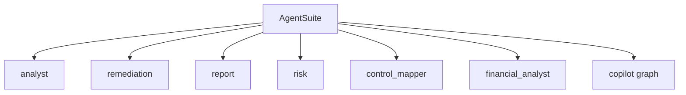

### 11.5 Real-World Analogy
**A consulting firm that has now hired its full roster.** The analyst, the remediation
engineer, the report writer, the risk strategist — and now the compliance-mapping
specialist and the financial appraiser. Every consultant follows the same firm-wide
ethics (cite your sources, show your method); the firm is complete.

### 11.6 Example
```python
container = build_container(settings)
mapping    = await container.agents.control_mapper.map(finding, auth)
assessment = await container.agents.financial_analyst.assess(finding, auth)
```

### 11.7 Common Mistakes
- **Wiring the new graphs outside the composition root.** All construction lives there.
- **Hand-registering the new prompts.** Drop the files in `prompts/`; the registry
  auto-loads them.
- **Assuming "feature-complete" means "done."** Phase 8 hardens what exists — it doesn't
  add capabilities.

### 11.8 Key Takeaways
- Wiring Phase 7 is two graph builds + two agents + two prompt files — the rest is
  reused.
- The AI subsystem now covers **all seven** spec capabilities, each with an explicit
  integrity mechanism.
- Consistency across capabilities is the architecture paying off.

### 11.9 Self-Assessment
1. How much new wiring did Phase 7 require, and why so little?
2. List the seven capabilities and one integrity mechanism each.
3. What does "feature-complete" leave for Phase 8?

### 11.10 Connection to Previous Topics — and What's Next
Phase 7 completes the *capability* story that began in Phase 4. Everything —
grounding, guardrails, tenancy, ports — was built to make adding a capability cheap and
*safe*, and this phase proves it twice. **Phase 8** shifts from *what the system does*
to *how well it does it in production*: observability and tracing, an **evaluation
harness** that scores answer quality and grounding, performance and cost hardening,
and the final release-readiness pass. The features are done; Phase 8 makes them
trustworthy at scale.

---

## Appendix A — Glossary

- **Compliance framework** — a published checklist of security requirements (NIST CSF,
  ISO 27001, SOC 2, Loi 05-20, DNSSI).
- **Control** — one identified requirement within a framework, with a framework-specific
  id (e.g. `PR.AA-01`, `A.8.24`, `CC6.1`).
- **Control mapping** — translating a finding's control into its equivalents in other
  frameworks.
- **ControlMapping / MappedControl** — the domain contracts for a mapping and one
  cross-framework equivalent.
- **Cross-framework filter** — keep only verified citations in a *different* framework
  than the source.
- **Financial risk / exposure** — the estimated monetary impact of a finding, in MAD.
- **MAD** — Moroccan Dirham, the currency of the estimate.
- **Deterministic model** — a method that returns the same output for the same input,
  every time (here, `estimate_exposure`).
- **Exposure band** — the computed `min_mad`–`max_mad` range plus its assumptions.
- **FinancialRiskAssessment** — the domain contract for a priced finding (range +
  rationale + assumptions).
- **Assumptions** — the explicit inputs/caveats a figure rests on, returned so reviewers
  can challenge them.
- **Narrator (model role)** — the model writes the rationale but never authors the number.

## Appendix B — The complete capability set

| Capability | Endpoint | Output contract | Who authors the checkable fact |
| --- | --- | --- | --- |
| Explain | `/ai/enrich` | `EnrichedFinding` | corpus (verified citations) |
| Ask | `/ai/ask` | `CopilotAnswer` | corpus (verified citations) |
| Remediate | `/ai/remediate` | `RemediationProposal` | model proposes; static validator gates; never applied |
| Correlate | `/ai/correlate` | narrative | corpus (grounded) |
| Report | `/ai/report` | `ReportDraft` | code (counts) |
| Map | `/ai/map` | `ControlMapping` | corpus (verified, cross-framework) |
| Price | `/ai/financial` | `FinancialRiskAssessment` | code (deterministic band) |

## Appendix C — Self-Assessment Answer Key (brief)

- **Ch. 1:** control mapping and financial risk; hallucinated cross-references and
  unverifiable numbers; the model never authors a checkable fact.
- **Ch. 5:** a citation must be *verified* and in a *different framework* than the
  source; empty mappings with verified citations happens when all retrieved controls
  share the source framework; build from verified citations, not model prose, to
  guarantee no invention.
- **Ch. 6:** unverifiable, non-reproducible, unaccountable; the model may write the
  rationale only; simple+transparent is auditable.
- **Ch. 9:** `_estimate` computes it with no model call; the assessment's numbers come
  from the band, not the model's text; financial integrity is determinism, not
  citations.

---

*End of Phase 7 Study Guide. You now understand — from first principles — how
ComplianceIQ maps a finding's control across frameworks without inventing a single
equivalent, and prices its risk with a number an auditor can actually challenge. The
seven AI capabilities are complete; Phase 8 makes them observable, measurable, and
production-hardened.*
