<!--
  PHASE 8 STUDY GUIDE — ComplianceIQ AI Service
  A complete, beginner-first textbook for the Observability, Evaluation & Release phase.
-->

# Phase 8 Study Guide — Proving It Works: Observability, Evaluation, and Release

> **Who this is for:** a motivated beginner. You do **not** need to have mastered
> Phases 1–7. You do **not** need to know what a metric, a Prometheus scrape, an
> evaluation harness, precision/recall, or a release checklist is. We build every
> idea from the ground up.
>
> **How to read it:** straight through the first time. Each chapter follows the
> same rhythm — *Introduction → Prerequisites → Detailed Explanation → How It
> Works → Analogy → Example → Common Mistakes → Key Takeaways → Self-Assessment →
> Connection to Previous Topics* — so you always know where you are.
>
> **The promise:** by the end you will understand, from first principles, how we
> make a running system *observable* (metrics, traces, correlation IDs), how we turn
> the product's core promise — grounding — into a **measured number** instead of a
> hope, and how a mature team decides a system is actually **ready to release**. This
> is the phase that turns "it works on my machine" into "it works, and we can prove
> it." Well enough to defend it to a senior engineer or a jury.

---

## What Phase 8 adds (a map to keep open)

```text
src/complianceiq/
├── domain/ports/metrics.py                        ← MetricsSink port (+ NullMetrics)
├── infrastructure/observability/metrics_memory.py ← InMemoryMetrics (+ Prometheus render)
├── infrastructure/http/metrics_middleware.py      ← MetricsMiddleware (times each request)
├── application/services/observability.py          ← ObservabilityService (metrics + usage)
├── application/evaluation/grounding_eval.py        ← GroundingEvaluator (answer quality)
├── scripts/evaluate_ai.py                          ← the grounding-eval CLI
├── presentation/routers/health.py                 ← + GET /metrics
└── docs/OBSERVABILITY.md, RELEASE_READINESS.md     ← how it's watched + sign-off
```

## Table of Contents

**Part I — Observability**
1. [What Phase 8 Is: From "It Works" to "We Can Prove It"](#chapter-1--what-phase-8-is-from-it-works-to-we-can-prove-it)
2. [The Three Signals: Logs, Traces, Metrics](#chapter-2--the-three-signals-logs-traces-metrics)
3. [The Metrics Port and the In-Memory Sink](#chapter-3--the-metrics-port-and-the-in-memory-sink)
4. [Timing Every Request: The Metrics Middleware](#chapter-4--timing-every-request-the-metrics-middleware)
5. [The /metrics Endpoint and the Prometheus Format](#chapter-5--the-metrics-endpoint-and-the-prometheus-format)

**Part II — Evaluation**
6. [Why "Measured" Beats "Asserted"](#chapter-6--why-measured-beats-asserted)
7. [Precision and Recall, from Zero](#chapter-7--precision-and-recall-from-zero)
8. [The Grounding Evaluation Harness](#chapter-8--the-grounding-evaluation-harness)

**Part III — Release**
9. [Release Readiness: Mapping Rules to Proof](#chapter-9--release-readiness-mapping-rules-to-proof)
10. [Honest Limitations, and the Whole System in One View](#chapter-10--honest-limitations-and-the-whole-system-in-one-view)

---

# Part I — Observability

---

## Chapter 1 — What Phase 8 Is: From "It Works" to "We Can Prove It"

### 1.1 Introduction
Phases 1–7 built a complete, feature-full system: it explains, answers, remediates,
correlates, reports, maps, and prices — securely, over an API, with real auth and
storage. But "the tests pass" is not the same as "we can operate this in production
and prove it behaves." Phase 8 closes that gap. It adds nothing users click; it adds
everything an *operator* and an *auditor* need.

### 1.2 Prerequisites
- A rough sense of the seven capabilities from Phases 4–7.
- The Phase-1 idea of a **port** (an interface with swappable adapters).

### 1.3 Detailed Explanation
A production system must answer three questions at any moment, without a debugger:
1. **Is it healthy and how is it performing?** — request rates, latencies, error
   rates, cost. This is **observability** (Part I).
2. **Is it actually *good*?** — does it ground its answers and abstain correctly, at
   what rate? This is **evaluation** (Part II).
3. **Is it *ready* to ship?** — is every promise enforced *and verified*, and what
   must change for production? This is **release readiness** (Part III).

Notice the shift in posture. Earlier phases asked "does this feature work?" Phase 8
asks "can we *see* it working, *measure* how well, and *prove* it's safe to release?"
That is the difference between a demo and a product. None of it adds capability — it
adds **confidence**, the currency a compliance product actually trades in.

Everything here rides on the architecture you already have: metrics sit behind a
**port** (like every external concern), evaluation is **pure orchestration** over the
capabilities (so it runs offline in CI), and the release document simply *catalogues*
guarantees the earlier phases already built.

### 1.4 How It Works (the three questions)
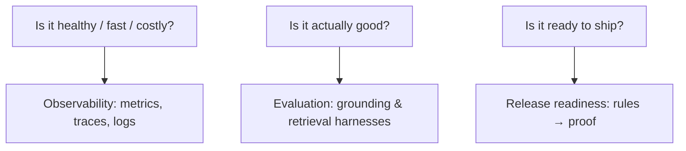

### 1.5 Real-World Analogy
A **restaurant on opening night vs. a health inspection**. The kitchen already cooks
(Phases 1–7). Phase 8 adds the **thermometers and logbooks** (observability), the
**taste test against a standard** (evaluation), and the **inspector's checklist**
(release readiness). The food didn't change; your ability to *prove* it's safe and
good did.

### 1.6 Example
- *Observability:* `GET /metrics` shows 12 enrich requests, p-max latency 180 ms,
  26k tokens, $0.42 spent.
- *Evaluation:* `python -m scripts.evaluate_ai` reports grounded rate 100%,
  abstention rate correct, citation recall 100%.
- *Release:* the readiness doc shows rule 1 (tenant isolation) enforced in
  `assert_same_tenant` and verified by named tests.

### 1.7 Common Mistakes
- **Believing passing tests = production-ready.** Tests prove behaviour in a lab;
  observability and readiness prove *operability*.
- **Adding observability as an afterthought bolted on top.** It belongs behind the
  same ports as everything else, so it swaps cleanly.
- **Skipping evaluation because unit tests exist.** Unit tests check cases; only an
  aggregate eval tells you the *rate* of correct grounding.

### 1.8 Key Takeaways
- Phase 8 adds **confidence**, not capability: observe, evaluate, prove-ready.
- Three questions: healthy/fast/costly, actually-good, ready-to-ship.
- It reuses the architecture — ports for metrics, pure orchestration for eval.

### 1.9 Self-Assessment
1. What three questions does Phase 8 let you answer?
2. Why isn't "the tests pass" enough to release?
3. What does Phase 8 add if not new features?

### 1.10 Connection to Previous Topics
This is the capstone of everything: the ports (Phases 1–6), the grounded capabilities
(Phases 4, 7), and the audit trail (Phases 1–2) all become *measurable and provable*
here. Observability is the last port; readiness is the last document.

---

## Chapter 2 — The Three Signals: Logs, Traces, Metrics

### 2.1 Introduction
"Observability" is made of three complementary signals. Confusing them is a common
beginner error, so this chapter defines each, what it's for, and which ones we already
had before Phase 8.

### 2.2 Prerequisites
- Chapter 1. The idea that a running server handles many requests over time.

### 2.3 Detailed Explanation
The three pillars of observability:

- **Logs** — *individual events*, as text/JSON lines: "request handled," "model call
  ok, 200 tokens, $0.001." Great for the story of one thing that happened. We've had
  structured logs (`structlog`) since Phase 1, and the AI gateway logs every model
  call.
- **Traces** — *the path of one operation* through its steps, with timings. Our
  LangGraph workflows already emit a **trace** per run: one `TraceEvent` per node
  (`retrieve`, `generate`, …) with `duration_ms`. A trace answers "what did *this*
  enrichment do, step by step?"
- **Metrics** — *aggregated numbers over time*: "12 requests, p95 latency 180 ms,
  0.4% errors." Metrics don't tell you about one request; they tell you about the
  *system's behaviour in aggregate*, which is what dashboards and alerts need. This is
  the pillar Phase 8 adds.

They complement each other. A **metric** alerts you ("error rate spiked"); a **trace**
localises it ("the retrieve node is timing out"); a **log** (found via the
**correlation ID**) gives the exact failing request's details. You need all three.

The **correlation ID** stitches them together: assigned per request (Phase 1/2 middleware),
bound to every log line, echoed in the response header and error envelope. When a user
reports "request X failed," you grep that ID and get the whole story.

### 2.4 How It Works (three views of the same traffic)
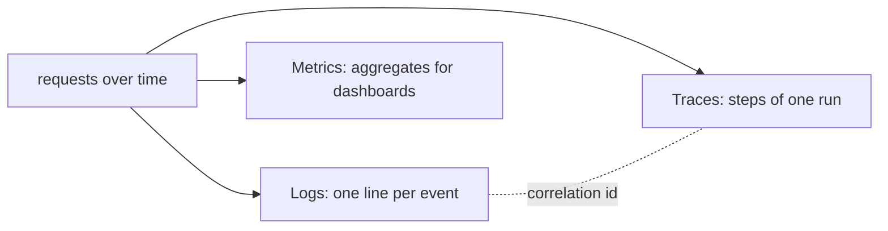

### 2.5 Real-World Analogy
A **hospital**. **Metrics** are the ward dashboard (how many patients, average wait).
**Traces** are one patient's chart (admitted → tested → treated, with times).
**Logs** are the detailed nurses' notes for a moment. The patient's **ID** ties the
chart and notes together. A doctor uses all three at different zoom levels.

### 2.6 Example
- Metric: `http_request_duration_ms_max{route="/api/v1/ai/enrich"} 180`.
- Trace: `[{node: retrieve, 90ms}, {node: generate, 6ms}]`.
- Log: `ai_generate_ok tenant_id=… tokens=200 cost_usd=0.001 correlation_id=abc`.

### 2.7 Common Mistakes
- **Using logs as metrics.** Counting log lines to get a rate is slow and fragile;
  emit a metric.
- **Metrics without traces.** A spiking number with no way to localise it is an alarm
  with no map.
- **Dropping the correlation ID.** Without it, the three signals can't be joined for a
  specific request.

### 2.8 Key Takeaways
- **Logs** = individual events; **traces** = one operation's steps; **metrics** =
  aggregates.
- We already had logs and per-run traces; Phase 8 adds **metrics**.
- The **correlation ID** joins all three for a given request (the audit backbone, rule 7).

### 2.9 Self-Assessment
1. Define logs, traces, and metrics in one line each.
2. Which two signals did the system already have before Phase 8?
3. What role does the correlation ID play across the three?

### 2.10 Connection to Previous Topics
Traces are Phase 4's `TraceEvent`; logs and the correlation ID are Phase 1/2's audit
backbone. Phase 8 completes the trio by adding the metrics pillar.

---

## Chapter 3 — The Metrics Port and the In-Memory Sink

### 3.1 Introduction
Metrics, like every external concern in this codebase, hide behind a **port**. This
chapter defines the tiny `MetricsSink` port and its in-memory adapter — the thing that
actually counts and times.

### 3.2 Prerequisites
- Chapter 2. The Phase-1 port pattern (abstract interface, swappable adapter).

### 3.3 Detailed Explanation
There are two fundamental kinds of measurement, and the `MetricsSink` port
(`domain/ports/metrics.py`) offers exactly one primitive for each:

- **Counters** — things that only go up: requests served, errors, model calls.
  `increment(name, value=1, **labels)`.
- **Distributions** — a spread of values you want to summarise: request durations.
  `observe(name, value, **labels)`.

That's the whole port. **Labels** are key/value tags (`route="/health"`,
`status="200"`) that let one metric name carry many series — you can then slice
"requests by route and status." Two rules the port documents: recording must be
**cheap** (it runs in the request path) and must **never raise** into the caller (a
metrics bug must not break a request).

The default adapter is `InMemoryMetrics` (`infrastructure/observability/`). It keeps
two dicts — counters, and lightweight **summaries** (count / sum / min / max) — keyed
by *(name, sorted labels)*. It's process-local, dependency-free, thread-safe (a lock),
and it can render itself in the Prometheus format (Chapter 5) and as a JSON snapshot
(for tests). A `NullMetrics` no-op is the fallback when observability isn't configured.

Why a port and not just "use the Prometheus library"? Because the *backend* varies —
in-memory offline, a real Prometheus/OpenTelemetry exporter in production — and the
code that *records* metrics shouldn't know or care. Swap the adapter; nothing above
changes. Same discipline as the vector store, the token verifier, the Core client.

### 3.4 How It Works
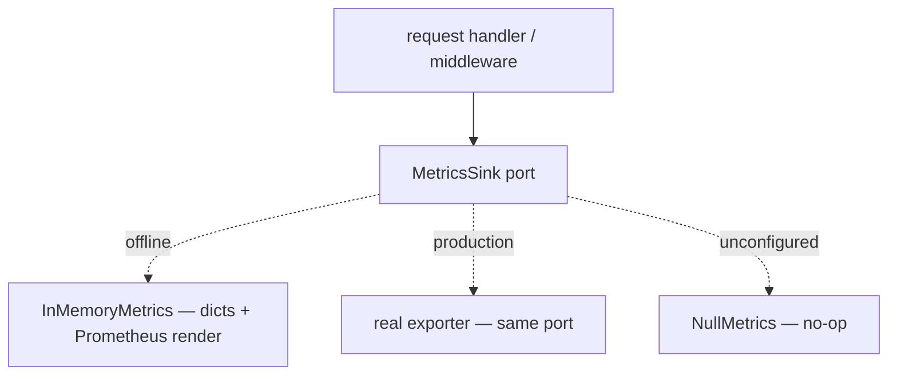

### 3.5 Real-World Analogy
A **tally counter and a stopwatch** handed to a clerk. The counter clicks up
(increment); the stopwatch records how long things take (observe). The clerk doesn't
care whether the numbers end up on a clipboard (in-memory) or a networked dashboard
(exporter) — they just count and time. The *port* is "counter + stopwatch"; the
*adapter* is where the numbers go.

### 3.6 Example
```python
metrics.increment("http_requests_total", route="/health", status="200")
metrics.observe("http_request_duration_ms", 5.0, route="/health")
# InMemoryMetrics.snapshot() → {"counters": [...], "summaries": [{count, sum, min, max, mean}]}
```

### 3.7 Common Mistakes
- **A giant metrics interface.** Two primitives (count, observe) cover almost
  everything; keep the port tiny.
- **Letting a metrics error bubble up.** Recording must never break a request — it's
  best-effort.
- **Unbounded label values.** Labels multiply series; keep them low-cardinality
  (Chapter 4).

### 3.8 Key Takeaways
- `MetricsSink` = `increment` (counters) + `observe` (distributions), with **labels**.
- `InMemoryMetrics` aggregates offline and renders Prometheus/JSON; `NullMetrics` is
  the no-op.
- The port lets a real exporter swap in with no caller change.

### 3.9 Self-Assessment
1. What are the two primitives, and which metric type does each serve?
2. What are labels for?
3. Why put metrics behind a port instead of using a library directly?

### 3.10 Connection to Previous Topics
Identical philosophy to every prior port (Phases 2, 3, 5, 6). The two-primitive design
mirrors how the usage ledger already aggregated cost — metrics generalise that idea to
any measurement.

---

## Chapter 4 — Timing Every Request: The Metrics Middleware

### 4.1 Introduction
Something has to *call* `increment` and `observe` on every request. That something is
a **middleware** — a wrapper around the whole app. This chapter shows how it times
each request and, importantly, how it keeps the metrics from exploding.

### 4.2 Prerequisites
- Chapter 3. The Phase-5 idea of ASGI middleware (the correlation-ID middleware).

### 4.3 Detailed Explanation
`MetricsMiddleware` wraps the application: for every HTTP request it starts a timer,
lets the request run, then records two things — a `http_requests_total` **counter**
(labelled by method, route, and status) and a `http_request_duration_ms`
**observation** (by method and route). It captures the response status by wrapping the
ASGI `send` callable (the same trick the correlation-ID middleware uses).

The subtle, important part is the **route label**. If we labelled by the *raw path*,
then an endpoint like `/users/42` and `/users/43` would create two separate metric
series — and a million users would create a million series, blowing up memory and the
dashboard. This is **cardinality explosion**. The fix: label by the **matched route
template** (`/users/{id}`), not the concrete path. Our middleware reads the matched
route off the ASGI scope after handling, so `/api/v1/ai/enrich` is one series no matter
how many times it's called. (Our routes happen to be static, but doing it right means
a future id-bearing route can't blow up cardinality.)

Two design rules: recording is **best-effort** (wrapped so a metrics failure can never
break the request), and the middleware sits **inside** the correlation-ID middleware so
every measurement happens within a correlated request.

### 4.4 How It Works
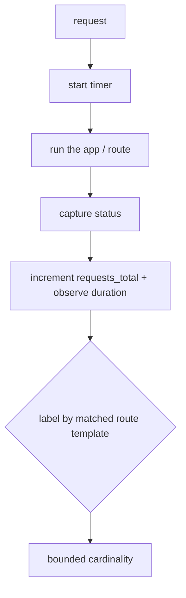

### 4.5 Real-World Analogy
A **turnstile with a stopwatch** at the door. Everyone passes through it (middleware
wraps every request); it clicks a counter and notes how long each visit took. Crucially
it files visits by *department* ("cardiology"), not by *each patient's name* — otherwise
the filing cabinet would need a drawer per person. Departments (route templates) are few;
names (raw paths) are unbounded.

### 4.6 Example
```text
# after 3 calls to /health and 12 to /api/v1/ai/enrich:
http_requests_total{method="GET",route="/health",status="200"} 3
http_requests_total{method="POST",route="/api/v1/ai/enrich",status="200"} 12
http_request_duration_ms_count{method="POST",route="/api/v1/ai/enrich"} 12
```

### 4.7 Common Mistakes
- **Labelling by raw path.** The classic cardinality-explosion bug; use the route
  template.
- **Letting recording throw.** Wrap it; a metrics hiccup must not 500 the request.
- **Timing only success.** Record on *every* outcome (including errors), or your error
  latency is invisible.

### 4.8 Key Takeaways
- `MetricsMiddleware` counts and times every request, labelled by method/route/status.
- Labelling by the **matched route template** keeps cardinality bounded.
- Recording is best-effort and nested inside the correlation-ID middleware.

### 4.9 Self-Assessment
1. What two series does the middleware record per request?
2. What is cardinality explosion, and how is it avoided?
3. Why must recording be best-effort?

### 4.10 Connection to Previous Topics
It reuses the Phase-5 ASGI-middleware pattern (wrapping `send` to capture status) and
sits alongside the correlation-ID and size-limit middleware in the composition root's
middleware stack.

---

## Chapter 5 — The /metrics Endpoint and the Prometheus Format

### 5.1 Introduction
Collected numbers are useless until something can *read* them. The industry-standard way
is a `/metrics` endpoint in the **Prometheus text format**. This chapter explains that
format and how we assemble our exposition.

### 5.2 Prerequisites
- Chapters 3–4. The Phase-5 operational endpoints (`/health`, `/version`).

### 5.3 Detailed Explanation
**Prometheus** is a widely-used monitoring system that works by **scraping**:
periodically it fetches a plain-text page from your service and parses the numbers. The
format is simple — one metric per line:

```text
metric_name{label="value",label2="value2"} 42
```

Counters are one line; a summary expands to several (`_count`, `_sum`, `_min`, `_max`).
`InMemoryMetrics.render_prometheus()` produces exactly this (escaping label values
safely), and an **`ObservabilityService`** (application layer) combines two sources into
the final page:
1. the HTTP series from the metrics sink, and
2. `ai_gateway_*` gauges — calls, cache hits, input/output tokens, and total cost —
   read from the **usage ledger** (the same ledger that enforces per-tenant budgets in
   Phase 2).

The `GET /metrics` endpoint (in the operations router) returns this as `text/plain`. It
is **operational and unauthenticated**, exactly like `/health` — monitoring systems scrape
it without credentials. Critically, it exposes only **aggregates** (totals across the
process), never per-tenant data, so it leaks nothing sensitive. Per-tenant spend stays
internal, queryable only for budget checks.

The `ObservabilityService` depends on two *narrow protocols* (a metrics reporter and a
usage-totals provider), so the application layer composes the page without importing the
concrete in-memory adapter or ledger — ports again.

### 5.4 How It Works
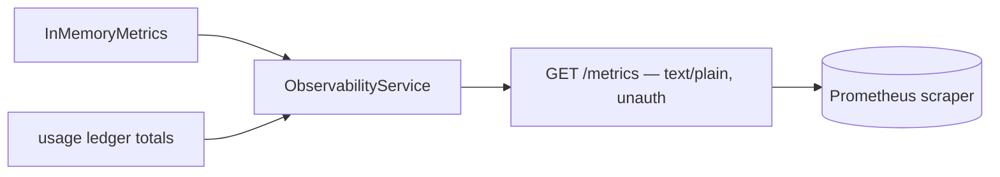

### 5.5 Real-World Analogy
A **utility meter on the outside of a building**. The meter reader (Prometheus) walks up
and reads the dial (`/metrics`) without going inside or needing a key (unauthenticated).
The dial shows totals (kWh used), never who used what in which room (no per-tenant data).

### 5.6 Example
```text
GET /metrics →
http_requests_total{method="POST",route="/api/v1/ai/enrich",status="200"} 12
http_request_duration_ms_sum{method="POST",route="/api/v1/ai/enrich"} 1843.2
ai_gateway_calls_total 12
ai_gateway_input_tokens_total 26188
ai_gateway_cost_usd_total 0.42
```

### 5.7 Common Mistakes
- **Authenticating `/metrics`.** Scrapers expect it open; gate it at the network layer,
  not with a JWT — but never put sensitive data on it.
- **Exposing per-tenant data on the scrape.** Aggregates only; tenant detail is a leak.
- **Inventing a custom format.** Use the Prometheus exposition format so standard tools
  just work.

### 5.8 Key Takeaways
- Prometheus **scrapes** a plain-text `/metrics` page (`name{labels} value`).
- `ObservabilityService` combines HTTP series + `ai_gateway_*` usage gauges from the
  ledger.
- `/metrics` is operational, unauthenticated, and **aggregates only** — no per-tenant data.

### 5.9 Self-Assessment
1. What does "scraping" mean, and what shape is one metric line?
2. Which two sources feed our `/metrics` page?
3. Why is it safe for `/metrics` to be unauthenticated here?

### 5.10 Connection to Previous Topics
It joins the Phase-5 operations router (`/health`, `/version`) and reads the Phase-2
usage ledger. The narrow-protocol composition is the Phase-5 `Container`-protocol trick
applied inside the application layer.

---

# Part II — Evaluation

---

## Chapter 6 — Why "Measured" Beats "Asserted"

### 6.1 Introduction
Observability tells you the system is *running*; **evaluation** tells you it's *good*.
This chapter argues why the product's central promise — grounding — must be a *measured
number*, not merely a set of passing unit tests.

### 6.2 Prerequisites
- Chapter 1. The Phase-4 grounding idea (cite, verify, abstain).

### 6.3 Detailed Explanation
A unit test asserts a *specific* behaviour: "for *this* finding, the answer is
grounded." That's necessary but not sufficient. What a stakeholder actually needs to
know is a **rate**: "across a representative set, what fraction of answers are correctly
grounded? how often do we abstain when we should? how precise are our citations?" A
handful of green tests can't answer that — and worse, quality can *degrade* (a prompt
tweak, a retrieval change) while every existing unit test still passes, because none of
them measures the *aggregate*.

So we build an **evaluation harness**: a program that runs a capability over a **golden
set** (inputs with known-correct expectations) and computes aggregate quality metrics.
This turns "we believe it's grounded" into "grounded rate is 100%, abstention correct,
citation recall 100% — here's the number, and CI fails if it drops." A promise you can
*measure* is a promise you can *defend* and *regression-test*; a promise you only assert
in prose is a hope.

We already had one such harness for **retrieval** (Phase 3: recall@k, precision@k, MRR).
Phase 8 adds the **answer-level** one for grounding — because grounding is *the* product
guarantee, and the thing an auditor will probe hardest.

### 6.4 How It Works
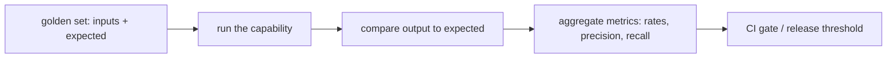

### 6.5 Real-World Analogy
A **school exam vs. a teacher's gut feeling**. A teacher saying "the class seems to get
it" (asserted) is not the same as an exam with an answer key that yields "average 87%,
and these three topics are weak" (measured). You can track the exam score over terms and
notice a decline; you can't track a gut feeling. Evaluation is the exam for your AI.

### 6.6 Example
- *Asserted:* "enrichment is grounded" (one passing test).
- *Measured:* `grounded_rate=1.0, abstention_rate=0.0, citation_recall=1.0` over a
  golden set — a number you can gate on and watch over time.

### 6.7 Common Mistakes
- **Treating unit tests as quality measurement.** They check cases; they don't yield a
  rate.
- **No golden set.** Without known-correct expectations, there's nothing to score
  against.
- **Measuring once, never again.** The value is *tracking* the number across changes.

### 6.8 Key Takeaways
- Unit tests assert specific behaviours; **evaluation** measures an aggregate **rate**.
- A measured promise is defensible and regression-testable; an asserted one is a hope.
- Grounding is the core guarantee, so Phase 8 makes it a measured number.

### 6.9 Self-Assessment
1. Why can quality degrade while all unit tests still pass?
2. What is a golden set?
3. What does turning grounding into a number let you do that prose can't?

### 6.10 Connection to Previous Topics
This extends Phase 3's retrieval eval from *retrieval* to *answers*, and puts a number
on the Phase-4 grounding guarantee (rule 3). Same offline, CI-friendly philosophy.

---

## Chapter 7 — Precision and Recall, from Zero

### 7.1 Introduction
The grounding metrics use two words from information retrieval that everyone should know:
**precision** and **recall**. They're simple, they're often confused, and this chapter
builds both from scratch.

### 7.2 Prerequisites
- The idea of "the right answers" (expected) vs. "what the system produced" (predicted).

### 7.3 Detailed Explanation
Imagine a capability that outputs a *set* of things (here: the control ids it cited), and
there's a known *correct* set (the controls it *should* have cited). Compare them:

- **Precision** = "of what I produced, how much was correct?" =
  `|correct ∩ produced| / |produced|`. Low precision = **noise** (you included wrong
  things).
- **Recall** = "of what was correct, how much did I find?" =
  `|correct ∩ produced| / |correct|`. Low recall = **misses** (you left right things out).

They trade off. Cite *everything* and recall is 100% but precision tanks (lots of noise).
Cite only the one thing you're surest of and precision is high but recall may drop (you
missed others). A good system balances both.

A concrete feel: expected = {A}. If the system cites {A, B}, precision = 1/2 (B is noise)
and recall = 1/1 (found A). If it cites {A}, both are 1.0. If it cites {C}, both are 0.

This is exactly why our grounding eval reports the low precision it does on the tiny
sample corpus: enrichment attaches *every* retrieved citation (broad, high recall), so
against a single expected control precision looks low. That's not a bug in the metric —
it's the metric *honestly telling you* the capability casts a wide citation net, which is
useful to know and to tune.

### 7.4 How It Works
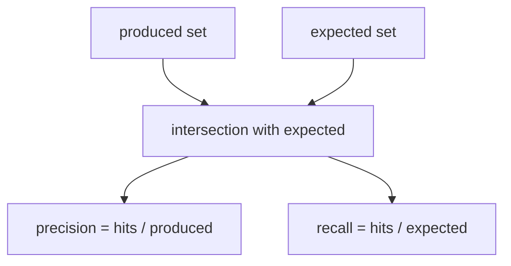

### 7.5 Real-World Analogy
**Fishing with a net.** *Recall* is "of all the tuna in the sea, how many did I catch?"
A huge net catches all the tuna (high recall) but also dolphins and boots (low
*precision* — junk in the haul). A tiny precise hook catches only tuna (high precision)
but misses most of them (low recall). Precision = "how clean is my haul," recall = "how
complete is it."

### 7.6 Example
```text
expected = {PR.AA-01}
cited    = {PR.AA-01, XX.99}   → precision 0.5, recall 1.0
cited    = {PR.AA-01}          → precision 1.0, recall 1.0
cited    = {}                  → abstention (scored separately)
```

### 7.7 Common Mistakes
- **Swapping precision and recall.** Precision's denominator is what you *produced*;
  recall's is what was *correct*.
- **Optimising one only.** 100% recall by citing everything is trivial and useless;
  balance both.
- **Reading low precision as "broken."** It may correctly reflect a wide-net design —
  interpret, don't panic.

### 7.8 Key Takeaways
- **Precision** = correct / produced (noise metric); **recall** = correct / found
  (miss metric).
- They trade off; a good system balances them.
- Our eval's low sample-corpus precision honestly reflects enrichment's broad citation
  set.

### 7.9 Self-Assessment
1. Define precision and recall by their denominators.
2. How do you trivially get 100% recall, and why is it useless?
3. What does low precision with high recall tell you about a system's behaviour?

### 7.10 Connection to Previous Topics
These are the same metrics the Phase-3 retrieval eval used (precision@k / recall@k),
now applied to *citations* instead of *retrieved chunks*.

---

## Chapter 8 — The Grounding Evaluation Harness

### 8.1 Introduction
Now the harness itself: `GroundingEvaluator`, which runs the enrichment capability over a
golden set and computes the grounding metrics. This chapter walks it and its CLI.

### 8.2 Prerequisites
- Chapters 6–7. The Phase-4 `EnrichedFinding` (`explanation`, `citations`,
  `citation_verified`).

### 8.3 Detailed Explanation
A **`GroundingEvalCase`** is one golden example: a `Finding` plus the
`expected_control_ids` a correct answer should cite (empty means the correct behaviour is
to *abstain* — no relevant sources). The **`GroundingEvaluator`** takes an injected
`enrich` function (the enrichment graph's `run`, or the analyst agent's `analyze` — it
doesn't care which) and, over the cases, computes:

- **grounded rate** — fraction with `citation_verified=True` (the authoritative trust
  flag);
- **abstention rate** — fraction that returned the "not covered" answer with no
  citations;
- **citation precision / recall** — cited control ids vs. expected (Chapter 7);
- **mean citations** — average citations per answer.

Being injected an `enrich` function keeps the evaluator decoupled — it's **pure
orchestration**, so it runs offline against the fake gateway and bundled corpus in CI.
The `scripts/evaluate_ai.py` CLI builds the container, ingests the corpus, defines a small
golden set aligned to the NIST controls, runs the evaluator, and prints the metrics
(human-readable or `--json`). That command is the gate: wire it into CI with thresholds
and grounding quality can't silently regress.

### 8.4 How It Works
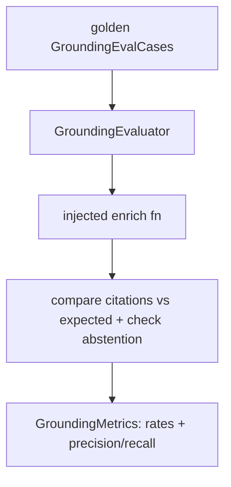

### 8.5 Real-World Analogy
A **standardised patient exam for medical students**. Actors present scripted cases with
known correct diagnoses (the golden set); the student examines each (the capability); a
rubric scores diagnosis accuracy and appropriate "I need more tests" answers (abstention).
The school gets a *score*, not a vibe.

### 8.6 Example
```bash
$ python -m scripts.evaluate_ai
grounded rate:      100.00%
abstention rate:    0.00%
citation precision: 5.56%
citation recall:    100.00%
mean citations:     18.00
```
(High recall + low precision = enrichment cites the whole retrieved context; honest and
useful.)

### 8.7 Common Mistakes
- **Coupling the evaluator to one graph.** Inject the `enrich` function; keep it generic.
- **A golden set that doesn't match the corpus.** Expectations must be controls the corpus
  actually contains, or every case "fails" meaninglessly.
- **Running it once by hand.** Wire it into CI with thresholds so regressions fail the
  build.

### 8.8 Key Takeaways
- `GroundingEvaluator` scores grounded/abstention rates and citation precision/recall over
  golden cases.
- It's injected an `enrich` function — **pure, offline, CI-friendly** orchestration.
- `scripts/evaluate_ai` is the gate that keeps grounding from silently regressing.

### 8.9 Self-Assessment
1. What does an empty `expected_control_ids` signify?
2. Why is the evaluator given an `enrich` *function* rather than a specific graph?
3. How would you stop grounding quality from regressing over time?

### 8.10 Connection to Previous Topics
It measures the Phase-4 grounding guarantee using the Phase-7-style "inject a callable"
decoupling, and mirrors the Phase-3 retrieval eval's structure (cases → run → metrics).

---

# Part III — Release

---

## Chapter 9 — Release Readiness: Mapping Rules to Proof

### 9.1 Introduction
Feature-complete is not release-ready. The final artefact of Phase 8 is a document that,
for every promise the product makes, says *where it's enforced* and *how it's verified*.
This chapter is about that discipline.

### 9.2 Prerequisites
- A rough memory of the eight non-negotiable rules (tenant isolation, no auto-remediation,
  grounding, injection defence, secret hygiene, copyright, audit trail, no autonomous
  change).

### 9.3 Detailed Explanation
`docs/RELEASE_READINESS.md` is a **traceability matrix**: one row per non-negotiable rule,
with two columns that matter most — **enforced in** (the code that makes it true) and
**verified by** (the tests/tools that prove it). For example:

- *Tenant isolation (rule 1)* → enforced in `assert_same_tenant` + every endpoint's tenant
  check + the Core client's re-check → verified by the tenant-isolation and
  `*_cross_tenant_*` tests.
- *Grounding (rule 3)* → enforced in the grounding policy and every grounded graph →
  verified by graph tests **and** the grounding eval.

Why does this matter? Because "we're secure" is not auditable, but "rule 1 is enforced
*here* and proven *by these tests*" is. The document also lists the **quality gates**
(tests+coverage, ruff, black, mypy --strict, import-linter — all green), the
**operational surface** (`/health`, `/metrics`, …), and — crucially — the **deploy-time
settings** that must change from their offline defaults (RS256 JWK, `http` Core client,
`pgvector`, real provider keys, JSON logs). A reviewer signs off by walking the rows, not
by trusting a vibe.

This is the moment the whole architecture pays a final dividend: because each rule was
enforced *structurally* (a policy, a validator, a forced default) rather than by
convention, each row has a concrete, testable answer. A system built on "we'll remember
to" has no such matrix.

### 9.4 How It Works
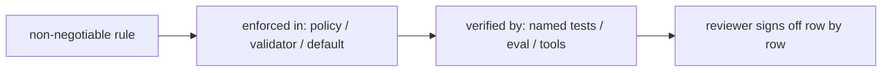

### 9.5 Real-World Analogy
An **aircraft pre-flight checklist**. Pilots don't "feel ready"; they walk a list —
flaps, fuel, instruments — each with a concrete check. The release-readiness doc is that
checklist for the service: every safety-critical promise has a line item and a way to
confirm it, and you don't take off until every line is ticked.

### 9.6 Example
| Rule | Enforced in | Verified by |
| --- | --- | --- |
| 2 — no auto-remediation | `RemediationProposal.approved=False`; `validate_terraform` | remediation tests |
| 7 — audit trail | correlation ID + usage ledger | middleware + ledger tests + `/metrics` |

### 9.7 Common Mistakes
- **"Feature-complete" = "ready."** Readiness is about *proof and operability*, not
  features.
- **Rules enforced by convention.** If a rule isn't structural, its readiness row has no
  solid answer.
- **Forgetting deploy-time settings.** Shipping the offline defaults (dev secret, stub,
  in-memory) to production is a critical miss.

### 9.8 Key Takeaways
- Release readiness is a **traceability matrix**: rule → enforced-in → verified-by.
- It also catalogues quality gates, the ops surface, and the settings that must change for
  production.
- Structural enforcement (from every prior phase) is what gives each row a real answer.

### 9.9 Self-Assessment
1. What two columns matter most in the readiness matrix, and why?
2. Why is a structurally-enforced rule easier to "prove ready" than a convention?
3. Name three settings that must change from their offline defaults for production.

### 9.10 Connection to Previous Topics
Every row points back at earlier phases: policies (1, 4, 7), forced defaults (4),
verifiers (5, 6), and the evals/metrics of this phase. It's the whole build, catalogued.

---

## Chapter 10 — Honest Limitations, and the Whole System in One View

### 10.1 Introduction
The last chapter of the last phase does two things: it states, plainly, what the offline
build *couldn't* fully verify, and it steps back to see the whole eight-phase system as
one coherent design.

### 10.2 Prerequisites
- Everything. This is the panorama.

### 10.3 Detailed Explanation
**Honest limitations.** A mature engineer documents what they *couldn't* prove, not just
what they could. Two are recorded in the readiness doc and ADR-0011:
- The **RS256 verifier** is a from-scratch, standard-library implementation (verification
  only) because the environment's compiled crypto stack was unavailable. It's thoroughly
  tested and, being behind the `TokenVerifier` port, swappable for a library-backed one.
- The **pgvector** similarity ranking runs in a real Postgres, which the offline suite
  can't spin up; the suite tests the adapter's SQL, mapping, and model guard, and the DB
  does the ranking in a real deployment.

Stating these is not weakness — it's the same integrity as abstaining when unsure or
refusing to invent a number. A reviewer who reads "here's exactly what the offline suite
does and doesn't cover" trusts the whole more, not less.

**The whole system.** Step back and the eight phases form one idea repeated at every
level: *depend on abstractions, enforce guarantees structurally, and never let the model
be the source of truth for a checkable fact.*

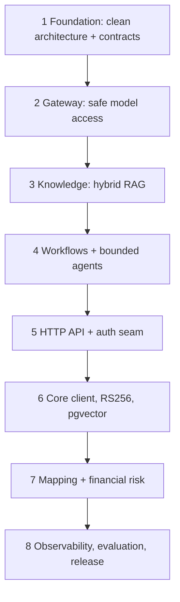

Seven capabilities (explain, ask, remediate, correlate, report, map, price), eight
non-negotiable rules enforced in code, ports at every boundary so production concerns
swap in cleanly, and now — metrics to watch it, evals to measure it, and a checklist to
ship it. The demo became a product.

### 10.4 How It Works (the recurring principle)
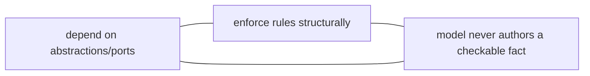

### 10.5 Real-World Analogy
A **finished cathedral**. Each phase laid a course of stone (foundation, walls, roof,
windows), all following one architectural plan. Phase 8 is the final inspection and the
plaque by the door listing who verified what — and an honest note that one gargoyle was
carved from a substitute stone, documented for the next mason.

### 10.6 Example
- *Limitation, stated:* "offline suite tests pgvector SQL/mapping/guard; ranking verified
  in a real Postgres."
- *Whole-system property:* every capability's checkable fact is grounded (corpus) or
  computed (code) — never model-authored.

### 10.7 Common Mistakes
- **Hiding limitations to look finished.** Undocumented gaps are how production breaks;
  state them.
- **Seeing eight isolated phases.** They're one principle applied repeatedly — miss that
  and you miss the design.
- **Thinking "done" means "frozen."** Ports and evals exist precisely so the system keeps
  evolving safely.

### 10.8 Key Takeaways
- Document what the offline build *couldn't* verify — integrity, not weakness.
- The eight phases are **one idea**: abstractions, structural enforcement, no
  model-authored facts.
- The subsystem is now observable, measurable, and releasable — a product, not a demo.

### 10.9 Self-Assessment
1. What are the two documented limitations, and why state them?
2. State the single principle the eight phases share.
3. Why do ports and evals mean "done" isn't "frozen"?

### 10.10 Connection to Previous Topics — and What's Beyond
This closes the arc that began in Phase 1. Beyond this build lie *operational* next steps,
not architectural ones: wire `/metrics` into real dashboards and alerts, run the pgvector
path against a managed Postgres, swap the RS256 verifier for a library-backed adapter,
and set CI thresholds on the grounding eval. The foundation makes each of those a
contained change — which was the entire point.

---

## Appendix A — Glossary

- **Observability** — the ability to understand a running system from its outputs.
- **Logs / traces / metrics** — individual events / one operation's steps / aggregates.
- **Correlation ID** — a per-request id that joins logs, traces, and errors.
- **Metric** — a named measurement; a **counter** only increases, a **summary**/distribution
  tracks count/sum/min/max.
- **Label** — a key/value tag that splits a metric into series.
- **Cardinality** — the number of distinct series; **cardinality explosion** is when
  unbounded label values create too many.
- **Prometheus** — a monitoring system that **scrapes** a `/metrics` text page.
- **MetricsSink** — the domain port (`increment` / `observe`).
- **ObservabilityService** — assembles the `/metrics` exposition from metrics + usage totals.
- **Evaluation harness** — a program that scores a capability over a **golden set**.
- **Golden set** — inputs with known-correct expectations.
- **Precision** — correct / produced (noise metric).
- **Recall** — correct / found (miss metric).
- **Grounded rate / abstention rate** — fraction of answers verified / correctly declined.
- **Release readiness** — a rule → enforced-in → verified-by traceability matrix for sign-off.

## Appendix B — The observability & evaluation surface

| Surface | What it gives you |
| --- | --- |
| `GET /health`, `/health/ready`, `/version` | liveness / readiness / build info |
| `GET /metrics` | Prometheus text: request + AI-usage series (aggregates only) |
| Structured logs (+ correlation id) | per-event story, joinable by request |
| Graph traces (`TraceEvent`) | per-run, per-node timings |
| `application/knowledge/evaluation.py` | retrieval quality (recall@k, precision@k, MRR) |
| `application/evaluation/grounding_eval.py` + `scripts/evaluate_ai` | answer grounding quality |
| `docs/RELEASE_READINESS.md` | rule → enforcement → verification sign-off |

## Appendix C — Self-Assessment Answer Key (brief)

- **Ch. 2:** logs = events, traces = one operation's steps, metrics = aggregates; we had
  logs + traces; the correlation id joins all three.
- **Ch. 4:** `http_requests_total` and `http_request_duration_ms`; label by route
  *template* not raw path to avoid a series per id; best-effort so metrics can't break a
  request.
- **Ch. 7:** precision = hits/produced, recall = hits/expected; cite everything for trivial
  100% recall; low precision + high recall = a wide-net citation design.
- **Ch. 9:** "enforced in" and "verified by" — they make each promise auditable; structural
  enforcement gives a concrete answer; RS256 JWK, `http` Core client, `pgvector` (and real
  keys/JSON logs) must change for production.

---

*End of Phase 8 Study Guide — and of the series. You now understand, from first
principles, how ComplianceIQ is made observable (metrics, traces, correlation IDs), how
its core grounding promise is turned into a measured, gate-able number, and how a mature
team proves a system is ready to ship. Across eight phases you've seen one idea again and
again: depend on abstractions, enforce guarantees structurally, and never let the model be
the source of truth for a checkable fact. That is what turns an AI demo into a compliance
product you can defend.*
