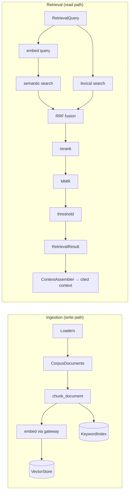

# RAG Pipeline (Phase 3)

**RAG** = *Retrieval-Augmented Generation*: instead of trusting an LLM's memory
(which hallucinates), we **retrieve** relevant, authoritative text from a
knowledge base and make the model answer **only** from that retrieved evidence,
with citations. This document describes ComplianceIQ's RAG subsystem.

## The two halves



## Domain model

- `CorpusDocument` → `ControlSummary` — a registered source (e.g. "NIST CSF 2.0")
  and its controls. **Copyright-safe:** control ids + our own summaries +
  references only; no verbatim standard text (rule 6).
- `Chunk` — one retrievable unit (≈ one control), content-addressed by hash.
- `EmbeddedChunk` — a chunk + its vector + **the producing model's identity**
  (the anti-mismatch guard).
- `ScoredChunk`, `RetrievalQuery`, `RetrievalResult`, `AssembledContext`.

## Ports and adapters

| Port | Default adapter (offline) | Production (Phase 6) |
|------|---------------------------|----------------------|
| `Embedder` | `GatewayEmbedder` (routes to the embedding model) | same |
| `VectorStore` | `InMemoryVectorStore` (cosine) | `PgVectorStore` (pgvector, HNSW) |
| `KeywordIndex` | `InMemoryKeywordIndex` (BM25) | Postgres full-text / same |
| `Reranker` | `LexicalReranker` (term coverage) | cross-encoder model |

## Structure-aware chunking

One control = one chunk, so a retrieved chunk maps to a single citable rule.
Over-long controls split into overlapping sub-chunks. Chunk ids are derived from
content, so re-ingestion is **idempotent**; every chunk carries a
`corpus_version` for clean re-indexing. (See ADR-0006.)

## Hybrid retrieval, step by step

1. **Embed the query** — records the embedding model (the store rejects a query
   embedded with a different model than the corpus).
2. **Semantic search** — cosine similarity over vectors, metadata pre-filtered.
3. **Lexical search** — BM25 over tokens, metadata pre-filtered.
4. **Reciprocal Rank Fusion** — merge by rank (robust to score-scale differences).
5. **Rerank** — re-score fused candidates by deep query relevance.
6. **MMR** — pick a diverse, non-redundant top-k.
7. **Threshold** — drop chunks below `min_score`; empty result → **abstain**.

## Context assembly

`ContextAssembler` packs ranked chunks into a token-budgeted block, deduplicates
by content hash, numbers each block (`[1]`, `[2]`), and emits the matching
`Citation`s — the raw material for verified, grounded answers in Phase 4.

## Embedding-model-identity guard

Query and document vectors are only comparable when produced by the **same**
model. `EmbeddedChunk` records the model; `InMemoryVectorStore` refuses to mix
models on write and rejects a mismatched query on read
(`EmbeddingModelMismatchError`). This turns a silent, catastrophic bug into a
loud, tested failure. (See Phase 2 study guide, Chapter 4.)

## Evaluation

Retrieval is measured **in isolation** so failures are attributable:
`evaluate_retrieval` computes **recall@k**, **precision@k**, **MRR**, and
**hit-rate** over a golden set of queries with known-relevant control ids. Runs
offline against the fake/stub embedder in CI.

## Running it

```bash
# Autoloaded at startup by default (docker compose up seeds the corpus).
# Or ingest manually:
python -m scripts.ingest_corpus                  # idempotent
python -m scripts.ingest_corpus --replace        # clean re-index
```

## Copyright policy

The bundled corpus (`corpus/frameworks/*.json`) holds public regulatory summaries
(Loi 05-20, DNSSI, NIST CSF) and, for copyrighted standards (ISO/IEC, SOC 2),
control identifiers + our own summaries + references only — never verbatim
normative text. See `docs/COMPLIANCE_NOTES.md`.
