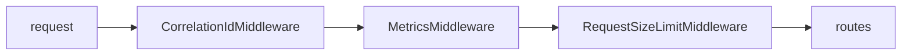
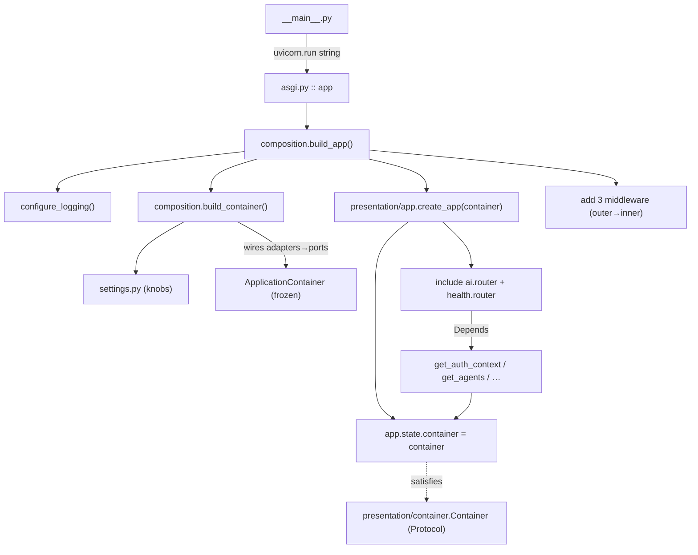

<!--
  ComplianceIQ — 1-Week Technical Mastery Program
  DAY 1 — Architecture & Boot
  Every code excerpt and line number is verified against the actual repository.
-->

# Day 1 — Architecture & Boot

> **Prerequisite:** [`PHASE_0_CODEBASE_MAP.md`](PHASE_0_CODEBASE_MAP.md) (the map).
>
> **Today's goal.** Be able to answer, without guessing: *"What happens, in order,
> from `python -m complianceiq` until the server is ready to accept a request?"* — and
> *"How does a router get a service without the presentation layer importing
> infrastructure?"* By tonight you should be able to read `composition.py` like a
> story and explain every block's purpose and consequence.
>
> **Scope.** The wiring and boot only. We do **not** open the gateway internals, the
> graphs, or RAG today — those are Days 2–3. Today is the skeleton that holds them.

---

## 1 — What you need to learn today

1. **The layers as boundaries** — not folders, but *permission zones* enforced by CI.
2. **Dependency Injection here** = *ports* (domain interfaces) + a *composition root*
   (`composition.py`) + a *Container protocol* (presentation's structural view).
3. **The boot sequence** — the exact call chain `__main__ → asgi → build_app →
   build_container → create_app → middleware → lifespan`.
4. **How configuration enters** and becomes the switch between offline and production.
5. **Why the app can be built offline, in tests, and in prod from one function.**

---

## 2 — Exact files to study (in this order)

| # | File | Lines | Why |
|---|---|---|---|
| 1 | `src/complianceiq/__main__.py` | ~30 | the process entry |
| 2 | `src/complianceiq/asgi.py` | ~15 | the ASGI object servers import |
| 3 | `src/complianceiq/infrastructure/config/settings.py` | read §1 + skim | the knobs |
| 4 | `src/complianceiq/composition.py` | **all 359** | the wiring (today's centrepiece) |
| 5 | `src/complianceiq/presentation/app.py` | 73 | the FastAPI factory |
| 6 | `src/complianceiq/presentation/container.py` | ~110 | the DI surface (protocol + `Depends`) |
| 7 | `.importlinter` | all | the enforced dependency rule |

---

## 3 — What to understand in each file

- **`__main__.py`** — it is *thin* on purpose. It loads settings and hands a string
  (`"complianceiq.asgi:app"`) to Uvicorn. It does **not** build anything itself.
- **`asgi.py`** — creates the module-level `app = build_app()`. Servers (Uvicorn,
  Gunicorn) import objects *by string*, so there must be a stable
  `complianceiq.asgi:app`.
- **`settings.py`** — `Settings(BaseSettings)`, `frozen=True`, `env_prefix="CIQ_"`.
  Secrets are `SecretStr`. `get_settings()` is `@lru_cache`d (one instance per process).
- **`composition.py`** — three public functions: `build_agent_suite()` (helper),
  `build_container()` (wires adapters→ports into a frozen `ApplicationContainer`),
  `build_app()` (logging + container + FastAPI + middleware).
- **`app.py`** — `create_app(container)` knows only the `Container` *protocol*; it
  stores the container on `app.state`, registers error handlers, includes the two
  routers, and defines the lifespan that runs startup hooks.
- **`container.py`** — the `Container` Protocol (what presentation needs) plus the
  `Depends` providers that pull services off `request.app.state.container`.
- **`.importlinter`** — the four contracts that make all of the above non-negotiable.

---

## 4 — Code walkthrough

### 4.1 The entry: `__main__.py` → `asgi.py`

```python
# __main__.py
def main() -> None:
    settings = get_settings()
    uvicorn.run(
        "complianceiq.asgi:app",   # ← import-by-string; Uvicorn imports asgi.py
        host=settings.host,
        port=settings.port,
        log_config=None,           # we own logging via structlog
        access_log=False,          # access logs come from CorrelationIdMiddleware
    )
```

```python
# asgi.py
from complianceiq.composition import build_app
app = build_app()                  # ← module-level: built once at import
```

**Teaching points**
- `__main__` builds *nothing*. It only names the ASGI object and starts the server.
  This keeps the entry trivial and testable and means the *same* `app` is used by
  Uvicorn, Gunicorn, or a test harness.
- `access_log=False` + `log_config=None` are deliberate: logging is **owned** by the
  app (structlog), and request access logging is done by `CorrelationIdMiddleware` so
  every access line carries the correlation id. *(This is why you won't see Uvicorn's
  default access log.)*

### 4.2 Configuration: `settings.py`

```python
class Settings(BaseSettings):
    model_config = SettingsConfigDict(
        env_prefix="CIQ_", env_file=".env", extra="ignore", frozen=True,
    )
    app_name: str = "complianceiq-ai"
    environment: Environment = Environment.LOCAL
    log_json: bool = True
    port: int = Field(default=8000, ge=1, le=65535)
    request_max_bytes: int = Field(default=1_048_576, ge=1_024)
    jwt_audience: str = "complianceiq"
    # … + gateway_*, retrieval_*, knowledge_*, agent_*, core_*, vector_store, jwt_* …
```

**Teaching points**
- **Field name → env var:** `request_max_bytes` ← `CIQ_REQUEST_MAX_BYTES`. `env_prefix`
  does the mapping. `extra="ignore"` means unknown env vars don't crash the app.
- **`frozen=True`:** settings are immutable after load — you can't accidentally mutate
  config at runtime.
- **Fail-fast:** validation runs *once* at construction. A bad `CIQ_PORT=70000` raises
  at boot, not at request time.
- **The five offline→prod switches live here** (values, not code): `llm_primary_provider`
  (`fake`), `jwt_public_key` (empty→HS256), `core_client` (`stub`), `vector_store`
  (`memory`), `log_json`.

### 4.3 The centrepiece: `composition.py`

Read it as four movements.

#### Movement 1 — the imports (lines 14–81): the map made concrete
This is the *only* file that imports from every layer. Notice the shape of the imports:

```python
# from domain — PORTS (interfaces):
from complianceiq.domain.ports.auth import TokenVerifier          # line 46
from complianceiq.domain.ports.core import CoreClient             # line 48
from complianceiq.domain.ports.metrics import MetricsSink         # line 50
# from infrastructure — ADAPTER BUILDERS (implementations):
from complianceiq.infrastructure.auth import (build_rs256_verifier,
    build_token_verifier, looks_like_jwk)                          # lines 51-55
from complianceiq.infrastructure.core import build_core_client    # line 58
from complianceiq.infrastructure.observability import InMemoryMetrics  # line 78
# from presentation — the app factory:
from complianceiq.presentation.app import create_app              # line 81
```

> **The pattern to see:** it imports **port types** (to *annotate* the container) and
> **adapter builders** (to *construct* implementations). The container is typed by
> interfaces; the values are concretions. That's dependency injection in one file.

#### Movement 2 — the container shape (lines 84–104)

```python
@dataclass(frozen=True, slots=True)
class ApplicationContainer:
    settings: Settings
    clock: Clock                    # ← port type
    app_info: AppInfo
    readiness_service: ReadinessService
    ai_gateway: AIGateway
    knowledge: KnowledgeStack
    agents: AgentSuite
    token_verifier: TokenVerifier   # ← port type (HS256 or RS256 concrete inside)
    core_client: CoreClient         # ← port type (stub or http concrete inside)
    observability: ObservabilityService
    metrics: MetricsSink            # ← port type
```

**Teaching points**
- `frozen=True, slots=True`: the wired graph is immutable and memory-tight. Once built,
  nobody swaps a service at runtime.
- The field **types are ports** (`Clock`, `TokenVerifier`, `CoreClient`, `MetricsSink`).
  The *values* will be concrete adapters. Anyone holding the container sees only the
  interface. This is what the presentation `Container` protocol later mirrors.

#### Movement 3 — `build_container()` (lines 197–307): the system in one function
This is the single most important function to internalise today. It builds, **in order**:

| Order | Block (line) | What it constructs | Port(s) behind it |
|---|---|---|---|
| 0 | 207–209 | `settings` (or load) + `SystemClock()` | `Clock` |
| 1 | 216–238 | **AI gateway**: `GatewayConfig`, `build_providers()`, `build_routing_table()`, `usage_ledger`, then `AIGateway(...)` with rate limiter, cache, ledger, sleeper | `LLMProvider`, gateway ports |
| 2 | 243 | **Knowledge stack**: `build_knowledge_stack(settings, ai_gateway)` (vector store, keyword index, retriever, ingestion, assembler) | `VectorStore`, `KeywordIndex`, `Embedder`, `Reranker` |
| 3 | 248 | **Agents**: `build_agent_suite(...)` → 6 graphs + 6 agents + tools | (uses gateway + knowledge) |
| 4 | 254–269 | **Token verifier**: *if* `looks_like_jwk(public_key)` → RS256 **else** HS256 | `TokenVerifier` |
| 5 | 274 | **Core client**: `build_core_client(settings)` (stub or http) | `CoreClient` |
| 6 | 279–280 | **Observability**: `InMemoryMetrics()` + `ObservabilityService(metrics, usage_ledger)` | `MetricsSink` |
| 7 | 283–287 | **Readiness**: one `LLMProviderHealthProbe` per provider + `VectorStoreHealthProbe` | `HealthProbe` |
| — | 289–307 | `AppInfo` + assemble & return the frozen `ApplicationContainer` | — |

The block you should be able to *recite* is the verifier selection (the offline↔prod
switch made visible):

```python
# lines 254–269
public_key = settings.jwt_public_key.get_secret_value()
token_verifier: TokenVerifier
if looks_like_jwk(public_key):                       # JWK present → production
    token_verifier = build_rs256_verifier(
        public_key_jwk=public_key, issuer=settings.jwt_issuer,
        audience=settings.jwt_audience, clock=clock)
else:                                                # else → dev/offline
    token_verifier = build_token_verifier(
        secret=settings.jwt_hs256_secret.get_secret_value(),
        issuer=settings.jwt_issuer, audience=settings.jwt_audience, clock=clock)
```

> **Why this shape matters:** *nothing else in the codebase knows or cares* whether
> auth is HS256 or RS256. Both satisfy `TokenVerifier`. The decision lives here, in one
> `if`. That is the entire payoff of the port pattern — visible in six lines.

**Dependency order is not arbitrary.** The gateway is built first because the knowledge
stack embeds *through* the gateway (`build_knowledge_stack(settings, ai_gateway)`, line
243), and the agents run *over* both (line 248). You cannot reorder these — later
things consume earlier things. Tracing that chain is a great whiteboard answer.

#### Movement 4 — `build_app()` (lines 310–359): from container to ASGI app

```python
def build_app(settings=None) -> FastAPI:
    settings = settings or get_settings()
    configure_logging(level=settings.log_level, json_output=settings.log_json)  # 318
    logger = get_logger("composition"); logger.info("starting_service", ...)    # 320
    container = build_container(settings)                                       # 328

    async def _seed_corpus() -> None:                                           # 333-348
        # autoload the bundled corpus at startup if the store is empty
        ...

    app = create_app(container, on_startup=[_seed_corpus])                      # 350

    # Middleware — registered inner→outer; executes outer→inner:
    app.add_middleware(RequestSizeLimitMiddleware, max_bytes=settings.request_max_bytes)  # 355
    app.add_middleware(MetricsMiddleware, metrics=container.metrics)            # 356
    app.add_middleware(CorrelationIdMiddleware)                                 # 357
    return app
```

**The middleware ordering gotcha (memorize this):** Starlette runs middleware in the
**reverse** order of registration — *the last one added is the outermost*. So the code
above yields, from outside in:



Why this exact order (from the code comment on lines 352–354):
- **CorrelationId outermost** → a correlation id is bound *before* anything else, so
  every metric, log line, and error envelope carries it.
- **Metrics next** → it times the *whole* route (including size-limit rejections) and
  reads the final status.
- **RequestSizeLimit innermost of the three** → it rejects oversize bodies right before
  the app.

**The lifespan / startup hook** (lines 333–350): `build_app` defines `_seed_corpus` and
passes it to `create_app(..., on_startup=[...])`. Presentation runs it inside the ASGI
**lifespan** but has no idea what it does — the *composition root* owns the behaviour,
presentation owns the *timing*. This is the same inversion as everything else.

### 4.4 The factory: `presentation/app.py`

```python
def create_app(container: Container, *, on_startup=None) -> FastAPI:
    @asynccontextmanager
    async def lifespan(_app):
        for hook in list(on_startup or []):
            await hook()                       # runs _seed_corpus at startup
        yield
    app = FastAPI(lifespan=lifespan, title="ComplianceIQ AI Service", ...)
    app.state.container = container            # ← the DI handoff
    register_exception_handlers(app)           # domain error → HTTP mapping
    app.include_router(health.router)          # /health /health/ready /version /metrics
    app.include_router(ai.router)              # /api/v1/ai/*
    return app
```

**Teaching points**
- **`container: Container`** — note the type is the *protocol* (from
  `presentation/container.py`), **not** `ApplicationContainer`. Presentation depends on
  a shape, not on the concrete class in `composition.py`. (That's how the
  presentation↔infrastructure independence contract stays satisfied: presentation never
  imports composition.)
- **`app.state.container = container`** — the single handoff point. Every request can
  reach services via `request.app.state.container`, but only through typed `Depends`
  providers (next file), never by touching globals.

### 4.5 The DI surface: `presentation/container.py`

```python
class Container(Protocol):
    @property
    def app_info(self) -> AppInfo: ...
    @property
    def readiness_service(self) -> ReadinessService: ...
    @property
    def agents(self) -> AgentSuite: ...
    @property
    def token_verifier(self) -> TokenVerifier: ...
    @property
    def core_client(self) -> CoreClient: ...
    @property
    def observability(self) -> ObservabilityService: ...

def get_container(request: Request) -> Container:
    return request.app.state.container

def get_agents(request: Request) -> AgentSuite:
    return get_container(request).agents

def get_auth_context(request: Request) -> AuthContext:
    header = request.headers.get("Authorization")
    if not header or not header.startswith("Bearer "):
        raise AuthenticationError("missing or malformed Authorization header")
    token = header[len("Bearer "):].strip()
    return get_container(request).token_verifier.verify(token)
```

**Teaching points**
- **`Container` is a `Protocol` (structural typing).** The concrete
  `ApplicationContainer` in `composition.py` *happens to* expose these attributes, so it
  satisfies the protocol **without** presentation importing it. This is the trick that
  lets presentation and infrastructure stay independent while still sharing wired
  services.
- The `Depends` providers (`get_agents`, `get_auth_context`, …) are the *only* way a
  route obtains a service. A router never reads `app.state` directly.
- `get_auth_context` is where a raw header becomes a verified `AuthContext` — the entry
  of the security story (Day 4).

---

## 5 — How the files connect



The whole of Day 1 is this graph. Everything downstream (gateway, graphs, agents) hangs
off the `ApplicationContainer` node.

---

## 6 — Hands-on exercises

Do them in order. Solutions are in §9 — try first.

**E1 (trace).** Open `composition.py::build_container` and write down, in order, the
seven services it constructs and the one port each hides behind. (No peeking at the
table in §4.3 first.)

**E2 (prove the boundary).** Add `import httpx` to the top of
`src/complianceiq/domain/policies/grounding.py`, then run `lint-imports`. Record which
contract fails and the exact message. **Revert the change.**

**E3 (prove DI).** In `presentation/routers/ai.py`, find how the `enrich` handler gets
the `AgentSuite`. Which provider function? Which attribute on the container? Trace it to
the line in `composition.py` that set that attribute.

**E4 (flip a switch, offline).** Without editing code, make the app select the **RS256**
verifier instead of HS256. *Hint:* it's one setting, and `tests/auth_helpers.py` has a
`rsa_public_jwk()` you can look at for the shape. Confirm by adding a temporary `print(type(container.token_verifier).__name__)` at the end of `build_container` and running:
```bash
CIQ_JWT_PUBLIC_KEY='{"n":"…","e":"AQAB"}' python -c "from complianceiq.composition import build_container; build_container()"
```
(Use the real JWK string from `tests/auth_helpers.rsa_public_jwk()`.) **Remove the print
after.**

**E5 (boot observation).** Start the server (`python -m complianceiq`) and watch the
startup logs. Find the `starting_service` line and the `corpus_autoloaded` line. What
are `documents` and `chunks` equal to? Which function emitted each?

**E6 (middleware order).** From the code in `build_app`, draw the outer→inner middleware
order and explain in one sentence why `CorrelationIdMiddleware` must be outermost.

---

## 7 — Questions you should be able to answer tonight

1. Why does `__main__.py` build nothing itself?
2. What does `frozen=True` on both `Settings` and `ApplicationContainer` buy you?
3. Why is `build_container` ordered gateway → knowledge → agents and not the reverse?
4. How does `create_app` receive services without importing `composition` or
   `infrastructure`?
5. What is the difference between `ApplicationContainer` (composition) and `Container`
   (presentation), and why are there two?
6. In what order do the three middleware run, and why that order?
7. Where, exactly, is the single decision that makes auth HS256 vs RS256?
8. What runs during the ASGI lifespan startup, and who supplied that behaviour?

---

## 8 — End-of-day quiz (closed-book)

1. Fill in the boot chain: `python -m complianceiq` → **___** → **___** → **___** →
   `create_app` → middleware → lifespan.
2. True/false: the presentation layer imports `ApplicationContainer`. Explain.
3. Name the four import-linter contracts and which one E2 tripped.
4. Which line number range in `composition.py` is the "system in one function," and what
   are its first and last constructed services?
5. If you set `CIQ_VECTOR_STORE=pgvector` but leave everything else default, which
   function's behaviour changes, and does `build_app` change? (Why / why not?)
6. Why is `access_log=False` set in `__main__.py`?

---

## 9 — Solutions & evaluation notes

**E1.** Order (lines): clock → **AI gateway** (`LLMProvider` + gateway ports) →
**knowledge stack** (`VectorStore`/`KeywordIndex`/`Embedder`/`Reranker`) → **agents**
(no new port; consumes gateway+knowledge) → **token verifier** (`TokenVerifier`) →
**core client** (`CoreClient`) → **observability/metrics** (`MetricsSink`) → readiness
probes (`HealthProbe`). *Self-check:* if you wrote "agents before knowledge," re-read
line 248 — agents take `knowledge=` as an argument, so knowledge must exist first.

**E2.** Fails the **`domain-is-pure`** contract ("Domain imports neither inner-project
layers nor adapter frameworks"). `lint-imports` reports the broken contract as BROKEN
with the offending import chain `complianceiq.domain.policies.grounding -> httpx`. This
is a *build* failure, not a runtime one — that's the point.

**E3.** `enrich()` declares `agents: AgentSuite = Depends(get_agents)`. `get_agents`
(in `container.py`) returns `get_container(request).agents`, which is the `agents` field
set on `ApplicationContainer` at `composition.py:302` (`agents=agents`), itself built by
`build_agent_suite(...)` at line 248.

**E4.** Set `CIQ_JWT_PUBLIC_KEY` to a JWK JSON string. `build_container` (lines 254–256)
calls `looks_like_jwk(...)`, which is true, so it builds `RS256TokenVerifier`. Your print
should show `RS256TokenVerifier`. With the var unset it prints `HS256TokenVerifier`.
*Evaluation:* if it still printed HS256, your JWK string wasn't valid JSON with `n`/`e`
keys — check `looks_like_jwk` in `rs256_verifier.py`.

**E5.** `starting_service` is emitted by `build_app` (line 321). `corpus_autoloaded` is
emitted by the `_seed_corpus` hook (line 343) *after* ingestion. `documents`/`chunks`
are the counts from the bundled corpus ingest (they'll be small, single-digit documents,
tens of chunks — the exact numbers depend on `corpus/frameworks/*.json`). *Evaluation:*
if you saw `corpus_autoload_empty`, your `CIQ_KNOWLEDGE_CORPUS_DIR` didn't resolve.

**E6.** Outer→inner: `CorrelationId → Metrics → RequestSizeLimit → routes`.
CorrelationId must be outermost so the correlation id is bound *before* any inner
middleware, route, log line, or error handler runs — otherwise a request rejected by an
inner middleware (e.g. 413 from size-limit) would have no correlation id in its error
envelope.

**Quiz key (brief):** 1) `__main__.py` → `asgi.py` → `build_app`. 2) False — it imports
the `Container` *protocol*; the concrete container is passed in at runtime and satisfies
the protocol structurally. 3) core-layers, domain-is-pure, application-is-framework-free,
adapters-are-independent; E2 tripped **domain-is-pure**. 4) lines **197–307**; first =
AI gateway, last = readiness/observability (the return assembles them). 5)
`_build_vector_store` inside `build_knowledge_stack` changes (picks `PgVectorStore`);
`build_app` does **not** change — it only calls `build_container`, which is why the swap
is a config change. 6) because access logging is done by `CorrelationIdMiddleware` (so
every access line carries the correlation id) — two access logs would be redundant.

---

## 10 — Defense drill (answer out loud; I'll grade in our session)

- *"Walk me from `python -m complianceiq` to a ready server."*
- *"Why a composition root instead of constructing services where they're used?"*
- *"How do you switch from the fake model to Anthropic without touching application
  code? Show me the exact seam."*
- *"Presentation needs the agents but can't import infrastructure. How does it get
  them?"*
- *"If I removed `composition.py`, what breaks that the four layers can't fix
  themselves?"*

> **You are here:** Day 1 done → you can read the wiring and trace the boot.
> **Next: Day 2 — Domain & the Gateway** (entities, ports, policies; then
> `ai_gateway.py` deeply: routing → cache → budget → injection → retry → circuit-breaker
> → cost).
