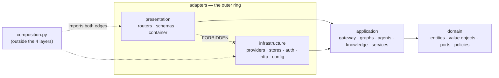
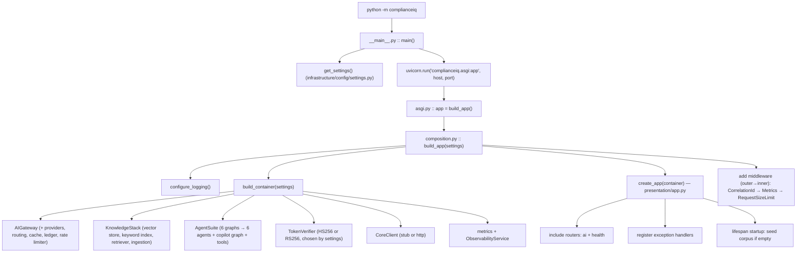
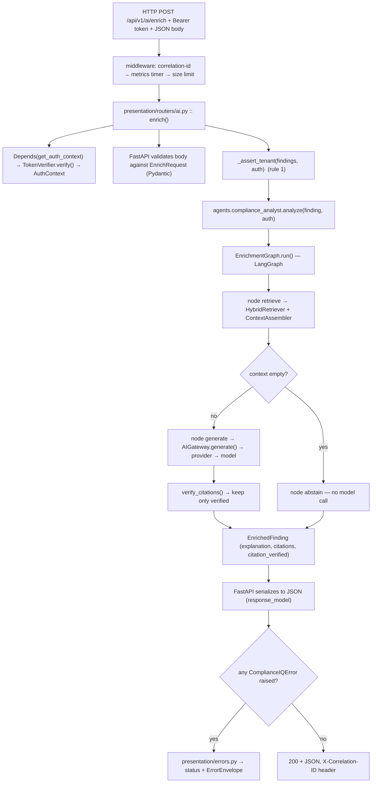

<!--
  ComplianceIQ — 1-Week Technical Mastery Program
  PHASE 0 — Complete Codebase Map
  Everything in this document is verified against the actual repository.
-->

# Phase 0 — Complete Codebase Map

> **Purpose of this phase.** Before reading a single line of business logic, build the
> *mental index* of the repository: the layers, the dependency rule, where every kind
> of file lives, how the app boots, and which 20% of the code carries 80% of the
> meaning. By the end you should be able to open **any** file and instantly know
> (a) which layer it's in, (b) who is allowed to call it, (c) what it is allowed to
> touch, and (d) whether it's worth your time this week.
>
> Everything below is verified against the repository as it currently stands. Where a
> statement is an inference of intent rather than a hard fact, it is marked *(inferred)*.

---

## Table of Contents

1. [30-second orientation](#1--30-second-orientation)
2. [The one idea that explains the whole design](#2--the-one-idea-that-explains-the-whole-design)
3. [The real directory tree (annotated)](#3--the-real-directory-tree-annotated)
4. [The four layers & the dependency rule](#4--the-four-layers--the-dependency-rule)
5. [Per-directory responsibility map](#5--per-directory-responsibility-map)
6. [Entry points & the boot sequence](#6--entry-points--the-boot-sequence)
7. [The request lifecycle (skeleton)](#7--the-request-lifecycle-skeleton)
8. [The critical 20%: MUST / SHOULD / RECOGNIZE / LOW](#8--the-critical-20-must--should--recognize--low)
9. [Read these 12 files first (ordered)](#9--read-these-12-files-first-ordered)
10. [How to run, test, and evaluate](#10--how-to-run-test-and-evaluate)
11. [What is NOT in this repo (boundaries)](#11--what-is-not-in-this-repo-boundaries)
12. [MUST-MASTER file cards](#12--must-master-file-cards)
13. [Repository facts sheet](#13--repository-facts-sheet)
14. [Phase 0 warm-up exercises](#14--phase-0-warm-up-exercises)
15. [The week ahead](#15--the-week-ahead)

---

## 1 — 30-second orientation

- **What it is.** The **AI subsystem** of an enterprise GRC (Governance, Risk &
  Compliance) platform. It ingests compliance **findings** and returns explainable AI
  artefacts: explain a finding, answer a question, propose (never apply) a fix,
  correlate findings into systemic risk, draft a report, map controls across
  frameworks, and price risk in Moroccan Dirham (MAD).
- **Stack.** Python 3.11 · Pydantic v2 · FastAPI · LangGraph · structlog · httpx.
- **Size.** ~**10,655 LOC** in `src/complianceiq/`, **282 tests** (all offline).
- **Shape.** Clean Architecture — **4 layers** (`domain`, `application`,
  `infrastructure`, `presentation`) + one wiring file, `composition.py`.
- **Boot.** `python -m complianceiq` → `__main__.py` → Uvicorn serves
  `complianceiq.asgi:app` → `asgi.py` calls `build_app()` in `composition.py`.
- **Runs with zero setup.** Default config = a deterministic **fake** LLM, **in-memory**
  vector/keyword stores, **HS256** dev auth, and a **stub** Core client. No API keys,
  no database, no network required. The 282 tests run on this same offline path.

---

## 2 — The one idea that explains the whole design

> **Every external dependency — the LLM, the database, the clock, the JWT verifier,
> the HTTP client to the Core Service, the metrics sink — is hidden behind a `Port`
> (an abstract interface in `domain/ports/`). Each port has one or more `Adapter`s in
> `infrastructure/`. The concrete adapter is chosen exactly once, in
> `composition.py`.**

Consequences you will see everywhere:

- The **domain** and **application** layers never import a vendor SDK. They speak only
  to ports. That's why the whole core is unit-testable with fakes, offline.
- Switching from offline to production (`fake`→`anthropic`, `memory`→`pgvector`,
  `HS256`→`RS256`, `stub`→`http` Core) is a **settings change**, not a code change —
  because only the adapter behind the port changes.
- When you want to know "what actually runs," you read one function:
  `build_container()` in `composition.py`.

This is the mental model to carry into every file: *is this a port (interface), an
adapter (implementation), an orchestrator (application), or the wiring (composition)?*

---

## 3 — The real directory tree (annotated)

```text
LAB-15-SECURITY/
├── src/complianceiq/
│   ├── __init__.py            # package version (__version__ = "0.1.0")
│   ├── __main__.py            # `python -m complianceiq` → uvicorn.run(asgi:app)     [ENTRY]
│   ├── asgi.py                # module-level `app = build_app()` (Uvicorn imports this)
│   ├── composition.py         # THE composition root: build_container() + build_app()  [359 LOC]
│   │
│   ├── domain/                # ⬛ INNERMOST — pure business core. No I/O, no frameworks.   (49 files)
│   │   ├── _base.py           #   FrozenModel base: frozen=True, extra="forbid"
│   │   ├── exceptions.py      #   ComplianceIQError hierarchy (typed, code+message+details)  [175 LOC]
│   │   ├── entities/          #   the CONTRACTS (shared with the Core Service):
│   │   │   ├── finding.py     #     Finding, EnrichedFinding
│   │   │   ├── remediation.py #     RemediationProposal (approved forced False)
│   │   │   ├── mapping.py     #     ControlMapping, MappedControl
│   │   │   ├── financial.py   #     FinancialRiskAssessment (min/max MAD range)
│   │   │   ├── risk.py        #     CorrelatedRisk
│   │   │   ├── copilot.py     #     CopilotAnswer
│   │   │   ├── report.py      #     ReportDraft
│   │   │   ├── resource.py    #     NormalizedResource
│   │   │   ├── score.py       #     ComplianceScore
│   │   │   ├── auth.py        #     AuthContext (sub, tenant_id, roles)
│   │   │   └── pagination.py  #     Page[T]
│   │   ├── value_objects/     #   Citation, enums (Framework/Severity/RiskDomain/…), identifiers
│   │   ├── ports/             #   ★ INTERFACES: llm, gateway, knowledge, auth, core, clock, metrics, health
│   │   ├── policies/          #   ★ PURE RULES: grounding, tenant_isolation, prompt_safety, iac_safety, financial_model
│   │   ├── knowledge/         #   chunks, chunking, similarity, metadata, queries, documents
│   │   ├── llm/               #   messages, models, requests, responses, usage (vendor-free LLM vocabulary)
│   │   └── prompts/           #   template.py — PromptTemplate (versioned, {{var}}, validated)
│   │
│   ├── application/           # ⬛ USE CASES — orchestrates ports. Imports domain only.        (45 files)
│   │   ├── app_info.py        #   AppInfo DTO (name/version/env)
│   │   ├── gateway/           #   ★ ai_gateway.py [426 LOC] + routing, retry, circuit_breaker, keys, config
│   │   ├── knowledge/         #   retrieval, ingestion, fusion (RRF+MMR), context_assembly, embedder, evaluation, config
│   │   ├── graphs/            #   ★ 6 LangGraph workflows + _common:
│   │   │   ├── _common.py     #     traced_node, SYSTEM_GROUNDED, retrieve_and_assemble, finding_summary
│   │   │   ├── enrichment.py  #     Finding → EnrichedFinding (canonical grounded graph)  [171 LOC]
│   │   │   ├── copilot.py     #     question → CopilotAnswer
│   │   │   ├── remediation.py #     Finding → RemediationProposal
│   │   │   ├── report.py      #     [EnrichedFinding] → ReportDraft
│   │   │   ├── mapping.py     #     Finding → ControlMapping
│   │   │   └── financial.py   #     Finding → FinancialRiskAssessment
│   │   ├── agents/            #   ★ base.py (BoundedAgent + ToolSession) [173 LOC] + 6 agents + suite.py
│   │   ├── tools/             #   registry, budget, corpus_tools (the search_corpus tool)
│   │   ├── prompts/           #   registry.py — serves PromptTemplates by id/version
│   │   ├── evaluation/        #   grounding_eval.py — answer-grounding harness
│   │   └── services/          #   health.py (readiness), observability.py (metrics exposition)
│   │
│   ├── infrastructure/        # ⬛ ADAPTERS — concrete implementations of ports. Imports domain (+ frameworks). (42 files)
│   │   ├── clock.py           #   SystemClock
│   │   ├── config/settings.py #   ★ all CIQ_* env vars, SecretStr, defaults (the offline↔prod switch)
│   │   ├── providers/         #   anthropic_provider, openai_compatible, fake, registry  (LLMProvider adapters)
│   │   ├── gateway/           #   cache, rate_limiter, ledger (cost), sleeper, health  (gateway-port adapters)
│   │   ├── knowledge/         #   vector_store_memory, pgvector_store, psycopg_executor,
│   │   │                      #   keyword_index_memory, reranker_lexical, loaders, factory, health
│   │   ├── auth/              #   jwt_base (shared pipeline), jwt_verifier (HS256), rs256_verifier
│   │   ├── core/              #   stub_client, http_client, factory  (CoreClient adapters)
│   │   ├── observability/     #   metrics_memory (counters/summaries + Prometheus render)
│   │   ├── http/              #   middleware (correlation-id, size-limit), metrics_middleware
│   │   ├── logging/           #   setup (structlog), context (correlation-id binding)
│   │   └── prompts/loader.py  #   reads prompts/*.prompt → PromptTemplate
│   │
│   └── presentation/          # ⬛ HTTP surface — imports application only, NEVER infrastructure.  (8 files)
│       ├── app.py             #   create_app(): FastAPI factory + lifespan + router include
│       ├── container.py       #   ★ Container Protocol + FastAPI Depends providers (get_auth_context, get_agents, …)
│       ├── errors.py          #   the ONE domain-exception → HTTP-status mapping
│       ├── schemas.py         #   request envelopes + error/health/version wire models  [169 LOC]
│       └── routers/
│           ├── ai.py          #   the 8 /api/v1/ai/* capability endpoints  [168 LOC]
│           └── health.py      #   /health, /health/ready, /version, /metrics
│
├── tests/                     # 282 offline tests; helpers: conftest.py, fakes.py, factories.py,
│                              #   ai_helpers.py, auth_helpers.py; unit/{agents,application,domain,
│                              #   graphs,infrastructure,knowledge,presentation}/
├── prompts/*.prompt           # 7 versioned prompt assets
├── corpus/frameworks/*.json   # copyright-safe control summaries (NIST, ISO, SOC2, Loi 05-20, DNSSI)
├── migrations/*.sql           # pgvector schema (0001_knowledge_pgvector.sql)
├── scripts/                   # ingest_corpus.py, evaluate_ai.py
├── docs/                      # ARCHITECTURE, API, RAG, AGENTS, PROMPTS, OBSERVABILITY,
│                              #   RELEASE_READINESS, CORE_SERVICE_HANDOFF, 14 ADRs, 8 study guides,
│                              #   mastery/ (this program)
├── .importlinter             # the 4 architecture contracts (enforced in CI)
├── .github/workflows/ci.yml   # lint · format · types · architecture · tests · pip-audit · docker build
├── .pre-commit-config.yaml    # local pre-commit hooks
├── pyproject.toml             # ruff, black, mypy, pytest, coverage config
├── Dockerfile · docker-compose.yml · .env.example · requirements.txt · requirements-dev.txt
└── CHANGELOG.md · README.md · LICENSE · CODEOWNERS
```

★ = the files carrying the most conceptual weight (your MUST-MASTER set — §8, §12).

---

## 4 — The four layers & the dependency rule

If you memorize one diagram this week, this is it. **Dependencies point inward only.**



**The four contracts, enforced mechanically by `.importlinter`** (they fail CI if
broken — this is not a style guide, it's a build gate):

| Contract (name in `.importlinter`) | Rule |
|---|---|
| `core-layers` | `application` may import `domain`; never the reverse. |
| `domain-is-pure` | `domain` imports **no** project layer and **no** framework (fastapi, starlette, uvicorn, sqlalchemy, anthropic, langgraph, langchain, httpx, reportlab). |
| `application-is-framework-free` | `application` imports **no** outer layer and **no** adapter framework (fastapi, anthropic, …). *(LangGraph is permitted in application — it's the workflow engine.)* |
| `adapters-are-independent` | `presentation` and `infrastructure` must **not** import each other. |

**Why this is the master key.** The folder a file lives in tells you its powers and
its limits before you read a line:

- `domain/` → pure. No HTTP, no DB, no LLM SDK, no `datetime.now()` (uses the `Clock`
  port). Seeing `import httpx` here would be a bug.
- `application/` → orchestrates via **ports** (abstract). Never `import fastapi` or
  `import anthropic`. May use LangGraph.
- `infrastructure/` → concrete adapter; **may** import frameworks/SDKs; must never
  import `presentation`.
- `presentation/` → HTTP only; reaches services through the `Container` protocol,
  never through `infrastructure`.
- Need to combine both edges? **Only** `composition.py` may.

> **Defense soundbite:** "The dependency rule is enforced by `lint-imports` in CI. If
> `domain` ever imported a framework, the build fails. That's what keeps the core pure
> and testable for the life of the project."

---

## 5 — Per-directory responsibility map

| Directory | Layer | Responsibility (why it exists) | Depends on | Depended on by | What belongs here |
|---|---|---|---|---|---|
| `domain/entities` | domain | The **published contracts** (`Finding`, `EnrichedFinding`, `RemediationProposal`, `ControlMapping`, `FinancialRiskAssessment`, `CorrelatedRisk`, `CopilotAnswer`, `ReportDraft`, `AuthContext`, `Page[T]`). Shared with the Core Service. | `_base`, value_objects | every layer | frozen Pydantic models + validators |
| `domain/value_objects` | domain | Small typed values: `Citation`; enums (`Framework`, `Severity`, `RiskDomain`, `ComplianceStatus`, `CloudProvider`); identifiers (`TenantId`, `ControlId`, `NonEmptyStr`). | stdlib, pydantic | entities, policies | enums, constrained types |
| `domain/ports` | domain | ★ The **interfaces** the application depends on: `LLMProvider`, gateway ports (`RateLimiter`/`ResponseCache`/`UsageLedger`/`Sleeper`), `VectorStore`/`KeywordIndex`/`Embedder`/`Reranker`, `TokenVerifier`, `CoreClient`, `Clock`, `MetricsSink`, `HealthProbe`. | domain only | application + infra adapters | ABCs / Protocols only — no logic |
| `domain/policies` | domain | ★ Pure business **rules**, individually tested: `grounding` (cite/verify/abstain), `tenant_isolation` (`assert_same_tenant`), `prompt_safety` (`scan_for_injection`, `wrap_untrusted`), `iac_safety` (`validate_terraform`), `financial_model` (`estimate_exposure`). | value_objects, entities | graphs, agents, gateway, routers | pure, deterministic functions |
| `domain/knowledge` | domain | RAG vocabulary & math: `Chunk`/`EmbeddedChunk`/`ScoredChunk`, `chunking`, `similarity` (cosine/token-set), `metadata` + `MetadataFilter`, `queries`, `documents`. | value_objects | application/knowledge, infra stores | pure data + math |
| `domain/llm` | domain | Vendor-free LLM vocabulary: `messages`, `models` (`TaskClass`, `ProviderName`, `ModelSpec`), `requests`, `responses` (`Completion`, `TokenUsage`), `usage` (`UsageEvent`). | value_objects | gateway, providers | pure DTOs |
| `domain/prompts` | domain | `PromptTemplate` — versioned, declares variables, strict `{{ var }}` render. | value_objects, exceptions | prompt registry/loader | one class |
| `application/gateway` | application | ★ `AIGateway` — the single choke point for every model call (routing, retry, circuit breaker, cache, per-tenant budget, injection scan, cost accounting) + `routing`, `retry`, `circuit_breaker`, `keys`, `config`. | domain ports/llm | graphs, agents, embedder | use-case orchestration |
| `application/knowledge` | application | The RAG pipeline: `retrieval` (`HybridRetriever`), `ingestion`, `fusion` (RRF + MMR), `context_assembly`, `embedder` (`GatewayEmbedder`), retrieval `evaluation`, `config`. | domain ports/knowledge | graphs, tools, composition | orchestration over stores |
| `application/graphs` | application | ★ The **6 LangGraph workflows** (one per capability) + `_common` (shared node wrapper, grounding system prompt, retrieval helper). | gateway, knowledge, prompts, policies | agents, composition | typed state graphs |
| `application/agents` | application | ★ `BoundedAgent` + `ToolSession` (the guardrails) + the 6 agents + `AgentSuite` (the handle). | graphs, tools, policies, clock | composition, presentation (via Container) | bounded orchestration |
| `application/tools` | application | Typed tool `registry` (`Tool`, `ToolRegistry`), `budget` (`AgentBudget`), `corpus_tools` (`search_corpus`). | knowledge, domain | agents | tool definitions |
| `application/prompts` | application | `PromptRegistry` — indexes templates, serves latest/pinned version, returns `id@version` for traces. | domain/prompts | graphs, agents, composition | one class |
| `application/evaluation` | application | `grounding_eval` — scores grounded/abstention rate + citation precision/recall over a golden set. | entities, policies | scripts, tests | eval harness |
| `application/services` | application | `health` (readiness aggregation over probes), `observability` (metrics + usage exposition). | domain ports | composition, routers | app services |
| `infrastructure/providers` | infra | LLM adapters: `anthropic_provider`, `openai_compatible` (httpx), `fake` (deterministic), `registry` (builds providers + routing from settings). | `LLMProvider` port, SDKs | composition | port adapters |
| `infrastructure/gateway` | infra | Gateway-port adapters: `cache` (content-addressed), `rate_limiter`, `ledger` (per-tenant cost + totals), `sleeper`, `health`. | gateway ports | composition | in-memory adapters |
| `infrastructure/knowledge` | infra | Store adapters: `vector_store_memory` (default), `pgvector_store` + `psycopg_executor` (prod), `keyword_index_memory` (BM25), `reranker_lexical`, `loaders` (corpus JSON), `factory` (selects store), `health`. | knowledge ports | composition | store adapters |
| `infrastructure/auth` | infra | JWT verifiers: `jwt_base` (shared claim pipeline), `jwt_verifier` (HS256, dev), `rs256_verifier` (RS256, prod). | `TokenVerifier` port | composition | stdlib crypto adapters |
| `infrastructure/core` | infra | Core Service clients: `stub_client` (seeded, offline), `http_client` (httpx, token pass-through), `factory`. | `CoreClient` port, httpx | composition | REST client |
| `infrastructure/observability` | infra | `metrics_memory` — counters + summaries + Prometheus text render. | `MetricsSink` port | composition | metrics adapter |
| `infrastructure/http` | infra | ASGI middleware: `middleware` (correlation-id + access log, request-size limit), `metrics_middleware`. | metrics port, starlette | composition | middleware |
| `infrastructure/config` | infra | `settings.py` — all `CIQ_*` env vars, `SecretStr` secrets, defaults, `get_settings()`. | pydantic-settings | composition, `__main__` | config |
| `infrastructure/logging` | infra | `setup` (structlog config), `context` (bind/clear correlation id). | structlog | runtime everywhere | logging |
| `infrastructure/prompts` | infra | `loader` — parses `prompts/*.prompt` frontmatter+body → `PromptTemplate`. | domain/prompts | composition | file loader |
| `presentation/routers` | presentation | `ai.py` (8 capability endpoints), `health.py` (ops + `/metrics`). | application via `Container` | `app.py` | FastAPI routers |
| `presentation/container.py` | presentation | ★ `Container` **Protocol** (what presentation needs) + all `Depends` providers (`get_auth_context`, `get_agents`, `get_core_client`, `get_bearer_token`, `get_observability`, …). | application types, domain ports | routers | DI surface |
| `presentation/errors.py` | presentation | The **one** place domain exceptions map to HTTP statuses + `ErrorEnvelope`. | domain exceptions, schemas | `app.py` | exception handlers |
| `presentation/schemas.py` | presentation | Request envelopes (`EnrichRequest`, `AskRequest`, …) + error/health/version wire models. | domain entities, enums | routers, errors | wire DTOs |
| `presentation/app.py` | presentation | `create_app()` — builds FastAPI, registers exception handlers, includes routers, runs startup hooks (corpus seed). | container protocol, routers | composition | app factory |
| `composition.py` | (root) | ★ `build_container()` wires every adapter to its port; `build_app()` builds FastAPI + attaches middleware. The only file allowed to import both edges. | **everything** | `asgi`, `__main__`, tests | the composition root |

---

## 6 — Entry points & the boot sequence

There are two ways in; both converge on `composition.py`.

### A) The server (dev / production)



**Key fact to memorize:** `build_container()` in `composition.py` *is* the system in one
function — every concrete choice (which LLM, which store, which verifier, which Core
client) is made there. Read it top to bottom and you know exactly what runs.

### B) The tests

`tests/conftest.py` builds the same app from test `Settings` and yields a FastAPI
`TestClient`. So the tests exercise the **real** wiring (same `build_app`), just with
offline adapters. There is no separate "test app."

---

## 7 — The request lifecycle (skeleton)

The detail comes on Day 3; here is the skeleton so the map has motion. Example:
`POST /api/v1/ai/enrich`.



You will trace this **with exact files and functions** on Day 3, and the security
branch of it (auth, tenant, injection) on Day 4.

---

## 8 — The critical 20%: MUST / SHOULD / RECOGNIZE / LOW

You have 7 days. Spend them proportional to conceptual weight, not line count.

### 🔴 MUST MASTER — the ~12 files that *are* the system
| File | Why non-negotiable |
|---|---|
| `composition.py` | The wiring. Understand this and you understand what runs. |
| `application/gateway/ai_gateway.py` | The LLM choke point; every safety/cost/reliability policy lives here. |
| `application/graphs/enrichment.py` | The canonical grounded workflow; every other graph is a variation of it. |
| `application/graphs/_common.py` | Shared node wrapper (trace + timeout) + `SYSTEM_GROUNDED` + `retrieve_and_assemble`. |
| `application/agents/base.py` | `BoundedAgent` + `ToolSession` — the agent guardrails. |
| `application/knowledge/retrieval.py` | The hybrid RAG read path. |
| `domain/policies/grounding.py` | cite/verify/abstain — the core promise, ~30 lines. |
| `domain/policies/prompt_safety.py` | Injection scan + `wrap_untrusted` — the trust boundary. |
| `presentation/routers/ai.py` | The 8 endpoints — auth → tenant → agent. |
| `presentation/container.py` | How a request obtains auth + services (`Depends`). |
| `presentation/errors.py` | How a domain exception becomes an HTTP status. |
| `infrastructure/config/settings.py` | Every knob; the offline↔prod switch. |

### 🟠 SHOULD UNDERSTAND — know how they work, don't memorize every line
`domain/entities/finding.py` · `domain/exceptions.py` · the other 5 graphs
(`copilot`, `remediation`, `report`, `mapping`, `financial`) · the 6 agents ·
`application/tools/{registry,corpus_tools,budget}.py` ·
`infrastructure/auth/{jwt_base,rs256_verifier}.py` · `infrastructure/core/*` ·
`infrastructure/knowledge/vector_store_memory.py` · `infrastructure/providers/fake.py` ·
`infrastructure/http/middleware.py` · `application/services/observability.py`.

### 🟢 SHOULD RECOGNIZE — know it exists + its purpose
`infrastructure/knowledge/pgvector_store.py` + `psycopg_executor.py` ·
`infrastructure/providers/{anthropic_provider,openai_compatible}.py` ·
`application/knowledge/{fusion,ingestion,context_assembly,evaluation}.py` ·
`infrastructure/observability/metrics_memory.py` ·
`application/evaluation/grounding_eval.py` · `domain/knowledge/*` · `domain/llm/*` ·
`application/gateway/{routing,retry,circuit_breaker}.py`.

### ⚪ LOW PRIORITY — skim; know the pattern, not the detail
`__init__.py` re-export files · `app_info.py` · `clock.py` · `logging/*` ·
`gateway/keys.py` · most `factory.py` files · `scripts/*` · `migrations/*` ·
`domain/prompts/template.py` (read once, done).

---

## 9 — Read these 12 files first (ordered)

This order follows a request's life, so each file sets up the next. This is your
Day-1 reading list.

1. `infrastructure/config/settings.py` — the vocabulary of knobs.
2. `composition.py` — `build_container()`, then `build_app()`.
3. `presentation/app.py` — how the app is assembled.
4. `presentation/routers/ai.py` — the entry points.
5. `presentation/container.py` — auth + dependency injection.
6. `presentation/errors.py` — failure mapping.
7. `domain/entities/finding.py` — the central contract.
8. `application/agents/base.py` — the guardrails.
9. `application/graphs/enrichment.py` — the canonical workflow.
10. `application/graphs/_common.py` — node machinery + `SYSTEM_GROUNDED`.
11. `application/gateway/ai_gateway.py` — the choke point.
12. `domain/policies/grounding.py` + `domain/policies/prompt_safety.py` — the guarantees.

---

## 10 — How to run, test, and evaluate

All commands are real and offline-safe.

```bash
# install (app + dev tooling)
pip install -r requirements.txt -r requirements-dev.txt

# run the service (fake model, in-memory stores; corpus autoloads at startup)
python -m complianceiq          # → http://localhost:8000/docs  /health  /health/ready  /metrics

# —or— the full stack (AI service + a pgvector Postgres)
docker compose up

# ALL tests + coverage gate (this is exactly what CI runs)
python -m pytest --cov=complianceiq --cov-report=term-missing

# one file / one test by name
python -m pytest tests/unit/graphs/test_graphs.py
python -m pytest tests/unit/graphs/test_graphs.py -k enrichment -q

# the FIVE quality gates (identical to .github/workflows/ci.yml)
python -m ruff check src tests
python -m black --check src tests
python -m mypy src/complianceiq/domain src/complianceiq/application
lint-imports
python -m pytest --cov=complianceiq

# AI grounding evaluation (answer quality, offline)
python -m scripts.ingest_corpus            # idempotent
python -m scripts.evaluate_ai --json
```

> **Fact / gotcha:** always call `python -m pytest` / `python -m mypy`. Bare
> `pytest`/`mypy` may resolve to a different environment on this machine and silently
> use the wrong interpreter.

---

## 11 — What is NOT in this repo (boundaries)

Knowing the boundaries is half of defending the design:

- **No cloud scanning, no rule engine, no JWT *issuance*.** Those belong to the **Core
  Service** (the other team). This service *consumes* findings over REST and only
  *verifies* tokens. See `docs/CORE_SERVICE_HANDOFF.md`.
- **No live database or real LLM on the default path.** The offline adapters are the
  default; production adapters (`pgvector`, `anthropic`/`openai_compatible`, `http`
  Core, RS256) exist and are selected by settings.
- **Two documented limitations** *(inferred deliberate; see ADR-0011)*: the RS256
  verifier is a dependency-free, standard-library implementation (verification only);
  and the pgvector **similarity ranking** runs in a real Postgres — the offline suite
  tests the adapter's SQL/row-mapping/model-guard, not end-to-end ranking.

---

## 12 — MUST-MASTER file cards

A compact "card" per MUST-MASTER file: what it does, its key symbols, inputs/outputs,
who calls it, what it depends on, and what to memorize vs. skip. (Full line-by-line
walkthroughs come on Days 1–5.)

### `composition.py`  *(root · wiring)*
- **Does:** builds the whole object graph and the FastAPI app.
- **Key symbols:** `ApplicationContainer` (frozen dataclass holding every service),
  `build_agent_suite()`, `build_container()`, `build_app()`.
- **Inputs:** `Settings`. **Outputs:** `ApplicationContainer` / `FastAPI`.
- **Called by:** `asgi.py`, `__main__.py`, tests. **Depends on:** all four layers.
- **Memorize:** the *order* of `build_container()` — gateway → knowledge → agents →
  auth → core → observability → container. **Skip:** exact adapter constructor args.

### `application/gateway/ai_gateway.py`  *(application · the heart, 426 LOC)*
- **Does:** one method, `generate(request, auth)`, wraps every model call in policy:
  rate-limit → budget → cache lookup → injection scan → route → retry/backoff →
  circuit-breaker → provider call → cost accounting → cache store.
- **Key symbols:** `AIGateway`, `GatewayLogger` (Protocol).
- **Inputs:** `LLMRequest` + `AuthContext`. **Outputs:** `Completion` (or a typed error).
- **Called by:** every graph and the risk agent. **Depends on:** gateway ports +
  `LLMProvider` + routing + policies.
- **Memorize:** the ordered pipeline and *which failure raises which exception*.
  **Skip:** the exact backoff arithmetic.

### `application/graphs/enrichment.py`  *(application · canonical workflow)*
- **Does:** `Finding → EnrichedFinding` as a 3-node LangGraph:
  `retrieve → (empty? abstain : generate) → END`.
- **Key symbols:** `EnrichmentState` (TypedDict), `EnrichmentGraph` with `_retrieve`,
  `_generate`, `_abstain`, `_route`, `run()`.
- **Memorize:** the abstain branch never calls the model; `citation_verified =
  all_verified and not context.is_empty`. **Skip:** MemorySaver/thread-id mechanics.

### `application/graphs/_common.py`  *(application · node machinery)*
- **Does:** `traced_node()` (wraps every node with timeout → `WorkflowError`, logging,
  one `TraceEvent`); `SYSTEM_GROUNDED` (the grounding system prompt);
  `retrieve_and_assemble()`; `finding_summary()`.
- **Memorize:** every graph node is wrapped by `traced_node`; that's where timeouts and
  traces come from. **Skip:** the exact log field names.

### `application/agents/base.py`  *(application · guardrails)*
- **Does:** `BoundedAgent` (holds an allow-list + budget + clock) opens a `ToolSession`
  per run; every `session.call(tool, args)` enforces, in order: allow-list →
  wall-clock budget → iteration budget → loop detection → arg validation →
  **injection scan of tool output**.
- **Memorize:** the five checks and their order; budgets are **per run**. **Skip:** the
  signature-hashing detail of loop detection.

### `application/knowledge/retrieval.py`  *(application · RAG read path)*
- **Does:** `HybridRetriever.retrieve(query)` = embed → vector search + BM25 search →
  RRF fuse → rerank → MMR diversify → score-threshold abstain.
- **Memorize:** the pipeline order and that an empty result is the **abstain signal**.
  **Skip:** RRF/MMR constants.

### `domain/policies/grounding.py`  *(domain · the promise)*
- **Does:** `verify_citations(claimed, available) → CitationVerification`
  (verified iff (framework, control_id) present in available; dedups);
  `ABSTENTION_TEXT`. ~30 lines — **read the whole file**.

### `domain/policies/prompt_safety.py`  *(domain · trust boundary)*
- **Does:** `scan_for_injection(text) → InjectionScanResult` (regex patterns +
  severity); `wrap_untrusted(text)` (fences retrieved content in sentinels).
- **Memorize:** untrusted content is always `wrap_untrusted`-ed before entering a
  prompt; the gateway scans input, the agent scans tool output.

### `presentation/routers/ai.py`  *(presentation · entry)*
- **Does:** the 8 endpoints. Each: `Depends(get_auth_context)` → `_assert_tenant(...)`
  → call the agent → return the domain model.
- **Memorize:** the three-beat shape (auth → tenant → agent) is identical on every
  finding-taking endpoint.

### `presentation/container.py`  *(presentation · DI)*
- **Does:** the `Container` **Protocol** (what presentation needs from composition) and
  the `Depends` providers, incl. `get_auth_context` (reads `Authorization: Bearer`,
  verifies via `TokenVerifier`).
- **Memorize:** presentation depends on a *protocol* (a shape), never on the concrete
  container or infrastructure.

### `presentation/errors.py`  *(presentation · failure mapping)*
- **Does:** one exception handler maps each `ComplianceIQError` subclass to a status +
  renders `ErrorEnvelope`; unknown errors → generic 500; correlation id attached.
- **Memorize:** the status table (401 authn, 403 tenant, 422 validation, 400 unsafe,
  500 workflow, 502 provider). **Skip:** the envelope field plumbing.

### `infrastructure/config/settings.py`  *(infra · the knobs)*
- **Does:** all `CIQ_*` env vars with defaults and `SecretStr` secrets; `get_settings()`
  (cached).
- **Memorize:** the five offline↔prod switches (`llm_primary_provider`,
  `jwt_public_key`, `core_client`, `vector_store`, `log_json`). **Skip:** every
  individual gateway/retrieval tuning constant.

---

## 13 — Repository facts sheet

| Fact | Value (verified) |
|---|---|
| Version | `0.1.0` (`src/complianceiq/__init__.py`) |
| Source LOC | ~10,655 across `src/complianceiq` |
| Files per layer | domain 49 · application 45 · infrastructure 42 · presentation 8 |
| Tests | 282 passing, offline |
| Largest files | `ai_gateway.py` 426 · `composition.py` 359 · `pgvector_store.py` 242 · `openai_compatible.py` 203 · `exceptions.py` 175 · `agents/base.py` 173 · `anthropic_provider.py` 172 · `enrichment.py` 171 |
| AI endpoints (`/api/v1/ai`) | `enrich`, `enrich/by-ids`, `ask`, `remediate`, `correlate`, `map`, `financial`, `report` |
| Ops endpoints | `/health`, `/health/ready`, `/version`, `/metrics`, `/docs`, `/openapi.json` |
| Architecture contracts | 4, in `.importlinter`, enforced by `lint-imports` in CI |
| CI stages | lint (ruff) · format (black) · types (mypy, domain+application) · architecture (lint-imports) · tests+coverage · pip-audit · docker build |
| Prompt assets | 7 `.prompt` files in `prompts/` |
| Corpus frameworks | NIST CSF, ISO 27001, SOC 2, Loi 05-20, DNSSI |
| ADRs | 14 (`0000`–`0013`) in `docs/ADR/` |

---

## 14 — Phase 0 warm-up exercises

Do these from the map above — they force the index to stick. (Answers are *not* given
here; check yourself against the repo, and I'll evaluate your answers when we do the
interactive sessions.)

**Recall**
1. Name the four layers and the single rule about how they may import each other.
2. Which file is the *only* one allowed to import both `presentation` and
   `infrastructure`, and why?
3. Where does the Anthropic SDK actually get imported — which layer, which file — and
   why not in `ai_gateway.py`?

**Locate (use ripgrep / your editor)**
4. Find the function that turns an `Authorization: Bearer …` header into an
   `AuthContext`. Which file, which function, which port does it call?
5. Find the exact line that forces a remediation proposal to `approved=False`.
6. Find where the abstain branch is chosen in the enrichment graph (function + return
   value).

**Predict (reason from the map, then verify)**
7. You add `import httpx` to a file in `domain/`. Which CI step fails, and what's the
   error class of the failure?
8. You call `POST /api/v1/ai/enrich` with a token for `tenant-a` but a finding whose
   `tenant_id` is `tenant-b`. What status code comes back, and which function raised it?
9. If `CIQ_JWT_PUBLIC_KEY` is set to a valid RSA JWK, which verifier does
   `build_container()` select, and what happens to an HS256 token after that?

**Do (hands-on)**
10. Run the whole suite and the five gates. Then run *only* the enrichment graph tests.
11. Start the server offline and hit `/health`, `/metrics`, and `/docs`.
12. Open `build_container()` and list, in order, the seven things it constructs.

---

## 15 — The week ahead

Phase 0 is the map. The rest gets progressively deeper and **active** (you trace,
predict, modify, break, and defend — I won't just narrate):

- **Day 1 — Architecture & boot:** the 4 layers, `composition.py` line-by-line, the
  request lifecycle skeleton. *(Phase 0 is its prerequisite — you're here.)*
- **Day 2 — Domain & the gateway:** entities, ports, policies; then `ai_gateway.py`
  deeply (routing → cache → budget → injection → retry → circuit-breaker → cost).
- **Day 3 — RAG & the workflows:** the retrieval pipeline + the enrichment graph traced
  end-to-end; how the other 5 graphs are variations.
- **Day 4 — Security & grounding:** the trust boundaries — auth (HS256/RS256), tenant
  isolation, injection defense, grounding/verify, IaC safety.
- **Day 5 — Agents & tools:** `BoundedAgent`/`ToolSession` guardrails, the 6 agents, the
  deterministic financial model.
- **Day 6 — Testing & debugging:** the test architecture (fakes/factories/conftest),
  run/break/fix drills, the debugging playbook.
- **Day 7 — Rebuild-from-scratch & mock defense:** you reconstruct the architecture; I
  interview you (without handing you answers first); we produce your Defense Cheat
  Sheet.

Each day ships as its own `docs/mastery/DAY_N_*.md` file with: what to learn → exact
files → guided walkthrough → how they connect → hands-on exercises → questions you must
answer → an end-of-day quiz.

> **You are here:** Phase 0 complete. Next: **Day 1 — Architecture & Boot.**
