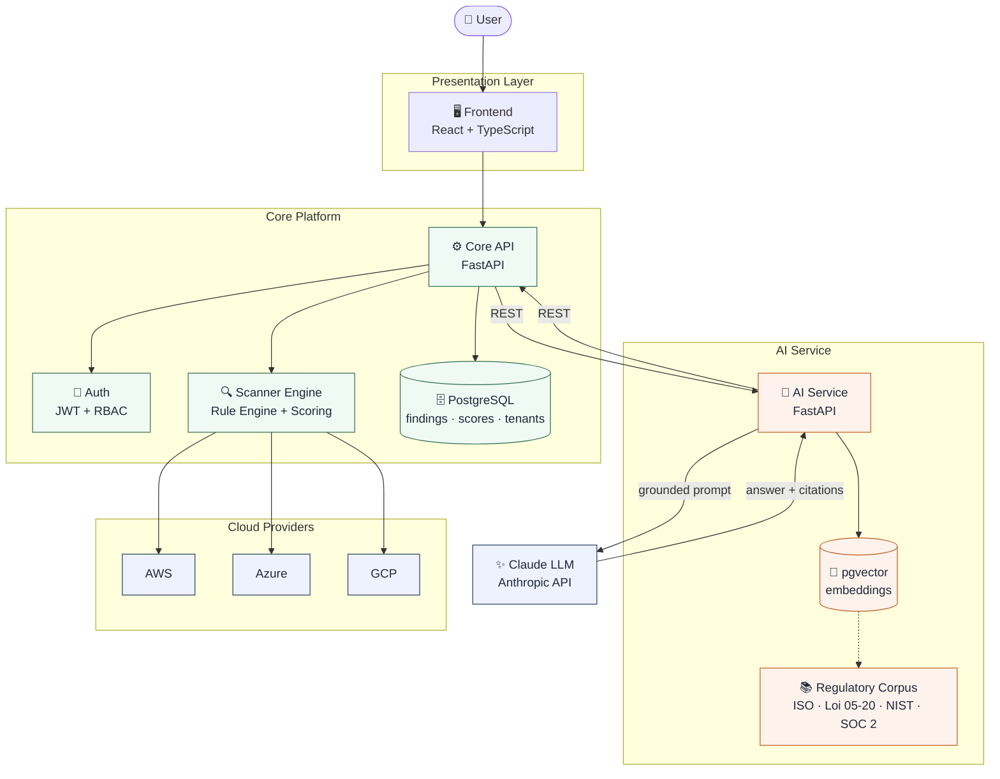
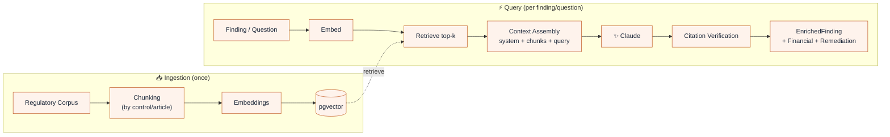
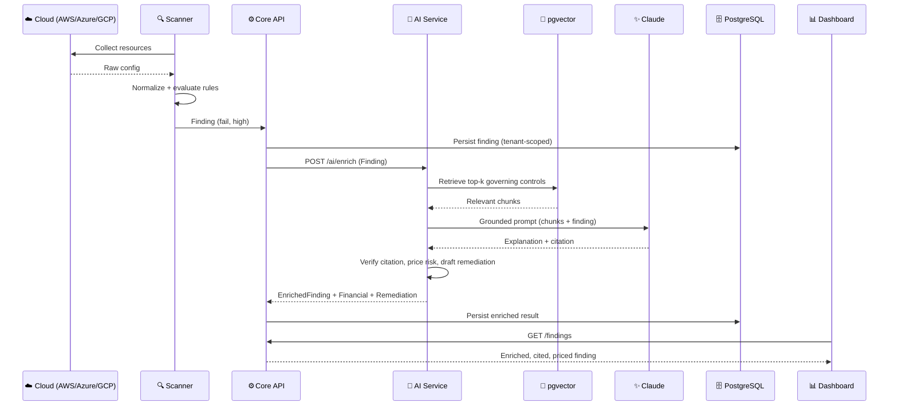

<div align="center">

# 🛡️ ComplianceIQ

### AI-Powered Multi-Cloud Governance, Risk & Compliance (GRC) Platform

*Discover cloud misconfigurations across AWS, Azure & GCP — then explain, price, map, and fix them with AI you can trust.*

<!-- Badges are placeholders — wire them to your CI/registry when ready -->


</div>

---

## 📑 Table of Contents

<details>
<summary>Click to expand</summary>

1. [Introduction](#1--introduction)
2. [Project Vision](#2--project-vision)
3. [Key Features](#3--key-features)
4. [System Architecture](#4--system-architecture)
5. [High-Level Workflow](#5--high-level-workflow)
6. [Technology Stack](#6--technology-stack)
7. [Project Structure](#7--project-structure)
8. [AI Architecture](#8--ai-architecture)
9. [Microservices Overview](#9--microservices-overview)
10. [Data Flow](#10--data-flow)
11. [API Overview](#11--api-overview)
12. [Installation](#12--installation)
13. [Configuration](#13--configuration)
14. [Development Workflow](#14--development-workflow)
15. [Testing](#15--testing)
16. [Security](#16--security)
17. [Roadmap](#17--roadmap)
18. [Contributors](#18--contributors)
19. [Future Improvements](#19--future-improvements)
20. [License](#20--license)

</details>

---

## 1. 📖 Introduction

**ComplianceIQ** is an enterprise platform that continuously audits an organization's cloud environments against security standards and regulations — and, crucially, **explains every gap in plain language with verifiable citations**, estimates its **financial impact**, and proposes **Infrastructure-as-Code remediation**.

### The problem it solves

Cloud environments drift toward insecurity. A single misconfigured storage bucket, over-permissive IAM role, or unencrypted database can expose an entire company. Proving and maintaining compliance (ISO 27001, Loi 05-20/DNSSI, NIST, SOC 2) is traditionally slow, manual, and expensive — consultants reading configurations line-by-line against dense standards.

### Why cloud compliance is hard

- **Scale & drift:** thousands of resources change daily across multiple clouds.
- **Multi-cloud complexity:** AWS, Azure, and GCP each model security differently.
- **Framework translation:** mapping a technical finding to the *exact* control in a 100-page standard is tedious and error-prone.
- **Prioritization:** teams drown in findings with no sense of which ones actually matter (or what they could cost).

### Why AI improves the process

A Large Language Model, grounded in the real regulatory text via **Retrieval-Augmented Generation (RAG)**, can read a finding and instantly produce a clear, **cited** explanation, map it to the governing control, translate it into a financial exposure range, and draft a remediation — work that would take a human auditor hours per finding.

> [!NOTE]
> ComplianceIQ never lets the AI guess. Every AI answer is grounded in retrieved regulatory sources with a **verified citation**, and the system **abstains** ("not covered by the provided sources") rather than hallucinate. Remediations are **never auto-applied** — a human must approve them.

---

## 2. 🔭 Project Vision

> **Make continuous, explainable, multi-cloud compliance accessible to every organization — turning security standards from static PDFs into a living, automated, and financially-aware assistant.**

The long-term vision:

- **From audit to autopilot** — replace point-in-time manual audits with continuous, automated assurance.
- **Explainability first** — every result is defensible, cited, and auditable, so a CISO can trust it and a regulator can accept it.
- **Business-aware security** — translate technical risk into money, so leadership can prioritize with confidence.
- **Multi-cloud, multi-framework** — one pane of glass across AWS, Azure, and GCP, mapped to international and local regulations.
- **Human-in-the-loop remediation** — the platform proposes fixes; humans stay in control of the cloud.

---

## 3. ✨ Key Features

| | Feature | Description |
|---|---|---|
| ☁️ | **Multi-cloud scanning** | Discovers resources & misconfigurations across AWS, Azure, and GCP through cloud-native connectors. |
| 🤖 | **AI-powered analysis** | Every finding is enriched with a clear, human-readable explanation. |
| 📚 | **Retrieval-Augmented Generation (RAG)** | Answers are grounded in the real regulatory corpus — no hallucinations. |
| 💬 | **AI Copilot** | Ask compliance questions in natural language and get cited answers. |
| 💰 | **Financial risk estimation** | Translates each risk into an exposure range (MAD), with rationale. |
| 🗺️ | **Compliance mapping** | Maps findings to ISO 27001, Loi 05-20/DNSSI, NIST, SOC 2 controls. |
| 🛠️ | **Terraform remediation** | Generates IaC fixes with justification (approved by default = `false`). |
| 📄 | **PDF reporting** | Per-tenant, audit-ready compliance reports. |
| 📊 | **Dashboard** | Compliance scores, trends, and findings by domain/cloud/tenant. |
| 🏢 | **Tenant isolation** | Strict per-client data separation for multi-tenant SaaS. |
| 🔐 | **Secure architecture** | JWT auth, RBAC, secrets management, full audit trail. |
| 🔎 | **Explainable AI with citations** | Every AI claim is traceable to its source control. |

---

## 4. 🏗️ System Architecture

ComplianceIQ follows a **microservices architecture**. A dedicated **AI Service** is cleanly separated from the **Core Platform** and communicates over versioned REST APIs.



> [!TIP]
> The **only** coupling between the two engineers' domains is a set of shared REST contracts (schemas). This lets the AI Service and the Core Platform be developed, tested, and deployed independently.

---

## 5. 🔄 High-Level Workflow

```mermaid
flowchart LR
    A["☁️ Cloud Scan"] --> B["📋 Findings"]
    B --> C["🤖 AI Enrichment"]
    C --> D["🗺️ Compliance Mapping"]
    D --> E["💰 Financial Analysis"]
    E --> F["🛠️ Terraform Remediation"]
    F --> G["📊 Dashboard"]
    G --> H["📄 PDF Report"]

    style A fill:#EEF2FF,stroke:#1E3A5F
    style C fill:#FEF3EC,stroke:#C0571E
    style E fill:#FEF3EC,stroke:#C0571E
    style F fill:#FEF3EC,stroke:#C0571E
    style G fill:#F0FAF4,stroke:#2F6B4F
    style H fill:#F0FAF4,stroke:#2F6B4F
```



1. **Cloud Scan** — connectors collect resources from AWS/Azure/GCP.
2. **Findings** — the Rule Engine evaluates resources against the rule base and emits findings.
3. **AI Enrichment** — the RAG Copilot explains each finding with a verified citation.
4. **Compliance Mapping** — findings are mapped to the governing framework controls.
5. **Financial Analysis** — risk is translated into an exposure range (MAD).
6. **Terraform Remediation** — an IaC fix is proposed (`approved = false`).
7. **Dashboard** — everything is surfaced per tenant.
8. **PDF Report** — an audit-ready report is generated on demand.

---

## 6. 🧰 Technology Stack

### Backend & Core Platform
| Technology | Purpose |
|---|---|
| **Python 3.11** | Primary language |
| **FastAPI** | REST APIs (Core & AI services) |
| **Pydantic** | Schema validation & the shared contract |
| **Uvicorn** | ASGI server |

### AI & Machine Learning
| Technology | Purpose |
|---|---|
| **Claude (Anthropic)** | LLM for enrichment, Q&A, remediation |
| **LangChain** | RAG orchestration |
| **pgvector** | Vector storage & similarity search |
| **Sentence-Transformers / Voyage** | Embeddings |
| **RAG pipeline** | Grounded, cited generation |

### Database
| Technology | Purpose |
|---|---|
| **PostgreSQL** | Findings, scores, tenants, audit trail |
| **pgvector** | Embeddings (same DB, one system to operate) |
| **Alembic** | Schema migrations |

### Frontend
| Technology | Purpose |
|---|---|
| **React** | Dashboard & portal |
| **TypeScript** | Type safety |
| **Recharts** | Compliance visualizations |

### Cloud & Scanning
| Technology | Purpose |
|---|---|
| **AWS (boto3)** | AWS resource collection |
| **Azure SDK** | Azure resource collection |
| **GCP SDK** | GCP resource collection |
| **LocalStack** | Local cloud emulation for dev |

### DevOps
| Technology | Purpose |
|---|---|
| **Docker / Docker Compose** | Containerization & local orchestration |
| **GitHub Actions** | CI/CD |
| **ReportLab** | PDF generation |

---

## 7. 📂 Project Structure

```text
complianceiq/
├─ contracts/            # 🔗 Shared Pydantic schemas (the contract between services)
├─ ai-service/           # 🤖 AI microservice (owned by the AI engineer)
│  ├─ app/
│  │  ├─ api/            #    REST routes (/ai/ask, /enrich, /financial, /remediate)
│  │  ├─ rag/            #    ingestion, embeddings, vector store, retriever, pipeline
│  │  ├─ copilot/        #    prompts, citation verification, abstention
│  │  ├─ enrich/         #    Finding → EnrichedFinding
│  │  ├─ financial/      #    financial risk translation (MAD)
│  │  ├─ remediation/    #    Terraform generation (approved=false)
│  │  ├─ eval/           #    golden set + evaluation harness
│  │  └─ clients/        #    Core API client
│  ├─ corpus/            #    regulatory source documents
│  └─ Dockerfile
├─ core-service/         # ⚙️ Scanning + core API (owned by the platform engineer)
│  ├─ app/
│  │  ├─ api/            #    /findings, /scores, /scans, /auth
│  │  ├─ scanning/       #    connectors, rule engine, scoring
│  │  ├─ auth/           #    JWT, RBAC, tenancy
│  │  ├─ db/             #    ORM models & migrations
│  │  └─ audit/          #    audit trail (RGPD / Loi 09-08)
│  └─ Dockerfile
├─ frontend/
│  ├─ dashboard/         # 📊 scores + findings UI (platform engineer)
│  └─ ai/                # 💬 copilot + AI views (AI engineer)
├─ infra/                # 🏗️ Terraform (IaC)
├─ docs/                 # 📚 architecture & design docs
├─ .github/workflows/    # 🔁 CI/CD pipelines
├─ docker-compose.yml
├─ CODEOWNERS
└─ README.md
```

<details>
<summary><b>Folder responsibilities at a glance</b></summary>

- **`contracts/`** — the single source of truth for data shapes exchanged between services. Changes require review from **both** engineers.
- **`ai-service/`** — all intelligence: RAG, enrichment, financial estimation, remediation, evaluation.
- **`core-service/`** — cloud scanning, rules, scoring, authentication, persistence, audit.
- **`frontend/`** — split by feature so the two engineers rarely touch the same file.
- **`infra/`** — reproducible infrastructure as Terraform modules.

</details>

---

## 8. 🧠 AI Architecture

The AI Service is a **Retrieval-Augmented Generation** system: it retrieves the exact governing regulation for a finding, then asks Claude to explain it **using only that text**, with a verified citation.



### Pipeline components

| Stage | What it does |
|---|---|
| **Chunking** | Splits regulatory documents into small, structure-aware pieces (per control/article) for precise retrieval and clean citations. |
| **Embeddings** | Converts each chunk (and each query) into a vector capturing its meaning. |
| **Retrieval** | Finds the *k* nearest chunks in pgvector — semantic search, not keyword match. |
| **Context Assembly** | Builds the prompt: system rules + retrieved chunks (delimited) + the query. |
| **Prompt Engineering** | Enforces citation, abstention, and prompt-injection safety. |
| **Claude** | Generates a grounded explanation, mapping, or remediation. |
| **Citation Verification** | Confirms every cited control actually appears in the retrieved context; sets `citation_verified`. |
| **AI Enrichment** | Produces an `EnrichedFinding` (explanation + citation). |
| **Financial Estimation** | Derives an exposure range (MAD) with explicit assumptions. |
| **Remediation Generation** | Produces a Terraform fix + justification, `approved = false`. |

> [!IMPORTANT]
> **Groundedness is enforced, not hoped for.** If retrieval returns nothing relevant, the Copilot abstains. If a citation can't be verified against retrieved text, it is rejected. This is what makes the output defensible in an audit.

---

## 9. 🧩 Microservices Overview

| Service | Owner | Responsibilities |
|---|---|---|
| **Core API** | Platform | Orchestrates the platform; exposes findings/scores/scans; enforces auth & tenancy; persists data. |
| **AI Service** | AI | RAG copilot, enrichment, financial estimation, remediation, evaluation; exposes `/ai/*`. |
| **Scanner** | Platform | Collects cloud resources, normalizes them, runs the rule engine, computes scores. |
| **Authentication** | Platform | JWT issuance, RBAC, per-tenant isolation, audit logging. |
| **Database** | Platform | PostgreSQL for core data + pgvector for embeddings. |
| **Frontend** | Both | React dashboard (platform) + AI copilot/views (AI). |

---

## 10. 🔀 Data Flow

How a single cloud finding travels through the system until it appears on the dashboard:



---

## 11. 🔌 API Overview

Base path: `/api/v1`. All endpoints are tenant-scoped via JWT.

### AI Service
| Method | Endpoint | Description |
|---|---|---|
| `POST` | `/ai/ask` | Ask a compliance question → grounded answer + citations |
| `POST` | `/ai/enrich` | Finding(s) → `EnrichedFinding` (explanation + citation) |
| `POST` | `/ai/financial` | Finding → `FinancialRiskAssessment` (MAD range) |
| `POST` | `/ai/remediate` | Finding → `RemediationProposal` (Terraform, `approved=false`) |
| `GET`  | `/ai/health` | Liveness/readiness |
| `GET`  | `/ai/metrics` | Latency, tokens, cost |

### Core API
| Method | Endpoint | Description |
|---|---|---|
| `GET`  | `/findings` | List findings (filter by domain/severity) |
| `GET`  | `/findings/{id}` | Single finding (enriched) |
| `GET`  | `/scores` | Compliance scores (global/domain/cloud) |
| `POST` | `/scans` | Trigger a scan |
| `POST` | `/auth/login` | Obtain a JWT |
| `GET`  | `/health` | Liveness/readiness |

<details>
<summary><b>Example: enrich a finding</b></summary>

```bash
curl -X POST http://localhost:8001/api/v1/ai/enrich \
  -H "Authorization: Bearer $TOKEN" \
  -H "Content-Type: application/json" \
  -d '{"findings":[{"id":"find_123","domain":"Storage","severity":"high",
       "framework":"ISO 27001","control_id":"A.5.10","status":"fail",
       "evidence":{"public_access":true}}]}'
```
</details>

---

## 12. ⚙️ Installation

### Prerequisites
- **Docker** & **Docker Compose**
- **Python 3.11+** (for running a service outside Docker)
- **Node.js 20+** (for the frontend)
- An **Anthropic API key**

### Option A — Run everything with Docker Compose (recommended)

```bash
# 1. Clone
git clone https://github.com/<org>/complianceiq.git
cd complianceiq

# 2. Configure environment
cp .env.example .env
#   → open .env and fill in ANTHROPIC_API_KEY, DB creds, JWT secret

# 3. Launch the whole stack (Core API, AI Service, PostgreSQL+pgvector, Frontend)
docker compose up --build
```

Then open:
- Dashboard → `http://localhost:3000`
- Core API docs → `http://localhost:8000/docs`
- AI Service docs → `http://localhost:8001/docs`

### Option B — Run the AI Service locally

```bash
cd ai-service
python -m venv .venv
source .venv/bin/activate          # Windows: .venv\Scripts\Activate.ps1
pip install -r requirements.txt

# Build the vector index from the corpus (one time)
python -m app.rag.build_index

uvicorn app.main:app --reload --port 8001
```

### Database setup

PostgreSQL with the `pgvector` extension is provisioned automatically by Docker Compose. To run migrations manually:

```bash
alembic upgrade head
```

> [!NOTE]
> For local development, cloud scanning runs against **LocalStack** by default — no real cloud credentials or costs required.

---

## 13. 🔧 Configuration

All configuration is via environment variables (`.env`). Never commit secrets.

| Variable | Service | Description |
|---|---|---|
| `ANTHROPIC_API_KEY` | AI | Claude API key |
| `EMBEDDING_MODEL` | AI | Embedding model name |
| `VECTOR_DB_URL` | AI | pgvector connection string |
| `CORE_API_URL` | AI | Base URL of the Core API |
| `DATABASE_URL` | Core | PostgreSQL connection string |
| `JWT_SECRET` | Core | Secret for signing JWTs |
| `JWT_EXPIRES_MIN` | Core | Token lifetime (minutes) |
| `AWS_ENDPOINT_URL` | Core | LocalStack endpoint (dev) |
| `LOG_LEVEL` | Both | `info` / `debug` |

<details>
<summary><b>Example .env</b></summary>

```env
# --- AI Service ---
ANTHROPIC_API_KEY=sk-ant-xxxxx
EMBEDDING_MODEL=all-MiniLM-L6-v2
VECTOR_DB_URL=postgresql://iq:iq@db:5432/complianceiq
CORE_API_URL=http://core-service:8000/api/v1

# --- Core Service ---
DATABASE_URL=postgresql://iq:iq@db:5432/complianceiq
JWT_SECRET=change-me
JWT_EXPIRES_MIN=60
AWS_ENDPOINT_URL=http://localstack:4566

LOG_LEVEL=info
```
</details>

---

## 14. 🌱 Development Workflow

- **Monorepo** with folder-based ownership and a shared `contracts/` package.
- **Branching:** trunk-based with short-lived branches — `feat/…`, `fix/…`, `chore/…`. `main` is protected.
- **Pull Requests:** required for every change; **CODEOWNERS** auto-assigns reviewers by folder. Changes to `contracts/` need **both** engineers.
- **Commits:** [Conventional Commits](https://www.conventionalcommits.org/) (`feat:`, `fix:`, `chore:`…).
- **CI/CD:** GitHub Actions run lint + tests + build, **path-filtered** per service.
- **Formatting:** `black` + `ruff` (Python), `prettier` + `eslint` (frontend).

```bash
# before pushing
black . && ruff check . && pytest
```

---

## 15. 🧪 Testing

| Layer | What it covers |
|---|---|
| **Unit tests** | Rule engine, retriever, citation verifier, enricher, financial, remediation. |
| **Integration tests** | Real `Finding` → `EnrichedFinding` across services. |
| **AI evaluation** | A golden set (~30+ Q/A) measuring answer & citation correctness, groundedness, abstention rate. |
| **Citation validation** | Every cited control must exist in retrieved context. |
| **Security testing** | Tenant-isolation tests, secret scanning, dependency audit, prompt-injection cases. |

```bash
pytest                       # unit + integration
python -m app.eval.run_eval  # AI quality metrics
```

---

## 16. 🔐 Security

Security is a product requirement, not an afterthought.

- **Authentication** — JWT-based login for every request.
- **Authorization** — role-based access control (RBAC).
- **Tenant isolation** — enforced at the data-access layer; dedicated isolation tests. No object crosses tenant boundaries.
- **Secrets management** — credentials via environment/secret manager only; `.gitignore` + CI secret scanning (gitleaks/trufflehog).
- **Prompt-injection protection** — retrieved context is delimited; the model is instructed to never follow instructions found inside documents.
- **Citation verification** — AI claims are checked against retrieved sources before being returned.
- **Human-gated remediation** — Terraform fixes default to `approved = false`; nothing is applied automatically.
- **Audit trail** — sensitive actions are logged (RGPD / Loi 09-08).

> [!CAUTION]
> **ISO 27001 copyright.** The full text of ISO standards is copyrighted and is **not** stored or displayed verbatim. ComplianceIQ stores **control identifiers + original summaries + references**, and uses publicly available sources (e.g. Loi 05-20 / DNSSI) as primary quotable material. This is a deliberate compliance decision for the platform itself.

---

## 17. 🗺️ Roadmap

The MVP is delivered across six development phases (a 6-week internship plan).

| Phase | Focus | Status |
|---|---|---|
| **1** | Foundation: repo, contracts, corpus ingestion, pgvector | 🟡 In progress |
| **2** | RAG pipeline + Copilot (citations + abstention) | ⏳ Planned |
| **3** | AI enrichment + AI Service API + first integration | ⏳ Planned |
| **4** | Financial estimation + remediation + AI frontend + auth | ⏳ Planned |
| **5** | All rule domains, PDF reporting, evaluation, dockerization | ⏳ Planned |
| **6** | Integration, hardening, security self-audit, demo | ⏳ Planned |

> **MVP scope:** AWS-first (cloud-agnostic core), 5 rule domains, RAG copilot, financial + remediation, dashboard, PDF. Azure/GCP breadth, Kafka, Kubernetes, mobile, SIEM/SOAR, and ITSM are **post-MVP**.

---

## 18. 👥 Contributors

| Contributor | Domain | Responsibilities |
|---|---|---|
| **AI Engineer** *(you)* | 🤖 Intelligence & Experience | RAG pipeline, LLM integration, embeddings, vector DB, AI enrichment, financial estimation, remediation generation, AI Copilot, evaluation, AI frontend. |
| **Platform Engineer** *(teammate)* | ⚙️ Platform & Data | Cloud infrastructure, scanners, backend platform, authentication, frontend foundation, database, deployment, integrations. |

*Developed as an end-of-studies internship (PFA) project.*

---

## 19. 🚀 Future Improvements

- Full **Azure & GCP** coverage on par with AWS.
- **Asynchronous scanning** at scale (Kafka / RabbitMQ) and **Kubernetes** deployment.
- **Risk correlation** engine (combine findings into attack-path narratives).
- **Continuous evaluation** as a scheduled service with quality dashboards.
- **SIEM/SOAR & ITSM** integrations (Splunk, Sentinel, Jira, ServiceNow).
- **Mobile app** for on-the-go compliance monitoring.
- **Reranking** and hybrid (keyword + semantic) retrieval for higher precision.
- **Additional frameworks** (CIS Benchmarks, PCI-DSS, GDPR).

---

## 20. 📜 License

> [!NOTE]
> **License: TBD.** This project is currently developed as a private internship deliverable. A license (e.g. MIT, Apache-2.0, or proprietary) will be added here before any public release. Replace this section with the chosen `LICENSE` file reference.

```text
Copyright (c) 2026 ComplianceIQ Team.
All rights reserved (pending license selection).
```

---

<div align="center">

**ComplianceIQ** — *Compliance you can see, trust, and act on.*

Built with FastAPI · React · Claude · pgvector · Terraform

</div>
