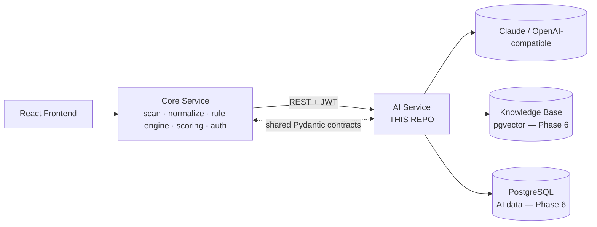
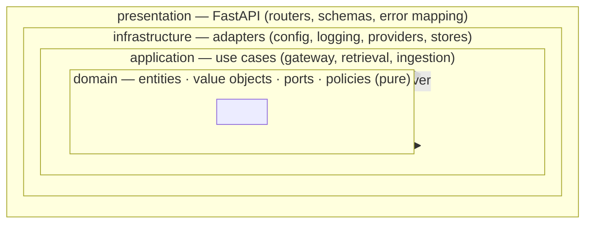
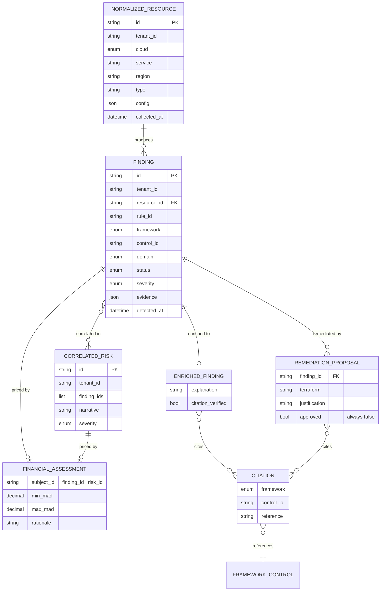
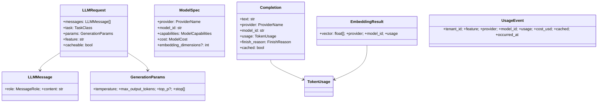
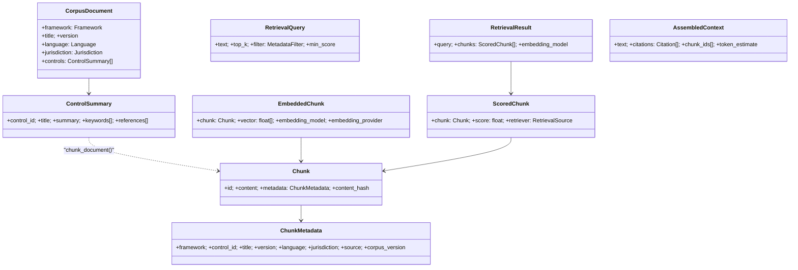
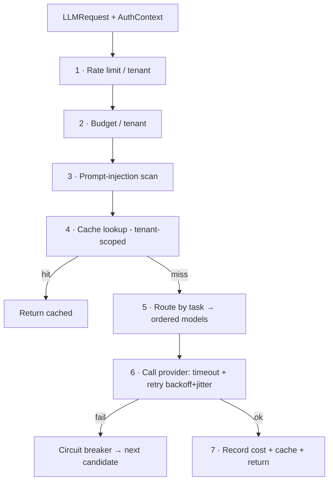
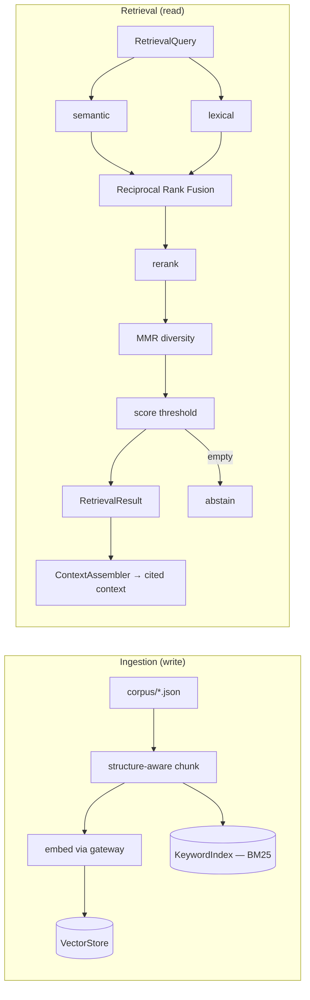

# ComplianceIQ — AI Service

> The intelligence layer of **ComplianceIQ**, an AI-powered multi-cloud
> **Governance, Risk & Compliance (GRC)** platform. It turns raw cloud-security
> findings into **grounded, cited, audit-ready** compliance intelligence —
> explanations, framework mappings, risk narratives, financial exposure, and
> Infrastructure-as-Code remediation proposals — for **AWS, Azure, and GCP**.

<p align="center">
  <em>Grounded (every claim is cited & verified) · Multi-tenant (strict isolation) ·
  Provider-agnostic (Claude / OpenAI-compatible / offline fake) · Clean Architecture (enforced)</em>
</p>

---

## Table of Contents

- [What this service does](#what-this-service-does)
- [Where it fits (system context)](#where-it-fits-system-context)
- [Build status & roadmap](#build-status--roadmap)
- [Architecture](#architecture)
- [Repository layout](#repository-layout)
- [Data schemas](#data-schemas)
  - [Core contracts (shared with the Core Service)](#core-contracts-shared-with-the-core-service)
  - [Enumerations](#enumerations)
  - [Entity relationships (ER diagram)](#entity-relationships-er-diagram)
  - [LLM / gateway schemas (Phase 2)](#llm--gateway-schemas-phase-2)
  - [Knowledge base & RAG schemas (Phase 3)](#knowledge-base--rag-schemas-phase-3)
  - [API error & pagination envelopes](#api-error--pagination-envelopes)
- [The AI Gateway](#the-ai-gateway)
- [The RAG pipeline](#the-rag-pipeline)
- [HTTP API](#http-api)
- [Configuration](#configuration)
- [Quickstart](#quickstart)
- [Quality gates](#quality-gates)
- [Non-negotiable rules](#non-negotiable-rules)
- [Documentation index](#documentation-index)

---

## What this service does

A cloud scanner (the **Core Service**, owned by a teammate) detects a
misconfiguration and emits a **Finding** — e.g. *"S3 bucket `acme-data` is
public-read and unencrypted."* A raw finding is just a technical fact. This **AI
Service** makes it actionable:

| Capability | What it produces | Status |
|-----------|------------------|--------|
| **Explain** | A plain-language, **cited** explanation of why a resource is non-compliant | contracts ✅ · pipeline Phase 4 |
| **Map** | The governing controls across **ISO 27001, Loi 05-20, DNSSI, NIST CSF, SOC 2** | contracts ✅ · engine Phase 5 |
| **Correlate** | Related findings unified into a **risk narrative** (attack path) | contracts ✅ · engine Phase 5 |
| **Price** | Financial exposure as a **MAD range** with rationale & assumptions | contracts ✅ · engine Phase 5 |
| **Remediate** | A **Terraform** proposal (never auto-applied) with cited justification | contracts ✅ · engine Phase 5 |
| **Report** | Per-tenant, audit-ready PDF | Phase 6 |

Everything the AI writes is **grounded**: backed by retrieved regulatory sources
and verified citations, or it **abstains** ("not covered by the provided
sources"). It never hallucinates a regulation.

---

## Where it fits (system context)



The two services are separated by a **contract, not shared code**. This service
**consumes** findings/scores over versioned REST and returns AI artefacts. It
**never** scans clouds, issues auth, or writes to the Core Service's tables.

---

## Build status & roadmap

The project is built in incremental phases; each ends green (tests, types,
lint, architecture contracts) and is documented with a beginner study guide.

| Phase | Scope | Status |
|------:|-------|--------|
| **1** | Foundation: Clean Architecture, domain contracts, config, logging, health, Docker, CI | ✅ Done |
| **2** | AI Gateway & providers: `LLMProvider` port, Claude + OpenAI-compatible + fake, routing/fallback, retries, rate limits, budget, cache, injection defence | ✅ Done |
| **3** | Knowledge Base & RAG: chunking, embeddings, vector + keyword stores, hybrid retrieval, reranking, MMR, context assembly, evaluation | ✅ Done |
| **4** | LangGraph workflows & agents: enrichment / copilot / remediation / report graphs; grounded, verified, cited generation | ⏳ Next |
| **5** | Domain engines: compliance mapping, risk correlation, financial estimation, recommendations | ⏳ |
| **6** | REST API surface, JWT/RBAC, persistence (Postgres + **pgvector**), async report jobs, Core client | ⏳ |
| **7** | Evaluation framework, security hardening, observability (OTel/metrics) | ⏳ |
| **8** | Full documentation set, ADRs, diagrams, delivery | ⏳ |

**~150 tests · ~94% coverage · `mypy --strict` clean (domain+application) · 4/4
architecture contracts enforced.**

---

## Architecture

**Clean Architecture** with a strict **inward** dependency rule, enforced
automatically in CI by [`import-linter`](.importlinter) (the domain literally
cannot import a framework).



| Layer | May import | Contains |
|-------|-----------|----------|
| **domain** | stdlib + Pydantic only | contracts, LLM/knowledge value objects, ports (interfaces), policies (tenant isolation, prompt-injection) |
| **application** | domain | use cases: AI gateway, hybrid retriever, ingestion, context assembly, evaluation |
| **infrastructure** | application, domain | adapters: settings, structlog, Claude/OpenAI/fake providers, in-memory stores, health probes |
| **presentation** | application, domain | FastAPI app, routers, wire schemas, error→HTTP mapping |

`presentation` and `infrastructure` are **independent siblings**, wired together
only at the **composition root** (`composition.py`). See
[`docs/ARCHITECTURE.md`](docs/ARCHITECTURE.md).

---

## Repository layout

```text
src/complianceiq/
├── domain/                    # pure core (no frameworks)
│   ├── entities/              # Finding, EnrichedFinding, RemediationProposal, ...
│   ├── value_objects/         # Citation, enums, identifiers
│   ├── llm/                   # LLMMessage, ModelSpec, Completion, EmbeddingResult, ...
│   ├── knowledge/             # CorpusDocument, Chunk, RetrievalQuery, chunking, similarity
│   ├── ports/                 # Clock, LLMProvider, VectorStore, KeywordIndex, Reranker, ...
│   ├── policies/              # tenant_isolation, prompt_safety
│   └── exceptions.py
├── application/
│   ├── gateway/               # AIGateway, routing, retry, circuit breaker, cache keys
│   └── knowledge/             # HybridRetriever, IngestionService, ContextAssembler, evaluation
├── infrastructure/
│   ├── config/ logging/ http/ clock.py
│   ├── providers/             # Anthropic, OpenAI-compatible, Fake, registry
│   └── knowledge/             # in-memory vector store, BM25 index, reranker, loaders, factory
├── presentation/              # FastAPI app, routers, schemas, errors
└── composition.py             # composition root (the only place that wires it all)
corpus/frameworks/*.json       # copyright-compliant sample corpus
scripts/ingest_corpus.py       # ingestion CLI
docs/                          # ARCHITECTURE, RAG, ADRs, study guides, compliance notes
tests/                         # unit tests mirroring the layers (+ security-marked gates)
```

---

## Data schemas

All schemas are **Pydantic v2** models — validated at every boundary, immutable
(`frozen`), and rejecting unknown fields (`extra="forbid"`). The **core
contracts** are the published boundary shared with the Core Service and must
match exactly.

### Core contracts (shared with the Core Service)

| Model | Fields | Notes |
|-------|--------|-------|
| **NormalizedResource** | `id`, `tenant_id`, `cloud`, `service`, `region`, `type`, `config: dict`, `collected_at: datetime` | Provider-agnostic cloud resource |
| **Finding** | `id`, `tenant_id`, `resource_id`, `rule_id`, `framework`, `control_id`, `domain`, `status`, `severity`, `evidence: dict`, `detected_at` | A rule verdict on a resource |
| **EnrichedFinding** | *(Finding)* + `explanation`, `citations: [Citation]`, `citation_verified: bool` | Finding + grounded AI explanation |
| **ComplianceScore** | `tenant_id`, `scope`, `key`, `score: 0–100`, `passed`, `failed`, `computed_at` | Pass/fail rollup |
| **CorrelatedRisk** | `id`, `tenant_id`, `finding_ids: [str]`, `narrative`, `severity` | Related findings → risk narrative |
| **FinancialRiskAssessment** | `finding_id \| risk_id`, `min_mad: Decimal`, `max_mad: Decimal`, `rationale`, `assumptions: [str]` | Exactly one subject; `max ≥ min ≥ 0` |
| **RemediationProposal** | `finding_id`, `terraform`, `justification`, `citations`, `approved: bool = false` | **`approved` is force-set `false`** (rule 2) |
| **Citation** | `framework`, `control_id`, `reference` | The atom of explainability |
| **AuthContext** | `sub`, `tenant_id`, `roles: [str]` | Verified identity behind a request |
| **Page[T]** | `items: [T]`, `total`, `limit`, `offset` | Generic pagination envelope |

### Enumerations

| Enum | Values |
|------|--------|
| **CloudProvider** | `aws`, `azure`, `gcp` |
| **Framework** | `iso_27001`, `loi_05_20`, `dnssi`, `nist_csf`, `soc_2` |
| **RiskDomain** | `iam`, `network`, `encryption`, `logging`, `storage` |
| **Severity** | `low`(1), `medium`(2), `high`(3), `critical`(4) |
| **ComplianceStatus** | `pass`, `fail` |

### Entity relationships (ER diagram)



### LLM / gateway schemas (Phase 2)



| Enum | Values |
|------|--------|
| **ProviderName** | `fake`, `anthropic`, `openai_compatible` |
| **TaskClass** | `reasoning`, `classification`, `rerank`, `extraction`, `embedding`, `general` |
| **MessageRole** | `system` (trusted), `user`, `assistant` |
| **FinishReason** | `stop`, `length`, `content_filter`, `error` |

### Knowledge base & RAG schemas (Phase 3)



> **Note:** `ControlSummary` has **no field for verbatim standard text** — the
> ISO/SOC 2 copyright policy (rule 6) is enforced by *shape*. See
> [`docs/COMPLIANCE_NOTES.md`](docs/COMPLIANCE_NOTES.md).

| Enum | Values |
|------|--------|
| **Language** | `en`, `fr`, `ar` |
| **Jurisdiction** | `international`, `morocco` |
| **RetrievalSource** | `semantic`, `lexical`, `hybrid`, `rerank` |

### API error & pagination envelopes

Every endpoint returns the same error shape on failure:

```json
{
  "error": {
    "code": "not_found",
    "message": "finding not found",
    "correlation_id": "b6ab…55",
    "details": {}
  }
}
```

| Domain error → HTTP | | |
|---|---|---|
| `validation_error` → 422 | `not_found` → 404 | `authentication_error` → 401 |
| `authorization_error` / `tenant_isolation_violation` → 403 | `rate_limited` / `budget_exceeded` → 429 | `unsafe_content` → 400 |
| `grounding_error` → 422 | `provider_error` → 502 | `dependency_unavailable` → 503 |
| `embedding_model_mismatch` → 500 | `model_not_available` → 503 | (unexpected) → 500 (sanitized) |

---

## The AI Gateway

Every model call flows through **one** hardened choke point that enforces, in a
deliberate order, all cross-cutting concerns.



Providers (`anthropic`, `openai_compatible`, `fake`) implement one
`LLMProvider` port; adding a vendor is a small adapter. See ADR-0003/0004 and the
[Phase 2 study guide](docs/PHASE_2_STUDY_GUIDE.md).

---

## The RAG pipeline

Retrieval-Augmented Generation grounds answers in real regulations.



- **Structure-aware chunking** — one control ≈ one chunk (a citable rule).
- **Embedding-model-identity guard** — query/document vectors from different
  models are rejected, not silently mis-compared.
- **Hybrid retrieval** — semantic (cosine) + lexical (BM25) + RRF + rerank + MMR.
- **Abstention** — nothing relevant ⇒ empty result ⇒ decline to answer.

See [`docs/RAG.md`](docs/RAG.md) and the
[Phase 3 study guide](docs/PHASE_3_STUDY_GUIDE.md).

---

## HTTP API

**Live now (operational, unauthenticated, tenant-agnostic):**

| Method | Path | Purpose |
|-------|------|---------|
| GET | `/health` | Liveness |
| GET | `/health/ready` | Readiness (aggregates provider + vector-store probes; 503 if any down) |
| GET | `/version` | Build/version metadata |
| GET | `/docs`, `/redoc`, `/openapi.json` | Interactive & reference API docs |

**Planned (Phase 6), all `/api/v1`, JWT-scoped:** `POST /ai/ask`, `/ai/enrich`,
`/ai/map`, `/ai/correlate`, `/ai/financial`, `/ai/remediate`, `/ai/report`,
`GET /ai/report/{job_id}`, `POST /admin/corpus/ingest`.

---

## Configuration

Twelve-factor: all config comes from environment variables (prefix `CIQ_`) or a
gitignored `.env`. Secrets are `SecretStr` (masked in logs). Full template:
[`.env.example`](.env.example).

| Variable | Default | Purpose |
|----------|---------|---------|
| `CIQ_ENVIRONMENT` | `local` | `local`/`dev`/`staging`/`production` |
| `CIQ_LOG_JSON` | `true` | JSON logs (prod) vs. console (local) |
| `CIQ_LLM_PRIMARY_PROVIDER` | `fake` | `fake` / `anthropic` / `openai_compatible` |
| `CIQ_ANTHROPIC_API_KEY` | *(empty)* | Enables the Claude provider |
| `CIQ_OPENAI_BASE_URL` / `CIQ_OPENAI_API_KEY` | *(empty)* | Enables the OpenAI-compatible provider (+ embeddings) |
| `CIQ_GATEWAY_TENANT_BUDGET_USD` | `50` | Per-tenant spend cap (`0` = unlimited) |
| `CIQ_GATEWAY_RATE_LIMIT_PER_MINUTE` | `60` | Per-tenant call rate |
| `CIQ_KNOWLEDGE_AUTOLOAD` | `true` | Ingest the bundled corpus at startup |
| `CIQ_RETRIEVAL_MMR_LAMBDA` | `0.5` | Relevance/diversity balance |

> **Default is fully offline:** with no API key, the `fake` provider serves
> everything and the corpus autoloads — `docker compose up` just works.

---

## Quickstart

**Prerequisites:** Python 3.11+, Docker (optional).

```bash
# 1) Configure (safe offline defaults)
cp .env.example .env

# 2) Install (app + dev tooling)
python -m pip install -e ".[dev]"

# 3) Run the service (serves on :8000; corpus autoloads)
python -m complianceiq
#   → http://localhost:8000/health   /health/ready   /docs

# —or— the full stack (AI service + pgvector Postgres)
docker compose up --build

# Ingest the corpus manually (idempotent)
python -m scripts.ingest_corpus            # or: --replace for a clean re-index
```

---

## Quality gates

Everything CI enforces, runnable locally:

```bash
python -m pytest --cov=complianceiq            # tests + coverage (gate ≥ 85%)
python -m ruff check src tests                 # lint
python -m black --check src tests              # format
python -m mypy src/complianceiq/domain src/complianceiq/application   # strict types
lint-imports                                   # Clean Architecture contracts
pre-commit install                             # run all of the above per commit
```

The default test suite is **deterministic and offline** — no network, no real
LLM, no real clock. Security-marked tests (tenant isolation, `approved=false`,
prompt injection, budget) are **non-skippable gates**.

---

## Non-negotiable rules

Enforced structurally (in types and single choke points), not by convention:

1. **Tenant isolation is absolute** — enforced at the data layer; cache keys are
   tenant-scoped; tested.
2. **Remediation is never auto-applied** — `RemediationProposal.approved` is
   force-set `false`.
3. **Cite, verify, abstain** — answers are grounded; no source ⇒ abstain.
4. **Prompt-injection defence** — untrusted input scanned & delimited at the
   gateway.
5. **Secrets never in source/logs** — `SecretStr`, `.env` gitignored.
6. **ISO copyright compliance** — no verbatim standard text is stored (enforced
   by model shape).
7. **Audit trail** — correlation-ID structured logging on every request.
8. **No red-team / exploitation capability.**

---

## Documentation index

| Doc | What it covers |
|-----|----------------|
| [`docs/ARCHITECTURE.md`](docs/ARCHITECTURE.md) | Layers, boundaries, dependency rules, diagrams |
| [`docs/RAG.md`](docs/RAG.md) | The retrieval pipeline in depth |
| [`docs/ADR/`](docs/ADR/) | Architecture Decision Records (0000–0006) |
| [`docs/COMPLIANCE_NOTES.md`](docs/COMPLIANCE_NOTES.md) | Copyright & data-protection posture |
| [`docs/ASSUMPTIONS.md`](docs/ASSUMPTIONS.md) | Defaults chosen where the spec was open |
| [`docs/PHASE_1_STUDY_GUIDE.md`](docs/PHASE_1_STUDY_GUIDE.md) | Beginner course — Foundation |
| [`docs/PHASE_2_STUDY_GUIDE.md`](docs/PHASE_2_STUDY_GUIDE.md) | Beginner course — AI Gateway & Providers |
| [`docs/PHASE_3_STUDY_GUIDE.md`](docs/PHASE_3_STUDY_GUIDE.md) | Beginner course — Knowledge Base & RAG |
| [`CHANGELOG.md`](CHANGELOG.md) | What changed, per phase |

---

<sub>Engineering graduation project. Proprietary placeholder license — see
[`LICENSE`](LICENSE). Regulatory reference material is copyright-compliant; see
`docs/COMPLIANCE_NOTES.md`.</sub>
