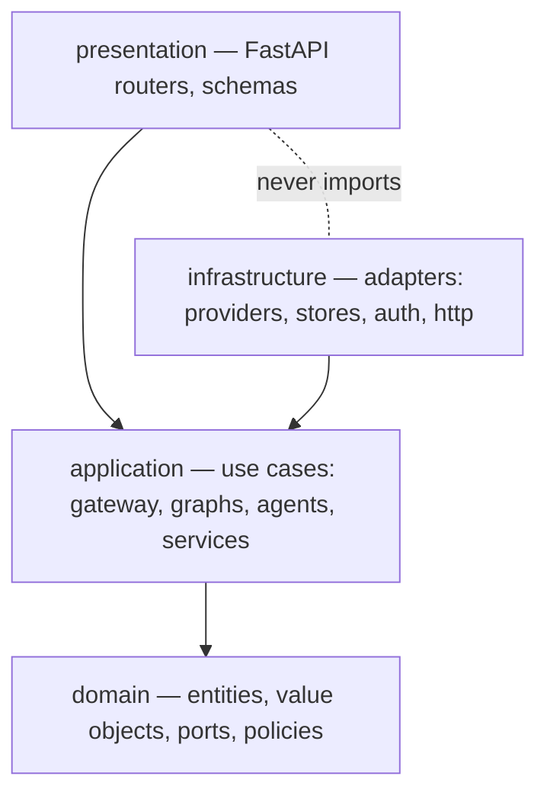
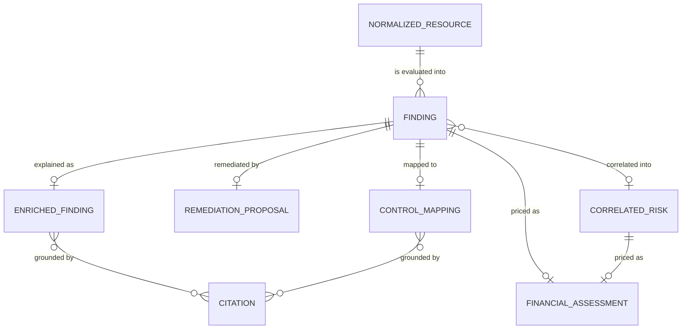

# ComplianceIQ — AI Service

**Grounded, multi-tenant GRC intelligence over multi-cloud findings.**

ComplianceIQ is the AI subsystem of an enterprise Governance, Risk & Compliance
platform. It consumes compliance **findings** from the Core Service and returns
explainable AI artefacts: it explains why a resource is non-compliant, answers
plain-English questions, proposes (never applies) fixes, correlates findings into
systemic risk, drafts executive reports, maps controls across frameworks, and
prices risk in Moroccan Dirham. Every AI claim is **cited and verified**, every
number is **computed not guessed**, and the service **never mutates a customer
environment**.

Built in eight phases on Clean Architecture, Domain-Driven Design, and
security-by-design. The default configuration runs **fully offline** (a
deterministic fake model, an in-memory corpus and stores), so the whole system —
all 282 tests — runs with no network, no database, and no API keys.

> **Status:** feature-complete across all 8 phases · 282 tests passing, ~95%
> coverage · `mypy --strict` clean · 4 architecture contracts enforced. See
> [`docs/RELEASE_READINESS.md`](docs/RELEASE_READINESS.md).

---

## Table of Contents

- [What it does](#what-it-does) · [Where it fits](#where-it-fits-system-context)
- [Architecture](#architecture) · [Repository layout](#repository-layout)
- [The subsystems](#the-subsystems) (gateway · RAG · workflows & agents · auth · Core client · storage · observability)
- [Data schemas](#data-schemas) · [HTTP API](#http-api)
- [Quickstart](#quickstart) · [Configuration](#configuration) · [Quality gates](#quality-gates)
- [The non-negotiable rules](#the-non-negotiable-rules) · [Honest limitations](#honest-limitations)
- [Documentation index](#documentation-index)

---

## What it does

Seven AI capabilities, each grounded or deterministic, each exposed as a
JWT-protected, tenant-scoped endpoint:

| Capability | Endpoint | Output | How its truth is guaranteed |
| --- | --- | --- | --- |
| **Explain** | `POST /api/v1/ai/enrich` | `EnrichedFinding[]` | grounded — only verified citations, else abstains |
| **Ask** | `POST /api/v1/ai/ask` | `CopilotAnswer` | grounded Q&A over the corpus, or abstains |
| **Remediate** | `POST /api/v1/ai/remediate` | `RemediationProposal` | `approved=false` always; IaC statically validated |
| **Correlate** | `POST /api/v1/ai/correlate` | risk narrative | grounded synthesis over multiple findings |
| **Report** | `POST /api/v1/ai/report` | `ReportDraft` | severity counts computed in code, not by the model |
| **Map** | `POST /api/v1/ai/map` | `ControlMapping` | only verified, cross-framework equivalents |
| **Price** | `POST /api/v1/ai/financial` | `FinancialRiskAssessment` | deterministic MAD range; model only narrates |

Plus `POST /api/v1/ai/enrich/by-ids`, which **fetches** findings from the Core
Service by id and enriches them.

The unifying principle across all seven: **the model is never the source of truth
for a checkable fact** — every such fact is grounded in the retrieved corpus (and
citation-verified) or computed by deterministic code.

## Where it fits (system context)

```mermaid
flowchart LR
    subgraph Core [Core Service — the other team]
      SCAN[cloud scanners] --> RULES[rule engine] --> FIND[(findings + scores)]
      JWT[JWT issuer / tenancy]
    end
    subgraph AI [AI Service — this repo]
      API[/api/v1/ai/*]
    end
    FIND -->|REST + JWT| API
    API -->|EnrichedFinding, RemediationProposal, …| DASH[Dashboard]
    JWT -->|verify only| API
```

The Core owns scanning, the rule engine, tenancy, and JWT issuance; we *consume*
findings and *return* intelligence. We **never** scan clouds, issue tokens, or
write the Core's tables. The contract between the two services is documented in
[`docs/CORE_SERVICE_HANDOFF.md`](docs/CORE_SERVICE_HANDOFF.md).

## Architecture

Clean Architecture with the dependency rule pointing **inward**, mechanically
enforced by [import-linter](pyproject.toml) (4 contracts, checked in CI):



- **domain** — pure business types (`Finding`, `Citation`, …), **ports**
  (abstract interfaces), and **policies** (grounding, tenant isolation,
  injection, IaC safety, financial model). No I/O, no frameworks.
- **application** — use cases that orchestrate ports: the AI gateway, the RAG
  pipeline, the LangGraph workflows, the bounded agents, the evaluators.
- **infrastructure** — concrete adapters implementing the ports (LLM providers,
  vector stores, JWT verifiers, the Core HTTP client, metrics).
- **presentation** — the HTTP surface; depends on the application via a structural
  `Container` protocol, never on infrastructure.
- **composition.py** — the single composition root that wires concretions to
  ports. The *only* module allowed to import from both infrastructure and
  presentation.

Every external concern is a **port with a swappable adapter**, which is why the
same code runs offline (fake model, in-memory stores, HS256, stub Core) and in
production (real provider, pgvector, RS256, HTTP Core) by changing settings alone.
See [`docs/ARCHITECTURE.md`](docs/ARCHITECTURE.md) and
[ADR-0001](docs/ADR/0001-clean-architecture-and-enforcement.md).

## Repository layout

```text
src/complianceiq/
├── domain/                     # pure core: entities, value objects, ports, policies
│   ├── entities/               #   Finding, EnrichedFinding, RemediationProposal,
│   │                           #   CorrelatedRisk, FinancialRiskAssessment, ControlMapping, …
│   ├── value_objects/          #   Citation, enums, identifiers
│   ├── ports/                  #   llm, gateway, knowledge, clock, auth, core, metrics, health
│   ├── policies/               #   grounding, tenant_isolation, prompt_safety, iac_safety, financial_model
│   ├── knowledge/              #   chunks, chunking, similarity, metadata, queries
│   └── prompts/                #   PromptTemplate (versioned, validated)
├── application/                # use cases (orchestration over ports)
│   ├── gateway/                #   AIGateway: routing, retries, budgets, cache, injection scan
│   ├── knowledge/              #   hybrid retrieval, ingestion, context assembly, retrieval eval
│   ├── graphs/                 #   LangGraph workflows: enrich, copilot, remediation, report, mapping, financial
│   ├── agents/                 #   BoundedAgent + 6 agents + AgentSuite
│   ├── tools/                  #   typed tool registry, budgets, search_corpus
│   ├── prompts/                #   PromptRegistry
│   ├── evaluation/             #   grounding evaluation harness
│   └── services/               #   readiness, observability
├── infrastructure/             # adapters
│   ├── providers/              #   anthropic, openai_compatible, fake; routing table
│   ├── gateway/                #   rate limiter, cache, usage ledger, sleeper
│   ├── knowledge/              #   in-memory + pgvector stores, keyword index, reranker, loaders
│   ├── auth/                   #   HS256 + RS256 JWT verifiers (stdlib)
│   ├── core/                   #   stub + HTTP Core clients
│   ├── observability/          #   in-memory metrics + Prometheus render
│   ├── http/                   #   correlation-id, size-limit, metrics middleware
│   ├── logging/ · config/ · clock.py
├── presentation/               # FastAPI app, routers (ai, health), schemas, container protocol
└── composition.py              # the composition root

corpus/frameworks/*.json        # copyright-compliant control summaries (NIST, ISO, SOC2, Loi 05-20, DNSSI)
prompts/*.prompt                # versioned prompt assets
migrations/*.sql                # pgvector schema
scripts/                        # ingest_corpus, evaluate_ai
tests/                          # 282 offline, deterministic tests
docs/                           # ARCHITECTURE, API, RAG, AGENTS, PROMPTS, OBSERVABILITY,
                                # RELEASE_READINESS, CORE_SERVICE_HANDOFF, 14 ADRs, 8 study guides
```

## The subsystems

Each phase added one subsystem behind ports built to receive it:

### AI Gateway (Phase 2)
One choke point for every model call. Enforces, per request: per-tenant **rate
limiting** and **spend budget**, **prompt-injection scanning**, tenant-scoped
**content-addressed caching**, **task-based routing** with a fallback chain,
**retries** (exponential backoff + jitter), per-call **timeouts**, **circuit
breaking**, and **token/cost accounting**. Providers (Anthropic, any
OpenAI-compatible endpoint, and a deterministic `fake`) sit behind one
`LLMProvider` port. See [ADR-0003](docs/ADR/0003-ai-gateway-and-provider-abstraction.md),
[ADR-0004](docs/ADR/0004-prompt-injection-defence-at-the-gateway.md).

### Knowledge base & RAG (Phase 3)
Structure-aware chunking (one control ≈ one chunk), **hybrid retrieval**
(semantic + BM25 lexical → Reciprocal Rank Fusion → reranking → MMR diversity →
score-threshold abstention) with metadata pre-filtering, and token-budgeted,
citation-numbered context assembly. An **embedding-model-identity guard** refuses
to compare vectors from different models. See [`docs/RAG.md`](docs/RAG.md),
[ADR-0005](docs/ADR/0005-rag-in-memory-stores-pgvector-in-phase-6.md),
[ADR-0006](docs/ADR/0006-hybrid-retrieval-and-structure-aware-chunking.md).

### Workflows & bounded agents (Phase 4)
Each capability is an explicit **LangGraph** state graph (typed state, injected
nodes, declared edges including the *abstain* branch, per-node timeouts, a trace
per run). Six graphs feed six **bounded agents** whose every tool call passes a
per-run `ToolSession` enforcing an **allow-list**, **iteration** and **wall-clock
budgets**, **loop detection**, and **injection scanning of tool output**. See
[`docs/AGENTS.md`](docs/AGENTS.md), [`docs/PROMPTS.md`](docs/PROMPTS.md),
[ADR-0007](docs/ADR/0007-langgraph-workflows.md),
[ADR-0008](docs/ADR/0008-bounded-tool-using-agents.md).

### HTTP API & authentication (Phase 5–6)
FastAPI endpoints, JWT-protected via a `TokenVerifier` port. The dev/offline
verifier is **HS256** (stdlib); when the Core's RSA public key (a JWK) is
configured, an **RS256** verifier is selected automatically — both stdlib-only,
both algorithm-pinned and constant-time. Tenant isolation is enforced at the
boundary on every finding. See [`docs/API.md`](docs/API.md),
[ADR-0009](docs/ADR/0009-http-api-and-hs256-auth-seam.md),
[ADR-0011](docs/ADR/0011-rs256-verification-and-pgvector-store.md).

### Core Service client & pgvector (Phase 6)
A `CoreClient` port with a seeded in-process **stub** (offline default) and an
**HTTP** adapter that forwards the caller's JWT (token pass-through) and re-checks
every returned finding's tenant. The `VectorStore` port gains a **pgvector**
adapter behind a thin SQL-executor seam, selected by settings. See
[ADR-0010](docs/ADR/0010-core-service-client-and-token-pass-through.md).

### Observability & evaluation (Phase 8)
A `MetricsSink` port + in-memory adapter renders **Prometheus** text at
`GET /metrics` (request counts/latencies + AI-usage gauges). A **grounding
evaluation** harness scores grounded rate, abstention rate, and citation
precision/recall over a golden set — making the core guarantee a measured,
gate-able number. See [`docs/OBSERVABILITY.md`](docs/OBSERVABILITY.md),
[ADR-0013](docs/ADR/0013-observability-and-answer-quality-evaluation.md).

## Data schemas

All models are **Pydantic v2**, immutable (`frozen`), and reject unknown fields
(`extra="forbid"`). Datetimes are timezone-aware ISO-8601; money is a decimal
string; enum fields use the exact string values below. These types are the
**published contract** with the Core Service — mirror them exactly.

### Core contracts

| Type | Purpose | Key fields |
| --- | --- | --- |
| `NormalizedResource` | a scanned cloud resource | `id, tenant_id, cloud, service, region, type, config, collected_at` |
| `Finding` | the Core's verdict; our main input | `id, tenant_id, resource_id, rule_id, framework, control_id, domain, status, severity, evidence, detected_at` |
| `EnrichedFinding` | finding + grounded explanation | `…Finding… + explanation, citations[], citation_verified` |
| `RemediationProposal` | never-applied IaC fix | `finding_id, terraform, justification, citations[], approved(=false)` |
| `CorrelatedRisk` | several findings → one risk | `id, tenant_id, finding_ids[], narrative, severity` |
| `FinancialRiskAssessment` | monetary exposure (MAD) | `finding_id|risk_id, min_mad, max_mad, rationale, assumptions[]` |
| `ControlMapping` | cross-framework equivalents | `finding_id, source_framework, source_control_id, summary, mappings[], citations[], citation_verified` |
| `ComplianceScore` | posture score | `tenant_id, framework, score, …` |
| `Citation` | a checkable reference | `framework, control_id, reference` |
| `Page[T]` | pagination envelope | `items[], total, limit, offset` |

### Enumerations

| Enum | Values |
| --- | --- |
| `CloudProvider` | `aws` · `azure` · `gcp` |
| `Framework` | `iso_27001` · `loi_05_20` · `dnssi` · `nist_csf` · `soc_2` |
| `RiskDomain` | `iam` · `network` · `encryption` · `logging` · `storage` |
| `Severity` | `low` · `medium` · `high` · `critical` |
| `ComplianceStatus` | `pass` · `fail` |

### Entity relationships



The full schema catalogue (including the LLM/gateway, knowledge, and error/paging
envelopes) is in [`docs/CORE_SERVICE_HANDOFF.md`](docs/CORE_SERVICE_HANDOFF.md)
and the live OpenAPI at `/openapi.json`.

## HTTP API

All AI endpoints are under `/api/v1/ai`, require `Authorization: Bearer <jwt>`,
and are tenant-scoped. Operational endpoints are at the root and unauthenticated.

| Method | Path | Body → Response |
| --- | --- | --- |
| POST | `/api/v1/ai/enrich` | `{findings:[Finding]}` → `[EnrichedFinding]` |
| POST | `/api/v1/ai/enrich/by-ids` | `{finding_ids:[str]}` → `[EnrichedFinding]` (fetched from Core) |
| POST | `/api/v1/ai/ask` | `{question, framework?}` → `CopilotAnswer` |
| POST | `/api/v1/ai/remediate` | `{finding}` → `RemediationProposal` (`approved:false`) |
| POST | `/api/v1/ai/correlate` | `{findings:[Finding]}` → `{narrative}` |
| POST | `/api/v1/ai/report` | `{findings:[EnrichedFinding]}` → `ReportDraft` |
| POST | `/api/v1/ai/map` | `{finding}` → `ControlMapping` |
| POST | `/api/v1/ai/financial` | `{finding}` → `FinancialRiskAssessment` |
| GET | `/health` · `/health/ready` · `/version` | liveness · readiness · build info |
| GET | `/metrics` | Prometheus exposition (aggregates only) |
| GET | `/docs` · `/openapi.json` | interactive contract |

Every error is the same envelope — `{ "error": { code, message, correlation_id,
details } }` — with the `X-Correlation-ID` echoed for the audit trail. Full
reference: [`docs/API.md`](docs/API.md).

```bash
curl -sS localhost:8000/api/v1/ai/ask \
  -H "Authorization: Bearer $TOKEN" -H "Content-Type: application/json" \
  -d '{"question": "How should IAM access keys be managed?"}'
# → {"question":"…","answer":"…","citations":[…],"citation_verified":true,"abstained":false}
```

## Quickstart

The default configuration is **offline and safe** (fake model, in-memory stores,
HS256 dev auth, stub Core) — no keys, no database, no network required.

```bash
# 1) Configure (the offline defaults are ready to go)
cp .env.example .env

# 2) Install (app + dev tooling)
pip install -r requirements.txt -r requirements-dev.txt

# 3) Run the service — serves on :8000; the corpus autoloads at startup
python -m complianceiq
#   → http://localhost:8000/health   /health/ready   /metrics   /docs

# —or— the full stack (AI service + a pgvector Postgres) via Docker
docker compose up

# Ingest the corpus manually (idempotent); or evaluate answer grounding
python -m scripts.ingest_corpus
python -m scripts.evaluate_ai --json
```

## Configuration

Settings are environment variables prefixed `CIQ_` (see
[`.env.example`](.env.example)); secrets are `SecretStr`. The offline → production
switch is a handful of settings, each flipping a port's adapter:

| Setting | Offline default | Production |
| --- | --- | --- |
| `CIQ_LLM_PRIMARY_PROVIDER` | `fake` | `anthropic` / `openai_compatible` (+ keys) |
| `CIQ_JWT_PUBLIC_KEY` | *(empty → HS256 dev)* | the Core's RSA public **JWK** → RS256 |
| `CIQ_CORE_CLIENT` | `stub` | `http` (+ `CIQ_CORE_API_BASE_URL`) |
| `CIQ_VECTOR_STORE` | `memory` | `pgvector` (+ apply `migrations/0001_…`) |
| `CIQ_LOG_JSON` | `false` | `true` |

No code changes — only configuration. The deploy checklist is in
[`docs/RELEASE_READINESS.md`](docs/RELEASE_READINESS.md).

## Quality gates

Every gate runs offline and is green:

```bash
python -m pytest --cov=complianceiq          # 282 tests, ~95% coverage (≥85% required)
python -m ruff check src tests               # lint
python -m black --check src tests            # format
python -m mypy src/complianceiq/domain src/complianceiq/application   # types (strict)
lint-imports                                 # 4 architecture contracts
```

The import-linter contracts enforce the dependency rule: the domain imports
nothing outward, the application imports no adapters, and presentation and
infrastructure never import each other.

## The non-negotiable rules

Eight rules, each enforced **structurally** (a policy, a validator, a forced
default) and **verified** by tests — not left to convention:

| # | Rule | Enforced by |
| --- | --- | --- |
| 1 | Tenant isolation is absolute | `assert_same_tenant` at every boundary + Core-client re-check |
| 2 | Remediation is never auto-applied | `RemediationProposal.approved` forced `false`; `validate_terraform` rejects unsafe IaC |
| 3 | Grounding: cite, verify, abstain | grounding policy + every grounded graph; measured by the grounding eval |
| 4 | Prompt-injection defence | gateway input scan + `wrap_untrusted` + tool-output scan |
| 5 | Secrets never in source/logs | `SecretStr`; errors never echo tokens/keys |
| 6 | ISO copyright compliance | corpus stores our summaries + metadata, never verbatim standard text |
| 7 | Audit trail | correlation ID per request + usage ledger + `/metrics` |
| 8 | No red-team / no autonomous change | agents propose only; bounded tools; no environment mutation |

The full rule → enforcement → **verification** traceability matrix is in
[`docs/RELEASE_READINESS.md`](docs/RELEASE_READINESS.md).

## Honest limitations

Documented, not hidden (the same integrity as abstaining or refusing to invent a
number). Both are constraints of the offline build environment, both sit behind a
port so a production build swaps cleanly:

- The **RS256 verifier** is a dependency-free, standard-library implementation
  (verification only), thoroughly tested and swappable for a library-backed one
  behind the `TokenVerifier` port — the environment's compiled crypto stack was
  unavailable ([ADR-0011](docs/ADR/0011-rs256-verification-and-pgvector-store.md)).
- The **pgvector** similarity ranking runs in a real Postgres; the offline suite
  tests the adapter's SQL, row mapping, and model guard, not end-to-end ranking.

## Documentation index

| Topic | Document |
| --- | --- |
| Architecture & layering | [`docs/ARCHITECTURE.md`](docs/ARCHITECTURE.md) |
| HTTP API reference | [`docs/API.md`](docs/API.md) |
| RAG pipeline | [`docs/RAG.md`](docs/RAG.md) |
| Workflows & agents | [`docs/AGENTS.md`](docs/AGENTS.md) |
| Prompts as assets | [`docs/PROMPTS.md`](docs/PROMPTS.md) |
| Observability | [`docs/OBSERVABILITY.md`](docs/OBSERVABILITY.md) |
| Release readiness (sign-off) | [`docs/RELEASE_READINESS.md`](docs/RELEASE_READINESS.md) |
| Core Service integration | [`docs/CORE_SERVICE_HANDOFF.md`](docs/CORE_SERVICE_HANDOFF.md) |
| Assumptions & compliance notes | [`docs/ASSUMPTIONS.md`](docs/ASSUMPTIONS.md) · [`docs/COMPLIANCE_NOTES.md`](docs/COMPLIANCE_NOTES.md) |
| Decision records | [`docs/ADR/`](docs/ADR/) (0000–0013) |
| **Study guides** (beginner textbooks) | [`docs/PHASE_1…8_STUDY_GUIDE.md`](docs/) — one per phase, first principles |
| Changelog | [`CHANGELOG.md`](CHANGELOG.md) |

The eight **study guides** teach the whole system from first principles, one phase
at a time — start there to learn *why* it's built this way.

---

*ComplianceIQ AI Service · Python 3.11 · Pydantic v2 · FastAPI · LangGraph.
Engineering graduation project — built to Wiz/Prisma-Cloud/Defender quality bars:
grounded, multi-tenant, security-by-design, and provably ready to ship.*
