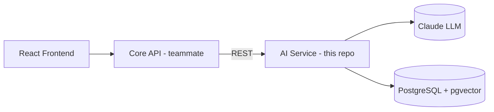

# ComplianceIQ — AI Service

> The "brain" of ComplianceIQ: it takes raw cloud-security findings and turns
> them into plain-language, **cited**, audit-ready compliance intelligence.

This README is written to **teach**, not just to document. If you are new to AI
engineering, read it top to bottom — every technical term is explained the first
time it appears. It grows with the project; this version covers **Phase 1
(Foundation)**.

---

## 1. What is this, in plain language?

**ComplianceIQ** is a platform that continuously scans a company's cloud
accounts (AWS, Azure, GCP) and checks them against security and compliance rules.
When it finds a problem — say, a storage bucket open to the public internet — it
produces a **finding**.

A finding on its own is just a technical fact. A security team then has to ask:

- *Why* is this a problem?
- *Which regulation* does it violate (ISO 27001? Morocco's Loi 05-20)?
- *How much could it cost us* if it goes wrong?
- *How do we fix it*?

Answering those four questions, for every finding, at scale, is what this **AI
Service** does. It is the difference between a tool that says "port 22 is open"
and an assistant that says "this violates control X, here is the exact article,
here is the likely financial exposure in MAD, and here is the Terraform to fix
it — with a citation you can verify."

### The platform has two halves

| Half | Who owns it | What it does |
|------|-------------|--------------|
| **Core Service** (Platform & Data) | Teammate | Scans clouds, normalizes resources, runs the rule engine, computes scores, issues auth tokens. |
| **AI Service** (Intelligence) | **You / this repo** | Explains, cites, maps, correlates, prices, and proposes fixes for findings using an LLM. |

The two talk over **REST** (the internet's request/response protocol) and share
only a set of agreed data shapes (the "contracts"). This service never scans a
cloud itself; it *consumes* findings the Core Service produces.



---

## 2. Three ideas you need before reading the code

**1. A "port" and an "adapter."** Think of a wall power socket. Your laptop
charger doesn't care whether the electricity comes from solar, wind, or coal —
it just needs the *socket shape*. In code, a **port** is the socket (an
interface like "give me the current time" or "answer this prompt"), and an
**adapter** is whatever actually plugs in (the system clock, or Claude). This
lets us swap the power plant without changing the laptop.

**2. A "tenant."** ComplianceIQ is used by many client companies at once. Each
client is a **tenant**. The single most important safety rule is that one
tenant can *never* see another tenant's data. Every piece of data carries a
`tenant_id`, and we check it everywhere.

**3. "Grounding" and "abstention."** An LLM can sound confident while being
wrong ("hallucinating"). **Grounding** means every claim the AI makes must be
backed by a real document we retrieved, and we *verify* the citation is real.
**Abstention** means if we don't have a good source, the AI says "I don't know"
instead of guessing. These are treated as features, not failures.

---

## 3. How the code is organised (Clean Architecture)

The code is split into four **layers**, like an onion. The rule: **outer layers
may depend on inner layers, never the other way around.** The innermost layer
(the business core) knows nothing about the web, the database, or Claude.

```
┌─ presentation ─ the web API (FastAPI): routers, request/response shapes
│  ┌─ infrastructure ─ adapters: config, logging, the clock, (later) DB & LLM
│  │  ┌─ application ─ use cases that coordinate the domain
│  │  │  ┌─ domain ─ the pure core: contracts, rules, interfaces. No frameworks.
│  │  │  └───────────
│  │  └──────────────
│  └─────────────────
└────────────────────
```

Why bother? Because it makes the important logic (tenant isolation, grounding,
risk scoring) **testable without a database or the internet**, and lets us swap
Claude for another model, or Postgres for another store, without rewriting the
core. This rule is not a suggestion — it is **checked automatically** on every
commit (see `.importlinter`). If someone imports FastAPI into the domain, CI
fails.

> Full detail, with diagrams, is in [`docs/ARCHITECTURE.md`](docs/ARCHITECTURE.md).

### Folder map

| Path | Layer | What lives here |
|------|-------|-----------------|
| `src/complianceiq/domain/` | Domain | `entities/` (the data contracts), `value_objects/` (enums, `Citation`, IDs), `ports/` (interfaces), `policies/` (tenant isolation), `exceptions.py`. **Pure Python + Pydantic only.** |
| `src/complianceiq/application/` | Application | Use cases. Today: `ReadinessService`. Later: enrich / ask / remediate / report. |
| `src/complianceiq/infrastructure/` | Infrastructure | `config/` (settings), `logging/` (structured logs + correlation IDs), `http/` (middleware), `clock.py`. Later: DB, LLM provider, Core client. |
| `src/complianceiq/presentation/` | Presentation | FastAPI `app.py`, `routers/`, `schemas.py`, `errors.py`. |
| `src/complianceiq/composition.py` | — | The **composition root**: the one file that wires everything together. |
| `tests/` | — | `unit/` mirrors the source layers; `factories.py` builds test data. |
| `docs/` | — | Architecture, ADRs (decision records), compliance notes, assumptions. |

### Recommended reading order (for understanding the codebase)

1. `src/complianceiq/domain/value_objects/enums.py` — the vocabulary.
2. `src/complianceiq/domain/entities/` — the contracts (start with `finding.py`).
3. `src/complianceiq/domain/policies/tenant_isolation.py` — the #1 safety rule.
4. `src/complianceiq/domain/exceptions.py` → `presentation/errors.py` — how
   errors become HTTP responses.
5. `application/services/health.py` — a tiny complete use case.
6. `composition.py` — see how all the pieces are assembled.
7. `presentation/routers/health.py` — how a request reaches a use case.

---

## 4. What exists after Phase 1

Phase 1 builds the **foundation** — the skeleton every later feature hangs on:

- ✅ The four-layer architecture, **enforced** by import-linter.
- ✅ Every Section 6 **data contract** as a validated, immutable Pydantic model.
- ✅ **Two non-negotiable rules made structural:**
  - `RemediationProposal.approved` is forced to `False` — the AI can never
    mark a fix as auto-approved.
  - A tenant-isolation guard that raises if code ever touches another tenant's
    data, with dedicated security tests.
- ✅ **Configuration** from environment variables, with secrets masked.
- ✅ **Structured JSON logging** with a **correlation ID** on every log line, so
  you can trace one request across the whole system (the audit trail).
- ✅ **Operational endpoints:** `/health`, `/health/ready`, `/version`.
- ✅ A **Docker** image (multi-stage, runs as non-root) and a **docker-compose**
  stack (AI service + a pgvector Postgres, ready for later phases).
- ✅ **CI** (lint, format, strict types, architecture check, tests+coverage) and
  pre-commit hooks.

Not yet built (later phases): the LLM gateway, RAG pipeline, knowledge base,
agents, and the domain engines. The architecture is deliberately shaped so they
slot in without rewrites.

---

## 5. Running it

### Prerequisites
- Python 3.11+
- Docker & Docker Compose (for the container path)

### Option A — run locally
```bash
cp .env.example .env                 # configuration template (safe defaults)
python -m pip install -e ".[dev]"    # install app + dev tooling
python -m complianceiq                # start the server on :8000
```
Then visit:
- http://localhost:8000/health — liveness
- http://localhost:8000/docs — interactive API docs (Swagger UI)
- http://localhost:8000/redoc — reference API docs

### Option B — run the full stack with Docker
```bash
cp .env.example .env
docker compose up --build
```
This starts the AI service and a pgvector-enabled PostgreSQL. The AI service
reports healthy once it's up.

---

## 6. Development workflow & quality gates

Everything CI checks, you can run locally:

```bash
pytest                                   # tests
pytest --cov=complianceiq                # tests + coverage (gate: >=85%)
ruff check src tests                     # linting
black --check src tests                  # formatting
mypy src/complianceiq/domain src/complianceiq/application   # strict typing
lint-imports                             # Clean Architecture contracts
pre-commit install                       # run all of the above on each commit
```

Test markers: `unit`, `integration`, `security`, `live_provider`. The default
suite is **deterministic and offline** — no network, no real LLM.

---

## 7. The non-negotiable rules (and where they live)

These are safety guarantees enforced in code, not conventions:

| # | Rule | Where it's enforced |
|---|------|---------------------|
| 1 | Tenant isolation is absolute | `domain/policies/tenant_isolation.py` + security tests |
| 2 | Remediation is never auto-applied | `domain/entities/remediation.py` (`approved` forced `False`) |
| 3 | Grounding: cite, verify, abstain | Phase 3/4 (RAG + graphs); contracts (`citation_verified`) exist now |
| 5 | Secrets never in source | `infrastructure/config/settings.py` (`SecretStr`), `.gitignore` |
| 6 | ISO copyright compliance | [`docs/COMPLIANCE_NOTES.md`](docs/COMPLIANCE_NOTES.md); enforced at ingestion (Phase 3) |
| 7 | Audit trail | correlation-ID logging middleware |

---

## 8. "Defend your project" — a preview

You will be asked hard questions at your defense. Full answers land as the
features do, but here is the shape of two the foundation already answers:

- **"How do you guarantee tenant isolation?"** It is a single domain policy
  (`assert_same_tenant`) that every data-access path calls; violations raise a
  dedicated `TenantIsolationError`, and there are non-skippable security tests
  proving cross-tenant access is blocked. It is enforced at the data layer, not
  the API layer, so it cannot be bypassed by a new endpoint.
- **"How do you keep the AI core clean and swappable?"** Clean Architecture with
  ports & adapters, and the dependency rule is *machine-enforced* by import-linter
  in CI — the domain literally cannot import a framework or a vendor SDK.

---

## 9. Where to go next

- [`docs/ARCHITECTURE.md`](docs/ARCHITECTURE.md) — layers, boundaries, diagrams.
- [`docs/ADR/`](docs/ADR/) — why each big decision was made.
- [`docs/ASSUMPTIONS.md`](docs/ASSUMPTIONS.md) — defaults chosen where the spec
  was open.
- [`docs/COMPLIANCE_NOTES.md`](docs/COMPLIANCE_NOTES.md) — copyright & data-protection posture.
- [`CHANGELOG.md`](CHANGELOG.md) — what changed, per phase.
