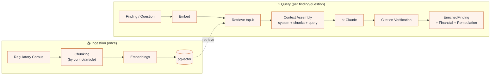

<<<<<<< HEAD
# ComplianceIQ — AI Service

> The "brain" of ComplianceIQ: it takes raw cloud-security findings and turns
> them into plain-language, **cited**, audit-ready compliance intelligence.

This README is written to **teach**, not just to document. If you are new to AI
engineering, read it top to bottom — every technical term is explained the first
time it appears. It grows with the project; this version covers **Phase 1
(Foundation)**.

---

## 1. What is this, in plain language?

**ComplianceIQ** is a platform that continuously scans a company's cloud
accounts (AWS, Azure, GCP) and checks them against security and compliance rules.
When it finds a problem — say, a storage bucket open to the public internet — it
produces a **finding**.

A finding on its own is just a technical fact. A security team then has to ask:

- *Why* is this a problem?
- *Which regulation* does it violate (ISO 27001? Morocco's Loi 05-20)?
- *How much could it cost us* if it goes wrong?
- *How do we fix it*?

Answering those four questions, for every finding, at scale, is what this **AI
Service** does. It is the difference between a tool that says "port 22 is open"
and an assistant that says "this violates control X, here is the exact article,
here is the likely financial exposure in MAD, and here is the Terraform to fix
it — with a citation you can verify."

### The platform has two halves

| Half | Who owns it | What it does |
|------|-------------|--------------|
| **Core Service** (Platform & Data) | Teammate | Scans clouds, normalizes resources, runs the rule engine, computes scores, issues auth tokens. |
| **AI Service** (Intelligence) | **You / this repo** | Explains, cites, maps, correlates, prices, and proposes fixes for findings using an LLM. |

The two talk over **REST** (the internet's request/response protocol) and share
only a set of agreed data shapes (the "contracts"). This service never scans a
cloud itself; it *consumes* findings the Core Service produces.

```mermaid
flowchart LR
    FE[React Frontend] --> Core[Core API - teammate]
    Core -- REST --> AI[AI Service - this repo]
    AI --> Claude[(Claude LLM)]
    AI --> PG[(PostgreSQL + pgvector)]
=======
<div align="center">

# 🛡️ ComplianceIQ

### AI-Powered Multi-Cloud Governance, Risk & Compliance (GRC) Platform

*Discover cloud misconfigurations across AWS, Azure & GCP — then explain, price, map, and fix them with AI you can trust.*

<!-- Badges are placeholders — wire them to your CI/registry when ready -->
![Build](https://img.shields.io/badge/build-passing-brightgreen)
![Coverage](https://img.shields.io/badge/coverage-72%25-yellowgreen)
![Python](https://img.shields.io/badge/python-3.11-blue)
![FastAPI](https://img.shields.io/badge/FastAPI-0.11x-009688)
![React](https://img.shields.io/badge/React-18-61DAFB)
![LLM](https://img.shields.io/badge/LLM-Claude-orange)
![License](https://img.shields.io/badge/license-TBD-lightgrey)
![Status](https://img.shields.io/badge/status-MVP%20in%20progress-orange)

</div>

---

## 📑 Table of Contents

<details>
<summary>Click to expand</summary>

1. [Introduction](#1--introduction)
2. [Project Vision](#2--project-vision)
3. [Key Features](#3--key-features)
4. [System Architecture](#4--system-architecture)
5. [High-Level Workflow](#5--high-level-workflow)
6. [Technology Stack](#6--technology-stack)
7. [Project Structure](#7--project-structure)
8. [AI Architecture](#8--ai-architecture)
9. [Microservices Overview](#9--microservices-overview)
10. [Data Flow](#10--data-flow)
11. [API Overview](#11--api-overview)
12. [Installation](#12--installation)
13. [Configuration](#13--configuration)
14. [Development Workflow](#14--development-workflow)
15. [Testing](#15--testing)
16. [Security](#16--security)
17. [Roadmap](#17--roadmap)
18. [Contributors](#18--contributors)
19. [Future Improvements](#19--future-improvements)
20. [License](#20--license)

</details>

---

## 1. 📖 Introduction

**ComplianceIQ** is an enterprise platform that continuously audits an organization's cloud environments against security standards and regulations — and, crucially, **explains every gap in plain language with verifiable citations**, estimates its **financial impact**, and proposes **Infrastructure-as-Code remediation**.

### The problem it solves

Cloud environments drift toward insecurity. A single misconfigured storage bucket, over-permissive IAM role, or unencrypted database can expose an entire company. Proving and maintaining compliance (ISO 27001, Loi 05-20/DNSSI, NIST, SOC 2) is traditionally slow, manual, and expensive — consultants reading configurations line-by-line against dense standards.

### Why cloud compliance is hard

- **Scale & drift:** thousands of resources change daily across multiple clouds.
- **Multi-cloud complexity:** AWS, Azure, and GCP each model security differently.
- **Framework translation:** mapping a technical finding to the *exact* control in a 100-page standard is tedious and error-prone.
- **Prioritization:** teams drown in findings with no sense of which ones actually matter (or what they could cost).

### Why AI improves the process

A Large Language Model, grounded in the real regulatory text via **Retrieval-Augmented Generation (RAG)**, can read a finding and instantly produce a clear, **cited** explanation, map it to the governing control, translate it into a financial exposure range, and draft a remediation — work that would take a human auditor hours per finding.

> [!NOTE]
> ComplianceIQ never lets the AI guess. Every AI answer is grounded in retrieved regulatory sources with a **verified citation**, and the system **abstains** ("not covered by the provided sources") rather than hallucinate. Remediations are **never auto-applied** — a human must approve them.

---

## 2. 🔭 Project Vision

> **Make continuous, explainable, multi-cloud compliance accessible to every organization — turning security standards from static PDFs into a living, automated, and financially-aware assistant.**

The long-term vision:

- **From audit to autopilot** — replace point-in-time manual audits with continuous, automated assurance.
- **Explainability first** — every result is defensible, cited, and auditable, so a CISO can trust it and a regulator can accept it.
- **Business-aware security** — translate technical risk into money, so leadership can prioritize with confidence.
- **Multi-cloud, multi-framework** — one pane of glass across AWS, Azure, and GCP, mapped to international and local regulations.
- **Human-in-the-loop remediation** — the platform proposes fixes; humans stay in control of the cloud.

---

## 3. ✨ Key Features

| | Feature | Description |
|---|---|---|
| ☁️ | **Multi-cloud scanning** | Discovers resources & misconfigurations across AWS, Azure, and GCP through cloud-native connectors. |
| 🤖 | **AI-powered analysis** | Every finding is enriched with a clear, human-readable explanation. |
| 📚 | **Retrieval-Augmented Generation (RAG)** | Answers are grounded in the real regulatory corpus — no hallucinations. |
| 💬 | **AI Copilot** | Ask compliance questions in natural language and get cited answers. |
| 💰 | **Financial risk estimation** | Translates each risk into an exposure range (MAD), with rationale. |
| 🗺️ | **Compliance mapping** | Maps findings to ISO 27001, Loi 05-20/DNSSI, NIST, SOC 2 controls. |
| 🛠️ | **Terraform remediation** | Generates IaC fixes with justification (approved by default = `false`). |
| 📄 | **PDF reporting** | Per-tenant, audit-ready compliance reports. |
| 📊 | **Dashboard** | Compliance scores, trends, and findings by domain/cloud/tenant. |
| 🏢 | **Tenant isolation** | Strict per-client data separation for multi-tenant SaaS. |
| 🔐 | **Secure architecture** | JWT auth, RBAC, secrets management, full audit trail. |
| 🔎 | **Explainable AI with citations** | Every AI claim is traceable to its source control. |

---

## 4. 🏗️ System Architecture

ComplianceIQ follows a **microservices architecture**. A dedicated **AI Service** is cleanly separated from the **Core Platform** and communicates over versioned REST APIs.

```mermaid
flowchart TB
    User([👤 User])

    subgraph Presentation["Presentation Layer"]
        FE["🖥️ Frontend<br/>React + TypeScript"]
    end

    subgraph Core["Core Platform"]
        API["⚙️ Core API<br/>FastAPI"]
        AUTH["🔐 Auth<br/>JWT + RBAC"]
        SCAN["🔍 Scanner Engine<br/>Rule Engine + Scoring"]
        PG[("🗄️ PostgreSQL<br/>findings · scores · tenants")]
    end

    subgraph AI["AI Service"]
        AIS["🤖 AI Service<br/>FastAPI"]
        VEC[("🧠 pgvector<br/>embeddings")]
        CORPUS["📚 Regulatory Corpus<br/>ISO · Loi 05-20 · NIST · SOC 2"]
    end

    LLM["✨ Claude LLM<br/>Anthropic API"]

    subgraph Clouds["Cloud Providers"]
        AWS["AWS"]
        AZ["Azure"]
        GCP["GCP"]
    end

    User --> FE --> API
    API --> AUTH
    API --> PG
    API --> SCAN
    SCAN --> AWS & AZ & GCP
    API -->|"REST"| AIS
    AIS --> VEC
    VEC -.-> CORPUS
    AIS -->|"grounded prompt"| LLM
    LLM -->|"answer + citations"| AIS
    AIS -->|"REST"| API

    classDef ai fill:#FEF3EC,stroke:#C0571E,color:#1E293B;
    classDef core fill:#F0FAF4,stroke:#2F6B4F,color:#1E293B;
    classDef ext fill:#EEF2FF,stroke:#1E3A5F,color:#1E293B;
    class AIS,VEC,CORPUS ai;
    class API,AUTH,SCAN,PG core;
    class LLM,AWS,AZ,GCP ext;
```

> [!TIP]
> The **only** coupling between the two engineers' domains is a set of shared REST contracts (schemas). This lets the AI Service and the Core Platform be developed, tested, and deployed independently.

---

## 5. 🔄 High-Level Workflow


```mermaid
flowchart LR
    A["☁️ Cloud Scan"] --> B["📋 Findings"]
    B --> C["🤖 AI Enrichment"]
    C --> D["🗺️ Compliance Mapping"]
    D --> E["💰 Financial Analysis"]
    E --> F["🛠️ Terraform Remediation"]
    F --> G["📊 Dashboard"]
    G --> H["📄 PDF Report"]

    style A fill:#EEF2FF,stroke:#1E3A5F
    style C fill:#FEF3EC,stroke:#C0571E
    style E fill:#FEF3EC,stroke:#C0571E
    style F fill:#FEF3EC,stroke:#C0571E
    style G fill:#F0FAF4,stroke:#2F6B4F
    style H fill:#F0FAF4,stroke:#2F6B4F
```

1. **Cloud Scan** — connectors collect resources from AWS/Azure/GCP.
2. **Findings** — the Rule Engine evaluates resources against the rule base and emits findings.
3. **AI Enrichment** — the RAG Copilot explains each finding with a verified citation.
4. **Compliance Mapping** — findings are mapped to the governing framework controls.
5. **Financial Analysis** — risk is translated into an exposure range (MAD).
6. **Terraform Remediation** — an IaC fix is proposed (`approved = false`).
7. **Dashboard** — everything is surfaced per tenant.
8. **PDF Report** — an audit-ready report is generated on demand.

---

## 6. 🧰 Technology Stack

### Backend & Core Platform
| Technology | Purpose |
|---|---|
| **Python 3.11** | Primary language |
| **FastAPI** | REST APIs (Core & AI services) |
| **Pydantic** | Schema validation & the shared contract |
| **Uvicorn** | ASGI server |

### AI & Machine Learning
| Technology | Purpose |
|---|---|
| **Claude (Anthropic)** | LLM for enrichment, Q&A, remediation |
| **LangChain** | RAG orchestration |
| **pgvector** | Vector storage & similarity search |
| **Sentence-Transformers / Voyage** | Embeddings |
| **RAG pipeline** | Grounded, cited generation |

### Database
| Technology | Purpose |
|---|---|
| **PostgreSQL** | Findings, scores, tenants, audit trail |
| **pgvector** | Embeddings (same DB, one system to operate) |
| **Alembic** | Schema migrations |

### Frontend
| Technology | Purpose |
|---|---|
| **React** | Dashboard & portal |
| **TypeScript** | Type safety |
| **Recharts** | Compliance visualizations |

### Cloud & Scanning
| Technology | Purpose |
|---|---|
| **AWS (boto3)** | AWS resource collection |
| **Azure SDK** | Azure resource collection |
| **GCP SDK** | GCP resource collection |
| **LocalStack** | Local cloud emulation for dev |

### DevOps
| Technology | Purpose |
|---|---|
| **Docker / Docker Compose** | Containerization & local orchestration |
| **GitHub Actions** | CI/CD |
| **ReportLab** | PDF generation |

---

## 7. 📂 Project Structure

```text
complianceiq/
├─ contracts/            # 🔗 Shared Pydantic schemas (the contract between services)
├─ ai-service/           # 🤖 AI microservice (owned by the AI engineer)
│  ├─ app/
│  │  ├─ api/            #    REST routes (/ai/ask, /enrich, /financial, /remediate)
│  │  ├─ rag/            #    ingestion, embeddings, vector store, retriever, pipeline
│  │  ├─ copilot/        #    prompts, citation verification, abstention
│  │  ├─ enrich/         #    Finding → EnrichedFinding
│  │  ├─ financial/      #    financial risk translation (MAD)
│  │  ├─ remediation/    #    Terraform generation (approved=false)
│  │  ├─ eval/           #    golden set + evaluation harness
│  │  └─ clients/        #    Core API client
│  ├─ corpus/            #    regulatory source documents
│  └─ Dockerfile
├─ core-service/         # ⚙️ Scanning + core API (owned by the platform engineer)
│  ├─ app/
│  │  ├─ api/            #    /findings, /scores, /scans, /auth
│  │  ├─ scanning/       #    connectors, rule engine, scoring
│  │  ├─ auth/           #    JWT, RBAC, tenancy
│  │  ├─ db/             #    ORM models & migrations
│  │  └─ audit/          #    audit trail (RGPD / Loi 09-08)
│  └─ Dockerfile
├─ frontend/
│  ├─ dashboard/         # 📊 scores + findings UI (platform engineer)
│  └─ ai/                # 💬 copilot + AI views (AI engineer)
├─ infra/                # 🏗️ Terraform (IaC)
├─ docs/                 # 📚 architecture & design docs
├─ .github/workflows/    # 🔁 CI/CD pipelines
├─ docker-compose.yml
├─ CODEOWNERS
└─ README.md
```

<details>
<summary><b>Folder responsibilities at a glance</b></summary>

- **`contracts/`** — the single source of truth for data shapes exchanged between services. Changes require review from **both** engineers.
- **`ai-service/`** — all intelligence: RAG, enrichment, financial estimation, remediation, evaluation.
- **`core-service/`** — cloud scanning, rules, scoring, authentication, persistence, audit.
- **`frontend/`** — split by feature so the two engineers rarely touch the same file.
- **`infra/`** — reproducible infrastructure as Terraform modules.

</details>

---

## 8. 🧠 AI Architecture

The AI Service is a **Retrieval-Augmented Generation** system: it retrieves the exact governing regulation for a finding, then asks Claude to explain it **using only that text**, with a verified citation.


```mermaid
flowchart LR
    subgraph Offline["📥 Ingestion (once)"]
        C1["Regulatory Corpus"] --> C2["Chunking<br/>(by control/article)"]
        C2 --> C3["Embeddings"]
        C3 --> C4[("pgvector")]
    end

    subgraph Online["⚡ Query (per finding/question)"]
        Q1["Finding / Question"] --> Q2["Embed"]
        Q2 --> Q3["Retrieve top-k"]
        Q3 --> Q4["Context Assembly<br/>system + chunks + query"]
        Q4 --> Q5["✨ Claude"]
        Q5 --> Q6["Citation Verification"]
        Q6 --> Q7["EnrichedFinding<br/>+ Financial + Remediation"]
    end

    C4 -.retrieve.-> Q3

    classDef a fill:#FEF3EC,stroke:#C0571E,color:#1E293B;
    class Q1,Q2,Q3,Q4,Q5,Q6,Q7,C1,C2,C3,C4 a;
```

### Pipeline components

| Stage | What it does |
|---|---|
| **Chunking** | Splits regulatory documents into small, structure-aware pieces (per control/article) for precise retrieval and clean citations. |
| **Embeddings** | Converts each chunk (and each query) into a vector capturing its meaning. |
| **Retrieval** | Finds the *k* nearest chunks in pgvector — semantic search, not keyword match. |
| **Context Assembly** | Builds the prompt: system rules + retrieved chunks (delimited) + the query. |
| **Prompt Engineering** | Enforces citation, abstention, and prompt-injection safety. |
| **Claude** | Generates a grounded explanation, mapping, or remediation. |
| **Citation Verification** | Confirms every cited control actually appears in the retrieved context; sets `citation_verified`. |
| **AI Enrichment** | Produces an `EnrichedFinding` (explanation + citation). |
| **Financial Estimation** | Derives an exposure range (MAD) with explicit assumptions. |
| **Remediation Generation** | Produces a Terraform fix + justification, `approved = false`. |

> [!IMPORTANT]
> **Groundedness is enforced, not hoped for.** If retrieval returns nothing relevant, the Copilot abstains. If a citation can't be verified against retrieved text, it is rejected. This is what makes the output defensible in an audit.

---

## 9. 🧩 Microservices Overview

| Service | Owner | Responsibilities |
|---|---|---|
| **Core API** | Platform | Orchestrates the platform; exposes findings/scores/scans; enforces auth & tenancy; persists data. |
| **AI Service** | AI | RAG copilot, enrichment, financial estimation, remediation, evaluation; exposes `/ai/*`. |
| **Scanner** | Platform | Collects cloud resources, normalizes them, runs the rule engine, computes scores. |
| **Authentication** | Platform | JWT issuance, RBAC, per-tenant isolation, audit logging. |
| **Database** | Platform | PostgreSQL for core data + pgvector for embeddings. |
| **Frontend** | Both | React dashboard (platform) + AI copilot/views (AI). |

---

## 10. 🔀 Data Flow

How a single cloud finding travels through the system until it appears on the dashboard:

```mermaid
sequenceDiagram
    participant Cloud as ☁️ Cloud (AWS/Azure/GCP)
    participant Scan as 🔍 Scanner
    participant Core as ⚙️ Core API
    participant AI as 🤖 AI Service
    participant Vec as 🧠 pgvector
    participant LLM as ✨ Claude
    participant DB as 🗄️ PostgreSQL
    participant UI as 📊 Dashboard

    Scan->>Cloud: Collect resources
    Cloud-->>Scan: Raw config
    Scan->>Scan: Normalize + evaluate rules
    Scan->>Core: Finding (fail, high)
    Core->>DB: Persist finding (tenant-scoped)
    Core->>AI: POST /ai/enrich (Finding)
    AI->>Vec: Retrieve top-k governing controls
    Vec-->>AI: Relevant chunks
    AI->>LLM: Grounded prompt (chunks + finding)
    LLM-->>AI: Explanation + citation
    AI->>AI: Verify citation, price risk, draft remediation
    AI-->>Core: EnrichedFinding + Financial + Remediation
    Core->>DB: Persist enriched result
    UI->>Core: GET /findings
    Core-->>UI: Enriched, cited, priced finding
>>>>>>> e0d98e994f85ebd507a04899b4f51b5b69137162
```

---

<<<<<<< HEAD
## 2. Three ideas you need before reading the code

**1. A "port" and an "adapter."** Think of a wall power socket. Your laptop
charger doesn't care whether the electricity comes from solar, wind, or coal —
it just needs the *socket shape*. In code, a **port** is the socket (an
interface like "give me the current time" or "answer this prompt"), and an
**adapter** is whatever actually plugs in (the system clock, or Claude). This
lets us swap the power plant without changing the laptop.

**2. A "tenant."** ComplianceIQ is used by many client companies at once. Each
client is a **tenant**. The single most important safety rule is that one
tenant can *never* see another tenant's data. Every piece of data carries a
`tenant_id`, and we check it everywhere.

**3. "Grounding" and "abstention."** An LLM can sound confident while being
wrong ("hallucinating"). **Grounding** means every claim the AI makes must be
backed by a real document we retrieved, and we *verify* the citation is real.
**Abstention** means if we don't have a good source, the AI says "I don't know"
instead of guessing. These are treated as features, not failures.

---

## 3. How the code is organised (Clean Architecture)

The code is split into four **layers**, like an onion. The rule: **outer layers
may depend on inner layers, never the other way around.** The innermost layer
(the business core) knows nothing about the web, the database, or Claude.

```
┌─ presentation ─ the web API (FastAPI): routers, request/response shapes
│  ┌─ infrastructure ─ adapters: config, logging, the clock, (later) DB & LLM
│  │  ┌─ application ─ use cases that coordinate the domain
│  │  │  ┌─ domain ─ the pure core: contracts, rules, interfaces. No frameworks.
│  │  │  └───────────
│  │  └──────────────
│  └─────────────────
└────────────────────
```

Why bother? Because it makes the important logic (tenant isolation, grounding,
risk scoring) **testable without a database or the internet**, and lets us swap
Claude for another model, or Postgres for another store, without rewriting the
core. This rule is not a suggestion — it is **checked automatically** on every
commit (see `.importlinter`). If someone imports FastAPI into the domain, CI
fails.

> Full detail, with diagrams, is in [`docs/ARCHITECTURE.md`](docs/ARCHITECTURE.md).

### Folder map

| Path | Layer | What lives here |
|------|-------|-----------------|
| `src/complianceiq/domain/` | Domain | `entities/` (the data contracts), `value_objects/` (enums, `Citation`, IDs), `ports/` (interfaces), `policies/` (tenant isolation), `exceptions.py`. **Pure Python + Pydantic only.** |
| `src/complianceiq/application/` | Application | Use cases. Today: `ReadinessService`. Later: enrich / ask / remediate / report. |
| `src/complianceiq/infrastructure/` | Infrastructure | `config/` (settings), `logging/` (structured logs + correlation IDs), `http/` (middleware), `clock.py`. Later: DB, LLM provider, Core client. |
| `src/complianceiq/presentation/` | Presentation | FastAPI `app.py`, `routers/`, `schemas.py`, `errors.py`. |
| `src/complianceiq/composition.py` | — | The **composition root**: the one file that wires everything together. |
| `tests/` | — | `unit/` mirrors the source layers; `factories.py` builds test data. |
| `docs/` | — | Architecture, ADRs (decision records), compliance notes, assumptions. |

### Recommended reading order (for understanding the codebase)

1. `src/complianceiq/domain/value_objects/enums.py` — the vocabulary.
2. `src/complianceiq/domain/entities/` — the contracts (start with `finding.py`).
3. `src/complianceiq/domain/policies/tenant_isolation.py` — the #1 safety rule.
4. `src/complianceiq/domain/exceptions.py` → `presentation/errors.py` — how
   errors become HTTP responses.
5. `application/services/health.py` — a tiny complete use case.
6. `composition.py` — see how all the pieces are assembled.
7. `presentation/routers/health.py` — how a request reaches a use case.

---

## 4. What exists after Phase 1

Phase 1 builds the **foundation** — the skeleton every later feature hangs on:

- ✅ The four-layer architecture, **enforced** by import-linter.
- ✅ Every Section 6 **data contract** as a validated, immutable Pydantic model.
- ✅ **Two non-negotiable rules made structural:**
  - `RemediationProposal.approved` is forced to `False` — the AI can never
    mark a fix as auto-approved.
  - A tenant-isolation guard that raises if code ever touches another tenant's
    data, with dedicated security tests.
- ✅ **Configuration** from environment variables, with secrets masked.
- ✅ **Structured JSON logging** with a **correlation ID** on every log line, so
  you can trace one request across the whole system (the audit trail).
- ✅ **Operational endpoints:** `/health`, `/health/ready`, `/version`.
- ✅ A **Docker** image (multi-stage, runs as non-root) and a **docker-compose**
  stack (AI service + a pgvector Postgres, ready for later phases).
- ✅ **CI** (lint, format, strict types, architecture check, tests+coverage) and
  pre-commit hooks.

Not yet built (later phases): the LLM gateway, RAG pipeline, knowledge base,
agents, and the domain engines. The architecture is deliberately shaped so they
slot in without rewrites.

---

## 5. Running it

### Prerequisites
- Python 3.11+
- Docker & Docker Compose (for the container path)

### Option A — run locally
```bash
cp .env.example .env                 # configuration template (safe defaults)
python -m pip install -e ".[dev]"    # install app + dev tooling
python -m complianceiq                # start the server on :8000
```
Then visit:
- http://localhost:8000/health — liveness
- http://localhost:8000/docs — interactive API docs (Swagger UI)
- http://localhost:8000/redoc — reference API docs

### Option B — run the full stack with Docker
```bash
cp .env.example .env
docker compose up --build
```
This starts the AI service and a pgvector-enabled PostgreSQL. The AI service
reports healthy once it's up.

---

## 6. Development workflow & quality gates

Everything CI checks, you can run locally:

```bash
pytest                                   # tests
pytest --cov=complianceiq                # tests + coverage (gate: >=85%)
ruff check src tests                     # linting
black --check src tests                  # formatting
mypy src/complianceiq/domain src/complianceiq/application   # strict typing
lint-imports                             # Clean Architecture contracts
pre-commit install                       # run all of the above on each commit
```

Test markers: `unit`, `integration`, `security`, `live_provider`. The default
suite is **deterministic and offline** — no network, no real LLM.

---

## 7. The non-negotiable rules (and where they live)

These are safety guarantees enforced in code, not conventions:

| # | Rule | Where it's enforced |
|---|------|---------------------|
| 1 | Tenant isolation is absolute | `domain/policies/tenant_isolation.py` + security tests |
| 2 | Remediation is never auto-applied | `domain/entities/remediation.py` (`approved` forced `False`) |
| 3 | Grounding: cite, verify, abstain | Phase 3/4 (RAG + graphs); contracts (`citation_verified`) exist now |
| 5 | Secrets never in source | `infrastructure/config/settings.py` (`SecretStr`), `.gitignore` |
| 6 | ISO copyright compliance | [`docs/COMPLIANCE_NOTES.md`](docs/COMPLIANCE_NOTES.md); enforced at ingestion (Phase 3) |
| 7 | Audit trail | correlation-ID logging middleware |

---

## 8. "Defend your project" — a preview

You will be asked hard questions at your defense. Full answers land as the
features do, but here is the shape of two the foundation already answers:

- **"How do you guarantee tenant isolation?"** It is a single domain policy
  (`assert_same_tenant`) that every data-access path calls; violations raise a
  dedicated `TenantIsolationError`, and there are non-skippable security tests
  proving cross-tenant access is blocked. It is enforced at the data layer, not
  the API layer, so it cannot be bypassed by a new endpoint.
- **"How do you keep the AI core clean and swappable?"** Clean Architecture with
  ports & adapters, and the dependency rule is *machine-enforced* by import-linter
  in CI — the domain literally cannot import a framework or a vendor SDK.

---

## 9. Where to go next

- [`docs/ARCHITECTURE.md`](docs/ARCHITECTURE.md) — layers, boundaries, diagrams.
- [`docs/ADR/`](docs/ADR/) — why each big decision was made.
- [`docs/ASSUMPTIONS.md`](docs/ASSUMPTIONS.md) — defaults chosen where the spec
  was open.
- [`docs/COMPLIANCE_NOTES.md`](docs/COMPLIANCE_NOTES.md) — copyright & data-protection posture.
- [`CHANGELOG.md`](CHANGELOG.md) — what changed, per phase.
=======
## 11. 🔌 API Overview

Base path: `/api/v1`. All endpoints are tenant-scoped via JWT.

### AI Service
| Method | Endpoint | Description |
|---|---|---|
| `POST` | `/ai/ask` | Ask a compliance question → grounded answer + citations |
| `POST` | `/ai/enrich` | Finding(s) → `EnrichedFinding` (explanation + citation) |
| `POST` | `/ai/financial` | Finding → `FinancialRiskAssessment` (MAD range) |
| `POST` | `/ai/remediate` | Finding → `RemediationProposal` (Terraform, `approved=false`) |
| `GET`  | `/ai/health` | Liveness/readiness |
| `GET`  | `/ai/metrics` | Latency, tokens, cost |

### Core API
| Method | Endpoint | Description |
|---|---|---|
| `GET`  | `/findings` | List findings (filter by domain/severity) |
| `GET`  | `/findings/{id}` | Single finding (enriched) |
| `GET`  | `/scores` | Compliance scores (global/domain/cloud) |
| `POST` | `/scans` | Trigger a scan |
| `POST` | `/auth/login` | Obtain a JWT |
| `GET`  | `/health` | Liveness/readiness |

<details>
<summary><b>Example: enrich a finding</b></summary>

```bash
curl -X POST http://localhost:8001/api/v1/ai/enrich \
  -H "Authorization: Bearer $TOKEN" \
  -H "Content-Type: application/json" \
  -d '{"findings":[{"id":"find_123","domain":"Storage","severity":"high",
       "framework":"ISO 27001","control_id":"A.5.10","status":"fail",
       "evidence":{"public_access":true}}]}'
```
</details>

---

## 12. ⚙️ Installation

### Prerequisites
- **Docker** & **Docker Compose**
- **Python 3.11+** (for running a service outside Docker)
- **Node.js 20+** (for the frontend)
- An **Anthropic API key**

### Option A — Run everything with Docker Compose (recommended)

```bash
# 1. Clone
git clone https://github.com/<org>/complianceiq.git
cd complianceiq

# 2. Configure environment
cp .env.example .env
#   → open .env and fill in ANTHROPIC_API_KEY, DB creds, JWT secret

# 3. Launch the whole stack (Core API, AI Service, PostgreSQL+pgvector, Frontend)
docker compose up --build
```

Then open:
- Dashboard → `http://localhost:3000`
- Core API docs → `http://localhost:8000/docs`
- AI Service docs → `http://localhost:8001/docs`

### Option B — Run the AI Service locally

```bash
cd ai-service
python -m venv .venv
source .venv/bin/activate          # Windows: .venv\Scripts\Activate.ps1
pip install -r requirements.txt

# Build the vector index from the corpus (one time)
python -m app.rag.build_index

uvicorn app.main:app --reload --port 8001
```

### Database setup

PostgreSQL with the `pgvector` extension is provisioned automatically by Docker Compose. To run migrations manually:

```bash
alembic upgrade head
```

> [!NOTE]
> For local development, cloud scanning runs against **LocalStack** by default — no real cloud credentials or costs required.

---

## 13. 🔧 Configuration

All configuration is via environment variables (`.env`). Never commit secrets.

| Variable | Service | Description |
|---|---|---|
| `ANTHROPIC_API_KEY` | AI | Claude API key |
| `EMBEDDING_MODEL` | AI | Embedding model name |
| `VECTOR_DB_URL` | AI | pgvector connection string |
| `CORE_API_URL` | AI | Base URL of the Core API |
| `DATABASE_URL` | Core | PostgreSQL connection string |
| `JWT_SECRET` | Core | Secret for signing JWTs |
| `JWT_EXPIRES_MIN` | Core | Token lifetime (minutes) |
| `AWS_ENDPOINT_URL` | Core | LocalStack endpoint (dev) |
| `LOG_LEVEL` | Both | `info` / `debug` |

<details>
<summary><b>Example .env</b></summary>

```env
# --- AI Service ---
ANTHROPIC_API_KEY=sk-ant-xxxxx
EMBEDDING_MODEL=all-MiniLM-L6-v2
VECTOR_DB_URL=postgresql://iq:iq@db:5432/complianceiq
CORE_API_URL=http://core-service:8000/api/v1

# --- Core Service ---
DATABASE_URL=postgresql://iq:iq@db:5432/complianceiq
JWT_SECRET=change-me
JWT_EXPIRES_MIN=60
AWS_ENDPOINT_URL=http://localstack:4566

LOG_LEVEL=info
```
</details>

---

## 14. 🌱 Development Workflow

- **Monorepo** with folder-based ownership and a shared `contracts/` package.
- **Branching:** trunk-based with short-lived branches — `feat/…`, `fix/…`, `chore/…`. `main` is protected.
- **Pull Requests:** required for every change; **CODEOWNERS** auto-assigns reviewers by folder. Changes to `contracts/` need **both** engineers.
- **Commits:** [Conventional Commits](https://www.conventionalcommits.org/) (`feat:`, `fix:`, `chore:`…).
- **CI/CD:** GitHub Actions run lint + tests + build, **path-filtered** per service.
- **Formatting:** `black` + `ruff` (Python), `prettier` + `eslint` (frontend).

```bash
# before pushing
black . && ruff check . && pytest
```

---

## 15. 🧪 Testing

| Layer | What it covers |
|---|---|
| **Unit tests** | Rule engine, retriever, citation verifier, enricher, financial, remediation. |
| **Integration tests** | Real `Finding` → `EnrichedFinding` across services. |
| **AI evaluation** | A golden set (~30+ Q/A) measuring answer & citation correctness, groundedness, abstention rate. |
| **Citation validation** | Every cited control must exist in retrieved context. |
| **Security testing** | Tenant-isolation tests, secret scanning, dependency audit, prompt-injection cases. |

```bash
pytest                       # unit + integration
python -m app.eval.run_eval  # AI quality metrics
```

---

## 16. 🔐 Security

Security is a product requirement, not an afterthought.

- **Authentication** — JWT-based login for every request.
- **Authorization** — role-based access control (RBAC).
- **Tenant isolation** — enforced at the data-access layer; dedicated isolation tests. No object crosses tenant boundaries.
- **Secrets management** — credentials via environment/secret manager only; `.gitignore` + CI secret scanning (gitleaks/trufflehog).
- **Prompt-injection protection** — retrieved context is delimited; the model is instructed to never follow instructions found inside documents.
- **Citation verification** — AI claims are checked against retrieved sources before being returned.
- **Human-gated remediation** — Terraform fixes default to `approved = false`; nothing is applied automatically.
- **Audit trail** — sensitive actions are logged (RGPD / Loi 09-08).

> [!CAUTION]
> **ISO 27001 copyright.** The full text of ISO standards is copyrighted and is **not** stored or displayed verbatim. ComplianceIQ stores **control identifiers + original summaries + references**, and uses publicly available sources (e.g. Loi 05-20 / DNSSI) as primary quotable material. This is a deliberate compliance decision for the platform itself.

---

## 17. 🗺️ Roadmap

The MVP is delivered across six development phases (a 6-week internship plan).

| Phase | Focus | Status |
|---|---|---|
| **1** | Foundation: repo, contracts, corpus ingestion, pgvector | 🟡 In progress |
| **2** | RAG pipeline + Copilot (citations + abstention) | ⏳ Planned |
| **3** | AI enrichment + AI Service API + first integration | ⏳ Planned |
| **4** | Financial estimation + remediation + AI frontend + auth | ⏳ Planned |
| **5** | All rule domains, PDF reporting, evaluation, dockerization | ⏳ Planned |
| **6** | Integration, hardening, security self-audit, demo | ⏳ Planned |

> **MVP scope:** AWS-first (cloud-agnostic core), 5 rule domains, RAG copilot, financial + remediation, dashboard, PDF. Azure/GCP breadth, Kafka, Kubernetes, mobile, SIEM/SOAR, and ITSM are **post-MVP**.

---

## 18. 👥 Contributors

| Contributor | Domain | Responsibilities |
|---|---|---|
| **AI Engineer** *(you)* | 🤖 Intelligence & Experience | RAG pipeline, LLM integration, embeddings, vector DB, AI enrichment, financial estimation, remediation generation, AI Copilot, evaluation, AI frontend. |
| **Platform Engineer** *(teammate)* | ⚙️ Platform & Data | Cloud infrastructure, scanners, backend platform, authentication, frontend foundation, database, deployment, integrations. |

*Developed as an end-of-studies internship (PFA) project.*

---

## 19. 🚀 Future Improvements

- Full **Azure & GCP** coverage on par with AWS.
- **Asynchronous scanning** at scale (Kafka / RabbitMQ) and **Kubernetes** deployment.
- **Risk correlation** engine (combine findings into attack-path narratives).
- **Continuous evaluation** as a scheduled service with quality dashboards.
- **SIEM/SOAR & ITSM** integrations (Splunk, Sentinel, Jira, ServiceNow).
- **Mobile app** for on-the-go compliance monitoring.
- **Reranking** and hybrid (keyword + semantic) retrieval for higher precision.
- **Additional frameworks** (CIS Benchmarks, PCI-DSS, GDPR).

---

## 20. 📜 License

> [!NOTE]
> **License: TBD.** This project is currently developed as a private internship deliverable. A license (e.g. MIT, Apache-2.0, or proprietary) will be added here before any public release. Replace this section with the chosen `LICENSE` file reference.

```text
Copyright (c) 2026 ComplianceIQ Team.
All rights reserved (pending license selection).
```

---

<div align="center">

**ComplianceIQ** — *Compliance you can see, trust, and act on.*

Built with FastAPI · React · Claude · pgvector · Terraform

</div>
>>>>>>> e0d98e994f85ebd507a04899b4f51b5b69137162
