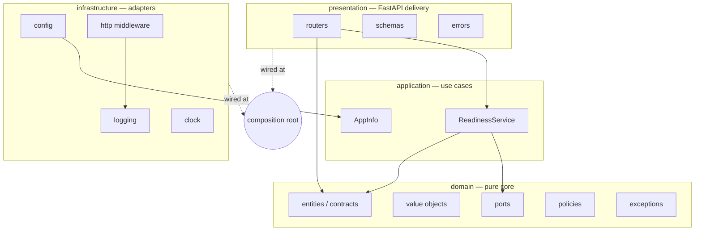
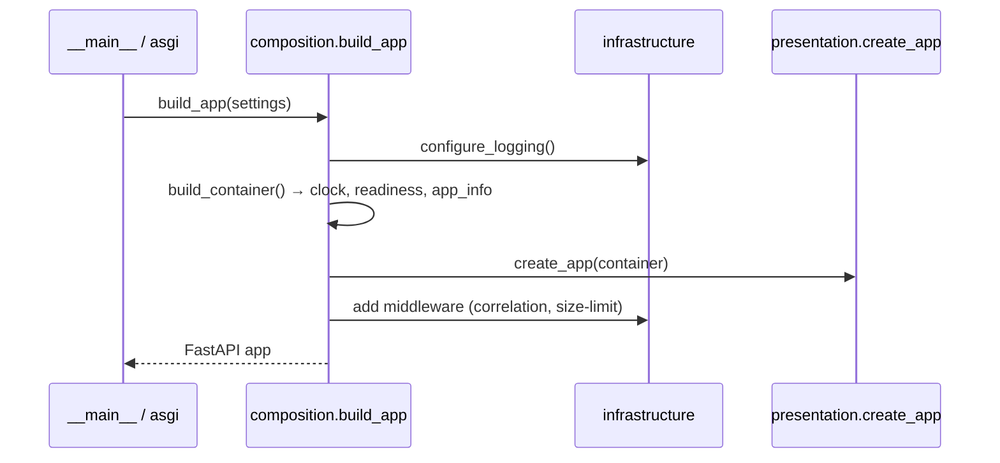
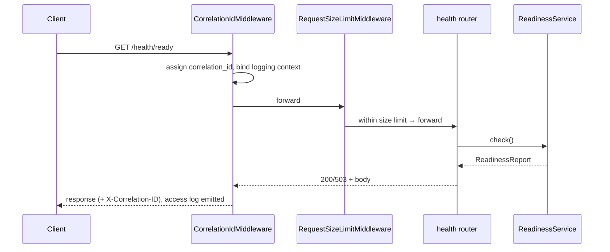

# Architecture

This document describes the layering, boundaries, and dependency rules of the
ComplianceIQ AI Service. It is the reference for *where code belongs* and *what
may depend on what*. The rules here are enforced automatically in CI by
import-linter (`.importlinter`), so they cannot silently decay.

## Clean Architecture layers

The service is organised in four concentric layers. Dependencies point **inward
only**: an outer layer may depend on an inner layer, never the reverse.

### Domain (`complianceiq.domain`)
The enterprise core. Entities (the Section 6 contracts), value objects (enums,
`Citation`, identifiers), ports (`Clock`, `HealthProbe`), policies (tenant
isolation), and the typed exception hierarchy. **Imports only the standard
library and Pydantic** — enforced by the `domain-is-pure` contract. This purity
is what makes the business rules testable in isolation and independent of any
framework or vendor.

### Application (`complianceiq.application`)
Use cases that orchestrate the domain through ports. `ReadinessService`
aggregates health probes; later phases add enrichment, copilot, remediation, and
report use cases. **May import the domain, nothing outer** — enforced by
`application-is-framework-free`. `mypy --strict` runs on this layer and the
domain.

### Infrastructure (`complianceiq.infrastructure`)
Adapters to the outside world: configuration (`pydantic-settings`), structured
logging (structlog), ASGI middleware, the system clock, and — in later phases —
the SQLAlchemy repositories, the Anthropic provider, the pgvector store, and the
Core API client. Each adapter implements a domain port.

### Presentation (`complianceiq.presentation`)
The HTTP delivery mechanism (FastAPI): routers, wire schemas, and the single
exception-to-HTTP mapping. Thin by design — no business logic.

## The independence of the two adapter layers

`presentation` and `infrastructure` are **sibling** adapters; neither imports the
other (`adapters-are-independent` contract). Presentation needs wired services,
but it must not reach into infrastructure. This is resolved two ways:

1. **A structural `Container` protocol** (`presentation/container.py`) declares
   *what* presentation needs (application services and DTOs). The concrete
   container built at the composition root satisfies it structurally.
2. **Cross-cutting infrastructure** (logging/correlation middleware) is attached
   to the app by the composition root, not imported by presentation.

## The composition root (`complianceiq.composition`)

The single place — outside all four layers — allowed to import from both
infrastructure and presentation. It constructs concrete adapters, assembles the
`ApplicationContainer`, builds the FastAPI app, and attaches middleware. The
entire dependency graph is visible in this one file; there are no global
singletons or service locators.

## Request lifecycle (Phase 1)

## Dependency rules (enforced)

| Contract | Rule |
|----------|------|
| `core-layers` | application → domain only |
| `domain-is-pure` | domain imports no inner layers, no adapter frameworks |
| `application-is-framework-free` | application imports no outer layers/frameworks |
| `adapters-are-independent` | presentation ⊥ infrastructure |

See `docs/ADR/` for the reasoning behind the significant choices.
