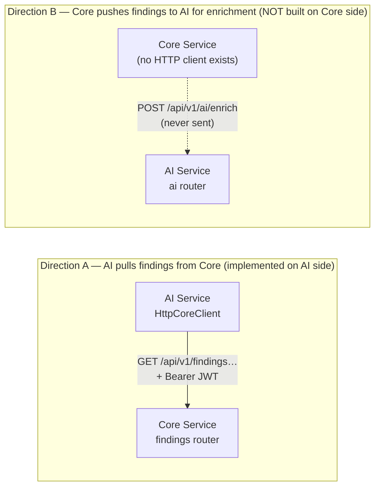

# Core Service ↔ AI Service — Compatibility Report

*A real, code-based assessment. Every finding cites the actual file on both sides.
Analysis only — no code was modified.*

**Sources analyzed**
- **AI Service:** this repository (`src/complianceiq/…`, `frontend/…`).
- **Core Service:** the uploaded ZIP (`contracts/ai_service/…`, `presentation/…`,
  `infrastructure/auth/…`, `composition.py`, `docker-compose.yml`, `.env.example`,
  `docs/integration/ai-service-integration.md`, `tests/contracts/fixtures/…`).

---

## Executive verdict

> ### ⚠️ **PARTIALLY COMPATIBLE — designed to fit, not yet wired together.**

The two services were **clearly designed against the same contract** and match
almost perfectly on data shapes and authentication. But the **integration is not
implemented end-to-end**, and the AI Service's HTTP client currently targets the
**wrong Core endpoints for its own strict models**. None of the gaps are deep
architectural conflicts — they are small, well-scoped fixes.

**The 5 most important reasons:**

1. ✅ **The finding data contract is a near-perfect, intentional match.** The Core
   ships a dedicated anti-corruption layer (`contracts/ai_service/models.py`) and
   dedicated `/ai-contract` endpoints that emit **exactly** the 11 fields the AI
   Service's `Finding` expects — same names, same enum values.
2. ✅ **Authentication is fully compatible.** Both use **RS256**, issuer
   `complianceiq-core`, audience `complianceiq`, and `sub`/`tenant_id`/`roles`
   claims. The Core publishes JWKS for offline verification and even mints an
   `ai-service` token in its stub.
3. ❌ **The Core→AI "enrichment" call does not exist in the Core.** The Core builds
   the outbound payload but has **no HTTP client / port / adapter** that actually
   POSTs it to the AI Service. → *Not built*, which is different from *incompatible*.
4. ⚠️ **The AI→Core "pull findings" path targets the rich endpoints, not the
   `/ai-contract` ones.** Because the AI's `Finding`/`Page` models are
   `extra="forbid"`, they will **reject** the richer shape (and the `has_more`
   pagination field). Two small AI-side changes fix it.
5. ✅ **Architecturally they fit.** Both are Clean/Hexagonal (ports & adapters +
   composition root); the boundary is a proper ACL on the Core side and a
   `CoreClient` port on the AI side. They can run together without violating either
   architecture.

---

## The single most important idea: there are TWO integration directions

Most confusion disappears once you separate them. They are **independent**.



| | Direction A (AI → Core) | Direction B (Core → AI) |
|---|---|---|
| **Who calls whom** | AI calls Core to fetch findings | Core calls AI to enrich findings |
| **AI-side code** | ✅ `infrastructure/core/http_client.py` (`HttpCoreClient`) | ✅ `routers/ai.py` accepts the payload |
| **Core-side code** | ✅ `presentation/routers/findings.py` + `/ai-contract` | ❌ **No HTTP client anywhere** — only `contracts/ai_service` builds the payload |
| **Status** | ⚠️ Works only if AI targets `/ai-contract` and tolerates `has_more` | ❌ Not implemented (contract-ready, unsent) |

**Beginner note — why this matters:** "compatible" and "connected" are not the same
thing. Two services can speak the same language (compatible) yet never have been
plugged into each other (not connected). Here, the *language* matches; the *wiring*
is missing in one direction and slightly misaimed in the other.

---

## Compatibility matrix

| Area | Status | Core Service | AI Service | Problem | Required change |
|---|---|---|---|---|---|
| **API — endpoints** | ⚠️ | Exposes rich `/api/v1/findings[/{id}]` **and** exact `/api/v1/findings[/{id}]/ai-contract` | `HttpCoreClient` calls the **rich** `/api/v1/findings[/{id}]` | AI's strict `Finding` (`extra="forbid"`) rejects the rich shape's extra fields | Point AI's `HttpCoreClient` at the `/ai-contract` paths |
| **API — pagination** | ❌→⚠️ | `PageResponse` includes `items,total,limit,offset,has_more` | `Page` = `items,total,limit,offset` with `extra="forbid"` (`has_more` is a *property*) | AI's `Page.model_validate` rejects the `has_more` key | Add `has_more` as an (ignored) field on AI's `Page`, or relax `extra` |
| **Data — Finding** | ✅ | `AiFindingContract` / `FindingContract.to_payload()` = 11 fields | `domain/entities/finding.py Finding` = same 11 fields | None (exact match) | None |
| **Data — enums** | ✅ | `Framework`,`RiskDomain`,`ExternalFindingStatus`,`Severity` values | Same enum string values | None | None |
| **Data — Resource** | ⚠️ | `NormalizedResourceContract.region: str \| None` | `domain/entities/resource.py NormalizedResource.region: NonEmptyStr` (required) | Core may emit `region=null`; AI requires non-empty. *Latent* — no AI endpoint ingests resources today | Make AI `region` optional **if** resources are ever sent |
| **Authentication** | ✅ | RS256, `iss=complianceiq-core`, `aud=complianceiq`, JWKS at `/.well-known/jwks.json` | `BaseJwtVerifier` pins alg, checks `iss`/`aud`/`exp`, RS256 via JWK | None (values match by design) | Configure AI's `CIQ_JWT_PUBLIC_KEY` from Core's JWKS (see below) |
| **Tenant isolation** | ✅ | `tenant_id` from verified token only; cross-tenant reads → 404 | Re-checks every finding's tenant (`assert_same_tenant`) as defense-in-depth | None | None |
| **AI integration (push)** | ❌ | No AI HTTP client / port / adapter | `/api/v1/ai/*` endpoints ready to receive | Enrichment call is not implemented in Core | Build a Core-side AI client + port (if push is desired) |
| **Error model** | ✅ | Consistent `ErrorEnvelope`; 401/403/404/422/409 | `HttpCoreClient._raise_for_status` maps 401→auth, 403→authz, 404→notfound | None (AI handles Core's codes) | None |
| **Configuration** | ⚠️ | `CIQ_CORE_API_BASE_URL=http://core-stub:9000`; JWT via `JWT_PRIVATE_KEY` | `core_api_base_url` default `http://core-stub:9000`; `core_client=stub` | Same var/port by design; AI must set `core_client=http` + the JWK | Set 3 env vars (below) |
| **Deployment** | ⚠️ | Core API on **8000**; stub on 9000; Postgres dependency | AI app also defaults to **8000** | Host-port clash if co-located on one host without separate networks | Give each a distinct host port / compose network |
| **Tests** | ✅ | `tests/contracts/fixtures/*.json` freeze both shapes; JWT attack tests | AI `test_core_client.py` tests `HttpCoreClient` via `MockTransport`; RS256 verifier tests | AI's client test asserts the **rich** path shape, so it won't catch the mismatch | Add an AI contract test against the real `/ai-contract` fixture |

Legend: ✅ compatible · ⚠️ compatible with change/config · ❌ incompatible / not built · ❓ undeterminable.

---

## Detailed findings

### 1. API & data models

#### 1.1 ✅ The Finding contract is an exact, intentional match
- **Core:** `contracts/ai_service/models.py → FindingContract.to_payload()` emits
  exactly: `id, tenant_id, resource_id, rule_id, framework, control_id, domain,
  status, severity, evidence, detected_at`. Mirrored on the wire by
  `presentation/schemas.py → AiFindingContract`.
- **AI:** `src/complianceiq/domain/entities/finding.py → Finding` declares exactly
  those 11 fields (inherits `FrozenModel`, `extra="forbid"`).
- **Enum values line up field-for-field:** `Framework` = `iso_27001, loi_05_20,
  dnssi, nist_csf, soc_2`; `RiskDomain` = `iam, network, encryption, logging,
  storage`; status = `pass/fail`; severity = `critical/high/medium/low`. Identical
  on both sides.
- **IDs are opaque strings on both sides** (Core's id is a composite like
  `acme:111…:user-1:iam-user-no-mfa:2026-06-01T12:00:00+00:00`; AI's `id` is
  `NonEmptyStr`). **There is no UUID-vs-string mismatch.**
- **Timestamps:** Core sends `detected_at` via `.isoformat()` (tz-aware); AI's
  `detected_at: AwareDatetime` accepts it. ✅
- **Verdict:** ✅ Compatible, exact. No change.

#### 1.2 ⚠️ The AI client calls the wrong Core endpoints for its strict model
- **AI:** `infrastructure/core/http_client.py` hardcodes
  `_FINDINGS_PATH = "/api/v1/findings"` and calls `GET /api/v1/findings/{id}` and
  `GET /api/v1/findings`, then does `Finding.model_validate(...)` /
  `Page[Finding].model_validate(...)`.
- **Core:** those paths return the **rich** `FindingResource` /
  `PageResponse[FindingResource]` — which include extra fields (`graph_context`,
  `related_attack_path_ids`, `account_id`, `scan_key`, `logical_finding_id`, …; see
  `tests/contracts/fixtures/page_findings.json`). The Core provides the **exact**
  shape at `/api/v1/findings/ai-contract` and `/api/v1/findings/{id}/ai-contract`.
- **What breaks:** AI's `Finding` is `extra="forbid"` → validating the rich shape
  raises a `ValidationError`. The Core even documents this split in `findings.py`
  and in `docs/integration/ai-service-integration.md §4`.
- **Verdict:** ⚠️ Compatible **with an AI-side change** — point `HttpCoreClient`
  at the `/ai-contract` paths.

#### 1.3 ❌→⚠️ Pagination envelope mismatch (`has_more`)
- **Core:** `presentation/schemas.py → PageResponse` = `items, total, limit,
  offset, **has_more**` (documented as "a convenience"). Present on **both** the
  rich and the `/ai-contract` list responses.
- **AI:** `domain/entities/pagination.py → Page` = `items, total, limit, offset`
  with `model_config = ConfigDict(extra="forbid")`; `has_more` exists only as a
  computed `@property`, **not a field**.
- **What breaks:** `Page[Finding].model_validate(core_json)` sees an unexpected key
  `has_more` → `ValidationError`. This bites even when the AI switches to
  `/ai-contract`.
- **Verdict:** ⚠️ Add `has_more: bool` (or `extra="ignore"`) to AI's `Page`.

#### 1.4 ⚠️ Resource contract `region` nullability (latent)
- **Core:** `NormalizedResourceContract.region: str | None` (may be null).
- **AI:** `domain/entities/resource.py → NormalizedResource.region: NonEmptyStr`
  (required, non-empty).
- **Why latent:** **no AI endpoint ingests `NormalizedResource`** today — the AI
  reasons over *findings*, not raw resources. So this mismatch cannot fire yet.
- **Verdict:** ⚠️ Only relevant *if* resource passing is added later; then make
  AI's `region` optional.

### 2. Authentication & security — ✅ fully compatible

| Property | Core (`infrastructure/auth/jwt_tokens.py`) | AI (`infrastructure/auth/jwt_base.py`) | Match |
|---|---|---|---|
| Algorithm | RS256 (pinned) | RS256 (pinned; also HS256 for dev) | ✅ |
| Issuer | `complianceiq-core` | checks `iss == complianceiq-core` | ✅ |
| Audience | `complianceiq` | checks `aud == complianceiq` | ✅ |
| Claims | `sub, tenant_id, roles, iss, aud, iat, exp, jti` | requires `sub, tenant_id, roles, exp, iss, aud` | ✅ (AI ignores extra `iat`/`jti`/`kid`) |
| Key distribution | JWKS at `/.well-known/jwks.json` (n/e, kid=`core-1`) | RS256 verifier takes a JWK public key | ✅ (config step) |
| `alg:none` / HS-confusion | explicitly defended + tested | algorithm pinned in `_check_algorithm` | ✅ |
| Tenant source | verified token only; never a param | tenant carried in `AuthContext`, re-checked | ✅ |

- **Roles:** Core issues `["reader"]` (+ `scanner`); the AI Service does not require
  a specific role for its own endpoints, so `reader` is sufficient and forward-safe.
- **Service identity:** the Core stub mints `subject="ai-service"`,
  `tenant_id="acme"`, roles `{reader, scanner}` (`composition.py`), i.e. a real
  service-to-service token the AI can use out of the box.
- **One real-world caveat (⚠️, not a blocker):** Core's JWKS is a **JWKS wrapper**
  `{"keys":[{…}]}`; the AI's RS256 verifier is configured with a **single JWK**
  (`CIQ_JWT_PUBLIC_KEY`). You must extract the one key object from the JWKS (or its
  `keys[0]`) when configuring the AI. Also note the AI's RS256 verification is a
  from-scratch PKCS#1 v1.5 implementation (ADR-0011) while the Core signs with
  `cryptography`; both are standard RS256, but this is the one pair worth an
  explicit end-to-end signature test.

### 3. AI integration (Direction B) — ❌ not implemented in Core
- **Core:** builds the payload (`contracts/ai_service/translation.py →
  finding_to_contract`, `to_payload()`), but a repository-wide search for an
  outbound HTTP client (`httpx`, `requests`, a `/ai/enrich` call, an
  `ai_service_url`) finds **nothing** in `infrastructure/`, `application/`, or
  `composition.py`. The only `ai` references are the `ai-service` **token subject**
  and the `/ai-contract` **read** endpoints.
- **AI:** the receiving endpoints exist and are ready — `routers/ai.py` accepts
  `POST /api/v1/ai/{enrich, ask, remediate, correlate, map, financial, report}`,
  and their request bodies (`presentation/schemas.py`) expect exactly the 11-field
  `Finding` the Core's ACL produces.
- **Verdict:** ❌ **Integration not built** (the Core never calls the AI). This is a
  *missing feature*, **not an incompatibility** — when built, the payloads already
  match.

### 4. Contract consistency (docs vs code) — ✅ consistent
- The Core's `docs/integration/ai-service-integration.md §4` lists **both** the rich
  and `/ai-contract` endpoints and states the AI should generate its client from the
  published OpenAPI. The **fixtures** (`tests/contracts/fixtures/finding_ai_contract.json`,
  `page_findings.json`) freeze the exact shapes. Docs and code agree.
- **The one discrepancy is on the AI side, not the Core:** the AI's `HttpCoreClient`
  did not adopt the `/ai-contract` endpoints the Core created for it. (Reported here,
  code unchanged.)

### 5. Tests
- **Core:** `tests/contracts/fixtures/*` provide deterministic golden payloads for
  both shapes; JWT tests cover `alg:none`/HS-confusion; the stub gives the AI a live
  target with real routing + real JWT verification.
- **AI:** `tests/unit/infrastructure/test_core_client.py` tests `HttpCoreClient`
  offline with `httpx.MockTransport`, and the RS256 verifier has its own tests.
  **Gap:** the AI's mocked responses assume the current (rich) path shape, so the
  suite would not catch the endpoint/`has_more` mismatch against a real Core.
- **Verdict:** ✅ both suites are healthy; ⚠️ add an AI-side test that validates
  against the Core's real `/ai-contract` fixture.

---

## Integration flow (as the code actually supports it)

**Today — Direction A (AI pulls findings), after the two small AI fixes:**
```text
Frontend (AI SPA)  →  AI Service /api/v1/ai/enrich/by-ids  (Bearer JWT)
      → AI HttpCoreClient  →  GET /api/v1/findings/{id}/ai-contract  (Bearer JWT)  →  Core Service
                                   ↓ (RS256 verify, tenant from token)
                              AiFindingContract (11 fields)
      ← AI enrichment: RAG + LLM Gateway + grounding (verify citations)
      ← EnrichedFinding (explanation + citations)  →  Frontend renders
```

**Intended — Direction B (Core pushes findings for enrichment), once built in Core:**
```text
Client  →  Core Service  (owns findings)
   → Core builds FindingContract.to_payload()  [EXISTS]
   → Core AI client POSTs /api/v1/ai/enrich  [DOES NOT EXIST — must be built]
                        ↓
   AI Service  →  LLM / RAG / Knowledge Base  →  grounded, cited answer
                        ↓
   ← Core stores / forwards  →  Client
```

---

## Required changes (prioritized)

### P0 — Blocking (the pull path fails against a real Core without these)
1. **Point the AI's `HttpCoreClient` at the `/ai-contract` endpoints.**
   `infrastructure/core/http_client.py`: use `/api/v1/findings/ai-contract` (list)
   and `/api/v1/findings/{id}/ai-contract` (get). *Why:* the rich endpoints carry
   extra fields the AI's `extra="forbid"` `Finding` rejects.
2. **Let the AI's `Page` accept `has_more`.** `domain/entities/pagination.py`: add
   `has_more: bool = False` (or set `extra="ignore"`). *Why:* the Core's page
   envelope always includes it, and AI currently forbids unknown keys.

### P1 — Important (needed for a real deployment / the push flow)
3. **Build the Core→AI outbound client** *if* enrichment-push is a required flow:
   a Core `application/ports` interface + an `infrastructure` httpx adapter that
   POSTs `FindingContract.to_payload()` to `/api/v1/ai/enrich`, wired in the Core's
   `composition.py`, using the `ai-service` token. *Why:* today nothing sends the
   payload the ACL builds.
4. **Configure auth wiring end-to-end:** set the AI's `CIQ_JWT_PUBLIC_KEY` from the
   Core's JWKS (extract the single key from `/.well-known/jwks.json`), set
   `CIQ_CORE_CLIENT=http` and `CIQ_CORE_API_BASE_URL` to the Core's base. Run one
   **live RS256 round-trip test** (Core signs → AI verifies).
5. **Resolve the port clash:** Core API and AI both default to `8000`; give each a
   distinct host port or its own compose network.

### P2 — Improvements (useful, non-blocking)
6. Add an AI contract test that validates `HttpCoreClient` against the Core's real
   `finding_ai_contract.json` / an `/ai-contract` page fixture.
7. If resource passing is ever added, make the AI's `NormalizedResource.region`
   optional to match the Core's nullable `region`.
8. Consider a shared, versioned contract package (or code-gen from the Core's
   OpenAPI) so the 11-field shape can never silently drift on either side.

---

## Beginner-friendly "why it matters"

- **"The AI calls `/findings` but should call `/findings/ai-contract`."** The Core
  can describe a finding in two ways: a *rich* version (with graph and risk extras)
  and a *slim* 11-field version made just for the AI. The AI is a strict eater — it
  refuses any plate with extra items on it (`extra="forbid"`). So it must order from
  the slim menu, or it throws the whole plate out with a validation error.
- **"The `has_more` field."** The Core adds a small "is there a next page?" flag to
  every list. The AI computes that itself and didn't expect the Core to send it, so
  it treats the flag as an unexpected intruder and rejects the page. Teaching the AI
  to accept (and ignore) that one flag fixes it.
- **"The enrichment call isn't built."** The Core has *written the letter* to the AI
  (the payload) but has *no mailbox to send it* (no HTTP client). The AI's inbox is
  open and the letter is addressed correctly — someone just has to build the mailbox.
- **"Same issuer/audience/RS256."** Think of the JWT as a passport. Both countries
  agreed on the same passport office (`complianceiq-core`), the same visa stamp
  (`complianceiq`), and the same anti-forgery ink (RS256, public-key verified). A
  traveler (the AI) can be trusted at the border without phoning the office — that's
  what JWKS is for.
- **"Both default to port 8000."** Two programs can't both answer the same doorbell
  on one machine. In separate containers it's fine; on one host, give one of them a
  different door number.

---

## Bottom line

The Core and AI Services are **built to the same contract and will interoperate**
with a handful of small, well-understood changes — almost all on the AI side, and
none architectural. The finding schema and authentication are already exact matches;
the remaining work is (a) two AI-client fixes for the pull path, (b) building the
Core's outbound enrichment client if push is wanted, and (c) routine config/port
wiring. This is the profile of two services that were **designed together**, not two
that happen to clash.
