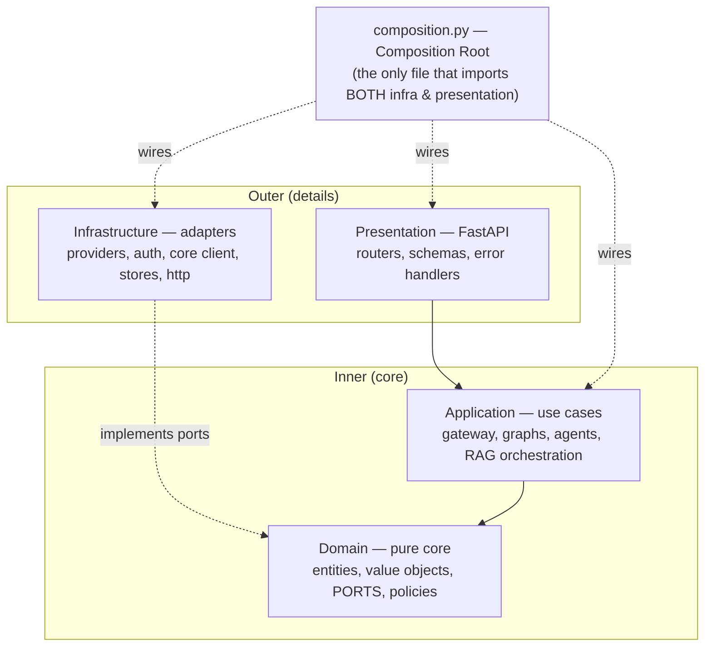
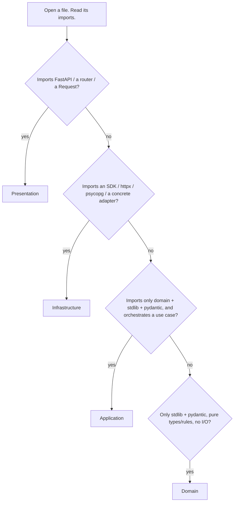
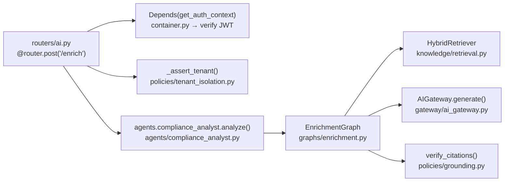
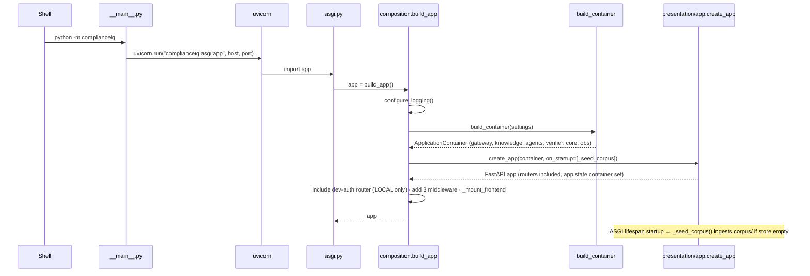
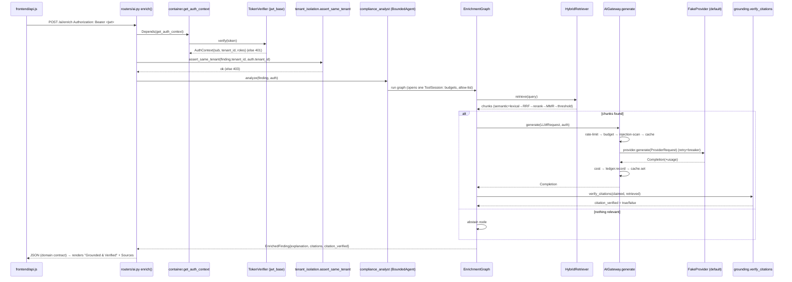
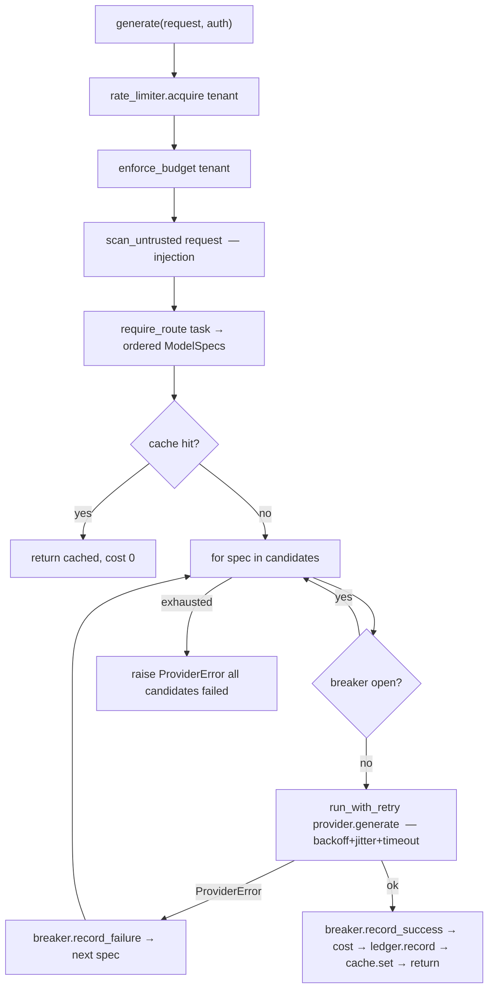
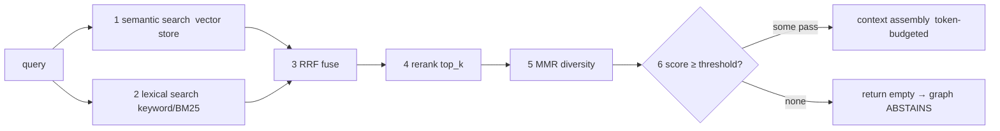
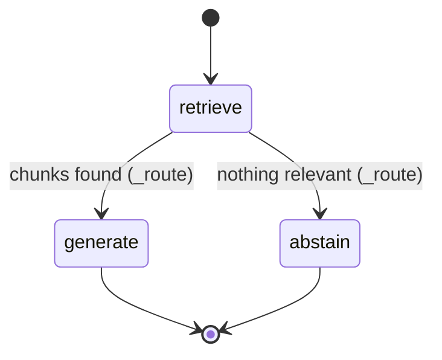

# ComplianceIQ — Zero to Hero (Technical Training Manual)

> A file-level, defend-it-as-if-you-built-it guide to the **actual** ComplianceIQ
> codebase. Every claim points to a real file, class, or function. Where something
> is **not** implemented, it says so.

**How to study this:** read top to bottom once (big picture → architecture →
structure → concepts → flows → components → security/testing → defense). Then use
the **File-to-Responsibility Map** (§9) and the **Revision Checklist** (§14) as
your quick reference. Look for the **🧠 If you remember only one thing** boxes.

---

## Table of contents
1. [The big picture](#1-the-big-picture)
2. [The architecture](#2-the-architecture)
3. [Project structure & how to identify a layer](#3-project-structure--how-to-identify-a-layer)
4. [How to read this repository](#4-how-to-read-this-repository)
5. [Core technical concepts, tied to the code](#5-core-technical-concepts-tied-to-the-code)
6. [Execution flow: startup](#6-execution-flow-startup)
7. [Execution flow: an authenticated AI request](#7-execution-flow-an-authenticated-ai-request)
8. [Component deep-dives](#8-component-deep-dives)
9. [File-to-responsibility map](#9-file-to-responsibility-map)
10. [Security](#10-security)
11. [Testing](#11-testing)
12. [Debugging & troubleshooting](#12-debugging--troubleshooting)
13. [Interview defense & "explain this file" drills](#13-interview-defense--explain-this-file-drills)
14. [Zero-to-Hero revision checklist](#14-zero-to-hero-revision-checklist)

---

## 1. The big picture

**What it is.** ComplianceIQ is the **AI subsystem** of a larger GRC (Governance,
Risk & Compliance) platform. A separate **Core Service** scans clouds, runs a rule
engine, owns tenants, and issues login tokens. **This service consumes the Core's
findings and adds intelligence**: it explains findings, maps controls across
frameworks, quantifies financial risk, proposes fixes, and answers compliance
questions — **grounded and cited, or it abstains.**

**What it deliberately does *not* do** (say this in an interview — it shows you
understand the boundary):

| It does NOT… | Because… |
|---|---|
| Scan clouds / run the rule engine | The Core Service owns that |
| Issue login tokens | It only **verifies** them (the Core issues) |
| Write to the Core's tables | It is a **read-only consumer** |
| Auto-apply any fix | A human approves in the Core (`approved` is forced `false`) |
| Invent facts | If the corpus doesn't cover it, it **abstains** |

**The four non-negotiable rules** — these *are* the design. Every architectural
choice serves one of them:

1. **Tenant isolation** — every query, cache key, and log line is scoped by `tenant_id`.
2. **No auto-remediation** — `RemediationProposal.approved` is structurally forced `false`.
3. **Grounding** — every AI claim is cited and verified, or the system abstains.
4. **Prompt-injection defense** — untrusted text is scanned before any model sees it.

> 🧠 **If you remember only one thing:** ComplianceIQ turns a *finding* into a
> *grounded, cited answer* through one hardened **AI Gateway** and a **RAG**
> pipeline, inside a **Clean Architecture** where dependencies only ever point
> inward — and that rule is enforced by tests in CI.

---

## 2. The architecture

### The pattern
**Clean Architecture + Ports & Adapters (Hexagonal) + a single Composition Root.**
Four layers; dependencies point **inward** only.



### What each layer means, concretely

| Layer | Folder | Knows about | Never imports | Example files |
|---|---|---|---|---|
| **Domain** | `domain/` | Only itself + pydantic | FastAPI, SQLAlchemy, any adapter | `entities/finding.py`, `ports/llm.py`, `policies/grounding.py` |
| **Application** | `application/` | Domain (ports) | Infrastructure, presentation, frameworks | `gateway/ai_gateway.py`, `graphs/*`, `agents/*` |
| **Infrastructure** | `infrastructure/` | Domain + application ports | Presentation | `providers/fake.py`, `auth/jwt_base.py`, `core/stub_client.py` |
| **Presentation** | `presentation/` | Application + domain | Infrastructure | `routers/ai.py`, `app.py`, `container.py` |
| **Root** | `composition.py` | **Everything** | — | `composition.py`, `asgi.py`, `__main__.py` |

### The dependency rule is *enforced*, not just drawn
`.importlinter` defines **four contracts** run by `lint-imports` in CI. A violation
**fails the build**:

1. `application → domain`, never the reverse.
2. Domain imports no inner layers **and no frameworks**.
3. Application imports no outer layers or frameworks.
4. **presentation and infrastructure must not import each other.**

**Why this way?** So the business core is testable with **zero mocks, no network,
no database**, and so you can swap Anthropic ↔ a fake provider, or Postgres ↔ an
in-memory store, **without changing business logic**. Presentation and
infrastructure are *sibling adapters* that only meet at the composition root.

**Alternatives & why they're worse here:** a "just put it in FastAPI route
functions" (transaction-script) design couples business rules to HTTP and to
vendor SDKs — you can't test a rule without spinning up the web app and mocking
Anthropic. A service-locator/global-singletons approach hides the dependency graph
everywhere; the composition root makes it visible in **one file**. Trade-off: more
files and indirection (ports + adapters + wiring) — worth it for a security product
that must be verifiable and swappable.

> 🧠 **If you remember only one thing:** *Dependencies point inward; the domain
> depends on nothing. Ports are interfaces the domain owns; adapters implement them
> in infrastructure; the composition root is the one place they're connected.*

---

## 3. Project structure & how to identify a layer

```
ComplianceIQ/
├── src/complianceiq/
│   ├── domain/          # pure business types & rules (no I/O)
│   │   ├── entities/        Finding, EnrichedFinding, CopilotAnswer, RemediationProposal…
│   │   ├── value_objects/   Severity, Framework, Citation, identifiers
│   │   ├── ports/           LLMProvider, TokenVerifier, CoreClient, RateLimiter, Clock…
│   │   ├── policies/        grounding, prompt_safety, tenant_isolation, financial_model
│   │   ├── llm/             LLM request/response/model value objects
│   │   ├── knowledge/       chunk/document/query types for RAG
│   │   └── _base.py         FrozenModel / DomainModel (Pydantic bases)
│   ├── application/     # use cases (orchestration)
│   │   ├── gateway/         ai_gateway.py, routing.py, retry.py, circuit_breaker.py, keys.py
│   │   ├── knowledge/       retrieval.py (HybridRetriever), fusion.py (RRF+MMR), context_assembly.py
│   │   ├── graphs/          enrichment/copilot/remediation/mapping/report/financial (LangGraph)
│   │   ├── agents/          base.py (BoundedAgent+ToolSession), 6 agents, suite.py
│   │   ├── tools/           registry, budget, corpus_tools
│   │   └── services/        health, observability
│   ├── infrastructure/  # adapters (real implementations)
│   │   ├── providers/       fake, anthropic_provider, openai_compatible, registry
│   │   ├── auth/            jwt_base, jwt_verifier (HS256), rs256_verifier, dev_token
│   │   ├── core/            stub_client, http_client, factory
│   │   ├── knowledge/       vector_store_memory, keyword_index_memory, reranker_lexical, pgvector_store
│   │   ├── http/            middleware (correlation id, size limit), metrics_middleware
│   │   ├── config/          settings.py (pydantic-settings)
│   │   └── logging/, observability/, prompts/
│   ├── presentation/    # delivery (HTTP)
│   │   ├── app.py           create_app (FastAPI factory)
│   │   ├── container.py     Container protocol + Depends providers (get_auth_context…)
│   │   ├── routers/         health, ai, findings, dev_auth
│   │   ├── schemas.py       wire request/response models
│   │   └── errors.py        domain-error → HTTP mapping
│   ├── composition.py   # THE composition root
│   ├── asgi.py          # app = build_app()
│   └── __main__.py      # python -m complianceiq → uvicorn
├── frontend/            # framework-free SPA (served at / by FastAPI)
├── tests/               # 282 tests across all layers
├── corpus/frameworks/   # 5 framework JSON files (the knowledge base)
├── prompts/             # 7 versioned *.prompt templates
├── scripts/             # ingest_corpus, evaluate_ai, mint_dev_token
├── migrations/          # 0001_knowledge_pgvector.sql (optional)
├── docs/                # ARCHITECTURE, API, RAG, AGENTS, ADRs, frontend/, mastery/, study-guide/
└── pyproject.toml · requirements.txt · Dockerfile · docker-compose.yml · .github/workflows/ci.yml · .importlinter
```

### How to tell which layer a file is in (a decision procedure)


> 🧠 **If you remember only one thing:** the **imports tell you the layer.** Domain
> imports nothing but pydantic; presentation imports FastAPI; infrastructure imports
> SDKs; application imports only domain ports.

---

## 4. How to read this repository

A systematic path — do it in this order the first time:

1. **Start at the edges you already understand.** Open `__main__.py` → `asgi.py` →
   `composition.py`. This is the *spine*: how the app is built. Read `build_app` and
   `build_container` top to bottom.
2. **Read the domain vocabulary.** `domain/entities/finding.py`,
   `domain/value_objects/enums.py`, `domain/_base.py`. Now you know the nouns.
3. **Read the ports.** `domain/ports/*` — these are the promises the app relies on.
   Each port has (a) an in-memory/fake adapter and (b) a real adapter.
4. **Follow one endpoint end to end** (see the recipe below).
5. **Read the AI Gateway** (`application/gateway/ai_gateway.py`) — the busiest file.
6. **Read one graph** (`application/graphs/enrichment.py`) — the template for all six.

### Recipe: follow an API endpoint

**How to trace a function:** grep the class name to find where it's *constructed*
(almost always `composition.py`) and where its methods are *called* (a router or a
graph node). The constructor tells you its dependencies; the caller tells you its role.

**How to identify dependencies of a file:** read its `import` block. Inner-layer
imports = what it needs; nothing else may reach in. **Who depends on it:** grep the
module path across `src/`.

---

## 5. Core technical concepts, tied to the code

Each concept: **what it is → in our project → why.**

### 5.1 Pydantic v2 models (frozen, `extra="forbid"`)
- **What:** Pydantic validates and parses data against typed models.
- **In our project:** `domain/_base.py` defines `FrozenModel` (immutable value
  objects/contracts) and `DomainModel` (mutable entities). Both set
  `extra="forbid"`. Almost every domain type inherits `FrozenModel`.
- **Why:** immutability makes objects safe to share across async tasks and cache
  without copying; `extra="forbid"` means a typo'd/injected field **fails loudly at
  the boundary** instead of being silently accepted — a security posture.

### 5.2 Type hints & `from __future__ import annotations`
- Every module uses full type hints; `mypy --strict` runs on domain+application in
  CI. Types are the first line of correctness — a wrong shape fails the type check
  before any test runs.

### 5.3 async/await
- **What:** cooperative concurrency — `await` yields while I/O is pending.
- **In our project:** provider calls, retrieval, the gateway, and every router are
  `async`. FastAPI runs them on an event loop.
- **Why:** an AI service is I/O-bound (waiting on model/network). Async lets one
  worker handle many in-flight requests without threads.

### 5.4 ABCs as ports / Protocols as structural interfaces
- **Ports** are `abc.ABC` classes in `domain/ports/*` (e.g. `LLMProvider` with
  `@abstractmethod generate/stream/embed/count_tokens`). Adapters subclass them.
- **The `Container`** in `presentation/container.py` is a `typing.Protocol` —
  *structural* typing: any object with the right attributes satisfies it, **with no
  import**. That's how presentation gets services without importing infrastructure.
- **Why two styles?** ABC when you want an explicit contract adapters opt into;
  Protocol when you want to decouple *without* an import edge (rule 4).

### 5.5 Dependency Injection & the Composition Root
- **What:** objects receive their dependencies instead of creating them.
- **In our project:** every class takes its collaborators in `__init__` (e.g.
  `AIGateway(providers=…, rate_limiter=…, cache=…, ledger=…, sleeper=…, clock=…)`).
  **`composition.py`** is the single place that constructs concretes and assembles
  them into a frozen `ApplicationContainer`. FastAPI resolves them via `Depends`
  providers that read `request.app.state.container`.
- **Why:** you can build the whole graph with fakes in a test by passing a
  different `Settings`. No global state, no service locator.

### 5.6 Error handling — one mapping
- Domain/application raise typed `ComplianceIQError` subclasses (never HTTP).
  **`presentation/errors.py`** owns the *single* exception→HTTP mapping and returns
  a consistent `ErrorEnvelope`. Adding a new error = one line in a table.
- **Why:** business code stays HTTP-agnostic; no stack trace ever leaks; clients
  parse one error shape everywhere.

### 5.7 Configuration
- **`infrastructure/config/settings.py`** — pydantic-settings, prefix `CIQ_`, reads
  env/`.env`, validated once and **frozen**. Secrets are `SecretStr` (repr masked).
- **Why:** twelve-factor; misconfiguration fails fast at startup, not mysteriously
  at runtime.

> 🧠 **If you remember only one thing:** *Interfaces live in the domain (ports),
> implementations live in infrastructure (adapters), and they're wired once in
> `composition.py`. That single fact explains testability, swappability, and the
> whole folder layout.*

---

## 6. Execution flow: startup



**Files/functions at each step:** `__main__.main()` → `asgi` (module-level
`app = build_app()`) → `composition.build_app()` → `composition.build_container()`
→ `presentation/app.create_app()` → lifespan hook `_seed_corpus`.

**Verifier auto-selection** (inside `build_container`): if `settings.jwt_public_key`
looks like a JWK → build the **RS256** verifier; else the **HS256** verifier. Both
satisfy the `TokenVerifier` port; callers never know which.

---

## 7. Execution flow: an authenticated AI request

Concrete example: the user clicks **Explain** on a finding → `POST /api/v1/ai/enrich`.



**The pattern is identical for all 8 AI endpoints** — only the agent/graph changes.
Auth (401) → tenant check (403) → bounded agent → LangGraph → gateway/retriever →
grounded contract → JSON.

> 🧠 **If you remember only one thing:** *authenticate → tenant-check → bounded
> agent runs a graph → retrieve → generate (or abstain) → verify citations →
> return a typed contract.* Master this once and you can narrate every endpoint.

---

## 8. Component deep-dives

### 8.1 The AI Gateway — `application/gateway/ai_gateway.py`
**What it does:** the single choke point for every model call. **How it works:**
`generate()` runs checks in a deliberate, security-first order.



**Dependencies (constructor):** `providers`, `RoutingTable`, `GatewayConfig`,
`RateLimiter`, `ResponseCache`, `UsageLedger`, `Sleeper`, `Clock` — **all domain
ports**. That's why it's testable with fakes. **Who uses it:** every graph node
that generates, and the agents. **Remove it →** no safe path to any LLM; all AI
breaks.

- **Circuit breaker** (`circuit_breaker.py`): one per provider, CLOSED→OPEN after N
  failures→HALF_OPEN after cooldown. Stops hammering a dead provider.
- **Retry** (`retry.py`): exponential backoff + **full jitter**, injected `Sleeper`
  → deterministic tests. Never retries a safety error.
- **Cache key** (`keys.py`): `ai:completion:{tenant}:{sha256(content)}` — tenant in
  the key ⇒ no cross-tenant leak (rule 1).

### 8.2 Providers & routing
- **`domain/ports/llm.py` `LLMProvider`** (ABC): `name`, `generate`, `stream`,
  `embed`, `count_tokens`. A provider is a *dumb executor*: it runs a resolved
  `ProviderRequest` and maps the vendor response back to a domain `Completion` —
  and **raises `ProviderError`, never a raw SDK exception**, so the gateway can
  retry/fallback uniformly.
- **Adapters:** `fake.py` (deterministic, offline, **default**),
  `anthropic_provider.py` (Claude, SDK lazy-imported), `openai_compatible.py`
  (httpx; fallback + embeddings).
- **`application/gateway/routing.py` `RoutingTable`:** maps a `TaskClass` to an
  **ordered** list of `ModelSpec` (primary + fallbacks). Models are **data**, not
  `if provider == …`. Adding a model = adding a `ModelSpec`.

**Why a fake default?** The whole system — demo and all 282 tests — runs offline,
deterministically, with no keys and no network. *(Real provider paths are coded and
wired but default-off; live calls are unverified in this environment — labelled
PARTIAL.)*

### 8.3 The RAG pipeline — `application/knowledge/retrieval.py`
`HybridRetriever.retrieve()`:



**Why hybrid?** Semantic search understands paraphrase but misses exact identifiers
("PR.AA-01"); lexical nails identifiers but misses meaning. Compliance needs both.
**Supporting files:** `fusion.py` (RRF + MMR), `context_assembly.py`, and infra
stores `vector_store_memory.py`, `keyword_index_memory.py`, `reranker_lexical.py`.
*(pgvector store exists behind the `VectorStore` port for `CIQ_VECTOR_STORE=pgvector`
— PARTIAL: needs Postgres to run live.)*

### 8.4 LangGraph workflows — `application/graphs/*`
Each capability is a `StateGraph`. The template:



Nodes are injected **bound methods** (`_retrieve`, `_generate`, `_abstain`); the
conditional edge `_route` returns `"generate"` or `"abstain"`. Typed state
(`TypedDict`), `MemorySaver` checkpointer. **Why a graph, not `if`s?** So the
abstain branch is a first-class, inspectable edge. `report`/`financial` graphs are
simpler (no retrieval; financial is deterministic first, then narrated).

### 8.5 Bounded agents & tools — `application/agents/base.py`
`BoundedAgent` wraps a graph with safety rails. Each run opens **one `ToolSession`**
enforcing **five controls** (verbatim from the code):

1. **Allow-list** — a tool not in `allowed_tools` → `WorkflowError`.
2. **Iteration budget** — hard cap on tool calls per run.
3. **Wall-clock budget** — hard cap on elapsed time per run.
4. **Loop detection** — an identical repeated tool-call signature (`_seen`) → stop.
5. **Output scanning** — every tool's output is `scan_for_injection`-ed before the
   agent may trust it (defence-in-depth, rule 4).

Budgets live on the session, so they're **per-run and never leak between requests**.
**Why?** Autonomous tool-use can loop forever, run up cost, or be steered by
injected tool output — unacceptable for a security product.

### 8.6 Grounding — `domain/policies/grounding.py`
After generation, `verify_citations(claimed, retrieved_context)` checks that every
cited control actually appears in the retrieved chunks. It returns a
`CitationVerification`; the graph sets `citation_verified` from it. **The model does
not decide it's grounded — policy code does.** No relevant sources ⇒ abstain.

### 8.7 Auth — `infrastructure/auth/*`
`BaseJwtVerifier.verify()` (in `jwt_base.py`) is the shared pipeline: split →
**pin algorithm** → verify signature → check temporal (`exp`/`nbf`, 60s leeway) →
check `iss`/`aud` → project claims into `AuthContext`. `HS256TokenVerifier`
(`jwt_verifier.py`) and `RS256TokenVerifier` (`rs256_verifier.py`) subclass it and
supply *only* the signature step — both stdlib-only (no crypto package).

### 8.8 Core client — `infrastructure/core/*`
`CoreClient` port (`domain/ports/core.py`): `get_finding`, `list_findings` —
tenant-scoped, forwarding the caller's bearer token. `stub_client.py` (offline,
seeded) and `http_client.py` (real Core over REST). `factory.py` picks one from
`CIQ_CORE_CLIENT`. A finding in another tenant reads as **404**, never a leak.

---

## 9. File-to-responsibility map

The files that matter for understanding and defending the project.

| File | Layer | Responsibility | Used by | Depends on |
|---|---|---|---|---|
| `__main__.py` | Root | `python -m complianceiq` → run uvicorn | user | asgi, settings |
| `asgi.py` | Root | `app = build_app()` (ASGI object) | uvicorn | composition |
| `composition.py` | Root | **Wire everything**; build container + app; mount frontend | asgi | all layers |
| `presentation/app.py` | Pres | FastAPI factory: lifespan, handlers, include routers | composition | container, routers, errors |
| `presentation/container.py` | Pres | `Container` Protocol + `Depends` (`get_auth_context`…) | routers | application, domain ports |
| `presentation/routers/ai.py` | Pres | 8 AI endpoints (auth→tenant→agent) | FastAPI | agents, tenant_isolation, schemas |
| `presentation/routers/findings.py` | Pres | Findings read API (list/get) | FastAPI | CoreClient port, container |
| `presentation/routers/dev_auth.py` | Pres | LOCAL dev-token minting (injected minter) | composition | schemas only (no infra) |
| `presentation/errors.py` | Pres | domain-error → HTTP mapping + envelope | app.py | exceptions, schemas |
| `presentation/schemas.py` | Pres | Wire request/response models | routers | domain entities |
| `application/gateway/ai_gateway.py` | App | The choke point for every model call | graphs, agents | domain ports (provider, cache, ledger…) |
| `application/gateway/routing.py` | App | Task→ordered ModelSpecs | gateway | domain llm models |
| `application/gateway/circuit_breaker.py` | App | Per-provider failure breaker | gateway | Clock port |
| `application/gateway/retry.py` | App | Backoff + jitter | gateway | Sleeper port |
| `application/knowledge/retrieval.py` | App | HybridRetriever (semantic+lexical→…→abstain) | graphs | stores, reranker, fusion |
| `application/knowledge/fusion.py` | App | RRF + MMR | retrieval | — |
| `application/graphs/enrichment.py` | App | retrieve→generate/abstain graph | ComplianceAnalyst | retriever, gateway, grounding |
| `application/agents/base.py` | App | BoundedAgent + ToolSession (5 controls) | 6 agents | tools, prompt_safety, Clock |
| `domain/entities/finding.py` | Dom | `Finding`, `EnrichedFinding` contracts | everywhere | _base, value objects |
| `domain/ports/llm.py` | Dom | `LLMProvider` interface | gateway | llm value objects |
| `domain/ports/core.py` | Dom | `CoreClient` interface | findings router, enrich-by-ids | Finding, Page |
| `domain/policies/grounding.py` | Dom | `verify_citations` (the trust guarantee) | graphs | Citation |
| `domain/policies/prompt_safety.py` | Dom | `scan_for_injection` | gateway, ToolSession | Severity |
| `domain/policies/tenant_isolation.py` | Dom | `assert_same_tenant` | ai.py router | exceptions |
| `domain/_base.py` | Dom | `FrozenModel` / `DomainModel` | all domain types | pydantic |
| `infrastructure/providers/fake.py` | Infra | Deterministic offline LLM (default) | composition | LLMProvider port |
| `infrastructure/auth/jwt_base.py` | Infra | Shared JWT verify pipeline | HS256/RS256 verifiers | AuthContext, Clock |
| `infrastructure/core/stub_client.py` | Infra | Seeded offline findings | composition (local) | Finding, Page |
| `infrastructure/config/settings.py` | Infra | All config, validated, secrets masked | composition | pydantic-settings |
| `frontend/assets/js/api.js` | Client | Only fetch layer: Bearer, timeout, error-normalise | pages | — |
| `frontend/assets/js/app.js` | Client | Boot + shell + routing + guard | index.html | api, auth, router, pages |

---

## 10. Security

Every mechanism below is actually in the code.

### 10.1 Authentication (who are you?) — 401
Every protected route depends on `get_auth_context` (`presentation/container.py`),
which reads `Authorization: Bearer <jwt>`, strips the prefix, and calls
`container.token_verifier.verify(token)`. Invalid/missing → `AuthenticationError`
→ **401**. The verify pipeline **pins the algorithm** (a token claiming `alg:none`
or the wrong family is rejected — defeats algorithm-confusion/downgrade), checks
`exp`/`nbf` (60s leeway), and checks `iss == complianceiq-core` / `aud == complianceiq`.

### 10.2 Authorization / tenant isolation (are you allowed *this*?) — 403
`domain/policies/tenant_isolation.py assert_same_tenant()` rejects a finding whose
`tenant_id` differs from the caller's → `TenantIsolationError` → **403**. Applied in
`routers/ai.py` (`_assert_tenant`) on every request that carries findings. The Core
client is also tenant-scoped, and cache keys embed the tenant — so isolation holds
at the API, the data source, **and** the cache.

### 10.3 The single error → HTTP mapping (`presentation/errors.py`)
| Exception | HTTP | Meaning |
|---|---|---|
| `ValidationError` | 422 | bad input shape |
| `NotFoundError` | 404 | not found (incl. cross-tenant read) |
| `AuthenticationError` | 401 | bad/missing token |
| `TenantIsolationError` | 403 | wrong tenant (checked *before* its parent) |
| `AuthorizationError` | 403 | not permitted |
| `RateLimitError` | 429 | tenant over rate limit |
| `GroundingError` | 422 | ungrounded output rejected |
| `UnsafeContentError` | 400 | prompt injection blocked |
| `UnsafeTargetError` | 403 | unsafe IaC target |
| `ProviderError` | 502 | upstream model failed |
| `DependencyUnavailableError` | 503 | Core/DB unreachable |

No stack trace ever leaks; the body is always an `ErrorEnvelope`
`{error:{code,message,correlation_id,details}}`. **Order matters:** `TenantIsolationError`
is mapped before its parent `AuthorizationError`.

### 10.4 Prompt-injection defense (rule 4)
`domain/policies/prompt_safety.py scan_for_injection()` is a rule-based detector
(ignore-instructions, role-override, credential-exfiltration…) returning a
`Severity`. The **gateway** runs it on **untrusted** messages only
(`message.role.is_trusted` → skip) and blocks HIGH+ before any model sees the text.
Because scanning is at the gateway, *every* feature is protected. Agents also scan
**tool output** (defence-in-depth).

### 10.5 Input validation & secrets
- **Validation:** Pydantic models with `extra="forbid"` reject unknown/typo'd
  fields at the boundary; request bodies (`schemas.py`) bound lengths/counts.
- **Secrets:** `SecretStr` in `settings.py` — masked `repr`, only reachable via
  `.get_secret_value()`. Config comes from env/`.env` (`CIQ_` prefix), never
  hard-coded.
- **HTTP hardening:** `RequestSizeLimitMiddleware` caps body size;
  `CorrelationIdMiddleware` tags every request/log for tracing.

> 🧠 **If you remember only one thing:** *401 = who you are (bad token); 403 = what
> you may touch (wrong tenant). Injection is scanned at the gateway on untrusted
> text only. Every error is mapped in one file and never leaks internals.*

---

## 11. Testing

**282 tests**, deterministic and **offline** (fake provider + in-memory stores).

| Category | Where | Verifies |
|---|---|---|
| Domain | `tests/unit/domain` | entities, value objects, policies (grounding, injection, tenant, financial) |
| Application | `tests/unit/application` | the AI Gateway (retry, breaker, cache, budget, injection) |
| Knowledge/graphs | `tests/unit/knowledge`, `graphs` | retrieval fusion/ranking/abstention; graph routing |
| Infrastructure | `tests/unit/infrastructure` | providers, JWT (HS256/RS256), Core client (stub+http), stores |
| Presentation | `tests/unit/presentation` | endpoints: 401, 403 cross-tenant, happy paths; error envelope; metrics |

**Unit vs integration:** the suite is unit-level and offline by design (no
testcontainers required); the *presentation* tests exercise the app end-to-end via
FastAPI's `TestClient` but still with fakes — so they're fast and hermetic.

**How dependencies are replaced:** the app is built from **test `Settings`** in
`tests/conftest.py` (`build_app(settings)`), so the composition root wires the
`fake` provider, in-memory stores, and stub Core — **no monkeypatching**. That's the
payoff of the composition root: swapping is a config change.

**How to read a test:** look at (1) what fakes it injects → tells you the
collaborators, (2) the single behaviour it asserts. Example: in
`tests/unit/presentation/test_ai_endpoints.py`, `test_cross_tenant_finding_is_blocked`
mints a `tenant-a` token, posts a `tenant-b` finding, and asserts **403** with code
`tenant_isolation_violation` — proving rule 1 at the boundary.

**Most important tests to name in an interview:** "endpoint requires authentication"
(401), "cross-tenant finding is blocked" (403), the JWT algorithm-pinning tests, and
the gateway fallback/injection tests.

**Quality gates (CI, `.github/workflows/ci.yml`):** ruff · black --check · mypy
--strict (domain+application) · lint-imports (the 4 contracts) · pytest --cov (~85%).

---

## 12. Debugging & troubleshooting

| Symptom | First look | Likely cause / fix |
|---|---|---|
| **Endpoint 404/doesn't work** | Is the router included in `app.py`/`composition`? Path prefix (`/api/v1/…`)? | Router not registered, or the catch-all frontend mount shadowing — API routes are registered *before* the mount, so check ordering |
| **401 everywhere** | `get_auth_context`; the token's `iss`/`aud`/`exp`/`alg` | Wrong issuer/audience, expired, or `alg` not pinned to the configured scheme; in prod use a real RS256 token |
| **403 on a valid token** | `assert_same_tenant`; the finding's `tenant_id` vs the token's | You're acting cross-tenant — expected. Use the matching tenant |
| **422 validation error** | The `schemas.py` request model; `extra="forbid"` | An unknown/typo'd field or wrong type — the envelope's `details` names it |
| **AI provider failure (502)** | Gateway logs; `ProviderError`; circuit breaker state | Upstream failed; retries+fallback exhausted. Offline default is `fake`, so repeated 502 usually means a restart mid-request |
| **RAG returns nothing / always abstains** | `retrieval.py` score threshold; was the corpus seeded? | `_seed_corpus` didn't run (store non-empty check) or the query is genuinely off-corpus (correct abstention) |
| **Vector/DB problems** | `CIQ_VECTOR_STORE`, `CIQ_CORE_CLIENT` | With defaults there's **no external DB**; if set to `pgvector`/`http`, that dependency must be up (`/health/ready` lists it) |
| **DI / "container has no attribute"** | `composition.build_container`; the `Container` protocol | A service wasn't wired, or a router asked for something the container doesn't expose |
| **Config/env problems** | `settings.py`; a stray `.env` | Defaults work out of the box; remove unintended overrides. Secrets missing → construction fails loudly |
| **Test failures** | Run one test; check the injected fakes | A contract changed shape; or an import-linter contract broke (run `lint-imports`) |

**General method:** reproduce → read the *error envelope* `code` (it maps 1:1 to an
exception in `errors.py`) → open that exception's raise site → walk outward to the
router. The `correlation_id` in the response ties the request to its log lines.

---

## 13. Interview defense & "explain this file" drills

### Rapid-fire Q&A (answer without looking)
1. **Why a port instead of importing the adapter?** Dependency inversion — the
   gateway depends on `LLMProvider`, never a vendor SDK, so it's swappable and
   testable with a fake. *(domain/ports/llm.py)*
2. **Why can't domain import infrastructure?** So business rules test with zero
   mocks and adapters swap freely; enforced by import-linter contract 2.
3. **Where is dependency injection assembled?** `composition.py` — the only file
   importing infra + presentation; tests reconfigure by passing `Settings`.
4. **How do routers get services without importing infrastructure?** A structural
   `Container` Protocol (`container.py`) — no import edge (contract 4).
5. **How is hallucination prevented?** `verify_citations` checks every cited
   control against retrieved chunks; policy (not the model) sets `citation_verified`;
   no sources ⇒ abstain.
6. **401 vs 403?** 401 bad/missing token (auth); 403 wrong tenant (`assert_same_tenant`).
7. **How is injection defended, and where?** `scan_for_injection` at the gateway on
   untrusted messages, blocking HIGH+; agents also scan tool output.
8. **Why LangGraph over functions?** Explicit, inspectable branches — especially
   abstain — with typed state and a checkpointer.
9. **Why Decimal for cost?** Money must not accumulate float error (`ModelCost`).
10. **What's genuinely not done?** Backend PDF export & corpus browsing (future);
    live Anthropic/pgvector/http-Core coded but default-off; dashboard aggregates
    are client-side. *(Be honest — it's a strength.)*

### "Can you explain this file?" — practice
Cover the answer; explain aloud; then check.

- **`composition.py`** → *The composition root: the only file importing infra +
  presentation. It builds every concrete adapter from `Settings`, assembles them
  into a frozen `ApplicationContainer`, creates the FastAPI app, adds middleware,
  and mounts the frontend. Remove it → nothing is wired.*
- **`application/gateway/ai_gateway.py`** → *The single choke point for model calls:
  rate-limit → budget → injection → cache → routed provider (retry + breaker) →
  cost/ledger. Depends only on domain ports. Remove it → all AI breaks.*
- **`domain/policies/grounding.py`** → *`verify_citations` — the trust guarantee.
  Policy code sets `citation_verified`, never the model. Remove it → answers can't
  be trusted.*
- **`presentation/container.py`** → *The DI seam: a `Container` Protocol plus
  `Depends` providers (`get_auth_context`, `get_agents`…). It's how presentation
  reaches services without importing infrastructure.*
- **`infrastructure/auth/jwt_base.py`** → *The shared JWT verify pipeline (alg-pin,
  signature, temporal, iss/aud → `AuthContext`); HS256/RS256 subclass only the
  signature step. Remove it → no authentication.*

---

## 14. Zero-to-Hero revision checklist

Tick each only when you can explain it **without looking at the code**.

**Architecture**
- [ ] The four layers and the inward dependency rule
- [ ] The four import-linter contracts and that they run in CI
- [ ] Why domain depends on nothing; ports vs adapters
- [ ] The composition root — what it is and what it may import
- [ ] The `Container` Protocol and why it exists (no import edge)

**Startup & flow**
- [ ] Trace `python -m complianceiq` to "ready"
- [ ] Trace an authenticated `/ai/enrich` request end to end
- [ ] The identical pattern behind all 8 AI endpoints

**AI / RAG**
- [ ] The AI Gateway's check order and why that order
- [ ] Circuit breaker, jittered retry, tenant-scoped cache key
- [ ] Provider routing as data; the fake default
- [ ] The 6-step hybrid RAG pipeline and why hybrid
- [ ] Grounding: cite → verify → abstain (policy sets the flag)
- [ ] LangGraph graphs; bounded agents' five controls

**Security**
- [ ] 401 vs 403; the algorithm-pinning defense
- [ ] Tenant isolation at API + data + cache
- [ ] Injection scan at the gateway (trusted vs untrusted)
- [ ] The single error→HTTP mapping; secrets as `SecretStr`

**Frontend & API**
- [ ] Same-origin serving (StaticFiles mount, no CORS)
- [ ] `api.js` as the single fetch layer; token in localStorage
- [ ] The endpoint map and the returned domain contracts

**Testing & config**
- [ ] 282 offline tests; how fakes are injected via `Settings`
- [ ] The quality gates (ruff/black/mypy/lint-imports/pytest)
- [ ] Key env vars (`CIQ_ENVIRONMENT`, `_LLM_PRIMARY_PROVIDER`, `_CORE_CLIENT`, `_VECTOR_STORE`)

**Honesty**
- [ ] What's IMPLEMENTED vs PARTIAL vs FUTURE (and why the gaps are fine)

> 🧠 **The one sentence to close on:** *"ComplianceIQ turns a compliance finding
> into a grounded, cited answer through a hardened AI Gateway and a hybrid RAG
> pipeline, inside a Clean Architecture whose inward dependency rule is enforced by
> CI — which is why every part is swappable, testable, and defensible."*

---

*Companion documents:* the visual **`ComplianceIQ-Field-Guide.pdf`** (4-hour study
plan) and the one-page **`ComplianceIQ-Defense-CheatSheet.pdf`** in this folder;
deep architecture detail in `docs/ARCHITECTURE.md`, `docs/RAG.md`, `docs/AGENTS.md`,
and the ADRs.
