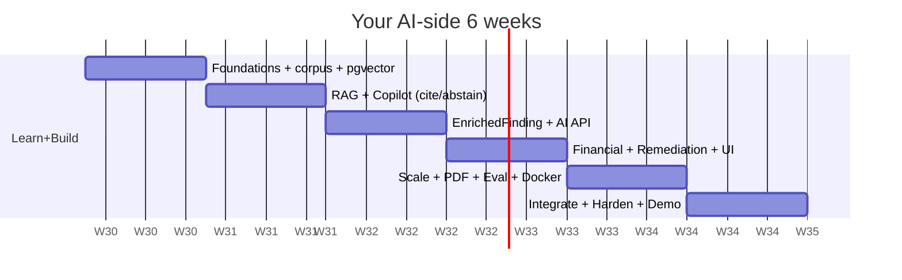

# 🗺️ ComplianceIQ — Complete 6-Week Execution Roadmap (AI Owner)

*Prepared as: Senior Technical Project Manager + Engineering Manager + Software Architect + Agile Coach.*

> **Who this is for:** you — the owner of the **entire AI domain**. This is your daily driver. Your teammate's platform track appears at every integration point so you stay in sync, but the day-by-day spine is **your** work. Follow it top to bottom and you never have to decide "what now?"

**Assumptions baked in** (adjust if wrong): full-time internship ≈ **7 focused hours/day, Mon–Sat**, **Sunday = light review / buffer (0–3h)**. Near-greenfield start. AWS-first MVP, dev against **LocalStack**. Vector DB = **pgvector**. Monorepo. Two engineers. These match the scoped MVP agreed earlier.

---

## 📌 0. The whole plan on one page

| Week | Theme | Your headline deliverable | Integration checkpoint |
|---|---|---|---|
| **1** | Foundation + Learn + Corpus | pgvector loaded with the regulatory corpus; you can retrieve relevant chunks | **M-CONTRACT** (schemas frozen) |
| **2** | RAG + Copilot | Ask a question → grounded answer **with a verified citation** (on fixtures) | **M-FINDINGS** (real Finding exists) |
| **3** | EnrichedFinding + AI API | Real Finding → EnrichedFinding, served over your AI API | **M-INTEGRATE** (first true end-to-end) |
| **4** | Financial + Remediation + UI | Money estimate + Terraform fix + chat in the dashboard | **M-AUTH** (tenancy enforced) |
| **5** | Scale + Report + Eval | All 5 domains enriched; PDF report; AI quality metrics; dockerized | **M-UI** (one-command run) |
| **6** | Integrate + Harden + Demo | Bug-free demo, docs, security self-audit, deployment-ready | **M-DEPLOY** (tag v1.0.0) |



---

## 📚 1. Learning Plan (learn *just before* you build — never all upfront)

Learn each block the day/week you need it. Depth = "enough to build," not mastery.

| Order | Topic | Learn it in | Best source | Why you need it |
|---|---|---|---|---|
| 1 | Python essentials (types, virtualenv, pip, async basics) | W1 D1 | docs.python.org, RealPython | Everything is Python. |
| 2 | Git + GitHub (branch, commit, PR) | W1 D1 | GitHub Skills (skills.github.com) | Daily collaboration without conflicts. |
| 3 | Pydantic v2 (models, validation) | W1 D2 | docs.pydantic.dev | Your schemas + FastAPI bodies. |
| 4 | FastAPI (routes, request/response, /docs) | W1 D2 | fastapi.tiangolo.com | Your AI Service is FastAPI. |
| 5 | REST/HTTP + JSON | W1 D2 | MDN HTTP overview | How your two services talk. |
| 6 | RAG concepts (embedding, vector search, chunking) | W1 D3 | Anthropic + LangChain RAG tutorial | The heart of your product. |
| 7 | PostgreSQL + **pgvector** | W1 D4 | github.com/pgvector/pgvector | Where embeddings live. |
| 8 | LangChain (loaders, splitters, retriever) | W1 D5 | docs.langchain.com/…/rag | Orchestrates the pipeline. |
| 9 | **Anthropic Claude Messages API** (system prompt, messages, tokens) | W2 D1 | docs.claude.com | Generates the answers. |
| 10 | Prompt engineering (citations, abstention, injection-safety) | W2 D2 | docs.claude.com/…/prompt-engineering | Makes the AI trustworthy. |
| 11 | Testing with pytest | W2 (ongoing) | docs.pytest.org | DoD requires tests. |
| 12 | AI evaluation basics (golden set, grounding) | W5 D1 | Anthropic cookbook (eval notebooks) | Prove the AI is good. |
| 13 | Docker + docker-compose | W5 D4 | docs.docker.com/get-started | Ship it reproducibly. |
| 14 | ReportLab | W5 D3 | reportlab docs | The PDF report. |

⚠️ **Copyright note (read once, W1):** ISO 27001's full text is copyrighted. In your corpus store **control IDs + your own short summaries + references**, never the verbatim standard text. Loi 05-20/DNSSI (public) is your safely-quotable primary source.

---

## 🏗️ 2. Your folder structure (create it W1, fill it over 6 weeks)

```
ai-service/
├── app/
│   ├── main.py                 # FastAPI entry
│   ├── config.py               # env, secrets, model name
│   ├── models.py               # imports shared /contracts schemas
│   ├── api/
│   │   ├── health.py
│   │   ├── routes_ask.py        # POST /api/v1/ai/ask
│   │   ├── routes_enrich.py     # POST /api/v1/ai/enrich
│   │   ├── routes_financial.py  # POST /api/v1/ai/financial
│   │   └── routes_remediate.py  # POST /api/v1/ai/remediate
│   ├── rag/
│   │   ├── ingestion.py         # loaders + structure-aware chunking
│   │   ├── embeddings.py
│   │   ├── vectorstore.py       # pgvector connection + upsert
│   │   ├── retriever.py         # top-k + metadata filter
│   │   └── pipeline.py          # assemble context, call Claude
│   ├── copilot/
│   │   ├── prompts/system_prompt.md
│   │   ├── answer.py            # ask() logic
│   │   └── citation.py          # verify citations are grounded
│   ├── enrich/enricher.py       # Finding -> EnrichedFinding
│   ├── financial/translator.py  # -> FinancialRiskAssessment
│   ├── remediation/generator.py # -> RemediationProposal (approved=false)
│   ├── clients/core_api.py      # calls teammate's Core API
│   └── reporting/pdf.py         # ReportLab (W5)
├── corpus/                      # raw regulatory docs
├── fixtures/findings.sample.json
├── eval/golden_set.jsonl + run_eval.py
├── tests/
├── Dockerfile
├── requirements.txt
└── .env.example
```

---

# 🗓️ WEEK 1 — Foundation, Learning & the Corpus

**Major objectives:** (1) shared contracts frozen with your teammate, (2) your dev environment + `ai-service` skeleton running, (3) regulatory corpus ingested into pgvector and retrievable.
**Hours:** ~40. **Milestone:** **M-CONTRACT**.

### Daily plan

| Day | Focus | Tasks | Hrs | Definition of Done |
|---|---|---|---|---|
| **Mon** | Setup + Git | Install Python 3.11, VS Code, Docker; learn Git basics; **with teammate:** create monorepo, `/contracts`, `/ai-service`, CODEOWNERS, CI stub | 7 | Repo cloned; you can branch, commit, open a PR; CI runs green |
| **Tue** | Contracts (JOINT) | Learn Pydantic + FastAPI basics; **co-write** all schemas from the schema section into `/contracts`; save `fixtures/findings.sample.json` | 7 | All 8 schemas exist + validate; fixture Finding saved; both agree & freeze |
| **Wed** | RAG theory + skeleton | Learn RAG concepts; scaffold `ai-service` (main.py, config, health route); `GET /health` returns 200 | 7 | `uvicorn` runs; `/health` OK; `/docs` shows the app |
| **Thu** | pgvector + corpus sourcing | Learn PostgreSQL + pgvector; run Postgres+pgvector in Docker; gather corpus docs (ISO control list, Loi 05-20/DNSSI) into `/corpus` | 7 | pgvector container up; corpus files collected; copyright rule applied |
| **Fri** | Ingestion pipeline | Learn LangChain loaders/splitters; write `ingestion.py` (structure-aware chunking by control/article, with metadata: framework, control_id) | 7 | Corpus → clean chunks with metadata; count printed; spot-check 5 chunks |
| **Sat** | Embed + store | Write `embeddings.py` + `vectorstore.py`; embed all chunks; upsert into pgvector; write a quick `retriever.py` search test | 5 | Query "public bucket" returns relevant chunks; index persists |
| **Sun** | Review + buffer | Tidy code, write W1 README section, catch up on anything slipped | 0–3 | W1 checklist complete |

**Learning this week:** Python, Git, Pydantic, FastAPI, REST/JSON, RAG concepts, PostgreSQL/pgvector, LangChain basics.

**Implementation detail — Ingestion (`rag/ingestion.py`)**
- *What:* load `/corpus` docs, split into chunks that respect article/control boundaries, attach metadata.
- *Why:* clean, labeled chunks = accurate retrieval + correct citations later.
- *Files:* `rag/ingestion.py`, `rag/embeddings.py`, `rag/vectorstore.py`, `rag/retriever.py`.
- *Validation:* run a search for a known topic; the right control comes back top-3.
- *Testing:* `tests/test_retriever.py` asserts a known query returns the expected control_id.

**Week 1 deliverables**
- ✅ Frozen `/contracts` + fixture Finding.
- ✅ `ai-service` skeleton with `/health`, `/docs`.
- ✅ pgvector loaded; retrieval works.
- ✅ Commits on `feat/ai-foundation`; PR merged.

**Risks & mitigations**
| Risk | Mitigation |
|---|---|
| Schema arguments drag on | Timebox to Tue; "good enough + versioned," refine later |
| pgvector/Docker setup pain | Fall back to ChromaDB locally for W1 if truly stuck; swap later |
| Corpus hard to source/clean | Start with Loi 05-20 (public) + ISO control *titles* only |

---

# 🗓️ WEEK 2 — RAG Pipeline & the Copilot (citations + abstention)

**Major objectives:** a working Q&A pipeline that answers **only from the corpus**, **cites** its source, and **abstains** when unsure — all tested on fixtures.
**Hours:** ~40. **Milestone:** **M-FINDINGS** (teammate produces first real Finding).

### Daily plan

| Day | Focus | Tasks | Hrs | Definition of Done |
|---|---|---|---|---|
| **Mon** | Claude API | Learn Messages API; add Anthropic client in `config.py`; make one hello-world call | 7 | A real Claude response prints; API key loaded from `.env` |
| **Tue** | Prompt design | Learn prompt engineering; write `copilot/prompts/system_prompt.md` (role + **cite** + **abstain** + injection-safe delimiters) | 7 | System prompt file reviewed against the 3 rules |
| **Wed** | Answer pipeline | Write `rag/pipeline.py` + `copilot/answer.py`: retrieve → build context → call Claude → return answer + sources | 7 | "Why is a public bucket bad?" → grounded answer + source chunks |
| **Thu** | Citation verify | Write `copilot/citation.py`: confirm each cited control actually exists in retrieved chunks; set `citation_verified` | 7 | Fake/unsupported citations are rejected; verified flag correct |
| **Fri** | Abstention + injection | Add low-confidence abstention ("not covered by the corpus"); test prompt-injection text in a chunk is ignored | 7 | Off-corpus question → polite abstain; injected "ignore rules" text has no effect |
| **Sat** | Ask endpoint + tests | Wire `POST /api/v1/ai/ask`; write `tests/test_ask.py` (grounded, abstain, injection cases) | 5 | Endpoint returns `{answer, citations, abstained}`; tests pass |
| **Sun** | Review + buffer | Refactor, document prompt decisions | 0–3 | W2 checklist complete |

**Implementation detail — Copilot Q&A**
- *What:* `POST /ai/ask` → answer grounded in corpus with citations, or an honest abstain.
- *Why:* trust. A compliance tool that invents rules is worse than useless.
- *Integrates:* this same pipeline powers EnrichedFinding (W3) — build it once, reuse.
- *Validation:* 3 canonical tests — a supported question (cites correctly), an unsupported one (abstains), an injection attempt (ignored).

**Week 2 deliverables:** working `/ai/ask`; system prompt file; citation verifier; abstention; passing tests; `feat/ai-copilot` merged.

**Risks:** hallucinated citations → verifier + abstain default; irrelevant retrieval → tune chunk size / top-k; API cost → cache dev responses, use small test set.

---

# 🗓️ WEEK 3 — EnrichedFinding + AI Service API + First Integration

**Major objectives:** turn a **real** Finding into an `EnrichedFinding`; expose it via your API; connect to your teammate's Core API for the first true end-to-end.
**Hours:** ~40. **Milestone:** **M-INTEGRATE**.

### Daily plan

| Day | Focus | Tasks | Hrs | Definition of Done |
|---|---|---|---|---|
| **Mon** | Enricher | Write `enrich/enricher.py`: Finding → retrieve governing control → explain → attach verified citation → `EnrichedFinding` | 7 | Fixture Finding → correct EnrichedFinding |
| **Tue** | Enrich endpoint | Wire `POST /api/v1/ai/enrich`; batch support; tests | 7 | Endpoint returns `[EnrichedFinding]`; tests pass |
| **Wed** | Core API client | Write `clients/core_api.py` to fetch real Findings from teammate's `GET /findings`; handle auth token + `tenant_id` | 7 | Can pull real Findings (or teammate's stub) over HTTP |
| **Thu** | 🔗 Integration | **With teammate:** connect — real scan → real Finding → your `/enrich` → EnrichedFinding | 7 | One real bucket flows end-to-end; correlation-id logged |
| **Fri** | Harden + errors | Add `ErrorEnvelope`, retries, timeouts, input validation; ensure tenant isolation in every call | 7 | Bad input → clean 4xx; no cross-tenant leak |
| **Sat** | Tests + docs | Integration test with fixtures; document the AI API in `/docs` | 5 | `/docs` accurate; integration test green |
| **Sun** | Review + buffer | — | 0–3 | W3 checklist complete |

**Week 3 deliverables:** `/ai/enrich` live; Core API client; **first real end-to-end**; error handling; tenant checks; `feat/ai-enrich` merged.

**Risks:** contract drift between services → both re-read `/contracts` before wiring; teammate's Findings late → keep using fixtures, integrate Fri; auth confusion → agree JWT claims early this week.

---

# 🗓️ WEEK 4 — Financial Translator, Remediation & the AI Frontend

**Major objectives:** money estimates, Terraform fix suggestions (`approved=false`), and the AI parts of the dashboard (chat + views).
**Hours:** ~40. **Milestone:** **M-AUTH** (tenancy enforced across services).

### Daily plan

| Day | Focus | Tasks | Hrs | Definition of Done |
|---|---|---|---|---|
| **Mon** | Financial | Write `financial/translator.py`: EnrichedFinding → MAD range + rationale + assumptions; `POST /ai/financial` | 7 | Bucket → `{min_mad, max_mad, rationale}`; sensible numbers |
| **Tue** | Remediation | Write `remediation/generator.py`: Terraform fix + justification + citations, **`approved=false`**; `POST /ai/remediate` | 7 | Bucket → valid Terraform block; approved defaults false |
| **Wed** | Frontend setup | Learn React basics; scaffold `/frontend/ai`; API client to your AI service | 7 | AI views route renders; calls `/ai/*` |
| **Thu** | Copilot chat UI | Build chat component → `/ai/ask`; show answer + citations | 7 | You can chat with the copilot in the browser |
| **Fri** | Enriched/financial/remediation views | Components showing explanation, MAD range, and fix (with an "approve" toggle that just sets a flag) | 7 | All three render real data from your API |
| **Sat** | 🔗 Auth integration | **With teammate:** JWT + tenant enforced end-to-end through the UI | 5 | Login → only your tenant's data shows |
| **Sun** | Review + buffer | — | 0–3 | W4 checklist complete |

**Week 4 deliverables:** `/ai/financial`, `/ai/remediate`; copilot chat + AI views in the dashboard; auth/tenant enforced; `feat/ai-risk` + `feat/ai-frontend` merged.

**Risks:** frontend eats time (you're new to React) → keep it plain, no fancy design; component library from teammate's dashboard to reuse styles; financial numbers look arbitrary → state assumptions openly, keep it a *range*.

---

# 🗓️ WEEK 5 — Scale to All Domains, PDF Report, Evaluation, Dockerize

**Major objectives:** enrich across all 5 domains, generate the per-tenant PDF, prove AI quality with metrics, and package everything.
**Hours:** ~40. **Milestone:** **M-UI** (`docker-compose up` runs the whole system).

### Daily plan

| Day | Focus | Tasks | Hrs | Definition of Done |
|---|---|---|---|---|
| **Mon** | Eval harness | Build `eval/golden_set.jsonl` (~30 Q/A) + `run_eval.py` (answer correctness, citation correctness, abstention rate) | 7 | Eval runs; prints metrics; baseline recorded |
| **Tue** | Improve on metrics | Use eval results to tune prompt / chunking / top-k; re-run | 7 | Citation accuracy ≥ 90%; abstention correct on off-corpus |
| **Wed** | PDF report | Learn ReportLab; `reporting/pdf.py`: per-tenant report (score, top enriched findings, financial, fixes) | 7 | Downloadable PDF looks professional |
| **Thu** | Dockerize AI service | Learn Docker; write `Dockerfile`; add your service to `docker-compose.yml` | 7 | `docker build` succeeds; service starts in compose |
| **Fri** | 🔗 Full-system run | **With teammate:** all 5 domains scan → enrich → dashboard + PDF, from one `docker-compose up` | 7 | Whole system runs from clean checkout |
| **Sat** | Observability | Add structured logging, latency + token/cost logging, `/metrics` | 5 | Logs show correlation-id, latency, tokens |
| **Sun** | Review + buffer | Freeze features (no new features after today) | 0–3 | W5 checklist complete |

**Week 5 deliverables:** eval metrics report; PDF report; dockerized AI service in compose; logging/metrics; `feat/ai-eval`, `feat/ai-pdf`, `feat/ai-docker` merged. **Feature freeze.**

**Risks:** eval reveals weak answers late → that's *why* eval is W5 not W6; time to fix built in W5 D2; Docker networking issues → test service alone before compose.

---

# 🗓️ WEEK 6 — Integration, Hardening, Docs & Demo

**No new features.** Only integration, testing, fixing, documenting, rehearsing.
**Hours:** ~35 (leave slack). **Milestone:** **M-DEPLOY** (tag `v1.0.0`).

### Daily plan

| Day | Focus | Tasks | Hrs | Definition of Done |
|---|---|---|---|---|
| **Mon** | E2E testing | Run full end-to-end scenarios (the bucket + others) across all 5 domains; log every bug | 7 | Bug list created & prioritized |
| **Tue** | Bug fixing | Fix P0/P1 bugs; re-test | 7 | No P0 bugs remain |
| **Wed** | Security self-audit | Run `gitleaks`/`trufflehog` (secrets), `pip-audit` (deps); verify tenant isolation + `approved=false` + no verbatim ISO text | 7 | Clean scan report; safety rules verified |
| **Thu** | Documentation | Finish README, AI architecture doc, prompt-design note, eval methodology, runbook, API docs | 6 | A new person could run your service from docs alone |
| **Fri** | Demo prep | Write demo script (the bucket story!); prepare slides; rehearse once | 6 | Full run-through works without errors |
| **Sat** | Final rehearsal + tag | Second rehearsal; fix polish items; tag `v1.0.0` | 4 | Demo smooth; release tagged |
| **Sun** | Rest / spare buffer | Only for emergencies | 0–2 | Delivered ✅ |

**Final-week specifics**
- **Integration phase:** all services wired, one-command run verified on a clean machine.
- **End-to-end testing:** each of the 5 domains has at least one real Finding flowing to screen + PDF.
- **Bug fixing:** triage P0 (blocks demo) → P1 → P2; fix in that order; stop at "good enough."
- **Documentation:** README, architecture, prompt design, eval methodology, runbook, API reference.
- **Presentation prep:** tell the **bucket story** end-to-end — it's the most convincing demo.
- **Deployment readiness:** `.env.example` complete, secrets externalized, `docker-compose up` reproducible, `v1.0.0` tagged.

---

# ✅ 3. Quality Assurance Checklists (use every week)

**Testing checklist**
- [ ] Unit tests for retriever, citation verifier, enricher, financial, remediation
- [ ] Integration test: real Finding → EnrichedFinding
- [ ] Copilot: grounded / abstain / injection cases pass
- [ ] Eval metrics meet targets (below)
- [ ] `docker-compose up` end-to-end passes

**Code review checklist (each PR)**
- [ ] Uses shared `/contracts` schemas (no ad-hoc shapes)
- [ ] Tenant_id enforced; no cross-tenant path
- [ ] Errors return `ErrorEnvelope`, not stack traces
- [ ] No secrets/keys in code; `.env` gitignored
- [ ] Small, focused, has tests, has a clear commit message

**Security checklist**
- [ ] `approved=false` default on every remediation; no auto-apply path
- [ ] No verbatim ISO 27001 text stored/served (copyright)
- [ ] Secrets from env/secret manager only; secret scan clean
- [ ] Prompt-injection delimiters in place; retrieved text can't override instructions
- [ ] Read-only cloud access / LocalStack in dev

**Documentation checklist**
- [ ] README (setup, run, test) · [ ] AI architecture · [ ] Prompt-design note · [ ] Eval methodology · [ ] API reference (`/docs`) · [ ] Runbook

**Performance checklist**
- [ ] `/ai/ask` p95 latency acceptable (< ~6s) · [ ] token/cost logged · [ ] batch enrich doesn't time out · [ ] pgvector query < ~200ms

---

# 📊 4. Progress Tracking

**Daily checklist (copy each morning)**
- [ ] I know today's focus + DoD (from the week table)
- [ ] On a feature branch, not `main`
- [ ] Wrote/ran at least one test for today's code
- [ ] Committed with a clear message; pushed
- [ ] Blocked? Flagged it in standup

**Weekly checklist**
- [ ] All daily DoDs met · [ ] Week deliverables shipped · [ ] PR(s) merged · [ ] Integration checkpoint passed · [ ] Demoable increment exists

**Success metrics (targets)**
| Metric | Target |
|---|---|
| Citation accuracy (eval) | ≥ 90% |
| Abstention on off-corpus questions | 100% |
| Findings enriched without error | ≥ 95% |
| `/ai/ask` p95 latency | < 6s |
| Test coverage (AI core modules) | ≥ 70% |
| Demo end-to-end run | passes twice |

**Milestone validation criteria**
| Milestone | Passes when… |
|---|---|
| M-CONTRACT | schemas frozen; services boot with mocks; CI green |
| M-FINDINGS | real Finding exists; copilot answers with a citation |
| M-INTEGRATE | real Finding → EnrichedFinding over HTTP |
| M-AUTH | tenant isolation enforced through the UI |
| M-UI | `docker-compose up` runs the whole system |
| M-DEPLOY | security clean, docs done, demo rehearsed, `v1.0.0` tagged |

---

# 🧯 5. Global Risk Register (watch all 6 weeks)

| Risk | Likelihood | Impact | Mitigation / Backup |
|---|---|---|---|
| Scope creep | High | High | Feature freeze end of W5; cut STRETCH first; MVP is sacred |
| React/frontend slows you (new skill) | Med | Med | Keep UI plain; reuse teammate's components; timebox W4 |
| AI hallucination / bad citations | Med | High | Verifier + abstain default; eval in W5 with fix-day built in |
| Integration slips | Med | High | Contract-first + fixtures; integrate on scheduled days only |
| pgvector/Docker friction | Med | Med | ChromaDB fallback in dev; test services solo before compose |
| Claude API cost/limits | Low | Med | Cache dev responses; tiny eval set; batch carefully |
| Copyright (ISO text) | High | High | Store IDs + summaries + refs only; document the choice |
| Burnout (behind + beginners) | Med | High | Sundays light; realistic 7h days; celebrate weekly wins |

---

## ▶️ 6. Start right now (today's first three moves)

1. **Together:** create the monorepo + `/contracts` + `/ai-service` skeleton (W1 Mon–Tue).
2. **You:** stand up Postgres+pgvector in Docker and start collecting the corpus (W1 Thu).
3. **Both:** lock your six checkpoint dates on a shared calendar.

Then just open this file each morning, find today's row, and build to its Definition of Done. That's the whole job. You've got this. 💪

---

*Want me to generate the actual Week-1 starter code next — the `/contracts` Pydantic files, the `ai-service` FastAPI skeleton, the pgvector ingestion script, and the `.env.example` — so Monday begins with something that already runs?*
