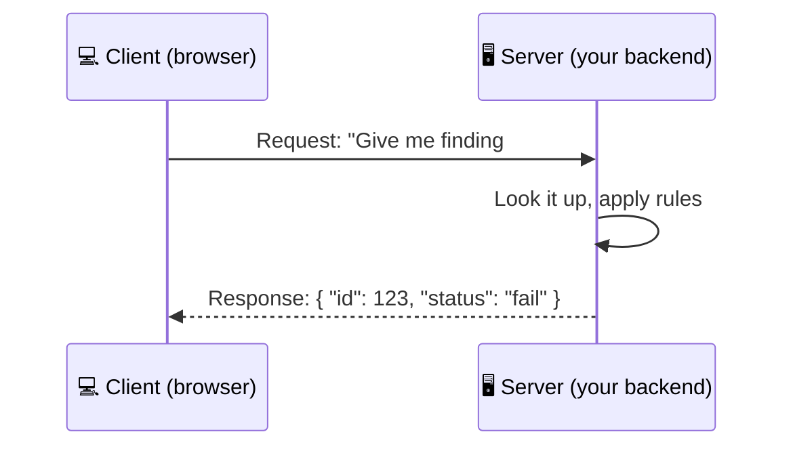
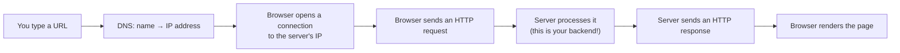
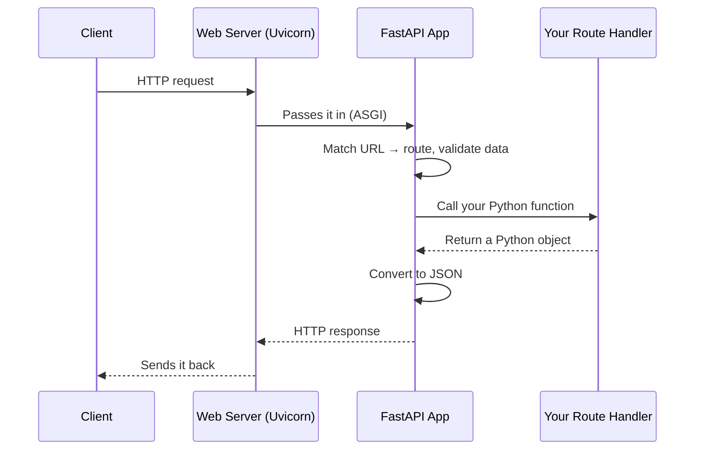
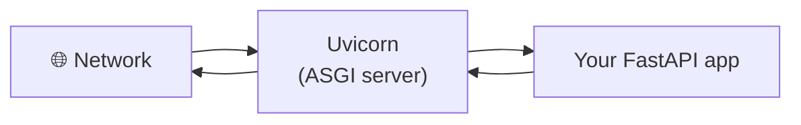
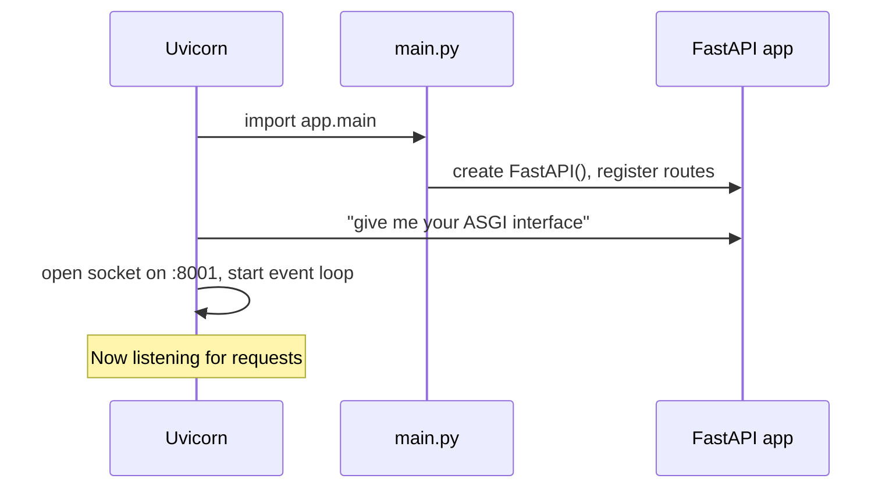
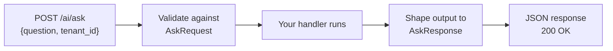
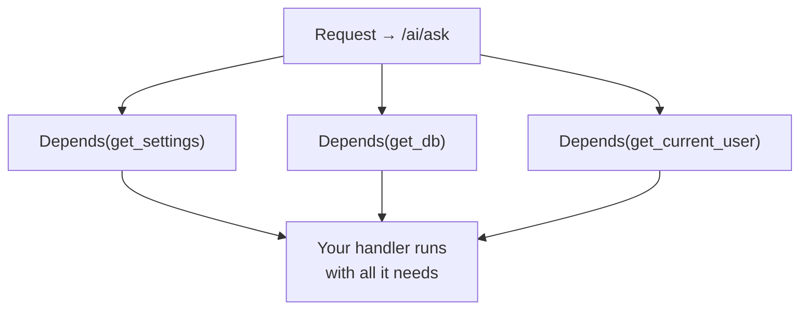
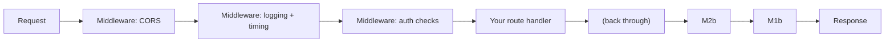
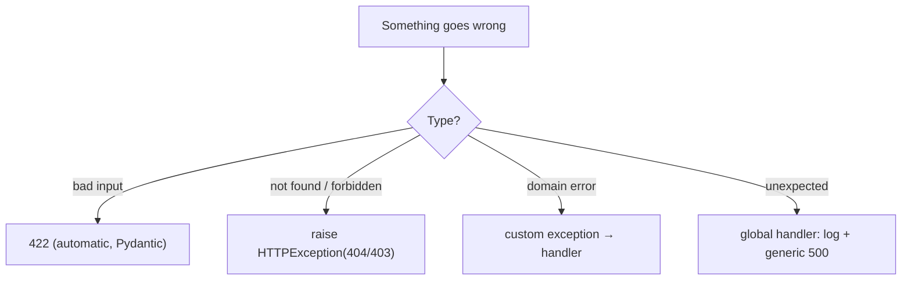

# 🚀 FastAPI — From Zero to Hero
### The Complete Backend Textbook for the ComplianceIQ AI Service

*A university-style course that takes you from "what is a backend?" to confidently building, debugging, and defending a production-grade FastAPI microservice.*

> **How to read this book.** Go in order — each part builds on the last. You'll meet these boxes throughout:
> - 🧠 **Analogy** — a real-life comparison • 🔧 **Behind the Scenes** — what actually happens internally
> - 💡 **Did You Know?** — a memorable fact • ⚠️ **Common Mistake** — a trap to avoid
> - ✅ **Best Practice** — how pros do it • 🏢 **In ComplianceIQ** — how you'll use it in your project
> - ❓ **Quiz** • 🛠️ **Mini-Project** • 💼 **Interview Question** • 🎯 **Key Takeaways**

---

## 📑 Table of Contents

**Part I — [Backend Fundamentals](#part-i--backend-fundamentals)**
**Part II — [FastAPI Fundamentals](#part-ii--fastapi-fundamentals)**
**Part III — [Routing](#part-iii--routing)**
**Part IV — [Pydantic](#part-iv--pydantic)**
**Part V — [Dependency Injection](#part-v--dependency-injection)**
**Part VI — [Middleware](#part-vi--middleware)**
**Part VII — [Error Handling](#part-vii--error-handling)**
**Part VIII — [Configuration](#part-viii--configuration)**
**Part IX — [Database Integration](#part-ix--database-integration)**
**Part X — [Authentication & Security](#part-x--authentication--security)**
**Part XI — [Async Programming](#part-xi--async-programming)**
**Part XII — [Building Production APIs](#part-xii--building-production-apis)**
**Part XIII — [Testing](#part-xiii--testing)**
**Part XIV — [Performance](#part-xiv--performance)**
**Part XV — [FastAPI for AI Applications](#part-xv--fastapi-for-ai-applications)**
**Part XVI — [Building the ComplianceIQ AI Service](#part-xvi--building-the-complianceiq-ai-service)**
**[Appendix — Answer Key & Cheat Sheet](#appendix--answer-key--cheat-sheet)**

> 📕 *This is a large document. It's split across two files: this file (Parts I–VIII, the foundations) and a companion file (Parts IX–XVI, the advanced + project chapters). Read this one first.*

---

# Part I — Backend Fundamentals

Before we touch FastAPI, you need to understand the world it lives in. Skipping this is why many beginners can copy tutorial code but can't debug or design anything. We fix that here.

## 1.1 What is a backend?

Every app you use has two halves:

- The **frontend** is what you see and touch — buttons, forms, charts. It runs on *your* device (browser or phone).
- The **backend** is the brain behind the scenes — it stores data, enforces rules, talks to databases and other services, and does the heavy lifting. It runs on a *server* somewhere.

> 🧠 **Analogy — the restaurant.** The frontend is the dining room: menu, tables, waiter. The backend is the kitchen: it receives orders, cooks, manages the pantry (database), and sends dishes back. You never see the kitchen, but nothing works without it. **FastAPI is how you build the kitchen.**

## 1.2 Client vs Server

- A **client** *asks* for things (your browser, a mobile app, another service).
- A **server** *answers* — it listens for requests and sends back responses.



> 🔧 **Behind the Scenes.** "Client" and "server" are *roles*, not machines. Your AI Service is a **server** to the frontend, but a **client** to the Core API when it fetches findings. Same program, two hats.

## 1.3 What happens when you open a website?



1. **DNS lookup** turns a name (`api.example.com`) into an IP address (like a phone number).
2. Your browser **connects** to that address.
3. It **sends a request** ("GET me this page").
4. The **backend processes** it.
5. It **returns a response** (HTML, or JSON for an API).
6. The browser **displays** the result.

Your job as a backend engineer is step 4–5.

## 1.4 What is an API?

An **API** (Application Programming Interface) is a **contract**: a defined set of requests a program can make, and the responses it will get back. It's how programs talk to each other without knowing each other's internals.

> 🧠 **Analogy — the waiter.** You don't walk into the kitchen and cook. You ask the waiter using the menu (the API). You don't care *how* the dish is made — just that ordering "pasta" gives you pasta. Your AI Service exposes a menu like `/ai/enrich`; the Core API "orders" from it without knowing how RAG works inside.

## 1.5 REST — the style your API follows

**REST** is a popular set of conventions for designing web APIs. The key ideas:

- Everything is a **resource** (a finding, a score, a report).
- Resources have **URLs** (`/findings/123`).
- You act on them with **HTTP methods** (GET to read, POST to create…).
- Communication is **stateless** (see 1.9).

> ✅ **Best Practice.** Name resources as **nouns**, not verbs: `GET /findings`, not `GET /getFindings`. The HTTP method already says the verb.

## 1.6 HTTP & HTTPS

**HTTP** (HyperText Transfer Protocol) is the language of the web — the format of requests and responses. Every HTTP request has:

| Part | Example | Meaning |
|---|---|---|
| **Method** | `POST` | What action to take |
| **Path** | `/ai/enrich` | Which resource |
| **Headers** | `Authorization: Bearer …` | Metadata (auth, content type) |
| **Body** | `{ "findings": [...] }` | The data (for POST/PUT) |

And every response has a **status code** (200 OK, 404 Not Found…), **headers**, and a **body**.

**HTTPS** is HTTP + encryption (TLS). It scrambles the data in transit so no one can eavesdrop or tamper.

> ⚠️ **Common Mistake.** Sending API keys or passwords over plain HTTP. Always use HTTPS in production. In ComplianceIQ, secrets and tenant data must never travel unencrypted.

## 1.7 JSON — the data format

**JSON** (JavaScript Object Notation) is the universal way APIs exchange data. It's just text that looks like Python dicts:

```json
{
  "id": "find_123",
  "status": "fail",
  "severity": "high",
  "public_access": true
}
```

FastAPI automatically converts between JSON (on the wire) and Python objects (in your code). This is a huge convenience you'll appreciate soon.

## 1.8 The request lifecycle



Memorize this picture — everything in this book slots into it.

## 1.9 Stateless communication

**Stateless** means the server does **not** remember anything about you between requests. Each request must carry everything needed to handle it (including *who* you are, via a token).

> 🧠 **Analogy — the ticket counter.** A stateless server is like a counter where a different clerk serves you each time. You must show your ticket (token) every visit, because no clerk remembers your last one. This sounds inconvenient but makes servers **scalable** — any server can handle any request.

> 🏢 **In ComplianceIQ.** Your AI Service is stateless: every request includes a JWT proving the tenant. No session is stored in memory. This is exactly why you can run multiple copies behind a load balancer later.

## 1.10 Web servers, WSGI & ASGI

Your Python code doesn't talk to the network directly — a **web server** does, then hands requests to your app through a standard interface.

- **WSGI** (old, synchronous) — used by Flask/Django classic. One request finishes before the next starts.
- **ASGI** (new, asynchronous) — used by FastAPI. Can handle many requests *concurrently*, which is critical when each request waits on slow things (like a Claude API call).



> 💡 **Did You Know?** "Uvicorn" is the ASGI server you'll run. FastAPI is the *framework* (your app's structure); Uvicorn is the *server* (the thing listening on the network). You need both.

## 1.11 Why FastAPI exists

Before FastAPI, Python backends forced a trade-off: Flask was simple but slow and manual; Django was powerful but heavy. FastAPI arrived to give you:

- **Speed** — async-first, among the fastest Python frameworks.
- **Automatic validation** — via Pydantic (Part IV), catching bad data for you.
- **Automatic docs** — interactive API docs generated from your code (Part II).
- **Type-driven** — you write normal Python type hints and get superpowers.

> 🏢 **In ComplianceIQ.** Your AI Service makes slow calls (Claude, vector search). Async FastAPI lets it serve many requests while waiting, and its auto-docs let your teammate explore your API without asking you. It's the ideal choice.

> 🎯 **Key Takeaways — Part I**
> - Backend = the server-side brain; frontend = the client-side face.
> - An API is a contract; REST is a convention using URLs + HTTP methods.
> - HTTP carries method + path + headers + body; JSON is the data format.
> - Servers are stateless — each request carries its own identity (token).
> - FastAPI (framework) runs on Uvicorn (ASGI server) and is async, fast, validating, and self-documenting.

> ❓ **Quiz — Part I**
> 1. Your AI Service calls the Core API. In that moment, is it a client or a server?
> 2. What does "stateless" mean, and why is it good for scaling?
> 3. What's the difference between FastAPI and Uvicorn?
> 4. Why is ASGI better than WSGI for an AI backend?

---

# Part II — FastAPI Fundamentals

Time to build. This part gets a server running and shows you what happens when it starts.

## 2.1 Installing FastAPI

```bash
# inside your ai-service/ venv (see the Day-1 guide)
pip install "fastapi[standard]" uvicorn
```

The `[standard]` extra pulls in Uvicorn and helpful tools. `pip freeze > requirements.txt` to record it.

## 2.2 Your first app — `main.py`

```python
from fastapi import FastAPI

app = FastAPI(title="ComplianceIQ AI Service")

@app.get("/health")
def health():
    return {"status": "ok"}
```

That's a complete, working API. Let's dissect it.

- `app = FastAPI(...)` — creates the application object. Everything attaches to `app`.
- `@app.get("/health")` — a **decorator** that registers the function below as the handler for `GET /health`.
- The function returns a dict; FastAPI turns it into JSON automatically.

> 🔧 **Behind the Scenes.** A decorator (`@app.get(...)`) is just a function that "tags" your function and stores it in a routing table: *"when a GET request hits /health, call this."* Nothing runs yet — you've only registered a rule.

## 2.3 Running the server with Uvicorn

```bash
uvicorn app.main:app --reload --port 8001
```

- `app.main:app` → in the module `app/main.py`, use the object named `app`.
- `--reload` → auto-restart when you save a file (dev only).
- `--port 8001` → your AI Service port (Core API can be 8000).

## 2.4 What happens internally when the server starts?



1. Uvicorn **imports** your `main.py`, which runs top-to-bottom, building the `app` and its route table.
2. Uvicorn grabs the app's **ASGI callable**.
3. It **opens a network socket** and starts the **event loop** (Part XI).
4. It **waits** for requests, dispatching each to the matching handler.

## 2.5 Automatic API documentation

Start the server and open:

- **Swagger UI** → `http://localhost:8001/docs` — interactive; you can call endpoints from the browser.
- **ReDoc** → `http://localhost:8001/redoc` — clean, readable reference.

> 💡 **Did You Know?** These docs are generated from your code and type hints automatically — no writing required. FastAPI builds an **OpenAPI** specification (a JSON description of your whole API) at `/openapi.json`, and the docs pages render it.

> 🏢 **In ComplianceIQ.** `/docs` becomes the living contract your teammate uses to see exactly how to call `/ai/enrich` — inputs, outputs, example values — without reading your code.

> 🛠️ **Mini-Project — Part II.** Create `ai-service/app/main.py` with a `/health` endpoint returning `{"status":"ok","service":"ai"}`. Run it, open `/docs`, and call the endpoint from the Swagger UI.

> 🎯 **Key Takeaways — Part II**
> - `FastAPI()` is your app; decorators register routes; returning a dict yields JSON.
> - Uvicorn imports your app, opens a socket, starts the event loop, and dispatches requests.
> - `/docs` and `/redoc` are auto-generated from your code via OpenAPI.

---

# Part III — Routing

**Routing** is how FastAPI decides which function handles which request. A route = an HTTP method + a path.

## 3.1 The HTTP methods (verbs)

| Method | Meaning | ComplianceIQ example |
|---|---|---|
| `GET` | Read data (no changes) | `GET /health` |
| `POST` | Create / perform an action | `POST /ai/enrich` |
| `PUT` | Replace a whole resource | (rare here) |
| `PATCH` | Update part of a resource | update a remediation's `approved` flag |
| `DELETE` | Remove a resource | delete a cached report |

```python
@app.get("/findings")      # read
@app.post("/ai/enrich")    # action
@app.patch("/remediations/{id}")  # partial update
```

> ✅ **Best Practice.** Match the verb to the intent. Your AI endpoints are mostly `POST` because they *do work* (call Claude) and receive a body, even though they "read" conceptually.

## 3.2 Path parameters

Parts of the URL that vary:

```python
@app.get("/findings/{finding_id}")
def get_finding(finding_id: str):
    return {"id": finding_id}
```

Requesting `/findings/find_123` → `finding_id = "find_123"`. The **type hint** (`str`) tells FastAPI to validate and convert it.

## 3.3 Query parameters

Optional key-values after `?`:

```python
@app.get("/findings")
def list_findings(domain: str | None = None, limit: int = 20):
    return {"domain": domain, "limit": limit}
```

`/findings?domain=Storage&limit=5` → `domain="Storage"`, `limit=5`. Because they have defaults, they're optional.

> 🔧 **Behind the Scenes.** FastAPI decides *automatically*: if a function parameter's name is in the path (`{finding_id}`), it's a **path** param; otherwise a scalar becomes a **query** param, and a Pydantic model becomes the **body**. Type hints drive everything.

## 3.4 Request body

For POST/PUT, the data comes in the body as JSON, described by a Pydantic model (Part IV):

```python
from pydantic import BaseModel

class AskRequest(BaseModel):
    question: str
    tenant_id: str

@app.post("/ai/ask")
def ask(payload: AskRequest):
    return {"answer": f"You asked: {payload.question}"}
```

FastAPI reads the JSON body, validates it against `AskRequest`, and hands you a typed object.

## 3.5 Response models & status codes

```python
from fastapi import status

class AskResponse(BaseModel):
    answer: str
    abstained: bool

@app.post("/ai/ask", response_model=AskResponse, status_code=status.HTTP_200_OK)
def ask(payload: AskRequest) -> AskResponse:
    return AskResponse(answer="...", abstained=False)
```

`response_model` guarantees the shape of what you return (and filters out anything extra — great for not leaking fields).



> ⚠️ **Common Mistake.** Returning a dict with extra secret fields. If you set `response_model`, FastAPI strips anything not in the model — a free safety net. Use it.

> 💼 **Interview Question.** *"How does FastAPI know if a parameter is a path, query, or body param?"* → By matching the parameter name against the path template and its type: names in the path are path params; scalar types default to query params; Pydantic models become the request body.

> 🎯 **Key Takeaways — Part III**
> - A route = method + path; verbs express intent (GET reads, POST acts).
> - Path params come from the URL; query params are optional `?key=value`; bodies are JSON described by Pydantic.
> - `response_model` locks the output shape and prevents leaking fields.

> ❓ **Quiz — Part III.** Write the decorator + signature for: "update the `approved` flag of remediation with a given id."

---

# Part IV — Pydantic

Pydantic is FastAPI's superpower. It turns Python type hints into **automatic validation, parsing, and documentation**. Master this and half of FastAPI becomes trivial.

## 4.1 What Pydantic is and why it exists

A **Pydantic model** is a class describing the shape of your data. When data arrives, Pydantic checks it matches — right types, required fields present — and converts it into a clean Python object. If it doesn't match, you get a precise error automatically.

> 🧠 **Analogy — the bouncer.** Pydantic is a bouncer at the club door with a guest list (your model). Wrong name, wrong age format, missing ID → rejected at the door with a clear reason. Your code inside only ever deals with valid guests.

> 🔧 **Behind the Scenes.** Without Pydantic you'd write dozens of `if "question" not in data: return error` checks. Pydantic replaces all of that with a declaration and does it faster (its core is compiled).

## 4.2 Your first models

```python
from pydantic import BaseModel
from datetime import datetime

class Finding(BaseModel):
    id: str
    tenant_id: str
    domain: str
    severity: str
    status: str
    detected_at: datetime
```

Give it JSON with a string date and Pydantic parses it into a real `datetime`. Give it a missing field and it raises a validation error listing exactly what's wrong.

## 4.3 Type hints, optional fields, defaults

```python
from pydantic import BaseModel

class AskRequest(BaseModel):
    question: str                 # required
    tenant_id: str                # required
    top_k: int = 4                # optional, default 4
    filters: dict | None = None   # optional, can be null
```

- No default → **required**.
- Has a default → **optional**.
- `| None` → may be `null`.

## 4.4 Lists, nested models, enums

```python
from enum import Enum
from pydantic import BaseModel

class Severity(str, Enum):
    low = "low"; medium = "medium"; high = "high"; critical = "critical"

class Citation(BaseModel):
    framework: str
    control_id: str
    reference: str

class EnrichedFinding(BaseModel):
    id: str
    severity: Severity                 # enum: only these values allowed
    explanation: str
    citations: list[Citation]          # a list of nested models
    citation_verified: bool
```

- **Enums** restrict a field to a fixed set of values (invalid severities are rejected).
- **Nested models** compose shapes; `list[Citation]` is a list of them.

> 🏢 **In ComplianceIQ.** These are literally your contract schemas. `EnrichedFinding` is what your `/ai/enrich` endpoint returns. Defining it once gives you validation *and* documentation *and* the exact output shape.

## 4.5 Custom validators

Sometimes rules go beyond types:

```python
from pydantic import BaseModel, field_validator

class FinancialRequest(BaseModel):
    min_mad: int
    max_mad: int

    @field_validator("max_mad")
    @classmethod
    def max_greater_than_min(cls, v, info):
        if "min_mad" in info.data and v < info.data["min_mad"]:
            raise ValueError("max_mad must be ≥ min_mad")
        return v
```

## 4.6 Serialization & deserialization

- **Deserialization** — JSON (from the request) → Pydantic object. FastAPI does this on input.
- **Serialization** — Pydantic object → JSON (for the response). FastAPI does this on output.

```python
ef = EnrichedFinding(...)
ef.model_dump()        # → a dict
ef.model_dump_json()   # → a JSON string
EnrichedFinding.model_validate(some_dict)  # dict → object
```

> ⚠️ **Common Mistake.** Building dicts by hand and hoping the shape is right. Instead, construct the Pydantic model — if it's wrong, you find out immediately, right where the bug is.

> 💡 **Did You Know?** FastAPI builds your `/docs` schemas *from* these Pydantic models. Improve a model and your documentation improves for free.

> 🛠️ **Mini-Project — Part IV.** In `contracts/`, define `Finding`, `Citation`, and `EnrichedFinding` exactly as above. Write a tiny script that loads `fixtures/findings.sample.json` into a `Finding` and prints it. Feel the validation catch a deliberately broken field.

> 🎯 **Key Takeaways — Part IV**
> - Pydantic models declare data shapes; FastAPI validates input and shapes output with them.
> - Required vs optional is defaults; `| None` allows null; enums restrict values; models nest.
> - Custom validators express business rules; serialization converts objects ↔ JSON.
> - Your contract schemas *are* Pydantic models — define once, benefit everywhere.

---

# Part V — Dependency Injection

This concept intimidates beginners but is simple and will make your code clean, testable, and DRY.

## 5.1 What it is and why it exists

**Dependency Injection (DI)** means: instead of a function *creating* the things it needs, it *declares* them and FastAPI *provides* them. You "inject" dependencies from the outside.

> 🧠 **Analogy — the kitchen.** A chef doesn't grow the vegetables. They declare "I need chopped onions," and the prep station provides them. The chef focuses on cooking. DI is that prep station: your endpoint says "I need a DB session and the current user," and FastAPI hands them over.

**What problem it solves:** without DI you'd repeat the same setup (open a DB session, decode the token, load config) in every endpoint. DI writes it once and reuses it everywhere — and lets you swap real things for fakes in tests.

## 5.2 `Depends()` — the core tool

```python
from fastapi import Depends

def get_settings():
    return {"model": "claude-sonnet", "top_k": 4}

@app.post("/ai/ask")
def ask(payload: AskRequest, settings: dict = Depends(get_settings)):
    return {"model": settings["model"]}
```

FastAPI sees `Depends(get_settings)`, calls `get_settings()`, and passes the result in as `settings`. You never call it yourself.



## 5.3 Shared dependencies you'll build

- **Config** — `Settings` object (Part VIII), injected everywhere.
- **Database session** — open per request, close after (Part IX).
- **Current user / tenant** — decode the JWT, return the identity (Part X).
- **Reusable clients** — a Claude client, a retriever, injected into handlers.

```python
def get_current_tenant(token: str = Depends(oauth2_scheme)) -> str:
    payload = decode_jwt(token)          # verify + parse
    return payload["tenant_id"]

@app.post("/ai/enrich")
def enrich(body: EnrichRequest, tenant_id: str = Depends(get_current_tenant)):
    # tenant_id is guaranteed valid here
    ...
```

> ✅ **Best Practice.** Put cross-cutting concerns (auth, DB, config) in dependencies. Your endpoints stay short and focused on business logic — and become trivial to test by injecting fakes.

> 🏢 **In ComplianceIQ.** A `get_current_tenant` dependency guarantees every AI endpoint is tenant-scoped in one place, so you can't forget it on some route and leak data.

> 💼 **Interview Question.** *"How does DI improve testability?"* → In tests you override a dependency (e.g., `app.dependency_overrides[get_db] = fake_db`) so the endpoint uses a fake instead of a real database — no real infrastructure needed.

> 🎯 **Key Takeaways — Part V**
> - DI = declare what you need; FastAPI provides it via `Depends()`.
> - It removes repetition and centralizes auth/DB/config.
> - Dependencies can depend on each other, forming a graph FastAPI resolves per request.
> - Overriding dependencies makes testing clean.

---

# Part VI — Middleware

**Middleware** is code that runs on *every* request, before and after your handler. It wraps your whole app like layers of an onion.

## 6.1 The onion model



A request enters through each middleware layer, hits your handler, then the response travels back out through the same layers. Each layer can inspect or modify the request on the way in and the response on the way out.

## 6.2 What you'll use middleware for

- **Logging** — record every request (method, path, tenant, latency).
- **Timing** — measure how long each request took.
- **CORS** — allow your React frontend (different origin) to call the API.
- **Security headers** — add protective HTTP headers.

## 6.3 A timing + logging middleware

```python
import time, logging
from fastapi import Request

logger = logging.getLogger("ai-service")

@app.middleware("http")
async def log_requests(request: Request, call_next):
    start = time.perf_counter()
    response = await call_next(request)          # run the rest of the app
    ms = (time.perf_counter() - start) * 1000
    logger.info("%s %s → %s (%.0fms)",
                request.method, request.url.path, response.status_code, ms)
    return response
```

`call_next(request)` runs the inner layers + your handler and returns the response, which you then annotate.

## 6.4 CORS — letting the frontend in

```python
from fastapi.middleware.cors import CORSMiddleware

app.add_middleware(
    CORSMiddleware,
    allow_origins=["http://localhost:3000"],   # your React app
    allow_methods=["*"],
    allow_headers=["*"],
)
```

> ⚠️ **Common Mistake.** `allow_origins=["*"]` in production. That lets *any* website call your API with credentials. Lock it to your real frontend origins.

> 🔧 **Behind the Scenes.** Browsers block cross-origin requests by default (the *same-origin policy*). CORS is the server telling the browser "these origins are allowed." It's a browser rule, not a server security feature — don't rely on it for auth.

> 🎯 **Key Takeaways — Part VI**
> - Middleware runs on every request, in and out, like onion layers.
> - Use it for logging, timing, CORS, and security headers.
> - `call_next` runs the inner app; you can modify request in and response out.
> - Never use wildcard CORS in production.

---

# Part VII — Error Handling

Good error handling is what separates a toy from a product. Your API must fail **clearly and safely**, never with a raw crash.

## 7.1 `HTTPException` — deliberate errors

When something is wrong, raise an `HTTPException` with the right status and a clear message:

```python
from fastapi import HTTPException, status

@app.get("/findings/{finding_id}")
def get_finding(finding_id: str):
    finding = db_lookup(finding_id)
    if finding is None:
        raise HTTPException(status_code=status.HTTP_404_NOT_FOUND,
                            detail="Finding not found")
    return finding
```

## 7.2 Validation errors (automatic)

If a request body doesn't match your Pydantic model, FastAPI **automatically** returns `422 Unprocessable Entity` with a precise list of what's wrong — you write nothing.

```json
{ "detail": [ { "loc": ["body","question"], "msg": "Field required" } ] }
```

## 7.3 Custom exceptions + handlers

Define domain errors and translate them to clean responses in one place:

```python
class RetrievalEmptyError(Exception):
    """Raised when RAG finds no relevant context."""

from fastapi import Request
from fastapi.responses import JSONResponse

@app.exception_handler(RetrievalEmptyError)
async def handle_empty(request: Request, exc: RetrievalEmptyError):
    return JSONResponse(status_code=422,
        content={"error": "no_relevant_context",
                 "message": "The question isn't covered by the regulatory corpus."})
```

Now anywhere in your code can `raise RetrievalEmptyError()` and the response is consistent.

## 7.4 A consistent error envelope

> ✅ **Best Practice.** Return errors in a predictable shape (e.g. `{ "error": "...", "message": "..." }`) so the frontend can handle them uniformly. Match this to your `ErrorEnvelope` contract schema.

> ⚠️ **Common Mistake — leaking internals.** Never return a raw Python traceback to the client. It exposes your code and possibly secrets. Log the detail server-side; return a clean, generic message to the caller.



> 🏢 **In ComplianceIQ.** Abstention (no relevant context) becomes a clean 422 with a helpful message, not a crash. Cross-tenant access becomes a 403. Bad payloads become automatic 422s. Every failure is intentional and safe.

> 🎯 **Key Takeaways — Part VII**
> - `HTTPException` expresses deliberate, known errors with correct status codes.
> - Pydantic gives automatic 422s for bad input.
> - Custom exceptions + handlers centralize domain errors into consistent responses.
> - Never leak tracebacks; log server-side, return clean messages.

---

# Part VIII — Configuration

Hardcoding settings (API keys, DB URLs, model names) is a rookie mistake and a security risk. Configuration lives **outside** your code.

## 8.1 Environment variables & `.env`

An **environment variable** is a value your program reads from its environment, not its source. In development you keep them in a `.env` file (never committed):

```env
ANTHROPIC_API_KEY=sk-ant-xxxxx
DATABASE_URL=postgresql://iq:iq@db:5432/complianceiq
TOP_K=4
LOG_LEVEL=info
```

## 8.2 Pydantic Settings — typed config

Pydantic can load and validate your config, giving you a typed object:

```python
from pydantic_settings import BaseSettings

class Settings(BaseSettings):
    anthropic_api_key: str
    database_url: str
    top_k: int = 4
    log_level: str = "info"

    class Config:
        env_file = ".env"

settings = Settings()   # reads env vars / .env, validates types
```

Now `settings.top_k` is a real `int`, and a missing required key fails **at startup** with a clear error — not at 3 a.m. in production.

## 8.3 Injecting config with DI

```python
from functools import lru_cache
from fastapi import Depends

@lru_cache
def get_settings() -> Settings:
    return Settings()

@app.post("/ai/ask")
def ask(body: AskRequest, cfg: Settings = Depends(get_settings)):
    return {"model_top_k": cfg.top_k}
```

`@lru_cache` builds the settings once and reuses them (no re-reading the file per request).

## 8.4 Secrets

> ⚠️ **Common Mistake — the career-ending one.** Committing `.env` with real keys. Once pushed, a secret is compromised forever (it stays in Git history). Put `.env` in `.gitignore` and scan history with tools like `gitleaks`.

> ✅ **Best Practice.** Keep a committed `.env.example` with **empty** values as documentation, and load real secrets from the environment or a secrets manager (AWS Secrets Manager, etc.) in production.

> 🏢 **In ComplianceIQ.** Your `ANTHROPIC_API_KEY`, `DATABASE_URL`, and `CORE_API_URL` all come from config. Nothing sensitive is hardcoded, and a missing key stops the service at boot with a helpful message.

> 🎯 **Key Takeaways — Part VIII**
> - Config lives outside code, in environment variables / `.env`.
> - Pydantic `BaseSettings` gives typed, validated config that fails fast at startup.
> - Inject settings via a cached dependency.
> - Never commit secrets; use `.env.example` + `.gitignore` + a secrets manager.

---

> 📗 **Continue to the companion file** — *Parts IX–XVI* — for Database Integration, Auth & Security, Async, Production Architecture, Testing, Performance, FastAPI-for-AI, and the full **ComplianceIQ AI Service** build.

---

*(File 1 of 2 — Foundations. See the companion file for the advanced and project chapters.)*
