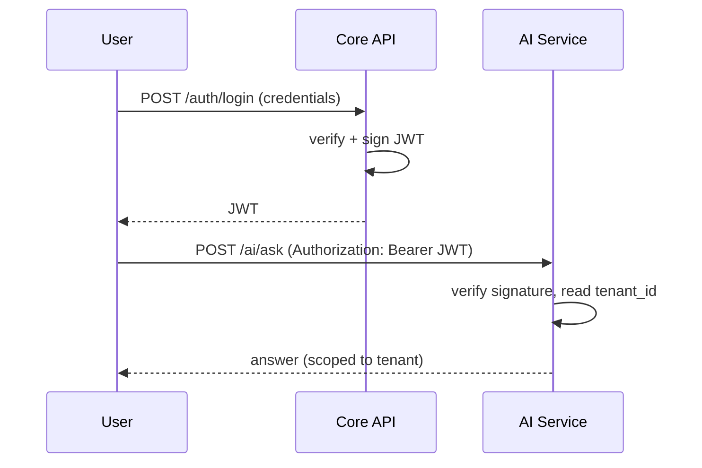
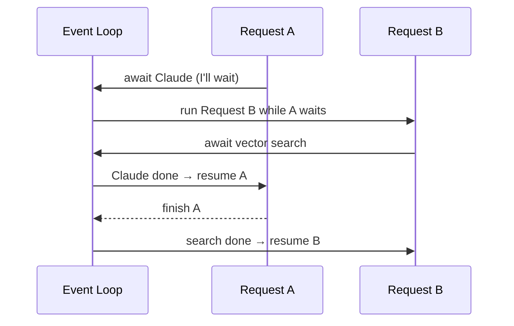
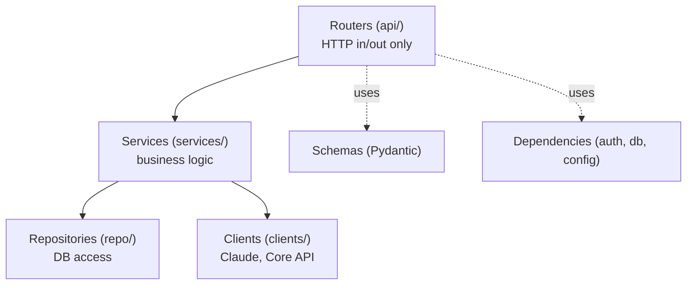
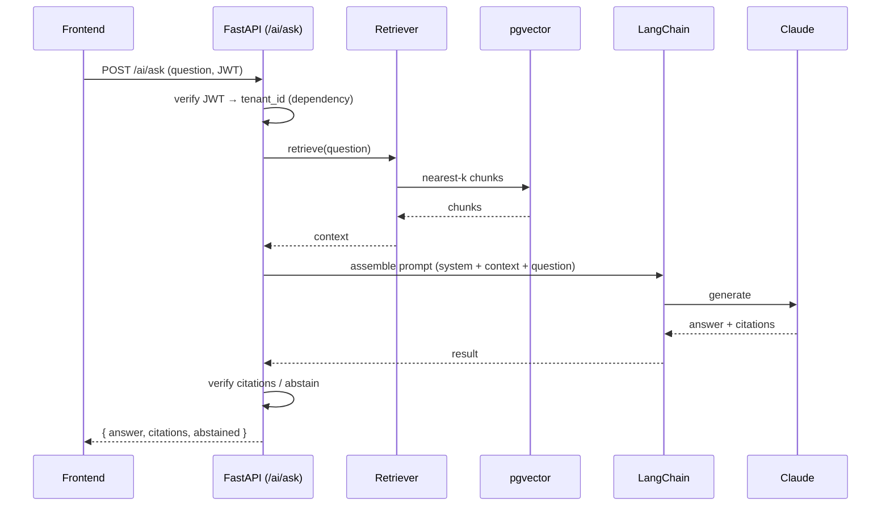
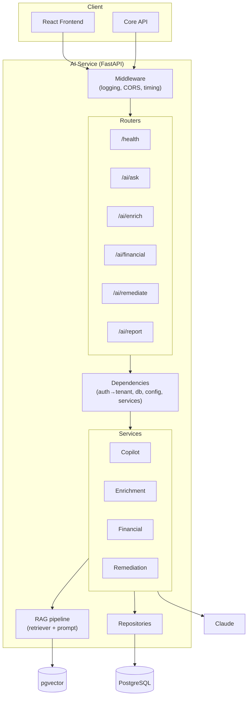
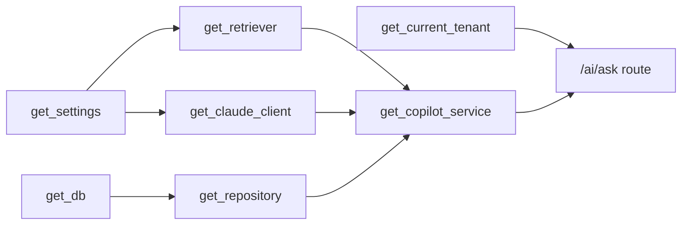

# 🚀 FastAPI — From Zero to Hero (File 2 of 2)
### Advanced Chapters & the ComplianceIQ AI Service Build

> This is the second half. Read **File 1 (Parts I–VIII)** first. Same box legend applies:
> 🧠 Analogy • 🔧 Behind the Scenes • 💡 Did You Know? • ⚠️ Common Mistake • ✅ Best Practice • 🏢 In ComplianceIQ • ❓ Quiz • 🛠️ Mini-Project • 💼 Interview Question • 🎯 Key Takeaways

## Contents
- Part IX — [Database Integration](#part-ix--database-integration)
- Part X — [Authentication & Security](#part-x--authentication--security)
- Part XI — [Async Programming](#part-xi--async-programming)
- Part XII — [Building Production APIs](#part-xii--building-production-apis)
- Part XIII — [Testing](#part-xiii--testing)
- Part XIV — [Performance](#part-xiv--performance)
- Part XV — [FastAPI for AI Applications](#part-xv--fastapi-for-ai-applications)
- Part XVI — [Building the ComplianceIQ AI Service](#part-xvi--building-the-complianceiq-ai-service)
- [Appendix — Answer Key & Cheat Sheet](#appendix--answer-key--cheat-sheet)

---

# Part IX — Database Integration

Your AI Service stores embeddings and enriched results. This part connects FastAPI to PostgreSQL (with **pgvector**) the professional way.

## 9.1 Why an ORM (SQLAlchemy)?

You *could* write raw SQL strings, but that's error-prone and unsafe. An **ORM** (Object-Relational Mapper) lets you work with Python classes that map to database tables. **SQLAlchemy** is the standard.

> 🧠 **Analogy — a translator.** The ORM is a translator between two languages: Python objects and SQL tables. You speak Python; it speaks SQL to the database and translates the answers back.

> ⚠️ **Common Mistake — SQL injection.** Building queries by string concatenation (`"... WHERE id='" + user_input + "'"`) lets attackers inject SQL. ORMs parameterize queries safely. Always let the ORM build the query.

## 9.2 Engine, session, models

```python
from sqlalchemy.ext.asyncio import create_async_engine, async_sessionmaker
from sqlalchemy.orm import DeclarativeBase, Mapped, mapped_column

engine = create_async_engine(settings.database_url, pool_size=10)
SessionLocal = async_sessionmaker(engine, expire_on_commit=False)

class Base(DeclarativeBase): ...

class EnrichedFindingRow(Base):
    __tablename__ = "enriched_findings"
    id: Mapped[str] = mapped_column(primary_key=True)
    tenant_id: Mapped[str] = mapped_column(index=True)
    explanation: Mapped[str]
    citation_verified: Mapped[bool]
```

- **Engine** — the connection pool to the database (opened once).
- **Session** — a short-lived workspace for one unit of work (one request).
- **Model** — a Python class mapped to a table.

## 9.3 The session-per-request dependency

```python
from fastapi import Depends

async def get_db():
    async with SessionLocal() as session:
        yield session          # give it to the handler
        # session auto-closes when the request ends

@app.get("/enriched/{fid}")
async def read(fid: str, db = Depends(get_db)):
    row = await db.get(EnrichedFindingRow, fid)
    ...
```

> 🔧 **Behind the Scenes.** `yield` makes this a *dependency with cleanup*: code before `yield` runs on the way in; code after runs on the way out (closing the session). FastAPI guarantees the cleanup even if the handler errors.

## 9.4 CRUD & transactions

```python
async def create_enriched(db, ef: EnrichedFinding):
    row = EnrichedFindingRow(id=ef.id, tenant_id=ef.tenant_id,
                             explanation=ef.explanation,
                             citation_verified=ef.citation_verified)
    db.add(row)
    await db.commit()          # transaction: all-or-nothing
    return row
```

A **transaction** groups changes so they all succeed or all roll back — never half-applied.

> ✅ **Best Practice — tenant scoping.** Every query filters by `tenant_id`. Bake it into your repository layer so no query can forget it: `select(...).where(Row.tenant_id == tenant_id)`.

## 9.5 pgvector — storing embeddings

`pgvector` adds a `vector` column type to PostgreSQL and similarity operators. Conceptually:

```sql
CREATE EXTENSION IF NOT EXISTS vector;
CREATE TABLE chunks (
  id TEXT PRIMARY KEY,
  control_id TEXT,
  embedding vector(384)          -- one vector per chunk
);
-- find the 4 nearest chunks to a query vector
SELECT control_id FROM chunks ORDER BY embedding <-> :query_vec LIMIT 4;
```

The `<->` operator computes distance. Your retriever (Part XV) runs exactly this kind of query.


> 🏢 **In ComplianceIQ.** Core data (findings, scores) may live in the Core service's schema, while your AI schema holds documents, embeddings, enriched results, and eval runs. Same PostgreSQL, separate schemas — clean ownership.

> 🎯 **Key Takeaways — Part IX**
> - SQLAlchemy maps Python classes to tables and prevents SQL injection.
> - One session per request via a `yield` dependency with automatic cleanup.
> - Transactions make writes all-or-nothing; always scope queries by tenant.
> - pgvector adds vector columns + nearest-neighbour search for your RAG retriever.

> 🛠️ **Mini-Project.** Write a `get_db` dependency and a `create_enriched` function. Store one `EnrichedFinding` and read it back.

---

# Part X — Authentication & Security

Your API must know *who* is calling and *what they may do*. This is authentication (who) + authorization (what).

## 10.1 The building blocks

| Term | Meaning |
|---|---|
| **Authentication** | Proving identity ("I am tenant Acme") |
| **Authorization** | Deciding permissions ("Acme may read findings") |
| **JWT** | A signed token carrying identity claims |
| **OAuth2** | A standard flow for issuing/using tokens |
| **RBAC** | Role-Based Access Control (permissions by role) |
| **Hashing** | One-way scrambling of passwords |

## 10.2 Password hashing (never store plaintext)

```python
from passlib.context import CryptContext
pwd = CryptContext(schemes=["bcrypt"])

hashed = pwd.hash("secret123")        # store THIS, never the password
pwd.verify("secret123", hashed)       # → True
```

> ⚠️ **Common Mistake.** Storing passwords in plaintext (or reversible encryption). Always hash with a slow algorithm (bcrypt/argon2). If your DB leaks, hashes are useless to attackers.

## 10.3 JWT — how stateless auth works

A **JWT** is a signed token with three parts: header, payload (claims like `tenant_id`, `roles`, `exp`), and a signature. The server signs it with a secret; anyone can read it, but no one can forge it without the secret.



## 10.4 Verifying tokens in FastAPI

```python
from fastapi import Depends, HTTPException, status
from fastapi.security import OAuth2PasswordBearer
import jwt

oauth2 = OAuth2PasswordBearer(tokenUrl="auth/login")

def get_current_tenant(token: str = Depends(oauth2)) -> str:
    try:
        payload = jwt.decode(token, settings.jwt_secret, algorithms=["HS256"])
    except jwt.PyJWTError:
        raise HTTPException(status.HTTP_401_UNAUTHORIZED, "Invalid token")
    return payload["tenant_id"]
```

Now any endpoint that declares `tenant_id: str = Depends(get_current_tenant)` is protected and tenant-aware.

## 10.5 RBAC — roles & permissions

```python
def require_role(role: str):
    def checker(token: str = Depends(oauth2)):
        payload = jwt.decode(token, settings.jwt_secret, algorithms=["HS256"])
        if role not in payload.get("roles", []):
            raise HTTPException(403, "Forbidden")
        return payload
    return checker

@app.post("/ai/remediate", dependencies=[Depends(require_role("engineer"))])
def remediate(...): ...
```

> 🏢 **In ComplianceIQ.** The Core service issues JWTs; your AI Service *verifies* them (shared secret or public key). Every AI endpoint extracts `tenant_id` via a dependency, guaranteeing isolation. Approving a remediation might require an `engineer` role.

> 💼 **Interview Question.** *"Why is JWT good for microservices?"* → It's stateless and self-contained: the AI Service can verify identity from the token alone, without calling back to a session store — perfect for independent services.

> 🎯 **Key Takeaways — Part X**
> - Authentication = who; authorization = what.
> - Hash passwords; never store them plainly.
> - JWTs carry signed claims; verify them in a dependency and read `tenant_id`.
> - RBAC gates actions by role via dependencies.

---

# Part XI — Async Programming

This is *why FastAPI is fast* and *why it's perfect for AI*. Take your time here.

## 11.1 The problem: waiting

Your AI Service spends most of its time **waiting** — for Claude to respond, for a vector search, for the Core API. In **synchronous** code, while one request waits, the whole worker is blocked and can't serve anyone else.

> 🧠 **Analogy — the waiter.** A synchronous waiter takes your order, walks to the kitchen, and *stands there* until the food is ready before serving anyone else. An asynchronous waiter takes your order, hands it to the kitchen, and *serves other tables while the food cooks*. Same one waiter, far more customers served. FastAPI is the async waiter.

## 11.2 Sync vs async, concretely

```python
# synchronous: blocks the worker while waiting
@app.get("/slow")
def slow():
    result = call_claude()      # worker frozen here
    return result

# asynchronous: frees the worker to handle others while waiting
@app.post("/ai/ask")
async def ask(body: AskRequest):
    result = await call_claude_async()   # yields control while waiting
    return result
```

- `async def` marks a **coroutine** — a function that can pause and resume.
- `await` means "pause here until this finishes, and let others run meanwhile."

## 11.3 The event loop



The **event loop** is a manager that juggles many coroutines on one thread: whenever one `await`s (waits on I/O), the loop runs another. This is **concurrency** — making progress on many things by never sitting idle.

> 🔧 **Behind the Scenes.** Async doesn't use multiple CPU cores; it uses the *waiting time* of I/O. Because AI backends are I/O-bound (waiting on APIs and DBs), async gives huge throughput gains with a single process.

## 11.4 Rules of the road

> ⚠️ **Common Mistake — blocking the loop.** Calling a *synchronous*, slow function (e.g. a blocking HTTP library, or `time.sleep`) inside an `async def` freezes the entire event loop — every request stalls. Use async libraries (`httpx.AsyncClient`, async DB drivers) inside async endpoints, or run blocking work in a threadpool.

> ✅ **Best Practice.** If a route only does async I/O, make it `async def`. If it does heavy CPU work or must call a blocking library, either use a normal `def` (FastAPI runs it in a threadpool) or offload it.

> 💡 **Did You Know?** FastAPI is clever: a plain `def` endpoint is automatically run in a threadpool so it won't block the loop. That's why beginners can mix both and still get decent performance.

> 🏢 **In ComplianceIQ.** Your `/ai/ask` awaits Claude and pgvector concurrently-friendly, so one instance serves many analysts at once while each waits on the LLM. This is the core reason FastAPI fits an AI service.

> 💼 **Interview Question.** *"Why is FastAPI fast for AI workloads specifically?"* → AI endpoints are I/O-bound (waiting on LLM/DB). Async lets a single worker serve many concurrent requests during those waits, maximizing throughput.

> 🎯 **Key Takeaways — Part XI**
> - Sync code blocks while waiting; async frees the worker to serve others.
> - `async def` = coroutine; `await` = pause-and-yield.
> - The event loop juggles coroutines on one thread — concurrency without extra cores.
> - Never call blocking code in an async route; use async libraries.

---

# Part XII — Building Production APIs

A single `main.py` is fine for `/health`, not for a real service. Professionals split code into layers with clear responsibilities.

## 12.1 The layered architecture



- **Routers** — thin; parse the request, call a service, return the response. No business logic.
- **Services** — the brains; orchestrate the work (retrieve → prompt → verify).
- **Repositories** — all database access, tenant-scoped.
- **Clients** — talk to external systems (Claude, Core API).
- **Schemas** — Pydantic models (your contract).
- **Dependencies** — auth, DB sessions, config.

> 🧠 **Analogy — a company.** Routers are the receptionists (greet, direct). Services are the managers (make decisions). Repositories are the archivists (fetch/store records). Clients are the couriers (deal with outside firms). Each has one job.

## 12.2 Recommended folder structure

```text
ai-service/
└─ app/
   ├─ main.py            # create app, include routers, add middleware
   ├─ config.py          # Settings (Pydantic)
   ├─ api/               # routers (thin)
   │  ├─ health.py
   │  ├─ ask.py
   │  ├─ enrich.py
   │  ├─ financial.py
   │  └─ remediate.py
   ├─ services/          # business logic
   │  ├─ copilot.py
   │  ├─ enrichment.py
   │  ├─ financial.py
   │  └─ remediation.py
   ├─ rag/               # ingestion, embeddings, retriever, pipeline
   ├─ repositories/      # DB access (tenant-scoped)
   ├─ clients/           # claude.py, core_api.py
   ├─ schemas/           # Pydantic models (import from contracts)
   ├─ deps.py            # shared dependencies
   └─ errors.py          # custom exceptions + handlers
```

## 12.3 Wiring routers into the app

```python
# app/api/ask.py
from fastapi import APIRouter, Depends
router = APIRouter(prefix="/ai", tags=["ai"])

@router.post("/ask")
async def ask(body: AskRequest, tenant=Depends(get_current_tenant),
              svc=Depends(get_copilot_service)):
    return await svc.answer(body.question, tenant)

# app/main.py
from fastapi import FastAPI
from app.api import health, ask, enrich, financial, remediate

app = FastAPI(title="ComplianceIQ AI Service")
for r in (health, ask, enrich, financial, remediate):
    app.include_router(r.router, prefix="/api/v1")
```

> ✅ **Best Practice.** Keep routers dumb and services testable. A router should read like a sentence: *"take this request, ask the service, return the result."*

> 🎯 **Key Takeaways — Part XII**
> - Split into routers, services, repositories, clients, schemas, dependencies.
> - Routers are thin; services hold logic; repositories own DB access.
> - `APIRouter` groups endpoints; `include_router` wires them into the app.

---

# Part XIII — Testing

Tests are how you sleep at night and how you prove your service works to a jury. FastAPI makes them easy.

## 13.1 Unit tests with pytest + TestClient

```python
from fastapi.testclient import TestClient
from app.main import app

client = TestClient(app)

def test_health():
    r = client.get("/api/v1/health")
    assert r.status_code == 200
    assert r.json()["status"] == "ok"
```

`TestClient` calls your app in-process — no server needed.

## 13.2 Mocking the slow/external parts

You don't want tests calling the real Claude API (slow, costs money, non-deterministic). **Mock** it — replace it with a fake via dependency override:

```python
def fake_copilot():
    class Fake:
        async def answer(self, q, tenant):
            return {"answer": "stub", "abstained": False}
    return Fake()

app.dependency_overrides[get_copilot_service] = fake_copilot

def test_ask_returns_answer():
    r = client.post("/api/v1/ai/ask",
                    json={"question": "Is this compliant?", "tenant_id": "t1"},
                    headers={"Authorization": "Bearer test"})
    assert r.json()["answer"] == "stub"
```

## 13.3 Kinds of tests

| Type | What it checks | Example |
|---|---|---|
| **Unit** | One function in isolation | citation verifier rejects a fake citation |
| **Integration** | Several parts together | real Finding → EnrichedFinding via the endpoint |
| **AI evaluation** | Answer quality (golden set) | citation accuracy ≥ 90% |
| **Security** | Isolation & safety | tenant A can't read tenant B |

> ✅ **Best Practice.** Write a test the moment you write code (or before). Your Definition of Done from the roadmap requires "at least one test for today's code."

> 🏢 **In ComplianceIQ.** A must-have test asserts tenant isolation on every read endpoint, and your AI eval harness (Part XV) runs the golden set. Both live in CI.

> 🎯 **Key Takeaways — Part XIII**
> - `TestClient` calls your app in-process; pytest runs the assertions.
> - Mock external systems (Claude, DB) by overriding dependencies.
> - Cover unit, integration, AI-eval, and security (tenant isolation) tests.

---

# Part XIV — Performance

Making it correct comes first; these tools make it fast and robust under load.

## 14.1 Background tasks

Return a response immediately and do slow work afterward:

```python
from fastapi import BackgroundTasks

@app.post("/ai/report")
async def make_report(body: ReportRequest, bg: BackgroundTasks):
    bg.add_task(generate_pdf, body.tenant_id)   # runs after response
    return {"status": "generating"}
```

> 🏢 **In ComplianceIQ.** PDF generation and bulk enrichment can run as background tasks so the user isn't left waiting on a slow request.

## 14.2 Caching

Avoid recomputing the same thing. Cache embeddings of frequent queries or repeated enrichments (in-memory or Redis). `@lru_cache` handles simple cases; Redis handles shared, cross-instance caching.

## 14.3 Pagination

Never return 10,000 rows at once:

```python
@app.get("/enriched")
async def list_enriched(limit: int = 20, offset: int = 0):
    ...
```

Return a page + a total count. Protects your API and the frontend.

## 14.4 Streaming

For long LLM answers, stream tokens as they arrive so the UI feels instant:

```python
from fastapi.responses import StreamingResponse

@app.post("/ai/ask/stream")
async def ask_stream(body: AskRequest):
    return StreamingResponse(claude_token_stream(body.question),
                             media_type="text/event-stream")
```

## 14.5 Rate limiting & connection pooling

- **Rate limiting** — cap requests per client to prevent abuse and runaway Claude costs.
- **Connection pooling** — reuse DB connections (SQLAlchemy's `pool_size`) instead of opening one per request.

> ⚠️ **Common Mistake.** Forgetting to bound LLM usage. Without rate limits, a bug or abuse can rack up huge Claude bills. Cap it.

> 🎯 **Key Takeaways — Part XIV**
> - Background tasks defer slow work (PDFs, bulk jobs).
> - Cache repeated computations; paginate large lists.
> - Stream long LLM outputs for responsiveness.
> - Rate-limit to control cost/abuse; pool DB connections.

---

# Part XV — FastAPI for AI Applications

Now we connect FastAPI to the AI world. This is the bridge to your project.

## 15.1 Your AI endpoints

| Endpoint | Purpose |
|---|---|
| `GET /health` | Liveness/readiness for Docker & monitoring |
| `POST /ai/ask` | Copilot Q&A — grounded answer + citations |
| `POST /ai/enrich` | Finding → EnrichedFinding |
| `POST /ai/financial` | Finding → FinancialRiskAssessment (MAD) |
| `POST /ai/remediate` | Finding → RemediationProposal (`approved=false`) |
| `POST /ai/report` | Generate a per-tenant PDF (background task) |

## 15.2 How a `/ai/ask` request flows (RAG)



## 15.3 Connecting the pieces

- **Claude** — an async client in `clients/claude.py`, awaited inside your service.
- **LangChain** — orchestrates retrieval + prompt assembly in `rag/pipeline.py`.
- **pgvector** — queried by `rag/retriever.py` for nearest chunks.
- **PostgreSQL** — stores enriched results via repositories.
- **Docker** — your service ships as an image; `docker-compose` runs it beside the DB and Core API.
- **React frontend** — calls your endpoints (CORS-allowed) and renders answers/citations.

## 15.4 The AI evaluation pipeline

Expose or schedule an evaluation that runs your **golden set** and records metrics (answer/citation correctness, groundedness, abstention). This turns "seems fine" into measured quality — essential for your presentation.

> 🏢 **In ComplianceIQ.** Each AI endpoint is a thin FastAPI router calling a service that runs the RAG pipeline and returns a Pydantic contract model. Auth, tenancy, errors, and logging are handled by dependencies and middleware you built in Parts V–VII.

> 🎯 **Key Takeaways — Part XV**
> - Your service exposes `/health`, `/ai/ask`, `/ai/enrich`, `/ai/financial`, `/ai/remediate`, `/ai/report`.
> - Each request: verify JWT → retrieve from pgvector → assemble prompt → Claude → verify → return a contract model.
> - FastAPI async makes the LLM/DB waits efficient; Docker/CORS connect it to the rest of the system.

---

# Part XVI — Building the ComplianceIQ AI Service

Everything now comes together. This chapter is your blueprint.

## 16.1 The complete architecture



## 16.2 Lifecycle of an AI request (end to end)

1. Request arrives → **middleware** logs it and starts a timer.
2. **Dependency** verifies the JWT and extracts `tenant_id` (401 if invalid).
3. The **router** parses the body into a Pydantic model (422 if malformed).
4. The router calls the **service**.
5. The service uses the **RAG pipeline**: embed → retrieve from **pgvector** → assemble prompt.
6. The service calls **Claude** (awaited).
7. It **verifies citations** / **abstains** if unsupported.
8. It may **persist** results via a **repository** (tenant-scoped).
9. It returns a **contract model**; FastAPI serializes it to JSON.
10. Middleware logs status + latency; the response goes back.

## 16.3 Dependency graph (what needs what)



Each arrow is a `Depends(...)`. FastAPI resolves the whole graph per request, in order, and injects the final pieces into your route.

## 16.4 Integration with the Core API

Your service is a **client** to the Core API when it needs findings, using an async `httpx` client in `clients/core_api.py`, carrying the same JWT and `tenant_id`. It's a **server** to the frontend and Core when they call `/ai/*`. Communication is REST + your shared contract schemas — the clean boundary that lets you build independently.

## 16.5 Authentication, errors, logging — all in place

- **Auth:** `get_current_tenant` dependency on every AI route (Part X).
- **Errors:** `HTTPException` + custom handlers (abstention → 422, cross-tenant → 403) (Part VII).
- **Logging:** middleware records method, path, tenant, status, latency, tokens (Parts VI, XIV).
- **Config/secrets:** Pydantic `Settings` from env (Part VIII).

## 16.6 You are ready

You now understand every layer: the HTTP request lifecycle, routing, Pydantic contracts, dependency injection, middleware, error handling, config, the database and pgvector, JWT auth and RBAC, async and why it makes your service fast, the production folder structure, testing, performance tools, and exactly how a request travels from the frontend through FastAPI to Claude and back. When you open your empty `ai-service/` folder, you should now see not a blank page, but a clear plan.

> 🎯 **Final Key Takeaways**
> - The AI Service is a layered FastAPI app: middleware → routers → dependencies → services → RAG/clients/repositories.
> - Every request is authenticated, tenant-scoped, validated, and logged — by machinery you now understand.
> - Async makes the LLM/DB waits efficient; contracts keep you independent from your teammate.
> - You can now design, implement, debug, document, *and explain* the whole service.

> 🛠️ **Capstone Mini-Project.** Scaffold `ai-service/app` with: `config.py` (Settings), `deps.py` (`get_settings`, `get_current_tenant`, `get_db`), `api/health.py` and `api/ask.py` (ask returns a stub), middleware for logging, and one test with `TestClient`. Run it, hit `/docs`, and call `/ai/ask`. That skeleton is the real starting point for Week 2.

---

# Appendix — Answer Key & Cheat Sheet

## Quiz answers

**Part I.** (1) A client — it's *asking* the Core API for data. (2) The server keeps no memory between requests, so each carries its own identity; any server instance can handle any request → easy scaling. (3) FastAPI is the framework (your app's structure); Uvicorn is the ASGI server that listens on the network. (4) ASGI is async, so it handles many concurrent I/O-bound requests (like LLM calls) without blocking.

**Part III.** `@app.patch("/remediations/{remediation_id}")` with signature `def update(remediation_id: str, body: RemediationUpdate): ...`.

## FastAPI cheat sheet

```python
# app
from fastapi import FastAPI
app = FastAPI(title="...")

# routes
@app.get("/x"); @app.post("/x"); @app.patch("/x/{id}")

# params
def h(id: str,                     # path (name in URL)
      limit: int = 20,             # query (scalar with default)
      body: MyModel,               # request body (Pydantic model)
      dep = Depends(get_dep)): ... # injected dependency

# response
@app.post("/x", response_model=Out, status_code=201)

# errors
raise HTTPException(status_code=404, detail="not found")

# async I/O
async def h(): result = await client.call()

# run
# uvicorn app.main:app --reload --port 8001
```

## The mental model (one paragraph)

A request hits **Uvicorn**, enters your **FastAPI** app through **middleware**, matches a **router**, whose **dependencies** authenticate the tenant and provide a DB session and services. **Pydantic** validates the body. Your **service** runs the **RAG pipeline** (pgvector retrieval + prompt) and awaits **Claude**, verifies citations, and stores results via a **repository**. FastAPI serializes the **Pydantic response**, middleware logs it, and it returns as JSON. Every concept in this book is one station on that journey.

---

*End of the FastAPI Zero-to-Hero course for ComplianceIQ. Re-read Parts XI (async), XV (AI), and XVI (the build) right before you start coding in Week 2.*
