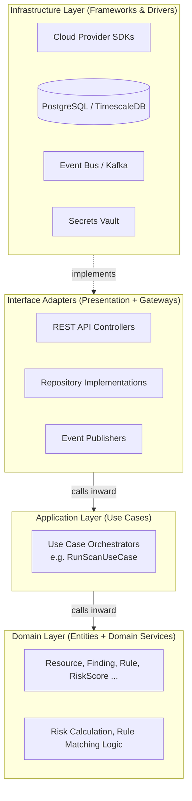
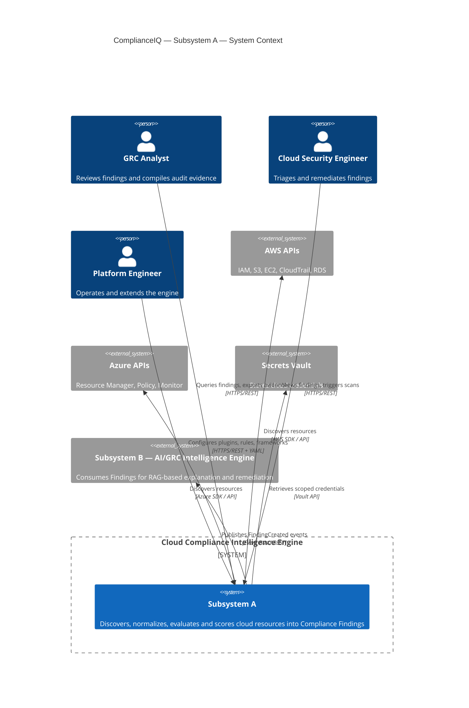

# ComplianceIQ — Software Architecture Specification (SAS)

## Part 1 — Vision, Requirements and Global Architecture

**Document class:** Official Software Architecture Specification (SAS)
**Subsystem in scope:** Subsystem A — Cloud Compliance Intelligence Engine
**Subsystem explicitly out of scope:** Subsystem B — AI/GRC Intelligence Engine (RAG, LLM inference, remediation generation, natural language explanation)
**Status:** Draft v1.0
**Audience:** Cloud Security Architects, Platform Engineers, DevSecOps Engineers, GRC Analysts, Academic Reviewers

---

### 1. Executive Summary

ComplianceIQ is an enterprise-grade Cloud Security Posture Management (CSPM) and Governance, Risk & Compliance (GRC) platform designed to continuously discover, normalize, evaluate, and score the compliance posture of multi-cloud environments. The platform is explicitly partitioned into two independently deployable, independently evolvable subsystems, connected by a single, strict, well-defined contract: the **Compliance Finding**.

This document specifies **Subsystem A**, the **Cloud Compliance Intelligence Engine** — the deterministic, rule-driven, graph-aware core that transforms raw cloud resource metadata into rich, evidence-backed, risk-scored Compliance Findings. Subsystem A never performs probabilistic reasoning, natural language generation, or remediation synthesis. Those responsibilities belong entirely to Subsystem B, the AI/GRC Intelligence Engine, which is designed and maintained independently by a separate engineering track within the same project.

The purpose of this separation is not organizational convenience — it is an architectural decision with deep consequences for testability, auditability, and regulatory defensibility. A GRC platform that mixes deterministic compliance evaluation with probabilistic LLM reasoning inside the same execution path becomes impossible to certify, because an auditor cannot distinguish a finding that is provably correct from a finding that is a model's best guess. By drawing a hard boundary at the Finding level, ComplianceIQ ensures that everything upstream of the Finding is deterministic, replayable, and provable, while everything downstream (explanation, prioritization narrative, remediation code generation) is free to leverage generative AI without contaminating the evidentiary chain.

This Part 1 of the SAS establishes:

1. The strategic vision and competitive positioning of ComplianceIQ relative to established CSPM/CNAPP products (Wiz, Orca Security, Prisma Cloud, Microsoft Defender for Cloud, AWS Security Hub, Lacework).
2. The precise problem statement the Cloud Compliance Intelligence Engine solves.
3. The functional and non-functional requirements that constrain every subsequent design decision.
4. The stakeholder landscape and usage personas.
5. The foundational architectural principles (Clean Architecture, Domain-Driven Design, SOLID, event-driven, cloud-native) that govern the entire engine.
6. A high-level global architecture overview, including a C4 Context Diagram and a first-pass module map.
7. The first set of Architecture Decision Records (ADRs) that lock in irreversible or high-cost-to-reverse decisions.

Subsequent parts of this SAS will descend into each layer, each module, each algorithm, each diagram type, and each data structure in full depth, as enumerated in the document plan. Part 1 exists to establish the "why" before any part of this document commits to the "how."

---

### 2. Vision and Strategic Positioning

#### 2.1 Why another CSPM engine?

The CSPM/CNAPP market is mature and crowded. Wiz popularized the agentless, graph-based security graph. Orca Security popularized SideScanning™ and unified data models across workloads. Prisma Cloud built a broad umbrella spanning CSPM, CWPP, and IaC scanning. Microsoft Defender for Cloud and AWS Security Hub offer native, deeply integrated posture management for their respective clouds. Lacework leaned heavily into anomaly detection via its Polygraph data model.

None of these products, however, is designed from the ground up as a teachable, fully transparent, deterministic **compliance evaluation engine** whose every decision is traceable to a specific rule, a specific piece of evidence, and a specific framework control. Commercial CSPM engines treat their rule evaluation logic, confidence scoring, and risk calculation as proprietary black boxes. This is a reasonable commercial decision for a vendor, but it is precisely the opposite of what a GRC platform intended for **audit defensibility** needs.

ComplianceIQ's Cloud Compliance Intelligence Engine is designed around a different premise: **every Compliance Finding must be independently re-derivable from raw cloud state, the active rule set, and the active framework mappings, without invoking any non-deterministic component.** This is what makes the engine suitable as the evidentiary backbone of a GRC platform rather than merely an alerting tool.

#### 2.2 Positioning relative to the reference products

| Product | Core Model | Strength | Gap ComplianceIQ Targets |
|---|---|---|---|
| Wiz | Security Graph (agentless) | Attack path visualization | Graph is proprietary and coupled to detection UI, not exposed as a reusable compliance evidence layer |
| Orca Security | SideScanning + Unified Data Model | Deep workload context without agents | Compliance mapping is a secondary feature layered on top of vulnerability data, not a first-class deterministic pipeline |
| Prisma Cloud | Broad CNAPP umbrella | Breadth (CSPM+CWPP+IaC) | Breadth trades off against depth of any single compliance mapping; rule engine is not independently pluggable per tenant |
| Microsoft Defender for Cloud | Native Azure Policy integration | Deep native integration | Multi-cloud normalization is secondary; Azure-first bias |
| AWS Security Hub | Native AWS Config integration | Deep native AWS integration | Weak multi-cloud normalization; framework mappings are AWS-centric |
| Lacework | Polygraph (behavioral baselining) | Anomaly detection | Weak on static, deterministic multi-framework compliance mapping |

ComplianceIQ's Cloud Compliance Intelligence Engine differentiates on four axes simultaneously, rather than optimizing for a single axis as the incumbents tend to do:

1. **Determinism and re-derivability** — every Finding traces to evidence, rule, and mapping.
2. **True multi-cloud normalization** — a Universal Resource Model (URM) that is not an AWS-first or Azure-first abstraction with other clouds bolted on, but a first-class, provider-agnostic canonical schema (detailed in Part 3).
3. **Context-aware, composite rule evaluation** — rules are not flat boolean checks; they are context-sensitive and combinable (detailed in Part 4).
4. **Explicit architectural separation from AI reasoning** — the engine's outputs are consumable by, but never dependent on, a generative AI layer.

#### 2.3 Strategic vision statement

> ComplianceIQ's Cloud Compliance Intelligence Engine exists to make cloud compliance **provable**, not merely **reported**. Every Finding it emits must be able to answer, on demand and without recomputation drift, the three questions every auditor asks: *What resource? What rule? What evidence?*

---

### 3. Problem Statement

#### 3.1 The core problem

Enterprises operate cloud estates spanning AWS, Azure, GCP, and increasingly Oracle Cloud Infrastructure (OCI), each exposing resources through incompatible APIs, incompatible identity models, incompatible encryption primitives, and incompatible logging semantics. Compliance frameworks (ISO 27001, NIST 800-53, CIS Benchmarks, PCI-DSS, DNSSI — the Moroccan national digital security directive, SOC 2) each define **controls** in natural language, at a level of abstraction that does not map 1:1 to any single cloud provider's native configuration surface.

The practical consequence is that compliance evaluation today is either:

- **Manual and unscalable** — GRC analysts export configuration reports and manually cross-reference them against control checklists in spreadsheets, a process that does not scale past a handful of accounts and immediately goes stale.
- **Native and siloed** — each cloud's native tool (AWS Config + Security Hub, Azure Policy, GCP Security Command Center) evaluates only its own resources against its own, often incomplete, framework mappings, producing three disconnected compliance pictures instead of one.
- **Commercial and opaque** — third-party CSPM tools solve the multi-cloud problem but hide the evaluation logic, making it difficult to justify a specific finding to an external auditor beyond "the vendor's engine flagged it."

#### 3.2 The problem decomposed

The Cloud Compliance Intelligence Engine must solve five distinct, compounding sub-problems:

1. **Discovery at scale** across heterogeneous, rate-limited, eventually-consistent cloud provider APIs, without missing resources and without triggering provider-side throttling.
2. **Normalization** of provider-specific resource shapes into a single canonical model rich enough to express every provider's security-relevant configuration, without losing provider-specific nuance needed for accurate rule evaluation.
3. **Relationship-aware evaluation** — many real compliance violations are not visible on a single resource in isolation (e.g., "public S3 bucket" is a single-resource check, but "publicly reachable database via a chain of permissive security groups and an internet gateway" is a graph traversal problem).
4. **Context-sensitive rule evaluation** — the same raw configuration can be compliant or non-compliant depending on tags, environment (prod vs. dev), data classification, or compensating controls, meaning a rule engine that evaluates rules as static booleans over raw fields is structurally insufficient.
5. **Multi-framework, many-to-many compliance mapping** — a single technical rule (e.g., "encryption at rest must use a customer-managed key") maps to multiple controls across multiple frameworks simultaneously, and that mapping must be maintained independently of the rule logic itself, so that adding a new framework never requires touching rule code.

#### 3.3 Non-problems (explicitly out of scope for Subsystem A)

To keep the architectural boundary sharp, the following are explicitly **not** solved by the Cloud Compliance Intelligence Engine, and any temptation to solve them inside Subsystem A must be treated as a scope violation during design review:

- Explaining *why* a finding matters in natural language for a human reader.
- Recommending or generating remediation code (e.g., a Terraform patch).
- Estimating financial or business impact.
- Any form of retrieval-augmented generation, prompt engineering, or LLM inference.
- Conversational interaction with end users.

These belong to Subsystem B and are consumed via the Finding contract only.

---

### 4. Scope Boundary: Subsystem A vs Subsystem B

This is the single most important architectural constraint in this entire document, and it is restated here explicitly because every module design in later parts must be checked against it.

```mermaid
flowchart LR
    subgraph SubsystemA["Subsystem A — Cloud Compliance Intelligence Engine (THIS DOCUMENT)"]
        direction TB
        A1[Discovery Engine]
        A2[Normalization Engine]
        A3[Universal Resource Model]
        A4[Knowledge Graph Engine]
        A5[Policy + Composite Rule Engine]
        A6[Context Engine]
        A7[Risk + Confidence Engine]
        A8[Attack Path Engine]
        A9[Compliance Mapping Engine]
        A10[Drift Detection Engine]
        A11[Finding Builder]
        A1 --> A2 --> A3 --> A4 --> A5 --> A6 --> A7 --> A8 --> A9 --> A10 --> A11
    end

    subgraph Contract["Contract Boundary"]
        F[(Compliance Finding
Immutable, Versioned, Evidence-backed)]
    end

    subgraph SubsystemB["Subsystem B — AI/GRC Intelligence Engine (Teammate's Work — Out of Scope)"]
        direction TB
        B1[RAG Retrieval]
        B2[LLM Reasoning]
        B3[Natural Language Explanation]
        B4[Remediation Generation]
        B5[Financial / Business Impact Analysis]
    end

    A11 --> F --> B1
    B1 --> B2 --> B3
    B2 --> B4
    B2 --> B5
```

**Rule of the boundary:** Subsystem A produces Findings. Subsystem A never reads anything Subsystem B produces. The dependency arrow only ever points from A to the Finding contract, and from the Finding contract to B. This is a one-way data flow, which is itself a Dependency Inversion decision at the subsystem level, not merely the module level — it will be revisited in Section 7 as ADR-001.

---

### 5. Stakeholders and Usage Personas

| Persona | Role | Primary Concern | Primary Interaction Point |
|---|---|---|---|
| GRC Analyst | Compiles audit evidence for ISO 27001 / NIST 800-53 / DNSSI audits | Traceability from control to evidence | Compliance Mapping Engine output, Finding evidence bundle |
| Cloud Security Engineer | Triages and remediates findings | Accurate, low-noise findings; drift alerts | Risk/Confidence-scored Findings, Drift Detection events |
| Platform/DevSecOps Engineer | Operates the engine itself | Scalability, plugin extensibility, observability | Plugin Manager, Event Bus, API Layer, Observability stack |
| CISO / Risk Owner | Consumes aggregated risk posture | Trustworthy, defensible risk scores | Risk Intelligence Engine, Attack Path Engine outputs |
| External Auditor | Verifies compliance claims | Re-derivability of any finding from raw evidence | Persistence Layer historical snapshots, Evidence records |
| Subsystem B (AI/GRC Engine) | Downstream consumer | Well-formed, versioned, complete Finding contract | Finding Builder output / Event Bus `FindingCreated` event |
| Academic Reviewer (Jury) | Evaluates architectural rigor for PFA/PFS defense | Demonstrated mastery of Clean Architecture, DDD, SOLID | This SAS document in full |

The last two personas matter architecturally as much as the first five: the engine must produce a contract clean enough that a second, independently developed team (Subsystem B, built by a teammate) can consume it without any tribal knowledge, and the engine's design must be legible enough to defend, module by module, in an academic jury setting. Both of these pressures push toward the same architectural answer: strict layering, explicit interfaces, and exhaustive documentation of *why*, not only *what*.

---

### 6. Functional Requirements

Functional requirements are grouped by pipeline stage. Each requirement carries an identifier (`FR-xx`) that will be referenced in later parts when specifying the module that satisfies it.

| ID | Requirement | Rationale |
|---|---|---|
| FR-01 | The engine MUST discover resources from AWS (IAM, S3, EC2, CloudTrail, RDS) via provider-native APIs without requiring an in-VM agent. | Agentless discovery avoids deployment friction and blast-radius risk of in-guest agents; matches the agentless posture pioneered by Wiz/Orca. |
| FR-02 | The engine MUST discover resources from Azure and be extensible to GCP and OCI without modifying core discovery logic. | Multi-cloud is a first-class requirement per the project's cahier des charges v3.1, which sets Azure as the MVP target. |
| FR-03 | The engine MUST normalize all discovered resources into a single canonical Universal Resource Model (URM) regardless of source cloud provider. | Downstream rule evaluation, graph construction, and compliance mapping must operate on one schema, not N provider schemas. |
| FR-04 | The engine MUST construct a relationship graph capturing network reachability, IAM trust relationships, and data flow between resources. | Many real-world compliance violations are graph-shaped, not single-resource-shaped (see Section 3.2, point 3). |
| FR-05 | The engine MUST evaluate declarative, YAML-defined rules against normalized resources and graph context. | Rules must be externally authorable by GRC/security engineers without recompiling the engine (Policy-as-Code). |
| FR-06 | The engine MUST support composite rules — rules whose satisfaction depends on the combined state of multiple resources or multiple simple rules. | Single-resource rules cannot express many real controls (e.g., "encryption AND logging AND restricted network access" as a joint condition). |
| FR-07 | The engine MUST enrich raw rule violations with organizational context (tags, environment, data classification, business criticality) before scoring. | The same raw misconfiguration carries different real risk depending on context; ignoring context produces excessive false positives. |
| FR-08 | The engine MUST calculate a quantitative Risk Score per finding using a documented, multi-factor, re-derivable formula. | Risk scores must be defensible to an auditor, not a black-box heuristic. |
| FR-09 | The engine MUST calculate a Confidence Score reflecting the certainty of a given finding, accounting for data completeness and evidence quality. | Distinguishes "we are certain this is a violation" from "we suspect this may be a violation given partial data," which is essential for prioritization. |
| FR-10 | The engine MUST identify Attack Paths — chains of individually-low-risk misconfigurations that compose into a high-risk exploitable path. | Matches the graph-based attack path capability that differentiates modern CSPM/CNAPP tools from static checklist tools. |
| FR-11 | The engine MUST map every technical rule violation to one or more controls across multiple compliance frameworks simultaneously (ISO 27001, NIST 800-53, CIS, DNSSI, PCI-DSS). | A single technical control satisfies many framework obligations; the mapping must be many-to-many and independently maintainable. |
| FR-12 | The engine MUST detect configuration drift by comparing current scan state against the previous historical snapshot. | Compliance is a continuous, not point-in-time, property; drift detection is what makes CSPM continuous rather than periodic. |
| FR-13 | The engine MUST emit an immutable, versioned Compliance Finding as its terminal output, containing full evidence, the triggering rule, risk/confidence scores, framework mappings, and a reference to the resource(s) involved. | This is the sole contract with Subsystem B; it must be self-contained and complete. |
| FR-14 | The engine MUST persist every scan's raw evidence, normalized resources, and findings for historical, auditable retrieval. | Auditability requires re-derivability months after the fact, not just at scan time. |
| FR-15 | The engine MUST expose a plugin interface allowing new cloud providers, new compliance frameworks, and new YAML rule packs to be added without modifying core engine code. | Extensibility without core modification is a direct application of the Open/Closed Principle at the product level. |
| FR-16 | The engine MUST expose all pipeline stage transitions as events on an internal Event Bus. | Enables event-driven orchestration, replay, and clean integration points for both internal modules and Subsystem B. |
| FR-17 | The engine MUST expose a stable external API surface (REST, versioned) for triggering scans, querying findings, and retrieving historical snapshots. | External consumers, including the front-end presentation layer and Subsystem B, need a stable integration point independent of internal module structure. |

---

### 7. Non-Functional Requirements

| ID | Category | Requirement | Target / Metric |
|---|---|---|---|
| NFR-01 | Scalability | The engine must scale horizontally across discovery, rule evaluation, and graph construction stages independently. | Each pipeline stage independently scalable via Kubernetes HPA based on queue depth. |
| NFR-02 | Performance | A full scan of a mid-size tenant (~5,000 resources) must complete within a bounded time window suitable for scheduled continuous scanning. | Target: full scan ≤ 15 minutes at 5,000 resources; incremental scan ≤ 2 minutes. |
| NFR-03 | Reliability | No single provider API failure or rate-limit event may abort an entire scan. | Circuit breaker + partial-result tolerance per provider adapter. |
| NFR-04 | Extensibility | Adding a new cloud provider must not require modifying Domain or Application layers. | Enforced structurally via Clean Architecture + Plugin Manager (Part 2, Part 8). |
| NFR-05 | Determinism | Given identical raw cloud state and identical active rule/mapping versions, the engine must produce byte-identical Findings on re-run. | Verified via replay tests against archived raw evidence. |
| NFR-06 | Auditability | Every Finding must reference the exact rule version, mapping version, and evidence snapshot used to produce it. | Enforced via immutable versioning in the Persistence Layer (Part 9). |
| NFR-07 | Tenant Isolation | No tenant's data, credentials, or findings may be accessible to another tenant under any failure mode. | Enforced at data layer (row-level security) and at credential vault layer (Part 13). |
| NFR-08 | Security | All cloud provider credentials must be stored in a dedicated secrets manager, never in application configuration or code. | HashiCorp Vault or cloud-native KMS-backed secret store. |
| NFR-09 | Observability | Every pipeline stage must emit structured logs, metrics, and distributed traces. | OpenTelemetry instrumentation across all modules (Part 14). |
| NFR-10 | Maintainability | Core business logic (Domain layer) must have zero dependency on any infrastructure library. | Enforced via Dependency Inversion; validated via architecture fitness tests. |
| NFR-11 | Testability | Every module must be unit-testable in isolation via its port interfaces, without a live cloud connection. | Enforced via Clean Architecture ports/adapters and dependency injection. |
| NFR-12 | Data Retention | Historical snapshots must be retained for a configurable compliance-driven retention period (e.g., 1–7 years depending on framework). | Configurable per-tenant retention policy in Persistence Layer. |
| NFR-13 | API Stability | The external API must be versioned and must not introduce breaking changes without a major version increment. | Semantic versioning + OpenAPI contract enforcement. |
| NFR-14 | Portability | The engine must be deployable on any Kubernetes-conformant cluster, cloud-agnostic at the infrastructure level. | Containerized via Docker, orchestrated via Kubernetes, provisioned via Terraform. |

These non-functional requirements are not decorative. Each one directly forces a specific architectural choice that will be defended in later parts: NFR-10 and NFR-11 together are what force Clean Architecture rather than a simpler layered or transaction-script design; NFR-05 and NFR-06 together are what force the Confidence/Risk Engines to be pure functions over versioned inputs rather than stateful heuristics; NFR-01 and NFR-04 together are what force an event-driven, plugin-based module boundary rather than a monolithic pipeline function.

---

### 8. Foundational Architectural Principles

This section establishes the conceptual vocabulary used throughout the rest of the SAS. Deep, module-level application of each principle is deferred to later parts; this section defines *why* each principle was chosen for this specific problem domain.

#### 8.1 Clean Architecture

Clean Architecture (Robert C. Martin) organizes code into concentric layers — Entities, Use Cases, Interface Adapters, Frameworks & Drivers — with a single, non-negotiable rule: **source code dependencies may only point inward.** Nothing in an inner layer may know about anything in an outer layer.

For the Cloud Compliance Intelligence Engine, this maps as:

The reason this matters for a compliance engine specifically (as opposed to being generic architectural best practice) is **NFR-05 (Determinism)** and **NFR-06 (Auditability)**: if risk calculation logic (a Domain concern) were allowed to directly import a database client (an Infrastructure concern), it would become impossible to unit-test risk calculation deterministically without a live database, which in turn would make it practically impossible to certify that the risk formula behaves identically across environments. Clean Architecture is not adopted here for its own sake — it is adopted because it is the direct structural answer to a certification requirement.

#### 8.2 Domain-Driven Design (DDD)

DDD supplies the vocabulary — Entities, Value Objects, Aggregates, Domain Events, Bounded Contexts — used to model the problem domain independently of any persistence or transport concern. The Cloud Compliance Intelligence Engine is modeled as a set of Bounded Contexts:

- **Discovery Context** — owns the concept of a raw, provider-specific `Resource`.
- **Normalization Context** — owns the `NormalizedResource` (URM) and the mapping logic between provider shapes and the canonical shape.
- **Graph Context** — owns `Relationship` and graph traversal semantics.
- **Policy Context** — owns `Rule`, `CompositeRule`, `Policy`, and their evaluation semantics.
- **Risk Context** — owns `RiskScore`, `Confidence`, and their calculation semantics.
- **Compliance Context** — owns `Framework`, `ComplianceControl`, and the mapping between rules and controls.
- **Finding Context** — owns the terminal `Finding` aggregate, which is the only object exposed across the Subsystem A/B boundary.

Each Bounded Context maps closely, but not identically, to a module in Section 9 — the distinction between "Bounded Context" (a DDD modeling concept) and "Module" (a deployment/code-organization concept) is preserved deliberately, and is elaborated in Part 3 (Domain Model) with full attribute-level detail for every entity listed in the project's domain model scope (Tenant, CloudProvider, Resource, NormalizedResource, Relationship, Policy, CompositeRule, Rule, Evidence, RiskScore, AttackPath, Finding, Framework, ComplianceControl, HistoricalSnapshot, Plugin, Scan, Event).

#### 8.3 SOLID Principles Applied to a Compliance Engine

| Principle | Application in ComplianceIQ |
|---|---|
| Single Responsibility | Each engine (Discovery, Normalization, Risk, Confidence, etc.) has exactly one reason to change: a change to how AWS IAM is discovered never requires touching risk calculation code, and vice versa. |
| Open/Closed | New cloud providers, new rule packs, and new frameworks are added via the Plugin Manager (Part 8) without modifying existing engine code — this is the direct mechanism satisfying FR-15 and NFR-04. |
| Liskov Substitution | Any `CloudProviderAdapter` implementation (AWS, Azure, GCP, OCI) must be substitutable for any other without breaking the Discovery Engine's use case logic. |
| Interface Segregation | The engine defines narrow, role-specific ports (`ResourceDiscoveryPort`, `RuleRepositoryPort`, `FindingPersistencePort`) rather than a single monolithic infrastructure interface, so that a consumer only depends on the methods it actually uses. |
| Dependency Inversion | The Domain and Application layers define the ports; the Infrastructure layer implements them. Discovery Engine's use cases depend on an abstract `CloudProviderAdapter` interface, never on the concrete AWS SDK. |

#### 8.4 Event-Driven Architecture

Every pipeline stage transition (Section 10) is modeled as a Domain Event published to an internal Event Bus. This decision serves three simultaneous purposes: (1) it decouples pipeline stages so each can scale and fail independently (NFR-01, NFR-03); (2) it gives Subsystem B a natural, low-coupling integration point (`FindingCreated`) without requiring Subsystem B to poll or share internal state; (3) it produces a natural audit trail, since the sequence of events for a given scan is itself evidence of what happened and when.

#### 8.5 Cloud-Native Design

The engine is designed to be deployed as a set of independently scalable, stateless (where possible) containerized services orchestrated by Kubernetes, provisioned via Terraform, with CI/CD via GitHub Actions. Statelessness is enforced at the compute layer; all state lives in PostgreSQL (relational + historical data), and the Event Bus (message state in transit). This is what makes NFR-01 (independent horizontal scaling per stage) and NFR-14 (portability) achievable simultaneously.

---

### 9. High-Level Module Map

The following table introduces every module that Subsystem A is composed of. This is an overview only — each module receives a full dedicated treatment (Responsibilities, Inputs, Outputs, Internal Algorithms, Interfaces, Interactions, Failure Scenarios, Performance) in Parts 5 through 9 of this SAS.

| # | Module | One-line Responsibility | Clean Architecture Layer |
|---|---|---|---|
| 1 | Discovery Engine | Pulls raw resource data from cloud provider APIs | Infrastructure (adapters) + Application (use case orchestration) |
| 2 | Normalization Engine | Converts raw provider resources into the Universal Resource Model | Application + Domain |
| 3 | Universal Resource Model | Canonical, provider-agnostic resource schema | Domain (Entity/Value Object definitions) |
| 4 | Knowledge Graph Engine | Builds the relationship graph between normalized resources | Domain + Application |
| 5 | Policy Intelligence Engine | Evaluates YAML-defined rules against resources/graph | Domain (rule matching logic) + Application (orchestration) |
| 6 | Composite Rule Engine | Evaluates rules composed of multiple sub-conditions/resources | Domain |
| 7 | Context Engine | Enriches raw violations with organizational context | Domain + Application |
| 8 | Risk Intelligence Engine | Calculates the multi-factor Risk Score | Domain |
| 9 | Confidence Engine | Calculates the Confidence Score | Domain |
| 10 | Attack Path Engine | Discovers exploitable chains across the graph | Domain + Application |
| 11 | Compliance Mapping Engine | Maps rules to multi-framework controls | Domain |
| 12 | Drift Detection Engine | Compares current scan to historical snapshot | Application |
| 13 | Finding Builder | Assembles the terminal, immutable Finding | Application |
| 14 | Persistence Layer | Stores resources, findings, snapshots, audit data | Infrastructure |
| 15 | Plugin Manager | Loads/manages provider, framework, and rule-pack plugins | Infrastructure + Application |
| 16 | API Layer | External REST surface | Interface Adapters (Presentation) |
| 17 | Event Bus | Publishes/subscribes pipeline stage events | Infrastructure |

---

### 10. Global Architecture Overview (C4 Context Level)

This context diagram intentionally shows Subsystem B as an **external system** from Subsystem A's point of view, even though both are part of the same overall ComplianceIQ product and developed by the same two-person student team. This is the architectural expression of the scope boundary from Section 4: from the Cloud Compliance Intelligence Engine's perspective, Subsystem B is just another consumer of the Finding contract, with no special coupling. The full Container-level and Component-level C4 diagrams, along with the complete Clean Architecture, dependency, and package diagrams, are provided in Part 2.

---

### 11. Architecture Decision Records (ADR) — Initial Set

ADRs lock in decisions that are expensive to reverse later. Each ADR follows the standard format: Context, Decision, Consequences, Alternatives Considered.

#### ADR-001: Hard Subsystem Boundary at the Finding Level

- **Context:** The overall ComplianceIQ product combines deterministic compliance evaluation with generative AI-based explanation and remediation. Mixing these inside one codebase risks contaminating deterministic outputs with non-deterministic reasoning, and complicates independent development by two students on two different technical tracks.
- **Decision:** Subsystem A (this document) will never invoke, depend on, or import any LLM, RAG, or generative component. All communication to Subsystem B occurs exclusively through the immutable `Finding` entity, published via REST and/or Event Bus.
- **Consequences:** Subsystem A is independently testable, independently certifiable, and independently deployable. Subsystem B can evolve its AI stack freely without ever requiring changes to Subsystem A.
- **Alternatives Considered:** A shared monolith with an internal feature flag separating "deterministic mode" from "AI-augmented mode" — rejected because it does not structurally prevent accidental coupling, it only discourages it by convention.

#### ADR-002: Clean Architecture over Layered (N-Tier) Architecture

- **Context:** A simpler 3-tier (Presentation/Business/Data) architecture would be faster to bootstrap given the project timeline.
- **Decision:** Adopt full Clean Architecture with explicit ports and adapters and enforced inward-only dependencies.
- **Consequences:** Higher upfront design cost; significantly higher testability (NFR-11), portability (NFR-14), and determinism verifiability (NFR-05). Enables the Plugin Manager (module 15) to add providers without touching Domain/Application code (NFR-04).
- **Alternatives Considered:** Traditional N-Tier — rejected because Data layer concerns (ORM models) tend to leak into Business layer logic over time, which is precisely what NFR-10 forbids.

#### ADR-003: YAML as the Rule Definition Format

- **Context:** Rules must be authorable by GRC/security engineers who are not necessarily software engineers, and must support Policy-as-Code version control workflows.
- **Decision:** Rules and composite rules are defined declaratively in YAML, parsed and validated against a versioned JSON Schema, and loaded via the Plugin Manager.
- **Consequences:** Non-engineers can author and review rules via pull requests; rule changes are versioned in Git alongside infrastructure code. Requires a robust YAML rule engine (Part 4) capable of expressing composite, context-aware logic without turning YAML into an ad-hoc programming language.
- **Alternatives Considered:** Open Policy Agent (OPA)/Rego — rejected for this project's scope because Rego's learning curve was judged too steep for the target rule-authoring audience (GRC analysts), though the composite rule engine design in Part 4 borrows conceptually from Rego's policy evaluation model.

#### ADR-004: Event Bus as the Backbone for Pipeline Stage Transitions

- **Context:** The processing pipeline (Section 10 below) has ten-plus sequential stages, each with different scaling and failure characteristics.
- **Decision:** Every stage transition is published as a Domain Event on an internal Event Bus (Kafka-compatible), rather than the pipeline being implemented as a single synchronous function call chain.
- **Consequences:** Each stage can be scaled, deployed, and retried independently. Adds operational complexity (a message broker must be operated) and requires careful event schema versioning (addressed in Part 3 and Part 7).
- **Alternatives Considered:** Synchronous orchestration via a single orchestrator service calling each stage in sequence — rejected because it would violate NFR-01 (independent horizontal scaling per stage) and would make partial-failure recovery (NFR-03) significantly harder to reason about.

#### ADR-005: PostgreSQL as the Primary Persistence Store, with Historical Append-Only Tables

- **Context:** The engine must support both transactional querying of current findings and long-term, immutable historical retention for audit purposes (NFR-06, NFR-12).
- **Decision:** Use PostgreSQL as the primary store, with current-state tables and append-only historical/snapshot tables kept structurally distinct (full schema in Part 6).
- **Consequences:** A single well-understood, ACID-compliant database technology serves both needs, at the cost of needing disciplined table design to avoid current-state tables becoming unbounded. Time-series extensions (e.g., TimescaleDB) are considered for historical tables if snapshot volume grows beyond what plain PostgreSQL partitioning handles comfortably.
- **Alternatives Considered:** A separate document store (MongoDB) for findings — rejected because relational integrity between Resource, Rule, Finding, and Framework/Control mappings is naturally many-to-many and relational, and PostgreSQL's JSONB support already accommodates the semi-structured evidence payloads without needing a second database technology.

---

### 12. Glossary (Initial)

| Term | Definition |
|---|---|
| URM | Universal Resource Model — the canonical, provider-agnostic resource schema (Part 3). |
| Finding | The immutable, versioned, evidence-backed output of Subsystem A; the sole contract with Subsystem B. |
| Composite Rule | A rule whose satisfaction depends on multiple sub-conditions or multiple resources evaluated jointly. |
| Confidence Score | A quantitative measure of how certain the engine is that a given Finding is a true positive, given data completeness. |
| Risk Score | A quantitative, multi-factor measure of the severity/impact of a given Finding. |
| Attack Path | A graph-derived chain of individually low-risk misconfigurations that together form an exploitable path. |
| Drift | A change in resource configuration between two scans that affects compliance posture. |
| DNSSI | Directive Nationale de la Sécurité des Systèmes d'Information — the Moroccan national cybersecurity framework referenced alongside ISO 27001 and NIST 800-53 in this project's rule mappings. |
| Bounded Context | A DDD concept denoting an explicit boundary within which a domain model is consistent and unambiguous. |
| Port | An interface defined by the Domain or Application layer describing a capability needed from the outside world. |
| Adapter | A concrete Infrastructure-layer implementation of a Port. |

---

### 13. Closing Note for Part 1

Part 1 has deliberately not descended into per-module algorithms, per-entity attribute lists, or diagram-level detail beyond the C4 Context level — that is intentional, and reserved for Parts 2 onward as follows:

- **Part 2** — Full Clean Architecture layer-by-layer specification, Dependency Diagram, Package Diagram, Component Diagram, and full C4 Container + Component diagrams.
- **Part 3** — Complete Domain Model: every entity (Tenant, CloudProvider, Resource, NormalizedResource, Relationship, Policy, CompositeRule, Rule, Evidence, RiskScore, AttackPath, Finding, Framework, ComplianceControl, HistoricalSnapshot, Plugin, Scan, Event) with full attribute-level specification.
- **Parts 4–9** — Deep dive per module/innovation (Discovery, Normalization, URM, Knowledge Graph, Policy/Composite Rules, Context Engine, Risk/Confidence Engines, Attack Path Engine, Compliance Mapping, Drift Detection, Finding Builder), each with Responsibilities, Inputs, Outputs, Internal Algorithms (pseudocode), Interfaces, Interactions, Failure Scenarios, Performance.
- **Part 10** — Complete processing pipeline with full Mermaid flowchart and stage-by-stage explanation.
- **Part 11** — Full UML suite (Class, Sequence, Activity, State, Package, Deployment, Component diagrams).
- **Part 12** — Database Design (ER Diagram, tables, indexes, historical/audit tables).
- **Part 13** — Event-Driven Architecture detail (full event catalog, sequence diagrams).
- **Part 14** — Plugin Architecture (class diagrams, extension workflow for new providers/frameworks/rule packs).
- **Part 15** — Security (least privilege, tenant isolation, secrets management, auth/authz, secure plugin loading, audit logs, integrity verification).
- **Part 16** — Observability (metrics, logs, tracing, health checks, Prometheus, Grafana, OpenTelemetry).
- **Part 17** — Performance (parallel discovery, caching, incremental scanning, queue/batch processing, horizontal scaling).

Every subsequent part will maintain strict consistency with the requirements (FR-01 through FR-17, NFR-01 through NFR-14), the module map (Section 9), and the ADRs (Section 11) established in this Part 1. Any deviation discovered during later parts will be reconciled explicitly via an updated or superseding ADR, never silently.

---

*End of Part 1. Awaiting instruction: "Continue."*
