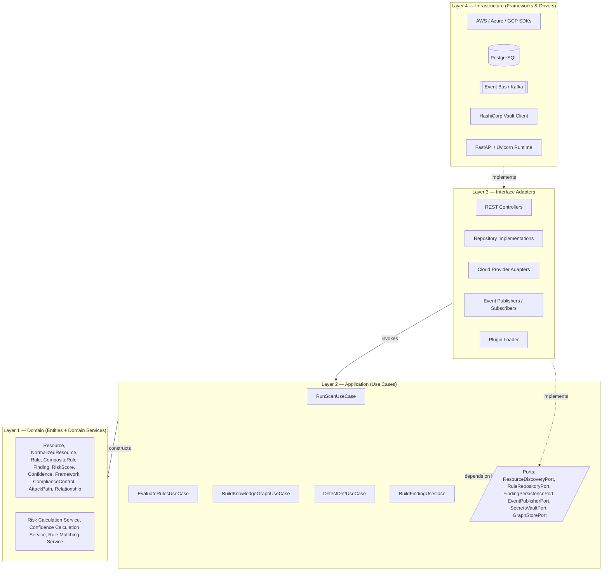
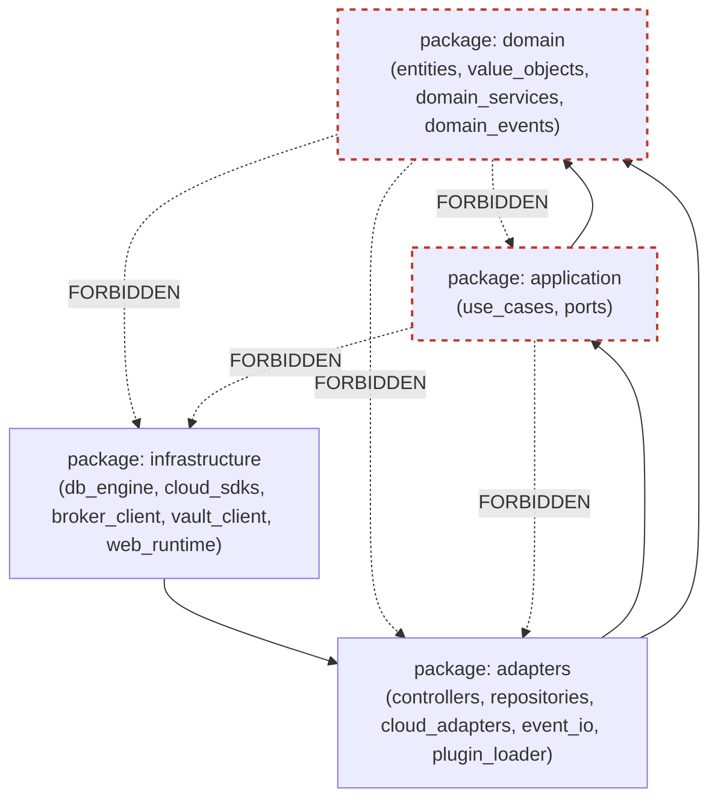
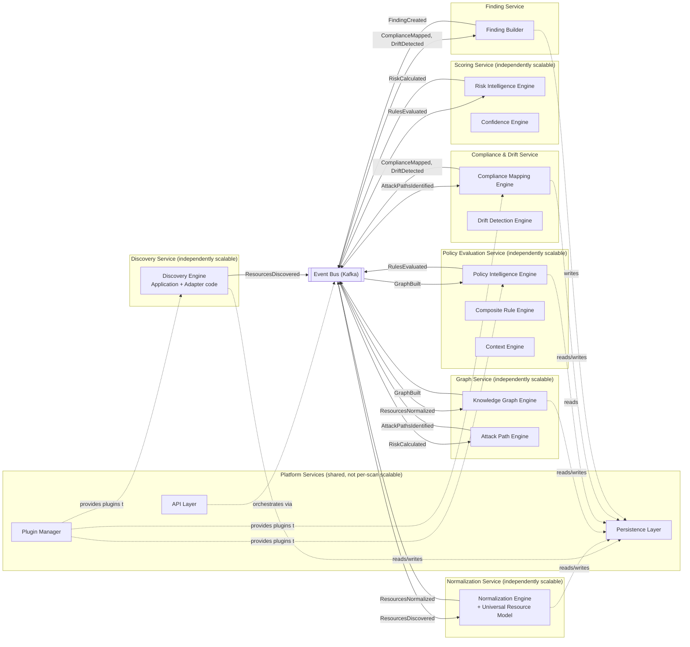
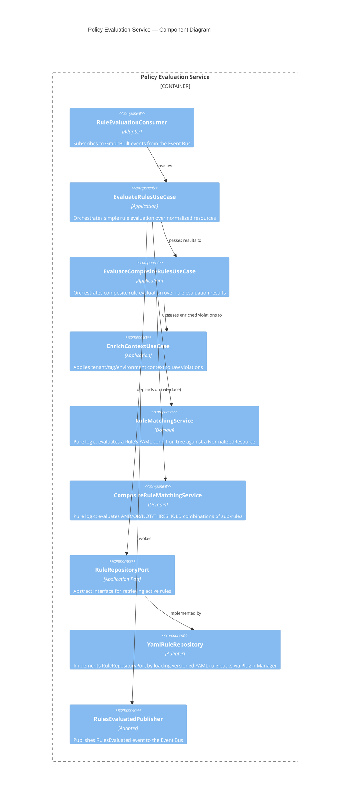

# ComplianceIQ — Software Architecture Specification (SAS)

## Part 2 — Clean Architecture, Dependency Model, and C4 Container/Component Views

**Document class:** Official Software Architecture Specification (SAS)
**Subsystem in scope:** Subsystem A — Cloud Compliance Intelligence Engine
**Continuity:** This part assumes Part 1 (Vision, Requirements, Global Architecture) as established context — in particular the module map (Part 1, Section 9), the FR/NFR catalog (Part 1, Sections 6–7), and ADR-001/ADR-002 (Part 1, Section 11).

---

### 1. Purpose of This Part

Part 1 established *why* Clean Architecture was chosen (ADR-002) and gave a conceptual, ring-level picture of the four layers. Part 2 now specifies, with full rigor, **exactly what lives in each layer, what each layer is allowed to depend on, what interfaces cross layer boundaries, and how every one of the seventeen modules from Part 1's module map is distributed across these layers.** This part also produces the C4 Container and Component diagrams that Part 1 deferred, plus the Dependency Diagram, Package Diagram, and Component Diagram requested by the project's documentation plan.

Everything in this part is normative: any module design in Parts 4 onward that violates a rule stated here must be treated as a defect, not a design choice.

---

### 2. The Four Layers, in Full Detail

Clean Architecture, as applied to ComplianceIQ, defines four concentric layers. The fundamental law governing them is the **Dependency Rule**: *source code dependencies can only point inward. Nothing in an inner circle can know anything at all about something in an outer circle.* Inner layers define interfaces (ports); outer layers implement them (adapters). This is Dependency Inversion applied at the architectural scale, not merely the class scale.

#### 2.1 Layer 1 (Innermost): Domain Layer

**Responsibility:** Encodes the enterprise-wide business rules and core entities of cloud compliance evaluation — the concepts that would still be true even if ComplianceIQ were reimplemented in a completely different language, on a completely different cloud, with a completely different database. This is where `Resource`, `NormalizedResource`, `Rule`, `CompositeRule`, `Finding`, `RiskScore`, `Confidence`, `Framework`, `ComplianceControl`, `AttackPath`, and `Relationship` live as pure data structures plus the pure functions/domain services that operate on them (full attribute-level specification in Part 3).

**Dependencies allowed:** None on any other layer. The Domain layer may depend only on language-standard constructs and possibly a small, dependency-free validation library. It must never import a database driver, an HTTP client, a cloud SDK, or a message broker client.

**What lives here:**
- Entities (Resource, Finding, Rule, etc.) as immutable-by-default data classes.
- Value Objects (e.g., `Arn`, `CloudRegion`, `Severity`, `EvidenceHash`).
- Domain Services — logic that doesn't naturally belong to a single entity, such as the Risk Calculation formula (Risk Intelligence Engine, module 8) and the Confidence Calculation formula (Confidence Engine, module 9), because both operate over multiple entities (Finding, Evidence, Rule) without owning any single one of them.
- Domain Events (e.g., `RiskCalculated`, `DriftDetected`) as plain data structures — their *publication* is an Infrastructure concern (module 17, Event Bus), but their *definition* is a Domain concern.

**Why this matters specifically for a compliance engine:** NFR-05 (Determinism) and NFR-06 (Auditability) require that the Risk and Confidence formulas be provably pure functions: same inputs, same outputs, every time, with no hidden dependency on wall-clock time, network state, or database round-trips. Placing these formulas in the Domain layer, with zero infrastructure dependency, is what makes it possible to unit test them exhaustively and to mathematically audit them without running any part of the actual production stack.

#### 2.2 Layer 2: Application Layer

**Responsibility:** Encodes the *use cases* of the system — the orchestration logic that coordinates Domain entities and services to accomplish a specific application-level goal, such as "run a full scan for tenant X" or "evaluate all active rules against a newly normalized resource." The Application layer is where the ten-plus-stage pipeline (Part 1, Section 10; full detail in Part 10) is actually sequenced.

**Dependencies allowed:** The Application layer may depend on the Domain layer (inward is always allowed) and on **abstract Ports** that it defines itself. It must never depend on a concrete Infrastructure implementation — it depends only on the interface, never the implementation.

**What lives here:**
- Use Case classes / orchestrators, one per pipeline stage or per externally triggerable action: `RunScanUseCase`, `EvaluateRulesUseCase`, `BuildKnowledgeGraphUseCase`, `DetectDriftUseCase`, `BuildFindingUseCase`, `RegisterPluginUseCase`.
- Port interfaces that the Use Cases depend on: `ResourceDiscoveryPort`, `ResourceRepositoryPort`, `RuleRepositoryPort`, `FindingPersistencePort`, `EventPublisherPort`, `SecretsVaultPort`, `GraphStorePort`.
- Data Transfer Objects (DTOs) used to move data across the Application/Adapter boundary without leaking Domain entity internals where inappropriate.

**Why Use Cases are modeled explicitly as classes, not as a monolithic service:** This is a direct application of the Single Responsibility Principle (Part 1, Section 8.3) at the Application layer — each Use Case has exactly one reason to change: the business process it orchestrates. It is also what makes the Application layer independently testable against mocked ports (NFR-11), since a Use Case's unit test never needs a live database, a live cloud API, or a live message broker — it only needs a mock implementation of whichever Ports it depends on.

#### 2.3 Layer 3: Interface Adapters Layer

**Responsibility:** Converts data between the format most convenient for the Application/Domain layers and the format most convenient for external agents (HTTP, message brokers, ORMs, cloud SDK response shapes). This is the layer of **Controllers, Presenters, Repository Implementations, and Event Publishers.**

**Dependencies allowed:** May depend on Application layer (to invoke Use Cases) and Domain layer (to construct/read entities), and additionally on Infrastructure-layer libraries needed to fulfill its adapter role (e.g., an ORM library to implement a Repository).

**What lives here:**
- REST Controllers (module 16, API Layer) that translate incoming HTTP requests into Use Case invocations and Use Case results into HTTP responses.
- Repository implementations (e.g., `PostgresFindingRepository implements FindingPersistencePort`) that translate between Domain entities and database rows/JSONB documents.
- Cloud Provider Adapters (e.g., `AwsResourceDiscoveryAdapter implements ResourceDiscoveryPort`) that translate cloud SDK response shapes into raw pre-normalization resource payloads.
- Event Publishers/Subscribers that translate Domain Events into serialized messages on the Event Bus and back.
- Plugin loader shims (module 15, Plugin Manager) that discover and wire concrete adapter implementations at runtime.

**Why this layer exists as distinct from Infrastructure:** Without this layer, Repository/Controller code would either leak ORM-specific types into the Application layer (violating the Dependency Rule) or force the Domain layer to know about HTTP status codes (an absurd inversion of responsibility). The Interface Adapters layer is the translation membrane that lets the inner layers stay completely ignorant of transport and persistence technology, satisfying NFR-04 (extensibility) and NFR-10 (maintainability) simultaneously.

#### 2.4 Layer 4 (Outermost): Infrastructure Layer (Frameworks & Drivers)

**Responsibility:** Contains the concrete, swappable technology: the actual AWS/Azure SDK client libraries, the actual PostgreSQL driver and connection pool, the actual Kafka/event-broker client, the actual HashiCorp Vault client, the web server framework (e.g., FastAPI's ASGI runtime), and container/deployment configuration.

**Dependencies allowed:** May depend on anything — this is the layer where all technology-specific dependencies are permitted to live, precisely because nothing else in the system is allowed to depend on it directly (only on the Ports it fulfills via Interface Adapters).

**What lives here:**
- Cloud SDKs (`boto3`/AWS SDK, Azure SDK for Python, GCP client libraries).
- Database engine and driver (PostgreSQL + `asyncpg`/`psycopg`, or an ORM engine such as SQLAlchemy's engine layer).
- Message broker client (Kafka producer/consumer libraries, or a managed equivalent).
- Secrets Vault client (HashiCorp Vault API client, or cloud-native KMS clients).
- Web framework runtime (FastAPI + Uvicorn/Gunicorn).
- Containerization and orchestration artifacts (Dockerfiles, Kubernetes manifests, Helm charts, Terraform modules) — these are not "code" in the traditional sense, but they are Infrastructure-layer artifacts in the Clean Architecture sense, since they configure how the outermost layer is deployed and wired.

#### 2.5 Full Clean Architecture Diagram



Note the direction of every solid arrow: strictly inward. The only dashed arrows represent *implementation* relationships (an outer-layer class implementing an inner-layer-defined interface), which is precisely the Dependency Inversion mechanism: the arrow of "implements" points outward-to-inward in terms of interface ownership, while the arrow of "depends on / calls" points inward only.

---

### 3. Dependency Diagram

The Dependency Diagram makes explicit, at the package level, which packages may import which. This diagram is the one used during code review and CI-enforced architecture fitness tests (see Section 6) to catch Dependency Rule violations automatically.



The "FORBIDDEN" edges are not merely documentation — Section 6 specifies how they are enforced mechanically via import-linter/dependency-cruiser style fitness tests inside the CI/CD pipeline (GitHub Actions), so that a pull request introducing, for example, a `psycopg2` import inside `domain/domain_services/risk_calculation.py` fails the build automatically rather than relying on reviewer vigilance alone.

---

### 4. Package Diagram

The Package Diagram descends one level further, showing how the seventeen modules from Part 1's module map are distributed into concrete source packages, respecting the layer boundaries above.

```mermaid
flowchart TB
    subgraph domain_pkg["domain/"]
        d1["resource/ (Resource, NormalizedResource)"]
        d2["policy/ (Rule, CompositeRule, Policy)"]
        d3["risk/ (RiskScore, Confidence, RiskCalculationService, ConfidenceService)"]
        d4["graph/ (Relationship, AttackPath, GraphTraversalService)"]
        d5["compliance/ (Framework, ComplianceControl, MappingService)"]
        d6["finding/ (Finding, Evidence)"]
        d7["tenancy/ (Tenant, CloudProvider, Scan)"]
    end

    subgraph application_pkg["application/"]
        a1["use_cases/discovery/ (RunScanUseCase, DiscoverResourcesUseCase)"]
        a2["use_cases/normalization/ (NormalizeResourcesUseCase)"]
        a3["use_cases/graph/ (BuildKnowledgeGraphUseCase)"]
        a4["use_cases/policy/ (EvaluateRulesUseCase, EvaluateCompositeRulesUseCase)"]
        a5["use_cases/context/ (EnrichContextUseCase)"]
        a6["use_cases/risk/ (CalculateRiskUseCase, CalculateConfidenceUseCase)"]
        a7["use_cases/attackpath/ (DiscoverAttackPathsUseCase)"]
        a8["use_cases/mapping/ (MapToFrameworksUseCase)"]
        a9["use_cases/drift/ (DetectDriftUseCase)"]
        a10["use_cases/finding/ (BuildFindingUseCase)"]
        a11["ports/ (all Port interfaces)"]
    end

    subgraph adapters_pkg["adapters/"]
        ad1["web/ (REST Controllers — module 16: API Layer)"]
        ad2["persistence/ (Repository impls — module 14: Persistence Layer)"]
        ad3["cloud/aws/, cloud/azure/, cloud/gcp/, cloud/oci/ (module 1: Discovery Engine adapters)"]
        ad4["eventing/ (Event Publishers/Subscribers — module 17: Event Bus adapters)"]
        ad5["plugins/ (module 15: Plugin Manager — loader + registry)"]
    end

    subgraph infra_pkg["infrastructure/"]
        i1["db/ (PostgreSQL engine config)"]
        i2["broker/ (Kafka client config)"]
        i3["secrets/ (Vault client config)"]
        i4["web_server/ (FastAPI/Uvicorn bootstrap)"]
        i5["sdks/ (vendored cloud SDK configuration)"]
    end

    application_pkg --> domain_pkg
    adapters_pkg --> application_pkg
    adapters_pkg --> domain_pkg
    infra_pkg --> adapters_pkg
```



Mapping back to Part 1's seventeen modules: modules 3 (URM), 6 (Composite Rule Engine's pure matching logic), 8 (Risk Intelligence Engine), 9 (Confidence Engine), and 11 (Compliance Mapping Engine's pure mapping logic) live predominantly in `domain/`. Modules 1 (Discovery), 4 (Knowledge Graph orchestration), 5 (Policy orchestration), 7 (Context Engine), 10 (Attack Path orchestration), 12 (Drift Detection), and 13 (Finding Builder) live predominantly in `application/` as Use Cases, with their heavier pure-logic pieces delegated into `domain/` domain services where applicable. Modules 14 (Persistence), 15 (Plugin Manager), 16 (API Layer), and 17 (Event Bus) live in `adapters/` and `infrastructure/`.

---

### 5. Component Diagram

The Component Diagram shows runtime component boundaries — which of these packages are deployed as independently scalable services versus which are compiled together into a single deployable unit. This decision is driven directly by NFR-01 (independent horizontal scaling per stage).



Each `SVCn` boundary is a candidate Kubernetes Deployment with its own Horizontal Pod Autoscaler policy (detailed in Part 17, Performance). The grouping decisions here are deliberate: modules 3 (Graph) and 10 (Attack Path) share a service because Attack Path discovery is fundamentally a graph traversal operation over the same in-memory/graph-store structure that the Knowledge Graph Engine builds, so co-locating them avoids an expensive graph re-hydration round trip. Similarly, modules 11 (Compliance Mapping) and 12 (Drift Detection) share a service because both are read-heavy against the same historical/current snapshot data and both execute late in the pipeline just before Finding assembly.

---

### 6. C4 Container Diagram

Building on Part 1's C4 Context diagram, the Container diagram descends one level to show the deployable containers/services that compose Subsystem A.

```mermaid
C4Container
    title ComplianceIQ Subsystem A — Container Diagram

    Person(secEng, "Cloud Security Engineer")
    Person(devsecops, "Platform Engineer")

    System_Boundary(sysA, "Cloud Compliance Intelligence Engine") {
        Container(api, "API Layer", "FastAPI", "Exposes REST endpoints for triggering scans, querying findings, managing plugins")
        Container(discovery, "Discovery Service", "Python / asyncio", "Pulls raw resources from cloud provider APIs via plugin adapters")
        Container(normalize, "Normalization Service", "Python", "Converts raw resources into the Universal Resource Model")
        Container(graph, "Graph Service", "Python + Graph library", "Builds relationship graph; discovers attack paths")
        Container(policy, "Policy Evaluation Service", "Python + YAML rule loader", "Evaluates simple and composite rules with context enrichment")
        Container(scoring, "Scoring Service", "Python", "Calculates Risk Score and Confidence Score")
        Container(compliance, "Compliance & Drift Service", "Python", "Maps rules to frameworks; detects drift vs. historical snapshot")
        Container(finding, "Finding Service", "Python", "Assembles the immutable Compliance Finding")
        Container(pluginmgr, "Plugin Manager", "Python", "Loads provider/framework/rule-pack plugins at runtime")
        ContainerDb(pg, "PostgreSQL", "Relational DB", "Current-state + historical/audit tables")
        ContainerQueue(bus, "Event Bus", "Kafka", "Publishes/subscribes pipeline stage events")
        Container(vaultc, "Vault Client Sidecar", "HashiCorp Vault Agent", "Injects scoped cloud credentials")
    }

    System_Ext(aws, "AWS APIs")
    System_Ext(azure, "Azure APIs")
    System_Ext(subB, "Subsystem B — AI/GRC Intelligence Engine")

    Rel(secEng, api, "Views findings, triggers scans", "HTTPS")
    Rel(devsecops, api, "Manages plugins & rules", "HTTPS")
    Rel(api, bus, "Publishes ScanStarted", "Kafka protocol")
    Rel(discovery, aws, "Reads resource metadata", "AWS SDK")
    Rel(discovery, azure, "Reads resource metadata", "Azure SDK")
    Rel(discovery, vaultc, "Requests scoped credentials", "Vault API")
    Rel(discovery, bus, "Publishes ResourcesDiscovered", "Kafka")
    Rel(bus, normalize, "Consumes ResourcesDiscovered")
    Rel(normalize, bus, "Publishes ResourcesNormalized")
    Rel(bus, graph, "Consumes ResourcesNormalized")
    Rel(graph, bus, "Publishes GraphBuilt")
    Rel(bus, policy, "Consumes GraphBuilt")
    Rel(policy, pluginmgr, "Loads active YAML rule packs")
    Rel(policy, bus, "Publishes RulesEvaluated")
    Rel(bus, scoring, "Consumes RulesEvaluated")
    Rel(scoring, bus, "Publishes RiskCalculated")
    Rel(bus, graph, "Consumes RiskCalculated (Attack Path trigger)")
    Rel(graph, bus, "Publishes AttackPathsIdentified")
    Rel(bus, compliance, "Consumes AttackPathsIdentified")
    Rel(compliance, pg, "Reads historical snapshot, writes drift + mapping results")
    Rel(compliance, bus, "Publishes ComplianceMapped, DriftDetected")
    Rel(bus, finding, "Consumes ComplianceMapped, DriftDetected")
    Rel(finding, pg, "Persists immutable Finding")
    Rel(finding, bus, "Publishes FindingCreated")
    Rel(bus, subB, "FindingCreated event delivered")
    Rel(api, pg, "Queries findings / snapshots", "SQL")
```



Each `Container` in this diagram corresponds to one `SVCn` grouping from the Component Diagram in Section 5, and is independently containerized (one Docker image per container, one Kubernetes Deployment per container, per NFR-01 and NFR-14).

---

### 7. C4 Component Diagram (Policy Evaluation Service, as a representative example)

C4 Component diagrams are produced per-container. Rather than reproduce all eight containers' component diagrams here (which would be redundant with the per-module deep dives in Parts 4–9), this section demonstrates the pattern using the **Policy Evaluation Service** as a representative example, since it is architecturally the richest container (housing modules 5, 6, and 7).



This example demonstrates, at the component level, the Dependency Inversion pattern stated abstractly in Section 2: `EvaluateRulesUseCase` (Application layer) depends only on `RuleRepositoryPort` (an Application-layer-defined interface), never directly on `YamlRuleRepository` (an Adapter-layer implementation). At runtime, dependency injection (wired in the Infrastructure layer's composition root) supplies the concrete `YamlRuleRepository` instance. This is precisely what allows, per ADR-003, the rule storage backend to be swapped (e.g., from flat YAML files to a database-backed rule store) without touching `EvaluateRulesUseCase` or `RuleMatchingService` at all.

---

### 8. Cross-Reference: Modules to Layers to Requirements

This table closes the loop between Part 1's module map, this part's layer assignments, and the FR/NFR IDs each module primarily satisfies — ensuring full traceability, which is itself a recurring architectural value (NFR-06) applied reflexively to this very document.

| Module | Primary Layer(s) | Primary FR/NFR Satisfied |
|---|---|---|
| 1. Discovery Engine | Adapter + Application | FR-01, FR-02, NFR-03 |
| 2. Normalization Engine | Application + Domain | FR-03 |
| 3. Universal Resource Model | Domain | FR-03, NFR-04 |
| 4. Knowledge Graph Engine | Domain + Application | FR-04 |
| 5. Policy Intelligence Engine | Domain + Application | FR-05, NFR-11 |
| 6. Composite Rule Engine | Domain | FR-06 |
| 7. Context Engine | Domain + Application | FR-07 |
| 8. Risk Intelligence Engine | Domain | FR-08, NFR-05 |
| 9. Confidence Engine | Domain | FR-09, NFR-05 |
| 10. Attack Path Engine | Domain + Application | FR-10 |
| 11. Compliance Mapping Engine | Domain | FR-11 |
| 12. Drift Detection Engine | Application | FR-12 |
| 13. Finding Builder | Application | FR-13 |
| 14. Persistence Layer | Infrastructure | FR-14, NFR-06, NFR-12 |
| 15. Plugin Manager | Adapter + Infrastructure | FR-15, NFR-04 |
| 16. API Layer | Adapter | FR-17, NFR-13 |
| 17. Event Bus | Infrastructure | FR-16, NFR-01, NFR-03 |

---

### 9. Architectural Fitness Enforcement

Because the Dependency Rule is only valuable if it is actually enforced, not merely documented, this section specifies how it is checked mechanically in the CI/CD pipeline (GitHub Actions), preventing regressions as the codebase grows across a multi-month, two-student project.

```yaml
# .github/workflows/architecture-fitness.yml (excerpt)
name: Architecture Fitness Tests
on: [pull_request]
jobs:
  dependency-rule-check:
    runs-on: ubuntu-latest
    steps:
      - uses: actions/checkout@v4
      - name: Install import-linter
        run: pip install import-linter --break-system-packages
      - name: Enforce layer boundaries
        run: lint-imports --config .importlinter.cfg
```

```ini
# .importlinter.cfg (excerpt)
[importlinter]
root_package = complianceiq

[importlinter:contract:1]
name = Domain must not depend on Application, Adapters, or Infrastructure
type = forbidden
source_modules = complianceiq.domain
forbidden_modules =
    complianceiq.application
    complianceiq.adapters
    complianceiq.infrastructure

[importlinter:contract:2]
name = Application must not depend on Adapters or Infrastructure
type = forbidden
source_modules = complianceiq.application
forbidden_modules =
    complianceiq.adapters
    complianceiq.infrastructure
```

A pull request that introduces a forbidden import fails CI before it can be merged, which is the operational mechanism that makes NFR-10 (maintainability) and NFR-11 (testability) durable guarantees rather than aspirational documentation.

---

### 10. Closing Note for Part 2

Part 2 has fully specified the static architecture: the four Clean Architecture layers with their allowed dependencies, the Dependency Diagram with explicit forbidden edges, the Package Diagram mapping all seventeen modules to concrete source packages, the Component Diagram showing runtime service boundaries and their scaling rationale, the C4 Container diagram for the whole subsystem, a representative C4 Component diagram for the Policy Evaluation Service, a full module-to-layer-to-requirement traceability table, and the mechanical CI enforcement of the Dependency Rule.

Part 3, next, will descend into the **complete Domain Model**: every entity listed in the project's domain model scope — Tenant, CloudProvider, Resource, NormalizedResource, Relationship, Policy, CompositeRule, Rule, Evidence, RiskScore, AttackPath, Finding, Framework, ComplianceControl, HistoricalSnapshot, Plugin, Scan, Event — specified attribute by attribute, with justification for every field, plus the accompanying UML Class Diagrams.

---

*End of Part 2. Awaiting instruction: "Continue."*
