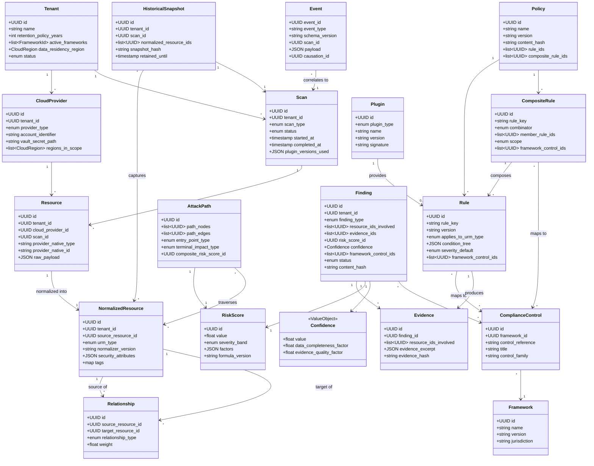

# ComplianceIQ — Software Architecture Specification (SAS)

## Part 3 — Complete Domain Model

**Document class:** Official Software Architecture Specification (SAS)
**Subsystem in scope:** Subsystem A — Cloud Compliance Intelligence Engine
**Continuity:** Builds directly on Part 1 (Vision/Requirements) and Part 2 (Clean Architecture/C4). Every entity specified here lives in the `domain/` package defined in Part 2, Section 4, and must obey the zero-infrastructure-dependency rule from Part 2, Section 2.1.

---

### 1. Purpose of This Part

Part 3 specifies, attribute by attribute, every entity, value object, and domain event enumerated in the project's domain model scope: `Tenant`, `CloudProvider`, `Resource`, `NormalizedResource`, `Relationship`, `Policy`, `CompositeRule`, `Rule`, `Evidence`, `RiskScore`, `AttackPath`, `Finding`, `Framework`, `ComplianceControl`, `HistoricalSnapshot`, `Plugin`, `Scan`, and `Event`. For each entity, this part explains not only *what* the fields are, but *why* each field exists, tracing back to the FR/NFR catalog established in Part 1. This part also produces the UML Class Diagrams for the full domain model, plus a Bounded Context map that reconciles the DDD contexts introduced conceptually in Part 1, Section 8.2, with the concrete classes defined here.

A recurring design discipline applied throughout this part: **every entity that can appear inside a Finding, directly or by reference, must be immutable and versioned.** This is the direct mechanism by which NFR-05 (Determinism) and NFR-06 (Auditability) are satisfied at the data-modeling level, not merely at the algorithmic level (Risk/Confidence formulas, Part 2 Section 2.1) — an immutable entity cannot silently drift underneath a Finding that references it after the fact.

---

### 2. Domain Model Design Conventions

Before specifying individual entities, the conventions that apply uniformly across all of them are stated once here, to avoid repetition:

- **Identity:** Every Entity (as opposed to Value Object) has a globally unique `id` field, a UUIDv7 (time-ordered UUID), chosen over UUIDv4 specifically because time-ordering improves PostgreSQL index locality for the append-only historical tables specified in Part 2's Package Diagram and detailed further in Part 12 (Database Design).
- **Tenancy:** Every Entity that is tenant-scoped carries an explicit `tenant_id` field, never relies on implicit context, since NFR-07 (Tenant Isolation) requires that isolation be enforceable at the data layer independent of any application-layer bug.
- **Versioning:** Every Entity whose meaning can change over time (`Rule`, `CompositeRule`, `Policy`, `Framework`, `ComplianceControl`, mapping definitions) carries an explicit `version` field and a `content_hash` field (SHA-256 of the canonical serialized content), so that a `Finding` can pin the *exact* version of every input that produced it (NFR-06).
- **Timestamps:** Every Entity carries `created_at`; mutable entities additionally carry `updated_at`; immutable entities (Finding, Evidence, HistoricalSnapshot) deliberately omit `updated_at` since its presence would imply mutability.
- **Value Objects vs. Entities:** A Value Object (e.g., `Severity`, `Arn`, `CloudRegion`, `EvidenceHash`) has no identity of its own — two Value Objects with identical field values are considered equal and interchangeable. An Entity has identity that persists even if its fields change (where mutation is allowed at all).

---

### 3. Entity Specifications

#### 3.1 Tenant

**Bounded Context:** Tenancy Context (cross-cutting; referenced by nearly every other context).

**Purpose:** Represents a single customer organization using ComplianceIQ. Every scan, resource, rule override, and finding is scoped to exactly one Tenant, satisfying NFR-07.

| Field | Type | Justification |
|---|---|---|
| `id` | UUID | Global identity, referenced by every tenant-scoped entity. |
| `name` | string | Display name for UI and reports. |
| `legal_entity_name` | string | Required for compliance/audit documentation to match the entity named in framework certificates. |
| `retention_policy_years` | int | Drives Persistence Layer historical retention (NFR-12); varies per framework the tenant is certifying against (e.g., DNSSI vs. PCI-DSS retention differs). |
| `active_frameworks` | list[FrameworkId] | Which compliance frameworks are currently in scope for this tenant — drives which mappings the Compliance Mapping Engine (module 11) applies. |
| `data_residency_region` | CloudRegion (Value Object) | Some tenants (e.g., under DNSSI) require that even historical evidence data reside within a specific geography. |
| `created_at` | timestamp | Standard convention. |
| `status` | enum(`active`, `suspended`, `offboarding`) | Governs whether new scans may be scheduled. |

#### 3.2 CloudProvider

**Bounded Context:** Tenancy Context / Discovery Context boundary object.

**Purpose:** Represents one configured cloud account/subscription/project belonging to a Tenant, and the credential reference needed to discover it. Note: the actual credential secret is never stored here — only a reference (`vault_secret_path`) into the Secrets Vault (NFR-08), consistent with ADR-level security requirements elaborated in Part 15.

| Field | Type | Justification |
|---|---|---|
| `id` | UUID | Identity. |
| `tenant_id` | UUID (FK → Tenant) | Tenant scoping (NFR-07). |
| `provider_type` | enum(`aws`, `azure`, `gcp`, `oci`) | Discriminates which Discovery plugin adapter (Part 2, Section 5, module 1) handles this account; extensible via Plugin Manager (FR-15) without adding new enum values requiring core changes — new providers register a provider_type at plugin registration time rather than via a hardcoded enum in production code (the enum shown here is illustrative of the four providers named in the project scope). |
| `account_identifier` | string | The provider-native account ID / subscription ID / project ID. |
| `vault_secret_path` | string | Reference only; never the credential itself (NFR-08). |
| `regions_in_scope` | list[CloudRegion] | Limits Discovery Engine's API calls to relevant regions, directly improving performance (NFR-02). |
| `discovery_enabled` | boolean | Allows temporarily disabling discovery for a specific account without deleting its configuration/history. |
| `last_successful_scan_at` | timestamp, nullable | Operational visibility; feeds health dashboards (Part 16, Observability). |

#### 3.3 Resource

**Bounded Context:** Discovery Context.

**Purpose:** The raw, provider-specific representation of a single cloud resource, exactly as returned by the provider's API, prior to any normalization. This entity deliberately preserves provider-native shape and field names, because normalization (Section 3.4) needs the *original* data to be independently re-derivable — if raw data were discarded at normalization time, re-normalization after a URM schema change (a realistic and expected evolution) would be impossible.

| Field | Type | Justification |
|---|---|---|
| `id` | UUID | Identity. |
| `tenant_id` | UUID (FK) | Tenant scoping. |
| `cloud_provider_id` | UUID (FK → CloudProvider) | Which account this resource was discovered from. |
| `scan_id` | UUID (FK → Scan) | Which scan run discovered/re-confirmed this resource (supports point-in-time reasoning and drift comparison, FR-12). |
| `provider_native_type` | string | E.g., `AWS::S3::Bucket`, `Microsoft.Storage/storageAccounts` — preserved verbatim for traceability. |
| `provider_native_id` | string | ARN, Azure Resource ID, or GCP self-link — the provider's own globally unique identifier. |
| `raw_payload` | JSONB | The complete, untouched API response body — this is the ground truth from which everything downstream is derived, and is what makes NFR-05 (Determinism) verifiable via replay. |
| `discovered_at` | timestamp | When this specific raw snapshot was captured. |
| `region` | CloudRegion (Value Object) | Needed even at the raw stage for region-scoped rules (e.g., data residency rules). |

#### 3.4 NormalizedResource (Universal Resource Model instance)

**Bounded Context:** Normalization Context.

**Purpose:** The canonical, provider-agnostic representation of a resource, produced by the Normalization Engine (module 2) from a `Resource`. This is the schema that every rule, every graph edge, and every risk calculation actually operates against — it is the single most architecturally important entity in the entire Domain layer, and its full internal structure (attribute taxonomy across IAM, network, encryption, storage, and logging domains) is specified in complete depth in Part 4 (Universal Resource Model deep dive), since the project's design plan calls for a dedicated Core Innovation treatment of the URM. This section defines only its top-level shape as an Entity.

| Field | Type | Justification |
|---|---|---|
| `id` | UUID | Identity, distinct from the source `Resource.id` — a NormalizedResource is a derived entity, not the same identity as its raw source, because the normalization logic itself is versioned (see `normalizer_version` below) and a re-normalization produces a new NormalizedResource version while the raw Resource stays untouched. |
| `tenant_id` | UUID (FK) | Tenant scoping. |
| `source_resource_id` | UUID (FK → Resource) | Traceability back to raw ground truth (NFR-06). |
| `urm_type` | enum | Canonical resource category: `ObjectStorage`, `ComputeInstance`, `IdentityPrincipal`, `IdentityPolicy`, `NetworkBoundary`, `DatabaseInstance`, `AuditLogSink`, etc. — provider-agnostic by design (FR-03). |
| `normalizer_version` | string | Which version of the Normalization Engine's mapping logic produced this record — essential for NFR-05/NFR-06, since normalization logic itself evolves and a Finding must be traceable to the exact mapping version used. |
| `security_attributes` | JSONB (structured per `urm_type`) | Canonical fields such as `encryption`, `public_access`, `logging_enabled`, `network_exposure` — the actual schema per `urm_type` is specified in Part 4. |
| `tags` | map[string, string] | Canonical, provider-agnostic tag representation (AWS tags, Azure tags, and GCP labels are all normalized into this one shape) — required input to the Context Engine (module 7, FR-07). |
| `relationships_summary` | list[UUID] | Denormalized convenience references to `Relationship` entities involving this resource, for query performance; the authoritative relationship data lives in the `Relationship` entity itself (Section 3.5). |

#### 3.5 Relationship

**Bounded Context:** Graph Context.

**Purpose:** Represents a directed edge between two NormalizedResources, capturing network reachability, IAM trust, or data flow — the structural basis for the Knowledge Graph Engine (module 4) and Attack Path Engine (module 10).

| Field | Type | Justification |
|---|---|---|
| `id` | UUID | Identity. |
| `tenant_id` | UUID (FK) | Tenant scoping. |
| `source_resource_id` | UUID (FK → NormalizedResource) | Edge origin. |
| `target_resource_id` | UUID (FK → NormalizedResource) | Edge destination. |
| `relationship_type` | enum(`NETWORK_REACHABLE`, `IAM_TRUSTS`, `IAM_CAN_ASSUME`, `DATA_FLOWS_TO`, `ATTACHED_TO`, `CONTAINS`) | Discriminates edge semantics for graph traversal algorithms (Part 9, Attack Path pseudocode). |
| `derived_from_rule` | string, nullable | Some relationships are directly observed (e.g., `ATTACHED_TO` a security group) while others are *derived* by a graph-construction rule (e.g., `NETWORK_REACHABLE` inferred by evaluating security group + NACL + route table interaction) — this field records which derivation logic produced the edge, for auditability. |
| `weight` | float | A traversal cost/likelihood factor consumed by the Attack Path Engine's shortest-exploitable-path algorithm (Part 9). |
| `scan_id` | UUID (FK → Scan) | Point-in-time scoping, supports drift comparison of the graph itself, not only individual resources. |

#### 3.6 Policy

**Bounded Context:** Policy Context.

**Purpose:** A named, versioned collection of Rules and CompositeRules that together represent an organizational or framework-driven policy stance (e.g., "CIS AWS Foundations Benchmark v3.0 — Level 1").

| Field | Type | Justification |
|---|---|---|
| `id` | UUID | Identity. |
| `tenant_id` | UUID, nullable (FK) | Null for global/built-in policies shipped with the platform; non-null for tenant-authored custom policies — supports both out-of-the-box frameworks and tenant customization simultaneously. |
| `name` | string | E.g., "CIS AWS Foundations Benchmark". |
| `version` | string | Semantic version of this policy definition (ADR-003). |
| `content_hash` | string (SHA-256) | Enables byte-level verification that a Finding was produced against the exact policy content claimed. |
| `rule_ids` | list[UUID] (FK → Rule) | Member rules. |
| `composite_rule_ids` | list[UUID] (FK → CompositeRule) | Member composite rules. |
| `source` | enum(`built_in`, `tenant_custom`, `plugin_provided`) | Provenance, relevant to the Plugin Manager (FR-15). |

#### 3.7 Rule

**Bounded Context:** Policy Context.

**Purpose:** A single, atomic, declaratively-defined check evaluated against one NormalizedResource (or a small, explicitly bounded set of related resources). Full YAML schema and evaluation pseudocode are given in Part 4/Part 9; this section defines the Entity shape.

| Field | Type | Justification |
|---|---|---|
| `id` | UUID | Identity. |
| `rule_key` | string | Human-stable identifier used in YAML (e.g., `s3-bucket-encryption-enabled`) — distinct from `id` because `rule_key` is stable across versions while `id` may be regenerated per version depending on storage strategy (resolved concretely in Part 4). |
| `version` | string | Rule content version (ADR-003, NFR-06). |
| `content_hash` | string (SHA-256) | Byte-level content verification. |
| `applies_to_urm_type` | enum (matches `NormalizedResource.urm_type`) | Which canonical resource category this rule targets. |
| `condition_tree` | JSONB (parsed from YAML) | The declarative condition logic (field path, operator, expected value) — see Part 4 for full grammar. |
| `severity_default` | enum(`low`, `medium`, `high`, `critical`) | Baseline severity, subject to adjustment by the Context Engine (module 7) and Risk Intelligence Engine (module 8). |
| `framework_control_ids` | list[UUID] (FK → ComplianceControl) | Direct many-to-many link satisfying FR-11 — a Rule maps to zero or more ComplianceControls independent of Rule logic itself. |
| `author` | string | GRC engineer/analyst who authored the rule — relevant for the "Policy-as-Code" workflow (ADR-003) where rules are reviewed via pull request. |

#### 3.8 CompositeRule

**Bounded Context:** Policy Context.

**Purpose:** A rule whose satisfaction depends on the combined evaluation result of multiple `Rule`s or multiple resource instances (FR-06). Full combination grammar and evaluation algorithm are specified in Part 4.

| Field | Type | Justification |
|---|---|---|
| `id` | UUID | Identity. |
| `rule_key` | string | As above. |
| `version` / `content_hash` | string | As above. |
| `combinator` | enum(`AND`, `OR`, `NOT`, `THRESHOLD`) | The logical combination operator; `THRESHOLD` supports "at least N of M sub-conditions" patterns common in real frameworks. |
| `member_rule_ids` | list[UUID] (FK → Rule / CompositeRule) | Composite rules may nest other composite rules, forming a tree — this recursive structure is what allows expressing arbitrarily complex joint conditions (FR-06). |
| `scope` | enum(`SINGLE_RESOURCE`, `RESOURCE_GROUP`, `TENANT_WIDE`) | Whether the composite condition is evaluated within one resource's own multiple attributes, across a related group of resources (e.g., a VPC and its subnets), or across the entire tenant estate. |
| `severity_default` | enum | As above. |
| `framework_control_ids` | list[UUID] | As above. |

#### 3.9 Evidence

**Bounded Context:** Finding Context.

**Purpose:** An immutable record of the specific data that proves a Rule/CompositeRule violation (or satisfaction) occurred — the literal "screenshot" an auditor needs. This is distinct from `raw_payload` on `Resource` in that Evidence is a *targeted excerpt plus explanation*, produced deliberately for audit consumption, not the full raw API response.

| Field | Type | Justification |
|---|---|---|
| `id` | UUID | Identity. |
| `finding_id` | UUID (FK → Finding), nullable until Finding assembly | Evidence is generated during rule evaluation but only finalized/linked once the Finding Builder (module 13) assembles the terminal Finding. |
| `rule_id` or `composite_rule_id` | UUID (FK) | Which rule produced this evidence. |
| `resource_ids_involved` | list[UUID] (FK → NormalizedResource) | Every resource that contributed to the evidence — for composite/graph-based rules this may be more than one. |
| `evidence_excerpt` | JSONB | The specific field path(s) and value(s) that triggered/satisfied the rule (e.g., `{"encryption.at_rest.enabled": false}`), not the entire resource payload — kept minimal and targeted deliberately, to keep evidentiary review tractable for a human auditor. |
| `evidence_hash` | string (SHA-256) | Content-addressable integrity guarantee — allows later verification that evidence was not altered post-hoc (NFR-06; further detailed in Part 15, Integrity Verification). |
| `captured_at` | timestamp | Point-in-time reference. |

#### 3.10 RiskScore

**Bounded Context:** Risk Context.

**Purpose:** The immutable, structured output of the Risk Intelligence Engine (module 8) for a given violation instance, prior to being folded into a Finding.

| Field | Type | Justification |
|---|---|---|
| `id` | UUID | Identity. |
| `value` | float (0.0–10.0) | The final quantitative score, on a CVSS-like decimal scale for familiarity to security practitioners. |
| `severity_band` | enum(`low`, `medium`, `high`, `critical`) | Derived from `value` via documented, versioned thresholds (Part 9 pseudocode) — kept as an explicit field, not recomputed ad hoc downstream, so that a threshold change is itself versioned and auditable. |
| `factors` | JSONB | The individual factor sub-scores that composed `value` (e.g., `exploitability`, `blast_radius`, `data_sensitivity`, `business_criticality`) — full formula defined in Part 5 (Risk Intelligence Engine deep dive); stored explicitly so the *decomposition* of a risk score is itself auditable, not only its final value. |
| `formula_version` | string | Which version of the Risk formula produced this score — essential for NFR-05/NFR-06. |
| `calculated_at` | timestamp | Point-in-time reference. |

#### 3.11 Confidence

Note: modeled as a Value Object embedded alongside `RiskScore` rather than a separate top-level Entity table, since Confidence has no independent identity or lifecycle apart from the specific Finding/evaluation instance it qualifies — this is a deliberate DDD modeling decision distinguishing an Entity from a Value Object (Section 2).

| Field | Type | Justification |
|---|---|---|
| `value` | float (0.0–1.0) | Probability-like certainty measure. |
| `data_completeness_factor` | float | How much of the required evidence was actually available (e.g., a CloudTrail log gap reduces this). |
| `evidence_quality_factor` | float | Whether evidence came from a direct API read (high quality) versus an inferred/derived relationship (lower quality). |
| `formula_version` | string | As above, for NFR-05/NFR-06. |

#### 3.12 AttackPath

**Bounded Context:** Graph Context.

**Purpose:** An ordered chain of `Relationship` edges and `NormalizedResource` nodes identified by the Attack Path Engine (module 10) as representing a composite exploitable path (FR-10).

| Field | Type | Justification |
|---|---|---|
| `id` | UUID | Identity. |
| `tenant_id` | UUID (FK) | Tenant scoping. |
| `path_nodes` | ordered list[UUID] (FK → NormalizedResource) | The resources traversed, in order. |
| `path_edges` | ordered list[UUID] (FK → Relationship) | The specific edges traversed — kept explicit rather than re-derived from nodes alone, since multiple edges of different types can exist between the same two nodes. |
| `entry_point_type` | enum(`INTERNET_FACING`, `COMPROMISED_CREDENTIAL_ASSUMED`, `INSIDER_LATERAL`) | Characterizes the starting assumption of the path — necessary because "exploitable from the internet" and "exploitable by a compromised internal credential" carry very different real-world risk. |
| `terminal_impact_type` | enum(`DATA_EXFILTRATION`, `PRIVILEGE_ESCALATION`, `SERVICE_DISRUPTION`) | The consequence at the end of the path. |
| `composite_risk_score_id` | UUID (FK → RiskScore) | An AttackPath gets its own RiskScore, calculated differently from a single-resource RiskScore (Part 5 details the distinct formula). |
| `discovered_at_scan_id` | UUID (FK → Scan) | Point-in-time reference. |

#### 3.13 Finding

**Bounded Context:** Finding Context — the terminal aggregate root of the entire pipeline, and the sole object exposed across the Subsystem A/B boundary (ADR-001).

**Purpose:** The complete, immutable, self-contained record produced by the Finding Builder (module 13), combining a violated Rule/CompositeRule/AttackPath, the Evidence that proves it, the RiskScore and Confidence that quantify it, and the ComplianceControl mappings that contextualize it for audit purposes.

| Field | Type | Justification |
|---|---|---|
| `id` | UUID | Global identity, referenced externally by Subsystem B. |
| `tenant_id` | UUID (FK) | Tenant scoping (NFR-07) — enforced again here even though it is derivable transitively, because Findings are the object most likely to be queried directly by external consumers, and defense-in-depth against cross-tenant leakage is warranted at this specific boundary. |
| `finding_type` | enum(`RULE_VIOLATION`, `COMPOSITE_RULE_VIOLATION`, `ATTACK_PATH`, `DRIFT`) | Discriminates which upstream engine produced the triggering condition. |
| `triggering_rule_id` / `triggering_composite_rule_id` / `triggering_attack_path_id` | UUID (FK), mutually exclusive depending on `finding_type` | Traceability to the exact triggering logic. |
| `resource_ids_involved` | list[UUID] (FK → NormalizedResource) | Every resource implicated. |
| `evidence_ids` | list[UUID] (FK → Evidence) | Supporting evidence bundle. |
| `risk_score_id` | UUID (FK → RiskScore) | As above. |
| `confidence` | Confidence (Value Object, embedded) | As above. |
| `framework_control_ids` | list[UUID] (FK → ComplianceControl) | The full set of controls this Finding is relevant to, across every active framework for the tenant (FR-11). |
| `status` | enum(`open`, `acknowledged`, `resolved`, `suppressed`, `false_positive`) | Lifecycle state — the only mutable field on an otherwise immutable aggregate, and even this mutation is handled via an append-only status history sub-table (Part 12) rather than in-place overwrite, preserving full auditability. |
| `first_detected_scan_id` | UUID (FK → Scan) | When this finding (or its logical equivalent) was first observed — critical for drift/trend reporting (FR-12). |
| `last_confirmed_scan_id` | UUID (FK → Scan) | Most recent scan that re-confirmed this finding still holds. |
| `content_hash` | string (SHA-256) | Full-record integrity hash — the final, top-level guarantee of NFR-06, allowing any consumer (including an external auditor or Subsystem B) to verify a Finding has not been tampered with since creation. |
| `created_at` | timestamp | Immutable creation timestamp — no `updated_at`, by design (Section 2). |

#### 3.14 Framework

**Bounded Context:** Compliance Context.

**Purpose:** Represents a named, versioned compliance framework (ISO 27001, NIST 800-53, CIS Benchmarks, DNSSI, PCI-DSS, SOC 2).

| Field | Type | Justification |
|---|---|---|
| `id` | UUID | Identity. |
| `name` | string | E.g., "ISO/IEC 27001:2022". |
| `version` | string | Framework revision (frameworks are periodically revised, e.g., ISO 27001:2013 → 2022). |
| `jurisdiction` | string, nullable | E.g., "Morocco" for DNSSI — relevant for tenants operating under national mandates. |
| `source` | enum(`built_in`, `plugin_provided`) | Supports FR-15 (adding new frameworks via plugin without core modification). |

#### 3.15 ComplianceControl

**Bounded Context:** Compliance Context.

**Purpose:** A single named control/requirement within a Framework (e.g., ISO 27001 Annex A control "A.8.24 — Use of cryptography").

| Field | Type | Justification |
|---|---|---|
| `id` | UUID | Identity. |
| `framework_id` | UUID (FK → Framework) | Which framework this control belongs to. |
| `control_reference` | string | The framework's own numbering (e.g., "A.8.24", "AC-3", "3.4"). |
| `title` | string | Short control title. |
| `description` | text | Full control text, stored for audit report generation (consumed downstream by Subsystem B for narrative purposes, but the text itself is sourced and stored deterministically here). |
| `control_family` | string | E.g., "Access Control", "Cryptography", "Logging & Monitoring" — used to group Findings for reporting. |

#### 3.16 HistoricalSnapshot

**Bounded Context:** Discovery/Drift boundary object, persisted in the append-only historical tables (Part 12).

**Purpose:** An immutable, point-in-time capture of the full set of NormalizedResources and Relationships for a tenant at the conclusion of a given Scan, used by the Drift Detection Engine (module 12) as the comparison baseline for the next scan.

| Field | Type | Justification |
|---|---|---|
| `id` | UUID | Identity. |
| `tenant_id` | UUID (FK) | Tenant scoping. |
| `scan_id` | UUID (FK → Scan) | Which scan produced this snapshot. |
| `normalized_resource_ids` | list[UUID] | The full resource set at this point in time. |
| `relationship_ids` | list[UUID] | The full graph edge set at this point in time. |
| `finding_ids` | list[UUID] | The full finding set at this point in time. |
| `snapshot_hash` | string (SHA-256) | Aggregate integrity hash over the entire snapshot content, enabling tamper-evidence at the snapshot level, not only the individual-record level. |
| `retained_until` | timestamp | Derived from `Tenant.retention_policy_years` (NFR-12) at snapshot creation time, and never recalculated retroactively, so that a later change to a tenant's retention policy does not retroactively shorten the guaranteed retention of already-created snapshots. |

#### 3.17 Plugin

**Bounded Context:** Plugin/Extensibility boundary object.

**Purpose:** Represents a registered extension — a cloud provider adapter, a compliance framework definition, or a YAML rule pack — loaded by the Plugin Manager (module 15) without modifying core engine code (FR-15).

| Field | Type | Justification |
|---|---|---|
| `id` | UUID | Identity. |
| `plugin_type` | enum(`CLOUD_PROVIDER_ADAPTER`, `FRAMEWORK_DEFINITION`, `RULE_PACK`) | Discriminates plugin category (full class diagrams in Part 14, Plugin Architecture). |
| `name` | string | E.g., "aws-provider-adapter", "dnssi-framework-v2". |
| `version` | string | Plugin release version. |
| `signature` | string | Cryptographic signature over the plugin package, verified at load time (NFR-08, Secure Plugin Loading — full detail in Part 15). |
| `entry_point` | string | The module/class path the Plugin Manager instantiates. |
| `enabled_for_tenants` | list[UUID], nullable | Null means globally enabled; otherwise scoped to specific tenants — supports gradual/tenant-specific plugin rollout. |

#### 3.18 Scan

**Bounded Context:** Tenancy/Orchestration boundary object — the aggregate that ties one full pipeline execution together.

**Purpose:** Represents one execution of the full discovery-through-finding pipeline for a given Tenant (and optionally scoped to a specific CloudProvider or region subset, for incremental scans per NFR-02).

| Field | Type | Justification |
|---|---|---|
| `id` | UUID | Identity, referenced by nearly every other entity above as a point-in-time anchor. |
| `tenant_id` | UUID (FK) | Tenant scoping. |
| `scan_type` | enum(`FULL`, `INCREMENTAL`) | Drives Discovery Engine behavior (Part 17, Performance — incremental scanning). |
| `triggered_by` | enum(`SCHEDULED`, `MANUAL`, `API`) | Provenance of the scan trigger. |
| `status` | enum(`RUNNING`, `COMPLETED`, `FAILED`, `PARTIAL`) | `PARTIAL` explicitly supports NFR-03 (no single provider failure aborts the whole scan). |
| `started_at` / `completed_at` | timestamp | Duration tracking against NFR-02 performance targets. |
| `stage_progress` | JSONB | Per-stage completion status, consumed by observability dashboards (Part 16). |
| `plugin_versions_used` | JSONB (map of plugin name → version) | Pins the exact plugin versions active during this scan — critical for NFR-05/NFR-06 re-derivability. |

#### 3.19 Event

**Bounded Context:** Cross-cutting (Event Bus infrastructure, but the Event *shape* itself is a Domain concept per Part 2, Section 2.1).

**Purpose:** The canonical envelope for every Domain Event published across the pipeline (full catalog — `ScanStarted`, `ResourcesDiscovered`, `ResourcesNormalized`, `RulesEvaluated`, `RiskCalculated`, `FindingCreated`, `FindingPersisted`, `ScanCompleted`, etc. — enumerated and sequenced fully in Part 13, Event-Driven Architecture).

| Field | Type | Justification |
|---|---|---|
| `event_id` | UUID | Identity, distinct per emission (idempotency key for consumers). |
| `event_type` | string | E.g., `"ResourcesDiscovered"`. |
| `schema_version` | string | Event payload schema version — allows the Event Bus contract to evolve without breaking existing consumers (ADR-004 consequence, Part 1). |
| `tenant_id` | UUID | Tenant scoping, so consumers can filter/route without deserializing the full payload. |
| `scan_id` | UUID (FK → Scan) | Correlates every event back to its originating pipeline execution. |
| `payload` | JSONB | Event-specific data (full per-event-type schemas in Part 13). |
| `emitted_at` | timestamp | Ordering/audit reference. |
| `causation_id` | UUID, nullable | The `event_id` of the event that caused this one to be emitted — builds an explicit causal chain across the entire pipeline for a given scan, which is itself a powerful audit and debugging artifact. |

---

### 4. UML Class Diagram — Full Domain Model

---

### 5. Bounded Context Map

Reconciling Part 1's conceptual Bounded Contexts with the concrete entities defined above:

| Bounded Context | Owns (Entities/Value Objects) | Upstream Dependency | Downstream Consumer |
|---|---|---|---|
| Tenancy Context | Tenant, CloudProvider, Scan | — (root context) | All other contexts |
| Discovery Context | Resource | Tenancy Context | Normalization Context |
| Normalization Context | NormalizedResource | Discovery Context | Graph, Policy, Risk, Compliance Contexts |
| Graph Context | Relationship, AttackPath | Normalization Context | Risk Context, Finding Context |
| Policy Context | Policy, Rule, CompositeRule | Normalization Context, Compliance Context (for control mapping) | Finding Context |
| Risk Context | RiskScore, Confidence | Policy Context, Context Engine output | Finding Context |
| Compliance Context | Framework, ComplianceControl | — (largely independent, reference data) | Policy Context, Finding Context |
| Finding Context | Finding, Evidence, HistoricalSnapshot | Graph, Policy, Risk, Compliance Contexts | Subsystem B (external) |
| Plugin/Extensibility Context | Plugin | — (infrastructure-adjacent) | Discovery, Policy, Compliance Contexts |
| Eventing Context | Event | All contexts (as publishers) | All contexts (as subscribers), Subsystem B |

This map is what will be used in Part 14 (Plugin Architecture) to justify precisely which contexts a new plugin type is permitted to extend, and in Part 15 (Security) to justify per-context authorization boundaries.

---

### 6. Closing Note for Part 3

Part 3 has fully specified the domain model: every entity's attributes with explicit justification tied back to the FR/NFR catalog, the complete UML Class Diagram, and the Bounded Context map. This domain model is now the fixed reference point for every subsequent part — Parts 4 through 9 will each take one or more of these entities and one or more of the seventeen modules and provide full algorithmic and interface-level treatment.

Part 4, next, begins the module-by-module deep dive with the first three Core Innovations named in the project scope: the **Universal Resource Model**, the **Discovery Engine**, and the **Normalization Engine** — including Responsibilities, Inputs, Outputs, Internal Algorithms (pseudocode), Interfaces, Interactions, Failure Scenarios, and Performance for each, plus the full URM attribute taxonomy across IAM, encryption, network, storage, and logging domains that this Part 3 deferred.

---

*End of Part 3. Awaiting instruction: "Continue."*
