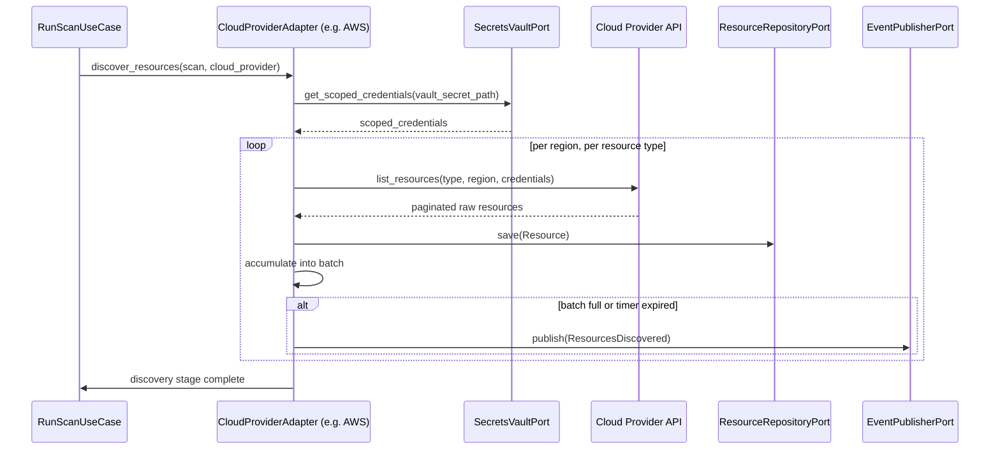
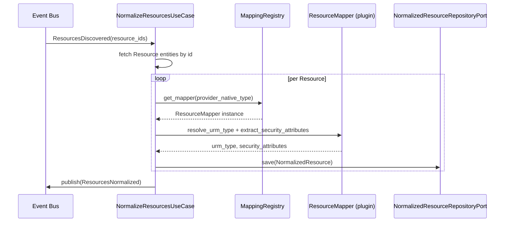
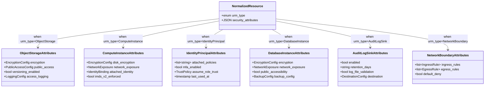

# ComplianceIQ — Software Architecture Specification (SAS)

## Part 4 — Discovery Engine, Normalization Engine, and the Universal Resource Model

**Document class:** Official Software Architecture Specification (SAS)
**Subsystem in scope:** Subsystem A — Cloud Compliance Intelligence Engine
**Continuity:** Builds on Part 1 (Requirements), Part 2 (Layers/Containers), and Part 3 (Domain Model — `Resource`, `NormalizedResource`, `CloudProvider`, `Scan` entities). This part fulfills FR-01, FR-02, FR-03, NFR-02, NFR-03, NFR-04.

---

### 1. Purpose of This Part

This part provides the first full module-level deep dive, covering modules 1, 2, and 3 from Part 1's module map: the **Discovery Engine**, the **Normalization Engine**, and the **Universal Resource Model (URM)**. Each module is treated with the rigor specified in the project's documentation plan: Responsibilities, Inputs, Outputs, Internal Algorithms, Interfaces, Interactions, Failure Scenarios, and Performance. In addition, since the URM is named as Core Innovation #1 in the project scope, it receives the expanded treatment reserved for Core Innovations: Motivation, Problem Solved, Architecture, Workflow, Advantages, Limitations, Extensibility, and Real Implementation Examples.

---

### 2. Discovery Engine (Module 1)

#### 2.1 Responsibilities

The Discovery Engine is the sole component permitted to communicate with external cloud provider APIs for the purpose of resource enumeration (Part 2, Container Diagram: `Discovery Service`). Its responsibilities are strictly bounded to:

1. Authenticating to a `CloudProvider` account using credentials retrieved exclusively through the `SecretsVaultPort` (never hardcoded, never logged).
2. Enumerating resources within the account's configured `regions_in_scope` (Part 3, Section 3.2) for the specific resource types in scope for this project (AWS IAM, S3, EC2, CloudTrail, RDS, per the project's stated module responsibilities), and, structurally, any resource type any registered plugin declares.
3. Persisting the raw, untouched API response as a `Resource` entity (Part 3, Section 3.3), preserving `raw_payload` byte-for-byte.
4. Publishing a `ResourcesDiscovered` event per completed batch, never per individual resource, to avoid overwhelming the Event Bus with excessive message volume (Performance, Section 2.7).
5. Respecting each provider's API rate limits via adaptive throttling, and tolerating partial failures without aborting the whole `Scan` (NFR-03).

The Discovery Engine explicitly does **not**: interpret, validate, or transform resource data (that is the Normalization Engine's job); decide which regions or resource types are "interesting" from a compliance standpoint (that is Policy Context's job, downstream); or retain any decrypted credential material beyond the lifetime of a single discovery call.

#### 2.2 Inputs

| Input | Source | Notes |
|---|---|---|
| `Scan` record (with `scan_type`, `tenant_id`) | `RunScanUseCase` (Application layer) | Determines FULL vs INCREMENTAL discovery mode. |
| `CloudProvider` record | Tenancy Context (Part 3, 3.2) | Supplies `account_identifier`, `regions_in_scope`, `vault_secret_path`. |
| Scoped credentials | `SecretsVaultPort` | Retrieved just-in-time per discovery call, never cached beyond the call's lifetime. |
| Active `Plugin` records of type `CLOUD_PROVIDER_ADAPTER` | `Plugin Manager` (module 15) | Determines which concrete adapter class handles this `provider_type`. |
| Previous `HistoricalSnapshot` (for INCREMENTAL scans only) | Persistence Layer | Used to compute which resources need re-checking versus can be skipped (Part 17, Performance). |

#### 2.3 Outputs

- One `Resource` entity per discovered cloud object, persisted via `ResourceRepositoryPort`.
- One `ResourcesDiscovered` domain event per batch (default batch size: 200 resources or 30 seconds, whichever comes first — a tunable operational parameter), containing the batch's `Resource` IDs and `scan_id`.
- Updated `Scan.stage_progress` reflecting discovery completion percentage.
- On any provider or region failure: a `ScanWarning` sub-event (not a hard failure) recording exactly which resource type/region failed and why, preserving NFR-03's partial-result tolerance.

#### 2.4 Internal Algorithm (Pseudocode)

```
FUNCTION discover_resources(scan: Scan, cloud_provider: CloudProvider) -> None:
    adapter = plugin_manager.get_adapter(cloud_provider.provider_type)
    credentials = secrets_vault_port.get_scoped_credentials(cloud_provider.vault_secret_path)

    resource_type_plan = adapter.get_supported_resource_types()  # e.g., IAM, S3, EC2, CloudTrail, RDS
    IF scan.scan_type == INCREMENTAL:
        resource_type_plan = prioritize_by_last_change_probability(resource_type_plan, scan.tenant_id)

    batch = []
    FOR region IN cloud_provider.regions_in_scope:
        FOR resource_type IN resource_type_plan:
            TRY:
                paginator = adapter.list_resources(resource_type, region, credentials)
                FOR page IN paginator:                       # respects provider pagination tokens
                    FOR raw_item IN page:
                        resource = Resource(
                            tenant_id = cloud_provider.tenant_id,
                            cloud_provider_id = cloud_provider.id,
                            scan_id = scan.id,
                            provider_native_type = raw_item.type,
                            provider_native_id = raw_item.id,
                            raw_payload = raw_item.raw_body,     # untouched, verbatim
                            discovered_at = now(),
                            region = region
                        )
                        resource_repository_port.save(resource)
                        batch.append(resource.id)

                        IF len(batch) >= BATCH_SIZE OR batch_timer_expired():
                            event_publisher_port.publish(ResourcesDiscovered(scan_id=scan.id, resource_ids=batch))
                            batch = []

                    apply_adaptive_throttle(adapter.get_rate_limit_state(region))

            CATCH ProviderRateLimitExceeded AS e:
                backoff_and_retry(e, max_retries=5, strategy=EXPONENTIAL_JITTER)

            CATCH ProviderApiError AS e:
                publish_scan_warning(scan.id, region, resource_type, e)
                CONTINUE   # do not abort the whole scan — NFR-03

    IF batch is not empty:
        event_publisher_port.publish(ResourcesDiscovered(scan_id=scan.id, resource_ids=batch))

    mark_discovery_stage_complete(scan.id, cloud_provider.id)
```

#### 2.5 Interfaces

- **Port consumed:** `ResourceDiscoveryPort` is the *abstract* interface the Application-layer `RunScanUseCase` calls; the pseudocode above lives inside the concrete adapter (`AwsResourceDiscoveryAdapter`, `AzureResourceDiscoveryAdapter`, etc.) that implements this port, per the Dependency Inversion pattern established in Part 2, Section 7.
- **Ports depended on:** `SecretsVaultPort`, `ResourceRepositoryPort`, `EventPublisherPort`.
- **Plugin contract:** Every concrete adapter must implement `list_resources(resource_type, region, credentials) -> Paginator[RawResourceItem]` and `get_supported_resource_types() -> list[str]` — this narrow, uniform contract is what allows Liskov Substitution (Part 1, Section 8.3) across all four target providers.

#### 2.6 Interactions



#### 2.7 Failure Scenarios

| Scenario | Handling |
|---|---|
| Provider API rate limit hit | Exponential backoff with jitter, up to 5 retries; if still failing, mark that resource-type/region pair as a `ScanWarning` and continue (NFR-03). |
| Provider API returns transient 5xx | Retried up to 3 times with short fixed delay before escalating to `ScanWarning`. |
| Credential retrieval fails (Vault unreachable) | Entire discovery for that `CloudProvider` is marked `FAILED`; other CloudProviders under the same Scan continue independently — failure isolation is per-CloudProvider, not per-Scan. |
| Pagination token expires mid-enumeration | Adapter restarts enumeration for that resource type/region from the beginning; idempotent `Resource` upsert (keyed on `provider_native_id` + `scan_id`) prevents duplication. |
| Malformed/unexpected API response shape | Logged as a structured error with the raw response attached (redacting any credential-like fields), resource skipped, discovery continues. |

#### 2.8 Performance

Discovery is the pipeline stage most exposed to external latency (cloud API round trips) and is therefore designed for maximum internal parallelism: region × resource-type pairs are discovered concurrently via `asyncio` task pools, bounded by a per-provider concurrency limit tuned to stay under each provider's documented rate limits. Incremental scans (NFR-02's 2-minute target) achieve their speed-up via `prioritize_by_last_change_probability`, which uses CloudTrail-derived change signals (for AWS) to skip resource types with no recent activity — detailed further in Part 17.

---

### 3. Normalization Engine (Module 2)

#### 3.1 Responsibilities

The Normalization Engine converts each `Resource` (raw, provider-specific) into exactly one `NormalizedResource` (canonical URM instance), applying a per-`provider_native_type` mapping function. It is responsible for:

1. Selecting the correct mapping function based on `Resource.provider_native_type`.
2. Extracting and re-shaping security-relevant fields into the canonical `security_attributes` schema (Section 4).
3. Normalizing tags/labels from provider-specific key-value conventions into the canonical `tags` map (Part 3, Section 3.4).
4. Stamping the output with `normalizer_version`, ensuring re-derivability (NFR-05, NFR-06).
5. Publishing `ResourcesNormalized` events per batch.

#### 3.2 Inputs

- `Resource` entities (consumed via `ResourcesDiscovered` event, then fetched by ID from `ResourceRepositoryPort`).
- The active `normalizer_version`'s mapping rule set — itself stored as versioned configuration (not hardcoded), so that mapping corrections can be deployed and audited like any other versioned artifact.

#### 3.3 Outputs

- `NormalizedResource` entities, persisted via a `NormalizedResourceRepositoryPort`.
- `ResourcesNormalized` domain events per batch.

#### 3.4 Internal Algorithm (Pseudocode)

```
FUNCTION normalize_resource(resource: Resource) -> NormalizedResource:
    mapper = mapping_registry.get_mapper(resource.provider_native_type)
    IF mapper is None:
        raise UnsupportedResourceTypeError(resource.provider_native_type)
        # deliberately fails loud rather than silently dropping — an unmapped
        # resource type is a compliance blind spot, not a warning-level event

    urm_type = mapper.resolve_urm_type(resource.raw_payload)
    security_attributes = mapper.extract_security_attributes(resource.raw_payload, urm_type)
    canonical_tags = normalize_tags(resource.raw_payload, resource.provider_native_type)

    normalized = NormalizedResource(
        tenant_id = resource.tenant_id,
        source_resource_id = resource.id,
        urm_type = urm_type,
        normalizer_version = mapper.version,
        security_attributes = security_attributes,
        tags = canonical_tags
    )
    normalized_repository_port.save(normalized)
    RETURN normalized


FUNCTION normalize_tags(raw_payload, provider_native_type) -> map[string, string]:
    IF provider_native_type starts with "AWS":
        RETURN dict(raw_payload.get("Tags", []))          # list-of-{Key,Value} -> map
    ELSE IF provider_native_type starts with "Microsoft.":
        RETURN raw_payload.get("tags", {})                  # already a flat map in Azure
    ELSE IF provider_native_type starts with "gcp.":
        RETURN raw_payload.get("labels", {})                # GCP calls them labels
    ELSE:
        RETURN {}
```

The `mapper.extract_security_attributes` function is where the bulk of per-provider engineering effort lives, and is specified per `urm_type` in Section 4.4 below.

#### 3.5 Interfaces

- **Port defined:** `NormalizedResourceRepositoryPort`, consumed by the Application-layer `NormalizeResourcesUseCase`.
- **Plugin contract:** Each provider plugin supplies a `ResourceMapper` implementation per supported `provider_native_type`, registered with the `mapping_registry` at Plugin Manager load time — this is the mechanism that satisfies FR-15 and NFR-04 for normalization specifically: adding Oracle Cloud support means adding new `ResourceMapper` plugins, never modifying `normalize_resource` itself.

#### 3.6 Interactions



#### 3.7 Failure Scenarios

| Scenario | Handling |
|---|---|
| `UnsupportedResourceTypeError` | Raised loudly, resource marked `normalization_failed` in `Scan.stage_progress`; does not block normalization of other resources in the batch (isolation per-resource, not per-batch). |
| Mapper produces a value violating the URM schema (e.g., wrong type for a field) | Caught by schema validation immediately after mapping; resource marked `normalization_failed` with the validation error attached, never silently coerced. |
| Partial raw_payload (provider returned incomplete data due to insufficient IAM permission on the discovery role) | Mapper produces a `NormalizedResource` with the missing fields explicitly marked `null` plus a `data_completeness_flag`, consumed later by the Confidence Engine (module 9, Part 5) rather than treated as a hard failure. |

#### 3.8 Performance

Normalization is CPU-bound (data transformation) rather than I/O-bound, so it scales via simple horizontal replica count rather than async I/O concurrency; it batches identically to Discovery (Section 2.8) to keep Event Bus message volume proportionate.

---

### 4. Universal Resource Model — Core Innovation #1 (Deep Dive)

#### 4.1 Motivation

Every CSPM tool must eventually answer the question "is this resource encrypted / publicly exposed / logged?" — but AWS, Azure, GCP, and OCI each answer that question through completely different API shapes, different default behaviors, and different terminology. Without a canonical model, every rule, every graph edge, and every risk calculation would need provider-specific branches, multiplying complexity by the number of supported providers and making FR-02 ("extensible to GCP and OCI without modifying core discovery logic") and NFR-04 unachievable in practice, even if achievable on paper.

#### 4.2 Problem Solved

The URM solves the "N×M problem": without it, supporting N cloud providers and M rule types would require N×M provider-specific rule implementations. With the URM as an intermediate canonical layer, the cost becomes N mapping implementations (Discovery/Normalization side) plus M rule implementations (Policy side), which is linear rather than multiplicative — this is the single most important scalability property of the entire engine's design, and it is why the URM is named as Core Innovation #1 rather than treated as a mere data format detail.

#### 4.3 Architecture

The URM is organized as a **typed taxonomy** (`urm_type` enum) plus a **per-type security attribute schema**, rather than one giant flat schema shared across all resource types — a flat schema would force every resource to carry irrelevant fields (e.g., a `ComputeInstance` does not need an `encryption.bucket_policy` field), violating Interface Segregation applied at the schema level.



#### 4.4 Attribute Taxonomy Across the Five Security Domains

The project's rule domains — IAM, encryption, network, storage, and logging — map onto the URM's per-type attribute schemas as follows:

| Security Domain | Canonical Sub-Schema | Present On `urm_type`(s) | Example Provider-Native Source Fields Normalized |
|---|---|---|---|
| IAM | `IdentityPrincipalAttributes`, `attached_identity` | IdentityPrincipal, ComputeInstance, DatabaseInstance | AWS IAM Role trust policy JSON; Azure Managed Identity assignment; GCP Service Account IAM bindings |
| Encryption | `EncryptionConfig` (embedded) | ObjectStorage, ComputeInstance, DatabaseInstance | AWS S3 `ServerSideEncryptionConfiguration`; Azure Storage `encryption.services`; GCP `encryption.defaultKmsKeyName` |
| Network | `NetworkExposure`, `NetworkBoundaryAttributes` | ComputeInstance, DatabaseInstance, NetworkBoundary | AWS Security Groups + Route Tables; Azure NSGs; GCP Firewall Rules |
| Storage | `ObjectStorageAttributes` | ObjectStorage | AWS S3 bucket policy + ACL; Azure Blob container public access level; GCP bucket IAM + uniform access |
| Logging | `AuditLogSinkAttributes` | AuditLogSink | AWS CloudTrail trail config; Azure Activity Log + Diagnostic Settings; GCP Cloud Audit Logs sink config |

#### 4.5 Workflow

1. Discovery Engine produces a raw `Resource` with `provider_native_type = "AWS::S3::Bucket"`.
2. Normalization Engine's `mapping_registry` resolves the AWS-specific `S3BucketMapper`.
3. `S3BucketMapper.resolve_urm_type()` returns `ObjectStorage`.
4. `S3BucketMapper.extract_security_attributes()` reads `raw_payload.ServerSideEncryptionConfiguration`, `raw_payload.PublicAccessBlockConfiguration`, `raw_payload.LoggingConfiguration`, and produces the canonical `ObjectStorageAttributes` shape.
5. The resulting `NormalizedResource` is now indistinguishable, from the Policy Engine's point of view, from an Azure Blob Storage container or a GCP Cloud Storage bucket normalized through the equivalent Azure/GCP mappers — a single rule `object-storage-encryption-enabled` evaluates identically against all three.

#### 4.6 Advantages

- Linear extensibility cost (Section 4.2) for new providers.
- Rules are written once, against canonical fields, and apply across every current and future provider automatically.
- Enables true cross-cloud comparative reporting (e.g., "which of my three clouds has the worst public storage exposure rate") without any per-cloud special-casing in reporting logic.

#### 4.7 Limitations

- **Lowest-common-denominator risk:** a provider-specific security feature with no equivalent elsewhere (e.g., a very AWS-specific IAM condition key) either needs a URM schema extension or is captured only in `raw_payload`, accessible to rules only via an explicit "raw field escape hatch" (a deliberately narrow, logged mechanism used sparingly).
- **Mapping engineering cost is front-loaded:** the first provider integration for a given `urm_type` is comparatively expensive; the model's linear-cost advantage only materializes from the second provider onward.
- **Schema evolution requires care:** adding a new canonical field to `ObjectStorageAttributes` requires a `normalizer_version` bump and, ideally, a backfill/re-normalization job so historical data stays comparable — this operational cost is deliberately made explicit rather than hidden.

#### 4.8 Extensibility

New `urm_type` values and new sub-schemas are added by extending the taxonomy and providing default "unmapped" behavior (all-null attributes with a `data_completeness_flag`) so that new resource categories degrade gracefully into low-confidence findings rather than hard failures, consistent with the Confidence Engine design (Part 5).

#### 4.9 Real Implementation Example

```yaml
# Example: normalized ObjectStorage instance derived from an AWS S3 bucket
urm_type: ObjectStorage
normalizer_version: "1.3.0"
security_attributes:
  encryption:
    at_rest_enabled: true
    key_management: "CUSTOMER_MANAGED"   # normalized from SSE-KMS w/ customer CMK
    algorithm: "AES256"
  public_access:
    block_public_acls: true
    block_public_policy: true
    bucket_policy_is_public: false
  versioning_enabled: true
  access_logging:
    enabled: true
    destination_bucket: "acme-corp-access-logs"
tags:
  environment: "production"
  data_classification: "confidential"
```

```yaml
# The same canonical shape, this time derived from an Azure Blob Storage container
urm_type: ObjectStorage
normalizer_version: "1.3.0"
security_attributes:
  encryption:
    at_rest_enabled: true
    key_management: "PLATFORM_MANAGED"   # Azure Storage Service Encryption, no CMK configured
    algorithm: "AES256"
  public_access:
    block_public_acls: true
    block_public_policy: true
    bucket_policy_is_public: false
  versioning_enabled: false
  access_logging:
    enabled: true
    destination_bucket: "acmecorp-diag-logs"
tags:
  environment: "production"
  data_classification: "confidential"
```

Both examples are consumed identically by rule `object-storage-encryption-enabled` and `object-storage-public-access-blocked` (Part 4's Policy Engine deep dive continues in Part 5) despite originating from entirely different provider APIs — this identity of downstream shape, despite divergent upstream origin, is the URM's core innovation made concrete.

---

### 5. Closing Note for Part 4

Part 4 has fully specified the Discovery Engine and Normalization Engine — Responsibilities, Inputs, Outputs, pseudocode, Interfaces, Interactions, Failure Scenarios, Performance — and has given the Universal Resource Model its full Core Innovation treatment: Motivation, Problem Solved, Architecture, Workflow, Advantages, Limitations, Extensibility, and worked examples across two providers.

Part 5, next, covers the **Knowledge Graph Engine**, the **Policy Intelligence Engine**, and the **Composite Rule Engine** — including the Security Knowledge Graph and Composite Rules Core Innovations, with full pseudocode for graph construction and rule/composite-rule evaluation.

---

*End of Part 4. Awaiting instruction: "Continue."*
