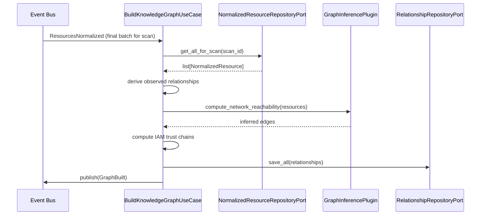
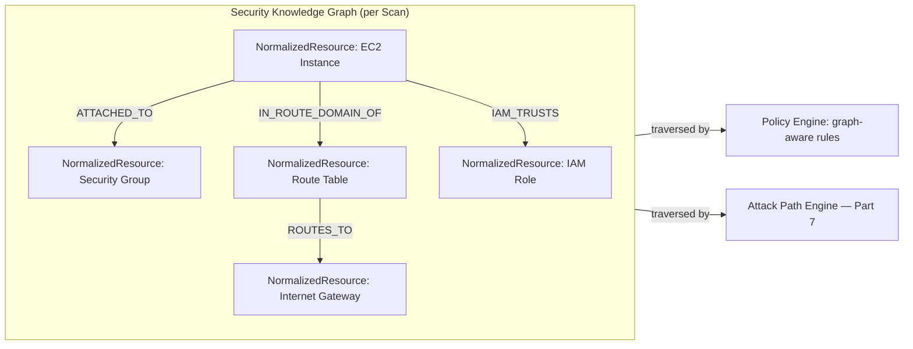
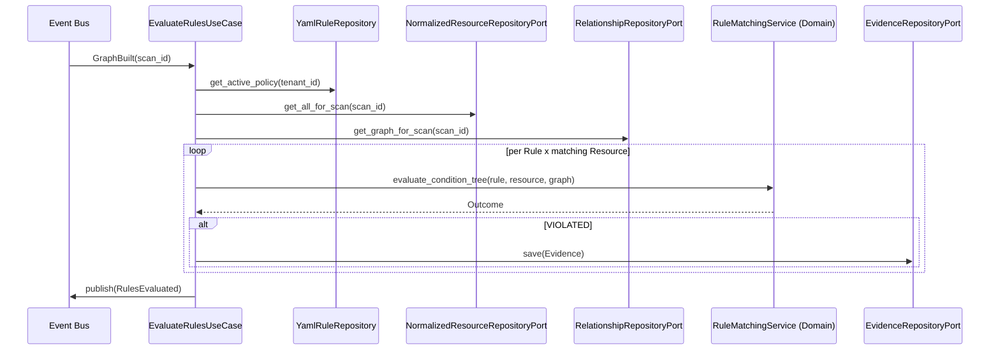
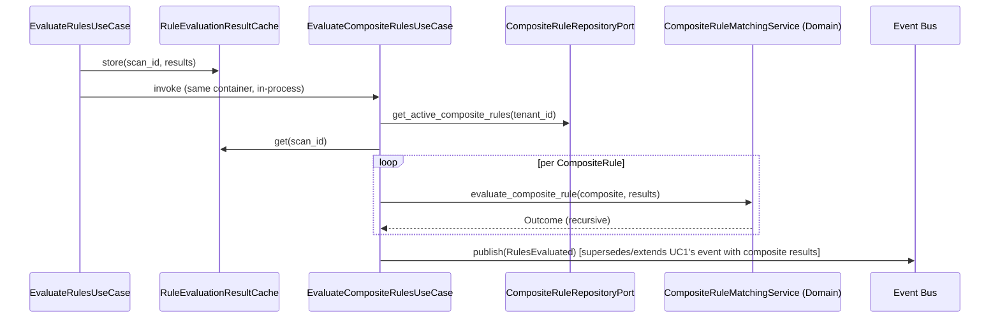

# ComplianceIQ — Software Architecture Specification (SAS)

## Part 5 — Knowledge Graph Engine, Policy Intelligence Engine, and Composite Rule Engine

**Document class:** Official Software Architecture Specification (SAS)
**Subsystem in scope:** Subsystem A — Cloud Compliance Intelligence Engine
**Continuity:** Builds on Part 3 (`Relationship`, `Rule`, `CompositeRule`, `Policy` entities) and Part 4 (Universal Resource Model as graph node input). Fulfills FR-04, FR-05, FR-06, NFR-11.

---

### 1. Purpose of This Part

This part covers modules 4, 5, and 6 from Part 1's module map — the **Knowledge Graph Engine**, the **Policy Intelligence Engine**, and the **Composite Rule Engine** — with full Responsibilities/Inputs/Outputs/Algorithms/Interfaces/Interactions/Failure/Performance treatment, plus the expanded Core Innovation treatment for **Security Knowledge Graph** and **Composite Rules** (Innovations #4 and #3 in the project's Core Innovations list; the **Context-Aware Rule Engine**, Innovation #2, is deferred to Part 6 alongside the Context Engine module, since it depends on context-enrichment concepts not yet introduced here).

---

### 2. Knowledge Graph Engine (Module 4)

#### 2.1 Responsibilities

The Knowledge Graph Engine consumes the full set of `NormalizedResource`s produced for a `Scan` and constructs the `Relationship` edges (Part 3, Section 3.5) between them, representing network reachability, IAM trust, data flow, and structural containment. It is responsible for:

1. Deriving **observed** relationships directly present in normalized data (e.g., a `ComputeInstance.attached_identity` pointing at an `IdentityPrincipal`).
2. Deriving **inferred** relationships that require multi-resource reasoning (e.g., "is this `ComputeInstance` reachable from the public internet" requires joining its attached Network Interface, the Security Group rules, the Subnet's route table, and the presence of an Internet Gateway — no single resource's data answers this alone).
3. Persisting the resulting graph as `Relationship` entities and making it queryable for the Policy Engine (context/graph-aware rules), the Attack Path Engine (Part 7), and ad hoc API queries.
4. Publishing a `GraphBuilt` event once construction for a `Scan` completes.

#### 2.2 Inputs

- All `NormalizedResource`s for the `Scan` (consumed via `ResourcesNormalized` events, accumulated until the Normalization stage completes for that scan — the Knowledge Graph Engine deliberately waits for full normalization completion rather than processing incrementally, because relationship inference frequently needs to see both endpoints of an edge before it can be derived).
- Provider-specific relationship-inference rules (e.g., "how do I compute network reachability from AWS Security Groups + NACLs + Route Tables" versus the Azure NSG equivalent) — these are themselves plugin-provided, following the same extensibility pattern as `ResourceMapper` (Part 4, Section 3.5), so that adding a new provider's graph-inference logic never touches core Knowledge Graph Engine code.

#### 2.3 Outputs

- `Relationship` entities, persisted via `RelationshipRepositoryPort` (backed, per Part 2's Package Diagram, by a `GraphStorePort` abstraction — implemented either as PostgreSQL adjacency tables for smaller tenants or a dedicated graph store such as Neo4j/Amazon Neptune for larger tenants, a choice deferred to deployment configuration, see Part 12).
- `GraphBuilt` domain event.

#### 2.4 Internal Algorithm (Pseudocode)

```
FUNCTION build_knowledge_graph(scan: Scan) -> None:
    resources = normalized_resource_repository_port.get_all_for_scan(scan.id)
    resources_by_id = index_by_id(resources)

    relationships = []

    # Phase 1: observed relationships (direct field references)
    FOR resource IN resources:
        FOR ref IN resource.security_attributes.get_direct_references():
            IF ref.target_id IN resources_by_id:
                relationships.append(Relationship(
                    source_resource_id = resource.id,
                    target_resource_id = ref.target_id,
                    relationship_type = ref.relationship_type,   # e.g. ATTACHED_TO, IAM_TRUSTS
                    derived_from_rule = null,                     # directly observed, not inferred
                    weight = 1.0,
                    scan_id = scan.id
                ))

    # Phase 2: inferred network reachability (provider-specific inference plugin)
    network_resources = filter_by_urm_type(resources, [ComputeInstance, DatabaseInstance, NetworkBoundary])
    FOR provider_group IN group_by_cloud_provider(network_resources):
        inference_plugin = plugin_manager.get_graph_inference_plugin(provider_group.provider_type)
        inferred_edges = inference_plugin.compute_network_reachability(provider_group.resources)
        FOR edge IN inferred_edges:
            relationships.append(Relationship(
                source_resource_id = edge.source,
                target_resource_id = edge.target,
                relationship_type = NETWORK_REACHABLE,
                derived_from_rule = inference_plugin.rule_name,
                weight = edge.reachability_confidence,
                scan_id = scan.id
            ))

    # Phase 3: IAM assume-role trust chains (cross-resource, potentially cross-account)
    identity_resources = filter_by_urm_type(resources, [IdentityPrincipal])
    trust_edges = compute_iam_trust_chains(identity_resources)
    relationships.extend(trust_edges)

    relationship_repository_port.save_all(relationships)
    event_publisher_port.publish(GraphBuilt(scan_id=scan.id, relationship_count=len(relationships)))
```

#### 2.5 Interfaces

- **Ports:** `RelationshipRepositoryPort` / `GraphStorePort`.
- **Plugin contract:** `GraphInferencePlugin.compute_network_reachability(resources) -> list[InferredEdge]` — provider-specific, registered per `provider_type`, exactly mirroring the `ResourceMapper` extensibility pattern from Part 4.

#### 2.6 Interactions



#### 2.7 Failure Scenarios

| Scenario | Handling |
|---|---|
| A referenced target resource does not exist in this scan's resource set (e.g., cross-account reference to an account not in scope) | Edge is recorded with `target_resource_id = null` and a `dangling_reference: true` flag, surfaced later as a potential finding itself ("policy references out-of-scope account") rather than silently dropped. |
| Graph inference plugin throws an exception for a specific provider group | That provider group's inferred edges are skipped, `ScanWarning` published, observed relationships (Phase 1) and other providers' Phase 2/3 results are unaffected. |
| Extremely large resource count causes inference algorithm timeout | Falls back to a bounded, sampled reachability approximation, flagged in `Scan.stage_progress` as `graph_construction: PARTIAL`, and a full recomputation is scheduled as a background job — this trade-off is discussed further in Part 17 (Performance). |

#### 2.8 Performance

Observed-relationship derivation (Phase 1) is linear in resource count and trivially parallelizable. Network reachability inference (Phase 2) is the most computationally expensive phase, as it can require path analysis across security group/NACL/route table graphs; it is bounded per provider-account group and parallelized across groups, since reachability within one cloud account is independent of another account's reachability.

---

### 3. Security Knowledge Graph — Core Innovation #4 (Deep Dive)

#### 3.1 Motivation

Individually-evaluated, single-resource rules (Part 4's Discovery/Normalization output feeding directly into flat rule checks) systematically miss an entire class of real-world compliance violations: those that arise only from the *combination* of multiple, individually-benign configurations. A private RDS instance is fine. A security group allowing broad ingress is a lower-severity finding on its own. But a private RDS instance reachable through a chain of an over-permissive security group, a misconfigured NACL, and a route table pointing at an Internet Gateway is a critical, internet-exploitable exposure — and no single-resource rule can express that.

#### 3.2 Problem Solved

The Security Knowledge Graph solves the "relationship blindness" problem inherent to flat, per-resource CSPM checks, by making resource relationships first-class, queryable data (the `Relationship` entity, Part 3, Section 3.5) rather than an implicit, unmodeled property of the cloud environment.

#### 3.3 Architecture



The graph is stored per-`Scan` (not as one continuously mutated global graph), which is a deliberate architectural choice: it keeps every graph traversal reproducible against a specific point-in-time snapshot (NFR-05), and it makes drift detection (Part 8) at the *graph* level, not only the resource level, tractable — an edge that existed last scan and is gone this scan is itself a meaningful drift signal (e.g., "the compensating network segmentation control that used to isolate this database has been removed").

#### 3.4 Workflow

Already specified in Section 2.4's pseudocode (Phases 1–3). The graph becomes queryable by two downstream consumers: graph-aware `Rule`s (e.g., a rule whose condition tree includes a graph traversal predicate, Section 4.4 below) and the Attack Path Engine (Part 7), which performs multi-hop traversal to find full exploitable chains rather than single edges.

#### 3.5 Advantages

- Surfaces compound risks invisible to single-resource scanning, materially reducing false negatives relative to flat CSPM tools.
- Provides the substrate for Attack Path discovery (FR-10) without a separate data model — the same graph serves both context-aware rule evaluation and attack path analysis.
- Per-scan graph snapshots make historical comparison ("has our network topology gotten more or less exposed over time") a natural query rather than a bolted-on feature.

#### 3.6 Limitations

- Inference quality depends entirely on the completeness of the discovery role's permissions (Part 4, Section 3.7's `data_completeness_flag` propagates into graph confidence); a discovery role missing `ec2:DescribeRouteTables` permission, for instance, silently degrades reachability inference quality unless explicitly monitored.
- Graph construction cost grows super-linearly with network resource count in the worst case (dense security group reference chains); mitigated via the bounded/sampled fallback (Section 2.7).
- Cross-account and cross-cloud relationships (e.g., an AWS Transit Gateway peering to an Azure VNet via a VPN) require explicit multi-cloud graph-inference plugins that are architecturally supported but not exhaustively implemented for every possible topology in this project's current scope.

#### 3.7 Extensibility

New relationship types are added by extending the `relationship_type` enum (Part 3, Section 3.5) and providing a corresponding inference plugin; this follows the identical Plugin Manager extensibility pattern already established for cloud providers (FR-15).

#### 3.8 Real Implementation Example

```yaml
# Excerpt of Relationship entities produced by the graph construction algorithm
- source_resource_id: "urm-ec2-0af3"
  target_resource_id: "urm-sg-19bd"
  relationship_type: ATTACHED_TO
  derived_from_rule: null
  weight: 1.0

- source_resource_id: "urm-sg-19bd"
  target_resource_id: "urm-igw-4471"
  relationship_type: NETWORK_REACHABLE
  derived_from_rule: "aws-network-reachability-v2"
  weight: 0.92   # high confidence: 0.0.0.0/0 ingress + direct IGW route

- source_resource_id: "urm-ec2-0af3"
  target_resource_id: "urm-role-77aa"
  relationship_type: IAM_TRUSTS
  derived_from_rule: null
  weight: 1.0
```

---

### 4. Policy Intelligence Engine (Module 5)

#### 4.1 Responsibilities

The Policy Intelligence Engine evaluates every active `Rule` (simple, single-resource-or-graph-predicate rules; composite rules are module 6, Section 5) against every `NormalizedResource` (and, where the rule declares graph predicates, the `Relationship` graph). It is responsible for:

1. Loading the tenant's active `Policy` set (built-in + tenant-custom) via `RuleRepositoryPort`.
2. For each `Rule`, filtering to only the `NormalizedResource`s whose `urm_type` matches `Rule.applies_to_urm_type`.
3. Evaluating `Rule.condition_tree` against each matching resource (and its 1-hop graph neighborhood, if the condition tree includes a graph predicate).
4. Producing a `RuleEvaluationResult` (violated / satisfied / not-applicable / indeterminate) per resource per rule, with an `Evidence` record for every violation.
5. Publishing `RulesEvaluated` once all active rules have been evaluated for the scan.

#### 4.2 Inputs

- `GraphBuilt` event (the Policy Engine deliberately starts only after the graph is available, since even "simple" rules may declare graph predicates — Section 4.4).
- Active `Policy`/`Rule` set for the tenant, via `RuleRepositoryPort` (implemented, per ADR-003, as `YamlRuleRepository`).
- `NormalizedResource`s and `Relationship`s for the scan.

#### 4.3 Outputs

- `RuleEvaluationResult` records (an intermediate, non-persisted-as-Entity data structure feeding the Context Engine, Part 6) — deliberately kept as a transient Application-layer DTO rather than a Domain Entity, since it is not yet enriched with context or scored, and therefore not yet audit-grade evidence in the sense `Finding` requires.
- `Evidence` entities for every violation (Part 3, Section 3.9), pre-linked to the triggering `Rule` but not yet linked to a `Finding` (that linkage happens at Finding Builder time, Part 8).
- `RulesEvaluated` domain event.

#### 4.4 Rule Condition Tree Grammar

```yaml
# Example simple rule: encryption.yaml excerpt style, matching Katty's actual rule authoring format
rule_key: "object-storage-encryption-enabled"
version: "1.2.0"
applies_to_urm_type: "ObjectStorage"
severity_default: "high"
framework_control_ids:
  - "iso27001-a.8.24"
  - "nist-800-53-sc-28"
  - "dnssi-crypto-02"
condition_tree:
  operator: "AND"
  predicates:
    - field: "security_attributes.encryption.at_rest_enabled"
      operator: "equals"
      value: true
    - field: "security_attributes.encryption.key_management"
      operator: "in"
      value: ["CUSTOMER_MANAGED", "PLATFORM_MANAGED"]

# Example graph-aware rule: violates if reachable from the internet AND not encrypted
rule_key: "database-public-and-unencrypted"
version: "1.0.0"
applies_to_urm_type: "DatabaseInstance"
severity_default: "critical"
condition_tree:
  operator: "AND"
  predicates:
    - field: "security_attributes.encryption.at_rest_enabled"
      operator: "equals"
      value: false
    - graph_predicate:
        relationship_type: "NETWORK_REACHABLE"
        target_urm_type: "NetworkBoundary"
        target_filter:
          field: "security_attributes.ingress_rules"
          operator: "contains_cidr"
          value: "0.0.0.0/0"
```

#### 4.5 Internal Algorithm (Pseudocode)

```
FUNCTION evaluate_rules(scan: Scan) -> None:
    active_policy = rule_repository_port.get_active_policy(scan.tenant_id)
    resources = normalized_resource_repository_port.get_all_for_scan(scan.id)
    graph = relationship_repository_port.get_graph_for_scan(scan.id)

    results = []
    FOR rule IN active_policy.rule_ids:
        matching_resources = filter(resources, r => r.urm_type == rule.applies_to_urm_type)
        FOR resource IN matching_resources:
            outcome = evaluate_condition_tree(rule.condition_tree, resource, graph)
            IF outcome == VIOLATED:
                evidence = build_evidence(rule, resource, outcome.matched_fields)
                evidence_repository_port.save(evidence)
            results.append(RuleEvaluationResult(rule=rule, resource=resource, outcome=outcome, evidence=evidence))

    rule_evaluation_result_cache.store(scan.id, results)   # transient, consumed by Composite Rule Engine next
    event_publisher_port.publish(RulesEvaluated(scan_id=scan.id, violation_count=count_violations(results)))


FUNCTION evaluate_condition_tree(node, resource, graph) -> Outcome:
    IF node.operator == "AND":
        RETURN all_satisfied([evaluate_condition_tree(p, resource, graph) FOR p IN node.predicates])
    IF node.operator == "OR":
        RETURN any_satisfied([evaluate_condition_tree(p, resource, graph) FOR p IN node.predicates])
    IF node has "graph_predicate":
        neighbors = graph.get_neighbors(resource.id, node.graph_predicate.relationship_type)
        matching_neighbors = filter(neighbors, n => matches_filter(n, node.graph_predicate.target_filter))
        RETURN SATISFIED if len(matching_neighbors) > 0 else NOT_SATISFIED
    ELSE:   # leaf field predicate
        actual_value = resolve_field_path(resource, node.field)
        IF actual_value is None:
            RETURN INDETERMINATE   # data completeness gap, not a violation — feeds Confidence Engine
        RETURN apply_operator(node.operator, actual_value, node.value)
```

#### 4.6 Interfaces

- **Port:** `RuleRepositoryPort` (concrete: `YamlRuleRepository`, per ADR-003).
- **Consumed by:** Application-layer `EvaluateRulesUseCase`, which orchestrates this module strictly after `GraphBuilt`.

#### 4.7 Interactions



#### 4.8 Failure Scenarios

| Scenario | Handling |
|---|---|
| `resolve_field_path` encounters a missing field | Returns `INDETERMINATE`, not `VIOLATED` or `SATISFIED` — an explicit third outcome that prevents the engine from ever reporting a false positive purely due to missing data; downstream Confidence Engine (Part 6) reduces confidence rather than the Policy Engine guessing. |
| Malformed YAML rule (fails JSON Schema validation at load time) | Rejected at `Policy` load time, never reaches evaluation; surfaced to the rule author via the Plugin Manager's validation feedback (Part 14). |
| Rule references a `framework_control_id` that does not exist | Rejected at load time with a clear validation error, preventing FR-11's mapping integrity from silently breaking. |

#### 4.9 Performance

Rule evaluation is embarrassingly parallel across the (rule × resource) cross product, bounded practically by filtering on `urm_type` first (most rules apply to a small fraction of total resources). Graph-predicate evaluation is bounded to 1-hop neighbor lookups at this stage — deeper multi-hop reasoning is deliberately deferred to the dedicated Attack Path Engine (Part 7) rather than embedded in per-rule evaluation, keeping this stage's complexity bounded and predictable.

---

### 5. Composite Rule Engine (Module 6)

#### 5.1 Responsibilities

The Composite Rule Engine evaluates `CompositeRule`s (Part 3, Section 3.8), whose satisfaction depends on combining the outcomes of multiple `Rule`s and/or multiple resource instances via `AND` / `OR` / `NOT` / `THRESHOLD` combinators, potentially nested recursively.

#### 5.2 Inputs

- `RuleEvaluationResult`s produced by the Policy Intelligence Engine (Section 4) for this scan.
- Active `CompositeRule` definitions.

#### 5.3 Outputs

- `CompositeRuleEvaluationResult`s (violated/satisfied), each with its own aggregated `Evidence` bundle (referencing every member rule's evidence that contributed to the composite outcome).

#### 5.4 Internal Algorithm (Pseudocode)

```
FUNCTION evaluate_composite_rule(composite: CompositeRule, results: list[RuleEvaluationResult], resource_scope) -> Outcome:
    member_outcomes = []
    FOR member_id IN composite.member_rule_ids:
        IF member_id is a Rule:
            outcome = lookup_outcome(results, member_id, resource_scope)
        ELSE:   # nested CompositeRule — recursive evaluation
            nested_composite = composite_rule_repository_port.get(member_id)
            outcome = evaluate_composite_rule(nested_composite, results, resource_scope)
        member_outcomes.append(outcome)

    SWITCH composite.combinator:
        CASE "AND":
            RETURN VIOLATED if all(o == VIOLATED for o in member_outcomes) else SATISFIED
        CASE "OR":
            RETURN VIOLATED if any(o == VIOLATED for o in member_outcomes) else SATISFIED
        CASE "NOT":
            assert len(member_outcomes) == 1
            RETURN SATISFIED if member_outcomes[0] == VIOLATED else VIOLATED
        CASE "THRESHOLD":
            violated_count = count(o == VIOLATED for o in member_outcomes)
            RETURN VIOLATED if violated_count >= composite.threshold_n else SATISFIED
```

The recursive structure (a `CompositeRule` may reference another `CompositeRule` as a member) is what gives FR-06 its full expressive power: real frameworks routinely define controls of the shape "encryption AND (logging OR compensating monitoring control) AND NOT (public access)," which requires exactly this kind of nested boolean composition, not a single flat AND/OR list.

#### 5.5 Interfaces

- **Port:** `CompositeRuleRepositoryPort`, consumed by `EvaluateCompositeRulesUseCase`.
- Depends on the transient `RuleEvaluationResult` cache populated by the Policy Intelligence Engine (Section 4) — this is an in-process/Application-layer data hand-off within the same `SVC4` container (Part 2, Component Diagram), not a separate Event Bus round trip, since both modules co-locate in the Policy Evaluation Service specifically to avoid this hand-off's latency cost.

#### 5.6 Interactions



#### 5.7 Failure Scenarios

| Scenario | Handling |
|---|---|
| Circular reference between nested CompositeRules (A references B, B references A) | Detected at `Policy` load time via a dependency-graph cycle check, rejected before evaluation ever begins — never discovered at runtime via stack overflow. |
| A member `Rule` was itself `INDETERMINATE` (missing data) rather than cleanly VIOLATED/SATISFIED | Propagates `INDETERMINATE` through `AND`/`OR` combination using three-valued logic (a composite cannot claim `SATISFIED` confidently if a contributing member's data was incomplete) — feeds directly into the Confidence Engine (Part 6). |

#### 5.8 Performance

Composite rule evaluation is proportional to the number of composite rules times their nesting depth (typically shallow, 2–3 levels in real framework mappings), operating entirely against the already-computed, in-memory `RuleEvaluationResult` cache — no additional resource/graph fetches are needed, making this stage inexpensive relative to Sections 2 and 4.

---

### 6. Composite Rules — Core Innovation #3 (Deep Dive)

#### 6.1 Motivation

Real compliance controls are frequently compound by nature. ISO 27001's Annex A control on cryptography, for instance, is not satisfied merely by "encryption is on" — it typically requires encryption *and* appropriate key management *and* the absence of compensating exceptions. Flat, single-condition rules cannot express this without either (a) becoming enormous single monolithic rules that are hard to author and maintain, or (b) being split into many separate findings that individually understate or overstate the real compliance posture.

#### 6.2 Problem Solved

Composite Rules let GRC analysts express compound conditions declaratively, reusing already-defined simple `Rule`s as building blocks, mirroring how a human auditor actually reasons about a control ("this is satisfied if encryption is on AND logging is on, OR if there's an approved compensating control tag present").

#### 6.3 Architecture

Already specified structurally in Part 3 (Section 3.8) and algorithmically in Section 5.4 above: a recursive tree of `AND`/`OR`/`NOT`/`THRESHOLD` nodes whose leaves are either simple `Rule` outcomes or nested `CompositeRule` outcomes.

#### 6.4 Workflow

Authoring workflow (relevant to Katty's actual rule-authoring practice on `encryption.yaml`): a GRC analyst first defines the atomic `Rule`s (e.g., `object-storage-encryption-enabled`, `object-storage-access-logging-enabled`), then defines a `CompositeRule` referencing both by `rule_key` with combinator `AND`, and finally maps the composite (not the individual atomic rules) to the specific framework control it jointly satisfies — this separation keeps atomic rules reusable across multiple composites while keeping framework mapping precise (Part 11, Compliance Mapping Engine).

#### 6.5 Advantages

- Reuse: the same atomic `Rule` can participate in many different `CompositeRule`s across different frameworks without duplication.
- Precision: framework mappings attach at the correct level of compound logic, avoiding both under- and over-claiming compliance.
- Auditability: the evidence bundle for a composite finding explicitly shows which member conditions held and which didn't, rather than presenting a single opaque pass/fail.

#### 6.6 Limitations

- Authoring compound logic correctly requires the GRC analyst to think in boolean-tree terms, which has a learning curve beyond writing flat rules — mitigated by a rule-authoring validation tool (Part 14) that renders the composite's logic tree visually for review before commit.
- Deep nesting, while supported, can become difficult for a human reviewer to reason about beyond 3–4 levels; the project's rule-authoring guidelines (referenced in the accompanying technical textbook) recommend a practical nesting depth limit even though the engine itself has no hard limit.

#### 6.7 Extensibility

New combinators beyond `AND`/`OR`/`NOT`/`THRESHOLD` (e.g., a hypothetical `WEIGHTED_THRESHOLD` combining member outcomes with different weights) can be added by extending the `combinator` enum and the corresponding `SWITCH` branch in Section 5.4 — a small, well-isolated extension point.

#### 6.8 Real Implementation Example

```yaml
# composite rule combining two atomic rules already defined in encryption.yaml
composite_rule_key: "object-storage-encryption-and-logging"
version: "1.0.0"
combinator: "AND"
scope: "SINGLE_RESOURCE"
member_rule_keys:
  - "object-storage-encryption-enabled"
  - "object-storage-access-logging-enabled"
severity_default: "high"
framework_control_ids:
  - "iso27001-a.8.24"
  - "iso27001-a.8.15"
  - "nist-800-53-au-2"
  - "dnssi-crypto-02"
  - "dnssi-log-01"
```

---

### 7. Closing Note for Part 5

Part 5 has fully specified the Knowledge Graph Engine, the Policy Intelligence Engine, and the Composite Rule Engine, plus the Core Innovation treatments for the Security Knowledge Graph and Composite Rules. Together with Part 4, the pipeline is now specified from raw cloud API through to composite rule evaluation outcomes with evidence.

Part 6, next, covers the **Context Engine** (module 7) and its associated Core Innovation, the **Context-Aware Rule Engine** (Innovation #2) — how organizational context (tags, environment, data classification, business criticality) adjusts raw rule outcomes before they proceed to risk scoring.

---

*End of Part 5. Awaiting instruction: "Continue."*
