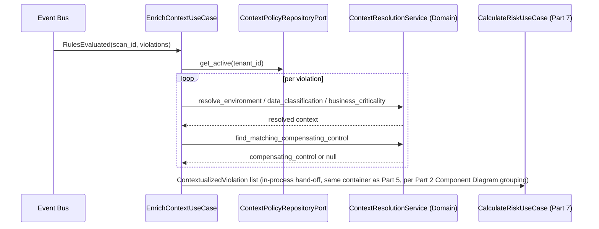
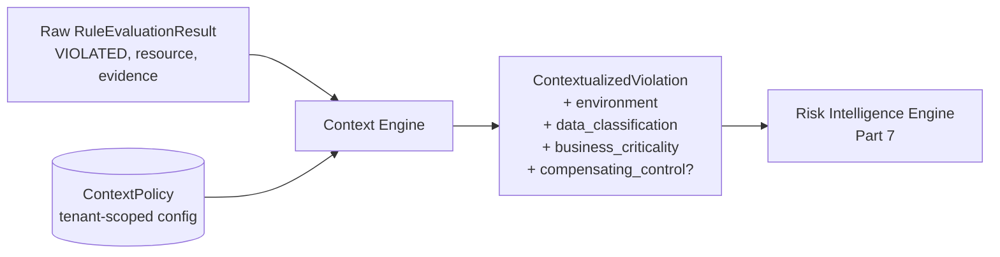

# ComplianceIQ — Software Architecture Specification (SAS)

## Part 6 — Context Engine and the Context-Aware Rule Engine

**Document class:** Official Software Architecture Specification (SAS)
**Subsystem in scope:** Subsystem A — Cloud Compliance Intelligence Engine
**Continuity:** Builds on Part 3 (`NormalizedResource.tags`, `Tenant`), Part 4 (URM), and Part 5 (`RuleEvaluationResult`, `CompositeRuleEvaluationResult`). Fulfills FR-07, and directly informs FR-08/FR-09 (Parts 7).

---

### 1. Purpose of This Part

This part covers module 7 from Part 1's module map — the **Context Engine** — with full Responsibilities/Inputs/Outputs/Algorithms/Interfaces/Interactions/Failure/Performance treatment, and gives the **Context-Aware Rule Engine** its full Core Innovation treatment (Innovation #2 in the project's Core Innovations list): Motivation, Problem Solved, Architecture, Workflow, Advantages, Limitations, Extensibility, and Real Implementation Examples.

---

### 2. Why Context Matters: The Core Problem This Module Solves

Section 4.5 of Part 5 already demonstrated that the Policy Intelligence Engine's raw outcome for a rule is a clean three-valued result: `VIOLATED`, `SATISFIED`, or `INDETERMINATE`. That outcome, however, is computed purely from the resource's own technical configuration and its immediate graph neighborhood — it has no notion of *why* that configuration matters to this specific organization. Two identical raw violations — an unencrypted S3 bucket in a `dev/sandbox` account with only synthetic test data, versus an unencrypted S3 bucket in `production` tagged `data_classification: confidential` — are the same technical fact but represent wildly different real risk. A CSPM engine that reports both with equal severity either desensitizes security teams to real risk (alert fatigue from the first case) or, worse, buries the second case's urgency under the noise of the first. The Context Engine exists specifically to close this gap between "technically true" and "organizationally significant," which is precisely FR-07's stated requirement.

---

### 3. Context Engine (Module 7)

#### 3.1 Responsibilities

1. Consuming every `VIOLATED` `RuleEvaluationResult` and `CompositeRuleEvaluationResult` produced in Part 5.
2. Retrieving the organizational context applicable to each involved resource: `NormalizedResource.tags` (environment, data classification, owner, cost-center), tenant-level context policies (e.g., "any resource tagged `environment: production` is automatically `business_criticality: high` unless overridden"), and any tenant-defined compensating-control declarations.
3. Producing a `ContextualizedViolation` — the raw violation plus a resolved context bundle — that becomes the direct input to the Risk Intelligence Engine (Part 7).
4. Applying **context-based suppression** only where the tenant has explicitly declared an approved compensating control (never silently suppressing based on inferred context alone — an important safety property elaborated in Section 4.6).

#### 3.2 Inputs

- `RuleEvaluationResult`/`CompositeRuleEvaluationResult` sets (Part 5) for `VIOLATED` outcomes only — `SATISFIED` outcomes do not need context enrichment, since they are not going to become Findings; this is a deliberate performance optimization (Section 3.9).
- `NormalizedResource.tags` for every involved resource.
- Tenant-level `ContextPolicy` configuration (a new, tenant-scoped configuration object, distinct from `Rule`/`CompositeRule`, specified in Section 3.4 below) defining tag-inference rules and any declared compensating controls.

#### 3.3 Outputs

- `ContextualizedViolation` records (transient Application-layer DTOs, analogous to `RuleEvaluationResult`), each carrying:
  - The original violation (rule/composite rule + resource + evidence).
  - Resolved `environment` classification (`production`, `staging`, `development`, `sandbox`).
  - Resolved `data_classification` (`public`, `internal`, `confidential`, `restricted`).
  - Resolved `business_criticality` (`low`, `medium`, `high`, `critical`).
  - Any matched compensating control declaration, if present.
- No new persisted Entity is introduced by this module — context resolution enriches the transient pipeline data that ultimately becomes part of a `Finding`'s `RiskScore.factors` (Part 3, Section 3.10), rather than being stored as its own audit artifact, since the underlying `NormalizedResource.tags` (already persisted and versioned per scan) constitute the auditable source of truth for *why* a given context was resolved.

#### 3.4 The `ContextPolicy` Configuration Object

```yaml
# Tenant-level context policy — configures how raw tags resolve into context dimensions
context_policy_version: "1.0.0"
tenant_id: "acme-corp"

environment_inference:
  - match_tag: {key: "environment", value: "prod"}
    resolves_to: "production"
  - match_tag: {key: "environment", value: "production"}
    resolves_to: "production"
  - match_tag: {key: "env", value: "dev"}
    resolves_to: "development"
  - default: "development"    # fail-safe: unlabeled resources are NEVER assumed production-safe;
                                # they are treated as the LOWEST-risk-tolerance default only for
                                # environment classification, while data_classification defaults
                                # conservatively HIGH (see below) — asymmetric defaults are deliberate

data_classification_inference:
  - match_tag: {key: "data_classification", value: "confidential"}
    resolves_to: "confidential"
  - match_tag: {key: "data_classification", value: "public"}
    resolves_to: "public"
  - default: "confidential"   # fail-safe: unlabeled resources are assumed confidential until
                                # proven otherwise — the conservative direction for this dimension

business_criticality_rules:
  - if: {environment: "production", data_classification: "confidential"}
    then: "critical"
  - if: {environment: "production"}
    then: "high"
  - if: {environment: "development"}
    then: "low"

compensating_controls:
  - applies_to_rule_key: "object-storage-encryption-enabled"
    match_tag: {key: "compensating_control", value: "approved-external-encryption-proxy"}
    approved_by: "ciso@acme-corp.example"
    approved_until: "2027-01-01"
    justification: "Data is encrypted client-side by an approved external gateway before storage; bucket-native encryption is redundant but the control objective is still met."
```

Note the asymmetric fail-safe defaults: `environment_inference` defaults to the *least* alarming classification for missing environment tags (since inflating every untagged resource to "production" would cause massive over-alerting on legitimately low-risk sandbox resources that are simply undertagged), while `data_classification_inference` defaults to the *most* conservative classification for missing data-classification tags (since silently assuming untagged data is safe to leak is the failure mode with real security consequences). This asymmetry is a deliberate, documented design decision, not an oversight — it will be referenced again in Part 7 when the Risk Intelligence Engine explains how it weights context-derived business criticality.

#### 3.5 Internal Algorithm (Pseudocode)

```
FUNCTION contextualize_violations(scan: Scan, violations: list[Violation]) -> list[ContextualizedViolation]:
    context_policy = context_policy_repository_port.get_active(scan.tenant_id)
    contextualized = []

    FOR violation IN violations:
        resource = violation.resource
        environment = resolve_environment(resource.tags, context_policy.environment_inference)
        data_classification = resolve_data_classification(resource.tags, context_policy.data_classification_inference)
        business_criticality = resolve_business_criticality(
            environment, data_classification, context_policy.business_criticality_rules
        )

        compensating_control = find_matching_compensating_control(
            violation.rule_key, resource.tags, context_policy.compensating_controls
        )

        IF compensating_control is not None AND compensating_control.approved_until > now():
            violation.status_override = "SUPPRESSED_WITH_COMPENSATING_CONTROL"
            # NOTE: never silently dropped — an explicit, evidenced suppression is itself
            # recorded and later surfaced in the Finding as status=suppressed, never as
            # simply absent from output (Section 4.6 elaborates the safety rationale)

        contextualized.append(ContextualizedViolation(
            violation = violation,
            environment = environment,
            data_classification = data_classification,
            business_criticality = business_criticality,
            compensating_control = compensating_control
        ))

    RETURN contextualized


FUNCTION resolve_environment(tags, inference_rules) -> string:
    FOR rule IN inference_rules:
        IF rule has "match_tag" AND tags.get(rule.match_tag.key) == rule.match_tag.value:
            RETURN rule.resolves_to
    RETURN default_from(inference_rules)


FUNCTION resolve_business_criticality(environment, data_classification, rules) -> string:
    FOR rule IN rules:                        # first match wins; rules ordered most-specific-first
        IF rule.if.environment == environment AND (rule.if.data_classification is unset OR rule.if.data_classification == data_classification):
            RETURN rule.then
    RETURN "medium"   # conservative mid-point default if no rule matches
```

#### 3.6 Interfaces

- **Port:** `ContextPolicyRepositoryPort`, implemented as a versioned YAML/database-backed store analogous to `YamlRuleRepository` (ADR-003's Policy-as-Code approach extends naturally to context policies).
- **Consumed by:** Application-layer `EnrichContextUseCase`, invoked immediately after `RulesEvaluated` (which, per Part 5, already encompasses both simple and composite rule outcomes by the time this stage begins).

#### 3.7 Interactions



Note that, per Part 2's Component Diagram (`SVC4: Policy Evaluation Service`), the Context Engine co-locates with the Policy and Composite Rule Engines in the same deployable service, so this hand-off is in-process, not a separate Event Bus round trip — the same locality rationale already applied between the Policy Engine and Composite Rule Engine in Part 5, Section 5.5.

#### 3.8 Failure Scenarios

| Scenario | Handling |
|---|---|
| `ContextPolicy` has no matching rule for a given tag combination | Falls through to documented conservative defaults (Section 3.4/3.5) — never an unhandled exception. |
| A compensating control's `approved_until` date has passed | Treated as if no compensating control exists; the violation proceeds unsuppressed, and a separate `ExpiredCompensatingControl` warning finding is generated to prompt the GRC analyst to renew or remove the stale declaration — this prevents a once-valid, now-stale approval from silently and indefinitely suppressing a real finding. |
| Resource has conflicting tags (e.g., both `environment: prod` and `environment: dev` from two different tagging conventions) | First-match-wins per `context_policy`'s rule ordering, with the conflict itself logged as a `DataQualityWarning`, since inconsistent tagging is itself a governance gap worth surfacing to the tenant, distinct from the resource's compliance finding. |

#### 3.9 Performance

By operating only on `VIOLATED` outcomes (Section 3.2), the Context Engine's workload is proportional to the violation count, not the total resource count — typically a small fraction of total scanned resources in a reasonably well-configured estate, keeping this stage's cost low relative to Parts 4 and 5.

---

### 4. Context-Aware Rule Engine — Core Innovation #2 (Deep Dive)

#### 4.1 Motivation

Traditional CSPM rule engines are context-blind by construction: a rule is a static predicate over a resource's technical fields, full stop. This works adequately for universally-applicable technical best practices (e.g., "root account MFA must be enabled" is true regardless of context) but fails for the large class of controls whose correct interpretation genuinely depends on organizational context — control criticality that scales with data sensitivity, environment-specific risk tolerance, or organization-approved compensating controls that satisfy a control's *objective* without satisfying its literal technical condition.

#### 4.2 Problem Solved

The Context-Aware Rule Engine (realized as the combination of the Context Engine module described in Section 3 plus the way its output feeds the Risk Intelligence Engine in Part 7) solves the calibration problem: it allows the same underlying `Rule`/`CompositeRule` logic to produce differently-weighted, and in narrowly-scoped, evidenced cases, appropriately suppressed outcomes depending on the organizational context of the resource it evaluates — without requiring a proliferation of near-duplicate rules per environment or per data classification.

#### 4.3 Architecture



The architectural insight is that context resolution is deliberately kept as a **separate, explicit pipeline stage** (module 7) rather than folded into the `Rule.condition_tree` itself (Part 5, Section 4.4). This separation exists because conflating rule logic with organizational context would force every GRC analyst authoring a technical rule to also encode organizational risk-tolerance policy inside that same rule — coupling two concerns (technical correctness and organizational calibration) that evolve on entirely different cadences and are typically owned by different roles (security engineers author rules; CISOs/GRC leads own risk-tolerance policy). Keeping them as separate, independently versioned artifacts (`Rule`/`CompositeRule` versus `ContextPolicy`) is a direct application of Single Responsibility (Part 1, Section 8.3) at the policy-authoring level, not merely the code level.

#### 4.4 Workflow

Already specified fully in Section 3.5's pseudocode: raw violation → environment/data-classification/business-criticality resolution → compensating control lookup → `ContextualizedViolation` emitted to the Risk Intelligence Engine.

#### 4.5 Advantages

- One technical `Rule` serves every environment and every data classification without duplication; only the `ContextPolicy` (a single tenant-level artifact) needs adjustment to recalibrate organization-wide risk tolerance.
- Compensating controls are handled as first-class, evidenced, time-bounded, auditable declarations rather than ad hoc manual finding dismissals lost to institutional memory.
- Because context resolution and rule evaluation are separately versioned (`ContextPolicy` has its own `context_policy_version`, distinct from `Rule.version`), a `Finding`'s eventual `RiskScore.factors` can reference exactly which context policy version influenced its business-criticality weighting (Part 7), preserving NFR-06 all the way through this stage.

#### 4.6 Limitations and Safety Rationale for the Suppression Design

Context-based suppression is intentionally narrow: it only ever fires when a tenant has explicitly declared, in advance, a specific compensating control for a specific rule, with an explicit approver and expiry date (Section 3.4). The engine never infers "this is probably fine given the context" and suppresses on that inference alone — inferred context (environment, data classification, business criticality) is only ever used to *weight severity upward or downward* in the Risk Intelligence Engine (Part 7), never to make a violation disappear outright. This is a deliberate, conservative design boundary: an engine that silently downgrades findings to invisible based on inferred (as opposed to explicitly declared and human-approved) context would be trivially exploitable by simply mis-tagging resources to escape detection, and would undermine exactly the auditability guarantee (NFR-06) this entire SAS is built around.

#### 4.7 Extensibility

New context dimensions beyond environment/data-classification/business-criticality (e.g., a future `regulatory_jurisdiction` dimension relevant to DNSSI-specific data residency rules) are added by extending the `ContextPolicy` schema and the `ContextualizedViolation` shape, without touching `Rule`/`CompositeRule` definitions at all — the separation established in Section 4.3 is precisely what makes this extension low-cost.

#### 4.8 Real Implementation Example

Continuing the worked example from Part 5 (Section 6.8's `object-storage-encryption-and-logging` composite rule), consider two S3 buckets that both violate it:

```yaml
# Bucket A — production, confidential, no compensating control
resource_tags: {environment: "prod", data_classification: "confidential"}
resolved_context:
  environment: "production"
  data_classification: "confidential"
  business_criticality: "critical"     # matches business_criticality_rules[0]
  compensating_control: null
# --> proceeds to Risk Intelligence Engine as a full-weight, unsuppressed violation

# Bucket B — production, but with an approved compensating control
resource_tags:
  environment: "prod"
  data_classification: "confidential"
  compensating_control: "approved-external-encryption-proxy"
resolved_context:
  environment: "production"
  data_classification: "confidential"
  business_criticality: "critical"
  compensating_control:
    approved_by: "ciso@acme-corp.example"
    approved_until: "2027-01-01"
    justification: "Data is encrypted client-side by an approved external gateway before storage."
# --> status_override = SUPPRESSED_WITH_COMPENSATING_CONTROL
#     still recorded as a Finding with status=suppressed, never silently dropped,
#     and still visible to the GRC analyst and to the annual compensating-control review process
```

---

### 5. Closing Note for Part 6

Part 6 has fully specified the Context Engine and the Context-Aware Rule Engine Core Innovation, completing the trilogy of Core Innovations #2 (Context-Aware Rule Engine), #3 (Composite Rules, Part 5), and #4 (Security Knowledge Graph, Part 5). Every `ContextualizedViolation` produced here is now ready for quantitative scoring.

Part 7, next, covers the **Risk Intelligence Engine** (module 8) and the **Confidence Engine** (module 9) — including Core Innovations #5 (Confidence Engine) and #6 (Multi-Factor Risk Engine) — with the full, documented, re-derivable Risk Score and Confidence Score formulas referenced throughout Parts 3 through 6.

---

*End of Part 6. Awaiting instruction: "Continue."*
