# ComplianceIQ — Security Architecture Layer Specification (SALS)

**Document class:** Enterprise Security Architecture Overlay
**Audience:** Software architects, backend/DevSecOps engineers, security auditors, thesis committee reviewers
**Companion document:** ComplianceIQ Security Architecture & Data Protection Specification (SADPS)
**Scope:** This document does **not** redesign ComplianceIQ. The five existing functional layers — Cloud Sources, Connectors & Normalization, Scan & Scoring Engine, Compliance Copilot (RAG), Dashboard — remain exactly as specified. Every section below answers one question only: **where does a security control attach to this existing architecture, and why there specifically.**

> **Reading guide:** Sections 1–12 are cross-cutting security layers (IAM, API, Secrets, Network, etc.) that wrap the whole platform. Section 13 revisits each *existing* engine individually and states its threats/controls without altering its function. Section 14 produces the combined diagram: functional layers untouched, security layers added around and beneath them.

---

## Table of Contents

1. Identity & Access Management
2. API Security
3. Secrets Management
4. Cloud Connector Security
5. Internal Service Security
6. Database Security
7. RAG / Compliance Copilot Security
8. Logging & Audit
9. Monitoring
10. Container Security
11. DevSecOps (Secure CI/CD)
12. Network Security
13. Security Per Engine
14. Updated Architecture (Functional + Security Layers)

---

## 0. Placement Principle

Every section below follows the same rule: **security controls are added as a wrapper, never as a modification of the functional data path.** Concretely, this means: no existing engine's inputs/outputs change shape; the JWT that authenticates a Dashboard request is validated *before* the request reaches the Scan & Scoring Engine, not woven into it; the Vault lease that Discovery Connectors use to reach AWS/Azure/GCP is issued *outside* the Connector's own logic, not implemented inside it. This is what allows "keep the functional architecture exactly as it is" and "add a professional security layer" to both be true simultaneously.

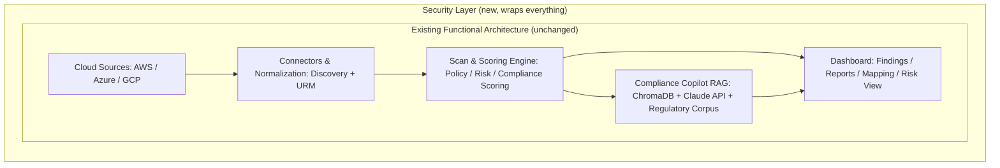

---

## 1. Identity & Access Management

### 1.1 Where It Sits

IAM is the **outermost gate** in front of the Dashboard and every API surface. No functional engine performs its own authentication — they all trust a single identity assertion (the JWT) validated once, at the edge, by shared middleware.

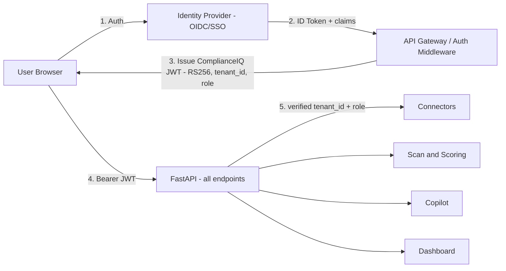

### 1.2 Components

- **Identity Provider:** OpenID Connect-compliant (Okta/Azure AD/Auth0-class), supporting enterprise **SSO** so tenants can federate their own corporate identity rather than provisioning ComplianceIQ-local accounts — the standard enterprise-buyer expectation for a GRC tool.
- **OAuth2 + OIDC:** Authorization Code + PKCE flow; ComplianceIQ never sees the user's IdP password, only the resulting ID token and claims.
- **JWT (internal, RS256):** issued by ComplianceIQ after IdP validation, 15-minute TTL, carries `sub`, `tenant_id`, `role`, `jti`. This is the *only* credential every downstream layer (API, Copilot, Dashboard) trusts.
- **Refresh tokens:** opaque, hashed at rest, rotation-with-reuse-detection (a stolen/replayed refresh token revokes its entire token family).
- **MFA:** TOTP at launch, mandatory for Admin/Security-Engineer roles; WebAuthn/FIDO2 on the roadmap.
- **RBAC (now):** GRC Analyst / Security Engineer / Platform Engineer / Admin — enforced centrally via one shared dependency, never per-endpoint logic.
- **ABAC (roadmap):** attribute-scoped access once environment/asset ownership tagging matures (e.g., "Security Engineer may approve exceptions only for environments they own").
- **Least privilege:** applied identically to human roles, service accounts, and — critically for this platform — the read-only cloud IAM roles Discovery Connectors request from customers (Section 4).
- **Multi-tenant isolation:** `tenant_id` is a JWT claim, never a client-supplied parameter; it is the value every downstream query filter and Row-Level Security policy is keyed on (Section 6).

### 1.3 Authentication Sequence

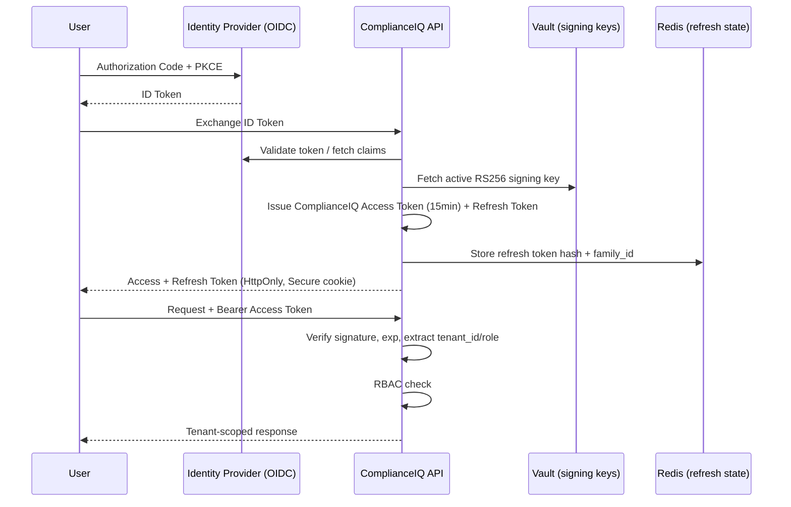

---

## 2. API Security

### 2.1 Where It Sits

Directly in front of the FastAPI application, as a chain: **WAF → API Gateway → Reverse Proxy → FastAPI middleware stack**, before any request reaches a route handler for Connectors, Scoring, Copilot, or Dashboard endpoints.

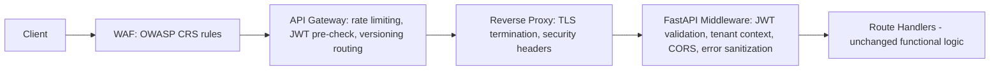

### 2.2 Controls

| Control | Layer | Detail |
|---|---|---|
| WAF | Edge | OWASP Core Rule Set + custom rules for known CSPM-specific abuse patterns (e.g., scan-trigger flooding) |
| API Gateway rate limiting | Edge | Per-IP and per-tenant limits; stricter limits on scan-triggering and Copilot query endpoints (higher cost per call) |
| JWT validation | Middleware | RS256 signature, expiry, `tenant_id`/`role` claim extraction — done once, shared by every downstream route |
| Input validation | Route boundary | Pydantic v2 DTOs, explicit field sets — no mass assignment (a client cannot set `risk_score` on a Finding-create call, because that field is never in the writable DTO) |
| Output validation | Route boundary | Response models strip any field not intended for the requester's role (e.g., raw cloud credential references never serialize into any response, ever) |
| Security headers | Reverse proxy | HSTS, CSP, X-Content-Type-Options, X-Frame-Options, Referrer-Policy — applied globally, not per-route |
| CORS | Middleware | Explicit per-environment origin allow-list; no wildcard, ever |
| CSRF | Middleware + client | `SameSite=Strict` cookies + required `Authorization` header for state-changing calls |
| API versioning | Gateway/routing | `/v1/...` path versioning; deprecated versions sunset on a published timeline, never silently removed (supports the API-inventory-management control) |

---

## 3. Secrets Management

### 3.1 Where It Sits

Vault sits **beside** every component that needs a secret, never **inside** one. No engine (Discovery, Copilot, Scoring) embeds a credential — each resolves a reference at the moment of use.

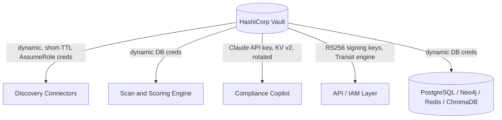

### 3.2 Secret Categories and Handling

| Secret | Engine Used | Lifecycle |
|---|---|---|
| Cloud discovery credentials (AWS AssumeRole session, Azure Managed Identity token, GCP Workload Identity token) | Dynamic secrets / STS-equivalent | Leased only for the duration of an active scan (Section 4); auto-expire otherwise |
| Database credentials (Postgres, Neo4j, Redis) | Dynamic database secrets engine | Rotated automatically, no application redeploy required |
| JWT signing keys | Transit engine | Scheduled rotation + on-demand on suspected compromise; old `kid` retained read-only until all outstanding tokens expire |
| **Claude API key** | KV v2, strict ACL, service-identity-scoped to the Copilot component only | Rotated per Anthropic's supported cadence; never embedded in the Copilot's prompt-construction code, resolved only at the moment of the outbound API call |
| ChromaDB access credentials | KV v2 / dynamic where supported | Same rotation discipline as the other data stores (Section 6) |

**Explicit rule for the Copilot specifically:** the Claude API key is the one secret in this platform that, if leaked, has a *cost* blast radius (unauthorized API usage) in addition to a confidentiality blast radius — it is therefore additionally protected by a **per-tenant/per-key usage quota** enforced at the application layer, so a leaked key's damage is bounded even before Vault-side revocation completes.

### 3.3 How Discovery Connectors Retrieve Cloud Credentials Securely

This is the single most security-critical secret flow on the platform, detailed in full in Section 4.

---

## 4. Cloud Connector Security

### 4.1 Principle

ComplianceIQ **never stores a customer's long-lived cloud credential.** Every connector — AWS, Azure, GCP — is designed around the provider's native temporary-credential mechanism, brokered through Vault, and scoped to read-only, security-relevant permissions only.

```mermaid
sequenceDiagram
    participant Vault
    participant Conn as Discovery Connector
    participant Cust as Customer Cloud (AWS/Azure/GCP)

    Note over Conn,Cust: AWS example
    Conn->>Vault: Request lease for tenant's AWS role
    Vault->>Cust: sts:AssumeRole (cross-account trust policy, external ID)
    Cust-->>Vault: Temporary STS credentials (15-60 min)
    Vault-->>Conn: Deliver short-TTL credentials
    Conn->>Cust: Read-only discovery API calls (TLS)
    Cust-->>Conn: Resource metadata
    Note over Conn: Credentials discarded from memory at scan end; never persisted
```

### 4.2 Per-Provider Mechanism

| Provider | Mechanism | Minimum Permissions | Notes |
|---|---|---|---|
| **AWS** | Cross-account `AssumeRole` with a customer-configured trust policy + **External ID** (mitigates the confused-deputy problem) | A dedicated IAM role granting only `Describe*`/`List*`/`Get*`-class read actions across the security-relevant services (IAM, VPC, S3, RDS, CloudTrail, KMS, EC2 Security Groups) — no `iam:PassRole`, no write/delete on any service | Session duration capped at the minimum viable for a scan cycle; ComplianceIQ never requests broader "ReadOnlyAccess" managed policies when a narrower custom policy suffices |
| **Azure** | **Managed Identity** (where ComplianceIQ infra runs in the customer's tenant boundary via a deployed connector) or **Service Principal** with a scoped custom role assignment | Custom RBAC role limited to `Microsoft.*/read` actions on the resource types the URM models (network, storage, IAM/RBAC assignments, Key Vault metadata — never Key Vault *secret values*) | Service Principal credentials, where used instead of Managed Identity, are themselves Vault-brokered and short-lived via certificate-based auth rather than a long-lived client secret wherever Azure AD supports it |
| **GCP** | **Workload Identity Federation** (avoids any GCP service-account key file ever existing on disk) | Custom IAM role with `roles/*.viewer`-equivalent granularity on the in-scope services only, bound via a short-lived federated token | No exported GCP service-account JSON key is ever generated as part of onboarding — Workload Identity Federation is the default and strongly preferred onboarding path |

### 4.3 Minimum-Permission Discipline

Every provider's permission set is derived directly from the Universal Resource Model's actual field requirements (SAS Part 3/4) — the connector team maintains a permission manifest per provider that is reviewed whenever the URM's `security_attributes` schema changes, so permission scope only ever grows in step with a documented, reviewed need, never speculatively.

---

## 5. Internal Service Security

### 5.1 Where It Sits

Between every functional engine, wrapping (not modifying) the existing call graph: Discovery → Normalization → Scan & Scoring → Copilot/Dashboard.

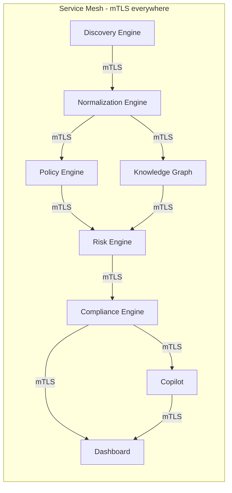

### 5.2 Controls

- **Mutual TLS:** every internal hop (service mesh sidecar-issued short-lived certs, or platform-level mTLS if no mesh is deployed) — a compromised pod cannot silently call another engine without presenting a valid workload certificate.
- **Service authentication:** each engine has its own **service account identity** (Vault AppRole / Kubernetes workload identity), distinct from any human or tenant identity — the Copilot's service identity, for example, is authorized to read Findings/Compliance data but has no path to Discovery Connector credentials.
- **Internal authorization:** service-to-service calls carry a scoped internal token asserting *which* service is calling, checked against an explicit allow-list per callee (e.g., only the Compliance Engine and Dashboard may call the Copilot's internal query endpoint — Discovery Engine has no legitimate reason to, and is denied if it tries).
- **No implicit trust from network location:** identical to the SADPS Zero Trust principle — being "inside the cluster" grants nothing without a valid mTLS identity and internal token.

---

## 6. Database Security

### 6.1 Where It Sits

Wraps all four data stores now in scope — PostgreSQL, Neo4j, Redis, **and ChromaDB** (new, for the Copilot's vector store) — uniformly.

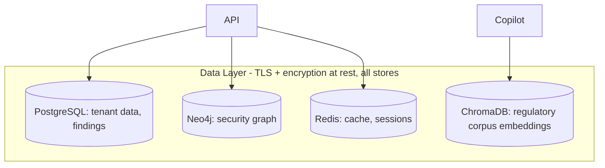

### 6.2 Per-Store Controls

| Store | TLS | Encryption at Rest | Role Separation | Tenant Isolation |
|---|---|---|---|---|
| **PostgreSQL** | `sslmode=verify-full` | Column-level AES-256-GCM on sensitive fields + disk-level encryption floor | `api_readwrite` / `migration` / `readonly_reporting` roles | **Row-Level Security** on every tenant-scoped table — the primary isolation backstop |
| **Neo4j** | TLS-required Bolt | Disk-level encryption | Runtime query role separate from schema-management role | `tenant_id` node property + mandatory query-builder-enforced predicate |
| **Redis** | TLS | Disk-level encryption on persistence (RDB/AOF) where enabled | Redis ACLs scoping commands/key-patterns per service identity | `tenant:{tenant_id}:*` mandatory key-namespace convention |
| **ChromaDB** (new) | TLS to the ChromaDB service | Disk-level encryption for the vector index and underlying document store | A dedicated, read-mostly service role for the Copilot; ingestion/re-indexing of the regulatory corpus uses a separate, more privileged role never exposed to runtime query paths | **This store is deliberately architected as tenant-agnostic** — the regulatory corpus (laws, frameworks, standards) is shared reference material, not tenant data. Tenant-specific context that reaches the Copilot (Section 7) is *never* written into ChromaDB; it is passed at query time only, in memory, per request |

**Backup encryption:** identical discipline across all four stores — AES-256-GCM, backup-specific DEKs held under a separate access policy from live-data keys, restore drills scheduled per store (Section 15 of the SADPS applies unchanged).

---

## 7. RAG / Compliance Copilot Security

This is the one genuinely new attack surface relative to the SADPS baseline, and it gets a dedicated section because RAG systems introduce failure modes (prompt injection, data leakage through retrieval, hallucinated citations) that none of the other engines have.

### 7.1 Where It Sits

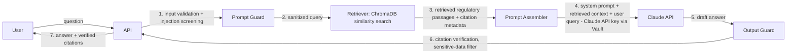

### 7.2 Controls

| Risk | Control |
|---|---|
| **Prompt injection** (regulatory document or user query attempts to override system instructions) | Prompt Guard stage: the user's query and any retrieved document text are treated as **data**, never concatenated into the same trust level as the system prompt; a dedicated instruction-boundary format (e.g., structured message roles, explicit delimiters) prevents retrieved text from being interpreted as new instructions. Known injection patterns are screened before the query reaches Claude. |
| **Prompt validation** | Input length limits, character/encoding normalization, rejection of queries attempting to request the system prompt itself or Copilot configuration |
| **Output validation** | Structured-output constraints on the Copilot's response format; the platform never executes or evaluates anything from a Copilot response — it is display-only text/citations rendered to the Dashboard |
| **Citation verification** | Every citation the Copilot returns is cross-checked against the actual retrieved ChromaDB passages before being shown to the user — a citation pointing to a source that was not actually retrieved is stripped, not displayed, directly mitigating hallucinated legal citations, which is an unacceptable failure mode for a compliance product |
| **Sensitive data filtering** | Output Guard scans the draft answer for accidental inclusion of tenant-specific sensitive data (cloud resource identifiers, credentials-adjacent strings) that should never appear in a regulatory-guidance answer — this is a backstop against retrieval or prompt-construction bugs, not an expected normal path, since Section 6.2 already keeps tenant data out of ChromaDB by design |
| **Hallucination mitigation** | Retrieval-grounding is mandatory: the Copilot's system prompt requires it to answer only from retrieved passages and to explicitly state when a query cannot be answered from the regulatory corpus, rather than generating unsupported regulatory claims |
| **Data leakage via retrieval** | Because ChromaDB holds only the shared regulatory corpus (Section 6.2), there is no cross-tenant leakage vector *through the vector store itself*; any tenant-specific context (e.g., "how does this apply to my current findings") is assembled at query time from the already-authorized, tenant-scoped Postgres/Neo4j data the requesting user is entitled to see — the same authorization check (Section 1) applies before that context is ever added to a Claude prompt |
| **API key protection** | Claude API key resolved from Vault at the point of the outbound call only (Section 3.2), never logged, never included in any error payload |
| **Cost-abuse protection** | Per-tenant query-rate and token-budget quotas enforced at the API layer in front of the Copilot, distinct from general API rate limiting (Section 2), since Copilot calls carry real marginal cost |

### 7.3 Explicit Non-Goal

The Copilot is explicitly **not** authorized to take any write action, trigger a scan, or modify a Finding/rule — it is a read/advisory-only component. This is enforced by giving its internal service identity (Section 5) no write-capable Port to any repository; the constraint exists at the architecture level, not just in the prompt.

---

## 8. Logging & Audit

### 8.1 Where It Sits

A shared logging/audit pipeline every engine writes into, including the new Copilot component — no engine ships its own siloed log store.

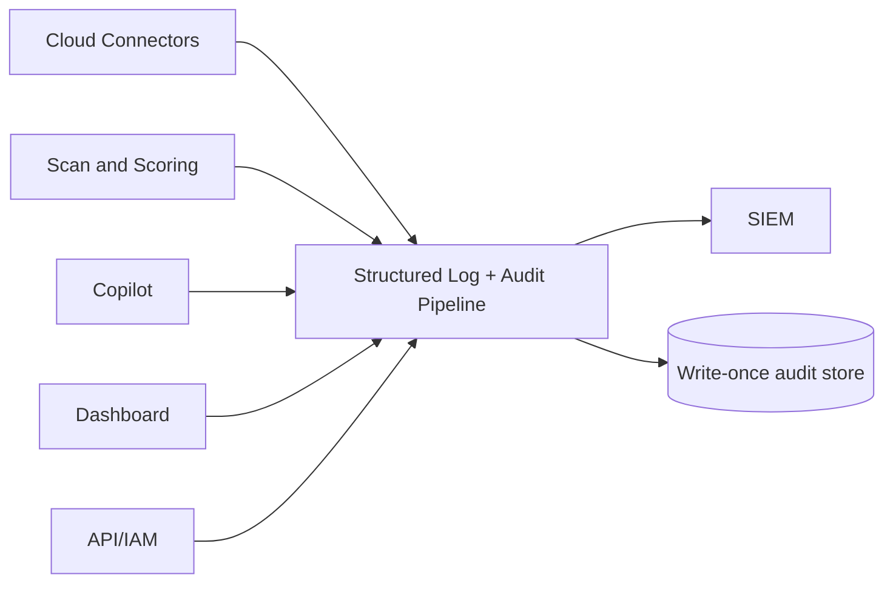

### 8.2 Event Categories

| Category | Examples | New for This Architecture |
|---|---|---|
| Authentication/authorization | Login, MFA, token refresh, RBAC denials | — |
| API logs | Every request: method, path, tenant_id, status, latency | — |
| Discovery logs | AssumeRole/Managed Identity/Workload Identity lease issuance and expiry, per-provider API call counts | Section 4 specific |
| Security events | WAF blocks, injection-guard triggers, rate-limit breaches | — |
| **Copilot query logs** | Query text (PII/sensitive-data-scrubbed), retrieved document IDs, citation-verification pass/fail, token usage | **New** — required both for cost accountability and to audit for hallucination/injection incidents after the fact |
| Administrative actions | Role changes, rule overrides, tenant config changes | — |

### 8.3 Immutability & SIEM

- **Immutable audit logs:** append-only, no `UPDATE`/`DELETE` grant on the audit table for any runtime role; shipped off-host in near-real-time to a write-once store, closing the "attacker edits logs after compromise" gap.
- **SIEM integration:** structured logs stream to the enterprise SIEM (Splunk/Sentinel/Chronicle-class) via a standard forwarder; Copilot-specific events (injection-guard triggers, citation-verification failures) are tagged distinctly so they can feed a dedicated detection rule set, separate from generic API anomaly rules.

---

## 9. Monitoring

### 9.1 Where It Sits

Prometheus scrapes every engine (existing and new); Grafana dashboards are extended, not replaced.

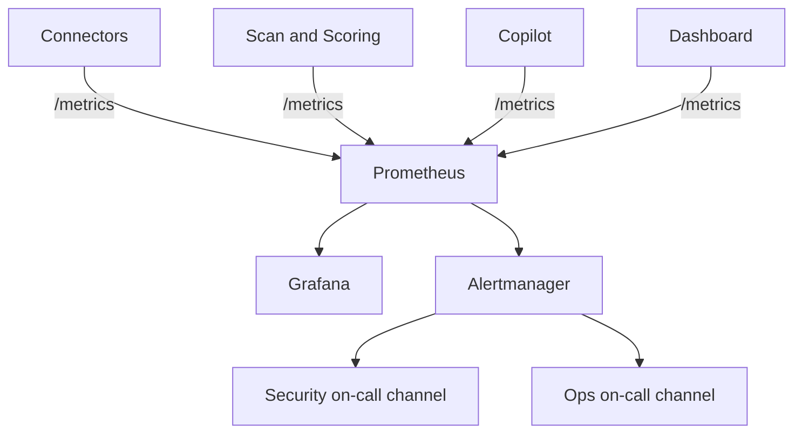

### 9.2 What's Monitored

- **Health checks:** liveness/readiness probes per engine, including the Copilot's dependency health (ChromaDB reachable, Claude API reachable).
- **Metrics:** existing pipeline metrics (scan duration, rule evaluation counts, risk-score distribution) **plus new Copilot metrics** — query latency, retrieval-hit rate, citation-verification failure rate, token spend per tenant.
- **Anomaly detection:** statistical baselining on auth-failure rate, RBAC-denial rate, and — new — Copilot query volume per tenant (a sudden spike is both a possible cost-abuse and a possible prompt-injection-probing signal).
- **Alerting:** security-relevant alerts (injection-guard trigger rate, citation-verification failure spike, refresh-token reuse detection, cross-tenant RLS-denial attempts) route to a dedicated security channel, distinct from general ops alerting.

---

## 10. Container Security

### 10.1 Where It Sits

Applies uniformly to every engine's container image — Discovery, Normalization, Scan & Scoring, **Copilot**, Dashboard — with no exceptions carved out for the newer component.

| Control | Detail |
|---|---|
| Rootless containers | Every image runs as a non-root user; no engine, including the Copilot's ChromaDB-client sidecar, runs as `root` |
| Read-only filesystem | Enabled by default; any engine needing writable scratch space (e.g., temporary embedding computation) is granted a narrowly scoped `tmpfs` mount, not a writable root filesystem |
| Image signing | Every image signed at build (cosign/Sigstore); deployment verifies signatures before pulling, across all engines uniformly |
| SBOM | Generated per image at build time, feeding the dependency-scanning stage of the CI/CD pipeline (Section 11) |
| Trivy (or equivalent) | Container image vulnerability scanning in CI, blocking on high/critical findings |
| Seccomp / AppArmor | Default restrictive profiles applied to every container; syscall surface minimized, especially for internet-facing components (Copilot's outbound call to Claude API is the one legitimate external egress path for that engine, and its profile reflects only what that requires) |

---

## 11. DevSecOps (Secure CI/CD)

### 11.1 Pipeline

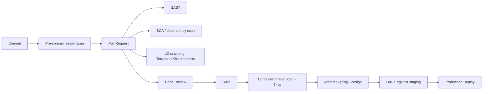

### 11.2 Stage Detail

| Stage | Tooling Class | Applies To |
|---|---|---|
| **SAST** | Static analysis (Bandit-class for Python) | All engines, including new Copilot code (prompt-construction logic is reviewed with particular attention to injection-safe string handling) |
| **DAST** | Dynamic scanning against staging | API surface, including Copilot query endpoints — DAST test cases explicitly include injection-probe payloads |
| **SCA** | Software Composition Analysis | All dependencies, including the RAG stack (ChromaDB client library, embedding libraries, Claude SDK) |
| **Secret scanning** | Pre-commit + CI-wide | All repos; explicitly checks for accidentally-committed Claude API keys, cloud AssumeRole configuration, and connection strings |
| **IaC scanning** | Checkov/tfsec-class | Terraform/Kubernetes manifests defining network segmentation, IAM roles, and Vault policies — catches an overly permissive security group or IAM policy before it's ever applied |
| **Container scanning** | Trivy (Section 10) | Every built image |
| **Dependency scanning** | Automated, recurring (not just at PR time) | Catches newly disclosed CVEs against already-approved dependencies |
| **Artifact signing** | cosign/Sigstore | Every image and, where applicable, IaC plan output |

---

## 12. Network Security

### 12.1 Enterprise Network Diagram

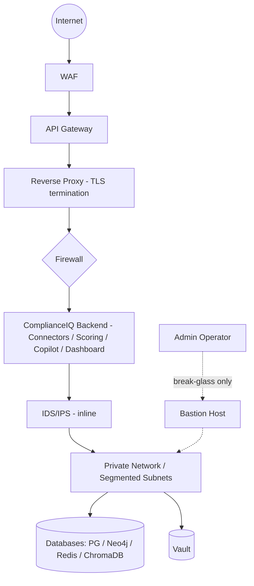

### 12.2 Controls

- **WAF:** first line of defense, OWASP CRS + custom rules; blocks known injection/scanning patterns before they reach the API Gateway.
- **API Gateway:** rate limiting, JWT pre-validation, routing/versioning (Section 2).
- **Reverse proxy:** TLS termination, security headers applied uniformly.
- **Firewall:** default-deny between every network segment; only explicitly required paths are allowed (e.g., only the Backend segment may reach the Database segment; the Copilot's egress to the Claude API is an explicit, narrowly allow-listed exception to an otherwise fully internal Backend segment).
- **IDS/IPS:** inline or out-of-band detection tuned to both generic attack signatures and CSPM-specific abuse patterns (credential-stuffing against the Discovery Connector's Vault-lease endpoint, anomalous Copilot query bursts).
- **Private subnets:** databases and Vault have no direct internet route, ever — reachable only from the Backend segment.
- **Bastion host:** the only path for human operator access to any private-subnet resource, itself MFA-gated and fully audited (every session logged, per Section 8), used strictly for break-glass scenarios rather than routine operations.

---

## 13. Security Per Engine

| Engine | Threats | Attack Surface | Security Controls | Auth | AuthZ | Logging | Encryption | Best Practices |
|---|---|---|---|---|---|---|---|---|
| **Discovery Connectors** (AWS/Azure/GCP) | Credential theft, SSRF via malicious provider response, over-permissioned roles | Outbound calls to customer cloud APIs; inbound from Vault | Vault-brokered short-TTL credentials (Section 4), egress allow-listed to known provider endpoints only | Service identity (mTLS + workload identity) | Least-privilege read-only cloud IAM roles | Lease issuance/expiry logged (Section 8.2) | TLS to provider APIs; raw payload encrypted at rest downstream | Never request broader permissions than the URM's current field set requires |
| **Normalization Engine** | Malformed/hostile provider payload causing parser exploitation or type-confusion | Consumes raw Discovery output | Schema-validated input, no `eval`/dynamic deserialization of provider responses | Internal service identity | Internal allow-list (only Discovery may call it) | Normalization errors logged with correlation ID | Operates on already-encrypted-at-rest raw payloads | Treat every provider response as untrusted input, always |
| **Knowledge Graph** | Cross-tenant graph traversal, injection via crafted Cypher-adjacent input | Internal query interface | Query-builder-enforced mandatory `tenant_id` predicate (no raw Cypher exposed to callers) | Internal service identity | Internal allow-list | Query patterns logged for anomaly baselining | TLS to Neo4j, disk-level encryption | No caller is ever given a "query all tenants" capability, structurally |
| **Policy Engine** | Rule-pack tampering, malicious custom rule logic | Rule ingestion path | Rule packs signed/versioned, evaluated in a constrained execution context | Internal service identity | Only Platform/Security Engineer roles may publish rule packs | Rule evaluation and rule-change events logged | Rule content encrypted at rest as proprietary IP | Rule packs reviewed and versioned like code, never hot-patched in production silently |
| **Risk Engine** | Score manipulation, formula tampering | None external — pure internal computation | Deterministic, side-effect-free scoring function; no external I/O inside the formula itself | N/A (invoked internally) | N/A | Golden-value regression tests double as an integrity check | Findings/scores encrypted at rest downstream | Formula stays a pure function — this is a security property, not just a testability one |
| **Compliance Engine** | Incorrect/stale framework mapping presented as authoritative | Consumes Risk Engine + framework reference data | Framework mappings version-pinned per release | Internal service identity | Internal allow-list | Mapping-change events logged | Mapping data encrypted at rest | Framework updates never retroactively rewrite historical findings silently |
| **Copilot (RAG)** | Prompt injection, hallucinated citations, sensitive-data leakage, cost abuse | Public-facing query endpoint + outbound Claude API call | Full stack in Section 7 (Prompt Guard, Output Guard, citation verification) | User JWT (same IAM as Dashboard) + dedicated internal service identity for the Claude API call | Read/advisory-only — no write-capable Port to any repository | Query logs with citation-verification outcome (Section 8.2) | Claude API key via Vault; ChromaDB encrypted at rest; tenant context never persisted to the vector store | Ground every answer in retrieved passages; never let the model "fill in" a regulatory citation |
| **Dashboard** | XSS, BOLA on findings/report endpoints, session hijacking | Primary user-facing surface | Framework-level auto-escaping, object-level authorization on every fetch, `SameSite` cookies | User JWT | Role-scoped views (Section 1) | Every fetch of a Finding/report is itself a security-sensitive read event, logged | Data-in-transit TLS; data-at-rest per Section 6 | Never trust client-supplied `tenant_id` in a request body for any Dashboard call |

---

## 14. Updated Architecture (Functional + Security Layers)

The diagram below is the deliverable this whole document builds toward: the five existing functional layers, unchanged, now wrapped by seven named security layers.

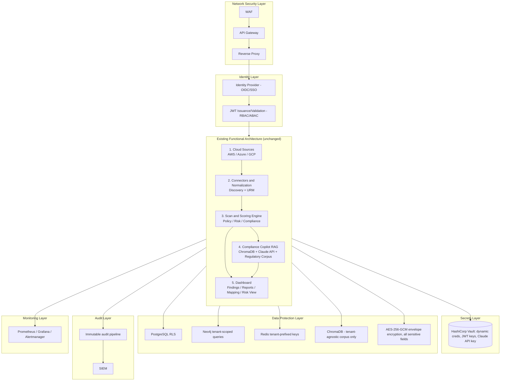

### 14.1 Legend — What Each New Layer Contributes

| Layer | Contributes | Detailed In |
|---|---|---|
| **Network Security Layer** | Perimeter defense, TLS termination, DDoS/abuse absorption before any functional component is reached | Section 12 |
| **Identity Layer** | Single authentication/authorization gate all five functional components trust uniformly | Section 1 |
| **Secrets Layer** | Removes all long-lived credentials from every functional component's own code/config | Sections 3–4 |
| **Data Protection Layer** | Tenant isolation and encryption applied uniformly across all four data stores, including the new ChromaDB store | Section 6 |
| **Audit Layer** | Tamper-evident record of every security-relevant event across all five functional components | Section 8 |
| **Monitoring Layer** | Health, performance, and anomaly visibility extended uniformly to the newer Copilot component alongside the original four | Section 9 |
| **(Cross-cutting, not a single box)** Internal Service Security, Container Security, DevSecOps | Applied identically to every functional component's deployment unit and inter-service call, with no exceptions carved out for the Copilot | Sections 5, 10, 11 |

### 14.2 Deployment View

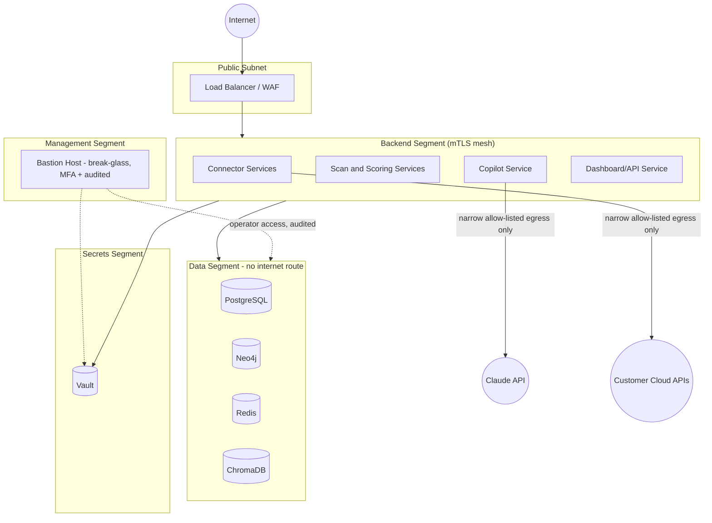

---

## Closing Note

Nothing in the five functional layers changed shape, sequence, or responsibility across this document. What changed is that every input those layers receive now arrives pre-authenticated, pre-authorized, and pre-validated (Layers 1–2), every credential they use is brokered rather than embedded (Layer 2/Section 4), every byte they persist is isolated and encrypted (Layer 3), every action they take is recorded tamper-evidently (Layer 4), and every component's health and behavior is observable (Layer 5) — inside a network topology that assumes hostile intent at every boundary (Section 12) and a delivery pipeline that verifies security posture before any of it ships (Section 11). This is the concrete, source-traceable meaning of "add a professional security layer without redesigning the platform."
