# The ComplianceIQ Engineering Handbook
### Clean Architecture · Domain-Driven Design · Design Patterns · Neo4j Graph Modeling
*A Principal Architect's Guide to Building a Production-Grade CSPM Platform*

---

> **How to use this document**
> This handbook is written so you can read it top to bottom as a course, or jump directly to a concept as a reference while coding ComplianceIQ. Every concept is explained twice: once in plain language (as if explaining to a smart friend with no CS background), and once with full professional vocabulary (as you'd use in a design review with senior architects). Every example is grounded in ComplianceIQ's actual domain: cloud accounts, IAM roles, storage buckets, findings, compliance controls, and attack paths.

---

## Table of Contents

1. [Part 0 — What ComplianceIQ Actually Is](#part-0)
2. [Part 1 — Clean Architecture](#part-1)
3. [Part 2 — Domain-Driven Design](#part-2)
4. [Part 3 — Design Patterns](#part-3)
5. [Part 4 — Neo4j & Graph Modeling](#part-4)
6. [Part 5 — Bringing It All Together](#part-5)
7. [Final Master Checklist](#final-checklist)

---

<a name="part-0"></a>
## Part 0 — What ComplianceIQ Actually Is

Before we touch architecture, you need to understand *what you're building*, because every architectural decision in this handbook exists to serve this domain.

**Beginner explanation:**
Imagine a company has hundreds of cloud accounts (AWS, Azure, GCP), each with thousands of resources: virtual machines, storage buckets, databases, IAM roles, networks. Nobody can manually check whether all of this is configured securely and legally (compliant with SOC2, PCI-DSS, ISO 27001, etc.). ComplianceIQ is a robot auditor: it continuously scans everything, understands how it's all connected, figures out what's dangerous, and tells security teams "fix this, in this order, because it's this bad."

**Advanced explanation:**
ComplianceIQ is a **Cloud Security Posture Management (CSPM)** platform. Its job is to:

1. **Discover** — enumerate every resource across every connected cloud account (the *Discovery Engine*).
2. **Normalize** — translate AWS/Azure/GCP-specific shapes into one common shape (the *Normalization Engine* + *Universal Resource Model*).
3. **Model relationships** — store resources and their relationships (who can access what, what's attached to what) in a graph (the *Knowledge Graph*, backed by Neo4j).
4. **Evaluate policy** — run compliance/security rules against resources (the *Policy Intelligence Engine*).
5. **Add context** — enrich raw policy violations with business context: is this resource internet-facing? Does it hold PII? Is it in production? (the *Context Intelligence Engine*).
6. **Score risk** — combine policy violations + context + graph position into a single risk score (the *Risk Intelligence Engine*).
7. **Map to frameworks** — translate technical findings into compliance framework language: "this violates PCI-DSS 1.2.1" (the *Compliance Intelligence Engine*).
8. **Find attack paths** — use graph traversal to answer "can an external attacker reach the production database?" (the *Attack Path Engine*).
9. **Produce actionable findings** — package everything into a single, deduplicated, prioritized `Finding` object a human can act on (the *Finding Builder*).

This is a **data-intensive, rules-heavy, graph-heavy, multi-tenant, evolving-domain system**. That combination is *exactly* the type of system where Clean Architecture + DDD + Design Patterns + Graph Databases earn their cost. A CRUD blog doesn't need any of this. ComplianceIQ desperately does.

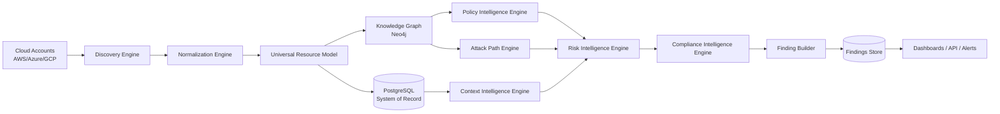
```mermaid
flowchart LR
    A[Cloud Accounts<br/>AWS/Azure/GCP] --> B[Discovery Engine]
    B --> C[Normalization Engine]
    C --> D[Universal Resource Model]
    D --> E[Knowledge Graph<br/>Neo4j]
    D --> F[(PostgreSQL<br/>System of Record)]
    E --> G[Policy Intelligence Engine]
    E --> H[Attack Path Engine]
    F --> I[Context Intelligence Engine]
    G --> J[Risk Intelligence Engine]
    I --> J
    H --> J
    J --> K[Compliance Intelligence Engine]
    K --> L[Finding Builder]
    L --> M[(Findings Store)]
    M --> N[Dashboards / API / Alerts]
```

Keep this diagram in your head. Every chapter below maps back to one or more of these boxes.

---
<a name="part-1"></a>
## Part 1 — Clean Architecture

### 1.1 The Problem It Solves

**Beginner explanation:**
Imagine you build ComplianceIQ fast, and you let your FastAPI route functions talk directly to PostgreSQL, directly to Neo4j, and directly to AWS SDK calls, all mixed together in one file. It works. Six months later, you need to:

- Swap PostgreSQL for a different database.
- Add support for GCP in addition to AWS.
- Unit test the risk-scoring logic without booting a database.
- Let five new engineers work on different engines without stepping on each other.

You discover that your business logic (how risk is calculated, how findings are deduplicated) is *welded* to your infrastructure code (SQL queries, HTTP clients, Neo4j drivers). You cannot change one without touching the other. This welding is called **tight coupling**, and it's the disease Clean Architecture cures.

**Advanced explanation:**
Clean Architecture solves the problem of **volatility mismatch**. In any real system, different parts of the code change at different rates:

- **Business rules** (how ComplianceIQ decides a public S3 bucket with PII is "Critical" risk) change *rarely*, and only when the business changes.
- **Frameworks and drivers** (FastAPI version, Neo4j driver version, PostgreSQL vs. a future warehouse) change *often*, for reasons that have nothing to do with the business.

If business logic depends on infrastructure, then every infrastructure change (a driver upgrade, a database migration) risks breaking business logic, and every business logic change requires re-testing infrastructure. Clean Architecture inverts the dependency so that **stable, high-value business logic depends on nothing**, and **volatile, low-value infrastructure depends on business logic** (never the reverse).

### 1.2 History

Clean Architecture was published by Robert C. Martin ("Uncle Bob") in 2012 (blog) and expanded in his 2017 book *Clean Architecture: A Craftsman's Guide to Software Structure and Design*. It is not a brand-new idea — it's a synthesis of three earlier architectural styles that all arrived at the same conclusion independently:

| Predecessor | Author | Core idea |
|---|---|---|
| **Hexagonal Architecture (Ports & Adapters)** | Alistair Cockburn (2005) | The application core exposes "ports"; infrastructure plugs in through "adapters." |
| **Onion Architecture** | Jeffrey Palermo (2008) | Concentric layers, dependencies only point inward toward the domain. |
| **DCI (Data, Context, Interaction)** | Trygve Reenskaug & James Coplien | Separate what data *is* from what it *does* in a given use case. |

Uncle Bob noticed that Hexagonal, Onion, and DCI all shared one non-negotiable rule, and he named it explicitly: **The Dependency Rule**.

### 1.3 Uncle Bob's Core Principles

Clean Architecture rests on principles Uncle Bob had already formalized as the **SOLID principles**, applied at the architecture level instead of the class level:

- **Single Responsibility** → each engine (Discovery, Policy, Risk...) has one reason to change.
- **Open/Closed** → you can add a new cloud provider (e.g., GCP) without modifying the Discovery Engine's core logic, only by adding a new adapter.
- **Liskov Substitution** → any `CloudProviderAdapter` (AWS, Azure, GCP) must be swappable without breaking the Discovery Engine.
- **Interface Segregation** → the Risk Intelligence Engine depends on a narrow `FindingRepository` interface, not a giant "God repository" with 80 methods.
- **Dependency Inversion** → this is the big one. High-level modules (use cases) must not depend on low-level modules (databases); both depend on abstractions.

### 1.4 The Dependency Rule

> **"Source code dependencies must point only inward, toward higher-level policies."** — Robert C. Martin

This is the single rule that makes Clean Architecture "clean." Concretely for ComplianceIQ: your `RiskScoringUseCase` (business logic) must **never** contain the words `psycopg`, `neo4j`, `boto3`, or `fastapi`. It only knows about abstract repository interfaces and domain entities. The PostgreSQL repository *implements* the interface the use case defines — the arrow of dependency points from infrastructure inward to the use case, never the other way.

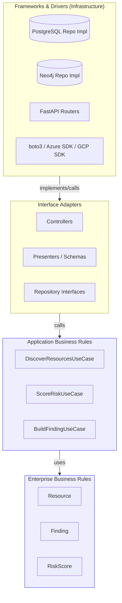
```mermaid
flowchart TB
    subgraph Outer["Frameworks & Drivers (Infrastructure)"]
        DB[(PostgreSQL Repo Impl)]
        GraphDB[(Neo4j Repo Impl)]
        API[FastAPI Routers]
        CloudSDK[boto3 / Azure SDK / GCP SDK]
    end
    subgraph Adapters["Interface Adapters"]
        Controllers[Controllers]
        Presenters[Presenters / Schemas]
        RepoIfaces[Repository Interfaces]
    end
    subgraph UseCases["Application Business Rules"]
        UC1[DiscoverResourcesUseCase]
        UC2[ScoreRiskUseCase]
        UC3[BuildFindingUseCase]
    end
    subgraph Entities["Enterprise Business Rules"]
        E1[Resource]
        E2[Finding]
        E3[RiskScore]
    end

    Outer -- implements/calls --> Adapters
    Adapters -- calls --> UseCases
    UseCases -- uses --> Entities

    classDef inward fill:#eef,stroke:#33f;
    class UseCases,Entities inward
```

Notice the arrows: **outer layers depend on inner layers**, never the reverse. This is drawn as concentric circles in Uncle Bob's original diagram; the Mermaid version above shows the same thing top-to-bottom for readability.

### 1.5 The Layers, In Detail

#### Layer 1: Entities (Enterprise Business Rules)

**Definition:** Plain objects encoding the most fundamental, universally-true business rules — rules that would be true "even if there were no ComplianceIQ app at all," i.e., rules a human security auditor would apply by hand.

**ComplianceIQ example:** A `Resource` entity knows that a resource cannot exist without a `cloud_account_id` and a `resource_type`. A `Finding` entity knows that its `severity` can only be one of `LOW/MEDIUM/HIGH/CRITICAL`, and that a `CRITICAL` finding cannot be silently auto-closed — it enforces this in its own methods, regardless of which use case touches it.

```python
# domain/entities/finding.py
from dataclasses import dataclass, field
from enum import Enum
from datetime import datetime
from uuid import UUID

class Severity(str, Enum):
    LOW = "LOW"
    MEDIUM = "MEDIUM"
    HIGH = "HIGH"
    CRITICAL = "CRITICAL"

class FindingStatus(str, Enum):
    OPEN = "OPEN"
    ACKNOWLEDGED = "ACKNOWLEDGED"
    RESOLVED = "RESOLVED"
    SUPPRESSED = "SUPPRESSED"

@dataclass
class Finding:
    id: UUID
    resource_id: UUID
    policy_id: UUID
    severity: Severity
    status: FindingStatus
    created_at: datetime
    resolved_at: datetime | None = None

    def resolve(self) -> None:
        if self.severity == Severity.CRITICAL and self.status == FindingStatus.OPEN:
            raise ValueError(
                "CRITICAL findings must be ACKNOWLEDGED before they can be RESOLVED."
            )
        self.status = FindingStatus.RESOLVED
        self.resolved_at = datetime.utcnow()
```

Notice: no imports of FastAPI, SQLAlchemy, or Neo4j. This class could run in a REPL with zero infrastructure. That's the test for "is this really an Entity?"

#### Layer 2: Use Cases (Application Business Rules)

**Definition:** Orchestrate entities to accomplish one specific application-specific task. Use cases encode "what the app does" (verbs), while entities encode "what is universally true" (nouns).

**ComplianceIQ example:** `ScoreResourceRiskUseCase` orchestrates: fetch resource + its findings + its graph context (blast radius from Neo4j) + its business context (is it production?), then computes and persists a `RiskScore`.

```python
# application/use_cases/score_resource_risk.py
from domain.entities.risk_score import RiskScore
from domain.repositories.resource_repository import ResourceRepository
from domain.repositories.finding_repository import FindingRepository
from domain.repositories.graph_repository import GraphRepository
from domain.services.risk_calculator import RiskCalculator

class ScoreResourceRiskUseCase:
    """Application-specific orchestration. Knows nothing about Postgres or Neo4j."""

    def __init__(
        self,
        resource_repo: ResourceRepository,      # interface, not implementation
        finding_repo: FindingRepository,         # interface, not implementation
        graph_repo: GraphRepository,             # interface, not implementation
        calculator: RiskCalculator,              # domain service
    ) -> None:
        self._resource_repo = resource_repo
        self._finding_repo = finding_repo
        self._graph_repo = graph_repo
        self._calculator = calculator

    def execute(self, resource_id) -> RiskScore:
        resource = self._resource_repo.get_by_id(resource_id)
        findings = self._finding_repo.list_for_resource(resource_id)
        blast_radius = self._graph_repo.get_blast_radius(resource_id)

        score = self._calculator.calculate(
            resource=resource,
            findings=findings,
            blast_radius=blast_radius,
        )
        self._resource_repo.save_risk_score(resource_id, score)
        return score
```

This is the **Dependency Inversion Principle** in action: `ScoreResourceRiskUseCase` depends on `ResourceRepository` (an abstract interface defined *inside* the domain layer), not on any concrete PostgreSQL or Neo4j class.

#### Layer 3: Interface Adapters

**Definition:** Translators. They convert data from the format most convenient for use cases/entities into the format most convenient for external agencies (web, database, CLI) — and vice versa. This layer contains **Controllers** (FastAPI routers), **Presenters** (Pydantic response schemas), and **Gateways/Repository implementations**.

**ComplianceIQ example:** The FastAPI router receiving `POST /resources/{id}/rescore` is a Controller. It parses the HTTP request, calls the use case, and hands the result to a Presenter (Pydantic schema) that shapes the JSON response.

```python
# interface_adapters/controllers/risk_controller.py
from fastapi import APIRouter, Depends
from application.use_cases.score_resource_risk import ScoreResourceRiskUseCase
from interface_adapters.presenters.risk_presenter import RiskScorePresenter
from interface_adapters.schemas.risk_schema import RiskScoreResponse
from api.dependencies import get_score_risk_use_case

router = APIRouter(prefix="/resources", tags=["risk"])

@router.post("/{resource_id}/rescore", response_model=RiskScoreResponse)
def rescore_resource(
    resource_id: str,
    use_case: ScoreResourceRiskUseCase = Depends(get_score_risk_use_case),
):
    score = use_case.execute(resource_id)
    return RiskScorePresenter.to_response(score)
```

#### Layer 4: Frameworks & Drivers (Infrastructure)

**Definition:** The outermost, most volatile layer. FastAPI itself, SQLAlchemy/psycopg for PostgreSQL, the official Neo4j Python driver, Redis client, boto3/Azure SDK/GCP SDK, Docker configuration. This layer contains **glue code and details**, never business rules.

**ComplianceIQ example:** `PostgresResourceRepository` implements the `ResourceRepository` interface using SQLAlchemy.

```python
# infrastructure/persistence/postgres_resource_repository.py
from sqlalchemy.orm import Session
from domain.repositories.resource_repository import ResourceRepository
from domain.entities.resource import Resource
from infrastructure.persistence.models import ResourceModel
from infrastructure.persistence.mappers import resource_model_to_entity

class PostgresResourceRepository(ResourceRepository):
    """Infrastructure detail. Implements the domain-defined interface."""

    def __init__(self, session: Session) -> None:
        self._session = session

    def get_by_id(self, resource_id) -> Resource:
        model = self._session.query(ResourceModel).filter_by(id=resource_id).one()
        return resource_model_to_entity(model)

    def save_risk_score(self, resource_id, score) -> None:
        model = self._session.query(ResourceModel).filter_by(id=resource_id).one()
        model.risk_score = score.value
        model.risk_band = score.band
        self._session.commit()
```

If tomorrow ComplianceIQ migrates from PostgreSQL to CockroachDB, you write a new class implementing `ResourceRepository`. **Zero lines change** in `ScoreResourceRiskUseCase` or in `Finding`/`Resource` entities. That is the entire payoff of Clean Architecture.

### 1.6 Dependency Injection: How the Layers Actually Get Wired

Clean Architecture *describes* the dependency direction; **Dependency Injection (DI)** is the *mechanism* that assembles the concrete objects at runtime and hands abstract-typed parameters their concrete implementations.

```python
# api/dependencies.py
from fastapi import Depends
from sqlalchemy.orm import Session
from infrastructure.persistence.session import get_db_session
from infrastructure.persistence.postgres_resource_repository import PostgresResourceRepository
from infrastructure.persistence.postgres_finding_repository import PostgresFindingRepository
from infrastructure.graph.neo4j_graph_repository import Neo4jGraphRepository
from domain.services.risk_calculator import RiskCalculator
from application.use_cases.score_resource_risk import ScoreResourceRiskUseCase

def get_score_risk_use_case(
    session: Session = Depends(get_db_session),
) -> ScoreResourceRiskUseCase:
    return ScoreResourceRiskUseCase(
        resource_repo=PostgresResourceRepository(session),
        finding_repo=PostgresFindingRepository(session),
        graph_repo=Neo4jGraphRepository(),
        calculator=RiskCalculator(),
    )
```

FastAPI's `Depends()` mechanism is a built-in, lightweight DI container. This is the **only** place in the whole codebase allowed to import both a use case *and* an infrastructure class in the same file — because wiring is its explicit job.

### 1.7 Request Lifecycle — Full Sequence Diagram

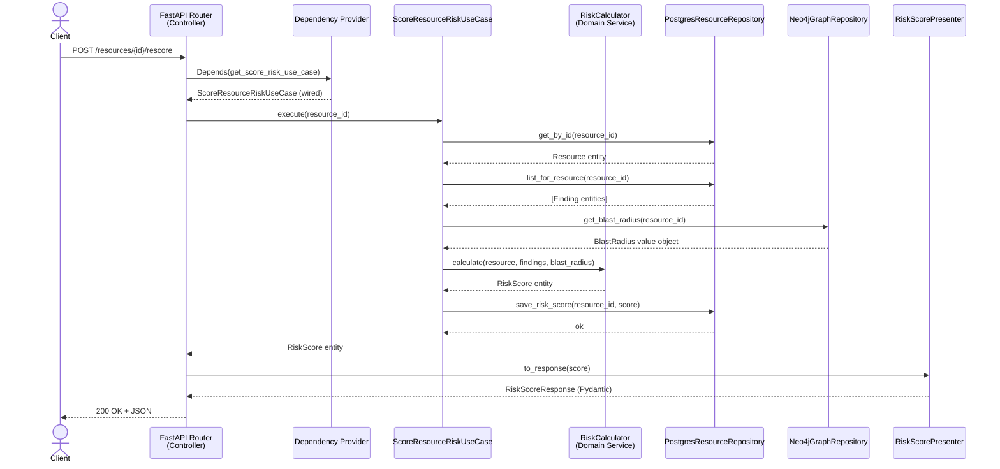
```mermaid
sequenceDiagram
    actor Client
    participant Router as FastAPI Router<br/>(Controller)
    participant DI as Dependency Provider
    participant UC as ScoreResourceRiskUseCase
    participant Dom as RiskCalculator<br/>(Domain Service)
    participant PGRepo as PostgresResourceRepository
    participant Neo4jRepo as Neo4jGraphRepository
    participant Presenter as RiskScorePresenter

    Client->>Router: POST /resources/{id}/rescore
    Router->>DI: Depends(get_score_risk_use_case)
    DI-->>Router: ScoreResourceRiskUseCase (wired)
    Router->>UC: execute(resource_id)
    UC->>PGRepo: get_by_id(resource_id)
    PGRepo-->>UC: Resource entity
    UC->>PGRepo: list_for_resource(resource_id)
    PGRepo-->>UC: [Finding entities]
    UC->>Neo4jRepo: get_blast_radius(resource_id)
    Neo4jRepo-->>UC: BlastRadius value object
    UC->>Dom: calculate(resource, findings, blast_radius)
    Dom-->>UC: RiskScore entity
    UC->>PGRepo: save_risk_score(resource_id, score)
    PGRepo-->>UC: ok
    UC-->>Router: RiskScore entity
    Router->>Presenter: to_response(score)
    Presenter-->>Router: RiskScoreResponse (Pydantic)
    Router-->>Client: 200 OK + JSON
```

Notice: the `UC` box (use case) never talks to the `Client` or knows about HTTP status codes; the `Router` never touches SQL or Cypher directly. Each layer only ever talks to its immediate neighbor.

### 1.8 Folder Organization for ComplianceIQ

```text
complianceiq/
├── domain/                          # Layer 1 — Entities (innermost, zero dependencies)
│   ├── entities/
│   │   ├── resource.py
│   │   ├── finding.py
│   │   ├── policy.py
│   │   ├── risk_score.py
│   │   └── compliance_control.py
│   ├── value_objects/
│   │   ├── cloud_account_id.py
│   │   ├── arn.py
│   │   └── blast_radius.py
│   ├── repositories/                # abstract interfaces ONLY (ABCs / Protocols)
│   │   ├── resource_repository.py
│   │   ├── finding_repository.py
│   │   └── graph_repository.py
│   ├── services/                    # domain services (pure business logic)
│   │   ├── risk_calculator.py
│   │   └── finding_deduplicator.py
│   └── events/
│       └── finding_created.py
│
├── application/                      # Layer 2 — Use Cases
│   └── use_cases/
│       ├── discover_resources.py
│       ├── normalize_resource.py
│       ├── evaluate_policy.py
│       ├── score_resource_risk.py
│       ├── compute_attack_paths.py
│       └── build_finding.py
│
├── interface_adapters/               # Layer 3 — Controllers, Presenters, Gateways
│   ├── controllers/
│   │   ├── discovery_controller.py
│   │   ├── risk_controller.py
│   │   └── finding_controller.py
│   ├── presenters/
│   │   └── risk_presenter.py
│   └── schemas/                      # Pydantic request/response DTOs
│       ├── resource_schema.py
│       └── risk_schema.py
│
├── infrastructure/                   # Layer 4 — Frameworks & Drivers
│   ├── persistence/
│   │   ├── models.py                 # SQLAlchemy ORM models
│   │   ├── postgres_resource_repository.py
│   │   └── session.py
│   ├── graph/
│   │   └── neo4j_graph_repository.py
│   ├── cloud_providers/
│   │   ├── aws_adapter.py
│   │   ├── azure_adapter.py
│   │   └── gcp_adapter.py
│   ├── cache/
│   │   └── redis_client.py
│   └── messaging/
│       └── event_bus.py
│
├── api/
│   ├── main.py                       # FastAPI app entrypoint
│   └── dependencies.py               # DI wiring (the ONLY cross-layer file)
│
├── tests/
│   ├── unit/                         # test domain + application, NO infra, NO Docker
│   ├── integration/                  # test infrastructure against real Postgres/Neo4j
│   └── e2e/
│
├── docker/
│   ├── Dockerfile
│   └── docker-compose.yml
└── alembic/                          # DB migrations
```

**Rule of thumb:** if you can delete the `infrastructure/` folder entirely and `domain/` + `application/` still type-check (with interfaces unimplemented), your Clean Architecture is sound.

### 1.9 Dependency Diagram (Allowed Imports)

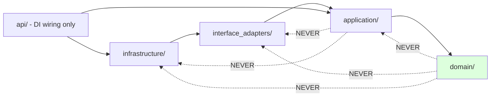
```mermaid
flowchart LR
    infra[infrastructure/] --> adapters[interface_adapters/]
    adapters --> app[application/]
    app --> domain[domain/]
    api[api/ - DI wiring only] --> infra
    api --> app
    domain -.->|NEVER| app
    domain -.->|NEVER| adapters
    domain -.->|NEVER| infra
    app -.->|NEVER| adapters
    app -.->|NEVER| infra
    style domain fill:#dfd
    style app fill:#eef
```

Dashed lines mark **forbidden** imports. If you ever write `from infrastructure... import ...` inside `domain/` or `application/`, that's a Clean Architecture violation — catch it in code review or with an import-linter rule (e.g., the `import-linter` Python package with a `layers` contract).

### 1.10 Advantages

- **Testability:** `RiskCalculator` and `ScoreResourceRiskUseCase` can be unit-tested with in-memory fake repositories — no Docker, no database, tests run in milliseconds.
- **Independence from frameworks:** FastAPI could be replaced by Flask or gRPC without touching business logic.
- **Independence from databases:** PostgreSQL, Neo4j, or a future vector database can be swapped behind their interfaces.
- **Parallel team velocity:** one team builds the Discovery Engine, another builds the Risk Engine, and they only share `domain/` entity contracts — merge conflicts stay low.
- **Long system lifespan:** CSPM platforms live 5–10+ years in enterprises; Clean Architecture amortizes cost over that lifespan.

### 1.11 Disadvantages

- **Upfront ceremony:** for ComplianceIQ's MVP with 3 engineers and one cloud provider, writing 4 layers for a simple CRUD endpoint (e.g., "list cloud accounts") is genuinely more code than a straightforward FastAPI + SQLAlchemy app.
- **Indirection tax:** new engineers must learn to "follow the interface" across 3 files before finding the real logic — this can slow onboarding.
- **Over-abstraction risk:** teams sometimes create interfaces for things that will never have a second implementation ("YAGNI" violations), adding cost without payoff.
- **Requires discipline:** the architecture provides no runtime enforcement; only code review, linting (`import-linter`), and CI checks stop violations from creeping in.

### 1.12 Common Mistakes

1. **Anemic domain layer used as a DTO bag.** Entities with no behavior (`resolve()`, `escalate()`) mean business rules leaked into use cases or, worse, controllers.
2. **Repository interfaces shaped like ORMs.** e.g., `get_all()`, `filter(**kwargs)` — this leaks SQLAlchemy's query API into the domain. Interfaces should be *use-case shaped*: `list_open_findings_for_account(account_id)`, not generic filters.
3. **Fat controllers.** Business logic (like deduplication rules) written directly inside a FastAPI route "just to move fast" — this is the #1 way Clean Architecture rots over 6 months.
4. **Using SQLAlchemy models as domain entities directly.** This couples the domain to the ORM; a migration or ORM swap then forces domain-layer rewrites.
5. **Skipping the mapper.** Not converting between ORM model ↔ domain entity ↔ Pydantic schema, and instead passing one object through all three layers, silently defeating the whole purpose.
6. **Circular dependency between use cases.** `EvaluatePolicyUseCase` calling `ScoreResourceRiskUseCase` directly instead of both being orchestrated by a higher-level workflow — use cases should generally not call each other; a coordinating service or event should sit above them.

### 1.13 Real-World Analogy

Think of a restaurant. The **chef's recipe knowledge** (how to make a perfect risotto) is the **domain layer** — it doesn't care which stove, oven brand, or which supplier delivered the rice. The **kitchen workflow** (order comes in → prep → cook → plate) is the **use case layer**. The **waiter taking your order and bringing the plate back** is the **interface adapter**. The **specific stove, fridge brand, and POS system** is **infrastructure** — replaceable without changing how risotto is made.

### 1.14 Interview Questions

1. What is the Dependency Rule, and why must it point inward?
2. Why does Clean Architecture define repository interfaces inside the domain layer rather than the infrastructure layer?
3. Give an example of a decision in ComplianceIQ that belongs in an Entity vs. a Use Case.
4. How would you enforce Clean Architecture boundaries automatically in CI?
5. What's the difference between Hexagonal Architecture and Clean Architecture, and where do they agree?
6. When would you *not* recommend Clean Architecture for a project?
7. How does Dependency Injection relate to the Dependency Inversion Principle — are they the same thing?

### 1.15 Exercises

1. Write the `ResourceRepository` abstract interface with methods needed by the Discovery Engine (`save`, `get_by_arn`, `list_by_account`), then implement two versions: `PostgresResourceRepository` and an `InMemoryResourceRepository` for tests.
2. Take a "fat controller" that computes finding severity inline inside a FastAPI route, and refactor it into a proper `Entity` + `UseCase` split.
3. Draw (by hand or Mermaid) the full layer diagram for the **Attack Path Engine**, identifying which classes live in which layer.
4. Configure `import-linter` with a `contract` that fails CI if `domain/` imports anything from `infrastructure/`.

### 1.16 Summary

Clean Architecture organizes ComplianceIQ into four concentric layers — Entities, Use Cases, Interface Adapters, Frameworks & Drivers — with a single unbreakable rule: **dependencies point inward, never outward**. This isolates the expensive-to-get-right business logic (risk scoring, policy evaluation, deduplication) from the cheap-to-replace technical details (which database, which web framework, which cloud SDK), buying long-term flexibility and testability at the cost of some upfront structure.

### 1.17 Checklist

- [ ] Every entity has behavior, not just data (no anemic domain model).
- [ ] Every repository is an interface defined in `domain/`, implemented in `infrastructure/`.
- [ ] No `import` of FastAPI, SQLAlchemy, or Neo4j driver inside `domain/` or `application/`.
- [ ] DI wiring lives only in `api/dependencies.py`.
- [ ] Unit tests for use cases run without Docker/DB.
- [ ] `import-linter` (or equivalent) enforces the Dependency Rule in CI.
- [ ] Controllers are thin: parse → call use case → present. No business rules inline.

---
<a name="part-2"></a>
## Part 2 — Domain-Driven Design (DDD)

### 2.0 Why DDD, and Why It Pairs With Clean Architecture

**Beginner explanation:** Clean Architecture tells you *where* to put code (which layer). DDD tells you *how to shape* the code inside the domain layer — what objects should exist, what they're called, and what rules they enforce. Clean Architecture is the building's floor plan; DDD is the interior design of the most important room (the domain layer).

**Advanced explanation:** DDD, introduced by Eric Evans in his 2003 book *Domain-Driven Design: Tackling Complexity in the Heart of Software*, is a set of practices for modeling complex business domains so that the code structure mirrors the mental model experts use. ComplianceIQ's domain — cloud security posture — is genuinely complex (multi-cloud resource types, compliance frameworks, evolving attack techniques), which is exactly the complexity threshold where DDD pays off. A simple domain (e.g., a to-do list app) does not need DDD.

### 2.1 Domain

**Definition:** The subject matter the software addresses — the sphere of knowledge and activity around which the business revolves.

**Why it exists:** Naming "the domain" explicitly forces the team to agree on scope before writing code.

**Analogy:** A hospital's domain is patient care; a bank's domain is money movement and risk.

**ComplianceIQ example:** The domain is **Cloud Security Posture Management** — discovering cloud assets, evaluating them against policies and compliance frameworks, and surfacing prioritized risk.

### 2.2 Subdomain

**Definition:** A domain is usually too large to model as one coherent thing; it's decomposed into subdomains, classified as:
- **Core subdomain** — the part that gives competitive advantage; deserves the most design investment.
- **Supporting subdomain** — necessary, but not differentiating.
- **Generic subdomain** — solved problems, ideally bought/reused, not built.

**ComplianceIQ example:**

| Subdomain | Type | Why |
|---|---|---|
| Risk Intelligence Engine | **Core** | This is ComplianceIQ's actual product differentiator — how well it scores risk. |
| Attack Path Engine | **Core** | Graph-based attack path analysis is a key competitive differentiator. |
| Policy Intelligence Engine | **Core** | Quality/breadth of policy rules is central value. |
| Discovery Engine | **Supporting** | Necessary, but "list my AWS resources" is not differentiating by itself. |
| Normalization Engine | **Supporting** | Necessary plumbing to make Core subdomains possible. |
| Authentication / Tenant Billing | **Generic** | Use Auth0/Stripe-like solutions; don't reinvent. |

This classification directly drives *where you spend engineering effort*: Risk Intelligence Engine deserves your best architects; billing does not.

### 2.3 Ubiquitous Language

**Definition:** A shared vocabulary used identically by domain experts (security analysts, compliance officers) and by code (class names, method names) — with **zero translation layer** between what a security analyst says in a meeting and what appears in the codebase.

**Why it exists:** Without it, engineers invent their own words ("issue", "alert", "violation") for the same concept a security analyst calls a "Finding," causing miscommunication and subtle bugs.

**Analogy:** Air traffic controllers and pilots share exact phrases ("cleared for takeoff") — not paraphrases — precisely because ambiguity is dangerous.

**ComplianceIQ example:** The team must agree: is it a "Finding," an "Issue," or a "Violation"? ComplianceIQ picks **Finding** to be the term across code, API responses, UI, and Slack alerts. A `class Issue` anywhere in the codebase is now recognizable as a Ubiquitous Language violation and a code-review red flag.

| Business term | Code representation |
|---|---|
| Finding | `class Finding` |
| Blast Radius | `class BlastRadius` (value object) |
| Attack Path | `class AttackPath` |
| Compliance Control | `class ComplianceControl` |
| Cloud Account | `class CloudAccount` (aggregate root) |

### 2.4 Entities

**Definition:** Domain objects defined by a **persistent identity** that survives over time even as attributes change. Two entities with identical attributes but different IDs are different entities.

**Why it exists:** Some things in the domain are fundamentally about *identity and lifecycle* ("this exact S3 bucket, tracked since discovery"), not just current values.

**Analogy:** You are the same person (same identity) even though your hair color, weight, and address change over your life.

**ComplianceIQ example:** `Resource` is an Entity — identified by its ARN/resource ID, its `tags`, `configuration`, and `risk_score` can all change over time, but it's still "the same resource."

```python
# domain/entities/resource.py
from dataclasses import dataclass, field
from datetime import datetime

@dataclass
class Resource:
    id: str                      # identity — e.g., ARN. Defines equality.
    resource_type: str
    cloud_account_id: str
    configuration: dict = field(default_factory=dict)
    tags: dict = field(default_factory=dict)
    last_seen_at: datetime = field(default_factory=datetime.utcnow)

    def __eq__(self, other) -> bool:
        return isinstance(other, Resource) and self.id == other.id

    def mark_seen(self) -> None:
        self.last_seen_at = datetime.utcnow()

    def update_configuration(self, new_config: dict) -> None:
        self.configuration = new_config
        self.mark_seen()
```

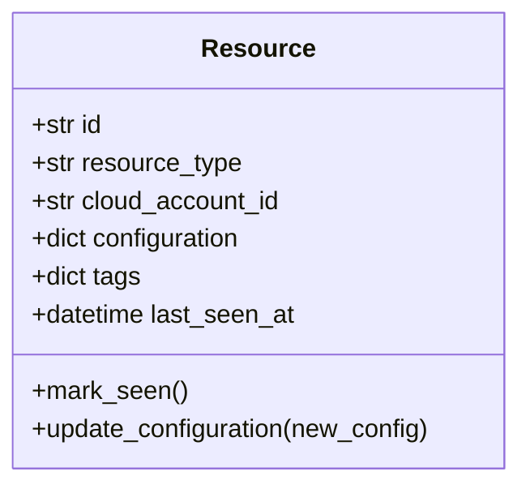
```mermaid
classDiagram
    class Resource {
      +str id
      +str resource_type
      +str cloud_account_id
      +dict configuration
      +dict tags
      +datetime last_seen_at
      +mark_seen()
      +update_configuration(new_config)
    }
```

### 2.5 Value Objects

**Definition:** Domain objects defined entirely by their **attributes**, with **no identity** — two value objects with the same attributes are interchangeable and equal. Value objects are typically **immutable**.

**Why it exists:** Not everything needs identity tracking; forcing identity onto things like "an amount of money" or "a risk band" adds needless complexity. Value Objects also let you attach validation/behavior to primitive-looking data ("primitive obsession" antidote).

**Analogy:** Two ten-dollar bills are interchangeable — nobody tracks "this specific bill" as distinct from another ten-dollar bill (in casual use). Only the *value* ($10) matters.

**ComplianceIQ example:** `BlastRadius` (how many downstream resources are reachable), `RiskScore`, and `Arn` are Value Objects.

```python
# domain/value_objects/risk_score.py
from dataclasses import dataclass
from enum import Enum

class RiskBand(str, Enum):
    LOW = "LOW"
    MEDIUM = "MEDIUM"
    HIGH = "HIGH"
    CRITICAL = "CRITICAL"

@dataclass(frozen=True)  # frozen => immutable, enforces Value Object semantics
class RiskScore:
    value: float          # 0.0 - 100.0
    band: RiskBand

    def __post_init__(self):
        if not (0.0 <= self.value <= 100.0):
            raise ValueError("RiskScore.value must be between 0 and 100")

    @staticmethod
    def from_value(value: float) -> "RiskScore":
        if value >= 90:
            band = RiskBand.CRITICAL
        elif value >= 70:
            band = RiskBand.HIGH
        elif value >= 40:
            band = RiskBand.MEDIUM
        else:
            band = RiskBand.LOW
        return RiskScore(value=value, band=band)
```

Two `RiskScore(value=85.0, band=RiskBand.HIGH)` instances are **equal** — `dataclass` auto-generates value equality — regardless of which `Resource` they're attached to. That's the Value Object contract.

### 2.6 Aggregates & Aggregate Root

**Definition:** An **Aggregate** is a cluster of related Entities and Value Objects treated as a single consistency boundary — all changes to anything inside the aggregate go through one designated **Aggregate Root**, which is the only object external code is allowed to reference directly.

**Why it exists:** Without aggregates, any part of the code could mutate any nested object directly, making it impossible to guarantee invariants ("a CloudAccount cannot have more than one primary owner" or "a Finding cannot exist without a valid Resource"). The Aggregate Root is the gatekeeper.

**Analogy:** A car is an aggregate: the engine, wheels, and doors are internal parts you don't interact with directly from outside — you interact with "the car" (start it, lock it), and the car coordinates its internal parts. You don't reach in and rewire the engine from the driver's seat.

**ComplianceIQ example:** `CloudAccount` is the Aggregate Root for a cluster containing `Resource` entities discovered within it. You never fetch a `Resource` and mutate it in isolation without going through account-level invariants (e.g., "a suspended CloudAccount cannot have new resources added").

```python
# domain/entities/cloud_account.py
from dataclasses import dataclass, field
from domain.entities.resource import Resource

@dataclass
class CloudAccount:
    """Aggregate Root."""
    id: str
    provider: str            # AWS | AZURE | GCP
    status: str = "ACTIVE"   # ACTIVE | SUSPENDED
    _resources: dict[str, Resource] = field(default_factory=dict)

    def add_resource(self, resource: Resource) -> None:
        if self.status == "SUSPENDED":
            raise ValueError("Cannot add resources to a suspended CloudAccount.")
        if resource.cloud_account_id != self.id:
            raise ValueError("Resource does not belong to this CloudAccount.")
        self._resources[resource.id] = resource

    def get_resource(self, resource_id: str) -> Resource | None:
        return self._resources.get(resource_id)

    def suspend(self) -> None:
        self.status = "SUSPENDED"
```

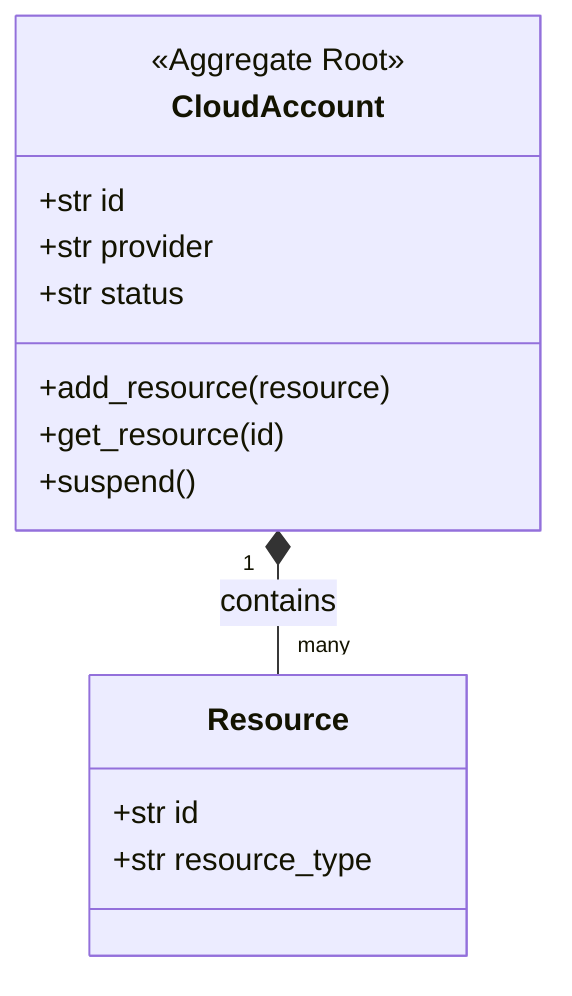
```mermaid
classDiagram
    class CloudAccount {
      <<Aggregate Root>>
      +str id
      +str provider
      +str status
      +add_resource(resource)
      +get_resource(id)
      +suspend()
    }
    class Resource {
      +str id
      +str resource_type
    }
    CloudAccount "1" *-- "many" Resource : contains
```

**Design decision for ComplianceIQ:** given the scale (millions of resources), we do **not** load the entire `CloudAccount` with all resources into memory as one aggregate for every operation — that's the classic "aggregate too large" DDD mistake. Instead, `Resource` is treated as its **own aggregate root** for most write operations (discovery, risk scoring), and `CloudAccount` is a smaller aggregate root only for account-level invariants (status, credentials, ownership). This is a deliberate deviation from naive DDD taught in textbooks, justified by ComplianceIQ's scale — a case study in *why understanding the "why" behind a pattern lets you adapt it*.

### 2.7 Domain Services

**Definition:** Stateless operations that don't naturally belong to any single Entity or Value Object, typically because they operate *across* multiple aggregates.

**Why it exists:** Forcing every operation onto some Entity leads to awkward, unnatural methods (e.g., should `Resource.calculateRisk()` reach into `Finding` and `BlastRadius` objects it doesn't own? No — that violates single responsibility).

**Analogy:** A tax accountant is a domain service — they compute your tax bill by combining data from multiple independent sources (income, deductions, property), but they aren't "part of" your bank account or your house.

**ComplianceIQ example:** `RiskCalculator` (shown earlier) is a Domain Service: it takes a `Resource`, a list of `Finding`s, and a `BlastRadius`, none of which own the calculation logic individually.

```python
# domain/services/risk_calculator.py
from domain.entities.resource import Resource
from domain.entities.finding import Finding
from domain.value_objects.blast_radius import BlastRadius
from domain.value_objects.risk_score import RiskScore

class RiskCalculator:
    """Domain Service: stateless, operates across multiple domain objects."""

    def calculate(
        self, resource: Resource, findings: list[Finding], blast_radius: BlastRadius
    ) -> RiskScore:
        base = sum(self._severity_weight(f) for f in findings)
        exposure_multiplier = 1 + (blast_radius.reachable_resource_count / 100)
        raw = min(base * exposure_multiplier, 100.0)
        return RiskScore.from_value(raw)

    @staticmethod
    def _severity_weight(finding: Finding) -> float:
        return {"LOW": 2, "MEDIUM": 8, "HIGH": 20, "CRITICAL": 40}[finding.severity.value]
```

### 2.8 Application Services

**Definition:** Thin orchestrators (equivalent to Clean Architecture's Use Cases) that coordinate domain services, repositories, and transactions to fulfill one application-level task, but contain **no business rules themselves**.

**ComplianceIQ example:** `ScoreResourceRiskUseCase` from Part 1 *is* the Application Service — it fetches data via repositories and delegates the actual calculation to the `RiskCalculator` Domain Service. This is the direct bridge between DDD vocabulary and Clean Architecture vocabulary: **Application Service == Use Case**.

### 2.9 Repositories

**Definition:** An abstraction that provides the illusion of an in-memory collection of Aggregate Roots, hiding persistence details entirely.

**Why it exists:** Domain and application code should think "give me the CloudAccount with this ID" — not "run this SQL join." Decoupling persistence mechanics from domain logic.

**Analogy:** A librarian who fetches a book for you — you don't need to know which shelf, warehouse, or filing system stores it.

**ComplianceIQ example:** (shown in Part 1) `ResourceRepository` interface defined in `domain/repositories/`, implemented in `infrastructure/persistence/`.

```python
# domain/repositories/resource_repository.py
from abc import ABC, abstractmethod
from domain.entities.resource import Resource

class ResourceRepository(ABC):
    @abstractmethod
    def get_by_id(self, resource_id: str) -> Resource: ...

    @abstractmethod
    def save(self, resource: Resource) -> None: ...

    @abstractmethod
    def list_by_account(self, cloud_account_id: str) -> list[Resource]: ...
```

### 2.10 Factories

**Definition:** Objects (or static methods) responsible for constructing complex Entities/Aggregates, encapsulating creation rules so client code doesn't need to know internal invariants.

**Why it exists:** Some objects require complex, multi-step, or conditional construction (e.g., building a `Resource` from three different raw cloud provider payload shapes); scattering that logic across the codebase invites bugs.

**Analogy:** A car factory assembly line — you don't personally weld the frame and wire the electronics; you receive a finished, validated car.

**ComplianceIQ example:** `ResourceFactory` builds a normalized `Resource` entity from raw AWS/Azure/GCP JSON payloads — this is precisely the job of the **Normalization Engine**.

```python
# domain/factories/resource_factory.py
from domain.entities.resource import Resource

class ResourceFactory:
    """Encapsulates the rules for turning raw cloud payloads into a Resource entity."""

    @staticmethod
    def from_aws_payload(payload: dict, cloud_account_id: str) -> Resource:
        return Resource(
            id=payload["Arn"],
            resource_type=ResourceFactory._map_aws_type(payload["ResourceType"]),
            cloud_account_id=cloud_account_id,
            configuration=payload.get("Configuration", {}),
            tags={t["Key"]: t["Value"] for t in payload.get("Tags", [])},
        )

    @staticmethod
    def _map_aws_type(aws_type: str) -> str:
        mapping = {
            "AWS::S3::Bucket": "STORAGE_BUCKET",
            "AWS::EC2::Instance": "VIRTUAL_MACHINE",
            "AWS::IAM::Role": "IAM_ROLE",
        }
        return mapping.get(aws_type, "UNKNOWN")
```

This factory *is* the Universal Resource Model in action: whatever cloud-specific shape comes in, `ResourceFactory` guarantees a normalized `Resource` entity comes out.

### 2.11 Domain Events

**Definition:** Objects representing "something significant happened in the domain, in the past" — used to decouple side effects from the operation that caused them.

**Why it exists:** When a `Finding` is created, many things should happen: notify Slack, update the Knowledge Graph, recompute the account's overall risk posture, trigger the Compliance Intelligence Engine. Hard-coding all of these inside `BuildFindingUseCase` bloats it and couples unrelated concerns. Domain Events let each concern subscribe independently.

**Analogy:** A fire alarm going off (the Event) doesn't itself evacuate the building, call the fire department, and shut off gas lines — each system independently reacts to the alarm signal.

**ComplianceIQ example:**

```python
# domain/events/finding_created.py
from dataclasses import dataclass
from datetime import datetime

@dataclass(frozen=True)
class FindingCreated:
    finding_id: str
    resource_id: str
    severity: str
    occurred_at: datetime
```

```python
# application/use_cases/build_finding.py
class BuildFindingUseCase:
    def __init__(self, finding_repo, event_bus):
        self._finding_repo = finding_repo
        self._event_bus = event_bus

    def execute(self, finding: "Finding") -> None:
        self._finding_repo.save(finding)
        self._event_bus.publish(
            FindingCreated(
                finding_id=finding.id,
                resource_id=finding.resource_id,
                severity=finding.severity.value,
                occurred_at=finding.created_at,
            )
        )
```

Subscribers (in `infrastructure/messaging/`) can independently react: `SlackNotifierSubscriber`, `GraphSyncSubscriber`, `ComplianceMapperSubscriber` — none of which `BuildFindingUseCase` needs to know about.

### 2.12 Bounded Context

**Definition:** An explicit boundary within which a particular domain model — and its Ubiquitous Language — is valid and internally consistent. The same word can mean different things in different Bounded Contexts, and that's *allowed and expected*.

**Why it exists:** A single, unified model across an entire large system becomes impossibly bloated and contradictory (e.g., "Resource" means something different to the Discovery Engine than to the Billing system). Bounded Contexts let each subdomain have its own precise model, connected via well-defined integration contracts (Context Mapping).

**Analogy:** In a hospital, "Patient" in the Billing department's context (a name, an insurance ID, an address) is a very different model from "Patient" in the Cardiology department's context (a name, vitals, an ECG history) — same word, deliberately different models, integrated through shared identifiers.

**ComplianceIQ example — Bounded Contexts:**

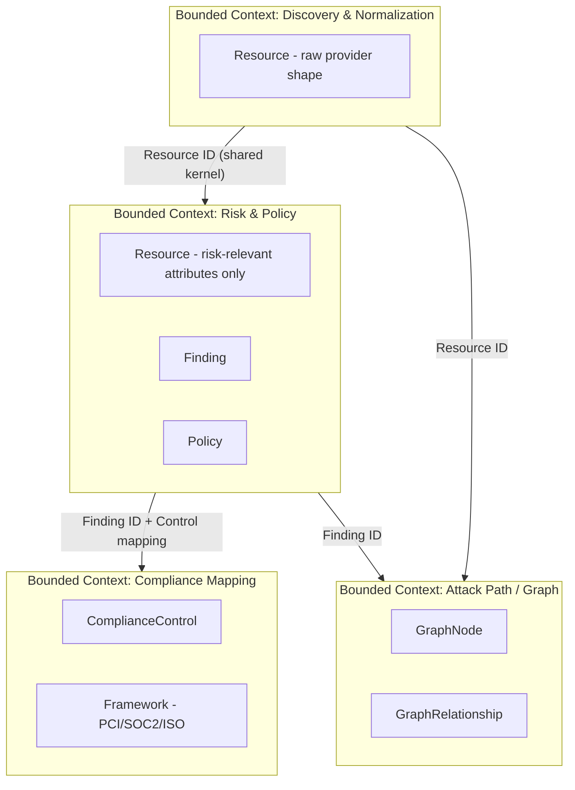
```mermaid
flowchart TB
    subgraph BC1["Bounded Context: Discovery & Normalization"]
      R1[Resource - raw provider shape]
    end
    subgraph BC2["Bounded Context: Risk & Policy"]
      R2[Resource - risk-relevant attributes only]
      F[Finding]
      P[Policy]
    end
    subgraph BC3["Bounded Context: Compliance Mapping"]
      CC[ComplianceControl]
      Fw[Framework - PCI/SOC2/ISO]
    end
    subgraph BC4["Bounded Context: Attack Path / Graph"]
      Node[GraphNode]
      Rel[GraphRelationship]
    end

    BC1 -- "Resource ID (shared kernel)" --> BC2
    BC2 -- "Finding ID + Control mapping" --> BC3
    BC1 -- "Resource ID" --> BC4
    BC2 -- "Finding ID" --> BC4
```

In the **Discovery Context**, "Resource" carries full raw cloud metadata. In the **Risk & Policy Context**, "Resource" is a lean projection: just what's needed to score risk (type, exposure, config flags). In the **Attack Path Context**, the same resource is represented purely as a graph node with relationships. These are three different models of the same real-world thing, each fit for its context's purpose — connected through the shared `resource_id`, which acts as a **Shared Kernel** identifier across contexts.

### 2.13 Designing the Full DDD Model for ComplianceIQ

**Bounded Contexts and their Aggregate Roots:**

| Bounded Context | Aggregate Root(s) | Core Entities | Value Objects | Domain Services |
|---|---|---|---|---|
| Discovery & Normalization | `CloudAccount` | `Resource` | `Arn`, `ResourceType` | `ResourceFactory`, `NormalizationService` |
| Policy Intelligence | `Policy` | `PolicyRule` | `Condition`, `Severity` | `PolicyEvaluator` |
| Context Intelligence | `ResourceContext` | — | `ExposureLevel`, `DataSensitivity` | `ContextEnricher` |
| Risk Intelligence | `Resource` (risk view) | `Finding` | `RiskScore`, `BlastRadius` | `RiskCalculator` |
| Compliance Intelligence | `ComplianceControl` | `Framework` | `ControlMapping` | `ComplianceMapper` |
| Attack Path | `AttackPath` | `GraphNode`, `GraphRelationship` | `PathScore` | `AttackPathFinder` |
| Finding Management | `Finding` | — | `FindingStatus` | `FindingDeduplicator`, `FindingBuilder` |

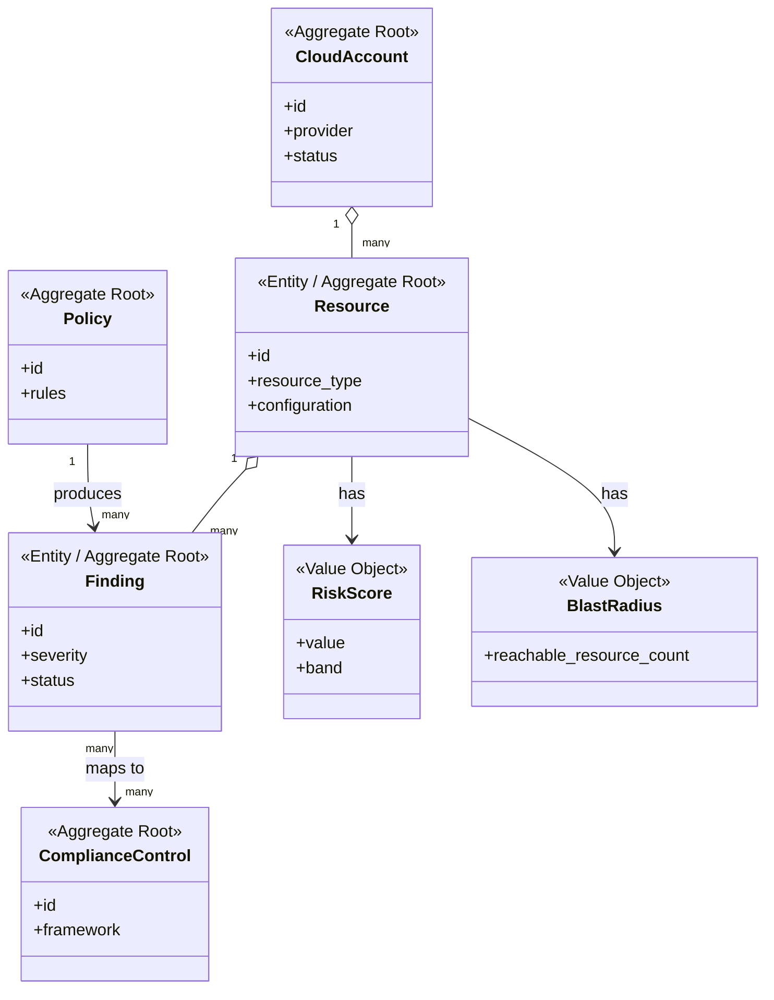
```mermaid
classDiagram
    class CloudAccount {
      <<Aggregate Root>>
      +id
      +provider
      +status
    }
    class Resource {
      <<Entity / Aggregate Root>>
      +id
      +resource_type
      +configuration
    }
    class Finding {
      <<Entity / Aggregate Root>>
      +id
      +severity
      +status
    }
    class Policy {
      <<Aggregate Root>>
      +id
      +rules
    }
    class ComplianceControl {
      <<Aggregate Root>>
      +id
      +framework
    }
    class RiskScore {
      <<Value Object>>
      +value
      +band
    }
    class BlastRadius {
      <<Value Object>>
      +reachable_resource_count
    }

    CloudAccount "1" o-- "many" Resource
    Resource "1" o-- "many" Finding
    Policy "1" --> "many" Finding : produces
    Finding "many" --> "many" ComplianceControl : maps to
    Resource --> RiskScore : has
    Resource --> BlastRadius : has
```

### 2.14 Beginner + Advanced Summary Table

| Concept | Beginner definition | Advanced definition |
|---|---|---|
| Domain | The subject the app is about | The sphere of knowledge/activity the software models |
| Subdomain | A slice of the domain | Core/Supporting/Generic classification driving investment |
| Ubiquitous Language | Same words, everywhere | Shared vocabulary eliminating translation between experts and code |
| Entity | A "thing" with an ID | Object defined by continuity of identity over time |
| Value Object | A "thing" with no ID, just data | Immutable object defined purely by attribute equality |
| Aggregate | A group of related things | Consistency boundary enforced by its root |
| Aggregate Root | The "front door" object | Sole external reference point into an aggregate |
| Domain Service | Logic that doesn't fit one object | Stateless cross-aggregate business operation |
| Application Service | The "conductor" | Use-case orchestration without business rules |
| Repository | A magic list you can query | Abstraction hiding persistence behind a collection-like interface |
| Factory | A thing that builds other things correctly | Encapsulates complex/invariant-preserving construction logic |
| Domain Event | "Something happened" | Immutable record of a significant past domain occurrence, enabling decoupled reactions |
| Bounded Context | A zone where words mean one thing | Explicit boundary of model + language validity, integrated via Context Mapping |

### 2.15 Common Mistakes

1. **God aggregate:** loading `CloudAccount` with all its resources every time — kills performance at scale (ComplianceIQ handles millions of resources).
2. **Anemic entities:** entities as pure data holders with all logic living in services — loses DDD's core benefit of behavior-rich models.
3. **Leaking Value Objects' immutability:** mutating a `RiskScore` in place instead of creating a new instance.
4. **One model to rule them all:** trying to have a single `Resource` class shared verbatim across Discovery, Risk, and Compliance contexts — leads to a bloated class nobody can safely change.
5. **Confusing Domain Service with Application Service:** putting business rules (e.g., severity weighting) into the Application Service/Use Case instead of a Domain Service — breaks testability and reuse.
6. **Repository interfaces that mirror ORMs:** `filter(**kwargs)`-style generic query methods leak persistence concerns into the domain.

### 2.16 Interview Questions

1. What distinguishes an Entity from a Value Object, and why does `Resource` qualify as an Entity while `RiskScore` doesn't?
2. Why would ComplianceIQ deliberately have *different* models of "Resource" in different Bounded Contexts instead of one canonical `Resource` class?
3. What invariant does the `CloudAccount` aggregate root protect that a bare `Resource` couldn't protect alone?
4. When should logic live in a Domain Service instead of an Entity method?
5. How do Domain Events help decouple the Finding Builder from downstream consumers like Slack notifications or the Knowledge Graph sync?
6. Explain Context Mapping and how ComplianceIQ's Discovery Context and Attack Path Context stay integrated without sharing a full domain model.

### 2.17 Exercises

1. Model `Policy` and `PolicyRule` as an Aggregate: define the invariant that a `Policy` cannot be `ACTIVE` with zero rules, and enforce it in code.
2. Write a `FindingDeduplicator` Domain Service that takes a list of raw findings from multiple engines and merges duplicates pointing at the same `resource_id` + `policy_id`.
3. Design the Bounded Context map for adding a brand-new subdomain: **Remediation** (auto-fixing misconfigurations). Which existing contexts does it need to integrate with, and via which shared identifiers?

### 2.18 Summary

DDD gives ComplianceIQ's domain layer its actual shape: Entities and Value Objects capture "what things are," Aggregates protect invariants, Domain Services capture cross-object logic, Repositories and Factories manage persistence and construction, Domain Events decouple side effects, and Bounded Contexts prevent one giant tangled model from strangling the system as ComplianceIQ grows from one cloud provider to many, and from one compliance framework to dozens.

### 2.19 Checklist

- [ ] Every Bounded Context has its own explicit model — no cross-context "one true Resource class."
- [ ] Aggregate Roots are the only entry points for mutating their internals.
- [ ] Value Objects are immutable (`frozen=True` dataclasses or equivalent).
- [ ] Cross-aggregate logic lives in Domain Services, not smeared across entities.
- [ ] Side effects of significant domain occurrences are modeled as Domain Events, not inline calls.
- [ ] Ubiquitous Language terms (Finding, Blast Radius, Attack Path) are used identically in code, API, and UI.

---
<a name="part-3"></a>
## Part 3 — Design Patterns for ComplianceIQ

We only cover patterns that earn their place in ComplianceIQ. Each pattern below maps to a real, recurring problem in the system.

### 3.1 Repository Pattern

**Problem solved:** Business/application code needs to fetch and persist Aggregates without knowing whether they live in PostgreSQL, Neo4j, or an in-memory test double.

**Why to use it:** Enables swapping PostgreSQL for another store; enables blazing-fast unit tests with fakes; centralizes query logic instead of scattering SQL/Cypher across the codebase.

**When NOT to use it:** For trivial CRUD admin tools with a short lifespan and one obvious persistence choice forever, a full Repository abstraction is overkill — direct ORM usage is fine.

**UML:**

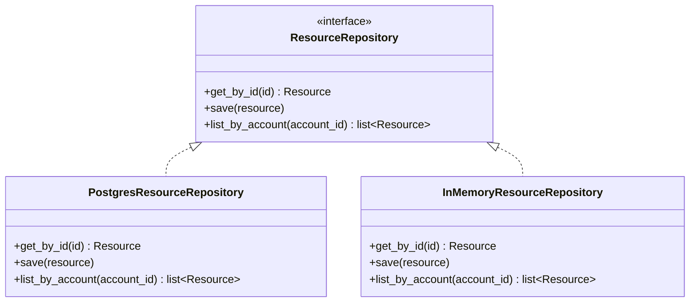
```mermaid
classDiagram
    class ResourceRepository {
      <<interface>>
      +get_by_id(id) Resource
      +save(resource)
      +list_by_account(account_id) list~Resource~
    }
    class PostgresResourceRepository {
      +get_by_id(id) Resource
      +save(resource)
      +list_by_account(account_id) list~Resource~
    }
    class InMemoryResourceRepository {
      +get_by_id(id) Resource
      +save(resource)
      +list_by_account(account_id) list~Resource~
    }
    ResourceRepository <|.. PostgresResourceRepository
    ResourceRepository <|.. InMemoryResourceRepository
```

**Python example (test double):**

```python
class InMemoryResourceRepository(ResourceRepository):
    def __init__(self):
        self._store: dict[str, Resource] = {}

    def get_by_id(self, resource_id: str) -> Resource:
        return self._store[resource_id]

    def save(self, resource: Resource) -> None:
        self._store[resource.id] = resource

    def list_by_account(self, cloud_account_id: str) -> list[Resource]:
        return [r for r in self._store.values() if r.cloud_account_id == cloud_account_id]
```

**FastAPI example:** shown in Part 1 §1.6 (`get_score_risk_use_case` injecting `PostgresResourceRepository`).

**ComplianceIQ placement:** `domain/repositories/` (interfaces) + `infrastructure/persistence/` and `infrastructure/graph/` (implementations).

---

### 3.2 Factory Pattern

**Problem solved:** Constructing a `Resource` entity correctly requires different logic per cloud provider (AWS vs. Azure vs. GCP payload shapes); client code shouldn't need to know these differences.

**Why to use it:** Centralizes and hides variant construction logic; supports the Open/Closed Principle — add GCP support by adding a new factory method/class, without touching existing AWS/Azure logic.

**When NOT to use it:** If there's truly only one, permanently-simple way to construct an object, a plain constructor is enough — don't add a Factory for a single trivial case.

**UML:**

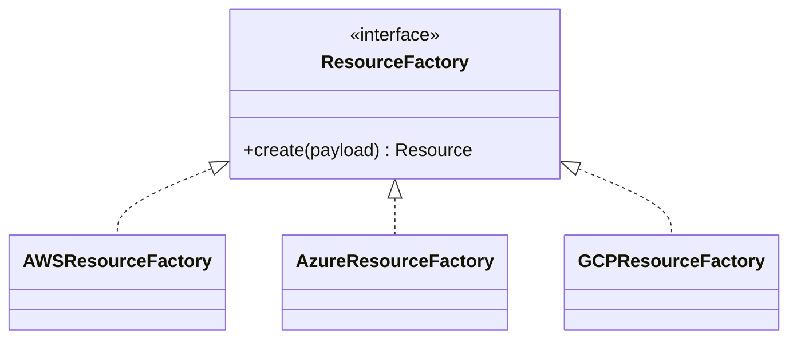
```mermaid
classDiagram
    class ResourceFactory {
      <<interface>>
      +create(payload) Resource
    }
    class AWSResourceFactory
    class AzureResourceFactory
    class GCPResourceFactory
    ResourceFactory <|.. AWSResourceFactory
    ResourceFactory <|.. AzureResourceFactory
    ResourceFactory <|.. GCPResourceFactory
```

**Python example:**

```python
class ResourceFactoryRegistry:
    _factories: dict[str, "ResourceFactory"] = {}

    @classmethod
    def register(cls, provider: str, factory: "ResourceFactory") -> None:
        cls._factories[provider] = factory

    @classmethod
    def create(cls, provider: str, payload: dict, account_id: str) -> Resource:
        return cls._factories[provider].create(payload, account_id)
```

**ComplianceIQ example:** The Normalization Engine calls `ResourceFactoryRegistry.create("AWS", payload, account_id)` — the Discovery Engine never needs an `if provider == "AWS"` branch scattered through its code.

**Placement:** `domain/factories/`.

---

### 3.3 Builder Pattern

**Problem solved:** Constructing a `Finding` requires assembling data progressively from *multiple engines* (Policy Engine gives the violation, Context Engine gives business context, Risk Engine gives the score, Compliance Engine gives framework mappings) — a single constructor call with 12 parameters is unreadable and error-prone.

**Why to use it:** Lets each engine contribute its piece step by step, validates completeness at the end, and produces an immutable final `Finding`.

**When NOT to use it:** If an object only ever needs 2-3 simple constructor args, a Builder is unnecessary ceremony.

**UML:**

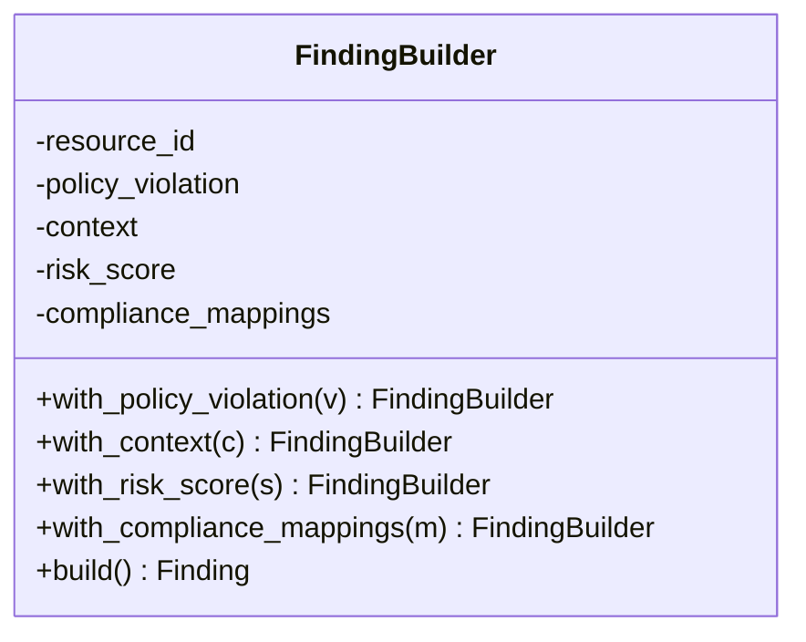
```mermaid
classDiagram
    class FindingBuilder {
      -resource_id
      -policy_violation
      -context
      -risk_score
      -compliance_mappings
      +with_policy_violation(v) FindingBuilder
      +with_context(c) FindingBuilder
      +with_risk_score(s) FindingBuilder
      +with_compliance_mappings(m) FindingBuilder
      +build() Finding
    }
```

**Python example:**

```python
class FindingBuilder:
    def __init__(self, resource_id: str, policy_id: str):
        self._resource_id = resource_id
        self._policy_id = policy_id
        self._context = None
        self._risk_score = None
        self._compliance_mappings: list[str] = []

    def with_context(self, context) -> "FindingBuilder":
        self._context = context
        return self

    def with_risk_score(self, risk_score) -> "FindingBuilder":
        self._risk_score = risk_score
        return self

    def with_compliance_mappings(self, mappings: list[str]) -> "FindingBuilder":
        self._compliance_mappings = mappings
        return self

    def build(self) -> Finding:
        if self._risk_score is None:
            raise ValueError("Cannot build a Finding without a RiskScore.")
        return Finding(
            resource_id=self._resource_id,
            policy_id=self._policy_id,
            context=self._context,
            risk_score=self._risk_score,
            compliance_mappings=self._compliance_mappings,
            # ... other required fields
        )
```

**ComplianceIQ example:** This *is* the literal implementation strategy for the **Finding Builder** feature named in your architecture — it's not a coincidence, it's the textbook use case for this pattern.

**Placement:** `application/use_cases/build_finding.py` or a dedicated `domain/factories/finding_builder.py` depending on whether you consider assembly a domain rule (favor `domain/`) or an orchestration step (favor `application/`). For ComplianceIQ, since assembly rules (e.g., "cannot build without risk score") are business rules, `domain/` is the better home.

---

### 3.4 Adapter Pattern

**Problem solved:** AWS, Azure, and GCP each expose wildly different SDKs and payload shapes for "give me all your resources." The Discovery Engine wants one uniform interface regardless of provider.

**Why to use it:** Isolates third-party SDK quirks (boto3 vs. azure-sdk vs. google-cloud) behind one contract; new providers plug in without touching Discovery Engine core logic.

**When NOT to use it:** If you will only ever integrate with one external system, forever, an adapter layer adds indirection with no future payoff (though for ComplianceIQ, multi-cloud is a core requirement, so this pattern is mandatory, not optional).

**UML:**

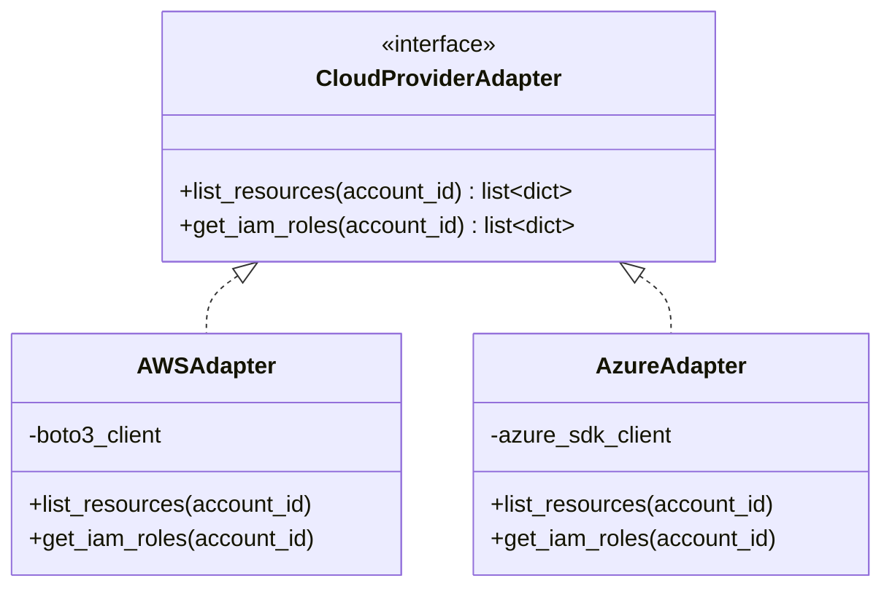
```mermaid
classDiagram
    class CloudProviderAdapter {
      <<interface>>
      +list_resources(account_id) list~dict~
      +get_iam_roles(account_id) list~dict~
    }
    class AWSAdapter {
      -boto3_client
      +list_resources(account_id)
      +get_iam_roles(account_id)
    }
    class AzureAdapter {
      -azure_sdk_client
      +list_resources(account_id)
      +get_iam_roles(account_id)
    }
    CloudProviderAdapter <|.. AWSAdapter
    CloudProviderAdapter <|.. AzureAdapter
```

**Python example:**

```python
# domain/repositories/cloud_provider_adapter.py  (interface, in domain)
from abc import ABC, abstractmethod

class CloudProviderAdapter(ABC):
    @abstractmethod
    def list_resources(self, account_id: str) -> list[dict]: ...

# infrastructure/cloud_providers/aws_adapter.py (implementation, in infrastructure)
import boto3

class AWSAdapter(CloudProviderAdapter):
    def __init__(self):
        self._client = boto3.client("resourcegroupstaggingapi")

    def list_resources(self, account_id: str) -> list[dict]:
        response = self._client.get_resources()
        return response["ResourceTagMappingList"]
```

**ComplianceIQ example:** The Discovery Engine's use case (`DiscoverResourcesUseCase`) depends only on `CloudProviderAdapter`; adding GCP support means writing `GCPAdapter`, with zero changes to Discovery orchestration logic.

**Placement:** interface in `domain/repositories/` (or a dedicated `domain/adapters/`), implementations in `infrastructure/cloud_providers/`.

---

### 3.5 Strategy Pattern

**Problem solved:** Risk scoring, or policy evaluation, may need multiple interchangeable algorithms (e.g., a simple "weighted severity" risk model vs. a "graph-centrality-weighted" risk model), selected at runtime per tenant or feature flag.

**Why to use it:** Lets you swap algorithms without `if/elif` chains scattered through the codebase, and lets different customers/tenants use different strategies cleanly.

**When NOT to use it:** If there's genuinely only one algorithm and no foreseeable need for a second, introducing a Strategy interface is speculative generality.

**UML:**

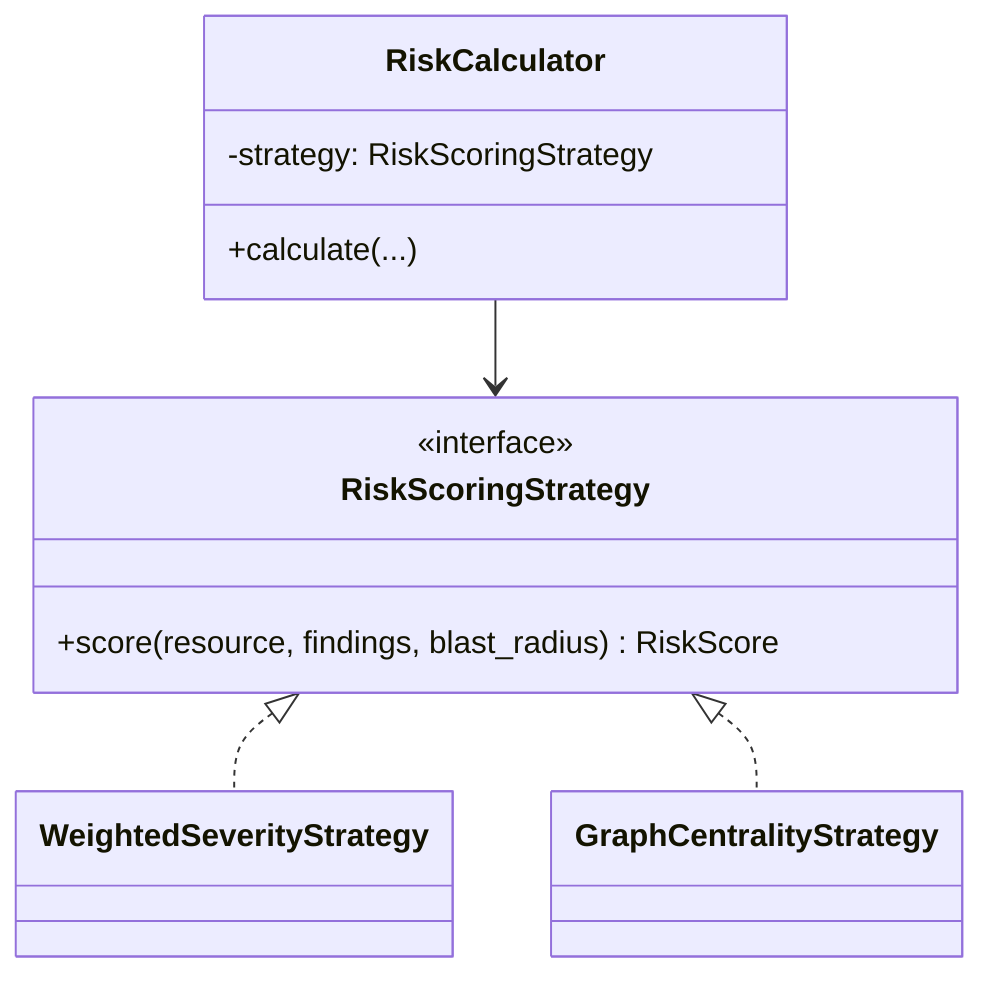
```mermaid
classDiagram
    class RiskScoringStrategy {
      <<interface>>
      +score(resource, findings, blast_radius) RiskScore
    }
    class WeightedSeverityStrategy
    class GraphCentralityStrategy
    RiskScoringStrategy <|.. WeightedSeverityStrategy
    RiskScoringStrategy <|.. GraphCentralityStrategy
    class RiskCalculator {
      -strategy: RiskScoringStrategy
      +calculate(...)
    }
    RiskCalculator --> RiskScoringStrategy
```

**Python example:**

```python
class RiskScoringStrategy(ABC):
    @abstractmethod
    def score(self, resource, findings, blast_radius) -> RiskScore: ...

class WeightedSeverityStrategy(RiskScoringStrategy):
    def score(self, resource, findings, blast_radius) -> RiskScore:
        base = sum(SEVERITY_WEIGHTS[f.severity] for f in findings)
        return RiskScore.from_value(min(base, 100.0))

class GraphCentralityStrategy(RiskScoringStrategy):
    def score(self, resource, findings, blast_radius) -> RiskScore:
        base = sum(SEVERITY_WEIGHTS[f.severity] for f in findings)
        centrality_boost = blast_radius.reachable_resource_count * 0.5
        return RiskScore.from_value(min(base + centrality_boost, 100.0))

class RiskCalculator:
    def __init__(self, strategy: RiskScoringStrategy):
        self._strategy = strategy

    def calculate(self, resource, findings, blast_radius) -> RiskScore:
        return self._strategy.score(resource, findings, blast_radius)
```

**FastAPI example:** the strategy chosen per-request can come from tenant configuration resolved in the DI provider:

```python
def get_risk_calculator(tenant_config = Depends(get_tenant_config)) -> RiskCalculator:
    strategy = (
        GraphCentralityStrategy() if tenant_config.uses_graph_scoring
        else WeightedSeverityStrategy()
    )
    return RiskCalculator(strategy)
```

**Placement:** `domain/services/strategies/`.

---

### 3.6 Specification Pattern

**Problem solved:** Policy rules in the Policy Intelligence Engine ("flag any S3 bucket that is public AND contains PII AND is in production") are compositions of boolean business conditions. Hardcoding these as nested `if` statements makes policies unreadable and impossible for non-engineers (compliance analysts) to reason about, and hard to combine (AND/OR/NOT).

**Why to use it:** Encapsulates a single business rule as an object that can answer `is_satisfied_by(resource)`, and specifications can be composed (`AND`, `OR`, `NOT`) to build arbitrarily complex policies from small, testable, reusable pieces.

**When NOT to use it:** For a handful of static, never-composed conditions, plain functions or `if` statements are simpler and clearer.

**UML:**

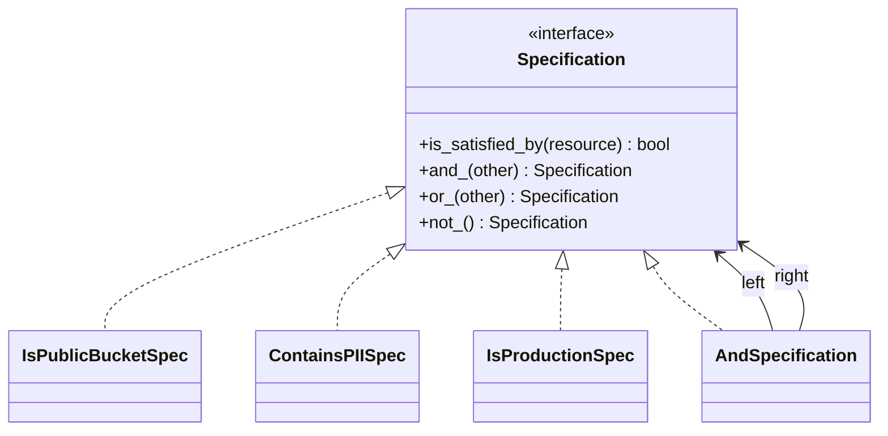
```mermaid
classDiagram
    class Specification {
      <<interface>>
      +is_satisfied_by(resource) bool
      +and_(other) Specification
      +or_(other) Specification
      +not_() Specification
    }
    class IsPublicBucketSpec
    class ContainsPIISpec
    class IsProductionSpec
    class AndSpecification
    Specification <|.. IsPublicBucketSpec
    Specification <|.. ContainsPIISpec
    Specification <|.. IsProductionSpec
    Specification <|.. AndSpecification
    AndSpecification --> Specification : left
    AndSpecification --> Specification : right
```

**Python example:**

```python
from abc import ABC, abstractmethod

class Specification(ABC):
    @abstractmethod
    def is_satisfied_by(self, resource: Resource) -> bool: ...

    def and_(self, other: "Specification") -> "Specification":
        return AndSpecification(self, other)

    def or_(self, other: "Specification") -> "Specification":
        return OrSpecification(self, other)

class AndSpecification(Specification):
    def __init__(self, left: Specification, right: Specification):
        self._left, self._right = left, right

    def is_satisfied_by(self, resource: Resource) -> bool:
        return self._left.is_satisfied_by(resource) and self._right.is_satisfied_by(resource)

class IsPublicBucketSpec(Specification):
    def is_satisfied_by(self, resource: Resource) -> bool:
        return resource.resource_type == "STORAGE_BUCKET" and resource.configuration.get("public_access", False)

class ContainsPIISpec(Specification):
    def is_satisfied_by(self, resource: Resource) -> bool:
        return resource.tags.get("data_classification") == "PII"

# Compose a policy rule from small, reusable pieces:
public_pii_bucket_policy = IsPublicBucketSpec().and_(ContainsPIISpec())

if public_pii_bucket_policy.is_satisfied_by(some_resource):
    raise_finding(some_resource)
```

**ComplianceIQ example:** This is the actual internal engine of the **Policy Intelligence Engine** — every policy is stored as a composed tree of Specifications (often serialized as JSON/YAML rule definitions that get parsed into a Specification tree at evaluation time).

**Placement:** `domain/services/specifications/`.

---

### 3.7 Dependency Injection

*(Deep-dived already in Part 1 §1.6.)* Quick recap in pattern-catalog form:

**Problem solved:** Objects need collaborators (repositories, services) but shouldn't be responsible for constructing them — construction and usage are different concerns.

**Why to use it:** Enables swapping implementations (real repo vs. fake repo in tests) without changing consuming code; centralizes object graph wiring in one place.

**When NOT to use it:** For tiny scripts or one-off tools, manual instantiation is simpler than introducing a DI framework.

**FastAPI example:** `Depends()` as shown in §1.6 — FastAPI's native DI is sufficient for ComplianceIQ; no need for a heavier third-party DI container.

**Placement:** `api/dependencies.py` exclusively.

---

### 3.8 Unit of Work

**Problem solved:** A single use case (e.g., `EvaluatePolicyUseCase`) may need to write to multiple repositories (`FindingRepository`, `ResourceRepository`) as **one atomic transaction** — either all writes succeed, or none do. Without coordination, you risk partial writes (a `Finding` saved but the `Resource`'s "last evaluated" timestamp not updated) if something fails mid-way.

**Why to use it:** Wraps multiple repository operations in a single transactional boundary, and tracks changed objects so a single `commit()` (or `rollback()`) applies consistently.

**When NOT to use it:** If every use case only ever touches one repository/one aggregate, plain repository `save()` calls with the ORM session's own transaction are sufficient — a Unit of Work adds no value.

**UML:**

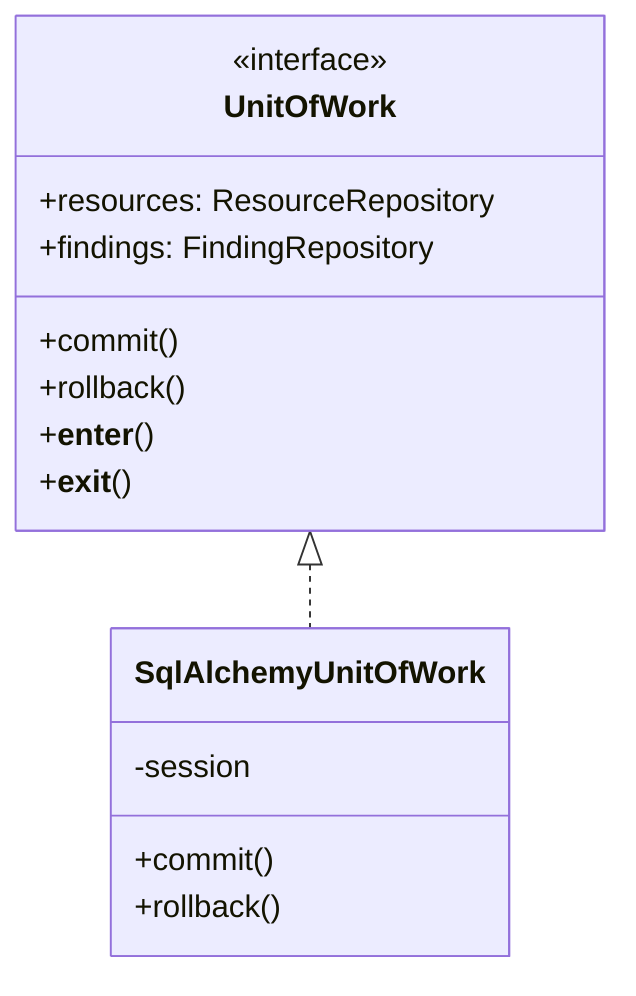
```mermaid
classDiagram
    class UnitOfWork {
      <<interface>>
      +resources: ResourceRepository
      +findings: FindingRepository
      +commit()
      +rollback()
      +__enter__()
      +__exit__()
    }
    class SqlAlchemyUnitOfWork {
      -session
      +commit()
      +rollback()
    }
    UnitOfWork <|.. SqlAlchemyUnitOfWork
```

**Python example:**

```python
class UnitOfWork(ABC):
    resources: ResourceRepository
    findings: FindingRepository

    def __enter__(self) -> "UnitOfWork":
        return self

    def __exit__(self, exc_type, exc_val, exc_tb):
        if exc_type is not None:
            self.rollback()
        else:
            self.commit()

    @abstractmethod
    def commit(self): ...
    @abstractmethod
    def rollback(self): ...


class SqlAlchemyUnitOfWork(UnitOfWork):
    def __init__(self, session_factory):
        self._session_factory = session_factory

    def __enter__(self):
        self._session = self._session_factory()
        self.resources = PostgresResourceRepository(self._session)
        self.findings = PostgresFindingRepository(self._session)
        return self

    def commit(self):
        self._session.commit()

    def rollback(self):
        self._session.rollback()
```

**Application layer usage:**

```python
class EvaluatePolicyUseCase:
    def __init__(self, uow_factory, policy_evaluator):
        self._uow_factory = uow_factory
        self._policy_evaluator = policy_evaluator

    def execute(self, resource_id: str) -> None:
        with self._uow_factory() as uow:
            resource = uow.resources.get_by_id(resource_id)
            findings = self._policy_evaluator.evaluate(resource)
            for finding in findings:
                uow.findings.save(finding)
            resource.mark_evaluated()
            uow.resources.save(resource)
            # __exit__ commits automatically if no exception was raised
```

**ComplianceIQ example:** Essential for the Policy Intelligence Engine — evaluating a resource against dozens of policies and writing many `Finding`s must be atomic per resource, so a mid-batch crash never leaves the resource half-evaluated.

**Placement:** interface in `domain/repositories/unit_of_work.py`, implementation in `infrastructure/persistence/sqlalchemy_uow.py`.

---

### 3.9 Where Every Pattern Lives — Master Map

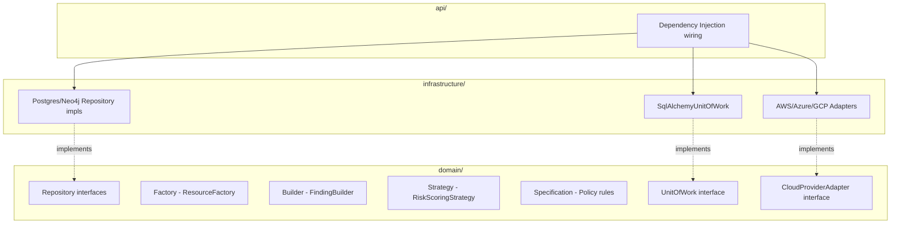
```mermaid
flowchart TB
    subgraph domain["domain/"]
      Repo[Repository interfaces]
      Factory[Factory - ResourceFactory]
      Builder[Builder - FindingBuilder]
      Strategy[Strategy - RiskScoringStrategy]
      Spec[Specification - Policy rules]
      UoWIface[UnitOfWork interface]
      AdapterIface[CloudProviderAdapter interface]
    end
    subgraph infra["infrastructure/"]
      RepoImpl[Postgres/Neo4j Repository impls]
      AdapterImpl[AWS/Azure/GCP Adapters]
      UoWImpl[SqlAlchemyUnitOfWork]
    end
    subgraph api["api/"]
      DI[Dependency Injection wiring]
    end

    RepoImpl -.implements.-> Repo
    AdapterImpl -.implements.-> AdapterIface
    UoWImpl -.implements.-> UoWIface
    DI --> RepoImpl
    DI --> AdapterImpl
    DI --> UoWImpl
```

### 3.10 Common Mistakes Across Patterns

1. **Using Strategy where Specification fits better** (or vice versa) — Strategy is for *algorithms* producing a result (risk scoring); Specification is for *boolean predicates* to combine (policy conditions). Confusing them muddies both.
2. **Fat Builders that also contain business rules better placed in entities** — `FindingBuilder.build()` should validate assembly completeness, not recompute severity logic that belongs in `RiskCalculator`.
3. **Repository leaking Unit-of-Work responsibility** — calling `.commit()` inside a repository method instead of leaving transaction boundaries to the Unit of Work causes partial-write bugs.
4. **Adapter pattern without a shared interface** — writing separate, uncoordinated AWS/Azure/GCP client code without a common `CloudProviderAdapter` contract defeats the entire purpose.
5. **Overusing Factory for trivial constructions** — wrapping a one-line constructor in a Factory class adds no value; reserve Factories for genuinely complex/conditional construction.

### 3.11 Interview Questions

1. Why does the Policy Intelligence Engine benefit from the Specification pattern instead of nested `if` statements?
2. How does the Strategy pattern let ComplianceIQ support per-tenant risk scoring models without branching logic in the use case?
3. What problem does Unit of Work solve that individual repository `save()` calls don't?
4. Why is the Builder pattern a natural fit for the Finding Builder feature specifically (vs. a plain constructor)?
5. How would you test a `RiskCalculator` that uses the Strategy pattern, without hitting a real database?

### 3.12 Exercises

1. Implement `OrSpecification` and `NotSpecification` to complete the Specification composition algebra, then write a policy: "flag VMs that are internet-facing OR have an outdated OS patch level, but only if in production."
2. Add a `CachedResourceRepository` decorator (bonus pattern: **Decorator**) that wraps any `ResourceRepository` and caches `get_by_id` results in Redis with a TTL.
3. Implement `SqlAlchemyUnitOfWork.rollback()` behavior verification: write a test proving that if `uow.findings.save()` succeeds but a later step raises, no `Finding` rows persist.

### 3.13 Summary

Repository, Factory, Builder, Adapter, Strategy, Specification, Dependency Injection, and Unit of Work each solve one recurring structural problem in ComplianceIQ: persistence abstraction, complex construction, multi-cloud integration, swappable algorithms, composable business rules, decoupled object wiring, and atomic multi-repository transactions, respectively. None of them are used decoratively — each is justified by a real, recurring need in a CSPM platform operating at multi-cloud, multi-tenant scale.

### 3.14 Checklist

- [ ] Every cloud provider integration goes through `CloudProviderAdapter`, never direct SDK calls in use cases.
- [ ] Policy rules are Specification trees, not hardcoded conditionals.
- [ ] Findings are assembled via `FindingBuilder`, validating completeness before construction.
- [ ] Risk scoring algorithms are Strategy objects, selectable per tenant/config.
- [ ] Multi-repository writes within one use case go through a Unit of Work.
- [ ] No pattern is used "for résumé value" — each has a traceable problem it solves in this system.

---
<a name="part-4"></a>
## Part 4 — Neo4j & Graph Modeling

### 4.1 Why Graph Databases Exist

**Beginner explanation:**
Imagine trying to answer this question using spreadsheets: *"If an attacker compromises this one public-facing virtual machine, can they eventually reach the production customer database?"* You'd need to check: what does this VM connect to? What IAM role does it assume? What can that role access? Does that lead to a database? In a relational database, each of those hops is a separate `JOIN`, and the *number of hops isn't known in advance* — an attacker might pivot through 2 resources, or 8. Relational databases are bad at "follow the connections, however many steps it takes." Graph databases exist specifically to make this kind of question fast and natural.

**Advanced explanation:**
Relational databases optimize for **tabular set operations** on data with a mostly-fixed, mostly-shallow relationship depth (one or two joins). Their performance degrades as join depth grows, because each `JOIN` is a full table-scan-and-match operation, and queries with unknown/variable-depth traversal (`JOIN` unbounded times) are either impossible or catastrophically slow in SQL. Graph databases like Neo4j use **index-free adjacency**: each node stores direct physical pointers to its adjacent relationships, so traversing from one node to its neighbors is an O(1) pointer lookup, regardless of total database size. This makes deep, variable-length traversals (attack paths, blast radius, permission inheritance chains) fast at any hop-depth — the exact query shape ComplianceIQ's Attack Path Engine needs constantly.

### 4.2 SQL vs. Graph — Head to Head

| Dimension | PostgreSQL (Relational) | Neo4j (Graph) |
|---|---|---|
| Best at | Structured records, aggregations, transactions, reporting | Relationships, variable-depth traversal, pattern matching |
| Query style | `SELECT ... JOIN ... JOIN ...` (fixed depth) | `MATCH (a)-[*1..6]->(b)` (variable depth) |
| Performance at depth | Degrades sharply past 3-4 joins | Stays fast regardless of depth (index-free adjacency) |
| ComplianceIQ use | System of record: accounts, findings, policies, audit history | Knowledge Graph: resource relationships, attack paths, blast radius |
| Schema | Rigid (migrations required) | Flexible (labels/relationship types added freely) |
| Transactions | ACID, mature | ACID (Neo4j supports full ACID transactions too) |

**Neither replaces the other.** ComplianceIQ is intentionally **polyglot persistence**: PostgreSQL is the system of record (source of truth for accounts, findings, policies — things you report on, audit, and need strict relational integrity for); Neo4j is a derived, queryable *projection* optimized for relationship questions.

### 4.3 Core Graph Concepts

**Beginner explanation:** A graph is just dots (**nodes**) and lines connecting them (**relationships**). Both the dots and the lines can carry extra facts (**properties**).

**Advanced explanation:**

- **Node** — represents an entity (a `Resource`, an `IAMRole`, a `CloudAccount`). Nodes have one or more **labels** (like a type tag: `:Resource`, `:StorageBucket`).
- **Relationship** — a directed, typed connection between two nodes (`(:VirtualMachine)-[:ASSUMES_ROLE]->(:IAMRole)`). Relationships can have properties too (e.g., `since`, `permission_level`).
- **Property** — a key-value attribute on a node or relationship (`{public_access: true}`).
- **Cypher** — Neo4j's declarative query language, designed to visually resemble the graph pattern you're searching for.
- **Graph Traversal** — the act of walking from node to node along relationships, optionally with constraints (max depth, relationship type filters).
- **Knowledge Graph** — a graph specifically built to represent real-world entities and their semantic relationships so that non-obvious, multi-hop insights can be queried directly (as opposed to a graph used just for, say, routing).

### 4.4 Why ComplianceIQ Needs Neo4j

Without a graph, answering "what can an attacker reach from this compromised resource" would require an unknown number of recursive SQL self-joins — technically possible with `WITH RECURSIVE` in PostgreSQL, but painfully slow and hard to maintain at ComplianceIQ's scale (potentially millions of resources and tens of millions of relationships across permissions, network paths, and resource attachments). Specifically, Neo4j powers:

1. **Knowledge Graph** — the canonical map of how every discovered resource relates to every other (network adjacency, IAM trust, data flow, containment).
2. **Attack Path Engine** — variable-length traversal queries answering "is there a path from an internet-facing resource to a sensitive data store?"
3. **Blast Radius calculation** — "if this resource is compromised, how many other resources become reachable?" feeds directly into `RiskCalculator` (Part 2 §2.7).
4. **Context propagation** — a resource inherits risk context from what it's connected to (e.g., a VM in the same subnet as a database with PII may need elevated scrutiny even without its own findings).

### 4.5 The Complete Graph Model for ComplianceIQ

**Node labels:**

| Label | Key Properties |
|---|---|
| `:CloudAccount` | `id`, `provider`, `status` |
| `:Resource` | `id`, `resource_type`, `name` (generic label present on every resource node in addition to its specific label) |
| `:VirtualMachine` | `id`, `public_ip`, `os_patch_level` |
| `:StorageBucket` | `id`, `public_access`, `encrypted` |
| `:Database` | `id`, `engine`, `publicly_accessible`, `contains_pii` |
| `:IAMRole` | `id`, `name`, `is_admin` |
| `:Network` | `id`, `cidr_block` |
| `:Subnet` | `id`, `cidr_block`, `is_public` |
| `:SecurityGroup` | `id`, `name` |
| `:Finding` | `id`, `severity`, `status` |
| `:ComplianceControl` | `id`, `framework`, `control_id` |

**Relationship types:**

| Relationship | From → To | Meaning |
|---|---|---|
| `:OWNS` | `CloudAccount → Resource` | account ownership |
| `:MEMBER_OF` | `Resource → Subnet` | network placement |
| `:CONTAINS` | `Network → Subnet` | network containment |
| `:PROTECTED_BY` | `Resource → SecurityGroup` | firewall association |
| `:ALLOWS_INGRESS_FROM` | `SecurityGroup → SecurityGroup or CIDR` | network rule |
| `:ASSUMES_ROLE` | `VirtualMachine → IAMRole` | compute-to-identity binding |
| `:CAN_ACCESS` | `IAMRole → Resource` | IAM permission (derived/expanded from policy documents) |
| `:HAS_FINDING` | `Resource → Finding` | violation attachment |
| `:VIOLATES` | `Finding → ComplianceControl` | compliance mapping |
| `:TRUSTS` | `IAMRole → IAMRole` | role assumption chains (cross-account trust) |

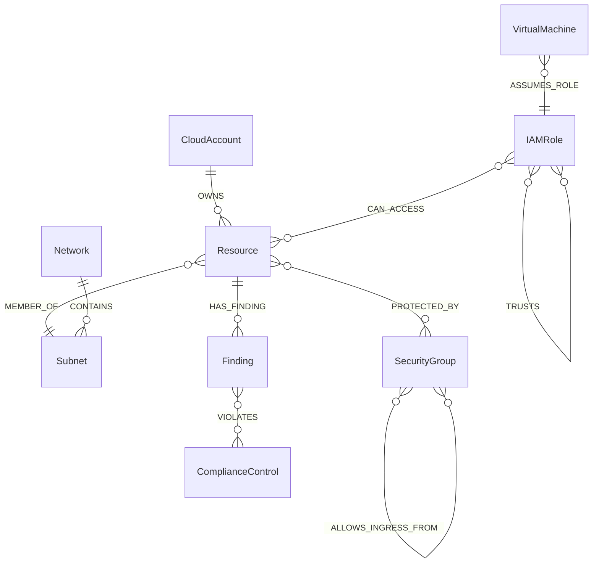
```mermaid
erDiagram
    CloudAccount ||--o{ Resource : OWNS
    Resource }o--|| Subnet : MEMBER_OF
    Network ||--o{ Subnet : CONTAINS
    Resource }o--o{ SecurityGroup : PROTECTED_BY
    SecurityGroup }o--o{ SecurityGroup : ALLOWS_INGRESS_FROM
    VirtualMachine }o--|| IAMRole : ASSUMES_ROLE
    IAMRole }o--o{ Resource : CAN_ACCESS
    Resource ||--o{ Finding : HAS_FINDING
    Finding }o--o{ ComplianceControl : VIOLATES
    IAMRole }o--o{ IAMRole : TRUSTS
```

**Visual graph diagram — a realistic attack path scenario:**

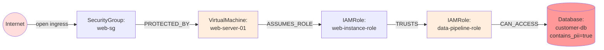
```mermaid
graph LR
    Internet((Internet)) -->|open ingress| SG1[SecurityGroup:<br/>web-sg]
    SG1 -->|PROTECTED_BY| VM1[VirtualMachine:<br/>web-server-01]
    VM1 -->|ASSUMES_ROLE| Role1[IAMRole:<br/>web-instance-role]
    Role1 -->|TRUSTS| Role2[IAMRole:<br/>data-pipeline-role]
    Role2 -->|CAN_ACCESS| DB1[(Database:<br/>customer-db<br/>contains_pii=true)]

    style Internet fill:#fdd
    style VM1 fill:#fed
    style Role2 fill:#fed
    style DB1 fill:#f99
```

This diagram **is** an Attack Path: `Internet → web-sg → web-server-01 → web-instance-role → data-pipeline-role (via TRUSTS) → customer-db`. A relational query for this would require an unbounded number of self-joins across three different tables (security groups, IAM roles, resources). In Cypher, it's one readable pattern.

### 4.6 Cypher Query Examples

**Find all resources directly owned by an account:**

```cypher
MATCH (a:CloudAccount {id: $account_id})-[:OWNS]->(r:Resource)
RETURN r
```

**Blast radius — how many resources are reachable within 4 hops from a compromised VM (via any relationship):**

```cypher
MATCH (start:Resource {id: $resource_id})
MATCH path = (start)-[*1..4]->(reachable:Resource)
RETURN count(DISTINCT reachable) AS blast_radius_count
```

**Attack path — is there a path from any internet-facing resource to any resource containing PII?**

```cypher
MATCH (entry:Resource)-[:PROTECTED_BY]->(sg:SecurityGroup)-[:ALLOWS_INGRESS_FROM]->(:CIDR {value: "0.0.0.0/0"})
MATCH path = (entry)-[:ASSUMES_ROLE|TRUSTS|CAN_ACCESS*1..6]->(target:Resource)
WHERE target.contains_pii = true
RETURN path
ORDER BY length(path) ASC
LIMIT 10
```

**Shortest attack path specifically (using Neo4j's built-in shortest path):**

```cypher
MATCH (entry:VirtualMachine {public_ip: $ip})
MATCH (target:Database {contains_pii: true})
MATCH p = shortestPath(
  (entry)-[:ASSUMES_ROLE|TRUSTS|CAN_ACCESS*1..8]->(target)
)
RETURN p
```

**Findings mapped to a compliance framework (e.g., PCI-DSS), grouped by control:**

```cypher
MATCH (f:Finding)-[:VIOLATES]->(c:ComplianceControl {framework: "PCI-DSS"})
WHERE f.status = "OPEN"
RETURN c.control_id, count(f) AS open_findings
ORDER BY open_findings DESC
```

### 4.7 Attack Path Analysis — Worked Example

**Scenario:** ComplianceIQ discovers a public S3 bucket, `logs-bucket-01`, that is world-readable and, buried in its bucket policy, grants read access to an IAM role, `log-processor-role`. That role, in turn, has a trust relationship allowing it to assume `admin-role`, which has full account access.

**Graph representation:**

```cypher
CREATE (b:StorageBucket {id: 'logs-bucket-01', public_access: true})
CREATE (r1:IAMRole {id: 'log-processor-role', is_admin: false})
CREATE (r2:IAMRole {id: 'admin-role', is_admin: true})
CREATE (b)-[:GRANTS_ACCESS_TO]->(r1)
CREATE (r1)-[:TRUSTS]->(r2)
```

**Attack Path Engine query:**

```cypher
MATCH (pub:StorageBucket {public_access: true})
MATCH path = (pub)-[:GRANTS_ACCESS_TO|TRUSTS*1..5]->(admin:IAMRole {is_admin: true})
RETURN pub.id AS entry_point, admin.id AS blast_target, length(path) AS hops
```

**Result interpretation:** a 2-hop path exists from a public, unauthenticated entry point to full administrative access. This is exactly the kind of "silent privilege escalation chain" that individual, isolated findings (each hop, viewed alone, might look "Medium" severity) would completely miss — but the **path itself** is Critical. This is the core value proposition of the Attack Path Engine: **findings in isolation understate risk; findings in graph context reveal it.**

### 4.8 Why Neo4j Comes *After* Discovery and Risk Engines — Sequencing Rationale

**Beginner explanation:** You can't draw a map of connections between things you haven't found yet. Discovery has to run first so there's actual data to connect.

**Advanced explanation:** This is a deliberate **incremental architecture** decision, not a technical limitation:

1. **De-risking the MVP.** The Discovery Engine (find resources) and a first-pass Risk Intelligence Engine (score resources using only PostgreSQL-stored attributes and findings — no graph relationships yet) can ship value to customers *fast*, proving the core value loop (discover → find → score → report) before investing in graph infrastructure.
2. **Data availability precedes graph value.** A Knowledge Graph with sparse, incomplete relationship data returns unreliable Attack Path results (false negatives — missing paths that exist in reality but weren't discovered/normalized yet). Only once Discovery + Normalization reliably populate a critical mass of `Resource` and relationship data does introducing Neo4j produce trustworthy output.
3. **Bounded Context sequencing (ties back to Part 2 §2.12).** The Attack Path Bounded Context depends on stable identifiers (`resource_id`) and relationship data produced by the Discovery/Normalization Bounded Context. Building the consumer before the producer is unstable-context sequencing — a known DDD integration anti-pattern.
4. **Avoiding premature polyglot-persistence complexity.** Running Postgres + Neo4j + Redis in Docker simultaneously from day one, before the core discovery/risk loop is even validated with real customers, adds operational surface area (two databases to keep in sync, two migration systems, two backup strategies) before that cost is justified.
5. **This is also good Clean Architecture practice.** Because `GraphRepository` is defined as an *interface* in `domain/repositories/` from day one (Part 1 §1.5), the Risk Intelligence Engine's use case code can be written against that interface immediately, backed initially by a stub/no-op implementation, and swapped for the real `Neo4jGraphRepository` later — **zero use-case code changes required** when Neo4j is actually introduced. This is the direct payoff of Clean Architecture's Dependency Rule discussed in Part 1: infrastructure additions don't ripple into business logic.

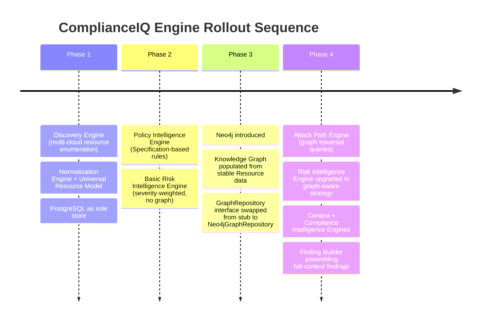
```mermaid
timeline
    title ComplianceIQ Engine Rollout Sequence
    Phase 1 : Discovery Engine (multi-cloud resource enumeration)
            : Normalization Engine + Universal Resource Model
            : PostgreSQL as sole store
    Phase 2 : Policy Intelligence Engine (Specification-based rules)
            : Basic Risk Intelligence Engine (severity-weighted, no graph)
    Phase 3 : Neo4j introduced
            : Knowledge Graph populated from stable Resource data
            : GraphRepository interface swapped from stub to Neo4jGraphRepository
    Phase 4 : Attack Path Engine (graph traversal queries)
            : Risk Intelligence Engine upgraded to graph-aware strategy
            : Context + Compliance Intelligence Engines
            : Finding Builder assembling full-context findings
```

### 4.9 Real-World Analogy

A relational database is like a filing cabinet: great for pulling one specific folder by its label. A graph database is like a **detective's evidence board with strings connecting photos** — its entire purpose is to make "how is X connected to Y, through however many intermediaries" visually and computationally obvious. ComplianceIQ's Attack Path Engine is, quite literally, an automated detective's evidence board.

### 4.10 Common Mistakes

1. **Modeling everything in Neo4j, including things Postgres does better.** Transactional records (billing, audit logs, user accounts) belong in PostgreSQL; only relationship-heavy security-relevant data belongs in the graph.
2. **Unbounded traversal queries in production.** `MATCH (a)-[*]->(b)` with no upper hop bound can traverse the entire graph and time out — always bound variable-length patterns (`[*1..6]`).
3. **Not indexing node properties used in `WHERE` clauses.** Cypher `MATCH` on an unindexed property property scans every node of that label — always create indexes/constraints on `id` and frequently filtered properties (`CREATE INDEX FOR (r:Resource) ON (r.id)`).
4. **Letting the graph and PostgreSQL drift out of sync.** Since Neo4j is a derived projection, a missing or stale sync (via Domain Events, Part 2 §2.11) after a resource is deleted in Postgres leaves ghost nodes in the graph, producing false attack paths.
5. **Treating the graph as the system of record.** It should remain a queryable projection; PostgreSQL remains authoritative for compliance-audit-grade data.

### 4.11 Interview Questions

1. Why is index-free adjacency the key architectural reason graph traversal in Neo4j outperforms recursive SQL joins at scale?
2. Walk through how ComplianceIQ would compute "blast radius" for a compromised resource using Cypher.
3. Why does ComplianceIQ use both PostgreSQL and Neo4j instead of just one database?
4. What's the architectural risk of introducing Neo4j before the Discovery Engine reliably produces resource and relationship data?
5. How does defining `GraphRepository` as an interface in the domain layer from day one make introducing Neo4j later a low-risk change?
6. Design a Cypher query to find all IAM roles with a trust-chain path (of any length) to an admin role.

### 4.12 Exercises

1. Model the `SecurityGroup` → `ALLOWS_INGRESS_FROM` → CIDR relationship, then write a Cypher query finding every resource reachable from the public internet within 3 hops.
2. Write the `Neo4jGraphRepository.get_blast_radius()` method (Python, using the official `neo4j` driver) implementing the domain-defined `GraphRepository` interface from Part 1.
3. Design a Domain Event–driven sync mechanism (referencing Part 2 §2.11) that keeps Neo4j nodes in sync whenever a `Resource` is created, updated, or deleted in PostgreSQL.
4. Propose an indexing strategy (`CREATE INDEX` / `CREATE CONSTRAINT` statements) for the node labels and properties most frequently queried by the Attack Path Engine.

### 4.13 Summary

Graph databases exist because relational databases handle "how many hops until X reaches Y" poorly, while Neo4j's index-free adjacency makes variable-depth relationship traversal fast regardless of scale — exactly what ComplianceIQ's Knowledge Graph, Attack Path Engine, and blast-radius calculations need. Neo4j is deliberately introduced only after Discovery and a first-pass Risk Engine are stable, both to de-risk the MVP and because Clean Architecture's repository interfaces make that later introduction a clean, additive change rather than a rewrite.

### 4.14 Checklist

- [ ] `GraphRepository` interface defined in `domain/` from day one, even before Neo4j is introduced.
- [ ] Every Cypher variable-length pattern has a bounded hop limit (`[*1..N]`).
- [ ] Indexes/constraints exist on `id` and other frequently filtered node properties.
- [ ] PostgreSQL remains the system of record; Neo4j is a synced, derived projection.
- [ ] A Domain Event–driven (or equivalent) sync mechanism keeps the graph from drifting out of date.
- [ ] Attack Path queries return bounded, ranked (shortest-first) results, not unbounded result sets.

---
<a name="part-5"></a>
## Part 5 — Bringing It All Together

### 5.1 How the Four Pillars Interlock

- **Clean Architecture** gives ComplianceIQ its *layer boundaries* — where code lives and which direction dependencies flow.
- **DDD** gives the *domain layer* its shape — Entities, Value Objects, Aggregates, Services, Events, Bounded Contexts.
- **Design Patterns** give *implementation-level solutions* to recurring structural problems inside those layers.
- **Neo4j & Graph Modeling** gives ComplianceIQ the *specialized persistence technology* needed for the relationship-heavy questions (attack paths, blast radius) that a relational model alone cannot answer efficiently.

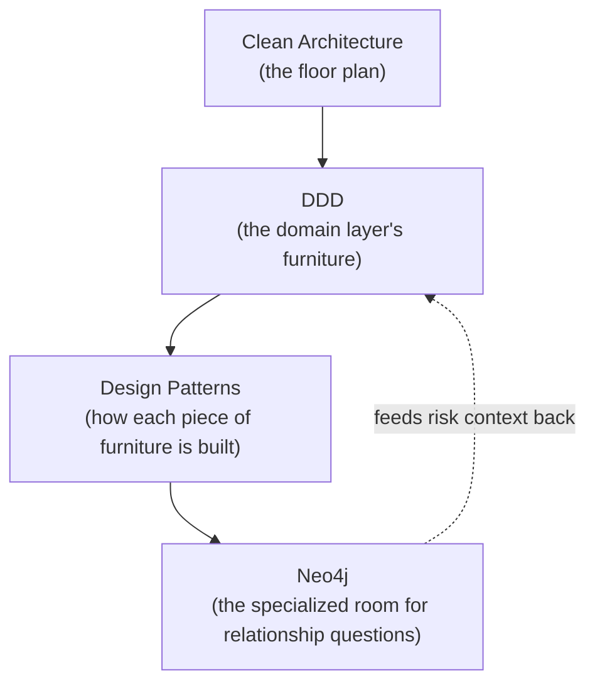
```mermaid
flowchart TB
    CA["Clean Architecture<br/>(the floor plan)"] --> DDD["DDD<br/>(the domain layer's furniture)"]
    DDD --> DP["Design Patterns<br/>(how each piece of furniture is built)"]
    DP --> Neo["Neo4j<br/>(the specialized room for relationship questions)"]
    Neo -.feeds risk context back.-> DDD
```

### 5.2 End-to-End Walkthrough: One Resource's Journey Through ComplianceIQ

1. **Discovery Engine** (`application/use_cases/discover_resources.py`) calls `CloudProviderAdapter.list_resources()` (**Adapter pattern**) to pull raw AWS data.
2. **Normalization Engine** uses `ResourceFactory` (**Factory pattern**) to build a normalized `Resource` **Entity** (**DDD**).
3. `ResourceRepository.save()` (**Repository pattern**, interface in `domain/`, implementation in `infrastructure/`) persists it to PostgreSQL, inside a `UnitOfWork` (**Unit of Work pattern**) transaction alongside a `FindingCreated` **Domain Event** publish, if applicable.
4. A `GraphSyncSubscriber` reacts to Domain Events and creates/updates the corresponding node in **Neo4j**.
5. **Policy Intelligence Engine** evaluates `Specification` trees (**Specification pattern**) against the resource, producing raw violations.
6. **Context Intelligence Engine** enriches with business context (production? PII? internet-facing?).
7. **Risk Intelligence Engine**'s `RiskCalculator` **Domain Service** uses a `RiskScoringStrategy` (**Strategy pattern**) that queries Neo4j for `BlastRadius`, producing a `RiskScore` **Value Object**.
8. **Compliance Intelligence Engine** maps violations to `ComplianceControl`s.
9. **Attack Path Engine** runs bounded Cypher traversals to detect if this resource sits on a path to sensitive data.
10. **Finding Builder** uses `FindingBuilder` (**Builder pattern**) to assemble everything into one immutable `Finding` **Entity**, saved via its **Repository**, all orchestrated by an **Application Service / Use Case**, exposed to the client through a thin FastAPI **Controller** in the **Interface Adapters** layer — never leaking infrastructure details into the **Entities** or **Use Cases** at the system's core.

This single walkthrough touches all four pillars, in the correct dependency direction, at every step.

---
<a name="final-checklist"></a>
## Final Master Checklist — Defending ComplianceIQ Before a Jury

**Architecture**
- [ ] I can explain the Dependency Rule and point to the exact folder boundary that enforces it.
- [ ] I can justify why `domain/` and `application/` contain zero framework imports.
- [ ] I can draw the request lifecycle sequence diagram from memory for any engine.

**DDD**
- [ ] I can name ComplianceIQ's Core, Supporting, and Generic subdomains and justify the classification.
- [ ] I can explain why `Resource` has different shapes across Bounded Contexts without calling it inconsistent.
- [ ] I can explain the invariant `CloudAccount` protects that a bare `Resource` cannot.

**Design Patterns**
- [ ] I can justify, for each pattern used, the specific problem it solves in ComplianceIQ — not just "it's a known pattern."
- [ ] I can explain why Policy rules use Specification instead of nested conditionals.
- [ ] I can explain why Unit of Work exists separately from Repository.

**Neo4j / Graph**
- [ ] I can explain index-free adjacency and why it matters for attack path queries specifically.
- [ ] I can write a bounded, indexed, shortest-path Cypher query from scratch.
- [ ] I can justify, with a sequencing argument (not just "budget"), why Neo4j is introduced after Discovery/Risk v1.

**Systems Thinking**
- [ ] I can trace one resource's full journey through all nine engines and name which architectural concept governs each step.
- [ ] I can identify, for any proposed new feature, which Bounded Context it belongs to and which layer each piece of its implementation belongs in.

---

*End of handbook. Revisit each Part's Exercises as you actually implement ComplianceIQ — the diagrams and code here are teaching scaffolding, not a substitute for building, testing, and breaking the real thing.*
