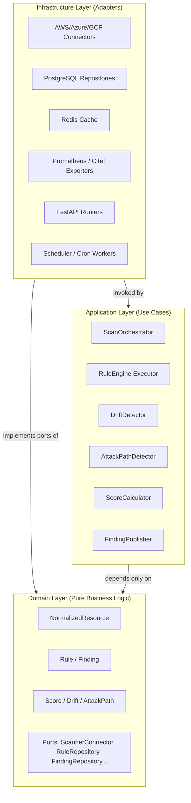
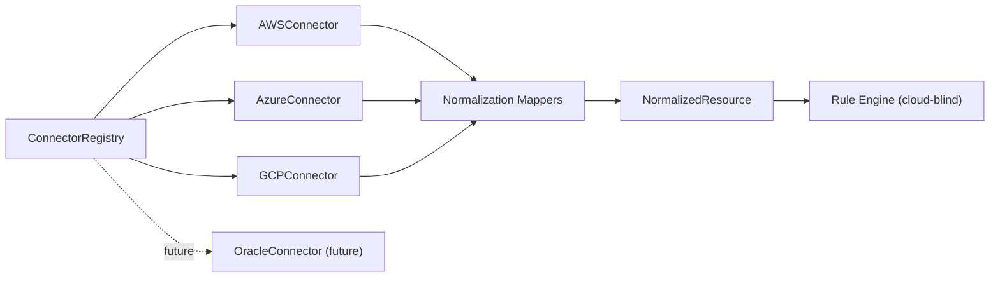
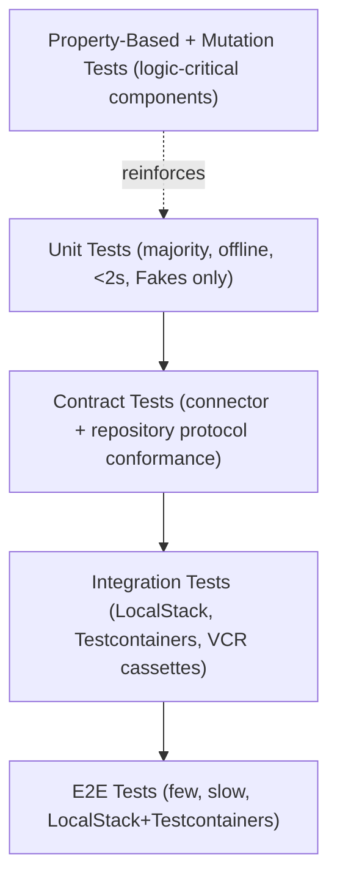
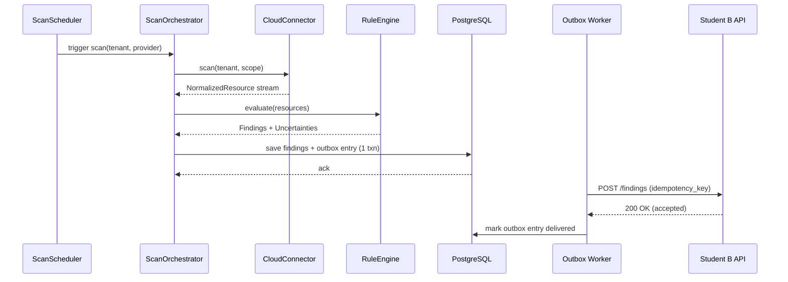
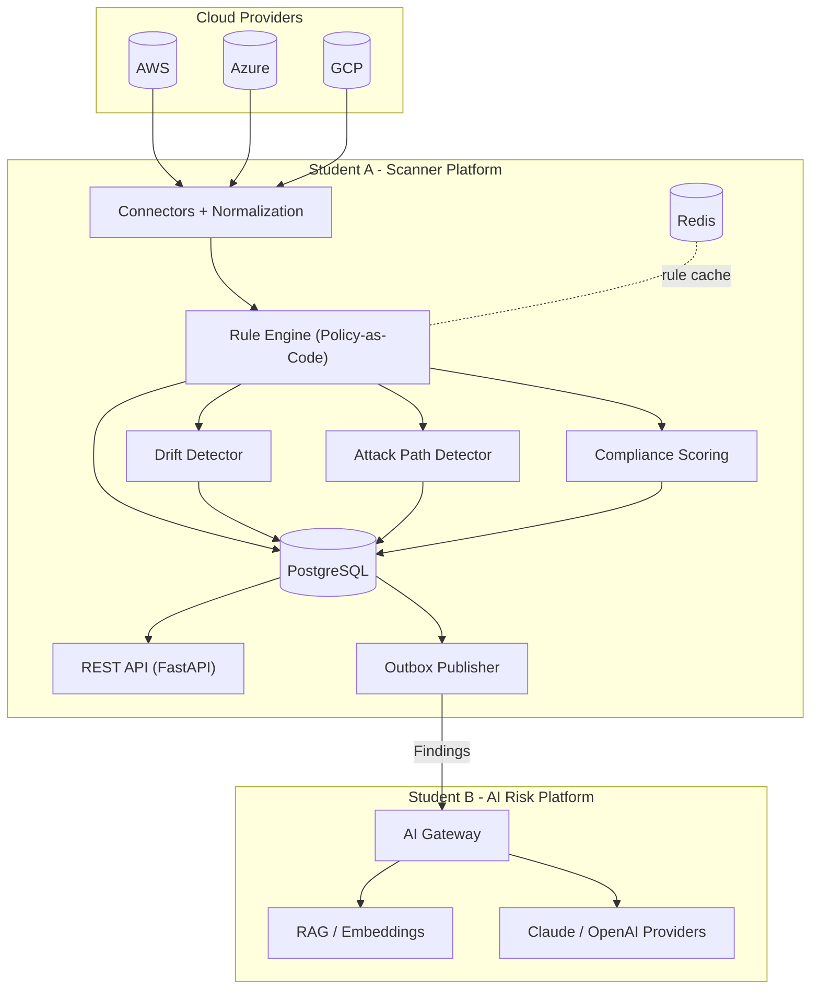
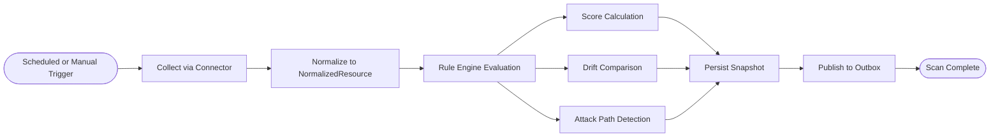
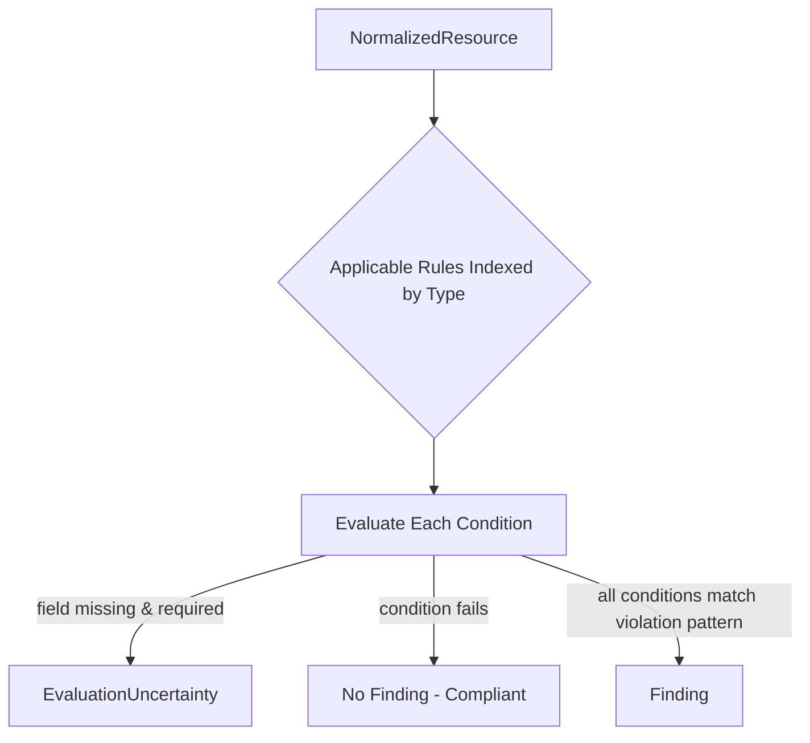
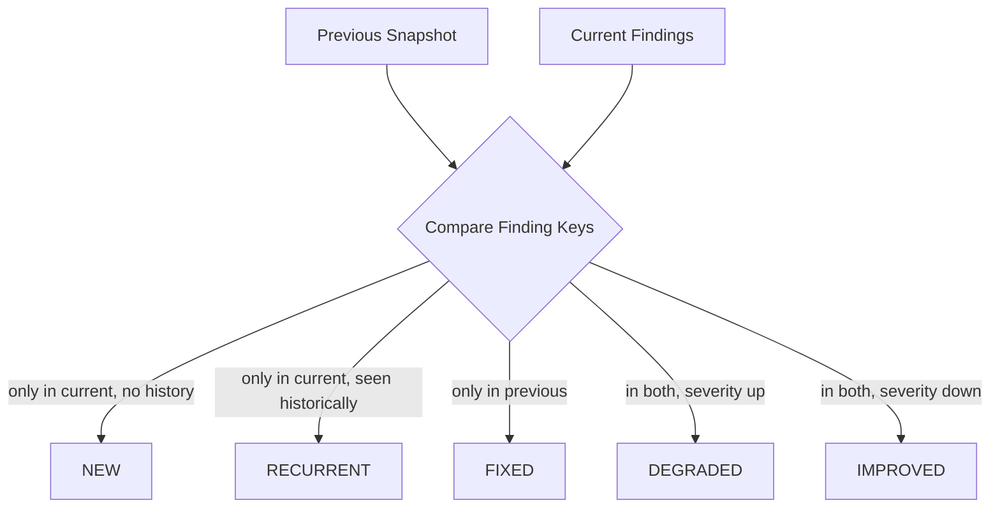
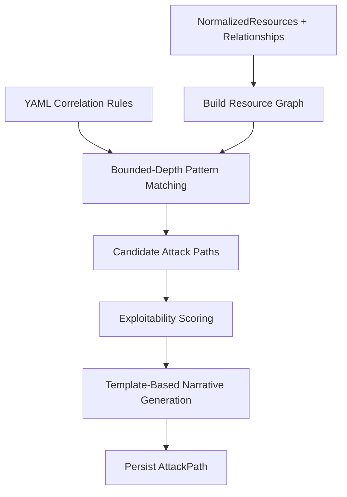

# ComplianceIQ — Scanner Platform Architecture Specification

**Subsystem:** Student A — Multi-Cloud Scanner, Compliance Engine, Drift & Attack Path Detection
**Codename:** Terraform-Copilot-GRC / ComplianceIQ Scanner Platform
**Document type:** Software Architecture Specification (SAS)
**Audience:** Senior Engineers, Architects, Technical Design Review Board
**Status:** Draft for Technical Design Review

---

## Table of Contents

1. [Executive Summary](#1-executive-summary)
2. [Architecture Principles](#2-architecture-principles)
3. [High-Level Architecture](#3-high-level-architecture)
4. [Clean Architecture](#4-clean-architecture)
5. [Domain Layer](#5-domain-layer)
6. [Application Layer](#6-application-layer)
7. [Infrastructure Layer](#7-infrastructure-layer)
8. [Multi-Cloud Strategy](#8-multi-cloud-strategy)
9. [Rule Engine Design](#9-rule-engine-design)
10. [Policy-as-Code](#10-policy-as-code)
11. [Drift Detection](#11-drift-detection)
12. [Attack Graph Engine](#12-attack-graph-engine)
13. [Compliance Scoring](#13-compliance-scoring)
14. [Zero False Positives](#14-zero-false-positives)
15. [Resilience](#15-resilience)
16. [Observability](#16-observability)
17. [Testing Strategy](#17-testing-strategy)
18. [Security Considerations](#18-security-considerations)
19. [Student A / Student B Integration](#19-student-a--student-b-integration)
20. [Mermaid Diagrams](#20-mermaid-diagrams)
21. [Folder Structure](#21-folder-structure)
22. [Implementation Roadmap](#22-implementation-roadmap)
23. [Future Improvements](#23-future-improvements)
24. [Trade-offs and Architectural Decisions](#24-trade-offs-and-architectural-decisions)
25. [Conclusion](#25-conclusion)

---

## 1. Executive Summary

ComplianceIQ's Scanner Platform ("Student A") is the multi-cloud data-collection, normalization, compliance-evaluation, drift-detection, and attack-path-detection engine that feeds an independent AI Risk Platform ("Student B"). Its mandate is to continuously and safely observe the configuration state of AWS, Azure, and Google Cloud tenants, express that state in a cloud-agnostic domain model, evaluate it against versioned, auditable YAML policies, and produce **Findings** that are provably correct — never speculative.

The platform is built as a **Clean / Hexagonal Architecture** with a strictly framework-free **Domain** layer, an orchestration-only **Application** layer, and an **Infrastructure** layer that contains every cloud SDK call, every database query, and every network operation. This separation is not cosmetic: it is what allows the platform to run its entire test suite — unit, contract, and most integration tests — **offline, deterministically, and in under two seconds**, without a single live cloud credential.

Six pillars define the platform's identity:

| Pillar | Summary |
|---|---|
| **Multi-cloud by construction** | One `ScannerConnector` port, three adapters (AWS/Azure/GCP), one `NormalizedResource` model. The Rule Engine is cloud-blind. |
| **Zero False Positives** | Missing or ambiguous data never becomes a Finding. Uncertainty is a first-class citizen of the domain model. |
| **Policy-as-Code** | Every rule is YAML, versioned, validated against a schema, compiled once, cached, and hot-reloadable — no Python changes to add a rule. |
| **Drift & Attack Path Intelligence** | Beyond point-in-time compliance, the platform tracks score evolution over time and models exploitable attack chains as a graph. |
| **Enterprise resilience** | Retry with decorrelated jitter, circuit breakers, bulkheads, timeouts, and graceful degradation protect every outbound call. |
| **Deterministic offline testing** | Fakes, in-memory repositories, a `MockClock`, and a `RecordingSleeper` guarantee tests never depend on wall-clock time or network access. |

This document specifies the architecture at the level of detail required for an engineering team to begin implementation immediately, including domain models, port/adapter contracts, algorithms for drift and attack-path detection, scoring formulas, resilience patterns, observability instrumentation, a full testing pyramid, and the integration contract with Student B's AI platform.

---

## 2. Architecture Principles

The following non-negotiable principles govern every design decision in this document. Where a trade-off exists, it is resolved in favor of the principle listed first among the applicable ones.

1. **Correctness over completeness.** A Finding must be defensible. It is architecturally preferable to under-report (false negative) than to over-report (false positive). See [Section 14](#14-zero-false-positives).
2. **Domain purity.** The `domain/` package imports nothing outside the Python standard library and `pydantic` for value objects (justified in [Section 5](#5-domain-layer)). No `boto3`, `azure-*`, `google-cloud-*`, `sqlalchemy`, or `fastapi` may ever appear there.
3. **Ports before adapters.** Every capability the domain/application needs from the outside world is expressed as an abstract port (Protocol/ABC) before any concrete adapter is written.
4. **Cloud-agnostic core.** Adding a fourth or fifth cloud provider must never require a change to the Rule Engine, Drift Detector, Attack Path Detector, or Scoring Engine — only a new connector plus new normalization mappings.
5. **Auditability.** Every rule, every score, every Finding must be traceable to a specific rule version, scan ID, and raw evidence snapshot.
6. **Testability first.** If a component cannot be unit-tested offline in under 2 seconds, its design is rejected and reworked.
7. **Multi-tenancy is structural, not incidental.** Tenant ID is a mandatory dimension threaded through every domain object, every repository query, every cache key, and every log line.
8. **Resilience is a cross-cutting infrastructure concern**, applied uniformly via decorators/adapters rather than scattered ad hoc `try/except` blocks in business code.
9. **Observability is built-in, not bolted on.** Correlation IDs, tenant IDs, and scan IDs propagate through logs, metrics, and traces from the first line of code.

---

## 3. High-Level Architecture

ComplianceIQ is decomposed into two cooperating subsystems that communicate over a well-defined REST contract (see [Section 19](#19-student-a--student-b-integration)):

- **Student A (this document):** Scanner Platform — collection, normalization, rule evaluation, drift, attack paths, scoring, persistence, REST exposure, scheduling, multi-tenancy.
- **Student B (external, already designed):** AI Risk Platform — receives Findings, performs RAG-augmented financial risk assessment, generates remediation proposals via Claude/OpenAI providers behind an AI Gateway with retry/circuit-breaker/health-check infrastructure.

At the highest level, Student A is a **pipeline of pure transformations** (collect → normalize → evaluate → score → detect drift → detect attack paths → persist → expose → publish) wrapped by infrastructure adapters that supply the actual cloud data, storage, and network transport. See [Diagram 1](#201-global-architecture) for the full topology.

### 3.1 Bounded Contexts

| Bounded Context | Responsibility | Primary Aggregates |
|---|---|---|
| **Collection** | Fetch raw resources from cloud providers | `RawResource`, `ScanJob` |
| **Normalization** | Translate raw resources into the canonical model | `NormalizedResource` |
| **Compliance Evaluation** | Apply YAML rules to normalized resources | `Rule`, `Finding` |
| **Drift** | Compare scans over time | `Drift`, `ScanHistory` |
| **Attack Graph** | Model exploitable relationships | `ResourceNode`, `AttackPath` |
| **Scoring** | Aggregate Findings into scores | `Score`, `ScoreBreakdown` |
| **Publication** | Expose data via REST, push to Student B | `FindingBatch`, `ApiEnvelope` |

Each bounded context maps to a package under `domain/` and a corresponding use case under `application/`, keeping the mental model of "one context, one folder, one set of ports" consistent throughout the codebase.

---

## 4. Clean Architecture

### 4.1 The Three Rings



**Dependency rule:** arrows of *source-code dependency* point inward only. Infrastructure depends on Application and Domain (it implements their ports); Application depends on Domain (it orchestrates domain objects); Domain depends on nothing. Data and control flow, at runtime, moves outward-in-then-out (infrastructure supplies data → application orchestrates → domain evaluates → application persists via infrastructure).

### 4.2 Why Clean/Hexagonal over a Layered N-Tier or a Framework-Centric Design

| Alternative | Why rejected as primary structure |
|---|---|
| Traditional 3-tier (Controller → Service → DAO), Django/FastAPI-centric | Business rules leak into ORM models and framework request/response objects; hard to test without spinning up the framework; cloud SDK types leak into service logic. |
| Microkernel-only plugin architecture | Good for the *connector* problem alone, but doesn't address the need for a symmetric, testable rule/scoring/drift core; we adopt it as a **sub-pattern** inside Infrastructure (see [Section 8](#8-multi-cloud-strategy)), not as the top-level style. |
| Pure functional core with no OOP | Domain purity is achievable either way; we retain lightweight classes (dataclasses/Pydantic value objects) because the team's C#/Java-adjacent Python conventions and IDE tooling benefit from typed aggregates, and Pydantic v2's validation is reused for both domain invariants and API schemas without duplicting logic (see [5.4](#54-why-pydantic-in-the-domain-layer)). |

**Chosen:** Clean Architecture (Ports & Adapters), because it is the only style among these that simultaneously satisfies principle 2 (domain purity), principle 3 (ports before adapters), and principle 6 (2-second offline test suite) without compromise.

---

## 5. Domain Layer

### 5.1 Design Goals

- Zero I/O. Zero framework imports. Zero cloud SDK imports.
- All invariants enforced at construction time (fail fast, fail loud).
- Immutable value objects wherever the concept is a value, not an entity (e.g., `Severity`, `TenantId`, `ResourceArn`).
- Explicit domain errors, never bare `Exception`.

### 5.2 Core Domain Objects

```python
# domain/model/normalized_resource.py
from __future__ import annotations
from dataclasses import dataclass, field
from datetime import datetime
from enum import Enum


class CloudProvider(str, Enum):
    AWS = "aws"
    AZURE = "azure"
    GCP = "gcp"


@dataclass(frozen=True, slots=True)
class ResourceIdentity:
    """Value object: uniquely identifies a resource across providers."""
    provider: CloudProvider
    provider_native_id: str        # ARN / Resource ID / Resource Name
    tenant_id: str
    region: str | None = None


@dataclass(frozen=True, slots=True)
class NormalizedResource:
    """
    The cloud-agnostic canonical representation of any scanned resource.
    This is the single object the Rule Engine, Drift Detector, and
    Attack Path Detector ever operate on. No provider-specific field
    names are allowed to leak past normalization.
    """
    identity: ResourceIdentity
    resource_type: str              # canonical type, e.g. "object_storage_bucket"
    name: str
    tags: dict[str, str] = field(default_factory=dict)
    configuration: dict[str, object] = field(default_factory=dict)
    relationships: tuple["ResourceRelationship", ...] = field(default_factory=tuple)
    collected_at: datetime = field(default_factory=datetime.utcnow)
    raw_evidence_ref: str | None = None   # pointer to immutable raw snapshot


@dataclass(frozen=True, slots=True)
class ResourceRelationship:
    """Edge in the attack graph, e.g. 'attached_to', 'assumes_role', 'routes_to'."""
    relation_type: str
    target_identity: ResourceIdentity
```

```python
# domain/model/rule.py
from dataclasses import dataclass
from enum import Enum


class Severity(str, Enum):
    LOW = "low"
    MEDIUM = "medium"
    HIGH = "high"
    CRITICAL = "critical"


@dataclass(frozen=True, slots=True)
class RuleCondition:
    field_path: str          # dotted path into NormalizedResource.configuration
    operator: str             # "equals", "not_equals", "contains", "exists", "cidr_in", ...
    value: object
    required_for_verdict: bool = True   # if data missing here -> uncertainty, not a Finding


@dataclass(frozen=True, slots=True)
class Rule:
    rule_id: str
    version: str
    title: str
    description: str
    severity: Severity
    frameworks: tuple[str, ...]        # e.g. ("CIS-AWS-1.4", "NIST-800-53")
    applies_to: tuple[str, ...]        # resource_type(s)
    conditions: tuple[RuleCondition, ...]
    remediation_hint: str | None = None
```

```python
# domain/model/finding.py
from dataclasses import dataclass
from datetime import datetime
from domain.model.rule import Severity


@dataclass(frozen=True, slots=True)
class Finding:
    finding_id: str
    tenant_id: str
    scan_id: str
    rule_id: str
    rule_version: str
    resource_identity: "ResourceIdentity"
    severity: Severity
    status: str                 # "open", "resolved", "suppressed"
    evidence: dict[str, object]
    created_at: datetime
    confidence: str = "confirmed"   # "confirmed" only — never "guessed" (see Section 14)
```

```python
# domain/model/uncertainty.py
from dataclasses import dataclass


@dataclass(frozen=True, slots=True)
class EvaluationUncertainty:
    """
    Emitted instead of a Finding whenever a rule's required data
    could not be verified. This is a first-class domain object,
    not an exception, so it can be persisted, reported on, and
    used to compute scan-completeness metrics.
    """
    tenant_id: str
    scan_id: str
    rule_id: str
    resource_identity: "ResourceIdentity"
    reason: str    # "field_missing", "provider_api_error", "ambiguous_type"
```

### 5.3 Ports Owned by the Domain

Ports are defined as `typing.Protocol` (structural typing) rather than ABCs where possible, to avoid forcing infrastructure classes into an inheritance hierarchy — favoring composition and making Fakes trivial to write for offline testing.

```python
# domain/ports/scanner_connector.py
from typing import Protocol, AsyncIterator
from domain.model.normalized_resource import NormalizedResource


class ScannerConnector(Protocol):
    """
    One implementation per cloud provider. The Application layer
    never knows which concrete connector it is talking to.
    """
    provider_name: str

    async def scan(self, tenant_id: str, scope: "ScanScope") -> AsyncIterator[NormalizedResource]:
        ...

    async def health_check(self) -> bool:
        ...
```

```python
# domain/ports/repositories.py
from typing import Protocol, Iterable
from domain.model.finding import Finding
from domain.model.rule import Rule


class RuleRepository(Protocol):
    def get_active_rules(self, framework: str | None = None) -> Iterable[Rule]: ...
    def get_rule(self, rule_id: str, version: str | None = None) -> Rule | None: ...


class FindingRepository(Protocol):
    def save_batch(self, findings: Iterable[Finding]) -> None: ...
    def get_open_findings(self, tenant_id: str) -> Iterable[Finding]: ...


class ScanHistoryRepository(Protocol):
    def save_scan_snapshot(self, snapshot: "ScanSnapshot") -> None: ...
    def get_previous_snapshot(self, tenant_id: str, provider: str) -> "ScanSnapshot | None": ...
```

### 5.4 Why Pydantic in the Domain Layer

Pydantic v2 is the **one** exception to "no frameworks in domain," and it is deliberate:

- Pydantic v2's core is a Rust validation engine (`pydantic-core`) with **no I/O, no network, no ORM coupling** — it is a validation/parsing library, not an infrastructure concern, unlike SQLAlchemy or FastAPI.
- Using it for value objects (`Severity`, `ResourceIdentity`, rule condition values) lets us reuse the exact same validation logic for (a) YAML rule loading, (b) REST API request/response schemas, and (c) domain invariant checks — eliminating triplicated validation code.
- Alternative considered: plain `dataclasses` with manual `__post_init__` validation everywhere. Rejected because it duplicates validation logic across the domain and the API layer, violating DRY and risking drift between the two.
- Mitigation of coupling risk: domain modules only import `pydantic.BaseModel`/`dataclasses`, never `pydantic.BaseSettings`, never anything DB- or HTTP-aware. This boundary is enforced by an architecture test (see [17.9](#179-architecture-fitness-tests)).

---

## 6. Application Layer

The Application layer contains **use cases** — orchestration classes that coordinate domain objects and call ports, with zero business logic embedded and zero direct infrastructure imports (they receive adapters via constructor injection).

### 6.1 ScanOrchestrator

```python
# application/use_cases/scan_orchestrator.py
from domain.ports.scanner_connector import ScannerConnector
from domain.ports.repositories import ScanHistoryRepository
from application.use_cases.rule_engine import RuleEngine
from application.use_cases.score_calculator import ScoreCalculator
from application.use_cases.drift_detector import DriftDetector


class ScanOrchestrator:
    """
    Coordinates a full scan cycle for one tenant/provider:
    collect -> evaluate -> score -> drift -> persist -> publish.
    Contains NO cloud SDK code and NO SQL.
    """

    def __init__(
        self,
        connectors: dict[str, ScannerConnector],
        rule_engine: RuleEngine,
        score_calculator: ScoreCalculator,
        drift_detector: DriftDetector,
        scan_history_repo: ScanHistoryRepository,
        finding_publisher: "FindingPublisherPort",
        clock: "ClockPort",
    ) -> None:
        self._connectors = connectors
        self._rule_engine = rule_engine
        self._score_calculator = score_calculator
        self._drift_detector = drift_detector
        self._scan_history_repo = scan_history_repo
        self._publisher = finding_publisher
        self._clock = clock

    async def run(self, tenant_id: str, provider: str, scope: "ScanScope") -> "ScanResult":
        scan_id = self._new_scan_id(tenant_id, provider)
        connector = self._connectors[provider]

        resources = [r async for r in connector.scan(tenant_id, scope)]
        findings, uncertainties = self._rule_engine.evaluate(scan_id, tenant_id, resources)
        score = self._score_calculator.compute(tenant_id, findings, resources)

        previous_snapshot = self._scan_history_repo.get_previous_snapshot(tenant_id, provider)
        drift_report = self._drift_detector.compare(previous_snapshot, findings, score)

        self._scan_history_repo.save_scan_snapshot(
            self._build_snapshot(scan_id, tenant_id, provider, findings, score)
        )
        await self._publisher.publish(findings)

        return ScanResult(scan_id, score, drift_report, uncertainties)

    def _new_scan_id(self, tenant_id: str, provider: str) -> str:
        return f"{tenant_id}-{provider}-{self._clock.now().isoformat()}"
```

**Design notes:**

- `clock` is injected as a port (`ClockPort`), never `datetime.utcnow()` called directly inside orchestration logic that needs to be deterministic in tests (see [17.10](#1710-mockclock-and-recordingsleeper)).
- The orchestrator never catches cloud-provider exceptions itself; that responsibility belongs to the Resilience decorators wrapping the connector (see [Section 15](#15-resilience)), keeping this class focused purely on sequencing.

### 6.2 Other Key Use Cases (Summary Table)

| Use Case | Responsibility | Depends on Ports |
|---|---|---|
| `RuleEngine` | Loads compiled rules, evaluates each `NormalizedResource`, emits `Finding` or `EvaluationUncertainty` | `RuleRepository` |
| `DriftDetector` | Diffs current scan against previous snapshot | `ScanHistoryRepository` |
| `AttackPathDetector` | Builds resource graph, applies correlation rules, scores paths | `RuleRepository` (correlation rules), `GraphStore` |
| `ScoreCalculator` | Aggregates Findings into weighted scores at every dimension | none (pure) |
| `ScanScheduler` | Decides which tenant/provider scans are due | `ScheduleRepository`, `ClockPort` |
| `FindingPublisher` | Batches and pushes Findings to Student B | `AiPlatformClientPort` |

---

## 7. Infrastructure Layer

Infrastructure contains **only** adapters implementing domain/application ports. Nothing here is imported by domain or application code (dependency arrows point inward, never outward).

### 7.1 Sub-Structure

```text
infrastructure/
├── cloud/
│   ├── aws/            # AWSConnector, boto3 usage, IAM policy fetchers
│   ├── azure/          # AzureConnector, azure-mgmt-* usage
│   └── gcp/            # GCPConnector, google-cloud-* usage
├── persistence/
│   ├── postgres/       # SQLAlchemy models + repository implementations
│   └── redis/          # Cache adapters, rule compilation cache
├── resilience/          # Retry, Backoff, CircuitBreaker, Bulkhead, RateLimiter
├── observability/       # Structured logging, Prometheus, OpenTelemetry
├── api/                 # FastAPI routers, request/response DTOs
├── scheduling/           # APScheduler / Celery / cron adapters
└── config/               # Settings loading (pydantic-settings), secrets
```

### 7.2 Example: AWS Connector (Simplified)

```python
# infrastructure/cloud/aws/aws_connector.py
import boto3
from domain.model.normalized_resource import NormalizedResource, ResourceIdentity, CloudProvider
from infrastructure.cloud.aws.normalizers import normalize_s3_bucket
from infrastructure.resilience.retry import with_retry
from infrastructure.resilience.circuit_breaker import CircuitBreaker


class AWSConnector:
    provider_name = "aws"

    def __init__(self, session_factory, circuit_breaker: CircuitBreaker):
        self._session_factory = session_factory
        self._circuit_breaker = circuit_breaker

    @with_retry(max_attempts=4, base_delay_s=0.2)
    async def scan(self, tenant_id: str, scope):
        session = self._session_factory(tenant_id)
        s3 = session.client("s3")

        async with self._circuit_breaker.protect("aws.s3.list_buckets"):
            response = s3.list_buckets()

        for bucket in response["Buckets"]:
            raw = self._describe_bucket_fully(s3, bucket["Name"])
            yield normalize_s3_bucket(tenant_id, raw)

    async def health_check(self) -> bool:
        try:
            self._session_factory("healthcheck").client("sts").get_caller_identity()
            return True
        except Exception:
            return False
```

Note the connector produces `NormalizedResource` objects directly — normalization happens **at the edge**, inside infrastructure, using provider-specific mapping functions (`normalize_s3_bucket`), so nothing downstream ever sees a raw `boto3` dict.

### 7.3 Repository Adapter Pattern

Repositories implement the domain `Protocol`s using SQLAlchemy Core (not the ORM's active-record pattern) to keep the mapping between rows and domain dataclasses explicit and centralized in mapper functions — avoiding "SQLAlchemy models as domain objects," a common anti-pattern that silently breaks Clean Architecture's dependency rule.

```python
# infrastructure/persistence/postgres/finding_repository.py
from domain.model.finding import Finding
from infrastructure.persistence.postgres.mappers import finding_to_row, row_to_finding


class PostgresFindingRepository:
    def __init__(self, session_factory):
        self._session_factory = session_factory

    def save_batch(self, findings: list[Finding]) -> None:
        with self._session_factory() as session:
            session.execute(findings_table.insert(), [finding_to_row(f) for f in findings])
            session.commit()

    def get_open_findings(self, tenant_id: str) -> list[Finding]:
        with self._session_factory() as session:
            rows = session.execute(
                findings_table.select().where(
                    findings_table.c.tenant_id == tenant_id,
                    findings_table.c.status == "open",
                )
            ).fetchall()
            return [row_to_finding(r) for r in rows]
```

---

## 8. Multi-Cloud Strategy

### 8.1 The `ScannerConnector` Port as a Microkernel Plugin

Each cloud provider is a **plugin** implementing `ScannerConnector`. The Application layer resolves the correct connector at runtime via a registry keyed by provider name, injected at composition-root time (see [7.1](#71-sub-structure)).



### 8.2 Normalization Strategy

Normalization is a **pure mapping function per (provider, resource_type)** pair, e.g. `normalize_s3_bucket`, `normalize_azure_blob_container`, `normalize_gcs_bucket`, all converging on the canonical `resource_type = "object_storage_bucket"`. A **normalization registry** (`dict[(provider, native_type) -> mapper_fn]`) allows adding a new resource type without touching the Rule Engine.

**Design rationale — why normalize at the edge instead of lazily inside rule evaluation:**

| Approach | Pros | Cons | Decision |
|---|---|---|---|
| Normalize at connector edge (chosen) | Rule Engine and downstream consumers are 100% cloud-agnostic; normalization bugs are isolated per-connector; easy to unit test mappers in isolation | Requires upfront mapping effort per resource type | **Chosen** — aligns with principle 4 (cloud-agnostic core) |
| Lazy/late normalization inside Rule Engine | Less upfront mapping work | Rule Engine must branch on provider; violates domain purity; breaks the "add a cloud = add a connector only" goal | Rejected |

### 8.3 Adding a New Provider (e.g., Oracle Cloud)

Steps required, and *only* these steps:

1. Implement `OracleConnector(ScannerConnector)` in `infrastructure/cloud/oracle/`.
2. Write normalization mappers `oracle_native_type -> NormalizedResource`.
3. Register the connector in the composition root / DI container.
4. Add contract tests proving the connector satisfies the `ScannerConnector` protocol (see [17.2](#172-contract-tests)).

No change to: Rule Engine, Drift Detector, Attack Path Detector, Score Calculator, REST API, or any YAML rule. This is the direct payoff of principle 4.

---

## 9. Rule Engine Design

### 9.1 Responsibilities

The Rule Engine takes a `NormalizedResource` and a set of compiled `Rule` objects and produces either a `Finding` (verdict is fully verifiable) or an `EvaluationUncertainty` (verdict cannot be determined from available data).

### 9.2 Evaluation Algorithm

```python
# application/use_cases/rule_engine.py
class RuleEngine:
    def __init__(self, rule_repository: "RuleRepository"):
        self._rule_repository = rule_repository

    def evaluate(self, scan_id, tenant_id, resources):
        findings, uncertainties = [], []
        rules_by_type = self._index_rules_by_resource_type()

        for resource in resources:
            applicable_rules = rules_by_type.get(resource.resource_type, [])
            for rule in applicable_rules:
                verdict = self._evaluate_rule(rule, resource)
                if verdict is Verdict.VIOLATION:
                    findings.append(self._build_finding(scan_id, tenant_id, rule, resource))
                elif verdict is Verdict.UNCERTAIN:
                    uncertainties.append(self._build_uncertainty(scan_id, tenant_id, rule, resource))
                # Verdict.COMPLIANT -> no Finding, no uncertainty, resource is fine.

        return findings, uncertainties

    def _evaluate_rule(self, rule, resource) -> "Verdict":
        for condition in rule.conditions:
            value = self._extract(resource.configuration, condition.field_path)
            if value is _MISSING:
                if condition.required_for_verdict:
                    return Verdict.UNCERTAIN     # never guess -> Section 14
                continue
            if not self._matches(condition, value):
                return Verdict.COMPLIANT
        return Verdict.VIOLATION
```

Complexity: evaluation is `O(R × C)` per resource, where `R` = number of applicable rules for that resource's type and `C` = average conditions per rule. Rules are pre-indexed by `resource_type` at load time so irrelevant rules are never evaluated (`O(1)` lookup via dict), giving overall scan-evaluation complexity `O(N × R_avg × C_avg)` for `N` resources.

### 9.3 Operators Supported (v1)

| Operator | Meaning | Example |
|---|---|---|
| `equals` / `not_equals` | Exact match | `encryption.enabled == true` |
| `exists` / `not_exists` | Field presence | `logging.enabled exists` |
| `contains` | Substring / list membership | `tags.Environment contains "prod"` |
| `cidr_in` | IP/CIDR containment | `ingress.cidr cidr_in "0.0.0.0/0"` |
| `regex_match` | Pattern match | `iam_policy.action regex_match "^s3:.*"` |
| `greater_than` / `less_than` | Numeric comparisons | `password_policy.min_length greater_than 8` |

### 9.4 Compilation & Caching

Raw YAML rules are parsed → validated against a JSON Schema → converted into immutable `Rule` domain objects → indexed by `resource_type` → cached in Redis (or in-memory LRU for single-node deployments) keyed by `rule_set_version`. Recompilation is triggered only on rule-repository change events (file watch in dev, DB version bump in prod), never on every scan — see [Section 10](#10-policy-as-code) for the full lifecycle.

---

## 10. Policy-as-Code

### 10.1 Rule Format (YAML)

```yaml
# rules/aws/s3/s3_bucket_encryption.yaml
rule_id: AWS-S3-001
version: "1.2.0"
title: "S3 bucket must have default encryption enabled"
description: >
  Buckets without default encryption expose data at rest in plaintext
  if bucket policies or IAM are ever misconfigured.
severity: high
frameworks:
  - CIS-AWS-1.4:2.1.1
  - NIST-800-53:SC-28
applies_to:
  - object_storage_bucket
conditions:
  - field_path: encryption.enabled
    operator: equals
    value: true
    required_for_verdict: true
remediation_hint: >
  Enable SSE-KMS or SSE-S3 default encryption on the bucket.
```

### 10.2 Rule Lifecycle

```mermaid
flowchart LR
    A[YAML Authored by Security/GRC Team] --> B[Git PR + Schema Validation CI]
    B --> C[Merged to rules repo main]
    C --> D[RuleLoader parses + validates JSON Schema]
    D --> E[RuleCompiler converts to domain Rule objects]
    E --> F[Indexed by resource_type + cached]
    F --> G[Hot-reload signal invalidates old cache entry]
    G --> H[RuleEngine uses new version on next scan]
```



### 10.3 Versioning

- Each rule file carries a semantic `version` field. Bumping severity, conditions, or scope requires at minimum a **minor** version bump.
- A `Finding` always stores `rule_id` **and** `rule_version` at the time of evaluation, so historical Findings remain interpretable even after a rule changes — this is essential for accurate drift calculation (a rule change must not be misreported as infrastructure drift).
- Deprecated rules are archived, not deleted, so historical Findings referencing them remain resolvable.

### 10.4 Validation

A JSON Schema (`rules/schema/rule.schema.json`) enforces structural correctness (required fields, enum values for `severity`, allowed `operator` values) at CI time via a pre-commit hook and again at load time as a defense-in-depth measure. Invalid rules fail the load step loudly — a scan never silently proceeds with a partially-loaded rule set.

### 10.5 Hot Reload

In production, the `RuleRepository` adapter watches a version marker (a row in a `rule_sets` table, or an S3/GCS object ETag for the rules bundle). A background task polls this marker every N seconds (configurable, default 60s) and triggers recompilation only on change — avoiding both stale rules and unnecessary recompilation cost.

### 10.6 Testing Rules

Rules are tested with **fixture-based unit tests**: each rule file is paired with `given/then` fixtures (a `NormalizedResource` JSON fixture + expected verdict), run entirely offline against the `RuleEngine`, giving business/GRC users a lightweight way to validate a new rule before merging (see [17.1](#171-unit-tests)).

---

## 11. Drift Detection

### 11.1 Drift Categories

| Category | Definition |
|---|---|
| **NEW** | A Finding exists now that did not exist in the previous scan (new violation). |
| **FIXED** | A Finding existed previously and is absent now (resolved). |
| **RECURRENT** | A Finding existed previously, was fixed, and has reappeared — signals a regression pattern rather than a one-off drift. |
| **IMPROVED** | Same rule/resource, severity or score contribution decreased (e.g., partial remediation). |
| **DEGRADED** | Same rule/resource, severity or score contribution increased. |

### 11.2 Algorithm

```python
# application/use_cases/drift_detector.py
class DriftDetector:
    def compare(self, previous_snapshot, current_findings, current_score):
        prev_index = {f.finding_key(): f for f in (previous_snapshot.findings if previous_snapshot else [])}
        curr_index = {f.finding_key(): f for f in current_findings}

        drifts = []
        for key, curr in curr_index.items():
            prev = prev_index.get(key)
            if prev is None:
                if self._was_ever_fixed_before(key):        # historical lookup
                    drifts.append(Drift(key, DriftType.RECURRENT))
                else:
                    drifts.append(Drift(key, DriftType.NEW))
            elif curr.severity_weight() > prev.severity_weight():
                drifts.append(Drift(key, DriftType.DEGRADED))
            elif curr.severity_weight() < prev.severity_weight():
                drifts.append(Drift(key, DriftType.IMPROVED))

        for key, prev in prev_index.items():
            if key not in curr_index:
                drifts.append(Drift(key, DriftType.FIXED))

        score_delta = current_score.overall - (previous_snapshot.score.overall if previous_snapshot else current_score.overall)
        return DriftReport(drifts=drifts, score_delta=score_delta)
```

`finding_key()` is a stable composite of `(tenant_id, resource_identity, rule_id)` — deliberately **excluding** `rule_version`, so that a Finding is recognized as "the same violation" across a minor rule update, while the stored `rule_version` on each historical Finding still allows auditors to see exactly which rule text applied at each point in time.

### 11.3 Complexity & Scalability

- Comparing two snapshots is `O(P + C)` where `P`/`C` are the previous/current Finding counts, using hash-map indices — no nested loops.
- `RECURRENT` detection requires a bounded lookback (default: last 5 snapshots or 90 days, configurable) rather than full history scan, keeping the check `O(k)` in the number of retained historical snapshots, not `O(all scans ever)`.
- For very large tenants (100k+ resources), snapshot diffing is chunked by resource-type partitions and can be parallelized across worker processes since each partition's diff is independent.

### 11.4 Persistence Strategy

- Each scan produces a **ScanSnapshot** — an immutable, append-only record containing: `scan_id`, `tenant_id`, `provider`, `timestamp`, the full Finding set for that scan, and the resulting `Score`.
- Snapshots are stored in PostgreSQL as a `scan_snapshots` table plus a normalized `scan_findings` table for efficient point queries (open findings today) and a compressed JSONB blob for full historical replay (used sparingly, mainly for drift and audit exports).
- Long-term trend analysis (e.g., 12-month score history) is served from a **materialized rollup table** (`score_history_daily`), refreshed nightly, to avoid expensive on-the-fly aggregation over raw snapshots for dashboard queries.

---

## 12. Attack Graph Engine

### 12.1 Model

The attack graph is a directed graph `G = (V, E)` where:
- `V` = `NormalizedResource` identities (IAM roles, compute instances, storage buckets, network security groups, etc.)
- `E` = `ResourceRelationship` edges (`assumes_role`, `attached_to`, `routes_to`, `has_public_access`, `can_write_to`) discovered during normalization, plus **correlation edges** inferred by YAML-defined correlation rules.

### 12.2 Correlation Rules (YAML)

```yaml
# rules/correlation/public_bucket_to_admin_role.yaml
correlation_id: ATTACK-001
title: "Publicly accessible storage reachable from an over-privileged role"
severity: critical
narrative_template: >
  Resource "{start.name}" is publicly accessible and its access policy
  permits an identity that also holds "{end.name}", an admin-equivalent
  IAM role, creating a path from public exposure to privilege escalation.
graph_pattern:
  start:
    resource_type: object_storage_bucket
    condition: { field_path: public_access.enabled, operator: equals, value: true }
  path:
    - relation_type: grants_access_to
    - relation_type: assumes_role
  end:
    resource_type: iam_role
    condition: { field_path: policy.is_admin_equivalent, operator: equals, value: true }
exploitability_weight: 0.9
```

### 12.3 Traversal Algorithm

1. **Graph construction:** build adjacency lists from `ResourceRelationship` edges emitted during normalization (`O(V + E)`).
2. **Pattern matching:** for each correlation rule, run a bounded-depth BFS/DFS (default max depth: 4 hops, configurable per rule) from all nodes matching `graph_pattern.start`, checking that the traversed relation-type sequence matches `graph_pattern.path`, terminating at nodes matching `graph_pattern.end`.
3. **Path scoring:** each discovered path receives an `exploitability_score = correlation.exploitability_weight × Π(edge_confidence)`, where edge confidence reflects how directly the relationship was observed (direct API evidence = 1.0, inferred/transitive = 0.7).
4. **Narrative generation:** the `narrative_template` is rendered with the actual start/end resource names — a deterministic, template-based generation (**not** an LLM call) to keep the Scanner Platform's core pipeline free of AI-provider dependencies; free-text elaboration of narratives is optionally requested from Student B's AI Gateway as a post-processing enrichment step (see [Section 19](#19-student-a--student-b-integration)).

### 12.4 Scalability

- Bounded-depth traversal (default 4 hops) keeps worst-case complexity at `O(V × b^d)` where `b` is average branching factor and `d` is max depth — acceptable because CSPM attack chains of practical interest rarely exceed 3–5 hops.
- For very large tenant graphs (500k+ nodes), the graph is partitioned by "blast radius" seed points (public-facing resources, internet gateways) rather than traversing from every node, since only paths *starting* from an externally reachable resource are of interest for the majority of correlation rules.
- The in-memory graph is rebuilt per scan from the current `NormalizedResource` set; for extremely large tenants, a graph database adapter (Neo4j/Amazon Neptune) is a documented future evolution (see [Section 23](#23-future-improvements)) behind the same `GraphStore` port, so the traversal algorithm itself does not change — only the storage/adjacency-lookup adapter would.

---

## 13. Compliance Scoring

### 13.1 Dimensions

Scores are computed along five independent, simultaneously-available dimensions:

- **Overall** (single tenant, all clouds, all frameworks)
- **Per cloud** (AWS score, Azure score, GCP score)
- **Per tenant** (multi-tenant SaaS rollups for MSP/parent-org views)
- **Per framework** (CIS, NIST 800-53, ISO 27001, PCI-DSS, etc.)
- **Per domain** (Identity, Network, Storage, Logging, Encryption)

### 13.2 Formula

```text
domain_score(d)      = 100 × (1 − Σ(weighted_severity(f) for f in findings(d)) / max_possible_weight(d))
weighted_severity(f) = severity_weight(f.severity) × importance_weight(f.rule.frameworks)
overall_score        = Σ(domain_score(d) × domain_importance(d)) / Σ(domain_importance(d))
```

| Severity | `severity_weight` |
|---|---|
| CRITICAL | 10 |
| HIGH | 5 |
| MEDIUM | 2 |
| LOW | 1 |

`importance_weight` scales a Finding up if it maps to a framework control marked as mandatory for the tenant's selected compliance profile (e.g., PCI-DSS controls score higher for a payments customer than for a customer that doesn't process cards). `domain_importance` is tenant-configurable (default: uniform) to let a customer emphasize, e.g., Identity over Logging.

**Normalization:** scores are always rescaled to a `[0, 100]` range per dimension so cross-tenant and cross-time comparisons remain meaningful regardless of tenant size — a tenant with 10,000 resources and one with 50 resources are both expressed on the same scale, avoiding the common pitfall of raw Finding counts penalizing larger environments unfairly.

### 13.3 Historical Evolution & Dashboard Aggregation

Scores are snapshotted at every scan (see [11.4](#114-persistence-strategy)) and rolled up nightly into `score_history_daily` for trend charts. Dashboards query the rollup table for time-series views and the live `scan_snapshots` table only for the most recent point, keeping dashboard latency low without expensive on-demand recomputation across the entire scan history.

### 13.4 Why This Weighting Scheme (Trade-off Discussion)

| Alternative | Rejected because |
|---|---|
| Simple Finding-count ratio (compliant / total checks) | Treats a CRITICAL and a LOW Finding identically; not defensible to security stakeholders. |
| Pure CVSS-style scoring | Overkill for configuration-posture findings that aren't CVEs; CVSS models exploit mechanics not directly applicable to "is encryption enabled." |
| Machine-learned score model | Non-deterministic and non-auditable — violates principle 5 (auditability); revisit only as an *additional* advisory score fed by Student B, never as the primary compliance score. |

---

## 14. Zero False Positives

### 14.1 Rationale

A CSPM platform's credibility is destroyed by false positives far faster than by false negatives. A missed misconfiguration is a gap to close on the next iteration; a fabricated Finding erodes trust in *every* Finding the platform has ever produced, triggers alert fatigue, and — in a GRC context feeding automated risk scoring and potentially remediation actions in Student B — can trigger costly or disruptive remediation for a non-existent problem.

Architecturally, this means: **whenever the data needed to render a verdict is missing, ambiguous, or could not be retrieved, the Rule Engine must emit `EvaluationUncertainty`, never a `Finding`.**

### 14.2 Mechanisms

1. **`required_for_verdict` flag** on every `RuleCondition` ([9.2](#92-evaluation-algorithm)) — if a required field is absent from `NormalizedResource.configuration`, evaluation short-circuits to `UNCERTAIN`.
2. **Provider API failure isolation** — if a connector's underlying API call for a specific resource fails after retries are exhausted, that resource is marked `incomplete_scan` and excluded from evaluation entirely, rather than assumed compliant *or* assumed violating.
3. **Scan completeness metric** — every `ScanResult` reports `resources_scanned`, `resources_incomplete`, and `uncertainties_count`, surfaced in the API and dashboards, so operators know when a compliance score is based on partial data.
4. **No default-guessing on ambiguous types** — if a resource's provider-native type cannot be confidently mapped to a canonical `resource_type`, it is recorded as `unrecognized_resource_type` and skipped, never force-mapped to the "closest" type.

### 14.3 Consequence for Testing

Every rule fixture set (see [10.6](#106-testing-rules)) must include at least one "missing required field" fixture asserting the engine returns `UNCERTAIN`, not `COMPLIANT` or `VIOLATION` — this is enforced by a lint check over the fixtures directory in CI.

---

## 15. Resilience

| Pattern | Where applied | Configuration notes |
|---|---|---|
| **Retry** | Every outbound cloud SDK call, every call to Student B's API | Idempotent operations only (reads, and idempotent-by-design writes such as Finding publication using an idempotency key) |
| **Exponential Backoff + Decorrelated Jitter** | Same as Retry | `sleep = random_uniform(base, prev_sleep * 3)`, capped at `max_delay_s`, to avoid thundering-herd retries across many tenants scanned in parallel |
| **Circuit Breaker** | Per (provider, API operation) pair, and on the outbound link to Student B | Opens after N consecutive failures within a rolling window; half-open probes on a timer |
| **Timeouts** | Every network call has an explicit timeout; no unbounded waits | Cloud SDK calls: 10s default; AI platform calls: 30s default (LLM-backed, can be slower) |
| **Bulkheads** | Separate thread/async-task pools per cloud provider, so an AWS outage cannot starve Azure/GCP scans of worker capacity | Implemented via per-provider `asyncio.Semaphore` bounding concurrent in-flight scans |
| **Rate Limiting** | Outbound calls to cloud provider APIs respect provider-specific quota; a token-bucket limiter per (tenant, provider) | Protects against tenant-level API throttling cascading into platform-wide slowdowns |
| **Graceful Degradation** | If Attack Path Detection times out or its dependency (GraphStore) is unavailable, the scan still completes with Findings + Score; attack paths are marked `not_computed` rather than blocking the whole scan | Prioritizes delivering core compliance data over all-or-nothing completeness |
| **Fallback Strategies** | If Redis rule cache is unavailable, fall back to loading rules directly from the repository (slower, but correct) | Never fall back to "skip rule loading" |
| **Idempotency** | Finding publication to Student B carries an idempotency key (`scan_id + finding_id`) so retried publish calls don't create duplicate downstream risk assessments | Enforced at Student B's ingestion boundary per the integration contract ([Section 19](#19-student-a--student-b-integration)) |

### 15.1 Retry & Circuit Breaker Implementation Sketch

```python
# infrastructure/resilience/retry.py
import asyncio, random
from functools import wraps

def with_retry(max_attempts=4, base_delay_s=0.2, max_delay_s=5.0, sleeper=asyncio.sleep):
    def decorator(fn):
        @wraps(fn)
        async def wrapper(*args, **kwargs):
            delay = base_delay_s
            for attempt in range(1, max_attempts + 1):
                try:
                    return await fn(*args, **kwargs)
                except RetryableError:
                    if attempt == max_attempts:
                        raise
                    jitter = random.uniform(base_delay_s, delay * 3)
                    delay = min(jitter, max_delay_s)
                    await sleeper(delay)
        return wrapper
    return decorator
```

```python
# infrastructure/resilience/circuit_breaker.py
import time
from enum import Enum

class BreakerState(Enum):
    CLOSED = "closed"; OPEN = "open"; HALF_OPEN = "half_open"

class CircuitBreaker:
    def __init__(self, failure_threshold=5, recovery_timeout_s=30, clock=time.monotonic):
        self._threshold = failure_threshold
        self._recovery_timeout_s = recovery_timeout_s
        self._clock = clock
        self._state = BreakerState.CLOSED
        self._failure_count = 0
        self._opened_at = None

    def protect(self, operation_name: str):
        return _BreakerContext(self, operation_name)
```

The `sleeper` parameter in `with_retry` is injected specifically so tests can pass a `RecordingSleeper` (see [17.10](#1710-mockclock-and-recordingsleeper)) instead of a real `asyncio.sleep`, keeping retry-path unit tests fast and deterministic.

---

## 16. Observability

### 16.1 Structured Logging

Every log line is JSON-structured and always includes: `correlation_id`, `tenant_id`, `scan_id`, `component`, `severity`. Correlation IDs are generated once per external request (API call or scheduled scan trigger) and threaded through every subsequent log/metric/trace emitted during that request's lifecycle.

```json
{"ts": "2026-07-28T10:00:00Z", "level": "INFO", "correlation_id": "c-9f21", "tenant_id": "t-42", "scan_id": "t-42-aws-2026-07-28T10:00:00", "component": "rule_engine", "msg": "evaluation_complete", "findings": 12, "uncertainties": 1}
```

### 16.2 Metrics (Prometheus)

| Metric | Type | Purpose |
|---|---|---|
| `scan_duration_seconds{provider,tenant}` | Histogram | Scan latency SLOs |
| `findings_total{severity,provider}` | Counter | Finding volume trends |
| `uncertainties_total{reason}` | Counter | Data-quality / zero-false-positive health |
| `circuit_breaker_state{operation}` | Gauge | Live resilience posture |
| `rule_cache_hit_ratio` | Gauge | Policy-as-code cache efficiency |
| `attack_paths_detected_total{severity}` | Counter | Attack graph engine output |

### 16.3 Tracing (OpenTelemetry)

Each `ScanOrchestrator.run()` invocation opens a root span; child spans wrap connector `scan()`, `RuleEngine.evaluate()`, `DriftDetector.compare()`, `AttackPathDetector.detect()`, and `FindingPublisher.publish()` — giving a single trace view of a full scan cycle's latency breakdown, exportable to any OTel-compatible backend (Jaeger, Tempo, Honeycomb).

### 16.4 Health Checks

- **Liveness:** process is running and event loop is responsive (no external dependency checks — avoids cascading liveness failures from a downstream outage).
- **Readiness:** database reachable, Redis reachable, at least one cloud connector's `health_check()` passes, and Student B's API is reachable *or* the outbound circuit breaker is in a known state (open/closed) rather than hanging.

### 16.5 Audit Logs

Distinct from operational structured logs, **audit logs** are append-only records of: rule changes (who/when/what version), tenant configuration changes, and Finding status transitions (open → suppressed, with actor and justification). Audit logs are stored separately from operational logs (dedicated `audit_log` table, WORM-friendly retention) to satisfy compliance requirements for the platform's own operation, not just its findings about customer environments.

---

## 17. Testing Strategy

### 17.1 Unit Tests

Cover domain logic (Rule evaluation, Score formulas, Drift categorization, Attack Graph traversal) in complete isolation, using only Fakes/in-memory ports. Target: **&lt;2 seconds for the full unit suite.**

### 17.2 Contract Tests

Every `ScannerConnector` implementation (real and Fake) is run against a shared contract test suite asserting protocol conformance (e.g., `scan()` yields only valid `NormalizedResource` objects, `health_check()` returns a bool, errors are wrapped in the expected exception types). This guarantees Fakes used in unit tests are behaviorally faithful stand-ins for real adapters.

### 17.3 Integration Tests

Run against **LocalStack** (AWS emulation) and **Testcontainers**-managed PostgreSQL/Redis, validating that real SQL, real serialization, and real (emulated) cloud API shapes work end-to-end for a single connector/repository at a time. Azure/GCP integration tests use recorded API fixtures (VCR-style cassette replay) where no free-tier emulator exists, keeping CI cost bounded.

### 17.4 End-to-End Tests

Full pipeline (collect → normalize → evaluate → score → drift → attack path → persist → publish) run against LocalStack + Testcontainers + a Fake Student B endpoint, validating the complete scan cycle without hitting real clouds or the real AI platform.

### 17.5 Chaos Tests

Inject failures (connector timeouts, DB connection drops, Redis unavailability) via fault-injection wrappers around adapters in a dedicated chaos test suite, asserting the platform degrades gracefully (partial scan completes, circuit breakers open, no data corruption) rather than crashing or emitting false Findings.

### 17.6 Performance Tests

Load-test scan throughput (resources/sec, Findings/sec) and API latency under realistic multi-tenant concurrency using Locust or k6 against a staging environment sized like production.

### 17.7 Security Tests

SAST (Bandit/Semgrep) in CI, dependency vulnerability scanning (pip-audit/Trivy), and periodic DAST against the REST API surface; secrets-in-code scanning (gitleaks) on every commit.

### 17.8 Mutation Tests

`mutmut` or `cosmic-ray` run against the Rule Engine, Score Calculator, and Drift Detector specifically (the highest-consequence pure-logic components) to validate that the unit test suite would actually catch subtle logic errors, not just achieve line coverage.

### 17.9 Property-Based Tests

`hypothesis` generates randomized `NormalizedResource` and `Rule` combinations to assert invariants that must always hold, e.g.: "a rule with a `required_for_verdict=True` condition on a missing field never produces a `Finding`" (directly testing the Zero False Positives principle at scale) and "Score is always in `[0, 100]`."

### 17.9 Architecture Fitness Tests

A dedicated test module (`tests/architecture/test_layering.py`) uses static import-graph analysis (e.g., `import-linter` or a custom AST walk) to assert: `domain/` never imports `infrastructure/` or `application/`; `application/` never imports `infrastructure/`; forbidden imports (`boto3`, `sqlalchemy`, `fastapi`) never appear under `domain/`. This test suite runs in CI on every PR and fails the build on any violation, making the Clean Architecture boundary machine-enforced, not just a convention.

### 17.10 MockClock and RecordingSleeper

```python
# tests/fakes/clock.py
class MockClock:
    def __init__(self, start): self._now = start
    def now(self): return self._now
    def advance(self, delta): self._now += delta

# tests/fakes/sleeper.py
class RecordingSleeper:
    def __init__(self): self.calls: list[float] = []
    async def __call__(self, seconds: float): self.calls.append(seconds)  # no real sleep
```

Combined with `FakeConnector`/`ScriptedConnector` (below), these guarantee that retry/backoff logic, drift-over-time logic, and scan-scheduling logic can be tested with exact, reproducible timing assertions and zero wall-clock cost.

```python
# tests/fakes/fake_connector.py
class FakeConnector:
    provider_name = "fake"
    def __init__(self, resources): self._resources = resources
    async def scan(self, tenant_id, scope):
        for r in self._resources: yield r
    async def health_check(self): return True

class ScriptedConnector:
    """Yields a different, pre-scripted resource set on each successive call,
    enabling deterministic drift-over-time tests (scan 1 vs scan 2 vs scan 3)."""
    def __init__(self, scripted_scans: list[list]): self._scripts = scripted_scans; self._call = 0
    async def scan(self, tenant_id, scope):
        resources = self._scripts[self._call]; self._call += 1
        for r in resources: yield r
    async def health_check(self): return True
```

### 17.11 Testing Pyramid Summary



---

## 18. Security Considerations

- **Least-privilege scanning credentials:** each connector assumes a read-only IAM role/service principal scoped strictly to the cloud provider's list/describe/get APIs; no write/modify permissions are ever requested by the Scanner Platform itself.
- **Multi-tenant data isolation:** every repository query is scoped by `tenant_id` at the query-builder level (never filtered post-fetch in application code), and a fitness test asserts no repository method exists that queries the `findings`/`scan_snapshots` tables without a `tenant_id` predicate.
- **Secrets management:** cloud credentials and Student B API keys are never stored in the database or logs; sourced from a secrets manager (AWS Secrets Manager / HashiCorp Vault) via the `config/` adapter layer, injected at process startup only.
- **Encryption:** data at rest (PostgreSQL) uses provider-managed encryption; data in transit uses TLS everywhere, including internal service-to-service calls to Student B.
- **Raw evidence retention:** raw cloud API responses referenced by `raw_evidence_ref` are stored in object storage with a retention policy and access-logged separately, since they may contain sensitive configuration details beyond what's needed for a Finding.
- **Audit trail immutability:** the `audit_log` table is append-only at the database-permission level (the application's DB role has no `UPDATE`/`DELETE` grant on it).

---

## 19. Student A / Student B Integration

### 19.1 Finding Contract

Student A publishes Findings to Student B using a versioned JSON schema, transported over REST (chosen over a message queue for v1 — see trade-off below).

```json
{
  "schema_version": "1.0",
  "tenant_id": "t-42",
  "scan_id": "t-42-aws-2026-07-28T10:00:00",
  "findings": [
    {
      "finding_id": "f-8891",
      "rule_id": "AWS-S3-001",
      "rule_version": "1.2.0",
      "severity": "high",
      "resource": {"provider": "aws", "type": "object_storage_bucket", "id": "arn:aws:s3:::example"},
      "frameworks": ["CIS-AWS-1.4:2.1.1"],
      "evidence": {"encryption.enabled": false},
      "confidence": "confirmed",
      "created_at": "2026-07-28T10:00:03Z"
    }
  ],
  "idempotency_key": "t-42-aws-2026-07-28T10:00:00"
}
```

### 19.2 REST vs Message Queue (Trade-off)

| Criterion | Direct REST (chosen for v1) | Message Queue (Kafka/SQS) |
|---|---|---|
| Operational simplicity | High — no broker to run | Lower — requires broker ops |
| Backpressure handling | Requires client-side retry/circuit breaker | Native, via consumer lag |
| Ordering guarantees | Per-request, simple | Requires partition-key design |
| Coupling | Synchronous availability coupling (mitigated by circuit breaker + async retry queue) | Naturally decoupled |
| **Decision** | REST chosen for v1 to minimize infrastructure surface while the two subsystems' contract stabilizes; a durable **outbox table + background publisher** pattern absorbs Student B downtime without data loss, giving most of the decoupling benefit of a queue without the operational cost. **Migration path to Kafka/SQS is explicitly kept open** (see [Section 23](#23-future-improvements)) once Finding volume or multi-consumer fan-out justifies it. | |

### 19.3 Transactional Outbox for Delivery Reliability

Rather than publishing directly and risking lost Findings on a Student B outage, `FindingPublisher` writes Findings to an `outbox` table in the same transaction as `save_batch()`, and a separate background worker drains the outbox to Student B's REST API with retry/circuit-breaker protection — giving at-least-once delivery with idempotent consumption on Student B's side via `idempotency_key`.

### 19.4 Sequence Diagram



### 19.5 Tenant Isolation, Versioning, Schema Evolution

- Every request to Student B includes `tenant_id`; Student B is contractually required to enforce its own tenant-scoped authorization independent of what Student A asserts (defense in depth).
- `schema_version` in the payload allows Student B to run parallel schema handlers during migrations; Student A commits to supporting **N and N-1** schema versions during any transition window.
- Backward-incompatible changes require a new `schema_version` and a documented deprecation period (minimum 30 days), agreed between both subsystem owners.

---

## 20. Mermaid Diagrams

### 20.1 Global Architecture



### 20.2 Layered Architecture

*(See [Section 4.1](#41-the-three-rings) for the full layered diagram.)*

### 20.3 Scan Execution Flow



### 20.4 Multi-Cloud Connector Flow

*(See [Section 8.1](#81-the-scannerconnector-port-as-a-microkernel-plugin).)*

### 20.5 Rule Engine Flow



### 20.6 Drift Detection Flow



### 20.7 Attack Graph Generation



### 20.8 Student A → Student B Integration

*(See [Section 19.4](#194-sequence-diagram) for the full sequence diagram.)*

---

## 21. Folder Structure

```text
compliance-iq-scanner/
├── domain/
│   ├── model/                # NormalizedResource, Rule, Finding, Score, Drift, AttackPath, Uncertainty
│   ├── ports/                 # ScannerConnector, RuleRepository, FindingRepository, GraphStore, ClockPort...
│   └── errors.py
├── application/
│   ├── use_cases/             # ScanOrchestrator, RuleEngine, DriftDetector, AttackPathDetector,
│   │                          # ScoreCalculator, ScanScheduler, FindingPublisher
│   └── dto/                   # Internal transfer objects between use cases (not domain, not API)
├── infrastructure/
│   ├── cloud/{aws,azure,gcp}/ # Connectors + normalizers, one package per provider
│   ├── persistence/{postgres,redis}/
│   ├── resilience/            # Retry, Backoff, CircuitBreaker, Bulkhead, RateLimiter
│   ├── observability/         # Logging, Prometheus, OpenTelemetry
│   ├── api/                   # FastAPI routers, request/response schemas
│   ├── scheduling/
│   └── config/                # Settings, secrets loading, composition root (DI wiring)
├── shared/
│   └── kernel/                 # Cross-cutting value objects shared by both domain and DTOs where safe
│                               # (e.g., TenantId if reused verbatim in API schemas)
├── rules/
│   ├── aws/ azure/ gcp/        # Provider-specific compliance rules
│   ├── correlation/            # Attack-path correlation rules
│   └── schema/                  # JSON Schema for rule validation
├── config/
│   ├── base.yaml base.dev.yaml base.prod.yaml
├── migrations/                 # Alembic migrations
├── tests/
│   ├── unit/
│   ├── contract/
│   ├── integration/
│   ├── e2e/
│   ├── chaos/
│   ├── performance/
│   ├── security/
│   ├── architecture/           # Fitness functions (layering, forbidden imports)
│   └── fakes/                  # FakeConnector, ScriptedConnector, MockClock, RecordingSleeper, FakeRepository
├── docker/
│   ├── Dockerfile Dockerfile.test docker-compose.yaml docker-compose.localstack.yaml
├── docs/
│   └── architecture/ adr/       # This document + individual Architecture Decision Records
└── pyproject.toml
```

**Rationale for departures from a "default" layout:**

- `shared/kernel/` is intentionally small and rarely used — it exists only for the rare value object genuinely identical in domain and API contexts (e.g., `TenantId`), to avoid it becoming a dumping ground that erodes the domain/infrastructure boundary.
- `application/dto/` is separated from `domain/model/` so internal orchestration payloads (which may carry transient fields like `partial_failure_count`) never get confused with, or accidentally leak into, immutable domain aggregates.
- `tests/architecture/` is elevated to a first-class test category (not a subfolder of `unit/`) to signal that these are fitness functions guarding the architecture itself, run on every PR.
- `rules/` sits at the repository root, not inside `infrastructure/`, because policy content is a **business artifact** owned by GRC/security stakeholders, not an engineering infrastructure concern — even though the *loader* code lives in infrastructure.

---

## 22. Implementation Roadmap

| Week | Deliverables | Dependencies | Risks | Testing / Validation Checkpoint |
|---|---|---|---|---|
| **1** | Domain model finalized (`NormalizedResource`, `Rule`, `Finding`, ports); repository skeleton; architecture fitness tests wired into CI | None | Domain model churn if normalization needs surface late | Fitness tests pass on empty skeleton; ADRs for domain model reviewed |
| **2** | `AWSConnector` (S3, IAM, EC2 security groups) + normalizers; `FakeConnector`/`ScriptedConnector`; Rule Engine core + YAML loader/validator | Week 1 domain model | AWS API shape surprises requiring normalizer rework | Unit suite &lt;2s green; first 10 real AWS rules pass fixture tests |
| **3** | PostgreSQL repositories + migrations; Redis rule cache; Retry/CircuitBreaker/Backoff infra; `ScanOrchestrator` end-to-end for AWS only | Week 2 | Resilience wrapper misconfiguration masking real errors | Integration tests green against Testcontainers + LocalStack |
| **4** | Azure + GCP connectors; Drift Detector; Score Calculator (all 5 dimensions); REST API surface (read endpoints) | Week 2-3 patterns replicated | Azure/GCP SDK auth model differences slow connector work | Multi-cloud E2E test scans all 3 providers against fixtures |
| **5** | Attack Path Detector + correlation rule engine; Outbox + FindingPublisher; Student B contract integration (staging) | Week 3 (persistence), Student B staging endpoint availability | Student B contract instability during co-development | Sequence-diagram scenario validated against Student B staging; idempotency verified via forced retries |
| **6** | Observability (metrics/tracing/health checks); chaos/performance/security/mutation test passes; documentation freeze; production readiness review | All prior weeks | Performance regressions found late requiring architecture rework | Full testing pyramid green; production readiness checklist signed off by architecture review board |

---

## 23. Future Improvements

- **Graph database backend** (Neo4j / Amazon Neptune) behind the existing `GraphStore` port for tenants whose resource graphs exceed in-memory traversal practicality, with no change to the Attack Path Detector's algorithm.
- **Message-queue migration** (Kafka/SQS) for Student A → Student B Finding delivery once volume or multi-consumer fan-out (e.g., a third subsystem also consuming Findings) justifies the added operational complexity over the outbox+REST approach.
- **Additional cloud providers** (Oracle Cloud, Alibaba Cloud, on-prem/VMware via a generic IaC-state connector) — mechanically straightforward given the connector/port design.
- **Continuous/streaming scanning** via cloud-native event sources (AWS Config Rules, Azure Event Grid, GCP Asset Inventory feeds) as a complement to (not replacement for) scheduled full scans, reducing mean-time-to-detection for drift.
- **LLM-assisted narrative enrichment** of attack-path narratives, explicitly delegated to Student B's AI Gateway as an optional, asynchronous enrichment step — never a dependency of the core deterministic detection pipeline.
- **Tenant-configurable scoring weights** exposed via API/UI, building on the already-parameterized `domain_importance`/`importance_weight` scoring model.
- **Automated remediation triggers** (Terraform PR generation) as a downstream consumer of confirmed Findings, gated behind explicit tenant opt-in and human approval workflows.

---

## 24. Trade-offs and Architectural Decisions

| # | Decision | Alternatives Considered | Why Chosen |
|---|---|---|---|
| ADR-01 | Clean/Hexagonal Architecture with Protocol-based ports | Layered N-tier, framework-centric (FastAPI-first) design | Only option satisfying domain purity + 2-second offline test suite simultaneously |
| ADR-02 | Pydantic v2 permitted in domain layer for value objects | Plain dataclasses with manual validation | Avoids validation logic duplication between domain and API layers; Pydantic core has no I/O coupling |
| ADR-03 | Normalize at connector edge, not lazily in Rule Engine | Late normalization inside evaluation | Keeps Rule Engine and all downstream consumers 100% cloud-agnostic |
| ADR-04 | Zero False Positives via explicit `EvaluationUncertainty` domain object | Silently skip uncertain resources / log-only warnings | Uncertainty must be queryable, reportable, and drive scan-completeness metrics — a first-class object, not a side-effect log line |
| ADR-05 | REST + Transactional Outbox for Student B integration (v1) | Direct message queue (Kafka/SQS) from day one | Minimizes operational surface while the Finding contract stabilizes; outbox gives most reliability benefits without broker ops overhead |
| ADR-06 | Bounded-depth graph traversal for Attack Path Detection | Full unbounded graph search / dedicated graph DB from v1 | Practical attack chains rarely exceed a few hops; avoids premature infrastructure investment in a graph database before scale demands it |
| ADR-07 | `rule_version` excluded from `finding_key()` but retained on the Finding record | Include version in the drift-matching key | A rule text update must not be misreported as infrastructure drift; auditability is preserved separately via the stored version field |
| ADR-08 | Deterministic template-based attack narrative generation in Student A, with optional LLM enrichment delegated to Student B | Direct LLM call inside the Attack Path Detector | Keeps Student A's core pipeline deterministic, testable offline, and free of AI-provider dependencies/costs/latency in the critical path |

---

## 25. Conclusion

The Scanner Platform architecture specified here delivers a multi-cloud CSPM engine that is simultaneously **rigorous** (Clean Architecture with machine-enforced boundaries, a Zero False Positives guarantee, auditable Policy-as-Code) and **operationally mature** (resilience patterns applied uniformly, full observability instrumentation, a complete offline-first testing pyramid). Its cloud-agnostic core, expressed through the `ScannerConnector` port and the `NormalizedResource` canonical model, ensures that the platform's most valuable intellectual property — the Rule Engine, Drift Detector, Attack Path Detector, and Scoring Engine — remains stable and reusable as the set of supported cloud providers grows.

The integration contract with Student B's AI Risk Platform is deliberately conservative for v1 (REST + transactional outbox) while leaving an explicit, low-friction migration path to a message-queue-based architecture as Finding volume and downstream consumer count grow. Combined with a six-week roadmap that front-loads architectural fitness functions and offline testability before any single cloud connector is built, this design is intended to survive contact with real multi-cloud, multi-tenant production traffic — and to make Oracle Cloud, Alibaba Cloud, or any future provider a connector-only addition, exactly as the architecture principles demand.

---

*End of Software Architecture Specification — ComplianceIQ Scanner Platform (Student A).*
