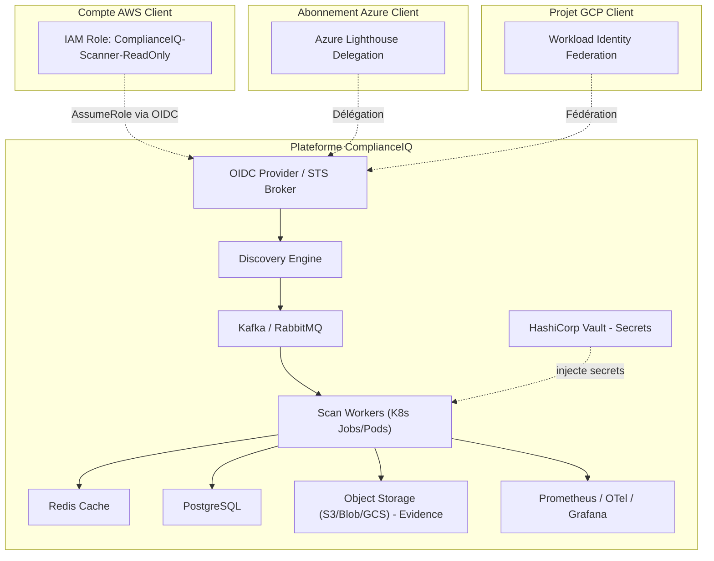
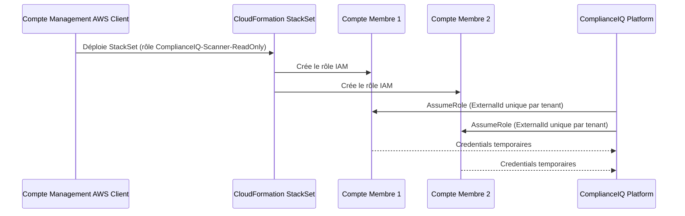
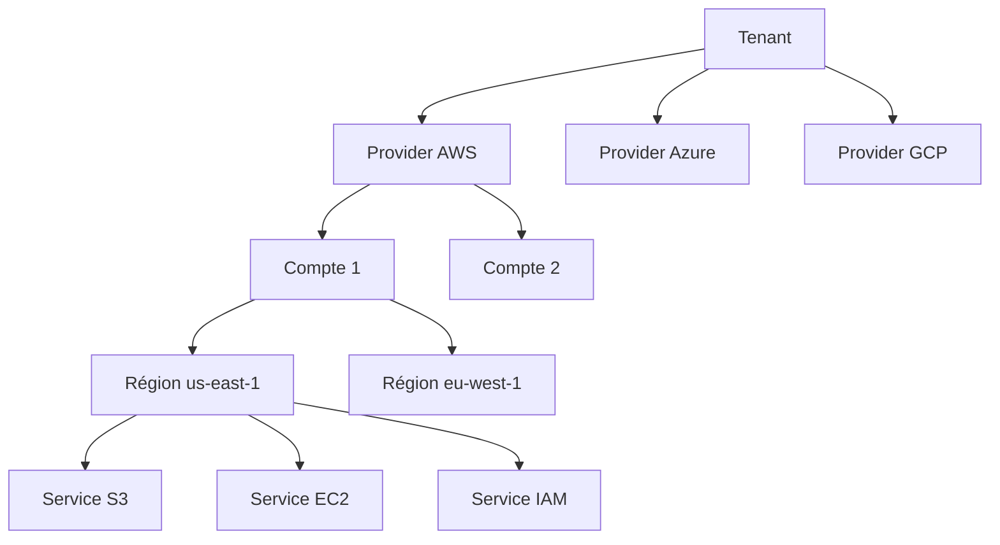
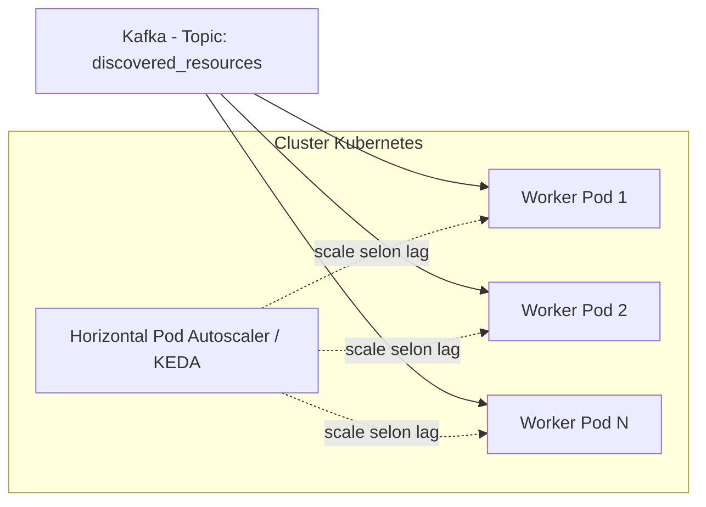

# ComplianceIQ — Scanner & Rule Engine : Architecture Cloud Native de Niveau Production

**Module :** Scanner & Rule Engine (cœur technique de ComplianceIQ)
**Rédigé par :** Cloud Solutions Architect senior — AWS / Azure / GCP / OCI / Kubernetes / DevSecOps / GRC multi-cloud
**Objectif :** dépasser le simple "appel SDK + règle basique" pour concevoir une infrastructure crédible face à un jury d'ingénieurs, comparable à un produit CSPM commercial (Wiz, Prisma Cloud, Orca, Lacework, Defender for Cloud, Security Hub).

---

## Table des matières

1. [Comment fonctionne réellement un scanner cloud professionnel](#1-comment-fonctionne-réellement-un-scanner-cloud-professionnel)
2. [Infrastructure cloud réelle à mettre en place](#2-infrastructure-cloud-réelle-à-mettre-en-place)
3. [Inspiration des leaders du marché CSPM](#3-inspiration-des-leaders-du-marché-cspm)
4. [Fonctionnalités avancées à forte valeur ajoutée](#4-fonctionnalités-avancées-à-forte-valeur-ajoutée)
5. [Scalabilité réelle : des milliers de ressources, comptes, régions, clouds](#5-scalabilité-réelle--des-milliers-de-ressources-comptes-régions-clouds)
6. [Structuration Clean Architecture du module Scanner & Rule Engine](#6-structuration-clean-architecture-du-module-scanner--rule-engine)
7. [Positionnement produit : d'un module à une plateforme SaaS](#7-positionnement-produit--dun-module-à-une-plateforme-saas)
8. [Synthèse indispensable vs optionnel](#8-synthèse-indispensable-vs-optionnel)
9. [Conclusion](#9-conclusion)

---

## 1. Comment fonctionne réellement un scanner cloud professionnel

Un scanner CSPM d'entreprise n'est pas un script qui "liste les buckets S3". C'est un **pipeline d'acquisition de données distribué, multi-identité, multi-région, multi-cloud**, dont le rôle est de produire un inventaire complet et cohérent de l'ensemble du patrimoine cloud d'une organisation, à un instant T, avec une fraîcheur et une exhaustivité mesurables.

### 1.1 Resource Discovery — les deux stratégies complémentaires

| Stratégie | Description | Avantages | Limites |
|---|---|---|---|
| **Discovery active (pull)** | Le scanner interroge directement les API du cloud provider (`ListBuckets`, `DescribeInstances`, ARG queries...) selon un cycle planifié | Exhaustive, ne dépend d'aucune configuration préalable côté client | Coût API, latence, ne détecte pas les changements en temps réel |
| **Discovery passive (push/event-driven)** | Le cloud provider notifie le scanner d'un changement (AWS Config, EventBridge, Azure Event Grid, GCP Asset Inventory feed) | Quasi temps réel, réduit la charge API | Nécessite une configuration côté tenant (permissions, abonnements aux événements), peut manquer des événements en cas de panne du bus d'événements |

**Décision d'architecture :** ComplianceIQ combine les deux. Le **scan complet planifié** (pull) reste la source de vérité garantissant l'exhaustivité et sert de filet de sécurité ; le **scan événementiel** (push) réduit le délai moyen de détection (MTTD) des dérives entre deux cycles complets, sans jamais s'y substituer — c'est exactement le rôle de complémentarité décrit dans la roadmap d'évolution du Scanner Platform.

### 1.2 Multi-comptes / multi-abonnements

Une organisation cliente n'a presque jamais un seul compte AWS ou un seul abonnement Azure. Le scanner doit donc :

1. **Découvrir la topologie d'organisation** (AWS Organizations `ListAccounts`, Azure Management Groups hierarchy, GCP Resource Manager `projects.list` sous une Organization).
2. **S'authentifier séparément dans chaque compte/abonnement/projet** via une identité déléguée (voir [2.2](#22-authentification-cross-account--cross-tenant)).
3. **Fusionner les inventaires** dans un modèle unique où chaque ressource porte un identifiant de compte/abonnement/projet d'origine, en plus du `tenant_id` client (un client ComplianceIQ = potentiellement des dizaines de comptes cloud).

### 1.3 Multi-régions

Chaque service cloud a une portée régionale, globale ou multi-régionale selon le provider :

- **AWS** : la plupart des services sont régionaux (EC2, S3 bucket metadata partiellement globale mais les objets sont régionaux, RDS...) ; IAM est global.
- **Azure** : les ressources sont attachées à une région, mais Azure Resource Graph interroge **toutes les régions d'un abonnement en une seule requête**, ce qui en fait un accélérateur majeur (voir [2.6](#26-azure-resource-graph--azure-policy)).
- **GCP** : les ressources sont zonales, régionales ou globales selon le service ; l'Asset Inventory API permet une requête cross-région/cross-projet unifiée.

Le scanner doit donc énumérer dynamiquement les régions actives d'un compte (`DescribeRegions` sur AWS, ne pas coder les régions en dur) et paralléliser la collecte par région, avec un budget de concurrence dédié (voir [Section 5](#5-scalabilité-réelle--des-milliers-de-ressources-comptes-régions-clouds)).

### 1.4 Gestion des permissions IAM nécessaires

Principe **least-privilege strict** : le scanner ne doit jamais disposer de permissions d'écriture. Un rôle de scan typique AWS ressemble à :

```json
{
  "Version": "2012-10-17",
  "Statement": [
    {
      "Effect": "Allow",
      "Action": [
        "s3:ListAllMyBuckets", "s3:GetBucketPolicy", "s3:GetBucketEncryption",
        "s3:GetBucketPublicAccessBlock", "s3:GetBucketAcl",
        "ec2:Describe*",
        "iam:Get*", "iam:List*",
        "config:Describe*", "config:Get*", "config:ListDiscoveredResources",
        "cloudtrail:DescribeTrails", "cloudtrail:GetTrailStatus",
        "sts:GetCallerIdentity"
      ],
      "Resource": "*"
    }
  ]
}
```

Cette policy est **explicitement read-only** (`Describe*`, `Get*`, `List*` uniquement) — c'est un invariant de sécurité vérifié en amont de l'onboarding d'un client (voir [2.2](#22-authentification-cross-account--cross-tenant)).

### 1.5 Collecte des métadonnées

Au-delà de la simple configuration de la ressource, un scanner professionnel collecte :

- **Métadonnées de configuration** (ce que fait la ressource) — chiffrement, réseau, IAM attaché.
- **Métadonnées relationnelles** (à quoi elle est reliée) — appartenance VPC, rôle IAM assumé, security groups attachés — indispensables pour le futur graphe de ressources et la détection de chemins d'attaque.
- **Métadonnées d'activité** (CloudTrail, Azure Activity Log, GCP Audit Logs) — qui a modifié la ressource, quand, avec quelle identité — essentiel pour distinguer une dérive légitime d'une dérive suspecte.
- **Tags/labels** — pour le scoping par tenant, environnement, criticité métier.

### 1.6 Pipeline complet d'acquisition

```mermaid
flowchart LR
    A[Trigger: Scheduler ou Event] --> B[Résolution de la topologie:\nOrganizations/Mgmt Groups/Projects]
    B --> C[AssumeRole / Lighthouse / Workload Identity\npar compte cible]
    C --> D[Énumération des régions actives]
    D --> E[Collecte parallèle par service x région x compte]
    E --> F[Récupération métadonnées relationnelles\nvia CloudTrail/Activity Log/Audit Log]
    F --> G[Normalisation -> NormalizedResource]
    G --> H[Publication sur Message Queue]
    H --> I[Rule Engine + Attack Graph + Scoring]
```



Ce pipeline est volontairement découpé en étapes indépendantes et idempotentes, chacune pouvant échouer, être retentée, ou être rejouée sans corrompre l'état global — un principe directement hérité de la conception résiliente déjà posée pour le Scanner Platform.

---

## 2. Infrastructure cloud réelle à mettre en place

### 2.1 Vue d'ensemble infrastructure



### 2.2 Authentification cross-account / cross-tenant

| Cloud | Mécanisme | Fonctionnement |
|---|---|---|
| **AWS** | Cross-Account IAM Role + `sts:AssumeRole` | Le client crée un rôle IAM dans son compte, avec une politique de confiance limitant l'assumption au compte ComplianceIQ **et exigeant un `ExternalId` unique** (mitigation du "confused deputy problem") |
| **Azure** | **Azure Lighthouse** | Délégation de gestion cross-tenant native, permettant à ComplianceIQ de gérer/lire des ressources dans le tenant client sans créer de compte invité, avec des rôles RBAC scellés au niveau de la délégation |
| **GCP** | **Workload Identity Federation (WIF)** | Élimine le besoin de clés de service statiques ; ComplianceIQ échange un jeton OIDC de sa propre identité contre des credentials GCP temporaires, scoping précis par `principalSet` |
| **Transverse** | **OIDC comme dénominateur commun** | Plutôt que de stocker des clés statiques par client, ComplianceIQ présente un jeton OIDC signé (émis par son propre IdP) que chaque cloud provider valide via son mécanisme natif de fédération (AWS IAM OIDC Identity Provider, Azure AD federated credentials, GCP WIF) |

**Pourquoi OIDC plutôt que des clés statiques :** élimine la rotation manuelle de secrets, réduit la surface d'attaque en cas de fuite (jetons de courte durée, non réutilisables hors contexte), et s'aligne avec les meilleures pratiques Zero Trust exigées par les clients entreprise lors des audits de sécurité fournisseur.

### 2.3 AWS Organizations & délégation à grande échelle

Pour les clients avec des dizaines/centaines de comptes, ComplianceIQ s'intègre avec **AWS Organizations** via un **rôle délégué au niveau du compte de management** (ou, préférence architecturale, un accès délégué **StackSets** qui déploie automatiquement le rôle de scan dans chaque compte membre lors de l'onboarding). Ceci évite au client de configurer manuellement un rôle par compte — un point de friction majeur en onboarding entreprise.



### 2.4 EventBridge, CloudTrail, AWS Config — le triptyque de la découverte événementielle AWS

- **AWS Config** : source de vérité déjà normalisée par AWS pour l'historique de configuration des ressources ; ComplianceIQ peut interroger `ListDiscoveredResources`/`GetResourceConfigHistory` comme **accélérateur d'inventaire**, en complément (pas en remplacement) de ses propres appels `Describe*`, car Config ne couvre pas 100% des types de ressources ni tous les champs pertinents pour les règles.
- **CloudTrail** : fournit le "qui a fait quoi" — essentiel pour enrichir un Finding avec l'auteur du changement, et pour la détection de dérive suspecte (une modification hors des heures ouvrées, par une identité inhabituelle, augmente la priorité opérationnelle d'un Finding sans jamais, conformément au principe Zero False Positive, transformer une corrélation en accusation).
- **EventBridge** : bus d'événements consommé pour le scan événementiel — un `PutBucketPolicy` ou un changement de Security Group publié sur EventBridge peut déclencher un **scan incrémental ciblé** de la ressource concernée en quelques secondes, sans attendre le prochain cycle complet.

### 2.5 Azure Management Groups & Azure Lighthouse

**Azure Management Groups** organisent les abonnements en hiérarchie (similaire aux OUs d'AWS Organizations). ComplianceIQ résout la hiérarchie via l'API Management Groups pour découvrir tous les abonnements sous la portée déléguée par Lighthouse, garantissant qu'un nouvel abonnement ajouté sous un Management Group existant est **automatiquement inclus** dans le périmètre de scan sans reconfiguration manuelle — un avantage architectural direct sur une intégration abonnement-par-abonnement.

### 2.6 Azure Resource Graph & Azure Policy

**Azure Resource Graph (ARG)** est un accélérateur majeur : une seule requête KQL (`Resources | where type == 'microsoft.storage/storageaccounts' | where properties.encryption.services.blob.enabled == false`) peut interroger **des milliers de ressources à travers tous les abonnements et régions délégués en quelques centaines de millisecondes**, contre des centaines d'appels ARM API individuels.

**Décision d'architecture :** ComplianceIQ traite ARG comme un **connecteur de collecte à haute performance** en complément des appels ARM ciblés pour les métadonnées non exposées par ARG (certaines configurations profondes de ressources). Une requête ARG "large" pré-filtre l'univers des ressources pertinentes ; les appels ARM détaillés ne sont faits que pour les ressources retenues — réduisant drastiquement le volume d'appels API facturables et throttlés.

**Azure Policy** n'est pas utilisé comme moteur de conformité de ComplianceIQ (le Rule Engine YAML de ComplianceIQ reste la source de vérité, cloud-agnostique par design), mais peut être **importé en lecture seule** comme signal complémentaire — les policies déjà en place chez le client sont ingérées comme métadonnées contextuelles, jamais comme substitut à l'évaluation propre de ComplianceIQ.

### 2.7 GCP — Asset Inventory & Resource Manager

Équivalent GCP d'ARG : la **Cloud Asset Inventory API** permet un export/une requête cross-projet de l'état de toutes les ressources d'une Organization en un seul appel batché, utilisé selon la même logique de pré-filtrage à haute performance.

### 2.8 Kubernetes comme plan d'exécution du scanner

Kubernetes n'est pas ici une "ressource scannée" mais **l'infrastructure d'exécution du Scanner Platform lui-même** :

| Composant K8s | Rôle |
|---|---|
| **Jobs / CronJobs** | Exécution des scans planifiés — un Job par (tenant, provider, compte) permet l'isolation d'échec et le scaling horizontal indépendant |
| **KEDA (Kubernetes Event-Driven Autoscaling)** | Scale le nombre de workers de scan en fonction de la profondeur de la file Kafka/RabbitMQ — pic de charge lors des scans planifiés massifs, scale-to-zero en heures creuses |
| **Namespaces par criticité** | Isolation des workers de scan (charge variable, tolérants aux coupures) des services API critiques (latence stricte) |
| **NetworkPolicies** | Restriction stricte des flux sortants des workers de scan aux seuls endpoints cloud provider + broker + DB, réduisant la surface d'exfiltration en cas de compromission d'un worker |

### 2.9 Message Queue : Kafka vs RabbitMQ

| Critère | Kafka | RabbitMQ |
|---|---|---|
| Modèle | Log distribué, partitionné, rejouable | File de messages classique, routage flexible (exchanges) |
| Débit | Très élevé, conçu pour le streaming à grande échelle | Élevé mais pensé pour la messagerie transactionnelle |
| Rejouabilité | Native (offset replay) — précieux pour rejouer un scan en cas de bug du Rule Engine | Nécessite un pattern de dead-lettering explicite |
| Cas d'usage ComplianceIQ | Ingestion des ressources découvertes en flux continu (potentiellement des millions d'événements/jour à grande échelle), fan-out vers Rule Engine + Attack Graph + Score en parallèle | Orchestration de tâches ponctuelles (déclenchement d'un scan spécifique, notification de fin de scan) |

**Décision :** **Kafka pour le flux de données de scan** (ressources découvertes, Findings) en raison du volume et de la valeur de la rejouabilité pour le debug/audit ; **RabbitMQ (ou une alternative légère comme Redis Streams/Celery)** pour l'orchestration de tâches de contrôle (déclenchement, notifications) où le volume est bien plus faible et le routage par exchange est plus naturel. Les deux ne sont pas redondants : ils répondent à des patterns différents (event streaming vs task queuing).

### 2.10 Redis, PostgreSQL, Object Storage — rôles précis

- **Redis** : cache de règles compilées (voir Policy-as-Code), déduplication de scan (éviter de re-scanner une ressource déjà traitée dans la fenêtre du cycle courant), rate-limiting distribué par tenant/provider (token bucket partagé entre workers).
- **PostgreSQL** : source de vérité transactionnelle — Findings, scans, scores, historique de dérive, table outbox.
- **Object Storage (S3/Blob/GCS)** : stockage des **preuves brutes** (raw evidence) — réponses API complètes, exports ARG/Asset Inventory — avec politique de rétention et chiffrement, référencées depuis PostgreSQL par pointeur (`raw_evidence_ref`), jamais dupliquées dans la base relationnelle.

### 2.11 Gestion des secrets avec Vault

**HashiCorp Vault** centralise :

- les `ExternalId` par tenant (AWS),
- les configurations de délégation Lighthouse/WIF,
- les certificats/clés utilisés pour signer les jetons OIDC présentés aux clouds providers.

Les workers de scan **ne reçoivent jamais un secret statique en variable d'environnement** — ils s'authentifient auprès de Vault via leur identité Kubernetes (Vault Kubernetes Auth Method), reçoivent un bail (`lease`) à courte durée de vie, et Vault gère la rotation automatique. C'est la même philosophie Zero Trust que l'authentification cross-cloud OIDC (voir [2.2](#22-authentification-cross-account--cross-tenant)).

### 2.12 Observabilité de la plateforme de scan elle-même

En complément de l'observabilité applicative déjà définie pour le Scanner Platform (logs structurés, métriques Prometheus, traces OpenTelemetry), l'infrastructure cloud-native ajoute :

- **Métriques d'infrastructure Kubernetes** (utilisation CPU/mémoire des workers, profondeur de file Kafka, taux de scaling KEDA).
- **Dashboards Grafana dédiés par cloud provider** — un opérateur doit pouvoir voir en un coup d'œil si le ralentissement vient d'un throttling AWS spécifique, d'une latence ARG Azure, ou d'un goulot d'étranglement interne.

---

## 3. Inspiration des leaders du marché CSPM

L'objectif ici est de comprendre les approches techniques **sans copier** de solution propriétaire, et d'en extraire des patterns architecturaux transposables.

| Solution | Approche technique distinctive | Ce que ComplianceIQ en retient |
|---|---|---|
| **Wiz** | **Agentless, side-scanning des disques** (analyse des volumes cloud sans agent installé sur les VMs) combiné à un **Security Graph** unifiant IAM, réseau, vulnérabilités et secrets en un seul graphe interrogeable | Le principe agentless (permissions read-only, aucun agent à déployer chez le client) et le graphe unifié multi-dimensions, déjà au cœur de l'Attack Graph Engine de ComplianceIQ |
| **Prisma Cloud (Palo Alto)** | Couverture très large (CSPM + CWPP + CIEM + IaC scanning) avec un moteur de policy centralisé multi-cloud | La logique Policy-as-Code centralisée et cloud-agnostique, transposée dans le Rule Engine YAML de ComplianceIQ |
| **Orca Security** | Egalement agentless side-scanning, avec un fort accent sur la **priorisation par contexte** (un Finding critique sur une ressource isolée du réseau pèse moins qu'un Finding moyen sur une ressource exposée publiquement et reliée à des données sensibles) | La priorisation contextuelle, retrouvée dans la pondération `exploitability_weight` de l'Attack Graph et le scoring pondéré par sévérité/framework de ComplianceIQ |
| **Lacework** | Forte orientation **data-driven / anomaly detection** sur les logs d'activité (comportement inhabituel plutôt que règles statiques uniquement) | Piste d'évolution documentée : enrichir les Findings avec un signal comportemental (CloudTrail/Activity Log) sans jamais remplacer l'évaluation déterministe par un modèle de détection d'anomalies non auditable — cohérent avec le principe Zero False Positive |
| **Microsoft Defender for Cloud** | Intégration native avec Azure Resource Graph et Azure Policy, forte télémétrie native à la plateforme | Confirme la pertinence d'ARG comme accélérateur de collecte (voir [2.6](#26-azure-resource-graph--azure-policy)) plutôt qu'un choix propriétaire arbitraire |
| **AWS Security Hub / Inspector** | Security Hub agrège des findings de multiples sources (GuardDuty, Inspector, Config Rules) dans un format normalisé (**AWS Security Finding Format, ASFF**) ; Inspector se concentre sur le scan de vulnérabilités logicielles (CVE) sur EC2/ECR/Lambda | Le concept de **format de Finding normalisé et agrégeable**, qui inspire directement le schéma JSON versionné utilisé pour publier les Findings vers Student B (AI Risk Platform) |

**Différenciation de ComplianceIQ :** contrairement à la plupart de ces solutions qui exposent un score de risque parfois opaque, ComplianceIQ s'engage architecturalement sur trois garanties rarement toutes réunies chez les leaders du marché : (1) **Zero False Positive par construction** (incertitude comme objet de premier ordre plutôt que discrète), (2) **Policy-as-Code totalement auditable** par des non-développeurs (YAML versionné, pas de black-box), et (3) **scoring entièrement traçable et reproductible** (formule pondérée déterministe, jamais un modèle ML opaque comme score primaire).

---

## 4. Fonctionnalités avancées à forte valeur ajoutée

### 4.1 Scan incrémental

Plutôt que de re-scanner l'intégralité d'un environnement à chaque cycle, ComplianceIQ maintient un **état de référence (baseline)** par ressource (hash de sa configuration normalisée). Un cycle incrémental :

1. Récupère uniquement les ressources modifiées depuis le dernier scan (via CloudTrail/Activity Log/Audit Log comme filtre, ou via le champ `lastModifiedTime` natif quand disponible).
2. Re-normalise et ré-évalue **uniquement** ces ressources.
3. Fusionne le résultat avec le baseline pour produire un snapshot complet sans avoir tout re-collecté.

Un **scan complet planifié** (ex. hebdomadaire) reste nécessaire en filet de sécurité pour rattraper les ressources dont le changement n'a pas été détecté par la couche événementielle — cohérent avec la stratégie hybride pull/push de la [Section 1.1](#11-resource-discovery--les-deux-stratégies-complémentaires).

### 4.2 Scan parallèle et architecture distribuée

Le parallélisme est appliqué à **quatre niveaux orthogonaux**, chacun avec son propre budget de concurrence pour éviter qu'un niveau ne sature les autres :



Chaque nœud de cet arbre correspond à une unité de travail pouvant être distribuée sur un worker Kubernetes distinct, orchestrée via des tâches Kafka consumer-group (partitionnées par `tenant_id` pour garantir l'ordre de traitement des événements d'un même tenant tout en parallélisant across tenants).

### 4.3 Scheduler intelligent

Un scheduler naïf ("scanner tout, toutes les X heures") ne survit pas à un portefeuille de clients hétérogènes. Le Scheduler de ComplianceIQ priorise dynamiquement selon :

- **Fraîcheur des données** (une ressource jamais scannée passe avant une ressource scannée il y a 1h).
- **Criticité tenant/ressource** (un environnement de production avec des Findings CRITICAL récents est re-scanné plus fréquemment qu'un environnement de test stable).
- **Signal événementiel** (un événement CloudTrail sur une ressource déclenche un scan incrémental ciblé, indépendamment du cycle planifié).
- **Budget API et quotas provider** (le scheduler répartit la charge dans le temps pour ne jamais dépasser les quotas de rate-limiting négociés par tenant, en coordination avec le rate-limiter Redis de [2.10](#210-redis-postgresql-object-storage--rôles-précis)).

### 4.4 Scan orienté événements

Déjà détaillé en [1.1](#11-resource-discovery--les-deux-stratégies-complémentaires) et [2.4](#24-eventbridge-cloudtrail-aws-config--le-triptyque-de-la-découverte-événementielle-aws) — la valeur ajoutée est la réduction du MTTD (mean time to detect) d'une dérive de plusieurs heures à quelques secondes/minutes pour les événements couverts, sans compromettre l'exhaustivité garantie par les scans planifiés complets.

### 4.5 Corrélation inter-services et graphe de ressources

Au-delà de l'évaluation par ressource isolée, ComplianceIQ construit un **graphe de relations** (VPC ↔ Security Group ↔ Instance ↔ Rôle IAM ↔ Politique ↔ Bucket) qui alimente directement l'Attack Graph Engine déjà spécifié dans l'architecture du Scanner Platform — la valeur métier n'est pas "ce bucket est public" isolément, mais "ce bucket public est accessible depuis un rôle qui peut aussi assumer un rôle admin", une corrélation qu'aucune règle unitaire ne peut détecter seule.

### 4.6 Optimisation des performances à grande échelle

- **Pré-filtrage via ARG/Asset Inventory** avant les appels API détaillés coûteux (voir [2.6](#26-azure-resource-graph--azure-policy)).
- **Déduplication de scan** via Redis (une ressource déjà collectée dans la fenêtre du cycle courant, identifiée par son identité canonique, n'est pas re-collectée si un événement redondant arrive).
- **Compression et batching** des écritures PostgreSQL (insertions en lot plutôt que ligne par ligne, déjà illustré dans le `PostgresFindingRepository` du document d'architecture principal).
- **Cache des règles compilées** (Redis) pour éviter de recompiler le YAML à chaque scan (voir Policy-as-Code, déjà spécifié).

---

## 5. Scalabilité réelle : des milliers de ressources, comptes, régions, clouds

### 5.1 Les axes de scalabilité

| Axe | Stratégie |
|---|---|
| **Volume de ressources** | Pagination systématique des appels API (`NextToken`/`ContinuationToken`), streaming des résultats vers Kafka plutôt que chargement en mémoire complet, traitement par worker en flux continu |
| **Nombre de comptes** | Parallélisation par compte via des tâches Kubernetes/Kafka indépendantes ; l'échec d'un compte n'affecte jamais la collecte des autres (bulkhead déjà spécifié au niveau applicatif, ici étendu au niveau infrastructure) |
| **Nombre de régions** | Découverte dynamique des régions actives (jamais codées en dur), parallélisation par région avec un plafond de concurrence par compte pour respecter les quotas API |
| **Nombre de clouds** | Le modèle `NormalizedResource` cloud-agnostique et le port `ScannerConnector` garantissent qu'ajouter un cloud ne change jamais le Rule Engine, le Scoring, ni l'Attack Graph (principe déjà posé dans l'architecture Clean) |

### 5.2 Dimensionnement horizontal



Le nombre de workers scale horizontalement selon la profondeur (**lag**) de la file Kafka, garantissant qu'un pic de charge (par exemple, l'onboarding simultané de plusieurs gros clients) est absorbé par l'ajout automatique de capacité de traitement, sans intervention manuelle.

### 5.3 Isolation multi-tenant à l'échelle infrastructure

Chaque tenant se voit assigner une **clé de partition Kafka** dérivée de son `tenant_id`, garantissant l'ordre de traitement de ses propres événements tout en permettant un parallélisme total entre tenants différents. Côté base de données, le partitionnement PostgreSQL par plage de `tenant_id` (ou par table dédiée pour les très gros comptes entreprise) est une évolution documentée pour les déploiements dépassant plusieurs millions de Findings.

### 5.4 Limites et compromis assumés

- La parallélisation maximale est toujours bornée par les **quotas API imposés par chaque cloud provider** — aucune architecture ne peut contourner un throttling AWS/Azure/GCP ; le rate-limiter Redis par tenant/provider (voir [2.10](#210-redis-postgresql-object-storage--rôles-précis)) est donc un composant **indispensable**, pas un luxe.
- Le scan événementiel réduit le MTTD mais **ne remplace jamais** le scan planifié complet — un compromis assumé en faveur de l'exhaustivité (cohérent avec le principe Zero False Positive : mieux vaut un léger délai de détection qu'une conclusion erronée basée sur un flux d'événements incomplet).

---

## 6. Structuration Clean Architecture du module Scanner & Rule Engine

Cette section affine, pour le module Scanner & Rule Engine spécifiquement, la structure Clean Architecture déjà posée au niveau du Scanner Platform global, en y intégrant explicitement les composants d'infrastructure cloud native décrits ci-dessus.

```text
scanner-rule-engine/
├── domain/
│   ├── model/                     # NormalizedResource, Rule, Finding, ResourceRelationship...
│   ├── ports/
│   │   ├── scanner_connector.py    # Port de collecte, cloud-agnostique
│   │   ├── discovery_port.py       # Port de découverte de topologie (comptes/régions/projets)
│   │   ├── identity_broker_port.py # Port d'obtention de credentials temporaires (AssumeRole/Lighthouse/WIF)
│   │   ├── rule_repository.py
│   │   └── evidence_store_port.py  # Port de stockage des preuves brutes
│   └── errors.py
├── application/
│   ├── use_cases/
│   │   ├── discovery_engine.py     # Résout la topologie multi-compte/région/projet
│   │   ├── scan_orchestrator.py
│   │   ├── incremental_scan_planner.py
│   │   ├── rule_engine.py
│   │   ├── compliance_evaluator.py
│   │   ├── evidence_collector.py   # Coordonne la collecte de métadonnées relationnelles/activité
│   │   ├── report_generator.py
│   │   └── scheduler.py            # Scheduler intelligent (priorisation dynamique)
│   └── dto/
├── infrastructure/
│   ├── cloud/
│   │   ├── aws/
│   │   │   ├── connector.py         # ScannerConnector
│   │   │   ├── discovery.py         # AWS Organizations, DescribeRegions
│   │   │   ├── identity.py          # AssumeRole + ExternalId, OIDC
│   │   │   └── normalizers.py
│   │   ├── azure/
│   │   │   ├── connector.py
│   │   │   ├── resource_graph.py     # Client ARG (accélérateur)
│   │   │   ├── discovery.py          # Management Groups
│   │   │   ├── identity.py           # Lighthouse
│   │   │   └── normalizers.py
│   │   └── gcp/
│   │       ├── connector.py
│   │       ├── asset_inventory.py
│   │       ├── discovery.py           # Resource Manager
│   │       ├── identity.py            # Workload Identity Federation
│   │       └── normalizers.py
│   ├── messaging/
│   │   ├── kafka_producer.py / kafka_consumer.py   # Flux de données de scan
│   │   └── rabbitmq_client.py                       # Orchestration de tâches de contrôle
│   ├── persistence/{postgres,redis,object_storage}/
│   ├── secrets/
│   │   └── vault_client.py
│   ├── resilience/                 # Retry, CircuitBreaker, Bulkhead, RateLimiter distribué (Redis)
│   ├── observability/
│   ├── k8s/
│   │   ├── manifests/               # Jobs, CronJobs, KEDA ScaledObjects, NetworkPolicies
│   │   └── helm/
│   └── api/
├── rules/
├── config/
├── tests/
│   ├── unit/ contract/ integration/ e2e/ chaos/ performance/ security/ architecture/
│   └── fakes/
│       ├── fake_discovery_engine.py
│       ├── fake_identity_broker.py     # Simule AssumeRole/Lighthouse/WIF sans réseau
│       └── ...
└── docs/architecture/
```

**Points d'attention architecturaux spécifiques à ce module :**

- Le **Discovery Engine** est un cas d'usage à part entière (`application/use_cases/discovery_engine.py`), distinct du `ScanOrchestrator` — il répond à la question "quels comptes/régions/projets existent" avant que l'orchestrateur ne réponde à "quelles ressources scanner dans ce périmètre". Cette séparation permet de tester la logique de résolution de topologie indépendamment de la logique de collecte.
- L'**Identity Broker** (`identity_broker_port.py`) est isolé comme port dédié, distinct du `ScannerConnector`, car l'obtention de credentials temporaires (AssumeRole, Lighthouse, WIF) est une préoccupation transverse aux trois providers, avec une seule interface (`get_temporary_credentials(tenant_id, account_id) -> Credentials`) — évitant de dupliquer la logique d'authentification dans chaque connecteur.
- L'**Evidence Collector** est séparé du `RuleEngine` : il a la responsabilité de récupérer les métadonnées relationnelles et d'activité (CloudTrail/Activity Log/Audit Log) qui enrichissent un `NormalizedResource`, mais n'évalue aucune règle — respectant la séparation stricte collecte/évaluation déjà actée dans l'architecture Clean Architecture globale.
- Le dossier `infrastructure/k8s/` documente explicitement les manifests d'exécution (Jobs, KEDA, NetworkPolicies) car ils font partie intégrante de l'infrastructure adaptatrice du système, même s'ils ne sont pas du code Python — un choix qui rend l'infrastructure d'exécution aussi auditable et versionnée que le code applicatif.

---

## 7. Positionnement produit : d'un module à une plateforme SaaS

| Dimension | État "module" (aujourd'hui) | Évolution vers plateforme SaaS commerciale |
|---|---|---|
| Onboarding client | Configuration manuelle d'un rôle IAM par compte | Déploiement automatisé via StackSets (AWS), délégation Lighthouse en un clic (Azure), Terraform module officiel publié pour GCP |
| Isolation tenant | Filtrage applicatif par `tenant_id` | Partitionnement infrastructure (Kafka, PostgreSQL) pour les tenants à très fort volume, avec option d'isolation physique dédiée pour les clients réglementés |
| Scan | Cycle planifié + incrémental | Ajout d'un mode "scan à la demande" self-service exposé via API/UI, avec quota par plan tarifaire |
| Résilience | Retry/Circuit Breaker par appel | SLA contractuel avec runbooks d'astreinte, multi-région pour la plateforme elle-même (pas seulement pour les clients scannés) |
| Conformité de la plateforme elle-même | Bonnes pratiques internes | Certification SOC 2 Type II / ISO 27001 de ComplianceIQ elle-même — un prérequis commercial quasi systématique pour vendre un produit qui audite la sécurité d'autrui |

Cette trajectoire ne nécessite **aucune réécriture architecturale** : chaque évolution s'appuie sur des ports déjà définis (Identity Broker, Discovery Engine, Evidence Store) et des choix déjà pris pour la scalabilité horizontale (Kafka, Kubernetes, KEDA) — la conception présentée ici est délibérément pensée pour absorber la croissance sans dette d'architecture.

---

## 8. Synthèse indispensable vs optionnel

| Composant | Statut | Justification |
|---|---|---|
| `ScannerConnector` + `NormalizedResource` cloud-agnostique | **Indispensable** | Fondation de tout le reste de l'architecture (Rule Engine, Attack Graph, Scoring) |
| Cross-Account IAM Role / Lighthouse / WIF (identité déléguée) | **Indispensable** | Aucun scan multi-tenant sécurisé n'est possible sans authentification déléguée least-privilege |
| OIDC comme socle de fédération | **Indispensable** | Élimine les secrets statiques, exigence de sécurité de facto pour un produit GRC |
| Redis (cache règles + dédup + rate-limit) | **Indispensable** | Sans cache de règles, chaque scan recompile le YAML ; sans rate-limiter distribué, le throttling provider casse la fiabilité à l'échelle |
| PostgreSQL + Outbox | **Indispensable** | Source de vérité transactionnelle, déjà justifiée dans l'architecture principale |
| Kafka (flux de données de scan) | **Indispensable à l'échelle**, différable en tout début de projet (un simple worker pool suffit pour un POC à faible volume) | Nécessaire dès que le volume de ressources/tenants dépasse ce qu'un pool de threads/process unique peut absorber |
| RabbitMQ (orchestration de tâches) | **Optionnel** — peut être remplacé par Redis Streams/Celery en début de projet | Le besoin fonctionnel (déclenchement, notification) est simple ; RabbitMQ apporte une robustesse de routage utile à l'échelle mais n'est pas un prérequis jour 1 |
| Azure Resource Graph / GCP Asset Inventory | **Fortement recommandé, non strictement indispensable** | Accélère la collecte de manière spectaculaire à l'échelle ; un MVP peut fonctionner avec des appels ARM/API classiques mais souffrira en performance dès plusieurs milliers de ressources |
| AWS Config | **Optionnel** | Utile comme accélérateur d'inventaire complémentaire, mais ComplianceIQ doit rester capable de fonctionner sans (tous les clients n'activent pas Config partout) |
| Kubernetes + KEDA | **Indispensable pour une trajectoire SaaS**, optionnel pour un déploiement mono-tenant à faible échelle | Le scaling horizontal automatique est ce qui permet d'absorber la charge hétérogène d'un portefeuille multi-client |
| Vault | **Fortement recommandé** | Une alternative moins mature (secrets manager cloud natif type AWS Secrets Manager seul) est acceptable en V1, mais Vault apporte l'agnosticisme multi-cloud et la gestion de bail dynamique qu'un secrets manager unique-cloud ne couvre pas nativement |
| Attack Graph / corrélation inter-services | **Différenciateur produit, non bloquant pour un MVP fonctionnel** | Apporte la valeur ajoutée qui distingue ComplianceIQ d'un simple vérificateur de règles, mais le Rule Engine seul reste utilisable sans lui |

---

## 9. Conclusion

L'architecture décrite ici transforme le module Scanner & Rule Engine d'un "vérificateur de règles basique" en une **véritable plateforme d'acquisition et d'analyse cloud distribuée**, comparable dans ses principes fondateurs (agentless, cloud-agnostique, graphe de ressources, priorisation contextuelle) aux approches des leaders du marché CSPM, tout en conservant les garanties différenciantes de ComplianceIQ : Zero False Positive, Policy-as-Code totalement auditable, et scoring déterministe et traçable.

Chaque brique d'infrastructure — délégation d'identité cross-cloud via OIDC, accélérateurs natifs (ARG, Asset Inventory), streaming Kafka, scaling Kubernetes/KEDA, gestion de secrets Vault — s'intègre dans les ports déjà définis par la Clean Architecture du Scanner Platform, sans jamais compromettre la pureté du Domain ni la testabilité offline déjà actées comme principes directeurs. C'est cette discipline architecturale, plus que l'accumulation de technologies, qui rend crédible la trajectoire vers une plateforme SaaS de conformité multi-cloud à l'échelle commerciale.

---

*Fin du document — ComplianceIQ, Module Scanner & Rule Engine : Architecture Cloud Native.*
